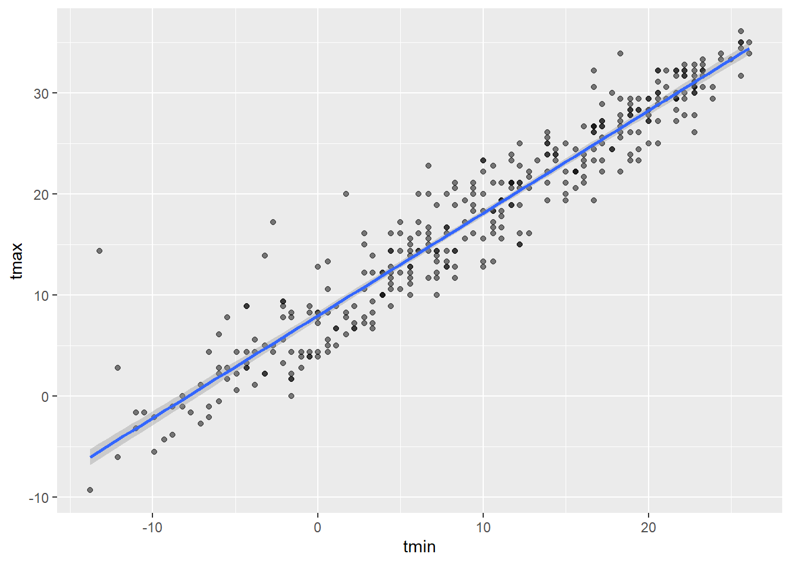
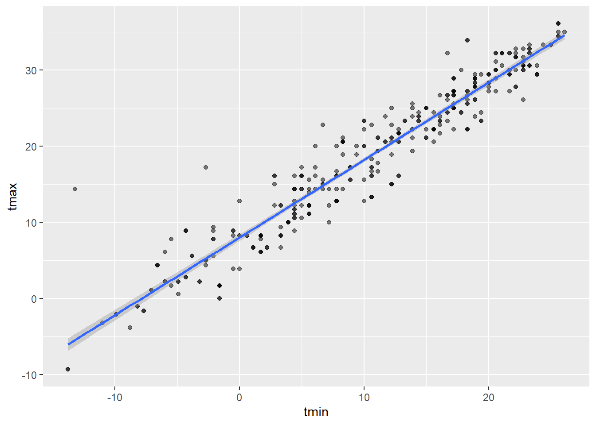
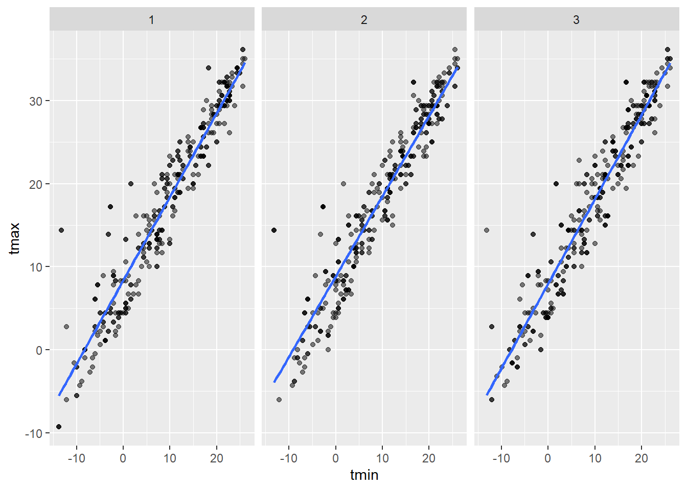

#  Libraries

```r
library(tidyverse)
```

```
## ── Attaching core tidyverse packages ──────────────────────── tidyverse 2.0.0 ──
## ✔ dplyr     1.1.2     ✔ readr     2.1.4
## ✔ forcats   1.0.0     ✔ stringr   1.5.0
## ✔ ggplot2   3.4.2     ✔ tibble    3.2.1
## ✔ lubridate 1.9.2     ✔ tidyr     1.3.0
## ✔ purrr     1.0.1     
## ── Conflicts ────────────────────────────────────────── tidyverse_conflicts() ──
## ✖ dplyr::filter() masks stats::filter()
## ✖ dplyr::lag()    masks stats::lag()
## ℹ Use the conflicted package (<http://conflicted.r-lib.org/>) to force all conflicts to become errors
```

```r
library(modelr)
library(mgcv)
```

```
## Loading required package: nlme
## 
## Attaching package: 'nlme'
## 
## The following object is masked from 'package:dplyr':
## 
##     collapse
## 
## This is mgcv 1.9-0. For overview type 'help("mgcv-package")'.
```


# Problem 2

### Running initial code provided: Downloading the data


Simple linear regression

```r
fit = lm(tmax~ tmin + prcp, data=weather_df)
summary(fit)
```

```
## 
## Call:
## lm(formula = tmax ~ tmin + prcp, data = weather_df)
## 
## Residuals:
##     Min      1Q  Median      3Q     Max 
## -6.3705 -1.9950 -0.0249  1.4974 20.4503 
## 
## Coefficients:
##              Estimate Std. Error t value Pr(>|t|)    
## (Intercept)  8.042803   0.230065  34.959   <2e-16 ***
## tmin         1.013386   0.016154  62.734   <2e-16 ***
## prcp        -0.001541   0.002103  -0.733    0.464    
## ---
## Signif. codes:  0 '***' 0.001 '**' 0.01 '*' 0.05 '.' 0.1 ' ' 1
## 
## Residual standard error: 2.956 on 362 degrees of freedom
## Multiple R-squared:  0.916,	Adjusted R-squared:  0.9155 
## F-statistic:  1972 on 2 and 362 DF,  p-value: < 2.2e-16
```

```r
fit |> 
ggplot(aes(x = tmin, y = tmax)) + 
  geom_point(alpha = .5) +
  stat_smooth(method = "lm")
```

```
## `geom_smooth()` using formula = 'y ~ x'
```



Initial boot-strap function

```r
boot_sample = function(df) {
  sample_frac(df, replace = TRUE)
}

boot_sample(weather_df) |> 
  ggplot(aes(x = tmin, y = tmax)) + 
  geom_point(alpha = .5) +
  stat_smooth(method = "lm")
```

```
## `geom_smooth()` using formula = 'y ~ x'
```



Multiple boot-strap samples

```r
boot_straps = 
  tibble(strap_number = 1:5000) |> 
  mutate(
    strap_sample = map(strap_number, \(i) boot_sample(df = weather_df))
  )

boot_straps
```

```
## # A tibble: 5,000 × 2
##    strap_number strap_sample      
##           <int> <list>            
##  1            1 <tibble [365 × 6]>
##  2            2 <tibble [365 × 6]>
##  3            3 <tibble [365 × 6]>
##  4            4 <tibble [365 × 6]>
##  5            5 <tibble [365 × 6]>
##  6            6 <tibble [365 × 6]>
##  7            7 <tibble [365 × 6]>
##  8            8 <tibble [365 × 6]>
##  9            9 <tibble [365 × 6]>
## 10           10 <tibble [365 × 6]>
## # ℹ 4,990 more rows
```

```r
boot_straps |> 
  slice(1:3) |> 
  mutate(strap_sample = map(strap_sample, arrange, tmin)) |> 
  pull(strap_sample)
```

```
## [[1]]
## # A tibble: 365 × 6
##    name           id          date        prcp  tmax  tmin
##    <chr>          <chr>       <date>     <dbl> <dbl> <dbl>
##  1 CentralPark_NY USW00094728 2022-12-24     0  -9.3 -13.8
##  2 CentralPark_NY USW00094728 2022-12-24     0  -9.3 -13.8
##  3 CentralPark_NY USW00094728 2022-12-24     0  -9.3 -13.8
##  4 CentralPark_NY USW00094728 2022-12-23   465  14.4 -13.2
##  5 CentralPark_NY USW00094728 2022-12-23   465  14.4 -13.2
##  6 CentralPark_NY USW00094728 2022-01-15     0  -6   -12.1
##  7 CentralPark_NY USW00094728 2022-01-16    94   2.8 -12.1
##  8 CentralPark_NY USW00094728 2022-01-22     0  -1.6 -10.5
##  9 CentralPark_NY USW00094728 2022-12-25     0  -2.1  -9.9
## 10 CentralPark_NY USW00094728 2022-01-21     0  -5.5  -9.9
## # ℹ 355 more rows
## 
## [[2]]
## # A tibble: 365 × 6
##    name           id          date        prcp  tmax  tmin
##    <chr>          <chr>       <date>     <dbl> <dbl> <dbl>
##  1 CentralPark_NY USW00094728 2022-12-23   465  14.4 -13.2
##  2 CentralPark_NY USW00094728 2022-12-23   465  14.4 -13.2
##  3 CentralPark_NY USW00094728 2022-12-23   465  14.4 -13.2
##  4 CentralPark_NY USW00094728 2022-01-15     0  -6   -12.1
##  5 CentralPark_NY USW00094728 2022-01-11     0  -4.3  -9.3
##  6 CentralPark_NY USW00094728 2022-02-14     0  -3.8  -8.8
##  7 CentralPark_NY USW00094728 2022-02-15     0  -1    -8.8
##  8 CentralPark_NY USW00094728 2022-02-14     0  -3.8  -8.8
##  9 CentralPark_NY USW00094728 2022-02-06     0  -1    -8.2
## 10 CentralPark_NY USW00094728 2022-01-27     0   0    -8.2
## # ℹ 355 more rows
## 
## [[3]]
## # A tibble: 365 × 6
##    name           id          date        prcp  tmax  tmin
##    <chr>          <chr>       <date>     <dbl> <dbl> <dbl>
##  1 CentralPark_NY USW00094728 2022-12-23   465  14.4 -13.2
##  2 CentralPark_NY USW00094728 2022-01-15     0  -6   -12.1
##  3 CentralPark_NY USW00094728 2022-01-16    94   2.8 -12.1
##  4 CentralPark_NY USW00094728 2022-01-16    94   2.8 -12.1
##  5 CentralPark_NY USW00094728 2022-01-15     0  -6   -12.1
##  6 CentralPark_NY USW00094728 2022-01-30     0  -3.2 -11  
##  7 CentralPark_NY USW00094728 2022-12-25     0  -2.1  -9.9
##  8 CentralPark_NY USW00094728 2022-01-11     0  -4.3  -9.3
##  9 CentralPark_NY USW00094728 2022-02-14     0  -3.8  -8.8
## 10 CentralPark_NY USW00094728 2022-01-27     0   0    -8.2
## # ℹ 355 more rows
```

```r
boot_straps |> 
  slice(1:3) |> 
  unnest(strap_sample) |> 
  ggplot(aes(x = tmin, y = tmax)) + 
  geom_point(alpha = .5) +
  stat_smooth(method = "lm", se = FALSE) +
  facet_grid(~strap_number)
```

```
## `geom_smooth()` using formula = 'y ~ x'
```



Analyzing Bootstrap Models?


```r
bootstrap_results = 
  boot_straps |> 
  mutate(
    models = map(strap_sample, \(df) lm(tmax ~ tmin+prcp, data = df) ),
    results = map(models, broom::tidy)) |> 
  select(-strap_sample, -models) |> 
  unnest(results) 

bootstrap_results |> 
  group_by(term) |> 
  summarize(boot_se = sd(estimate)) |> 
  knitr::kable(digits = 3)
```


|term        | boot_se|
|:-----------|-------:|
|(Intercept) |   0.232|
|prcp        |   0.005|
|tmin        |   0.019|

More efficient code?


