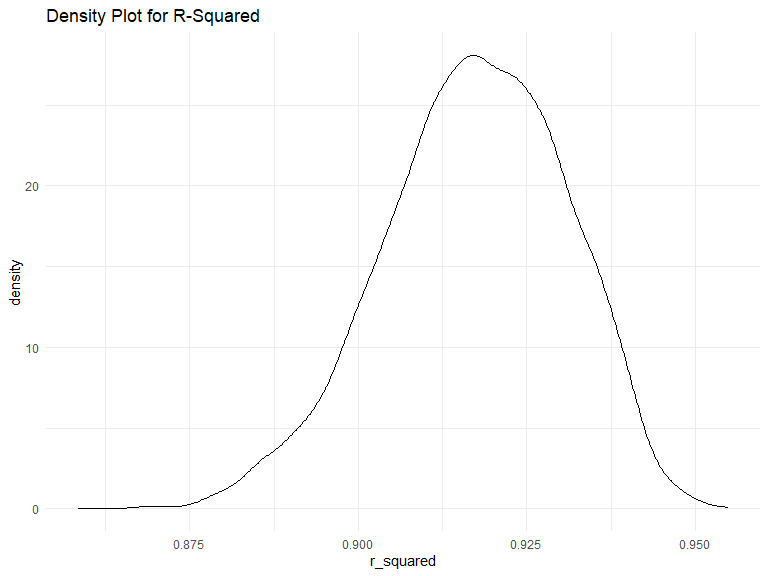
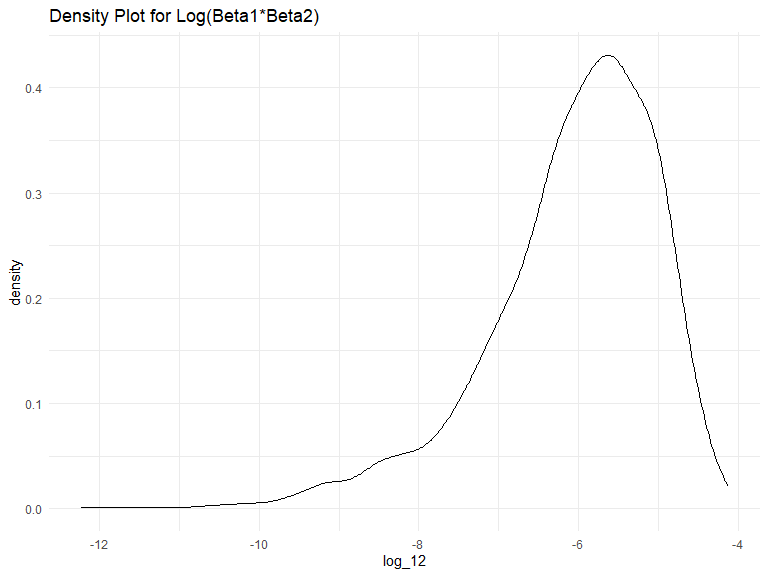
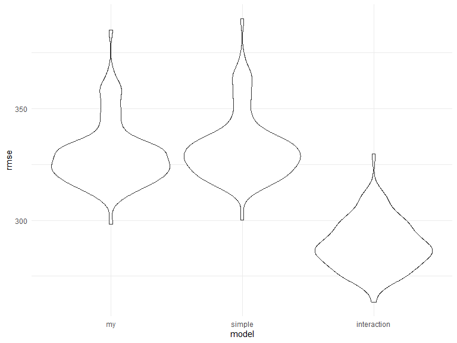

Homework 6
================
Andy Turner
2023-11-26

# Libraries

``` r
library(tidyverse)
```

    ## ── Attaching core tidyverse packages ──────────────────────── tidyverse 2.0.0 ──
    ## ✔ dplyr     1.1.2     ✔ readr     2.1.4
    ## ✔ forcats   1.0.0     ✔ stringr   1.5.0
    ## ✔ ggplot2   3.4.2     ✔ tibble    3.2.1
    ## ✔ lubridate 1.9.2     ✔ tidyr     1.3.0
    ## ✔ purrr     1.0.1     
    ## ── Conflicts ────────────────────────────────────────── tidyverse_conflicts() ──
    ## ✖ dplyr::filter() masks stats::filter()
    ## ✖ dplyr::lag()    masks stats::lag()
    ## ℹ Use the conflicted package (<http://conflicted.r-lib.org/>) to force all conflicts to become errors

``` r
library(modelr)
library(mgcv)
```

    ## Loading required package: nlme
    ## 
    ## Attaching package: 'nlme'
    ## 
    ## The following object is masked from 'package:dplyr':
    ## 
    ##     collapse
    ## 
    ## This is mgcv 1.9-0. For overview type 'help("mgcv-package")'.

``` r
library(purrr)
library(viridis)
```

    ## Loading required package: viridisLite

``` r
knitr::opts_chunk$set(
    echo = TRUE,
    warning = FALSE,
    fig.width = 8, 
  fig.height = 6,
  out.width = "90%"
)

options(
  ggplot2.continuous.colour = "viridis",
  ggplot2.continuous.fill = "viridis"
)

scale_colour_discrete = scale_colour_viridis_d
scale_fill_discrete = scale_fill_viridis_d

theme_set(theme_minimal() + theme(legend.position = "bottom"))
```

### Problem 1

In the data cleaning code below we create a `city_state` variable,
change `victim_age` to numeric, modifiy victim_race to have categories
white and non-white, with white as the reference category, and create a
`resolution` variable indicating whether the homicide is solved. Lastly,
we filtered out the following cities: Tulsa, AL; Dallas, TX; Phoenix,
AZ; and Kansas City, MO; and we retained only the variables
`city_state`, `resolution`, `victim_age`, `victim_sex`, and
`victim_race`.

``` r
homicide_df = 
  read_csv("data/homicide-data.csv", na = c("", "NA", "Unknown")) |> 
  mutate(
    city_state = str_c(city, state, sep = ", "),
    victim_age = as.numeric(victim_age),
    resolution = case_when(
      disposition == "Closed without arrest" ~ 0,
      disposition == "Open/No arrest"        ~ 0,
      disposition == "Closed by arrest"      ~ 1)
  ) |> 
  filter(victim_race %in% c("White", "Black")) |> 
  filter(!(city_state %in% c("Tulsa, AL", "Dallas, TX", "Phoenix, AZ", "Kansas City, MO"))) |> 
  select(city_state, resolution, victim_age, victim_sex, victim_race)
```

    ## Rows: 52179 Columns: 12
    ## ── Column specification ────────────────────────────────────────────────────────
    ## Delimiter: ","
    ## chr (8): uid, victim_last, victim_first, victim_race, victim_sex, city, stat...
    ## dbl (4): reported_date, victim_age, lat, lon
    ## 
    ## ℹ Use `spec()` to retrieve the full column specification for this data.
    ## ℹ Specify the column types or set `show_col_types = FALSE` to quiet this message.

Next we fit a logistic regression model using only data from Baltimore,
MD. We model `resolved` as the outcome and `victim_age`, `victim_sex`,
and `victim_race` as predictors. We save the output as `baltimore_glm`
so that we can apply `broom::tidy` to this object and obtain the
estimate and confidence interval of the adjusted odds ratio for solving
homicides comparing non-white victims to white victims.

``` r
baltimore_glm = 
  filter(homicide_df, city_state == "Baltimore, MD") |> 
  glm(resolution ~ victim_age + victim_sex + victim_race, family = binomial(), data = _)

baltimore_glm |> 
  broom::tidy() |> 
  mutate(
    OR = exp(estimate), 
    OR_CI_upper = exp(estimate + 1.96 * std.error),
    OR_CI_lower = exp(estimate - 1.96 * std.error)) |> 
  filter(term == "victim_sexMale") |> 
  select(OR, OR_CI_lower, OR_CI_upper) |>
  knitr::kable(digits = 3)
```

|    OR | OR_CI_lower | OR_CI_upper |
|------:|------------:|------------:|
| 0.426 |       0.325 |       0.558 |

Below, by incorporating `nest()`, `map()`, and `unnest()` into the
preceding Baltimore-specific code, we fit a model for each of the
cities, and extract the adjusted odds ratio (and CI) for solving
homicides comparing non-white victims to white victims. We show the
first 5 rows of the resulting dataframe of model results.

``` r
model_results = 
  homicide_df |> 
  nest(data = -city_state) |> 
  mutate(
    models = map(data, \(df) glm(resolution ~ victim_age + victim_sex + victim_race, 
                             family = binomial(), data = df)),
    tidy_models = map(models, broom::tidy)) |> 
  select(-models, -data) |> 
  unnest(cols = tidy_models) |> 
  mutate(
    OR = exp(estimate), 
    OR_CI_upper = exp(estimate + 1.96 * std.error),
    OR_CI_lower = exp(estimate - 1.96 * std.error)) |> 
  filter(term == "victim_sexMale") |> 
  select(city_state, OR, OR_CI_lower, OR_CI_upper)

model_results |>
  slice(1:5) |> 
  knitr::kable(digits = 3)
```

| city_state      |    OR | OR_CI_lower | OR_CI_upper |
|:----------------|------:|------------:|------------:|
| Albuquerque, NM | 1.767 |       0.831 |       3.761 |
| Atlanta, GA     | 1.000 |       0.684 |       1.463 |
| Baltimore, MD   | 0.426 |       0.325 |       0.558 |
| Baton Rouge, LA | 0.381 |       0.209 |       0.695 |
| Birmingham, AL  | 0.870 |       0.574 |       1.318 |

Below we generate a plot of the estimated ORs and CIs for each city,
ordered by magnitude of the OR from smallest to largest. From this plot
we see that most cities have odds ratios that are smaller than 1,
suggesting that crimes with male victims have smaller odds of resolution
compared to crimes with female victims after adjusting for victim age
and race. This disparity is strongest in New yrok. In roughly half of
these cities, confidence intervals are narrow and do not contain 1,
suggesting a significant difference in resolution rates by sex after
adjustment for victim age and race.

``` r
model_results |> 
  mutate(city_state = fct_reorder(city_state, OR)) |> 
  ggplot(aes(x = city_state, y = OR)) + 
  geom_point() + 
  geom_errorbar(aes(ymin = OR_CI_lower, ymax = OR_CI_upper)) + 
  theme(axis.text.x = element_text(angle = 90, hjust = 1))
```


# Problem 2

### Running initial code provided: Downloading the data

Code above is to import and do initial cleaning on our weather data.

Bootstrapping

``` r
boot_straps = 
  weather_df |> 
  modelr::bootstrap(n = 5000)

boot_straps |> pull(strap) |> nth(1) |> as_tibble()
```

    ## # A tibble: 365 × 6
    ##    name           id          date        prcp  tmax  tmin
    ##    <chr>          <chr>       <date>     <dbl> <dbl> <dbl>
    ##  1 CentralPark_NY USW00094728 2022-10-25     0  21.1  16.1
    ##  2 CentralPark_NY USW00094728 2022-09-11    81  24.4  19.4
    ##  3 CentralPark_NY USW00094728 2022-07-20     0  35    25.6
    ##  4 CentralPark_NY USW00094728 2022-04-17     0  10.6   5  
    ##  5 CentralPark_NY USW00094728 2022-01-21     0  -5.5  -9.9
    ##  6 CentralPark_NY USW00094728 2022-03-01     0   8.9  -0.5
    ##  7 CentralPark_NY USW00094728 2022-04-28     0  14.4   4.4
    ##  8 CentralPark_NY USW00094728 2022-05-25     0  21.1  11.7
    ##  9 CentralPark_NY USW00094728 2022-11-02     0  21.1  12.2
    ## 10 CentralPark_NY USW00094728 2022-11-09     0  11.7   4.4
    ## # ℹ 355 more rows

``` r
combo = weather_df |> 
  modelr::bootstrap(n = 5000) |> 
  mutate(
    models = map(strap, \(df) lm(tmax ~ tmin + prcp, data = df)),
    r_squared = map(models, broom::glance)|> 
               map(\(x) pull(x, r.squared)),
    results = map(models, broom::tidy)
  ) |> 
  unnest(r_squared, results) |> 
  janitor::clean_names() |> 
  select(id, r_squared, term, estimate) |> 
  pivot_wider(names_from = term, values_from = estimate) |> 
  group_by(id) |> 
  mutate(
    log_12= log(tmin) + log(prcp)
  )
```

**Description of Process**: I used the `modelr::bootstrap` function to
more quickly perform bootstrapping.

**Initial r_squared and log_12 descriptions** From brief glance at
dataset, we have very high r_squared values throughout the bootstrapped
dataframe. Regarding, log_12 values or the Log(Beta1\*Beta2) there are R
`sum(is.nan(combo[["log_12"]]))`.” Non-Number values that show up due to
the negative values of Beta_2 (the coeff for the prcp term).

``` r
combo |> 
  ggplot(aes(x = r_squared)) +
  geom_density() +
  labs(title = "Density Plot for R-Squared") +
  theme_minimal()
```



``` r
combo |> 
  ggplot(aes(x = log_12)) +
  geom_density() +
  labs(title = "Density Plot for Log(Beta1*Beta2)") +
  theme_minimal()
```


**Description of R-Squared Plot**: the r-squared density plot is
slightly left skewed and unimodal. the majority of the data occurs
between a value of 0.90 and 0.94 with the largest peak at ~0.92. These
are incredibly high r-squared values, but if we think about our model
with daily temp maximum as our outcome and daily temp minimum as a
predictor this makes intuitive sense. We would expect minimum and
maximum daily valeus to be extremely related.

\*\*Description of Log(Beta1\*Beta2)\*\*: the density plot for
Log(Beta1\*Beta2) is extremely left skewed and unimodal. The peak of the
data is approximately -5.5 with the vast majority of observations lying
between -8 and -4. As mentioned, there is an extremely long left tail to
the data.

``` r
with(combo, quantile(r_squared, c(0.025, 0.50, 0.975), na.rm = TRUE))
```

    ##      2.5%       50%     97.5% 
    ## 0.8885617 0.9174401 0.9405191

``` r
with(combo, quantile(log_12, c(0.025, 0.50, 0.975), na.rm = TRUE))
```

    ##      2.5%       50%     97.5% 
    ## -8.894862 -5.868719 -4.572028

**Note on 95% CI**: In order to provide a 95% CI for r_squared and
log(beta1\*beta2), i used the `quantile` function. I pulled the quantile
value for 0.025 and 0.975 which represent the lower and upper confidence
intervals. Additionally, I pulled a point estimate for the mean value of
each using a quantile of 0.50. Not asked for in problem, but I believe
it made more sense to see all three numbers with each other.

# Problem 3

**Importing Data**

``` r
birthweight <- read.csv("data/birthweight.csv")

birthweight= 
  birthweight |> 
  mutate(
    babysex = factor(babysex, levels = c(1, 2), labels = c("Male", "Female")),
    malform= factor(malform, levels= c(0,1), labels= c("absent", "present")),
    frace = case_when(
      frace == 1 ~ "White",
      frace == 2 ~ "Black",
      frace == 3 ~ "Asian",
      frace == 4 ~ "Puerto Rican",
      frace == 8 ~ "Other",
      frace == 9 ~ "Unknown",
      TRUE ~ as.character(frace)  # Keep other values as is
    ),
    mrace = case_when(
      mrace == 1 ~ "White",
      mrace == 2 ~ "Black",
      mrace == 3 ~ "Asian",
      mrace == 4 ~ "Puerto Rican",
      mrace == 8 ~ "Other",
      TRUE ~ as.character(mrace)  # Keep other values as is
    )
  ) |> 
  select(!c("pnumlbw", "pnumsga")) |> 
  filter(menarche > 4)
```

**Process**: To import the data I used `read.csv`. For the data itself:
babysex, frace, malform. and mrace were originally in numeric/integer
form, but made more sense functionally to be treated as Factors or
Character variables. Babysex and malform were converted to a binary
factor while frace and mrace were converted to a string variable (since
race doesn’t have inherent order). I removed pnulbw and pnumgsa from the
dataset as neither had any value. I did a brief combing through of the
data to ensure that all observations looked relatively realistic (given
that I am not an OB/GYN). I decided to limit menarche to above 4 as from
brief online search 5 seems to be the earliest accepted time to have
first menstration. Only excluded 1 observation with a menerache of 0
which seems like a data error, so exclusion seems optimal.

**Description of data**: The dataset describes `birthweight |> nrow()`
babies with `birthweight |> nrow()` describing either the baby at birth
themselves, or characteristics of their parents. Key variables include
bwt: babies birthweight in grams, gaweeks: gestational age in weeks, and
delwt: mother’s weight at birth in lbs.

``` r
fit= lm(bwt ~ gaweeks + babysex + mheight + ppbmi + blength, data= birthweight)

broom::tidy(fit)
```

    ## # A tibble: 6 × 5
    ##   term          estimate std.error statistic   p.value
    ##   <chr>            <dbl>     <dbl>     <dbl>     <dbl>
    ## 1 (Intercept)   -5316.      150.      -35.5  9.11e-243
    ## 2 gaweeks          27.2       1.71     15.9  1.33e- 55
    ## 3 babysexFemale   -20.8      10.1      -2.06 3.97e-  2
    ## 4 mheight          15.5       1.93      8.04 1.14e- 15
    ## 5 ppbmi             7.74      1.59      4.87 1.17e-  6
    ## 6 blength         125.        2.02     62.0  0

``` r
modelr::add_residuals(birthweight, fit)
```

    ##      babysex bhead blength  bwt delwt fincome        frace gaweeks malform
    ## 1     Female    34      51 3629   177      35        White    39.9  absent
    ## 2       Male    34      48 3062   156      65        Black    25.9  absent
    ## 3     Female    36      50 3345   148      85        White    39.9  absent
    ## 4       Male    34      52 3062   157      55        White    40.0  absent
    ## 5     Female    34      52 3374   156       5        White    41.6  absent
    ## 6       Male    33      52 3374   129      55        White    40.7  absent
    ## 7     Female    33      46 2523   126      96        Black    40.3  absent
    ## 8     Female    33      49 2778   140       5        White    37.4  absent
    ## 9       Male    36      52 3515   146      85        White    40.3  absent
    ## 10      Male    33      50 3459   169      75        Black    40.7  absent
    ## 11    Female    35      51 3317   130      55        White    43.4  absent
    ## 12      Male    35      51 3459   146      55        White    39.4  absent
    ## 13    Female    35      48 3175   158      75        White    39.7  absent
    ## 14      Male    36      53 3629   147      75        White    41.3  absent
    ## 15      Male    35      51 3544   129      65        White    39.6  absent
    ## 16    Female    33      49 2551   120      75        Black    38.1  absent
    ## 17      Male    35      56 3232   147      55        White    42.1  absent
    ## 18    Female    36      52 3629   154      65        White    40.3  absent
    ## 19    Female    35      57 3374   147      45        White    39.6  absent
    ## 20    Female    35      53 3345   127      65        Black    39.7  absent
    ## 21      Male    34      52 3203   134      25        White    41.1  absent
    ## 22    Female    35      50 3175   140      85        Black    40.6  absent
    ## 23      Male    34      49 3175   148      96        Black    39.7  absent
    ## 24    Female    36      51 2977   135      45        White    41.7  absent
    ## 25    Female    36      56 3685   170      95        White    40.3  absent
    ## 26      Male    34      63 3175   143      25        White    41.9  absent
    ## 27      Male    36      52 3629   152      45        White    39.6  absent
    ## 28    Female    33      49 2948   129      25        White    41.0  absent
    ## 29      Male    35      51 3345   145      75        White    41.3  absent
    ## 30    Female    35      52 3289   135      55        White    40.6  absent
    ## 31    Female    34      49 3118   161      45        Black    38.9  absent
    ## 32    Female    34      52 3629   112      25        White    38.0  absent
    ## 33      Male    36      54 3402   161      95        White    40.1  absent
    ## 34    Female    35      51 3827   130      45        White    41.3  absent
    ## 35      Male    38      53 3799   167      75        White    39.9  absent
    ## 36    Female    33      54 3062   134      65        White    40.4  absent
    ## 37      Male    35      55 3856   171      85        White    41.1  absent
    ## 38    Female    34      51 3005   149      85        White    39.3  absent
    ## 39      Male    35      53 3175   130      45        White    40.4  absent
    ## 40    Female    34      54 3345   130      95        White    42.1  absent
    ## 41    Female    35      53 3600   141      35        White    42.3  absent
    ## 42    Female    34      51 3232   155      55        White    41.6  absent
    ## 43      Male    35      52 3232   121      75        Asian    42.3  absent
    ## 44    Female    34      51 3175   142      96        White    42.3  absent
    ## 45    Female    33      49 3147   140      45        White    40.6  absent
    ## 46    Female    34      49 3317   142      35        White    40.4  absent
    ## 47    Female    34      49 2948   135      75        White    42.7  absent
    ## 48    Female    34      49 3033   128      25        White    41.1  absent
    ## 49      Male    33      51 3345   140      85        White    38.6  absent
    ## 50      Male    34      53 3232   150      35        White    39.6  absent
    ## 51    Female    36      51 3317   136      65        White    42.6  absent
    ## 52      Male    35      51 3147   165      65        White    40.1  absent
    ## 53      Male    34      52 3118   130      75        White    41.0  absent
    ## 54      Male    33      50 3175   168      25        White    40.0  absent
    ## 55    Female    32      48 2551   170      35        White    39.9  absent
    ## 56    Female    33      51 3289   155      65        White    41.6  absent
    ## 57    Female    34      54 3402   154      75        White    40.7  absent
    ## 58    Female    35      52 3487   121      45        White    39.9  absent
    ## 59    Female    34      51 3203   132      85        White    43.7  absent
    ## 60      Male    37      54 3515   143      15        White    41.7  absent
    ## 61      Male    34      51 2920   129      45        White    39.4  absent
    ## 62    Female    30      42 2013   150      65        Black    37.7  absent
    ## 63      Male    34      52 3033   172      85        White    41.1  absent
    ## 64      Male    31      46 2381   139      75        White    34.7  absent
    ## 65    Female    33      52 3118   155      45        White    37.9  absent
    ## 66    Female    34      53 3600   148      45        White    40.9  absent
    ## 67    Female    33      54 3402   150      45        White    41.4  absent
    ## 68      Male    34      51 3459   123      45        White    40.0  absent
    ## 69      Male    36      53 3203   140      55        Black    39.7  absent
    ## 70      Male    35      50 3289   155      85        White    39.0  absent
    ## 71      Male    34      53 3544   128      35        White    40.4  absent
    ## 72    Female    36      52 4224   178      35        White    41.6  absent
    ## 73      Male    34      47 3090   147      85        White    42.1  absent
    ## 74      Male    35      56 3912   150      65        White    40.6  absent
    ## 75      Male    34      53 3459   150      35        White    41.7  absent
    ## 76      Male    34      50 3374   132      55        White    41.4  absent
    ## 77    Female    35      52 2778   165      25        Black    30.4  absent
    ## 78      Male    33      48 2551   157      35        White    37.9  absent
    ## 79    Female    34      51 3232   123      96        White    38.4  absent
    ## 80      Male    35      52 3544   137      65        White    42.7  absent
    ## 81    Female    33      49 2920   135      45        White    38.6  absent
    ## 82    Female    34      51 3430   172      45        White    40.9  absent
    ## 83    Female    35      53 3799   189      96        White    44.6  absent
    ## 84      Male    32      47 2438   137      25        Black    39.0  absent
    ## 85      Male    34      51 2977   149      15        Asian    40.3  absent
    ## 86    Female    34      50 3005   137      35        Black    35.9  absent
    ## 87    Female    34      46 2977   145      75        Black    47.7  absent
    ## 88      Male    35      50 3118   137      15        White    40.7  absent
    ## 89    Female    35      51 3062   115      96        Asian    41.4  absent
    ## 90      Male    34      50 3062   140      95        White    41.4  absent
    ## 91    Female    36      56 3969   160      96        Black    42.6  absent
    ## 92      Male    35      51 3090   190      35        White    39.3  absent
    ## 93    Female    33      54 3175   173      75        White    35.1  absent
    ## 94    Female    33      48 2438   138      96        White    42.6  absent
    ## 95    Female    33      45 2211   129      65        White    40.3  absent
    ## 96      Male    35      55 3572   182      75        White    40.1  absent
    ## 97      Male    35      52 3487   138      55        White    40.0  absent
    ## 98      Male    34      52 3118   124      65        White    38.7  absent
    ## 99    Female    32      49 2778   140      55        White    38.3  absent
    ## 100   Female    35      51 3515   160      25        White    40.0  absent
    ## 101     Male    35      56 3487   142      45        White    40.4  absent
    ## 102   Female    31      48 2722   121      65        White    39.4  absent
    ## 103   Female    36      53 3799   135      55        White    40.3  absent
    ## 104   Female    32      49 3374   121      85        White    37.3  absent
    ## 105     Male    33      52 2835   140      35        White    40.7  absent
    ## 106   Female    35      55 3487   170      55        White    43.4  absent
    ## 107   Female    33      48 3685   135      55        White    39.7  absent
    ## 108     Male    37      58 4791   144      45        White    40.7  absent
    ## 109     Male    32      47 2693   149      65        White    35.0  absent
    ## 110     Male    33      49 2722   143      55        White    39.6  absent
    ## 111   Female    34      50 3459   145      35        White    41.1  absent
    ## 112   Female    36      50 3515   138       5        White    40.3  absent
    ## 113     Male    36      49 2863   138      96        Black    41.6  absent
    ## 114     Male    35      53 3629   141      95        White    42.1  absent
    ## 115     Male    32      48 2637   120      65        White    35.7  absent
    ## 116     Male    33      50 3118   145      55        White    39.3  absent
    ## 117   Female    32      48 2665   145      15        White    38.3  absent
    ## 118     Male    32      46 2211   143      65        Black    36.4  absent
    ## 119   Female    34      53 3317   143      35        White    40.3  absent
    ## 120   Female    33      50 2580   137      55        White    39.6  absent
    ## 121   Female    35      53 3912   145      55        White    40.1  absent
    ## 122     Male    35      52 3884   131      45        White    39.7  absent
    ## 123     Male    31      46 2126   118      75        White    36.3  absent
    ## 124   Female    34      52 3175   130      25        White    39.9 present
    ## 125   Female    33      48 2778   175      35        Black    30.6  absent
    ## 126     Male    34      52 3005   125       5        White    36.9  absent
    ## 127   Female    34      46 2750   127      75        White    37.0  absent
    ## 128   Female    33      52 2892   126      25        White    42.0  absent
    ## 129     Male    35      57 3147   125      96        White    41.6  absent
    ## 130   Female    35      53 3657   146      55        White    40.1  absent
    ## 131     Male    34      49 3090   152      96        White    38.7  absent
    ## 132     Male    36      55 4082   177      65        White    40.3  absent
    ## 133   Female    34      50 3090   145      85        White    38.4  absent
    ## 134   Female    32      48 2523   140      45        White    40.9  absent
    ## 135   Female    33      47 2977   137      65        White    41.6  absent
    ## 136     Male    35      51 3742   150      85        White    40.4  absent
    ## 137   Female    33      50 3090   130      25        White    42.0  absent
    ## 138   Female    34      55 3374   136      75        White    38.3  absent
    ## 139     Male    33      47 2750   149      95        White    36.9  absent
    ## 140     Male    35      46 3203   126      55        White    39.0  absent
    ## 141   Female    33      52 3600   152      96        White    40.6  absent
    ## 142     Male    35      49 3090   146      96        White    40.0  absent
    ## 143     Male    35      49 4082   156      35        White    38.7  absent
    ## 144     Male    33      48 2098   130      35        Black    35.6  absent
    ## 145   Female    30      45 2325   118      15        White    36.4  absent
    ## 146   Female    35      53 3317   135      96        White    39.1  absent
    ## 147     Male    34      51 3515   149      75        White    40.6  absent
    ## 148   Female    35      55 3685   143      96        White    40.4  absent
    ## 149     Male    35      48 3969   154      45        White    48.3  absent
    ## 150     Male    34      52 2977   143      75        White    38.0  absent
    ## 151     Male    35      49 3430   133      55        White    40.9  absent
    ## 152   Female    34      53 3317   142      45        White    37.0  absent
    ## 153     Male    37      54 3515   176      85        White    40.4  absent
    ## 154     Male    34      56 3317   134      35        White    39.9  absent
    ## 155     Male    35      51 3402   195      75        White    42.0  absent
    ## 156     Male    33      52 3856   141      45        White    41.7  absent
    ## 157     Male    34      51 3203   118      35        White    40.0  absent
    ## 158   Female    33      48 2977   128      65        White    46.0  absent
    ## 159     Male    24      37 1049   143      15        Black    27.1  absent
    ## 160   Female    33      53 3544   121      25        White    39.1  absent
    ## 161     Male    37      53 3685   156      75        White    41.4  absent
    ## 162   Female    37      57 3799   142      65        White    41.7  absent
    ## 163   Female    36      48 2778   133      75        White    35.3  absent
    ## 164   Female    34      52 3742   159      75        White    43.1  absent
    ## 165     Male    35      52 3912   144      35        White    41.1  absent
    ## 166   Female    33      49 3232   132      75        White    38.0  absent
    ## 167   Female    35      49 3685   130      55        White    39.9  absent
    ## 168   Female    34      53 3487   120      15        White    40.1  absent
    ## 169     Male    32      48 2608   141      75        White    37.1  absent
    ## 170   Female    34      50 2665   132      75        White    40.7  absent
    ## 171   Female    34      48 3515   141      75        White    40.7  absent
    ## 172     Male    33      48 2892   145      35        Black    39.0  absent
    ## 173     Male    35      50 3175   140      15        White    39.6  absent
    ## 174   Female    35      52 3742   142      55        White    40.7  absent
    ## 175   Female    35      50 3515   132      45        White    42.0  absent
    ## 176   Female    35      50 3033   148      45        White    40.4  absent
    ## 177   Female    32      48 2948   151      75        White    40.1  absent
    ## 178   Female    34      50 3147   131      55        Black    41.3  absent
    ## 179   Female    32      49 3005   145      45        Black    39.1  absent
    ## 180     Male    33      48 3005   130      95        White    39.3  absent
    ## 181   Female    34      51 3232   116      35        White    39.6  absent
    ## 182     Male    36      51 3629    96      35        White    42.0  absent
    ## 183     Male    35      51 3685   138      35        White    41.6  absent
    ## 184     Male    34      51 3430   166      25        White    39.1  absent
    ## 185   Female    34      48 2948   139      25        White    38.0  absent
    ## 186     Male    35      55 4252   130      55        White    41.7  absent
    ## 187     Male    34      51 3090   144      15        White    38.9  absent
    ## 188   Female    33      49 3203   115      96        White    40.0  absent
    ## 189   Female    34      51 3742   124      55        White    40.3  absent
    ## 190     Male    34      51 3062   131      75        White    42.3  absent
    ## 191   Female    35      51 3742   135      55        White    41.6  absent
    ## 192   Female    32      48 2608   138      85        Black    43.0  absent
    ## 193     Male    33      48 2892   139      75        White    38.7  absent
    ## 194   Female    31      46 2325   157      75        White    37.1  absent
    ## 195   Female    34      53 3459   147      65        White    41.9  absent
    ## 196   Female    32      48 2693   157      35        Black    37.0  absent
    ## 197   Female    33      51 3175   115      35        White    39.0  absent
    ## 198     Male    35      51 3714   169      85        White    41.4  absent
    ## 199     Male    35      51 3544   142      55        White    39.7  absent
    ## 200   Female    33      50 3147   143      85        Black    40.9  absent
    ## 201   Female    32      51 3005   120      35        White    40.3  absent
    ## 202     Male    34      54 3770   136      35        White    39.3  absent
    ## 203   Female    36      53 3629   145      95        White    40.6  absent
    ## 204   Female    34      50 3430   145      95        White    40.1  absent
    ## 205     Male    36      48 3345   140      55        White    41.1  absent
    ## 206   Female    33      51 3090   174      35        White    39.3  absent
    ## 207     Male    35      54 3969   137      75        White    41.3  absent
    ## 208     Male    34      51 3033   122      15        White    40.1  absent
    ## 209   Female    34      51 3317   162      15        White    40.3  absent
    ## 210   Female    33      48 3005   124      45        White    38.9  absent
    ## 211     Male    32      49 2523   132      75        White    38.3  absent
    ## 212     Male    36      50 3884   117      75        White    41.4  absent
    ## 213   Female    33      57 3827   145      25        Black    38.7  absent
    ## 214   Female    34      50 3317   161      55        White    41.0  absent
    ## 215   Female    34      51 3515   139      55        White    42.6  absent
    ## 216     Male    33      47 2977   158      35        White    40.1  absent
    ## 217   Female    33      48 2438   125      96        White    38.1  absent
    ## 218   Female    33      50 3714   144      25        Black    40.6  absent
    ## 219   Female    34      49 2948   127      35        White    35.6  absent
    ## 220   Female    34      48 3005   119      35        Black    41.3  absent
    ## 221     Male    33      49 3118   139      15        White    39.3  absent
    ## 222     Male    34      54 3544   154      45        White    40.4  absent
    ## 223     Male    34      50 3203   175      45        White    40.1  absent
    ## 224     Male    34      49 2722   137      55        White    40.6  absent
    ## 225   Female    29      52 2892   127      45        Black    40.0  absent
    ## 226     Male    35      51 3544   147      96        White    40.3  absent
    ## 227     Male    35      52 3572   201      65        White    41.1  absent
    ## 228     Male    35      50 3515   146      75        White    40.1  absent
    ## 229     Male    35      45 3402   139      45        White    39.9  absent
    ## 230   Female    33      53 3572   157      45        White    40.4  absent
    ## 231     Male    34      47 2211   149      25        White    34.3  absent
    ## 232     Male    35      50 3175   156      75        White    39.4  absent
    ## 233   Female    35      53 3912   156      35        White    42.4  absent
    ## 234   Female    35      54 3827   169      25        White    42.1  absent
    ## 235   Female    33      50 2948   146      45        White    39.0  absent
    ## 236     Male    35      53 3459   112      55        White    39.0  absent
    ## 237   Female    33      49 2778   133      75        Asian    39.7  absent
    ## 238     Male    35      52 3289   144      75        White    40.4  absent
    ## 239     Male    36      52 3374   157      55        White    42.1  absent
    ## 240   Female    35      54 3884   162      35        White    40.4  absent
    ## 241     Male    34      53 3487   137      55        White    39.6  absent
    ## 242     Male    35      48 2948   127      85        White    39.9  absent
    ## 243     Male    35      54 3770   129      65        White    42.1  absent
    ## 244     Male    36      49 3005   151      65        White    40.3  absent
    ## 245     Male    36      54 3997   132      65        White    42.0  absent
    ## 246   Female    36      52 3742   187      35        White    41.9  absent
    ## 247     Male    34      48 2835   104      55        White    42.1  absent
    ## 248     Male    35      55 3685   155      55        White    39.4  absent
    ## 249     Male    34      49 2665   137      45        White    39.7  absent
    ## 250     Male    34      51 2920   161      35        White    41.0  absent
    ## 251   Female    33      50 3090   133      55        White    40.3  absent
    ## 252     Male    36      54 4054   168      15        White    40.9  absent
    ## 253   Female    32      49 2948   134      25        White    39.3  absent
    ## 254     Male    34      52 3487   130      25        White    40.1  absent
    ## 255   Female    32      48 2353   140      35        White    38.0  absent
    ## 256     Male    29      42 1814   140      75        White    33.6  absent
    ## 257   Female    35      52 3544   143      15        White    40.4  absent
    ## 258     Male    34      50 3118   136      45        White    38.9  absent
    ## 259     Male    33      52 3033   169      75        Black    39.4  absent
    ## 260     Male    36      51 3969   156      45        Black    39.6  absent
    ## 261   Female    33      47 2608   117      96        Black    33.4  absent
    ## 262     Male    35      53 3827   146      35        White    42.6  absent
    ## 263   Female    35      50 3374   131      45        Asian    42.3  absent
    ## 264     Male    31      47 2580   142      35        White    36.9  absent
    ## 265   Female    34      48 3260   138      75        White    38.4  absent
    ## 266   Female    36      54 4252   131      75        White    42.6  absent
    ## 267     Male    34      52 3374   139      85        White    43.7  absent
    ## 268     Male    33      52 2892   157      35        White    39.1  absent
    ## 269   Female    35      51 3770   156      75        White    42.4  absent
    ## 270     Male    35      50 3090   158      35        Asian    41.0  absent
    ## 271   Female    34      53 3118   156      75        White    39.3  absent
    ## 272     Male    34      50 3062   143      35        White    38.4  absent
    ## 273     Male    37      54 3770   215      35        White    46.4  absent
    ## 274     Male    35      50 3175   149      15        White    42.0  absent
    ## 275   Female    34      48 3544   158      96        White    44.7  absent
    ## 276   Female    33      47 3289   201      85        White    41.1  absent
    ## 277     Male    35      53 3544   123      65        White    40.6  absent
    ## 278     Male    36      52 3345   162      96        White    42.6  absent
    ## 279     Male    33      49 3232   168      96        Black    38.0  absent
    ## 280     Male    36      52 3487   128      45        White    38.9  absent
    ## 281   Female    32      44 2183   133      65        White    35.3  absent
    ## 282   Female    36      52 3289   155      96        Black    41.7  absent
    ## 283     Male    35      51 3203   127      35        White    44.1  absent
    ## 284     Male    35      52 3997   128      65        White    42.6  absent
    ## 285   Female    33      49 3147   128      65        Black    42.0  absent
    ## 286     Male    32      49 2495   121      65        Black    39.9  absent
    ## 287     Male    35      51 3175   145      45        White    41.0  absent
    ## 288   Female    34      50 3487   159      85        White    41.4  absent
    ## 289   Female    34      54 3714   138      15        White    35.9  absent
    ## 290     Male    32      49 2580   136      55        White    39.9  absent
    ## 291     Male    35      51 3402   120      85        White    40.1  absent
    ## 292     Male    34      53 3515   124      45        Asian    41.3  absent
    ## 293     Male    35      56 4111   184      75        White    41.0  absent
    ## 294     Male    34      54 3203   144      35        White    40.6  absent
    ## 295     Male    34      48 3005   144      35        White    38.7  absent
    ## 296     Male    33      48 3147   127       5        White    45.3  absent
    ## 297   Female    35      51 3402   128      65        White    40.1  absent
    ## 298     Male    36      51 3572   140      15        White    38.7  absent
    ## 299   Female    35      54 3260   163      75        White    39.7  absent
    ## 300   Female    33      48 3147   132      45        White    38.3  absent
    ## 301   Female    33      50 3317   129      55        White    43.1  absent
    ## 302   Female    34      48 3090   148      45        White    39.1  absent
    ## 303   Female    34      52 3799   137      75        White    40.7  absent
    ## 304     Male    32      50 2637   135       5        White    46.0  absent
    ## 305   Female    35      52 3345   123      65        White    39.3  absent
    ## 306   Female    33      53 3430   168      75        Black    39.4  absent
    ## 307     Male    34      49 3374   120      45        White    41.9  absent
    ## 308   Female    31      49 2665   158      85        Black    36.7  absent
    ## 309     Male    33      50 3005   140      96        Black    39.6  absent
    ## 310     Male    34      55 3969   149      15        White    41.0  absent
    ## 311     Male    33      47 2750   137      85        White    39.9  absent
    ## 312   Female    34      53 3742   127      85        White    38.9  absent
    ## 313   Female    34      51 3572   131      95        White    41.7  absent
    ## 314     Male    35      53 3629   161      75        White    42.4  absent
    ## 315     Male    35      53 3657   135      35        White    39.0  absent
    ## 316   Female    33      49 2948   123      85        White    38.3  absent
    ## 317   Female    34      48 2948   143      45        White    39.1  absent
    ## 318   Female    34      50 3572   122      75        White    41.6  absent
    ## 319   Female    34      49 2750   147      35        Black    39.7  absent
    ## 320     Male    35      53 4082   145      85        White    41.0  absent
    ## 321   Female    31      47 2637   128      85        White    36.6  absent
    ## 322   Female    32      48 2920   163      65        White    40.7  absent
    ## 323   Female    33      56 3714   163      65        White    41.3  absent
    ## 324     Male    35      52 3487   138      75        White    48.4  absent
    ## 325   Female    35      54 3827   153      25        White    41.7  absent
    ## 326     Male    34      50 3402   165      85        Black    39.0  absent
    ## 327     Male    34      51 3685   150      85        White    37.4  absent
    ## 328     Male    34      51 3175   148      25        White    43.4  absent
    ## 329     Male    34      52 3317   145      15        Black    43.0  absent
    ## 330     Male    33      50 2977   206      95        Black    37.7  absent
    ## 331     Male    33      50 2410   137      75        Black    40.3  absent
    ## 332   Female    34      51 3629   130      65        White    39.9  absent
    ## 333   Female    34      51 3912   145      95        White    39.4  absent
    ## 334   Female    34      49 2637   115       5        White    39.9  absent
    ## 335     Male    34      49 3203   128      45        White    40.0  absent
    ## 336     Male    35      54 3572   155      55        White    40.4  absent
    ## 337     Male    34      48 2863   148      25        White    42.1  absent
    ## 338     Male    33      51 3260   144      55        White    39.4  absent
    ## 339     Male    33      51 3175   168      45        White    39.0  absent
    ## 340     Male    31      46 2070   148      75        White    33.6  absent
    ## 341     Male    35      49 3685   140      75        White    38.3  absent
    ## 342     Male    34      52 3232   134      85        White    40.7  absent
    ## 343   Female    34      51 3175   125      95        White    39.9  absent
    ## 344   Female    33      48 2778   129      65        White    41.1  absent
    ## 345   Female    33      49 3544   153      95        White    37.9  absent
    ## 346   Female    33      51 3714   144      25        Black    42.7  absent
    ## 347   Female    34      48 2948   135      45        White    39.1  absent
    ## 348   Female    35      49 3260   146       5        White    40.3  absent
    ## 349   Female    35      51 3629   142      95        White    43.0  absent
    ## 350     Male    35      50 3203   169      45        White    40.0  absent
    ## 351   Female    34      52 3459   143      35        White    40.1  absent
    ## 352   Female    34      51 3827   183       5        White    41.4  absent
    ## 353     Male    34      52 3232   148      15        White    40.4  absent
    ## 354     Male    35      51 3260   135      45        White    40.7  absent
    ## 355   Female    35      51 3203   179      65        White    39.3  absent
    ## 356   Female    29      42 1899   131      55        White    31.3  absent
    ## 357     Male    34      52 3317   107      55        White    40.7  absent
    ## 358   Female    33      50 3515   126      65        White    41.4  absent
    ## 359   Female    33      51 3260   142      85        White    38.9  absent
    ## 360     Male    35      51 3629   131      15        White    37.6  absent
    ## 361   Female    34      52 3033   149      45        White    37.6  absent
    ## 362   Female    34      49 3289   146      35        White    33.1  absent
    ## 363   Female    33      51 3402   142      75        White    38.4  absent
    ## 364     Male    36      52 3856   140      65        White    40.3  absent
    ## 365     Male    35      52 4111   184      45        White    49.1 present
    ## 366     Male    33      50 3090   176      65        White    40.0  absent
    ## 367   Female    32      46 2381   121      75        White    34.1  absent
    ## 368   Female    31      49 2608   146      45        White    38.6  absent
    ## 369   Female    32      48 2665   129      95        White    38.1  absent
    ## 370     Male    33      47 2665   100      35        White    39.4  absent
    ## 371     Male    35      51 3317   153      95        White    40.0  absent
    ## 372   Female    34      49 3203   152      96        White    39.3  absent
    ## 373   Female    34      51 3175   140      75        White    39.1  absent
    ## 374     Male    34      51 2835   136      75        White    41.0  absent
    ## 375     Male    35      50 3289   167      35        White    39.7  absent
    ## 376   Female    34      48 3232   136      95        White    41.7  absent
    ## 377   Female    32      48 2863   139      55        White    41.0  absent
    ## 378     Male    34      51 3969   140      85        White    41.9  absent
    ## 379     Male    35      54 3515   134      35        White    39.9  absent
    ## 380     Male    33      47 2580   146      85        White    39.4  absent
    ## 381   Female    33      52 3033   154      55        White    41.1  absent
    ## 382   Female    32      49 3147   129      45        White    37.7  absent
    ## 383   Female    33      51 2722   132      65        White    41.6  absent
    ## 384     Male    34      49 2920   118      65        Asian    39.0  absent
    ## 385     Male    34      52 3090   132      35        White    40.4  absent
    ## 386     Male    34      50 3033   154      55        White    40.6  absent
    ## 387   Female    35      51 3289   134      45        White    41.9  absent
    ## 388   Female    35      52 3289   156      85        Black    40.7  absent
    ## 389     Male    34      54 3459   160      45        White    45.7  absent
    ## 390   Female    37      53 3572   163      75        White    42.1  absent
    ## 391   Female    33      51 3033   122      55        White    41.6  absent
    ## 392   Female    34      48 2637   180      25        White    45.0  absent
    ## 393   Female    32      48 2863   118      96        White    38.3  absent
    ## 394   Female    36      46 2608   120      85        White    41.1  absent
    ## 395     Male    36      51 3600   135      25        White    40.1  absent
    ## 396   Female    34      49 3090   134      35        White    40.3  absent
    ## 397   Female    35      47 3175   177      45        White    42.4  absent
    ## 398   Female    33      51 3232   143      55        White    39.6  absent
    ## 399   Female    34      51 3232   140      65        White    43.7  absent
    ## 400   Female    30      46 2126   116      15        White    39.7  absent
    ## 401     Male    35      51 3345   136      15        White    37.3  absent
    ## 402     Male    33      49 3005   146      25        Black    40.0  absent
    ## 403   Female    33      51 3062   140      55        White    41.6  absent
    ## 404   Female    36      51 3799   169      45        White    40.0  absent
    ## 405   Female    35      53 3374   155      25        White    42.4  absent
    ## 406     Male    34      50 2920   149      55        White    40.1  absent
    ## 407   Female    35      53 3714   146      45        White    41.3  absent
    ## 408   Female    34      49 3118   152      35        White    41.7  absent
    ## 409     Male    35      52 3912   169      96        White    39.9  absent
    ## 410     Male    34      50 3090   146      75        White    39.6  absent
    ## 411   Female    34      50 2920   125      15        White    40.1  absent
    ## 412     Male    33      50 2977   152       5        White    35.1  absent
    ## 413   Female    34      53 3402   151      55        White    40.7  absent
    ## 414     Male    35      52 3487   143      96        White    41.0  absent
    ## 415     Male    34      51 3600   141      75        White    40.0  absent
    ## 416     Male    35      52 3402   120      35        White    40.3  absent
    ## 417   Female    33      52 3544   177      75        White    40.7  absent
    ## 418     Male    34      51 2722   135      25        White    37.7  absent
    ## 419     Male    34      49 2750   151      25        White    41.4  absent
    ## 420     Male    34      52 3005   141      85        White    39.4  absent
    ## 421     Male    32      47 2466   162      96        White    36.6  absent
    ## 422     Male    34      49 3005   158      75        White    36.4  absent
    ## 423     Male    34      49 3005   133      35        White    40.3  absent
    ## 424     Male    34      53 3175   140      65        White    41.0  absent
    ## 425   Female    35      52 3515   134      55        White    40.0  absent
    ## 426   Female    35      51 3515   141      35        White    45.7  absent
    ## 427   Female    32      49 2523   135      95        White    37.9  absent
    ## 428   Female    34      51 3572   120      45        Asian    41.1  absent
    ## 429   Female    36      56 4281   185      45        White    42.6  absent
    ## 430     Male    35      52 3714   129      85        White    39.3  absent
    ## 431     Male    35      50 3260   142      55        White    40.1  absent
    ## 432   Female    34      49 3487   201      85        White    41.0  absent
    ## 433   Female    32      45 2296   150      65        Black    35.0  absent
    ## 434     Male    34      51 3232   144      85        White    40.4  absent
    ## 435   Female    34      54 3402   133      96        White    40.4  absent
    ## 436     Male    33      49 3118   152      35        White    36.3  absent
    ## 437   Female    34      53 4252   154      45        White    41.6  absent
    ## 438   Female    35      52 3232   135      65        White    41.1  absent
    ## 439     Male    35      53 3742   142      45        White    41.4  absent
    ## 440   Female    32      51 3402   144      25        White    40.6  absent
    ## 441     Male    35      52 3289   143      25        White    40.4  absent
    ## 442     Male    36      51 3997   146      35        White    38.6  absent
    ## 443     Male    33      47 2325   126      75        White    39.3  absent
    ## 444     Male    34      54 3941   129      85        White    36.6  absent
    ## 445   Female    35      48 3289   153      35        Black    40.0  absent
    ## 446   Female    34      47 2807   150      15        White    35.9  absent
    ## 447     Male    33      52 3459   189      55        White    42.4  absent
    ## 448     Male    34      48 3118   143      35        White    38.1  absent
    ## 449   Female    33      52 3062   122      75        White    39.7  absent
    ## 450   Female    32      49 2778   178      65        White    38.9  absent
    ## 451     Male    33      49 3203   170      35        White    41.3  absent
    ## 452     Male    35      51 2835   141       5        White    40.3  absent
    ## 453     Male    36      52 3856   143      25        White    36.9  absent
    ## 454   Female    34      53 3260   121      55        White    40.7  absent
    ## 455     Male    35      57 3742   175      35        White    39.7  absent
    ## 456     Male    34      52 3742   143      65        White    40.3  absent
    ## 457     Male    33      49 2835   129      55        White    38.7  absent
    ## 458   Female    35      55 3884   125      65        White    40.7  absent
    ## 459   Female    32      51 3402   204      65        Black    38.9  absent
    ## 460   Female    31      48 2041   116      75        White    40.1  absent
    ## 461   Female    33      49 3062   135      55        White    39.0  absent
    ## 462     Male    34      48 3203   145      15        White    38.6  absent
    ## 463     Male    33      50 3260   161      25        White    39.0  absent
    ## 464     Male    35      51 3317   151      35        White    36.1  absent
    ## 465   Female    31      52 2665   121      45        White    39.1  absent
    ## 466     Male    33      52 3062   137      55        White    40.4  absent
    ## 467     Male    33      49 3062   138      45        White    39.1  absent
    ## 468   Female    33      45 2438   149      65        White    42.3  absent
    ## 469     Male    33      48 2722   130      35        White    40.7  absent
    ## 470     Male    33      50 3090   114      75        White    38.7  absent
    ## 471     Male    36      51 3884   137      45        White    41.4  absent
    ## 472     Male    34      50 3090   159      65        White    41.3  absent
    ## 473     Male    34      53 3374   145      55        White    38.9  absent
    ## 474     Male    34      49 2977   156      35        White    39.6  absent
    ## 475     Male    33      53 3232   166      35        White    35.1  absent
    ## 476     Male    35      53 4054   118      35        White    41.3  absent
    ## 477   Female    34      49 3147   146      85        White    40.9  absent
    ## 478   Female    35      47 3629   164      96        White    41.1  absent
    ## 479     Male    35      54 3827   147      75        White    41.7  absent
    ## 480     Male    34      51 3515   149      65        White    39.4  absent
    ## 481     Male    34      50 3260   140      75        White    40.9  absent
    ## 482     Male    34      52 3289   159      35        White    38.1  absent
    ## 483     Male    33      47 2495   141      25        White    36.9  absent
    ## 484     Male    32      48 2665   122      35        White    38.7  absent
    ## 485   Female    32      49 2637   145      45        White    39.4  absent
    ## 486     Male    37      56 3912   114       5        White    40.9  absent
    ## 487   Female    34      49 3033   164      96        White    41.6  absent
    ## 488     Male    36      53 4026   177      55 Puerto Rican    40.6  absent
    ## 489     Male    37      54 3969   145      85        White    42.9  absent
    ## 490   Female    35      51 3714   167      25        White    39.7  absent
    ## 491   Female    34      53 3203   136      96        White    40.1  absent
    ## 492   Female    31      46 2381   112      65        Black    36.9  absent
    ## 493     Male    37      53 3912   164      55        White    40.7  absent
    ## 494     Male    34      53 3487   160      85        White    41.1  absent
    ## 495     Male    36      52 3232   143      45        White    41.0  absent
    ## 496     Male    35      52 3430   135      25        White    40.3  absent
    ## 497   Female    33      50 2835   145      25        White    40.9  absent
    ## 498     Male    35      20 3459   152      25        White    38.7  absent
    ## 499   Female    35      52 2778   153      35        White    41.4  absent
    ## 500   Female    35      51 3345   133      65        White    40.1  absent
    ## 501   Female    34      49 3430   162      65        White    40.0  absent
    ## 502   Female    33      50 3459   138      65        White    38.9  absent
    ## 503   Female    35      52 3884   156      45        White    41.9  absent
    ## 504     Male    35      55 3572   150      95        White    40.7  absent
    ## 505     Male    31      44 2183   112      75        White    36.7  absent
    ## 506   Female    32      50 2948   124      65        White    40.7  absent
    ## 507     Male    36      55 3657   124      55 Puerto Rican    40.6  absent
    ## 508   Female    35      53 3459   135      55        White    42.3  absent
    ## 509   Female    34      46 3062   178       5        White    39.1  absent
    ## 510   Female    35      51 3629   134      65        White    40.0  absent
    ## 511   Female    34      51 2778   180      95        White    40.3  absent
    ## 512     Male    34      51 3317   136      45        White    36.9  absent
    ## 513     Male    35      51 3118   135      95        White    39.1  absent
    ## 514     Male    34      53 3572   160      65        Black    40.6  absent
    ## 515   Female    31      45 2466   147      85        White    37.3  absent
    ## 516     Male    35      50 3232   136      95        White    41.6  absent
    ## 517     Male    34      53 3430   149      55        White    41.4  absent
    ## 518   Female    35      52 3685   137      95        White    42.0  absent
    ## 519     Male    36      51 3685   126      45        White    40.0  absent
    ## 520   Female    32      47 2410   118      85        White    37.1  absent
    ## 521     Male    36      54 4167   129      85        White    39.7  absent
    ## 522     Male    38      54 4451   155      96        White    43.3  absent
    ## 523     Male    36      51 3260   120      95        Black    39.3  absent
    ## 524   Female    35      53 3685   142      25        White    41.1  absent
    ## 525     Male    35      55 3572   141      45        White    41.3  absent
    ## 526     Male    35      53 3260   168      75        White    41.6  absent
    ## 527   Female    33      52 3629   156      35        White    41.7  absent
    ## 528   Female    34      49 2778   149       5        White    40.4  absent
    ## 529   Female    35      50 2835   133       5        White    42.6  absent
    ## 530   Female    32      50 2920   132      25 Puerto Rican    36.1  absent
    ## 531     Male    33      50 3430   164      75        Black    38.4  absent
    ## 532     Male    32      48 2750   102      35        White    38.0  absent
    ## 533   Female    33      51 3147   122      15        White    38.6  absent
    ## 534   Female    30      46 2211   137      65        White    39.9  absent
    ## 535     Male    32      45 2410   119      55        White    37.7  absent
    ## 536     Male    35      49 3090   123      55        White    37.0  absent
    ## 537   Female    34      52 3941   134      65        White    36.9  absent
    ## 538   Female    33      52 3459   123      96        White    36.4  absent
    ## 539   Female    36      50 3317   173      85        White    38.1  absent
    ## 540   Female    32      46 2466   172      96        White    36.3  absent
    ## 541   Female    32      47 2835   146      85        White    37.0  absent
    ## 542     Male    34      49 3203   155      65        White    36.0  absent
    ## 543     Male    34      50 3203   146      25        White    35.6  absent
    ## 544   Female    34      47 3345   124      96        White    37.1  absent
    ## 545   Female    33      48 3374   141      96        White    36.9  absent
    ## 546   Female    33      52 3629   136      75        White    36.6  absent
    ## 547     Male    33      50 3090   148      96        White    37.0  absent
    ## 548   Female    35      54 3912   135      65        White    38.9  absent
    ## 549   Female    34      51 3572   167      55        White    41.3  absent
    ## 550     Male    33      49 3572   127      95        White    38.7  absent
    ## 551     Male    35      52 3685   153      65        White    40.4  absent
    ## 552   Female    32      50 2892   165      85        White    39.3  absent
    ## 553   Female    33      48 3033   133      45        White    39.9  absent
    ## 554   Female    34      52 3714   192      85        White    42.3  absent
    ## 555     Male    36      53 3827   139      45        White    39.3  absent
    ## 556     Male    35      51 3685   145      35        White    42.1  absent
    ## 557     Male    38      57 4026   186      45        White    41.9  absent
    ## 558     Male    33      51 3685   123      65        White    34.3  absent
    ## 559     Male    33      50 2948   143      35        White    40.9  absent
    ## 560   Female    32      49 3232   154      35        White    36.9  absent
    ## 561     Male    33      49 2892   130      96        White    39.3  absent
    ## 562     Male    35      53 3289   143      45        Black    34.6  absent
    ## 563     Male    34      50 3515   150      65        White    40.7  absent
    ## 564     Male    34      50 3317   126      15        White    39.1  absent
    ## 565   Female    33      48 2948   130      45        White    39.0  absent
    ## 566   Female    33      49 2863   140      45        White    40.6  absent
    ## 567     Male    32      51 3289   147      65        White    42.9  absent
    ## 568   Female    38      51 4196   122      35        White    41.6  absent
    ## 569     Male    35      51 3969   196      55        White    41.4  absent
    ## 570   Female    31      44 2211   147      55        Black    41.6  absent
    ## 571     Male    35      56 3600   142      85        White    40.6  absent
    ## 572   Female    33      51 2977   141      35        White    41.9  absent
    ## 573   Female    34      52 3118   148      96        White    39.6  absent
    ## 574     Male    33      53 3203   142      25        White    40.7  absent
    ## 575     Male    35      50 3629   155      25        White    39.6  absent
    ## 576   Female    34      53 3487   144      85        White    42.7  absent
    ## 577     Male    34      48 3005   185      75        White    40.1  absent
    ## 578     Male    33      51 3005   114      45        Asian    37.6  absent
    ## 579   Female    33      52 3487   193      55        Black    40.1  absent
    ## 580     Male    34      53 3770   154      35        White    46.3  absent
    ## 581   Female    32      50 2835   133      15        White    40.3  absent
    ## 582   Female    37      55 4026   150      45        White    42.3  absent
    ## 583     Male    32      53 3118   135      55        White    41.0  absent
    ## 584   Female    34      56 3856   150      45        White    42.1  absent
    ## 585     Male    36      53 3402   165      85        White    41.4  absent
    ## 586     Male    31      48 2580   135      55        White    38.3  absent
    ## 587     Male    33      51 2920   119      25        Asian    39.7  absent
    ## 588   Female    32      50 2637   128      55        Asian    37.6  absent
    ## 589     Male    35      52 3742   202      96        Black    42.3  absent
    ## 590   Female    34      48 3203   130      85        White    42.3  absent
    ## 591   Female    35      52 4252   169      55        White    41.4  absent
    ## 592     Male    35      51 3742   144      35        White    38.7  absent
    ## 593     Male    32      50 2750   129      55        White    38.1  absent
    ## 594     Male    36      52 3827   186      55        Black    41.1  absent
    ## 595   Female    35      50 3487   142      25        White    44.0  absent
    ## 596     Male    38      56 4196   129      25        White    41.0  absent
    ## 597     Male    35      50 3175   162      35        White    41.0  absent
    ## 598     Male    34      51 3175   146      75        White    41.9  absent
    ## 599   Female    32      49 2948   225      45        Black    39.3  absent
    ## 600   Female    34      53 3742   145      96        White    41.0  absent
    ## 601   Female    35      47 2977   140      85        White    39.7  absent
    ## 602     Male    34      50 3232   141      25        Asian    40.1  absent
    ## 603   Female    33      51 3232   155      45        White    41.1  absent
    ## 604     Male    34      49 3260   141      65        Other    35.7  absent
    ## 605     Male    32      51 3260   134      75        White    39.6  absent
    ## 606     Male    35      51 3203   143      55        Black    39.6  absent
    ## 607     Male    33      48 3033   134      25        White    37.6  absent
    ## 608     Male    35      53 4252   144      15        White    42.0  absent
    ## 609     Male    35      50 3147   172      45        White    33.1  absent
    ## 610   Female    33      47 2580   128      35        White    38.9  absent
    ## 611     Male    35      51 3714   140      25        White    39.9  absent
    ## 612     Male    36      50 2977   113      55        White    39.3  absent
    ## 613     Male    38      53 3430   191      55        White    39.7  absent
    ## 614     Male    32      50 3062   139      65        White    40.3  absent
    ## 615   Female    34      51 3345   123      35        White    37.1  absent
    ## 616   Female    34      49 2948   137      95        White    40.3  absent
    ## 617   Female    35      53 3685   150      45        White    42.1  absent
    ## 618     Male    35      53 3629   183      55        White    42.9  absent
    ## 619     Male    36      49 3459   165      35        White    40.7  absent
    ## 620     Male    31      49 2495   132      15        White    41.6  absent
    ## 621     Male    33      48 3260   162      45        White    39.1  absent
    ## 622     Male    35      52 3629   152      35        Black    40.4  absent
    ## 623     Male    35      51 3317   129      85        White    37.6  absent
    ## 624   Female    35      51 3572   148      45        White    41.9  absent
    ## 625   Female    36      51 3515   137      75        White    40.7  absent
    ## 626   Female    33      49 2722   134      85        White    39.6  absent
    ## 627     Male    35      54 3685   154      75        White    40.6  absent
    ## 628   Female    35      52 3685   160      25        White    40.3  absent
    ## 629   Female    34      49 2948   143      15        White    37.9  absent
    ## 630     Male    35      53 3629   136      45        White    41.4  absent
    ## 631     Male    34      52 3629   164      45        Black    38.7  absent
    ## 632   Female    32      47 3005   127      65        White    39.9  absent
    ## 633   Female    36      51 3317   120      75        White    40.7  absent
    ## 634     Male    34      50 3629   129      75        White    41.7  absent
    ## 635     Male    35      48 3118   133      35        White    39.6  absent
    ## 636   Female    34      51 3600   152      65        White    39.3  absent
    ## 637     Male    35      51 3289   173      65        White    37.0  absent
    ## 638     Male    34      51 3515   144      95        White    43.4  absent
    ## 639     Male    34      50 3147   128      85        White    39.3  absent
    ## 640   Female    32      46 2665   123      15        Black    38.1  absent
    ## 641     Male    34      51 3345   121      45        White    40.3  absent
    ## 642   Female    33      46 2665   122       5        White    39.9  absent
    ## 643     Male    34      51 3969   129      75        White    47.3  absent
    ## 644   Female    34      48 3232   140      35        White    39.4  absent
    ## 645     Male    36      52 3685   174      95        White    41.3  absent
    ## 646   Female    36      53 3742   168      55        White    39.9  absent
    ## 647     Male    35      52 3827   159      35        White    41.3  absent
    ## 648     Male    35      53 3572   174       5        Black    35.9  absent
    ## 649   Female    32      49 2948   165       5        White    41.9  absent
    ## 650     Male    33      49 3005   128      45        White    38.7  absent
    ## 651     Male    37      51 3770   135      75        White    39.4  absent
    ## 652     Male    35      53 3685   129      25        White    41.9  absent
    ## 653     Male    36      50 3260   126      15        Black    39.7  absent
    ## 654   Female    35      52 3912   157      75        White    41.3  absent
    ## 655     Male    34      52 3289   130      95        White    42.0  absent
    ## 656   Female    33      49 3799   114      65        Asian    38.7  absent
    ## 657     Male    32      49 2495   119      35        Asian    37.6  absent
    ## 658     Male    33      49 3090   124      55        White    39.9  absent
    ## 659     Male    32      53 3629   145      95        White    39.3  absent
    ## 660     Male    34      50 3147   126      35        White    43.4  absent
    ## 661     Male    34      48 2722   146      96        White    38.6  absent
    ## 662     Male    36      49 3487   162      85        White    40.6  absent
    ## 663   Female    35      51 3856   169      25        White    39.1  absent
    ## 664     Male    35      54 3459   123      45        White    34.3  absent
    ## 665     Male    35      51 3827   143      85        White    40.0  absent
    ## 666   Female    34      53 3515   150       5        White    36.4  absent
    ## 667   Female    34      48 3005   134      96        White    38.3  absent
    ## 668     Male    36      52 3175   140      65        White    40.6  absent
    ## 669     Male    34      53 3572   168      15        White    40.1  absent
    ## 670   Female    34      48 3629   130      55        White    40.0  absent
    ## 671   Female    35      52 3289   190      75        White    44.9  absent
    ## 672     Male    34      49 2977   115      35        White    40.4  absent
    ## 673   Female    33      51 3147   136      45        White    38.7  absent
    ## 674   Female    33      48 2863   152      35        White    41.0  absent
    ## 675     Male    32      46 2155   111      25        White    37.4  absent
    ## 676   Female    34      53 4054   154      45        White    40.3  absent
    ## 677     Male    33      54 3374   150      45        White    39.0  absent
    ## 678   Female    35      50 3203   128      85        White    40.7  absent
    ## 679   Female    34      50 3232   191      85        White    40.3  absent
    ## 680     Male    35      55 3657   172      55        White    40.1  absent
    ## 681   Female    31      51 2778   146      25        White    38.0  absent
    ## 682     Male    34      50 3459   145      35        White    42.4  absent
    ## 683   Female    33      48 2948   118      35        Black    38.7  absent
    ## 684     Male    36      50 3118   140      95        White    40.1  absent
    ## 685   Female    35      50 3118   162      25        White    41.1  absent
    ## 686   Female    34      51 3317   133      75        Black    39.7  absent
    ## 687   Female    33      51 3118   128      55        White    40.1  absent
    ## 688   Female    33      51 3685   123      96        White    39.1  absent
    ## 689     Male    32      48 2693   168      65        Black    37.9  absent
    ## 690   Female    33      51 3289   132      75        White    42.4  absent
    ## 691     Male    33      49 2381   172      85        White    37.7  absent
    ## 692     Male    32      48 2381   143      85        White    37.4  absent
    ## 693   Female    34      52 3402   164      65        White    41.7  absent
    ## 694     Male    35      55 3402   153      65        White    39.9  absent
    ## 695     Male    35      51 3402   164      85        White    40.0  absent
    ## 696     Male    33      49 3033   117      65        White    38.9  absent
    ## 697     Male    35      52 3685   142      25        White    42.1  absent
    ## 698   Female    33      50 2835   149       5        White    33.6  absent
    ## 699   Female    34      54 3629   150      55        White    41.3  absent
    ## 700     Male    33      51 3714   195      15        White    39.0  absent
    ## 701     Male    33      49 2920   155      55        White    40.3  absent
    ## 702   Female    34      52 3175   151      65        White    39.7  absent
    ## 703     Male    35      48 2948   135      25        White    41.7  absent
    ## 704   Female    35      50 3515   146      35        White    40.4  absent
    ## 705     Male    34      50 2920   117      15        Asian    39.3  absent
    ## 706   Female    36      49 2948   142      35        White    40.4  absent
    ## 707     Male    35      49 3515   181      75        White    36.4  absent
    ## 708     Male    33      60 2977   137      75        Black    39.7  absent
    ## 709     Male    35      53 3856   158      25        White    39.1  absent
    ## 710     Male    34      52 3062   124      45        White    40.1  absent
    ## 711   Female    33      53 3572   143      35        Black    41.0  absent
    ## 712     Male    33      52 2948   138      25        White    38.6  absent
    ## 713   Female    35      50 3005   177      85        White    37.0  absent
    ## 714   Female    34      49 3147   139      65        White    40.6  absent
    ## 715   Female    35      51 3260   143      85        White    39.7  absent
    ## 716     Male    35      51 3147   133      15        White    41.0  absent
    ## 717   Female    33      50 2835   127      65        White    38.9  absent
    ## 718   Female    34      50 3374   136      65        Black    49.3  absent
    ## 719     Male    30      46 1956   120      65        White    36.1  absent
    ## 720     Male    32      50 3033   131      55        White    39.7  absent
    ## 721   Female    35      51 3203   156      85        White    39.6  absent
    ## 722   Female    34      53 3515   137      45        White    40.7  absent
    ## 723   Female    35      52 3203   116      85        White    40.1  absent
    ## 724   Female    33      51 3289   133      35        Black    39.4  absent
    ## 725     Male    35      49 3062   138      45        Asian    41.6  absent
    ## 726     Male    33      45 2495   175       5        White    34.6  absent
    ## 727   Female    33      49 3033   150      25        White    39.4  absent
    ## 728     Male    33      48 2637   142      25        White    37.6  absent
    ## 729     Male    34      49 3118   119      45        White    37.9  absent
    ## 730     Male    35      53 3997   145      55        White    40.0  absent
    ## 731   Female    31      43 2126   141      75        White    28.4  absent
    ## 732     Male    32      45 1928   137      55        White    40.0  absent
    ## 733     Male    35      54 3941   205      15        White    42.3  absent
    ## 734   Female    34      47 3062   152      85        Black    41.4  absent
    ## 735   Female    33      51 3203   158      45        White    39.9  absent
    ## 736   Female    33      51 3118   123      65        White    38.1  absent
    ## 737     Male    33      50 2920   170      75        White    41.9  absent
    ## 738     Male    35      52 3515   158      65        White    42.1  absent
    ## 739     Male    35      51 3317   179      65        White    39.0  absent
    ## 740   Female    35      54 4252   145       5        White    41.9  absent
    ## 741     Male    36      51 3487   120      45        White    37.9  absent
    ## 742     Male    35      51 3175   160      35        White    39.9  absent
    ## 743   Female    33      49 3374   142       5        White    40.1  absent
    ## 744   Female    33      51 3544   144      96        White    39.7  absent
    ## 745     Male    33      48 3175   139      55        White    39.4  absent
    ## 746   Female    36      49 3459   155      75        White    43.0  absent
    ## 747     Male    35      51 3260   168      45        White    39.7  absent
    ## 748     Male    37      52 4196   157      75        White    41.0  absent
    ## 749     Male    35      51 3544   140      25        White    40.1  absent
    ## 750     Male    36      52 3459   122      65        White    38.7  absent
    ## 751     Male    32      45 2268   140      65        White    35.0  absent
    ## 752   Female    34      50 3430   130      25        Asian    40.4  absent
    ## 753   Female    34      52 2977   134      65        White    37.9  absent
    ## 754     Male    35      54 3884   163      45        White    40.3  absent
    ## 755     Male    35      54 3714   186      35        White    43.3  absent
    ## 756   Female    33      49 3175   149      65        White    41.6  absent
    ## 757     Male    35      51 3430   160      75        Black    43.6  absent
    ## 758     Male    35      49 3203   163      85        White    41.4  absent
    ## 759     Male    34      50 3033   153      35        White    37.9  absent
    ## 760   Female    35      53 3317   140      45        White    40.1  absent
    ## 761     Male    36      55 3856   142      55        White    41.6  absent
    ## 762   Female    33      47 3118   150      25        White    40.1  absent
    ## 763     Male    35      51 3515   167      35        White    40.7  absent
    ## 764   Female    31      44 2296   122      35        White    39.1  absent
    ## 765     Male    34      51 3515   164      35        White    41.3  absent
    ## 766     Male    35      52 3600   145      75        White    40.1  absent
    ## 767   Female    33      50 3289   140      85        White    38.7  absent
    ## 768     Male    35      51 3090   148      45        White    44.0  absent
    ## 769   Female    31      46 2778   150      95        Black    37.0  absent
    ## 770     Male    34      50 3600   158      65        White    39.9  absent
    ## 771     Male    34      51 3402   163      65        White    40.6  absent
    ## 772     Male    35      50 3203   144      15        White    38.7  absent
    ## 773     Male    33      46 2722   211      55        White    43.1  absent
    ## 774     Male    33      53 3515   124      65        White    39.1  absent
    ## 775     Male    35      51 3260   119      95        White    43.1  absent
    ## 776   Female    30      49 2381   125      75        White    37.0  absent
    ## 777     Male    33      51 3203   134      45        White    38.1  absent
    ## 778     Male    32      51 3175   148      96        White    41.4  absent
    ## 779     Male    35      49 2892   132      85        White    42.6  absent
    ## 780     Male    34      49 2722   142      25        White    41.4  absent
    ## 781     Male    33      48 2722   132      45        White    40.9  absent
    ## 782     Male    32      50 2523    99      85        White    40.6  absent
    ## 783   Female    32      45 2863   157      75        White    38.0  absent
    ## 784     Male    35      51 3317   146      75        White    39.0  absent
    ## 785     Male    34      50 3175   139      85        White    40.4  absent
    ## 786     Male    34      51 3090   142       5        White    41.9  absent
    ## 787     Male    37      48 4196   157      55        White    40.4  absent
    ## 788   Female    36      53 3487   136      55        White    40.9  absent
    ## 789   Female    33      51 3203   143      65        White    40.4  absent
    ## 790     Male    35      49 3544   137      95        White    39.7  absent
    ## 791     Male    36      54 3572   165      45        White    42.4  absent
    ## 792   Female    32      50 2807   122      35        White    41.0  absent
    ## 793   Female    35      53 3515   154      65        White    42.6  absent
    ## 794   Female    30      46 2126   136      65        White    35.1  absent
    ## 795     Male    36      52 3090   164      35        White    37.9  absent
    ## 796     Male    36      56 3600   119      45        White    42.9  absent
    ## 797     Male    35      54 3317   134      96        White    37.9  absent
    ## 798   Female    33      48 2977   147      95        White    41.3  absent
    ## 799     Male    36      51 4111   169      65        White    40.9  absent
    ## 800   Female    33      46 2580   173      55        Black    35.7  absent
    ## 801     Male    32      47 2608   134       5        White    36.6  absent
    ## 802     Male    35      52 3345   198      85        White    38.7  absent
    ## 803     Male    35      52 2807   137      55        White    41.0  absent
    ## 804   Female    35      53 3515   135      96        White    39.9  absent
    ## 805   Female    36      50 3033   149      96        Black    42.9  absent
    ## 806     Male    35      51 2863   143      55        White    39.6  absent
    ## 807     Male    32      49 2551   133      65        White    35.0  absent
    ## 808     Male    35      54 3799   139      15        White    40.9  absent
    ## 809   Female    36      51 3572   125      45        White    40.6  absent
    ## 810   Female    35      54 3544   110      96        White    42.7  absent
    ## 811     Male    36      50 3345   145      45        Black    39.1  absent
    ## 812     Male    35      50 3345   135      15        White    41.1  absent
    ## 813     Male    33      52 3175   165      95 Puerto Rican    41.1  absent
    ## 814   Female    35      53 3118   112      25        Black    39.6  absent
    ## 815     Male    32      46 2070   134      45        White    32.3  absent
    ## 816     Male    35      48 3118   160      95        White    38.9  absent
    ## 817   Female    34      51 3260   153      96        White    41.7  absent
    ## 818     Male    33      50 3232   125      45        White    40.3  absent
    ## 819   Female    32      49 3118   139      65        White    40.3  absent
    ## 820     Male    38      53 4082   126      96        White    42.1  absent
    ## 821     Male    32      46 2296   144      35        White    39.0  absent
    ## 822     Male    34      49 3175   138      96        White    37.3  absent
    ## 823   Female    33      50 2948   158      96        White    41.1  absent
    ## 824   Female    34      51 3260   152      25        White    39.7  absent
    ## 825   Female    36      48 3118   134      96        White    34.9  absent
    ## 826     Male    35      51 3203   142      85        White    37.3  absent
    ## 827     Male    32      46 2296   113      85        White    36.0  absent
    ## 828     Male    31      44 1814   120      35        White    30.1  absent
    ## 829     Male    35      53 3515   160      75        White    41.9  absent
    ## 830   Female    33      32 2750   151      55 Puerto Rican    37.4  absent
    ## 831   Female    34      49 3090   141      45        White    39.4  absent
    ## 832   Female    34      50 2750   163      96        Black    38.1  absent
    ## 833   Female    35      51 3856   134      35        White    41.0  absent
    ## 834     Male    35      49 3260   146      85        White    40.9  absent
    ## 835     Male    36      52 3941   214      25        White    42.7  absent
    ## 836   Female    33      48 2693   148      96        White    39.4  absent
    ## 837   Female    33      50 3544   177      95        White    41.4  absent
    ## 838   Female    34      48 2722   151      65        Black    40.4  absent
    ## 839   Female    35      49 3118   133      85        White    40.7  absent
    ## 840     Male    35      52 3572   143      75        White    39.4  absent
    ## 841   Female    34      52 3544   153      96        White    40.9  absent
    ## 842   Female    36      52 3515   139      35        White    42.0  absent
    ## 843   Female    33      52 3033   144      96        White    41.3  absent
    ## 844   Female    34      49 3175   159      35        White    33.6  absent
    ## 845   Female    36      49 3289   134      75        White    41.9  absent
    ## 846   Female    36      53 3572   160      35        White    41.9  absent
    ## 847     Male    34      49 2693   128      35        White    38.4  absent
    ## 848   Female    35      52 3856   134      45        White    35.9  absent
    ## 849     Male    34      51 3714   148      35        White    39.3  absent
    ## 850   Female    35      53 3600   155      35        White    40.4  absent
    ## 851   Female    32      49 2892   155      15        White    41.6  absent
    ## 852     Male    35      47 3118   138      95        White    39.9  absent
    ## 853     Male    28      40 1474   164      85        Black    35.3  absent
    ## 854   Female    36      54 4139   125      45        White    39.4  absent
    ## 855   Female    34      49 3175   129      35        White    41.6  absent
    ## 856   Female    34      52 3147   191      95        White    40.7  absent
    ## 857   Female    33      48 2580   112      65        White    37.9  absent
    ## 858     Male    32      48 2750   115      75        Black    44.4  absent
    ## 859   Female    32      47 2580   139      55        White    39.1  absent
    ## 860     Male    35      52 3657   175      35        White    43.7  absent
    ## 861     Male    36      52 3856   140      55        White    41.0  absent
    ## 862     Male    35      50 3600   133      96        White    40.9  absent
    ## 863   Female    34      53 3374   144      95        White    41.6  absent
    ## 864   Female    29      45 1871   118      55        White    33.1  absent
    ## 865     Male    34      51 3487   238      25        Black    39.4  absent
    ## 866     Male    30      47 1899   141      25        White    39.3  absent
    ## 867   Female    32      47 2155   144      85        Black    35.1  absent
    ## 868     Male    38      52 4139   156      35        White    39.7  absent
    ## 869   Female    35      51 3147   120      35        White    40.3  absent
    ## 870     Male    36      53 4054   139      25        White    42.7  absent
    ## 871     Male    37      56 3742   166      45 Puerto Rican    40.3  absent
    ## 872     Male    34      51 3629   133      55        White    41.1  absent
    ## 873     Male    33      53 3572   155      55        White    42.0  absent
    ## 874     Male    31      37 2693   169      45        White    36.3  absent
    ## 875   Female    33      50 3515   170      35        White    40.9  absent
    ## 876   Female    34      52 3289   156      65        White    37.0  absent
    ## 877   Female    33      48 2608   113      55        White    36.7  absent
    ## 878     Male    35      50 3685   145      85        White    41.7  absent
    ## 879     Male    34      50 3175   129      25        White    39.0  absent
    ## 880     Male    34      50 2637   168      25        White    41.4  absent
    ## 881     Male    34      47 2637   114      85        White    38.9  absent
    ## 882   Female    32      49 3062   127      15        White    34.1  absent
    ## 883   Female    35      51 3203   129      85        White    40.9  absent
    ## 884   Female    31      48 2325   131      96        White    38.3  absent
    ## 885   Female    34      52 2920   161      25        White    35.3  absent
    ## 886   Female    33      48 3232   130      35        White    38.7  absent
    ## 887     Male    37      56 4706   169      25        White    41.9  absent
    ## 888   Female    34      51 3374   185      85        White    41.4  absent
    ## 889     Male    32      44 2296   140      85        White    36.0  absent
    ## 890     Male    33      49 2665   125      95        White    35.0  absent
    ## 891     Male    35      50 3260   136      65        White    40.3  absent
    ## 892   Female    34      52 3629   146      96        White    40.3  absent
    ## 893   Female    33      50 2835   117      75        White    39.9  absent
    ## 894     Male    34      50 3005   138      55        White    40.7  absent
    ## 895     Male    35      50 3770   153       5        White    43.1  absent
    ## 896   Female    35      52 3742   152      96        White    40.9  absent
    ## 897   Female    34      53 3969   147      96        White    41.1  absent
    ## 898   Female    33      49 2722   149      85        White    41.1  absent
    ## 899     Male    32      49 2750   122      96        White    38.7  absent
    ## 900   Female    33      53 3402   146      96        White    40.6  absent
    ## 901   Female    33      49 3374   152      35        White    41.0  absent
    ## 902   Female    33      49 3260   142      96        White    39.7  absent
    ## 903   Female    34      51 3374   132      96        White    40.1  absent
    ## 904     Male    34      48 2948   161      85        White    39.6  absent
    ## 905   Female    36      51 4026   170      96        White    42.6  absent
    ## 906     Male    35      52 3742   168      65        White    40.7  absent
    ## 907   Female    32      46 3005   159      85        White    38.7  absent
    ## 908     Male    32      45 2580   102      96        White    43.0  absent
    ## 909     Male    36      53 3317   152      96        White    40.3  absent
    ## 910     Male    35      50 3260   145      35        White    40.1  absent
    ## 911   Female    30      50 3175   127      65        White    41.0  absent
    ## 912     Male    34      49 3430   144      45        White    39.6  absent
    ## 913   Female    33      51 3402   138      55        White    41.7  absent
    ## 914   Female    29      50 2353   162      65        White    37.6  absent
    ## 915     Male    33      47 3090   170      35        White    41.0  absent
    ## 916     Male    36      52 4026   157      85        White    41.7  absent
    ## 917   Female    33      47 3090   136      95        White    38.7  absent
    ## 918   Female    34      49 2551   162      96        White    39.1  absent
    ## 919   Female    34      48 3005   173      45        White    39.6  absent
    ## 920   Female    32      46 2410   133      95        White    34.0  absent
    ## 921   Female    35      51 3232   136      85        White    42.4  absent
    ## 922     Male    35      50 3572   166      95        White    40.7  absent
    ## 923     Male    36      50 3856   146      45        White    38.9  absent
    ## 924   Female    36      49 3657   160      85        White    41.7  absent
    ## 925   Female    33      49 3260   163      75        White    40.1  absent
    ## 926     Male    33      47 3175   141      75        White    40.6  absent
    ## 927   Female    33      47 3175   142      96        White    40.4  absent
    ## 928     Male    36      52 3941   147      96        White    38.9  absent
    ## 929     Male    33      47 2807   132      85        White    39.1  absent
    ## 930   Female    34      50 3487   124      35        White    43.1  absent
    ## 931   Female    34      49 2920   125      95        White    38.9  absent
    ## 932     Male    34      49 3430   152      75        White    39.7  absent
    ## 933     Male    36      50 3657   150      85        White    41.3  absent
    ## 934   Female    32      54 3175   129      96        White    41.3  absent
    ## 935     Male    34      49 2920   115      96        White    41.0  absent
    ## 936     Male    33      49 2977   139      75        White    40.3  absent
    ## 937   Female    34      49 2977   149      65 Puerto Rican    34.3  absent
    ## 938   Female    33      47 3118   142      55        White    39.7  absent
    ## 939     Male    32      49 2892   131      96        White    36.3  absent
    ## 940     Male    35      52 3770   133      96        White    41.3  absent
    ## 941     Male    34      49 2750   150      75        White    39.3  absent
    ## 942     Male    32      49 2580   126      65        White    40.0  absent
    ## 943   Female    33      48 3232   155      96        White    43.0  absent
    ## 944     Male    33      48 3062   130      75        White    39.9  absent
    ## 945     Male    34      54 3799   146      85        White    41.0  absent
    ## 946   Female    34      48 3062   136      65        White    40.3  absent
    ## 947   Female    34      50 3289   157      85        White    40.4  absent
    ## 948     Male    31      44 2211   125      96        White    33.9  absent
    ## 949   Female    33      48 2637   150      96        White    39.7  absent
    ## 950   Female    34      50 3657   127      75        White    40.9  absent
    ## 951   Female    35      50 3884   174      96        White    40.9  absent
    ## 952     Male    34      49 3232   151      85        White    37.0  absent
    ## 953     Male    35      48 3459   135      96        White    40.1  absent
    ## 954   Female    34      48 2778   151      35        White    38.1  absent
    ## 955     Male    35      52 3714   143      96        White    41.7  absent
    ## 956     Male    34      48 3203   147      96        White    37.9  absent
    ## 957   Female    34      50 2863   127      95        White    42.0  absent
    ## 958   Female    32      48 3147   143      55        White    38.9  absent
    ## 959     Male    32      47 3203   126      75        White    37.6  absent
    ## 960   Female    33      48 2920   155      95        White    41.1  absent
    ## 961   Female    33      46 2750   159      65        White    40.4  absent
    ## 962   Female    32      46 2778   123      15        White    38.1  absent
    ## 963   Female    34      48 3005   140      55        White    39.1  absent
    ## 964     Male    34      47 2948   163      95        White    40.4  absent
    ## 965   Female    33      50 3459   160      65        White    39.9  absent
    ## 966   Female    32      46 2948   144      96        White    38.0  absent
    ## 967   Female    32      47 2778   136      96        White    38.6  absent
    ## 968     Male    35      51 3969   117      75        White    40.0  absent
    ## 969     Male    35      50 3430   150      55        White    39.0  absent
    ## 970     Male    36      51 3714   159      75        White    40.0  absent
    ## 971   Female    31      46 2155   127      65        White    36.0  absent
    ## 972     Male    35      52 4139   155      75        White    40.4  absent
    ## 973     Male    35      50 3515   146      96        White    41.4  absent
    ## 974   Female    34      49 3118   170      45        White    37.3  absent
    ## 975     Male    33      47 2920   149      45        White    39.4  absent
    ## 976   Female    33      49 3345   188      85        Black    42.0  absent
    ## 977   Female    34      51 3402   128      85        White    39.7  absent
    ## 978   Female    35      50 4054   133      45        White    42.0  absent
    ## 979   Female    33      47 2948   129      85        White    39.9  absent
    ## 980     Male    35      52 4082   135      96        White    42.0  absent
    ## 981   Female    35      50 4082   162      96        White    40.7  absent
    ## 982     Male    36      51 3515   113      96        White    44.7  absent
    ## 983     Male    33      49 3005   150      45        Black    40.6  absent
    ## 984   Female    34      50 3402   133      35        White    41.7  absent
    ## 985   Female    35      51 4167   166      96        White    42.9  absent
    ## 986     Male    37      52 3884   183      75        White    41.7  absent
    ## 987     Male    34      51 2977   125      96        White    39.1  absent
    ## 988     Male    33      48 2863   182      75        White    39.9  absent
    ## 989   Female    33      48 3629   147      25        White    44.4  absent
    ## 990   Female    33      49 3487   138      55        White    40.3  absent
    ## 991   Female    34      50 3402   145       5        White    40.4  absent
    ## 992   Female    32      49 2892   110      96        White    39.0  absent
    ## 993     Male    34      49 2722   144      75        White    43.3  absent
    ## 994     Male    35      50 3657   148      75        White    39.4  absent
    ## 995     Male    35      49 3289   144      85        White    39.6  absent
    ## 996   Female    36      50 4139   136      65        White    42.6  absent
    ## 997     Male    35      50 3941   160      96        White    39.1  absent
    ## 998   Female    34      49 3685   141      75        White    40.3  absent
    ## 999     Male    33      47 2920   132      96        White    39.7  absent
    ## 1000  Female    37      51 4082   188      45        White    41.6  absent
    ## 1001  Female    33      50 3515   152      45        White    43.1  absent
    ## 1002  Female    33      46 2948   122      65        White    39.4  absent
    ## 1003    Male    35      52 3544   148      96        White    40.9  absent
    ## 1004  Female    34      50 3402   162      96        White    38.7  absent
    ## 1005    Male    33      48 3487   179      85        White    39.6  absent
    ## 1006    Male    36      54 3742   154      95        White    42.3  absent
    ## 1007    Male    35      49 3345   155      75        White    40.3  absent
    ## 1008    Male    34      50 3884   128       5        White    39.6  absent
    ## 1009    Male    35      52 3544   145      96        White    42.7  absent
    ## 1010  Female    34      49 3402   125      96        White    41.3  absent
    ## 1011    Male    33      49 3203   176      96        White    41.4  absent
    ## 1012    Male    33      47 3260   157      25        White    38.7  absent
    ## 1013    Male    35      51 3260   133      45        White    42.9  absent
    ## 1014  Female    34      50 3289   158      75        White    40.1  absent
    ## 1015    Male    36      52 4082   144      45        White    39.6  absent
    ## 1016  Female    36      50 4224   150      25        White    42.0  absent
    ## 1017  Female    35      52 3345   128      85        White    41.1  absent
    ## 1018    Male    33      51 3515   147      55        White    38.6  absent
    ## 1019    Male    34      49 3515   128      75        White    43.0  absent
    ## 1020    Male    33      46 2693   121      96        White    39.3  absent
    ## 1021    Male    33      50 3232   122      96        White    40.1  absent
    ## 1022    Male    34      50 3600   141      96        White    42.1  absent
    ## 1023  Female    34      50 3600   171      85        White    41.4  absent
    ## 1024    Male    30      44 1928   169      75        White    32.4  absent
    ## 1025  Female    34      50 3147   160      96        White    41.0  absent
    ## 1026    Male    35      53 4082   180      96        White    41.0  absent
    ## 1027  Female    34      49 3289   118      55        White    41.7  absent
    ## 1028  Female    35      50 3515   118      85        Other    42.0  absent
    ## 1029  Female    34      48 3118   115      96        White    41.4  absent
    ## 1030    Male    33      48 2778   151      96        White    39.0  absent
    ## 1031  Female    35      51 3856   150      45        White    44.6  absent
    ## 1032  Female    31      46 2381   136      45        White    39.4  absent
    ## 1033    Male    36      54 4026   139      75        White    41.3  absent
    ## 1034    Male    34      49 3175   141      65        White    40.3  absent
    ## 1035  Female    33      47 2948   147      55        White    40.4  absent
    ## 1036    Male    36      51 3856   153      35        White    41.3  absent
    ## 1037    Male    34      51 3317   118      96        White    40.4  absent
    ## 1038    Male    33      48 2637   144      96        White    39.7  absent
    ## 1039    Male    34      48 3033   125      75        White    40.3  absent
    ## 1040  Female    32      46 2495   133      65        White    41.6  absent
    ## 1041  Female    34      51 3657   172      75        White    41.6  absent
    ## 1042    Male    34      49 3232   202      75        White    39.3  absent
    ## 1043    Male    35      54 3742   132      75        White    43.3  absent
    ## 1044    Male    36      52 3912   152      75        White    40.4  absent
    ## 1045    Male    35      52 4281   155      65        White    41.7  absent
    ## 1046    Male    34      52 3884   162      65        White    40.4  absent
    ## 1047    Male    35      53 3799   209      96        White    39.3  absent
    ## 1048    Male    33      50 3289   125      75        White    40.1  absent
    ## 1049  Female    35      50 3260   122      85        White    40.4  absent
    ## 1050    Male    35      51 3657   134      75        White    40.0  absent
    ## 1051  Female    33      51 3629   164      55        White    41.0  absent
    ## 1052  Female    33      51 3345   124      95        White    40.4  absent
    ## 1053    Male    33      51 3260   129      55        White    38.9  absent
    ## 1054    Male    35      50 3770   180      65        White    40.4  absent
    ## 1055    Male    34      50 3515   144      95        White    40.3  absent
    ## 1056  Female    34      51 3005   137      96        White    42.6  absent
    ## 1057  Female    33      49 3317   140      96        White    40.0  absent
    ## 1058    Male    36      53 4139   145      85        White    41.0  absent
    ## 1059  Female    34      52 3742   139      96        White    41.6  absent
    ## 1060  Female    34      51 3714   173      96        White    40.0  absent
    ## 1061  Female    35      48 3430   220      96        White    42.6  absent
    ## 1062  Female    33      50 3203   139      96        White    40.3  absent
    ## 1063  Female    34      49 3232   147      65        White    40.7  absent
    ## 1064    Male    35      52 3799   141      96        White    41.1  absent
    ## 1065    Male    33      58 3714    95      45        White    40.6  absent
    ## 1066  Female    32      46 2665   122      95        White    39.3  absent
    ## 1067  Female    34      50 3515   141      85        White    41.0  absent
    ## 1068    Male    33      49 3317   132      96        White    39.6  absent
    ## 1069    Male    35      49 3430   123      96        White    40.0  absent
    ## 1070  Female    36      51 3884   143      45        White    40.7  absent
    ## 1071    Male    34      50 3515   133      75        White    39.1  absent
    ## 1072  Female    33      50 3260   120      45        White    40.9  absent
    ## 1073  Female    33      48 2438   124      96        White    40.6  absent
    ## 1074    Male    32      47 2693   106      96        White    41.0  absent
    ## 1075  Female    35      51 3657   154      95        White    40.1  absent
    ## 1076    Male    34      51 3799   143      96        White    40.7  absent
    ## 1077  Female    32      48 3090   179      65        White    37.7  absent
    ## 1078    Male    33      51 3402   164      65        White    35.3  absent
    ## 1079    Male    33      51 3629   140      85        White    40.9  absent
    ## 1080    Male    33      50 2920   134      75        White    40.4  absent
    ## 1081  Female    33      49 2750   149      96        White    38.3  absent
    ## 1082    Male    34      50 3515   154      96        White    36.4  absent
    ## 1083  Female    34      50 3799   130      55        White    40.0  absent
    ## 1084    Male    31      45 2211   134      75        White    38.9  absent
    ## 1085  Female    33      48 2948   131      95        White    40.6  absent
    ## 1086  Female    35      49 3572   148      96        White    40.7  absent
    ## 1087    Male    35      48 3118   151      96        White    40.0  absent
    ## 1088    Male    33      51 3544   140      96        White    40.4  absent
    ## 1089    Male    34      51 3203   165      96        White    38.0  absent
    ## 1090  Female    33      48 3232   123      96        White    39.3  absent
    ## 1091    Male    33      50 3062   154      95        White    39.7  absent
    ## 1092    Male    35      50 4082   140      96        White    41.0  absent
    ## 1093    Male    35      52 3289   119      85        White    41.1  absent
    ## 1094    Male    33      50 3317   130      75        White    40.9  absent
    ## 1095    Male    37      52 3856   193      85        White    37.3  absent
    ## 1096  Female    33      48 3147   166      96        White    38.9  absent
    ## 1097    Male    34      51 3629   156      96        White    40.0  absent
    ## 1098  Female    31      46 2523   154      25        White    35.7  absent
    ## 1099  Female    32      48 2892   136      75        White    40.3  absent
    ## 1100    Male    35      49 3232   137      95        White    35.1  absent
    ## 1101  Female    34      50 3969   135      95        White    42.1  absent
    ## 1102    Male    33      48 2948   145      75        White    38.9  absent
    ## 1103    Male    34      51 3515   127      15        White    40.1  absent
    ## 1104  Female    34      50 3629   141      75        White    40.7  absent
    ## 1105  Female    34      47 3147   139      55        White    41.6  absent
    ## 1106  Female    34      50 3345   131      35        White    40.9  absent
    ## 1107  Female    32      50 3090   155      96        White    41.1  absent
    ## 1108    Male    34      50 3600   143      85        White    41.3  absent
    ## 1109  Female    34      49 3459   131      85        White    40.3  absent
    ## 1110  Female    33      50 3374   179      96        White    39.7  absent
    ## 1111    Male    34      49 3289   128      96        White    40.0  absent
    ## 1112  Female    35      50 3232   144      96        White    41.7  absent
    ## 1113  Female    35      51 3969   145      96        White    39.6  absent
    ## 1114  Female    33      47 2608   122      95        White    36.6  absent
    ## 1115    Male    33      48 3118   124       5        White    40.7  absent
    ## 1116  Female    32      51 3005   130      65        White    40.0  absent
    ## 1117    Male    35      52 3515   161      45        White    42.1  absent
    ## 1118    Male    34      51 3572   136      96        White    41.6  absent
    ## 1119  Female    35      52 3572   152      95        White    40.9  absent
    ## 1120    Male    33      47 2807   129      55        White    39.9  absent
    ## 1121    Male    34      52 3884   141      45        White    37.9  absent
    ## 1122  Female    33      47 2722   150      35        White    41.1  absent
    ## 1123  Female    34      51 3430   139      96        White    40.1  absent
    ## 1124  Female    35      51 3997   153      96        White    40.0  absent
    ## 1125    Male    33      52 3997   163      75        White    41.3  absent
    ## 1126    Male    33      48 3118   142      35        White    44.6  absent
    ## 1127    Male    35      51 3600   149      55        White    40.6  absent
    ## 1128    Male    34      51 3487   183      96        White    32.3  absent
    ## 1129  Female    35      51 3969   197      96        White    44.1  absent
    ## 1130    Male    34      51 3600   166      45        White    39.4  absent
    ## 1131  Female    33      50 3260   128      96        White    41.3  absent
    ## 1132  Female    34      51 3374   140      25        White    41.1  absent
    ## 1133  Female    35      50 3742   136      96        White    45.1  absent
    ## 1134    Male    35      50 3260   166      96        White    39.7  absent
    ## 1135    Male    33      48 2807   152      65        White    37.7  absent
    ## 1136  Female    34      51 3685   147      96        White    41.0  absent
    ## 1137    Male    35      49 3487   150      96        White    39.0  absent
    ## 1138    Male    34      51 3147   143      96        White    40.4  absent
    ## 1139    Male    33      48 2750   119      85        White    40.0  absent
    ## 1140  Female    32      50 3260   159      96        White    40.1  absent
    ## 1141    Male    32      46 2580   140      65        White    39.0  absent
    ## 1142  Female    31      50 2835   177      95        White    40.9  absent
    ## 1143    Male    32      46 2693   134      75        White    37.9  absent
    ## 1144  Female    33      51 3572   200      96        White    39.1  absent
    ## 1145    Male    34      51 3515   157      96        White    40.1  absent
    ## 1146    Male    35      51 3374   152      55        White    40.7  absent
    ## 1147  Female    34      47 2948   149      96        White    40.6  absent
    ## 1148    Male    34      52 3969   172      85        White    40.4  absent
    ## 1149  Female    34      47 2892   151      96        White    38.9  absent
    ## 1150    Male    34      50 3374   165      85        White    39.1  absent
    ## 1151    Male    33      51 3232   140      25        White    39.6  absent
    ## 1152    Male    35      51 3742   146      55        White    41.1  absent
    ## 1153  Female    35      49 3430   135      95        White    39.4  absent
    ## 1154  Female    34      50 3714   195      96        White    41.6  absent
    ## 1155  Female    32      50 2863   139      95        White    40.4  absent
    ## 1156    Male    32      48 2381   113      96        White    37.3  absent
    ## 1157    Male    33      50 3459   135      85        White    39.4  absent
    ## 1158  Female    33      49 3090   130      15        White    37.4  absent
    ## 1159    Male    35      51 3515   265      85        White    40.6  absent
    ## 1160  Female    31      46 2580   119      96        White    38.1  absent
    ## 1161    Male    34      48 3175   155      85        White    38.7  absent
    ## 1162    Male    36      52 3856   152      85        White    39.0  absent
    ## 1163  Female    33      48 2835   146      55        White    38.6  absent
    ## 1164    Male    35      52 3856   154      96        White    42.0  absent
    ## 1165    Male    33      49 3033   171      96        White    40.1  absent
    ## 1166  Female    35      53 4054   146      95        White    42.3  absent
    ## 1167    Male    35      51 3317   117      75        White    41.4  absent
    ## 1168  Female    33      50 3345   156      96        White    39.7  absent
    ## 1169  Female    36      53 4196   153      96        White    42.0  absent
    ## 1170    Male    34      50 3203   143      75        White    43.0  absent
    ## 1171    Male    34      49 2948   128      95        White    45.1  absent
    ## 1172    Male    35      52 3799   163      35        White    42.3  absent
    ## 1173    Male    32      46 2523   141      75        White    39.3  absent
    ## 1174    Male    35      49 3203   148      96        White    39.6  absent
    ## 1175  Female    34      52 3487   135      96        White    42.0  absent
    ## 1176  Female    34      51 3062   141      75        White    42.3  absent
    ## 1177  Female    33      48 3374   135      96        White    39.3  absent
    ## 1178    Male    34      48 3005   154      45        White    35.9  absent
    ## 1179    Male    35      50 3062   118      95        White    38.6  absent
    ## 1180    Male    34      50 3260   135      95        White    38.9  absent
    ## 1181    Male    34      49 3175   137      45        White    38.9  absent
    ## 1182  Female    33      48 3203   181      35        White    42.0  absent
    ## 1183    Male    36      54 4196   151      96        White    40.9  absent
    ## 1184    Male    33      51 3515   124      96        White    41.9  absent
    ## 1185  Female    33      50 3345   187      96        White    40.1  absent
    ## 1186    Male    36      53 3997   141      96        White    40.4  absent
    ## 1187  Female    33      47 3033   136      85        White    39.4  absent
    ## 1188    Male    34      50 3175   134      95        White    41.4  absent
    ## 1189    Male    36      52 3884   165      55        White    43.4  absent
    ## 1190    Male    34      47 2920   147      85        White    37.4  absent
    ## 1191  Female    35      50 3572   133      96        White    43.0  absent
    ## 1192  Female    33      50 3289   140      96        White    40.9  absent
    ## 1193    Male    34      50 3402   147      75        White    40.1  absent
    ## 1194    Male    34      49 2722   148      96        Black    39.1  absent
    ## 1195  Female    35      52 3544   145      55        White    40.4  absent
    ## 1196    Male    33      50 3402   145      95        White    39.9  absent
    ## 1197    Male    33      49 3260   115      85        White    39.6  absent
    ## 1198    Male    35      52 3685   156      96        White    40.0  absent
    ## 1199    Male    33      47 3289   146      75        White    38.9  absent
    ## 1200  Female    33      46 2948   168      96        White    39.9  absent
    ## 1201    Male    35      50 3345   140      96        White    43.6  absent
    ## 1202  Female    33      50 2778   140      45        White    41.0  absent
    ## 1203    Male    34      50 3118   132      85        White    40.3  absent
    ## 1204  Female    35      51 3175   143      75        White    40.1  absent
    ## 1205  Female    36      51 3430   133      85        White    41.1  absent
    ## 1206  Female    34      49 3742   190      75        White    40.4  absent
    ## 1207  Female    33      48 2920   146      75        White    37.6  absent
    ## 1208    Male    34      49 2977   147      75        White    41.3  absent
    ## 1209    Male    34      48 2892   137      95        White    40.3  absent
    ## 1210  Female    35      52 3657   161      96        White    41.7  absent
    ## 1211  Female    34      49 3147   150      96        White    37.1  absent
    ## 1212    Male    35      47 2807   145      75        White    41.7  absent
    ## 1213    Male    35      51 3600   138      96        Black    37.3  absent
    ## 1214    Male    34      47 2807   163      96        White    35.1  absent
    ## 1215  Female    33      49 2948   142      85        White    41.1  absent
    ## 1216  Female    36      48 3657   135      65        White    41.6  absent
    ## 1217    Male    32      49 3005   116      65        White    37.6  absent
    ## 1218    Male    35      50 3175   136      96        White    40.0  absent
    ## 1219  Female    35      54 4593   159      75        White    42.7  absent
    ## 1220    Male    36      53 4196   155      85        White    37.1  absent
    ## 1221  Female    33      48 2948   131      96        White    39.1  absent
    ## 1222  Female    35      53 3685   150      96        White    41.9  absent
    ## 1223    Male    35      50 3289   164      96        White    39.9  absent
    ## 1224    Male    32      42 2013   165      96        White    37.4 present
    ## 1225    Male    35      50 3175   136      45        White    39.1  absent
    ## 1226  Female    32      48 2977   130      85        White    39.4  absent
    ## 1227  Female    33      49 3175   127      96        White    41.6  absent
    ## 1228    Male    34      48 2665   133      35        White    37.9  absent
    ## 1229  Female    34      50 3345   143      96        White    40.1  absent
    ## 1230  Female    36      54 3969   160      96        White    45.7  absent
    ## 1231    Male    32      47 2495   133      96        White    42.9  absent
    ## 1232  Female    33      48 3005   135      85        White    39.4  absent
    ## 1233    Male    34      49 3232   158      85        White    41.6  absent
    ## 1234    Male    34      49 3203   165      45        White    39.4  absent
    ## 1235    Male    33      51 3714   147      96        White    41.4  absent
    ## 1236  Female    34      50 3770   163      75        White    40.3  absent
    ## 1237  Female    32      50 3260   130      96        White    40.4  absent
    ## 1238    Male    34      49 3033   157      96        White    39.1  absent
    ## 1239  Female    33      50 2807   133       5        Black    37.4  absent
    ## 1240    Male    36      50 3544   169      96        White    42.3  absent
    ## 1241    Male    36      52 3799   148      95        White    41.1  absent
    ## 1242  Female    31      49 3090   121      96        White    39.4  absent
    ## 1243  Female    32      49 3175   159      65        White    40.4  absent
    ## 1244    Male    33      50 3033   170      45        White    39.4  absent
    ## 1245    Male    33      48 3147   139      95        White    40.9  absent
    ## 1246    Male    34      48 3175   138      65        White    41.3  absent
    ## 1247  Female    31      45 2438   123      96        White    39.4  absent
    ## 1248  Female    33      48 3005   155      65        White    40.4  absent
    ## 1249    Male    33      46 2977   135      85        Black    44.1  absent
    ## 1250  Female    33      52 3345   150      65        White    43.3  absent
    ## 1251  Female    34      49 2835   135      96        White    40.6  absent
    ## 1252  Female    33      47 2778   165      95        White    39.9  absent
    ## 1253    Male    34      50 3515   138      96        White    37.7  absent
    ## 1254    Male    35      49 3487   161      85        White    42.4  absent
    ## 1255    Male    33      52 3260   146      96        White    40.6  absent
    ## 1256  Female    33      51 3317   161      96        White    40.7  absent
    ## 1257  Female    32      46 3090   125      96        White    39.0  absent
    ## 1258    Male    34      46 2948   156      85        White    36.9  absent
    ## 1259    Male    34      48 3033   154      85        White    39.6  absent
    ## 1260  Female    34      50 3629   133      96        White    39.7  absent
    ## 1261  Female    33      48 3175   147      96        White    41.4  absent
    ## 1262    Male    33      46 2920   136      25        White    43.0  absent
    ## 1263    Male    36      52 3459   170      25        White    42.3  absent
    ## 1264  Female    33      48 2807   148      25        White    39.7  absent
    ## 1265    Male    35      50 3742   180      85        White    41.3  absent
    ## 1266    Male    35      52 3742   180      96        White    44.7  absent
    ## 1267    Male    34      50 3289   161      96        White    39.1  absent
    ## 1268    Male    33      46 2807   140      55        Black    37.9  absent
    ## 1269    Male    35      50 3260   115      96        White    41.7  absent
    ## 1270    Male    35      51 3374   155      85        White    41.4  absent
    ## 1271  Female    34      51 3544   153      96        White    41.9  absent
    ## 1272  Female    32      47 2948   128      45        White    39.4  absent
    ## 1273  Female    34      48 3175   127      96        White    41.7  absent
    ## 1274    Male    34      46 3005   164      25        Black    36.1  absent
    ## 1275  Female    33      49 3062   178      15        Black    41.9  absent
    ## 1276  Female    33      50 3260   154       5        Black    40.1  absent
    ## 1277    Male    32      46 2381   111      15        Black    35.6  absent
    ## 1278    Male    35      48 3203   147      75        Black    40.6  absent
    ## 1279    Male    33      45 2835   113      25        Black    36.4  absent
    ## 1280  Female    35      50 3203   179      15        Black    42.3  absent
    ## 1281    Male    35      50 3402   207      15        Black    41.0  absent
    ## 1282  Female    33      48 2750   137      25        Black    41.3  absent
    ## 1283    Male    33      49 2948   167      25        Black    40.6  absent
    ## 1284  Female    32      46 2551   131       5        Black    37.6  absent
    ## 1285  Female    35      48 3033   242      25        Black    40.1  absent
    ## 1286    Male    34      49 3175   152      15        Black    40.7  absent
    ## 1287    Male    35      50 3033   158      35        Black    40.7  absent
    ## 1288  Female    33      50 3402   152      45        Black    39.6  absent
    ## 1289    Male    35      51 3147   140      25        Black    41.0  absent
    ## 1290  Female    34      50 2098   137      25        Black    36.3  absent
    ## 1291  Female    34      52 3430   163      25        Black    35.6  absent
    ## 1292    Male    31      42 2098   126      15        Black    35.7  absent
    ## 1293  Female    32      47 3033   112      35        Black    41.4  absent
    ## 1294  Female    32      46 3005   169      35        Black    41.3  absent
    ## 1295    Male    31      47 2807   133      55        Black    35.7  absent
    ## 1296  Female    34      49 3033   148      25        Black    34.6  absent
    ## 1297    Male    33      48 2665   130      35        Black    38.7  absent
    ## 1298    Male    36      51 3487   135      25        Black    41.1  absent
    ## 1299  Female    30      43 1956   130      45        Black    32.0  absent
    ## 1300  Female    38      53 3742   240      35        Black    38.3  absent
    ## 1301  Female    32      49 3118   120      25        Black    41.3  absent
    ## 1302  Female    33      48 2835   122      25        Black    41.4  absent
    ## 1303    Male    34      51 3657   178      15        Black    39.4  absent
    ## 1304    Male    32      46 2523   129      15        Black    28.1  absent
    ## 1305    Male    35      49 3317   140      45        Black    31.0  absent
    ## 1306    Male    32      46 2551   114      15        Black    42.4  absent
    ## 1307    Male    33      48 3005   132       5        Black    39.3  absent
    ## 1308  Female    34      47 2977   110       5        Black    37.1  absent
    ## 1309    Male    35      48 2977   131      35        Black    48.7  absent
    ## 1310    Male    33      51 2920   153      15        Black    40.0  absent
    ## 1311  Female    32      48 2665   128      15        Black    37.4  absent
    ## 1312  Female    32      45 2438   132      25        Black    38.0  absent
    ## 1313  Female    33      52 3062   120      25        Black    39.3  absent
    ## 1314    Male    35      46 2892   108      15        Black    39.1  absent
    ## 1315  Female    35      48 2807   192      35        Black    38.9  absent
    ## 1316    Male    32      46 2665   134      25        Black    37.7  absent
    ## 1317    Male    33      48 2863   136      15        Black    35.7  absent
    ## 1318    Male    35      49 3544   131      25        Black    42.4  absent
    ## 1319  Female    35      52 3799   144      15        Black    40.0  absent
    ## 1320    Male    27      39 1276   137      35        Black    28.3  absent
    ## 1321    Male    32      50 3090   115      35        Black    41.7  absent
    ## 1322  Female    32      47 2637   137      25        Black    42.9  absent
    ## 1323    Male    35      50 3033   134      15        Black    38.0  absent
    ## 1324  Female    33      51 3175   162      15        Black    40.1  absent
    ## 1325    Male    33      44 2211   142      15        Black    39.3  absent
    ## 1326  Female    33      47 2523   133      35        Black    44.0  absent
    ## 1327    Male    35      50 3572   195      25        Black    44.7  absent
    ## 1328    Male    34      48 2750   151      15        Black    39.0  absent
    ## 1329    Male    33      47 2495   111      55        Black    36.7  absent
    ## 1330    Male    32      50 3005   170       5        Black    38.4  absent
    ## 1331  Female    35      47 3033   139      35        Black    40.3  absent
    ## 1332    Male    34      48 3232   215      65        Black    36.0  absent
    ## 1333    Male    32      42 1616   107      15        Black    33.7  absent
    ## 1334  Female    33      47 2835   159      25        Black    40.1  absent
    ## 1335    Male    33      50 2977   121      25        Black    38.1  absent
    ## 1336  Female    35      48 3232   112      15        Black    40.3  absent
    ## 1337  Female    33      49 2835   127      15        Black    36.3  absent
    ## 1338    Male    35      50 3005   133      35        Black    37.0  absent
    ## 1339    Male    32      47 2835   162      25        Black    38.4  absent
    ## 1340    Male    35      48 3515   128      15        Black    40.0  absent
    ## 1341    Male    30      44 2381   156      15        Black    40.7  absent
    ## 1342    Male    31      44 2410   130      35        Black    37.7  absent
    ## 1343  Female    27      41 1503    95      25        Black    27.9  absent
    ## 1344  Female    33      44 2155   136      15        Black    35.1  absent
    ## 1345    Male    35      49 3203   133      25        Black    39.1  absent
    ## 1346  Female    32      46 2523   125      25        Black    37.6  absent
    ## 1347    Male    35      50 3572   132      15        Black    38.1  absent
    ## 1348    Male    36      51 4082   159      25        Black    40.3  absent
    ## 1349  Female    35      50 3374   204      25        Black    40.6  absent
    ## 1350    Male    33      48 2693    99      25        Black    39.0  absent
    ## 1351  Female    33      45 2325   119      25        Black    39.4  absent
    ## 1352  Female    33      50 3175   135      15        Black    39.3  absent
    ## 1353  Female    33      48 2580   155      25        Black    39.4  absent
    ## 1354    Male    31      45 2098   146      15        Black    36.0  absent
    ## 1355  Female    31      47 2381   104      25        Black    36.6  absent
    ## 1356    Male    33      46 2580   127      35        Black    39.0  absent
    ## 1357    Male    32      41 2268   109      55        Black    38.1  absent
    ## 1358  Female    33      49 3005   171      25        Black    45.9  absent
    ## 1359  Female    34      47 3203   154      15        Black    40.1  absent
    ## 1360    Male    34      51 3090   112       5        Black    39.6  absent
    ## 1361  Female    34      51 3487   158      15        Black    40.9  absent
    ## 1362    Male    28      42 1701   116      15        Black    35.9  absent
    ## 1363    Male    33      49 2722   184      35        Black    40.7  absent
    ## 1364  Female    34      47 2920   113      15        Black    35.1  absent
    ## 1365    Male    34      47 2750   130      25        Black    33.6  absent
    ## 1366  Female    33      48 3430   143      25        Black    40.3  absent
    ## 1367  Female    35      50 3289   159      15        Black    40.3  absent
    ## 1368  Female    32      45 2722   120      35        Black    39.9  absent
    ## 1369    Male    35      49 3147   124      25        Black    39.6  absent
    ## 1370  Female    33      48 2863   136      25        Black    39.7  absent
    ## 1371  Female    34      50 3062   126      25        Black    43.1  absent
    ## 1372    Male    32      51 2551   106      25        Black    37.9  absent
    ## 1373    Male    34      48 3033   114      55        Black    39.4  absent
    ## 1374    Male    32      47 2438   111      15        Black    34.6  absent
    ## 1375  Female    33      49 3203   203      35        Black    36.0  absent
    ## 1376  Female    35      50 2948   140      35        Black    38.4  absent
    ## 1377  Female    35      52 3941   168       5        Black    39.1  absent
    ## 1378  Female    33      48 2608   108      15        Black    40.1  absent
    ## 1379    Male    34      50 3402   136      15        Black    34.0  absent
    ## 1380    Male    29      40 1758   131      15        Black    32.1  absent
    ## 1381  Female    32      44 2608   139      15        Black    38.4  absent
    ## 1382  Female    31      47 2353   118      15        Black    36.1  absent
    ## 1383  Female    33      49 2863   122      35        Black    37.4  absent
    ## 1384  Female    34      50 3203   146      25        Black    39.9  absent
    ## 1385    Male    35      48 2863   141      25        Black    38.7  absent
    ## 1386  Female    32      49 3402   122       5        Black    37.0  absent
    ## 1387  Female    34      49 3005   108      25        Black    37.3  absent
    ## 1388  Female    34      49 3118   135      25        Black    46.6  absent
    ## 1389    Male    32      49 2948   150      15        Black    39.9  absent
    ## 1390  Female    33      50 3572   137      25        Black    41.9  absent
    ## 1391    Male    35      49 3345   142      55        Black    40.6  absent
    ## 1392    Male    34      49 2920   135      25        Black    39.4  absent
    ## 1393  Female    34      52 3232   130      65        Black    40.1  absent
    ## 1394    Male    33      46 2523   113      25        Black    35.4  absent
    ## 1395  Female    33      46 2693   132      35        Black    38.9  absent
    ## 1396  Female    34      50 3685   158      35        Black    41.4  absent
    ## 1397  Female    32      46 2580   115      25        Black    40.9  absent
    ## 1398    Male    36      51 3629   123      15        Black    37.1  absent
    ## 1399    Male    34      47 2665   133      15        Black    40.4  absent
    ## 1400  Female    31      46 2155   180      15        Black    28.3  absent
    ## 1401  Female    32      45 2098   130      25        Black    34.4  absent
    ## 1402    Male    34      49 3260   146      15        Black    38.9  absent
    ## 1403    Male    33      48 2863   115      25        Black    17.7  absent
    ## 1404    Male    33      47 2665   155      55        Black    35.6  absent
    ## 1405  Female    36      49 3770   181      25        Black    38.6  absent
    ## 1406    Male    36      50 3487   143      15        Black    42.4  absent
    ## 1407  Female    33      47 2750   133      35        Black    35.3  absent
    ## 1408  Female    35      51 3260   238      15        Black    44.0  absent
    ## 1409    Male    35      48 2835   133      45        Black    39.0  absent
    ## 1410    Male    32      48 2722   131      15        Black    39.3  absent
    ## 1411    Male    33      49 3147   143      45        Black    41.6  absent
    ## 1412    Male    32      47 2778   166      25        Black    37.1  absent
    ## 1413  Female    34      46 2892   129      35        Black    33.6  absent
    ## 1414    Male    34      47 3033   139      15        Black    36.7  absent
    ## 1415    Male    34      48 2665   175      15        Black    41.7  absent
    ## 1416    Male    35      48 2863   133      25        Black    38.7  absent
    ## 1417  Female    34      50 3402   154      15        Black    41.1  absent
    ## 1418  Female    32      49 2920   158      25        Black    37.3  absent
    ## 1419    Male    34      49 3600   155      25        Black    40.4  absent
    ## 1420    Male    35      50 3515   113      35        Black    41.6  absent
    ## 1421    Male    34      50 2948   180       5        Black    41.0  absent
    ## 1422  Female    31      47 2410   132       5        Black    40.6  absent
    ## 1423    Male    32      45 2410   126      15        Black    35.1  absent
    ## 1424  Female    31      44 1928   109      15        Black    34.1  absent
    ## 1425    Male    34      48 2977   160      15        Black    40.0  absent
    ## 1426  Female    32      45 2296   125      35        Black    29.9  absent
    ## 1427  Female    33      48 2835   128      25        Black    38.3  absent
    ## 1428    Male    34      49 2977   136      25        Black    41.1  absent
    ## 1429    Male    32      50 3118   175      15        Black    41.0  absent
    ## 1430    Male    35      52 3799   147      15        Black    44.3  absent
    ## 1431  Female    35      51 3714   149       5        Black    36.1  absent
    ## 1432    Male    33      49 2750   159      15        Black    39.1  absent
    ## 1433  Female    35      47 3289   150      15        Black    42.4  absent
    ## 1434    Male    34      48 3459   131      25        Black    42.1  absent
    ## 1435    Male    34      48 3005   114      25        Black    40.0  absent
    ## 1436    Male    34      49 3374   136      15        Black    45.6  absent
    ## 1437  Female    35      50 3629   150      35        Black    42.1  absent
    ## 1438    Male    33      50 3345   138      35        Black    38.1  absent
    ## 1439    Male    32      48 2778   143       5        Black    41.6  absent
    ## 1440    Male    35      49 3345   155      15        Black    40.3  absent
    ## 1441    Male    35      47 3799   131      25        Black    36.3  absent
    ## 1442  Female    32      47 2637   137      25        Black    39.6  absent
    ## 1443  Female    33      48 2863   137      45        Black    43.4  absent
    ## 1444    Male    28      43 1474   114       5        Black    30.6  absent
    ## 1445  Female    32      50 3118   155      15        Black    40.9  absent
    ## 1446  Female    34      50 3232   161      55        Black    41.7  absent
    ## 1447    Male    31      48 2637   122      25        Black    36.6  absent
    ## 1448  Female    32      49 3175   140      25        Black    37.6  absent
    ## 1449    Male    35      50 3033   165      35        Black    39.0  absent
    ## 1450    Male    32      49 3203   201      25        Black    39.4  absent
    ## 1451  Female    34      51 3289   162      15        Black    35.4  absent
    ## 1452  Female    35      49 3459   160      25        Black    41.1  absent
    ## 1453    Male    32      49 2750   128      35        Black    36.9  absent
    ## 1454  Female    32      47 2551   122      15        Black    38.0  absent
    ## 1455    Male    36      52 3912   175      45        Black    42.3  absent
    ## 1456  Female    34      46 2807   128      25        Black    36.3  absent
    ## 1457  Female    32      46 2722   158      35        Black    37.9  absent
    ## 1458  Female    32      46 2353   134      45        Black    38.3  absent
    ## 1459  Female    32      48 2892   124      25        Black    39.0  absent
    ## 1460    Male    32      47 2381   174      45        Black    39.1  absent
    ## 1461  Female    32      45 2495   102      25        Black    41.9  absent
    ## 1462  Female    35      49 3544   121      65        Black    40.9  absent
    ## 1463    Male    35      50 3289   204      35        Black    44.6  absent
    ## 1464    Male    33      48 2977   117      15        Black    42.9  absent
    ## 1465  Female    33      46 2523   110      35        Black    42.3  absent
    ## 1466    Male    34      46 3062   153      35        Black    38.9  absent
    ## 1467    Male    33      49 3033   119      15        Black    50.7  absent
    ## 1468    Male    34      49 3062   172      15        Black    39.0  absent
    ## 1469    Male    33      46 2750   141      55        Black    37.1  absent
    ## 1470  Female    31      45 2637   131      25        Black    40.9  absent
    ## 1471    Male    32      47 2240   138       5        Black    39.3  absent
    ## 1472  Female    35      48 2778   169      15        Black    38.3  absent
    ## 1473  Female    34      49 3175   197      25        Black    43.1  absent
    ## 1474  Female    33      46 2750   126      45        Black    37.3  absent
    ## 1475    Male    31      48 2835   145      25        Black    35.3  absent
    ## 1476  Female    37      51 3544   140      15        Black    42.7  absent
    ## 1477  Female    22      39 2807   114      25        Black    39.6  absent
    ## 1478  Female    32      48 3090   139      45        Black    34.0  absent
    ## 1479    Male    33      49 3232   168      45        Black    37.6  absent
    ## 1480  Female    32      45 2126   121      55        Black    38.0  absent
    ## 1481    Male    33      49 3260   126      15        Black    41.3  absent
    ## 1482  Female    33      50 3260   183      15        Black    37.4  absent
    ## 1483  Female    34      50 3600   160      25        Black    42.3  absent
    ## 1484    Male    33      46 3147   133      45        Black    29.9  absent
    ## 1485    Male    34      48 3033   162      45        Black    38.1  absent
    ## 1486    Male    35      49 3090   157      25        Black    39.4  absent
    ## 1487    Male    35      49 3430   113      25        Black    43.0  absent
    ## 1488    Male    32      47 2580   123      15        Black    42.0  absent
    ## 1489  Female    34      46 2722   115      35        Black    38.1  absent
    ## 1490  Female    32      47 2665   180      25        Black    33.4  absent
    ## 1491  Female    34      47 2807   116      25        Black    36.6  absent
    ## 1492    Male    35      50 3232   123      15        Black    40.0  absent
    ## 1493    Male    33      46 2637   112      15        Black    41.1  absent
    ## 1494  Female    35      49 3260   177      35        Black    39.6  absent
    ## 1495  Female    33      47 3289   165      25        Black    39.7  absent
    ## 1496  Female    34      50 3430   167      35        Black    45.9  absent
    ## 1497  Female    33      47 2807   137      35        Black    36.4  absent
    ## 1498  Female    35      50 3232   160      45        Black    41.0  absent
    ## 1499  Female    32      50 3062   145      15        Black    38.7  absent
    ## 1500    Male    35      50 2438   128      15        Black    37.6  absent
    ## 1501  Female    33      50 3345   181      15        Black    38.3  absent
    ## 1502    Male    29      41 1701   128      15        Black    35.7  absent
    ## 1503  Female    30      43 1956   120      15        Black    34.1  absent
    ## 1504    Male    31      44 2155   148      15        Black    28.9  absent
    ## 1505  Female    33      32 3175   173       5        Black    44.7  absent
    ## 1506  Female    32      45 2608   134      35        Black    37.4  absent
    ## 1507    Male    35      50 3175   142      35        Black    37.4  absent
    ## 1508    Male    33      49 3232   134      25        Black    35.4  absent
    ## 1509  Female    34      49 2807   140      15        Black    35.4  absent
    ## 1510    Male    36      49 3203   128      15        Black    43.1  absent
    ## 1511    Male    33      50 2381   138      25        Black    38.6  absent
    ## 1512    Male    33      49 3374   156      15        Black    40.0  absent
    ## 1513    Male    32      45 2637   134      25        Black    38.1  absent
    ## 1514  Female    33      46 2608   120      25        Black    39.4  absent
    ## 1515    Male    34      49 3289   127      35        Black    41.4  absent
    ## 1516  Female    33      50 3629   144      15        Black    39.7  absent
    ## 1517  Female    34      50 3374   133      15        Black    41.7  absent
    ## 1518    Male    35      50 3289   120      25        Black    35.1  absent
    ## 1519    Male    32      47 2495   162       5        Black    36.6  absent
    ## 1520  Female    35      49 3175   160      25        Black    41.1  absent
    ## 1521    Male    36      51 4139   173      25        Black    34.3  absent
    ## 1522    Male    35      51 3175   129      45        Black    37.1  absent
    ## 1523    Male    31      46 2240   132      55        Black    40.6  absent
    ## 1524  Female    34      49 3289   143      15        Black    38.3  absent
    ## 1525    Male    32      49 2296   127      35        Black    36.6  absent
    ## 1526    Male    35      53 3487   175      45        Black    43.4  absent
    ## 1527    Male    36      50 3374   142      45        White    42.0  absent
    ## 1528  Female    33      49 3175   120      55 Puerto Rican    40.6  absent
    ## 1529    Male    34      52 2920   141       5        Black    34.7  absent
    ## 1530  Female    32      50 2948   143      96        Black    36.7  absent
    ## 1531  Female    33      50 2665   133      45        Black    39.7  absent
    ## 1532    Male    34      48 3345   170      25        White    42.7  absent
    ## 1533    Male    34      51 3062   173      45        Black    39.7  absent
    ## 1534  Female    32      51 2523   149      15        Black    35.0  absent
    ## 1535    Male    35      54 3260   120      35        White    41.7  absent
    ## 1536    Male    34      50 3374   141      65        Black    39.6  absent
    ## 1537    Male    33      49 2863   135      25        White    34.6  absent
    ## 1538  Female    33      49 2977   138      55        Black    41.6  absent
    ## 1539  Female    33      50 3203   140      35        Black    41.6  absent
    ## 1540  Female    35      50 3203   148      15        Black    37.4  absent
    ## 1541    Male    33      49 2523   149      25        Black    38.7  absent
    ## 1542    Male    35      52 2778    97      45        Black    28.4  absent
    ## 1543    Male    30      48 1729   146      35        Black    32.7  absent
    ## 1544  Female    34      51 3430   162      15        White    41.4  absent
    ## 1545  Female    32      48 2948   133      45        White    37.7  absent
    ## 1546  Female    31      46 2041   129      45        Black    38.3  absent
    ## 1547    Male    34      50 3232   149      25        Black    42.3  absent
    ## 1548    Male    34      50 3402   138      15        White    40.6  absent
    ## 1549  Female    35      53 3487   160      45        Black    41.1  absent
    ## 1550    Male    32      48 2551   150      15        Black    38.1  absent
    ## 1551  Female    34      50 2778   198      25        Black    41.7  absent
    ## 1552    Male    35      50 3317   159      15        Black    39.9  absent
    ## 1553    Male    32      48 2325   145      35        Black    36.7  absent
    ## 1554  Female    35      50 3345   134      15        Black    37.3  absent
    ## 1555  Female    31      50 2693   146      75        Black    39.6  absent
    ## 1556  Female    32      50 3118   174      55        Black    39.9  absent
    ## 1557  Female    34      51 4082   167      35        White    35.9  absent
    ## 1558    Male    33      49 2693   141      45        Black    24.1  absent
    ## 1559    Male    32      49 2523   116      15        Black    37.1  absent
    ## 1560  Female    34      50 3402   166      15        Black    42.1  absent
    ## 1561    Male    32      52 2948   179      65        Black    38.7  absent
    ## 1562    Male    34      47 2778   142      25        Black    42.4  absent
    ## 1563    Male    36      52 3487   130      45        Black    38.3  absent
    ## 1564    Male    33      48 2608   113      55        Black    37.6  absent
    ## 1565  Female    33      49 3005   151      35        Black    38.9  absent
    ## 1566    Male    33      49 2523   111      35        Black    39.0  absent
    ## 1567  Female    35      49 3317   168      45        Black    40.9  absent
    ## 1568  Female    32      49 3147   136      35        White    39.6  absent
    ## 1569    Male    35      51 3544   157      55        Black    38.9  absent
    ## 1570    Male    32      46 2410   172      55        White    39.3  absent
    ## 1571    Male    33      49 2863   149      35        Black    37.0  absent
    ## 1572    Male    37      52 3770   180      35        Other    43.6  absent
    ## 1573    Male    34      47 3289   134      75        Black    37.6  absent
    ## 1574    Male    34      51 3912   135      35        Black    40.3  absent
    ## 1575  Female    31      48 2863   139      25        Black    34.0  absent
    ## 1576    Male    34      46 3090   213      45        Black    43.6  absent
    ## 1577  Female    35      51 3515   227      35        Black    40.1  absent
    ## 1578  Female    35      52 3714   154      65        White    40.1  absent
    ## 1579    Male    31      52 3345   193      35        Black    46.3  absent
    ## 1580    Male    31      46 2155   142      65        Black    35.9  absent
    ## 1581  Female    31      47 2438   107      25        Black    34.3  absent
    ## 1582  Female    33      50 2778   142      25        Black    37.7  absent
    ## 1583    Male    33      49 3090   120      96        White    40.4  absent
    ## 1584    Male    35      47 3203   155      35        Black    37.1  absent
    ## 1585  Female    34      49 2778   104      25        Black    42.3  absent
    ## 1586  Female    34      49 3345   132      55        White    39.0  absent
    ## 1587  Female    32      47 2438   145      35        Black    43.4  absent
    ## 1588  Female    32      50 2977   132       5        Black    39.3  absent
    ## 1589    Male    34      47 2948   133      85        Black    38.7  absent
    ## 1590  Female    30      46 2126   167      96        Black    43.3  absent
    ## 1591  Female    34      53 3515   144      25        Black    45.0  absent
    ## 1592    Male    35      50 3544   156      96        Black    37.9  absent
    ## 1593    Male    34      46 3317   141      35        Black    42.1  absent
    ## 1594  Female    34      50 3033   129      35        Black    45.3  absent
    ## 1595  Female    30      47 1843   216      35        Black    39.1  absent
    ## 1596    Male    33      50 3203   149      35        Black    35.7  absent
    ## 1597  Female    33      50 3203   136      25        Black    38.6  absent
    ## 1598    Male    34      49 3203   135      55        White    23.9  absent
    ## 1599  Female    34      48 3005   118      25        Black    40.4  absent
    ## 1600  Female    33      53 3459   134      55        White    37.9  absent
    ## 1601    Male    35      50 3203   150      55        Black    38.7  absent
    ## 1602  Female    32      48 2778   137       5        Black    35.7  absent
    ## 1603  Female    33      48 3118   164      75        Black    41.4  absent
    ## 1604  Female    32      46 2013   115      35        Black    36.9  absent
    ## 1605  Female    33      53 3232   184      96        Black    49.0  absent
    ## 1606    Male    34      49 3203   136      45        Black    32.3  absent
    ## 1607    Male    36      52 3374   151      75        Black    42.1  absent
    ## 1608    Male    34      49 2892   169      35        White    43.6  absent
    ## 1609  Female    33      47 2665   156      55        Black    36.0  absent
    ## 1610    Male    35      51 3005   147      75        White    41.4  absent
    ## 1611    Male    32      49 2353   140      25        Black    34.4  absent
    ## 1612    Male    33      50 2551   125      45        Black    41.6  absent
    ## 1613  Female    33      50 2920   168      25        Black    43.7  absent
    ## 1614  Female    32      49 2750   129      25        Black    36.4  absent
    ## 1615  Female    34      53 3572   152      15        White    39.9  absent
    ## 1616  Female    35      54 3742   206      35        Black    38.4  absent
    ## 1617  Female    32      50 2722   112      25        White    40.1  absent
    ## 1618  Female    33      48 2750   135      15        Black    40.0  absent
    ## 1619    Male    31      45 2353   175      25        White    39.1  absent
    ## 1620    Male    33      49 2835   174      25        Black    40.7  absent
    ## 1621  Female    34      52 3005   163      35        Black    46.3  absent
    ## 1622    Male    31      44 2353   135      35        Black    32.4  absent
    ## 1623    Male    34      49 3260   145      25        Black    41.7  absent
    ## 1624  Female    34      47 2892   160      45        Black    38.0  absent
    ## 1625  Female    33      50 2892   167      45        Black    43.6  absent
    ## 1626    Male    35      49 3118   140      25        Black    38.7  absent
    ## 1627  Female    34      49 3062   150      55        White    40.6  absent
    ## 1628  Female    30      47 2240   142      15        Black    37.6  absent
    ## 1629  Female    31      45 2070   133       5        Black    36.1  absent
    ## 1630    Male    34      49 3147   160      25        Black    40.3  absent
    ## 1631  Female    34      48 3090   174      45        White    40.0  absent
    ## 1632    Male    33      49 2948   104      45        White    39.3  absent
    ## 1633    Male    32      45 2466   167      35        Black    40.7  absent
    ## 1634  Female    34      51 2637   141      25        White    42.6  absent
    ## 1635    Male    33      50 3374   173      25        Black    39.0  absent
    ## 1636  Female    34      52 3203   190      35        Black    36.3  absent
    ## 1637  Female    34      49 3118   143      55        Black    42.0  absent
    ## 1638    Male    34      50 3033   148      45        Black    40.7  absent
    ## 1639    Male    35      50 3685   134      45        Black    29.9  absent
    ## 1640  Female    34      48 3118   115      15        Black    40.4  absent
    ## 1641    Male    34      47 3402   141      95        Black    42.0  absent
    ## 1642    Male    36      51 3600   120      35        Black    46.7  absent
    ## 1643  Female    32      47 3005   150      96        Black    37.3  absent
    ## 1644    Male    34      49 3062   177      85        Black    49.9  absent
    ## 1645  Female    32      49 2381   126       5        Black    39.0  absent
    ## 1646  Female    35      50 3402   110      25        Black    47.1  absent
    ## 1647    Male    33      51 2948   150      55        Black    41.1  absent
    ## 1648    Male    31      47 1956   144      25        Black    41.6  absent
    ## 1649  Female    34      52 3317   135      25        White    40.0  absent
    ## 1650    Male    32      49 2466   130      55        White    31.9  absent
    ## 1651    Male    29      42 1673   117      25        Black    35.0  absent
    ## 1652    Male    35      51 2863   148      65        Black    35.9  absent
    ## 1653  Female    35      50 3289   144      25        Black    35.0  absent
    ## 1654  Female    34      50 3147   142      55        Black    40.6  absent
    ## 1655    Male    34      48 3147   155      45        Black    37.6  absent
    ## 1656    Male    37      53 3515   150      85        Black    40.0  absent
    ## 1657    Male    35      51 3289   141      45        Black    42.7  absent
    ## 1658  Female    32      47 2665   124      35        White    36.9  absent
    ## 1659    Male    33      49 2211   126      85        Black    39.6  absent
    ## 1660    Male    33      50 3005   148      25        Black    37.9  absent
    ## 1661    Male    35      50 3487   166      45        Black    39.4  absent
    ## 1662  Female    33      47 2268   150      65        White    38.0  absent
    ## 1663    Male    33      48 2580   141      45        Black    38.9  absent
    ## 1664    Male    35      52 3572   141      45        White    42.9  absent
    ## 1665  Female    35      50 3118   125      15        Black    39.6  absent
    ## 1666  Female    34      49 3345   140      55        Black    41.0  absent
    ## 1667  Female    33      52 3260   165      25        White    37.4  absent
    ## 1668  Female    34      52 3260   156      25        Black    45.4  absent
    ## 1669  Female    33      47 2381   124      35        Black    36.4  absent
    ## 1670    Male    36      54 3799   145      55        Black    40.3  absent
    ## 1671    Male    36      52 3629   165      75        Black    40.9  absent
    ## 1672    Male    35      50 3175   156      25        Black    36.3  absent
    ## 1673  Female    33      49 2807   152       5        Black    38.1  absent
    ## 1674    Male    34      49 3232   125      25        Black    35.1  absent
    ## 1675    Male    35      50 3289   186      45        Black    33.6  absent
    ## 1676  Female    35      52 3827   150      15        White    41.0  absent
    ## 1677    Male    35      47 2948   149      45        Black    38.9  absent
    ## 1678    Male    33      52 3147   143      35        Black    39.6  absent
    ## 1679    Male    34      50 2807   179      45        Black    40.1  absent
    ## 1680    Male    33      48 2807   140      25        Black    37.3  absent
    ## 1681  Female    26      39 1191   121       5        Black    27.7  absent
    ## 1682  Female    35      54 3515   174      25        Black    42.4  absent
    ## 1683  Female    34      50 2070   172      55        Black    38.7  absent
    ## 1684  Female    33      46 2466   171      45        Black    41.4  absent
    ## 1685  Female    34      50 3289   168      55        White    43.7  absent
    ## 1686  Female    32      44 2098   136      75        White    35.9  absent
    ## 1687  Female    33      48 2948   132      15        Black    39.7  absent
    ## 1688    Male    35      50 3317   196      25        Black    38.9  absent
    ## 1689    Male    36      53 3459   144      45        Black    40.0  absent
    ## 1690  Female    36      52 3714   163      15        Black    44.1  absent
    ## 1691  Female    32      46 2495   132      75        Black    35.1  absent
    ## 1692  Female    32      51 2693   136      25        Black    40.1  absent
    ## 1693  Female    34      50 3345   185      35        Black    41.4  absent
    ## 1694    Male    35      52 3402   138      55        White    39.0  absent
    ## 1695    Male    34      48 3005   132      35        Black    37.3  absent
    ## 1696    Male    35      51 3487   150      45        Black    39.4  absent
    ## 1697  Female    35      54 3827   136       5        Black    35.6  absent
    ## 1698    Male    32      48 3090   113      25        Black    39.7  absent
    ## 1699    Male    35      52 3600   150      25        White    43.7  absent
    ## 1700  Female    34      49 2892   125      35        White    40.3  absent
    ## 1701    Male    35      51 3118   149      35        Black    39.3  absent
    ## 1702    Male    33      49 3005   173      75        Black    37.7  absent
    ## 1703  Female    34      49 2863   128      35        Black    43.4  absent
    ## 1704    Male    35      48 2778   125      96        Black    39.3  absent
    ## 1705  Female    35      51 3487   139      15        Black    39.6  absent
    ## 1706    Male    34      48 3033   152      96        White    42.7  absent
    ## 1707  Female    34      50 3118   187      25        Black    39.7  absent
    ## 1708  Female    35      49 2778   133       5        Black    38.1  absent
    ## 1709  Female    34      49 3090   160      55        Black    39.3  absent
    ## 1710    Male    28      42 1503   135      25        White    34.3  absent
    ## 1711  Female    35      50 2778   110      15        Black    40.1  absent
    ## 1712  Female    33      50 2977   128      45        Black    37.6  absent
    ## 1713  Female    30      49 2778   142      15        Black    37.9  absent
    ## 1714    Male    34      51 3374   186       5        Black    41.0  absent
    ## 1715  Female    33      51 3090   227      96        White    38.6  absent
    ## 1716  Female    33      51 3260   182      95        Black    37.6  absent
    ## 1717    Male    34      51 3374   178      45        Black    36.7  absent
    ## 1718  Female    33      52 3232   132       5        Black    36.9  absent
    ## 1719    Male    31      43 2353   140      85        Black    37.0  absent
    ## 1720    Male    35      50 3147   133       5        Black    40.9  absent
    ## 1721    Male    30      42 1758   125      95        Black    32.7  absent
    ## 1722    Male    33      45 2296   125      85        Black    42.4  absent
    ## 1723  Female    33      51 3289   124      35        White    42.6  absent
    ## 1724    Male    34      49 3118   161      25        Black    40.0  absent
    ## 1725  Female    34      46 2608   125      75        Black    39.3  absent
    ## 1726  Female    32      43 2211   104      15        Black    36.1  absent
    ## 1727    Male    35      54 3799   137      15        Black    38.4  absent
    ## 1728    Male    35      49 3203   152      25        White    37.9  absent
    ## 1729    Male    33      47 2466   141      25        Black    39.4  absent
    ## 1730    Male    34      49 2892   231      45        Black    37.3  absent
    ## 1731    Male    36      52 3884   146      85        Black    39.7  absent
    ## 1732  Female    34      49 2580   148      25        Black    40.9  absent
    ## 1733  Female    35      46 2722   118      15        Black    39.6  absent
    ## 1734    Male    34      49 2637   142      25        Black    39.3  absent
    ## 1735    Male    33      46 2637   148      45        Black    41.6  absent
    ## 1736    Male    35      50 3289   148      65        White    44.0  absent
    ## 1737  Female    33      47 2551   124      45        White    41.4  absent
    ## 1738  Female    33      50 3033   146      55        Black    42.3  absent
    ## 1739    Male    31      46 2240   139      45        Black    35.4  absent
    ## 1740  Female    32      48 2778   141      15        Black    35.3  absent
    ## 1741  Female    33      40 2410   153      15        Black    38.1  absent
    ## 1742  Female    36      50 3912   173      35        Black    41.0  absent
    ## 1743    Male    35      50 3459   112      15        White    35.0  absent
    ## 1744    Male    31      48 2835   166      15        Black    39.4  absent
    ## 1745    Male    35      47 3147   121      15        Black    35.3  absent
    ## 1746  Female    34      49 2892   139      55        Black    39.6  absent
    ## 1747    Male    31      47 2070   108      45        Black    38.0  absent
    ## 1748  Female    27      39  680   146      96        Black    27.9  absent
    ## 1749  Female    38      52 4337   175      45        White    42.9  absent
    ## 1750  Female    32      50 2608   116      25        Black    37.9  absent
    ## 1751  Female    34      49 2722   137      55        Black    37.4  absent
    ## 1752    Male    34      49 2637   143      85        White    40.6  absent
    ## 1753  Female    30      44 2013   118      55        Black    34.0  absent
    ## 1754  Female    30      42 1701   118      96        Black    32.7  absent
    ## 1755  Female    32      47 2013   147      25        Black    41.6  absent
    ## 1756    Male    31      47 2296   124      55        Black    42.9  absent
    ## 1757    Male    34      50 3657   180      25        White    39.0  absent
    ## 1758  Female    34      51 3203   142      35        White    39.7  absent
    ## 1759  Female    34      50 3062   110      35        Black    34.9  absent
    ## 1760    Male    33      50 2920   135      15        Black    37.9  absent
    ## 1761  Female    33      47 2750   135       5        Black    38.6  absent
    ## 1762    Male    35      52 3799   135      85        Black    37.6  absent
    ## 1763  Female    32      49 2920   147      55        Black    39.3  absent
    ## 1764    Male    31      45 1786   144      55        Black    38.3  absent
    ## 1765    Male    34      49 2807   140      25        Black    38.1  absent
    ## 1766  Female    33      51 3260   131      45        White    45.3  absent
    ## 1767    Male    34      48 2722   142      35        Black    40.4  absent
    ## 1768  Female    34      51 3600   150      25        Black    47.3  absent
    ## 1769    Male    34      51 3062   148      15        White    35.3  absent
    ## 1770  Female    33      48 2722   123       5        Black    40.7  absent
    ## 1771  Female    33      47 2750   155      95        Black    40.6  absent
    ## 1772    Male    34      49 3572   137      65        Black    44.4  absent
    ## 1773  Female    32      49 2920   182       5        Black    42.4  absent
    ## 1774    Male    32      48 2183   221      65        Black    33.6  absent
    ## 1775    Male    26      43 1219   138      35        Black    28.6  absent
    ## 1776    Male    34      49 3203   149      15        White    41.0  absent
    ## 1777    Male    34      49 3345   131      45        Black    41.6  absent
    ## 1778  Female    34      50 3033   123      45        Black    35.9  absent
    ## 1779    Male    35      53 3544   128      45        Black    39.6  absent
    ## 1780  Female    33      50 2637   118      45        Black    41.3  absent
    ## 1781    Male    33      48 2920   135      95        Black    43.7  absent
    ## 1782    Male    35      50 2948   146      65        Black    41.7  absent
    ## 1783    Male    35      52 3402   163      25        Black    40.0  absent
    ## 1784    Male    33      49 2863   105      45        White    39.6  absent
    ## 1785  Female    31      49 2523   145      45        Black    40.7  absent
    ## 1786    Male    34      50 3459   124      25        Black    35.9  absent
    ## 1787    Male    35      49 3884   156      75        Black    36.3  absent
    ## 1788  Female    32      49 2551   133      55        Black    39.4  absent
    ## 1789  Female    35      47 3459   126      25        White    39.4  absent
    ## 1790    Male    34      49 2807   248      35        Black    39.1  absent
    ## 1791    Male    33      49 2863   105      25        Black    38.1  absent
    ## 1792    Male    35      51 3572   161      35        Black    39.0  absent
    ## 1793    Male    35      50 3260   127      25        Black    38.9  absent
    ## 1794    Male    34      50 2835   124      45        White    39.7  absent
    ## 1795  Female    32      47 2296   118      25        Black    37.0  absent
    ## 1796  Female    34      51 3260   128      55        Black    39.4  absent
    ## 1797    Male    33      51 2863   155      65        Black    38.0  absent
    ## 1798    Male    33      49 3005   172      55        Black    38.0  absent
    ## 1799    Male    35      52 4224   155      55        White    40.4  absent
    ## 1800  Female    33      49 3345   229      35        Black    42.3  absent
    ## 1801  Female    31      43 2126   110      96        Black    37.9  absent
    ## 1802  Female    32      46 2466   138      35        Black    38.1  absent
    ## 1803  Female    33      48 2580   147      45        White    34.7  absent
    ## 1804    Male    34      50 3260   173      25        Black    42.1  absent
    ## 1805  Female    34      50 3487   126       5        Black    41.9  absent
    ## 1806  Female    34      48 2807   194      75        White    43.9  absent
    ## 1807  Female    34      50 3062   163      35        White    36.0  absent
    ## 1808    Male    35      51 3544   132      35        Black    35.9  absent
    ## 1809    Male    32      45 2637   135      55        Black    37.7  absent
    ## 1810  Female    35      51 3600   188      45        White    39.7  absent
    ## 1811    Male    30      46 2070   137      35        Black    28.0  absent
    ## 1812  Female    35      47 2977   152      75        Black    35.4  absent
    ## 1813  Female    30      44 1644   137      25        Black    32.4  absent
    ## 1814    Male    34      52 3629   149       5        Black    42.7  absent
    ## 1815    Male    36      50 3317   144      55        Black    42.0  absent
    ## 1816    Male    33      48 2637   163      45        Black    38.6  absent
    ## 1817    Male    34      49 3260   130      75        White    39.9  absent
    ## 1818    Male    33      47 2608   131      15        Black    39.1  absent
    ## 1819    Male    31      45 1559   171       5        Black    30.3  absent
    ## 1820    Male    34      50 3459   156      15        Black    38.3  absent
    ## 1821  Female    35      50 3203   171      96        Black    41.4  absent
    ## 1822    Male    29      43 1786   116      55        Black    35.6  absent
    ## 1823    Male    33      48 2523   194      35        Black    34.9  absent
    ## 1824    Male    33      49 2750   104      45        White    38.1  absent
    ## 1825    Male    35      50 3118   120      55        Black    40.6  absent
    ## 1826  Female    32      46 2580   131      15        Black    37.1  absent
    ## 1827    Male    33      51 3005   120      35        White    39.4  absent
    ## 1828  Female    35      50 3090   174      15        White    42.0  absent
    ## 1829    Male    35      49 3062   157      65        White    40.6  absent
    ## 1830  Female    28      41 1361   160      15        Black    35.6  absent
    ## 1831  Female    32      49 3062   148      25        Black    40.4  absent
    ## 1832  Female    35      51 3345   188      25        White    42.4  absent
    ## 1833  Female    35      50 3232   121      25        White    41.9  absent
    ## 1834  Female    36      52 3742   171      35        White    39.1  absent
    ## 1835  Female    35      50 3374   160      85        Black    38.9  absent
    ## 1836  Female    34      48 2892    97      15        Black    36.4  absent
    ## 1837    Male    33      49 3260   129      25        Black    39.7  absent
    ## 1838    Male    34      51 3203   176       5        Black    39.9  absent
    ## 1839    Male    36      53 3799   221      45        Black    39.9  absent
    ## 1840  Female    35      49 3147   153      75        Black    31.9  absent
    ## 1841    Male    35      49 3203   146      95        White    38.7  absent
    ## 1842    Male    34      50 3090   150      65        Black    40.1  absent
    ## 1843    Male    35      49 2863   163      45        White    34.1  absent
    ## 1844  Female    33      49 2863   142      25        Black    38.6  absent
    ## 1845    Male    35      49 3232   161      25        Black    39.1  absent
    ## 1846    Male    31      49 2750   130      45        Black    44.7  absent
    ## 1847    Male    35      51 3657   152      15        White    40.9  absent
    ## 1848  Female    35      52 3685   156       5        Black    40.7  absent
    ## 1849  Female    33      47 2863   212      96        Black    39.4  absent
    ## 1850  Female    34      51 3289   188      25        White    38.6  absent
    ## 1851    Male    32      45 2495   112      55        Black    43.9  absent
    ## 1852  Female    33      47 2750   145      45        Black    41.6  absent
    ## 1853    Male    35      49 3374   137      75        White    40.6  absent
    ## 1854    Male    33      47 2892   129       5        Black    39.0  absent
    ## 1855  Female    33      46 2722   142       5        White    41.9  absent
    ## 1856    Male    34      52 3289   167       5        Black    45.7  absent
    ## 1857  Female    33      48 2665   125      65        Black    38.9  absent
    ## 1858  Female    33      48 2863   135      25        Black    36.0  absent
    ## 1859    Male    26      38 1106   134      15        Black    28.0  absent
    ## 1860  Female    34      47 2835   132      25        Black    38.1  absent
    ## 1861  Female    33      49 2948   164      65        Black    40.9  absent
    ## 1862    Male    33      48 2722   123      15        Black    38.9  absent
    ## 1863  Female    31      44 2155   109      25        Black    34.0  absent
    ## 1864    Male    35      48 2892   140      75        Black    40.9  absent
    ## 1865  Female    32      48 2438   124      25        Black    41.4  absent
    ## 1866  Female    31      44 2296   176      45        Black    37.0  absent
    ## 1867  Female    32      46 2551   115      15        Black    41.6  absent
    ## 1868    Male    33      50 2835   165      25        Black    39.0  absent
    ## 1869    Male    33      47 2778   131      25        Black    43.0  absent
    ## 1870    Male    34      49 3515   141      45        Black    41.4  absent
    ## 1871  Female    35      53 3742   166      25        White    40.3  absent
    ## 1872  Female    35      48 3459   158       5        Black    41.7  absent
    ## 1873    Male    33      45 2608   114      15        Black    37.0  absent
    ## 1874    Male    32      47 2580   136      35        Black    37.3  absent
    ## 1875    Male    33      50 2807   156      25        Black    40.1  absent
    ## 1876    Male    33      49 2920   122      15        Black    40.1  absent
    ## 1877    Male    37      52 3799   122      55        Black    40.3  absent
    ## 1878    Male    34      49 3969   190      45        Black    40.7  absent
    ## 1879    Male    33      48 2948   131      25        Black    39.4  absent
    ## 1880  Female    32      47 2183   114       5        Black    37.3  absent
    ## 1881  Female    35      49 3374   146      75        Black    40.3  absent
    ## 1882    Male    33      52 3600   144      25        White    33.1  absent
    ## 1883  Female    34      47 3203   146       5        Black    41.7  absent
    ## 1884  Female    34      46 3033   146      25        Black    28.6  absent
    ## 1885  Female    35      48 3289   172      15        Black    40.6  absent
    ## 1886    Male    36      50 4082   186      45        Black    37.0  absent
    ## 1887  Female    32      45 2722   145       5        Black    37.4  absent
    ## 1888    Male    35      50 3090   134      85        White    40.9  absent
    ## 1889    Male    32      45 2325   119      25        Black    35.9  absent
    ## 1890  Female    35      47 2920   159      65        Black    35.1  absent
    ## 1891  Female    34      52 4082   164      55        Black    39.9  absent
    ## 1892    Male    32      47 2608   145       5        Black    39.3  absent
    ## 1893  Female    33      50 3175   130       5        Black    37.9  absent
    ## 1894  Female    33      48 3203   148      15        Black    41.9  absent
    ## 1895    Male    34      49 3317   198      15        Black    39.7  absent
    ## 1896    Male    34      51 3714   130      25        White    40.1  absent
    ## 1897  Female    33      51 3232   147      55        White    42.4  absent
    ## 1898  Female    33      48 3118   162      25        Black    35.6  absent
    ## 1899    Male    32      48 3062   150      55        White    34.1  absent
    ## 1900  Female    33      48 3033   147       5        Black    39.7  absent
    ## 1901    Male    34      48 3430   138      35        Black    40.4  absent
    ## 1902  Female    33      50 3147   127       5        Black    39.4  absent
    ## 1903    Male    34      49 2750   183      15        Black    40.1  absent
    ## 1904    Male    35      50 3374   150      35        Black    38.6  absent
    ## 1905    Male    34      49 3317   174       5        Black    39.3  absent
    ## 1906    Male    34      48 3090   131      25        White    39.0  absent
    ## 1907  Female    35      47 3090   128      15        Black    35.9  absent
    ## 1908  Female    35      51 3770   166      15        Black    42.4  absent
    ## 1909  Female    32      47 2920   143      15        Black    38.6  absent
    ## 1910    Male    34      50 3544   138      25        Black    40.1  absent
    ## 1911    Male    34      48 3203   160       5        Black    40.7  absent
    ## 1912    Male    33      47 2977   124      25        White    36.3  absent
    ## 1913  Female    32      46 2807   150      15        Black    38.7  absent
    ## 1914    Male    36      53 3459   154      35        Black    45.7  absent
    ## 1915    Male    36      54 3714   150      35        White    39.7  absent
    ## 1916    Male    35      50 3317   168      55        Black    44.7  absent
    ## 1917    Male    33      47 2778   152      35        Black    37.3  absent
    ## 1918  Female    30      42 2070   118       5        Black    41.0  absent
    ## 1919    Male    32      47 2438   131      35        Black    42.9  absent
    ## 1920  Female    33      47 2948   122      25        Black    38.0  absent
    ## 1921  Female    32      49 2892   132       5        Black    36.1  absent
    ## 1922  Female    34      49 3118   156      35        Black    35.7  absent
    ## 1923  Female    32      51 3175   155       5        Other    39.0  absent
    ## 1924  Female    33      50 3232   163      45        Black    45.7  absent
    ## 1925  Female    34      50 3260   158      35        White    43.7  absent
    ## 1926  Female    34      52 3317   170      25        White    39.9  absent
    ## 1927  Female    33      46 2807   130      15        Black    42.9  absent
    ## 1928    Male    36      54 3317   129      25        White    40.6  absent
    ## 1929    Male    34      50 3317   145      35        Black    40.3  absent
    ## 1930    Male    37      50 3685   154      35        Black    41.0  absent
    ## 1931  Female    32      45 2580   144      45        Black    35.7  absent
    ## 1932    Male    31      45 2211   134      15        Black    35.1  absent
    ## 1933  Female    30      45 2268   152      15        Black    37.0  absent
    ## 1934    Male    34      47 2665   152      15        Black    39.6  absent
    ## 1935    Male    36      48 3600   156      25        Black    40.9  absent
    ## 1936    Male    34      47 2608   132      15        Black    38.9  absent
    ## 1937  Female    32      47 2750   110      45        Black    40.7  absent
    ## 1938    Male    30      47 1814   189       5        Black    36.7  absent
    ## 1939  Female    35      50 3232   205      15        Black    40.0  absent
    ## 1940    Male    36      51 3260   129       5        Black    39.4  absent
    ## 1941  Female    32      47 2495   139      15        Black    43.4  absent
    ## 1942  Female    34      49 3657   216      35        Black    40.7  absent
    ## 1943    Male    34      47 2750   116      65        Black    36.6  absent
    ## 1944    Male    33      48 3147   141      95        Black    38.7  absent
    ## 1945  Female    33      47 2523   138      25        Black    40.9  absent
    ## 1946    Male    29      44 1786   143      25        Black    37.3  absent
    ## 1947  Female    34      49 3062   128       5        White    41.1  absent
    ## 1948    Male    31      42 2126   126      55        White    38.0  absent
    ## 1949    Male    34      50 3203   115      25        White    38.0  absent
    ## 1950  Female    33      50 3402   125      35        Black    40.3  absent
    ## 1951    Male    36      51 3459   157       5        Black    39.4  absent
    ## 1952  Female    33      48 2778   126      96        Black    39.4  absent
    ## 1953  Female    31      44 2466   154      45        Black    39.9  absent
    ## 1954    Male    34      49 3232   165      55        Black    39.7  absent
    ## 1955  Female    35      49 3544   174      25        White    41.4  absent
    ## 1956    Male    34      49 3544   156      45        White    44.0  absent
    ## 1957    Male    35      50 4026   168      25        White    44.3  absent
    ## 1958  Female    33      48 3459   127      25        Black    39.7  absent
    ## 1959  Female    37      52 3430   139       5        White    39.7  absent
    ## 1960    Male    33      50 3232   133      65        White    42.9  absent
    ## 1961  Female    35      49 3827   125      35        White    32.1  absent
    ## 1962  Female    35      53 3997   138      25        White    42.3  absent
    ## 1963  Female    33      48 2977   181      25        Black    35.9  absent
    ## 1964  Female    33      48 3374   144      15        Black    40.9  absent
    ## 1965    Male    35      51 3572   124      35        White    39.4  absent
    ## 1966  Female    33      49 2948   135      15        Black    36.1  absent
    ## 1967    Male    31      47 2778   116       5        Black    38.1  absent
    ## 1968    Male    32      47 2750   140      15        Black    42.0  absent
    ## 1969  Female    32      48 2722   118      25        Black    37.9  absent
    ## 1970  Female    35      47 3374   148      35        Black    36.6  absent
    ## 1971    Male    34      46 2693   120      15        Black    44.4  absent
    ## 1972    Male    32      49 3203   119      35        Black    38.7  absent
    ## 1973  Female    32      48 3260   130      55        White    40.7  absent
    ## 1974  Female    27      44 1644   110      15        Black    32.3  absent
    ## 1975  Female    33      51 3260   146      45        Black    43.6  absent
    ## 1976  Female    33      48 2722   119      55        Black    41.1  absent
    ## 1977  Female    32      48 2892   137      15        Black    40.9  absent
    ## 1978  Female    34      46 2863   148      25        Black    39.1  absent
    ## 1979  Female    33      49 3005   175      75        White    37.7  absent
    ## 1980    Male    32      42 2183   106      35        Black    34.1  absent
    ## 1981  Female    33      42 2551   107      55        Black    40.0  absent
    ## 1982  Female    33      48 2778   125      15        Black    39.9  absent
    ## 1983  Female    33      49 3005   128      25        Black    42.6  absent
    ## 1984  Female    32      52 3487   148       5        Black    41.7  absent
    ## 1985    Male    33      47 2863   167      45        Black    38.4  absent
    ## 1986  Female    31      45 2551   157      15        Black    36.7  absent
    ## 1987    Male    33      49 3260   148      45        White    41.3  absent
    ## 1988  Female    33      48 3033   117       5        Black    38.3  absent
    ## 1989  Female    36      51 3487   136      35        Black    42.9  absent
    ## 1990  Female    35      48 3232   147      15        Black    30.4  absent
    ## 1991    Male    33      49 3118   151      96        Black    46.0  absent
    ## 1992    Male    35      51 3685   151       5        Black    39.4  absent
    ## 1993  Female    31      43 2523   122       5        Black    20.1  absent
    ## 1994  Female    30      49 2920   180      25        White    41.3  absent
    ## 1995    Male    31      43 2013   148      35        Black    32.0  absent
    ## 1996    Male    34      47 3289   164      35        White    41.1  absent
    ## 1997    Male    33      48 2807   129       5        Black    35.4  absent
    ## 1998    Male    34      49 3062   123      15        Black    38.7  absent
    ## 1999  Female    33      49 3430   148      45        White    38.1  absent
    ## 2000    Male    34      49 3175   144      25        Black    39.3  absent
    ## 2001  Female    34      50 3402   180      35        Black    39.4  absent
    ## 2002  Female    33      49 2920   134      45        White    41.6  absent
    ## 2003  Female    33      46 2722   120      15        Black    41.4  absent
    ## 2004  Female    33      48 3090   127      96        White    41.3  absent
    ## 2005    Male    36      51 3685   161      55        White    45.0  absent
    ## 2006    Male    32      44 2892   117      96        Black    38.3  absent
    ## 2007  Female    34      52 3118   130      15        Black    40.6  absent
    ## 2008  Female    35      51 3600   166      25        Black    40.3  absent
    ## 2009  Female    31      45 2325   152      45        Black    34.9  absent
    ## 2010  Female    33      48 2778   138      35        Black    37.4  absent
    ## 2011    Male    34      47 2722   144      45        White    35.9  absent
    ## 2012    Male    32      49 3147   174      55        Black    37.6  absent
    ## 2013  Female    31      46 2325   155      45        Black    39.4  absent
    ## 2014    Male    35      55 3345   170      25        Black    38.7  absent
    ## 2015    Male    33      50 3345   122      15        White    38.3  absent
    ## 2016    Male    33      48 2637   125      45        Black    35.1  absent
    ## 2017  Female    30      41 1928   150      55        Black    36.4  absent
    ## 2018  Female    34      49 3402   124      25        White    36.3  absent
    ## 2019  Female    31      45 2438   121      25        Black    30.4  absent
    ## 2020    Male    36      47 3374   142      25        Black    37.3  absent
    ## 2021    Male    32      51 3118   117      45        Black    36.9  absent
    ## 2022    Male    35      50 3232   158      15        Black    33.0  absent
    ## 2023  Female    33      46 2637   115      25        White    37.0  absent
    ## 2024    Male    32      42 2211   117      55        Black    33.0  absent
    ## 2025    Male    32      49 3005   154      55        Black    37.9  absent
    ## 2026  Female    33      48 3062   145      15        Black    40.3  absent
    ## 2027    Male    31      44 1956   124      25        Black    30.4  absent
    ## 2028  Female    34      46 2835   130       5        Black    37.0  absent
    ## 2029  Female    33      46 3118   155      96        White    39.1  absent
    ## 2030  Female    34      50 2778   150      55        Black    40.3  absent
    ## 2031    Male    35      47 3175   121      55        Black    40.7  absent
    ## 2032  Female    33      49 3118   134       5        Black    38.9  absent
    ## 2033    Male    29      40 1446   138      25        Black    35.0  absent
    ## 2034    Male    35      47 3118   104      15        Black    41.0  absent
    ## 2035  Female    30      43 2240   114      25        White    35.9  absent
    ## 2036    Male    34      48 2920   143      65        Black    39.0  absent
    ## 2037    Male    30      44 2155   144      25        White    35.4  absent
    ## 2038  Female    32      45 2041   115      15        Black    34.4  absent
    ## 2039    Male    34      51 4054   173      35        White    38.6  absent
    ## 2040  Female    33      50 3317   121       5        Black    47.0  absent
    ## 2041    Male    33      45 2466   133      25        Black    40.4  absent
    ## 2042  Female    31      46 2495   143      35        Black    30.1  absent
    ## 2043  Female    33      47 3005   141      25        Black    41.1  absent
    ## 2044  Female    35      51 3657   166      15        Black    37.6  absent
    ## 2045    Male    32      49 2296   125      45        White    34.4  absent
    ## 2046  Female    34      50 2863   143      95        White    41.7  absent
    ## 2047    Male    34      49 2977   126      25        White    37.4  absent
    ## 2048  Female    35      52 3459   155      25        White    40.4  absent
    ## 2049    Male    35      55 3685   155      35        White    40.0  absent
    ## 2050  Female    33      50 2892   128      75        White    40.6  absent
    ## 2051  Female    33      51 2835   140      75        White    40.4  absent
    ## 2052    Male    35      48 3090   125      45        White    38.4  absent
    ## 2053  Female    34      53 3685   120      55        White    46.4  absent
    ## 2054    Male    34      48 2807   128      65        Asian    39.3  absent
    ## 2055    Male    35      51 3317   141      15        White    40.6  absent
    ## 2056    Male    35      50 2863   151      75        White    41.7  absent
    ## 2057    Male    35      51 3487   122      35        White    40.0  absent
    ## 2058    Male    34      52 3459   157      65        White    41.9  absent
    ## 2059    Male    35      47 2750   131      55        White    40.1  absent
    ## 2060  Female    35      48 3629   193      75        White    42.7  absent
    ## 2061  Female    34      50 3260   121      95        White    39.3  absent
    ## 2062    Male    34      50 2835   142      35        White    40.9  absent
    ## 2063  Female    34      50 3289   148      55        White    42.7  absent
    ## 2064  Female    34      50 3118   141      35        White    39.6  absent
    ## 2065  Female    34      52 3572   120      45        Asian    40.4  absent
    ## 2066    Male    35      49 3203   144      45        White    40.1  absent
    ## 2067    Male    35      50 3402   152      45        White    41.4  absent
    ## 2068  Female    34      51 3203   139      35        Black    40.4  absent
    ## 2069  Female    34      52 3402   138      65        White    41.0  absent
    ## 2070  Female    33      51 2807   170       5        White    38.9  absent
    ## 2071  Female    36      55 4791   172      35        White    41.4  absent
    ## 2072  Female    32      52 3062   137      35        White    41.3  absent
    ## 2073  Female    34      51 3629   115      45        White    40.6  absent
    ## 2074  Female    31      50 2580   121      25        White    39.1  absent
    ## 2075    Male    32      50 2580   144      15        White    39.1  absent
    ## 2076    Male    32      48 2665   134      65        White    40.9  absent
    ## 2077  Female    31      49 2325   132      15        White    36.6  absent
    ## 2078    Male    34      48 2835   148       5        White    38.0  absent
    ## 2079    Male    36      53 3912   163      35        White    41.7  absent
    ## 2080    Male    33      47 2353   125      25        White    35.6  absent
    ## 2081  Female    34      48 2863   156      25        White    35.1  absent
    ## 2082    Male    32      48 2608   135      55        White    38.7  absent
    ## 2083  Female    33      52 3232   147      35        White    41.7  absent
    ## 2084  Female    36      52 3600   157      45        White    42.7  absent
    ## 2085  Female    33      50 3062   146      35        White    35.3  absent
    ## 2086    Male    34      51 3374    98      25        Asian    38.7  absent
    ## 2087  Female    33      51 3657   150      65        White    39.6  absent
    ## 2088    Male    33      52 3033   148      96        White    40.6  absent
    ## 2089    Male    35      51 3118   150      65        White    42.0  absent
    ## 2090    Male    35      51 3912   134      55        White    40.6  absent
    ## 2091    Male    35      52 3118   139      25        White    40.4  absent
    ## 2092  Female    32      52 3175   163      15        White    41.3  absent
    ## 2093    Male    35      51 3827   142       5        White    39.7  absent
    ## 2094    Male    36      53 3629   145      96        White    39.4  absent
    ## 2095    Male    34      52 3544   152      45        White    39.4  absent
    ## 2096    Male    35      50 3430   143      96        White    39.6  absent
    ## 2097  Female    32      48 2353   125      25        White    38.3  absent
    ## 2098    Male    33      50 3345   125      35        White    39.0  absent
    ## 2099  Female    35      53 3799   122      35        White    41.7  absent
    ## 2100  Female    33      51 3544   139      65        White    40.7  absent
    ## 2101  Female    34      52 3856   151      35        White    40.4  absent
    ## 2102    Male    33      50 2807   121      25        Asian    38.6  absent
    ## 2103  Female    34      52 3289   142      25        White    39.3  absent
    ## 2104    Male    34      50 3203   162      75        White    43.9  absent
    ## 2105    Male    37      56 3997   181      35        White    38.6  absent
    ## 2106    Male    35      54 3629   144      85        White    41.4  absent
    ## 2107  Female    35      52 3657   166      45        White    38.7  absent
    ## 2108    Male    35      48 3062   152      55        White    40.3  absent
    ## 2109  Female    35      50 3147   157      45        White    41.3  absent
    ## 2110  Female    33      47 2807   136      25        White    39.4  absent
    ## 2111    Male    33      47 2268   139      45        White    36.7  absent
    ## 2112    Male    33      50 3402   168      35        White    39.9  absent
    ## 2113    Male    35      51 3147   164      45        White    37.0  absent
    ## 2114    Male    34      48 3090   139      35        White    37.3  absent
    ## 2115    Male    36      55 4139   176      25        White    40.6  absent
    ## 2116  Female    36      52 3742   153      25        White    41.3  absent
    ## 2117    Male    37      55 4508   210      45        White    40.6  absent
    ## 2118    Male    35      52 3657   148      96        White    42.6  absent
    ## 2119  Female    34      50 3203   131      55        White    40.7  absent
    ## 2120    Male    33      53 3515   157      45        White    40.0  absent
    ## 2121    Male    32      48 2892   132      65        White    36.0  absent
    ## 2122  Female    35      51 3714   163      95        White    38.7  absent
    ## 2123  Female    34      50 3459   140      35        White    42.4  absent
    ## 2124    Male    36      52 3742   145      75        White    41.3  absent
    ## 2125    Male    36      52 3062   125      75        White    38.6  absent
    ## 2126    Male    34      49 3289   158      35        White    39.6  absent
    ## 2127  Female    34      54 3912   163      65        White    40.7  absent
    ## 2128    Male    33      52 3345   177      35        White    40.0  absent
    ## 2129    Male    33      51 3289   132      65        White    44.7  absent
    ## 2130    Male    33      45 2013   140      35        White    29.3  absent
    ## 2131    Male    35      52 3657   142      96        White    41.3  absent
    ## 2132  Female    34      50 3487   157      45        White    40.0  absent
    ## 2133    Male    35      53 3459   145      35        White    39.4  absent
    ## 2134    Male    35      50 3289   206      55        White    40.7  absent
    ## 2135  Female    34      51 3147   135      25        White    40.9  absent
    ## 2136    Male    33      52 3232   153      35        White    40.6  absent
    ## 2137    Male    35      52 3969   159      96        White    42.7  absent
    ## 2138    Male    34      51 3260   140      15        White    38.7  absent
    ## 2139    Male    34      49 3005   125      75        White    40.1  absent
    ## 2140    Male    36      51 3402   157      95        White    41.4  absent
    ## 2141  Female    35      51 3714   156      25        White    39.3  absent
    ## 2142    Male    34      52 3232   130      96        White    40.9  absent
    ## 2143  Female    33      51 3374   174      65        White    41.7  absent
    ## 2144  Female    34      52 3289   153      65        White    38.6  absent
    ## 2145    Male    34      51 3402   155      65        White    39.3  absent
    ## 2146  Female    35      52 3629   150      85        White    40.7  absent
    ## 2147  Female    36      51 3912   152      75        White    40.7  absent
    ## 2148    Male    34      53 3203   131      45        White    41.0  absent
    ## 2149  Female    34      49 3260   150      96        White    40.9  absent
    ## 2150    Male    36      55 3175   134      55        White    41.6  absent
    ## 2151  Female    33      50 2977   155      96        White    35.9  absent
    ## 2152    Male    36      52 3430   130      75        White    41.0  absent
    ## 2153    Male    33      51 3175   142      55        White    41.1  absent
    ## 2154  Female    33      49 2948   139      55        Asian    42.1  absent
    ## 2155    Male    35      54 3799   148       5        White    41.4  absent
    ## 2156    Male    35      50 3062   138      55        White    41.1  absent
    ## 2157    Male    33      47 2551   126      45        White    36.9  absent
    ## 2158    Male    34      52 3941   143      75        White    38.3  absent
    ## 2159    Male    36      54 3912   147      15        White    39.9  absent
    ## 2160    Male    33      49 3062   138      25        White    37.4  absent
    ## 2161    Male    37      53 3969   141      85        White    41.9  absent
    ## 2162  Female    35      51 3317   172      96        White    39.0  absent
    ## 2163    Male    31      46 2410   158       5        Other    37.3  absent
    ## 2164    Male    35      50 3005   181      35        White    40.7  absent
    ## 2165    Male    34      49 2750   146      35        White    38.4  absent
    ## 2166  Female    36      51 3402   176      25        White    40.4  absent
    ## 2167    Male    32      52 3515   133      25        White    39.7  absent
    ## 2168  Female    34      51 3289   164      35        White    43.1  absent
    ## 2169    Male    35      51 3430   140      35        White    40.6  absent
    ## 2170  Female    33      48 2892   136      45        White    40.7  absent
    ## 2171  Female    32      50 2637   136      85        White    39.6  absent
    ## 2172  Female    34      47 3005   187      15        White    40.6  absent
    ## 2173  Female    33      47 2863   138      65        White    37.0  absent
    ## 2174    Male    36      54 4224   161      45        White    40.1  absent
    ## 2175  Female    34      52 3487   151      35        White    41.0  absent
    ## 2176  Female    34      50 3062   134      15        White    38.7  absent
    ## 2177  Female    34      49 3260   154      35        Asian    39.1  absent
    ## 2178    Male    33      54 3572   170      25        White    38.9  absent
    ## 2179    Male    35      52 3544   144      15        White    50.9  absent
    ## 2180    Male    36      53 3572   134      55        White    37.4  absent
    ## 2181    Male    36      52 3657   140      25        White    41.1  absent
    ## 2182  Female    32      50 3033   128      55        White    40.7  absent
    ## 2183  Female    35      51 3515   148      35        White    42.7  absent
    ## 2184    Male    31      51 3203   121      35        White    40.0 present
    ## 2185    Male    36      53 4309   148      65        White    38.7  absent
    ## 2186  Female    32      48 2835   121      25        White    40.7  absent
    ## 2187    Male    34      52 3515   132      45        White    40.3  absent
    ## 2188    Male    34      50 3062   137      45        White    40.9  absent
    ## 2189  Female    34      51 3118   125      75        White    37.3  absent
    ## 2190  Female    32      48 2438   211      96        White    40.0  absent
    ## 2191  Female    35      50 3629   152      45        White    40.6  absent
    ## 2192  Female    33      53 4281   142      25        White    41.6  absent
    ## 2193  Female    32      47 2155   147      25        White    38.9  absent
    ## 2194    Male    35      49 3232   126      65        White    40.6  absent
    ## 2195    Male    35      49 3374   146      45        White    39.9  absent
    ## 2196  Female    34      47 2495   147      96        White    39.0  absent
    ## 2197    Male    35      54 3884   134      55        White    44.0  absent
    ## 2198    Male    35      50 3289   186      55        White    41.3  absent
    ## 2199  Female    35      51 3515   186      65        White    40.1  absent
    ## 2200  Female    34      49 3118   136      65        White    41.3  absent
    ## 2201    Male    35      51 3629   164      45        White    41.4  absent
    ## 2202  Female    34      49 2977   156      55        White    38.9  absent
    ## 2203  Female    34      48 3033   160      55        White    38.1  absent
    ## 2204  Female    35      48 3232   140      25        White    40.7  absent
    ## 2205    Male    35      52 2807   134      96        White    39.4  absent
    ## 2206    Male    34      48 3033   127      55        White    38.3  absent
    ## 2207    Male    36      52 3402   138      55        White    38.3  absent
    ## 2208  Female    34      46 2580   127      55        White    38.9  absent
    ## 2209  Female    35      53 3969   164      45        White    42.0  absent
    ## 2210    Male    35      52 3969   134      25        White    40.4  absent
    ## 2211    Male    36      51 3459   138      25        Asian    42.4  absent
    ## 2212    Male    34      50 3260   126      35        White    40.1  absent
    ## 2213    Male    32      50 3232   133      25        White    41.4  absent
    ## 2214    Male    34      50 3402   156      55        White    38.4  absent
    ## 2215  Female    35      53 3969   160      45        White    42.3  absent
    ## 2216  Female    35      49 3374   149      75        White    40.7  absent
    ## 2217  Female    35      50 3345   205      65        White    41.3  absent
    ## 2218    Male    33      50 2807   128      35        White    41.1  absent
    ## 2219    Male    32      47 2155   120      25        White    39.9  absent
    ## 2220  Female    31      47 2466   100      35        White    36.3  absent
    ## 2221    Male    35      51 3459   176      45        White    40.1  absent
    ## 2222    Male    34      50 3317   143      55        White    40.7  absent
    ## 2223    Male    35      50 3600   144      95        White    39.6  absent
    ## 2224  Female    33      46 2580   135      45        White    38.6  absent
    ## 2225    Male    34      51 3657   143      55        White    40.1  absent
    ## 2226    Male    32      49 2750   151      35        White    35.9  absent
    ## 2227    Male    33      44 2296   125      55        Black    36.6  absent
    ## 2228  Female    33      51 2835   139      25        White    28.4  absent
    ## 2229  Female    34      48 2778   133      15        White    39.7  absent
    ## 2230  Female    36      51 3402   159      25        White    41.6  absent
    ## 2231  Female    35      48 2948   171      45        White    41.9  absent
    ## 2232  Female    34      48 2807   135      15        White    39.7  absent
    ## 2233    Male    34      51 3544   155      55        White    42.0  absent
    ## 2234  Female    34      49 2920   111      25        White    40.0  absent
    ## 2235    Male    34      46 2722   139      35        White    38.0  absent
    ## 2236  Female    36      52 3685   149      35        White    42.6  absent
    ## 2237    Male    34      50 2977   124      35        White    40.0  absent
    ## 2238  Female    32      49 2693   130      45        White    40.4  absent
    ## 2239  Female    33      48 2948   133      95        White    40.3  absent
    ## 2240  Female    34      53 3969   177      35        White    40.3  absent
    ## 2241    Male    31      48 2551   114      25        Asian    36.6  absent
    ## 2242    Male    33      51 3544   136      95        White    41.9  absent
    ## 2243    Male    32      51 3232   160      45        White    39.4  absent
    ## 2244    Male    35      49 3090   144      65        White    41.3  absent
    ## 2245    Male    35      53 3856   195      85        White    37.4  absent
    ## 2246    Male    35      55 4026   201      25        White    41.3  absent
    ## 2247    Male    35      50 3118   108      55        Asian    43.3  absent
    ## 2248  Female    33      48 2580   124      15        White    40.9  absent
    ## 2249    Male    36      53 4082   167      15        White    36.4  absent
    ## 2250  Female    32      50 3572   143      55        White    41.1  absent
    ## 2251    Male    35      50 3402   156      25        White    40.6  absent
    ## 2252  Female    33      47 2466   137      35        White    40.6  absent
    ## 2253  Female    36      49 3289   145      55        White    41.1  absent
    ## 2254    Male    35      51 3147   165      25        White    39.3  absent
    ## 2255    Male    32      47 2637   149      25        White    40.6  absent
    ## 2256    Male    33      48 2977   131      55        White    41.1  absent
    ## 2257    Male    36      52 3799   192      96        White    42.6  absent
    ## 2258    Male    35      53 3799   150      65        White    40.1  absent
    ## 2259    Male    34      51 3033   147      35        White    43.1  absent
    ## 2260    Male    34      53 3657   137      55        White    40.0  absent
    ## 2261    Male    35      53 4082   169      95        White    40.3  absent
    ## 2262    Male    36      51 3572   144      35        White    41.0  absent
    ## 2263  Female    36      50 3827   167      45        White    40.6  absent
    ## 2264    Male    35      49 3232   147      35        White    40.9  absent
    ## 2265  Female    35      49 3402   127      25        White    41.7  absent
    ## 2266    Male    37      54 4309   174      85        White    40.0  absent
    ## 2267    Male    35      50 3742   130      96        White    40.1  absent
    ## 2268  Female    35      52 3799   159      55        White    39.4  absent
    ## 2269    Male    35      52 3090   135      55        White    41.6  absent
    ## 2270    Male    34      51 3657   150      15        White    39.1  absent
    ## 2271  Female    37      48 3260   129      35        White    40.7  absent
    ## 2272  Female    34      51 3544   134      25        White    37.6  absent
    ## 2273  Female    33      51 3203   134      45        White    37.3  absent
    ## 2274    Male    36      58 3827   154      45        White    41.0  absent
    ## 2275    Male    35      51 3572   138      45        White    39.9  absent
    ## 2276    Male    33      49 2948   135      65        White    37.0  absent
    ## 2277    Male    34      47 2750   117      95        White    40.9  absent
    ## 2278    Male    35      54 3969   156      45        White    44.0  absent
    ## 2279    Male    36      49 3147   123      95        Asian    41.3  absent
    ## 2280  Female    34      51 3459   144      25        White    40.0  absent
    ## 2281    Male    35      51 3714   145      45        White    38.7  absent
    ## 2282    Male    36      52 4054   153      75        White    40.1  absent
    ## 2283  Female    34      53 3912   156      25        White    40.3  absent
    ## 2284    Male    36      52 3856   136      75        White    36.7  absent
    ## 2285  Female    34      50 3487   147      45        White    40.0  absent
    ## 2286    Male    36      51 3969   154      85        White    42.6  absent
    ## 2287  Female    36      51 4224   146      45        White    42.7  absent
    ## 2288  Female    35      51 3657   125      96        White    41.1  absent
    ## 2289  Female    36      50 3345   135      75        White    41.7  absent
    ## 2290  Female    34      47 2892   162      15        White    41.4 present
    ## 2291  Female    32      46 2296   114       5        White    39.0  absent
    ## 2292    Male    37      54 4054   133      96        White    41.0  absent
    ## 2293  Female    34      50 3629   137      35        White    44.4  absent
    ## 2294    Male    36      52 3912   148      75        White    42.0  absent
    ## 2295    Male    35      51 3827   148      96        White    42.4  absent
    ## 2296    Male    35      46 3232   134      55        White    43.1  absent
    ## 2297    Male    33      50 3487   142      55        Asian    41.0  absent
    ## 2298  Female    34      48 3005   140      35        White    39.9  absent
    ## 2299  Female    35      53 3402   173      55        White    43.0  absent
    ## 2300    Male    35      51 3459   240      65        White    39.3  absent
    ## 2301    Male    39      51 3912   156      35        White    40.4  absent
    ## 2302    Male    34      50 3260   144      35        White    40.9  absent
    ## 2303    Male    34      47 2693   152       5        White    40.1  absent
    ## 2304  Female    34      53 3714   145      25        White    39.6  absent
    ## 2305    Male    34      50 3374   137      25        White    40.3  absent
    ## 2306  Female    34      46 2778   151      96        White    47.9  absent
    ## 2307  Female    33      50 3714   187      45        White    40.9  absent
    ## 2308    Male    34      48 2948   140      75        White    41.0  absent
    ## 2309    Male    34      51 3572   142      75        White    38.7  absent
    ## 2310  Female    35      53 3685   141      45        White    41.4  absent
    ## 2311  Female    34      48 3005   138      35        White    39.7  absent
    ## 2312  Female    34      50 3232   146      25        White    39.3  absent
    ## 2313  Female    33      48 3345   151      35        White    41.3  absent
    ## 2314    Male    33      48 2778   147      65        White    40.3  absent
    ## 2315  Female    36      52 3600   153      96        White    40.0  absent
    ## 2316  Female    34      53 3799   155      85        White    35.6  absent
    ## 2317    Male    31      47 2551   163      25        White    38.3  absent
    ## 2318    Male    35      50 3430   142      65        White    39.7  absent
    ## 2319    Male    35      53 3685   147      65        White    40.3  absent
    ## 2320    Male    31      45 2381   117       5        White    39.4  absent
    ## 2321    Male    35      48 3118   140      35        White    38.4  absent
    ## 2322    Male    33      51 3260   144      25        White    43.6  absent
    ## 2323    Male    33      48 3175   159      35        White    38.0  absent
    ## 2324  Female    33      49 3600   123      35        Asian    40.4  absent
    ## 2325  Female    36      50 3714   139      35        White    41.6  absent
    ## 2326    Male    34      50 3317   166      45        Asian    37.0  absent
    ## 2327    Male    35      49 3033   114      45        Asian    41.0  absent
    ## 2328    Male    32      50 3260   121      35        White    42.1  absent
    ## 2329  Female    33      51 3742   143      25        White    43.4  absent
    ## 2330    Male    34      49 3487   153      45        White    45.1  absent
    ## 2331  Female    35      50 3005   135      35        White    40.6  absent
    ## 2332    Male    32      50 2977   130      35        White    40.4  absent
    ## 2333  Female    34      52 3856   173      95        White    41.6  absent
    ## 2334    Male    36      51 3544   137      85        White    39.1  absent
    ## 2335  Female    35      50 3600   141      75        White    39.9  absent
    ## 2336  Female    35      51 3714   173      85        White    43.7  absent
    ## 2337    Male    32      49 2807   174      75        Black    38.9  absent
    ## 2338    Male    32      51 3317   137      96        White    40.1  absent
    ## 2339    Male    34      49 3062   160      75        White    43.4  absent
    ## 2340    Male    35      50 3600   132      45        White    39.6  absent
    ## 2341    Male    35      53 4366   139      55        White    39.9 present
    ## 2342    Male    34      52 3430   161      25        White    41.1  absent
    ## 2343    Male    37      53 4564   163      45        White    39.3  absent
    ## 2344  Female    34      51 3345   158      25        White    39.4  absent
    ## 2345  Female    36      51 3742   165      35        White    40.3  absent
    ## 2346  Female    33      49 3062   137      35        White    39.6  absent
    ## 2347    Male    31      44 2296   151      35        White    42.1  absent
    ## 2348  Female    35      51 3544   125      35        White    39.3  absent
    ## 2349    Male    32      51 3402   143      25        Asian    40.6  absent
    ## 2350  Female    35      52 4224   151      45        White    39.3  absent
    ## 2351  Female    32      48 2892   140      85        White    38.7  absent
    ## 2352    Male    35      55 3430   173      15        White    41.3  absent
    ## 2353  Female    34      49 2977   141      25        White    39.3  absent
    ## 2354    Male    33      49 3005   133      35        White    38.7  absent
    ## 2355    Male    35      52 3685   138      95        White    40.3 present
    ## 2356    Male    34      48 3147   154      95        White    38.0  absent
    ## 2357    Male    35      53 3799   155      35        White    39.6  absent
    ## 2358  Female    33      49 3742   138      95        White    41.1  absent
    ## 2359    Male    36      53 3941   158      45        White    41.7  absent
    ## 2360    Male    36      52 4649   260      35        White    41.4  absent
    ## 2361    Male    35      49 3402   142      35        White    39.3  absent
    ## 2362    Male    33      48 3090   156      35        White    40.3  absent
    ## 2363    Male    35      51 3487   141      65        White    38.9  absent
    ## 2364    Male    35      58 4337   191      35        White    40.4  absent
    ## 2365    Male    34      49 3062   139      55        White    40.6  absent
    ## 2366    Male    34      49 3317   122      25        Asian    37.9  absent
    ## 2367    Male    36      52 3685   131      65        White    41.3  absent
    ## 2368  Female    35      49 3090   134      45        White    42.1  absent
    ## 2369    Male    34      52 3402   136      25        White    41.7  absent
    ## 2370  Female    34      51 3487   172      55        White    41.7  absent
    ## 2371    Male    31      46 2410   127      55        White    33.6  absent
    ## 2372  Female    36      53 4026   177      15        White    41.4  absent
    ## 2373  Female    33      54 3572   147      15        White    40.6  absent
    ## 2374  Female    30      45 2296   147      25        White    38.4  absent
    ## 2375    Male    34      51 3799   134      65        White    40.6  absent
    ## 2376  Female    35      50 3374   142      85        White    39.4  absent
    ## 2377  Female    34      52 3118   164      15        White    39.3  absent
    ## 2378    Male    34      51 3232   120      65        Asian    39.4  absent
    ## 2379  Female    33      49 3629   176      75        White    41.7  absent
    ## 2380  Female    35      52 3856   170      45        White    41.3  absent
    ## 2381    Male    35      50 2977   142      96        White    39.7  absent
    ## 2382  Female    33      48 2807   110      55        Asian    39.0  absent
    ## 2383  Female    31      45 2466   133      65        White    32.7  absent
    ## 2384  Female    32      51 2807   130      65        White    42.4  absent
    ## 2385  Female    34      49 3175   179      65        White    41.9  absent
    ## 2386    Male    32      49 2948   134      45        Asian    37.7  absent
    ## 2387  Female    34      50 3062   142      45        White    41.6  absent
    ## 2388    Male    34      52 3714   140      45        White    40.9  absent
    ## 2389  Female    34      51 3289   138      35        White    41.3  absent
    ## 2390    Male    35      52 3572   144      55        White    38.0  absent
    ## 2391    Male    34      51 3260   152      55        White    39.7  absent
    ## 2392    Male    35      52 3742   161      35        White    39.7  absent
    ## 2393    Male    33      51 3515   137      35        White    39.3  absent
    ## 2394    Male    34      50 3374   130      35        Asian    40.4  absent
    ## 2395    Male    34      49 3203   147      95        White    38.7  absent
    ## 2396    Male    35      51 3629   131      45        White    40.4  absent
    ## 2397  Female    35      50 3203   134      75        White    39.6  absent
    ## 2398    Male    34      49 2863   139      75        White    35.0  absent
    ## 2399    Male    35      51 3629   126      45        White    41.6  absent
    ## 2400    Male    35      51 3799   142      65        White    38.6  absent
    ## 2401  Female    33      48 2778   106      65        Asian    39.3  absent
    ## 2402    Male    35      48 3090   120      25        White    20.3  absent
    ## 2403    Male    33      49 2693   168      45        White    39.3  absent
    ## 2404  Female    34      48 3260   147      35        Black    42.0  absent
    ## 2405    Male    35      48 2835   152      85        White    39.9  absent
    ## 2406    Male    35      50 3487   172      45        White    43.0  absent
    ## 2407  Female    35      49 3685   138      65        White    40.1  absent
    ## 2408  Female    33      49 3430   112      55        White    40.3  absent
    ## 2409    Male    34      53 3969   154      35        White    40.0  absent
    ## 2410  Female    34      49 3175   138      75        White    45.3  absent
    ## 2411  Female    35      50 3147   132      96        White    41.6  absent
    ## 2412    Male    37      51 3629   130      75        White    39.9  absent
    ## 2413  Female    32      49 2892   127      25 Puerto Rican    38.3  absent
    ## 2414  Female    33      49 3090   177      25        Black    46.7  absent
    ## 2415    Male    33      51 2892   143      35 Puerto Rican    33.4  absent
    ## 2416    Male    32      50 3033   130      25 Puerto Rican    42.1  absent
    ## 2417    Male    34      49 3175   145      15        Black    41.1  absent
    ## 2418  Female    33      48 2863   122      15        White    37.7  absent
    ## 2419  Female    34      50 2778   142      55        White    40.1  absent
    ## 2420  Female    34      50 3374   112      65 Puerto Rican    39.3  absent
    ## 2421    Male    34      47 2523   131      35 Puerto Rican    38.4  absent
    ## 2422    Male    36      51 3685   145      25 Puerto Rican    41.1  absent
    ## 2423  Female    33      50 2807   130      85 Puerto Rican    38.7  absent
    ## 2424  Female    32      50 2948   128      25 Puerto Rican    39.1  absent
    ## 2425    Male    36      49 3147   150      25 Puerto Rican    49.3  absent
    ## 2426  Female    35      53 3232   168      55 Puerto Rican    35.1  absent
    ## 2427  Female    31      48 2807   106      25 Puerto Rican    39.3  absent
    ## 2428    Male    36      51 3090   146      55        Black    40.6  absent
    ## 2429    Male    36      50 3033   160      75 Puerto Rican    39.0  absent
    ## 2430    Male    35      49 2977   130      25        White    41.1  absent
    ## 2431  Female    34      50 3118   138      55        Black    38.7  absent
    ## 2432  Female    35      51 3799   125      25 Puerto Rican    42.1  absent
    ## 2433    Male    35      51 3629   172      15        Black    42.7  absent
    ## 2434    Male    34      47 2551   162      55        Black    38.6  absent
    ## 2435    Male    35      51 3374   137      35 Puerto Rican    44.6  absent
    ## 2436    Male    35      48 3118   140      55 Puerto Rican    46.7  absent
    ## 2437    Male    34      50 3033   158      25        White    42.1  absent
    ## 2438  Female    34      50 3005   126      55        Black    37.0  absent
    ## 2439    Male    34      50 2835   164      65        Black    41.1  absent
    ## 2440  Female    35      50 3459   161      55 Puerto Rican    39.0  absent
    ## 2441  Female    33      51 3402   159      35 Puerto Rican    41.4  absent
    ## 2442  Female    33      51 3714   135      45        Black    37.6  absent
    ## 2443  Female    33      48 3062   122      35 Puerto Rican    34.9  absent
    ## 2444    Male    36      54 3685   161      25 Puerto Rican    39.9  absent
    ## 2445    Male    36      52 3912   148      35 Puerto Rican    38.3  absent
    ## 2446  Female    35      53 3289   168      35 Puerto Rican    40.1  absent
    ## 2447    Male    35      49 3090   174      55 Puerto Rican    39.7  absent
    ## 2448  Female    32      48 2722   158      45 Puerto Rican    39.4  absent
    ## 2449    Male    33      49 2580   118      25        White    35.0  absent
    ## 2450    Male    33      51 2920    96      25 Puerto Rican    35.9  absent
    ## 2451  Female    35      51 3005   146      35        White    39.4  absent
    ## 2452    Male    34      51 3147   139      25        Black    39.1  absent
    ## 2453    Male    36      52 4026   138      35        Black    38.4  absent
    ## 2454    Male    34      50 2948   129      25        Black    44.4  absent
    ## 2455    Male    27      43 1417   156      25        Black    30.3  absent
    ## 2456    Male    35      53 4252   170      55 Puerto Rican    38.9  absent
    ## 2457  Female    35      49 3317   128      25        Black    38.0  absent
    ## 2458  Female    35      50 3459   104      25 Puerto Rican    38.7  absent
    ## 2459    Male    35      50 3260   135      25        Black    41.4  absent
    ## 2460    Male    34      50 2977   156      55        Black    42.4  absent
    ## 2461  Female    29      45 1758   129      25        Black    37.1  absent
    ## 2462    Male    36      51 3799   139      35 Puerto Rican    40.6  absent
    ## 2463    Male    38      51 3997   130      55 Puerto Rican    41.6  absent
    ## 2464  Female    34      54 3203   154      25        Black    41.6  absent
    ## 2465    Male    41      48 3515   124      25        White    39.7  absent
    ## 2466    Male    35      55 3997   170      55        Black    41.7  absent
    ## 2467  Female    34      50 2863   172      45        Black    40.4  absent
    ## 2468    Male    34      49 3033   123      35 Puerto Rican    39.6  absent
    ## 2469    Male    36      51 3374   142      55        White    40.0  absent
    ## 2470    Male    35      54 3203   161      35        Asian    34.9  absent
    ## 2471  Female    31      40 1786    99       5 Puerto Rican    32.0  absent
    ## 2472  Female    34      51 2835   126      35 Puerto Rican    35.0  absent
    ## 2473    Male    33      49 3317   153      25        Black    39.1  absent
    ## 2474  Female    36      51 3175   190      25 Puerto Rican    38.3  absent
    ## 2475  Female    31      49 2835   157      25 Puerto Rican    39.1  absent
    ## 2476  Female    34      50 3118   158      15        Black    41.0  absent
    ## 2477  Female    33      50 2693   106      15        White    40.7  absent
    ## 2478  Female    32      49 2892   156      25 Puerto Rican    40.1  absent
    ## 2479  Female    35      53 3374   146      35 Puerto Rican    43.3  absent
    ## 2480    Male    35      50 2863   141      45 Puerto Rican    41.4  absent
    ## 2481    Male    36      52 2892   123      95 Puerto Rican    36.3  absent
    ## 2482    Male    36      53 3657   160      45        Black    35.6  absent
    ## 2483  Female    33      48 2835   157      35        White    39.6  absent
    ## 2484  Female    35      49 3289   134      15        Black    37.9  absent
    ## 2485  Female    33      50 2807   109      25        White    38.3  absent
    ## 2486  Female    34      50 3175   173      15        Black    43.9  absent
    ## 2487  Female    34      48 2637   116      45 Puerto Rican    40.7  absent
    ## 2488    Male    35      50 3232   146      15        White    40.7  absent
    ## 2489  Female    33      48 2948   154      35        Black    33.9  absent
    ## 2490    Male    32      47 2722   131      25 Puerto Rican    35.0  absent
    ## 2491  Female    34      48 2920   125      25 Puerto Rican    37.3  absent
    ## 2492    Male    33      48 3062   131      15        Black    31.1  absent
    ## 2493    Male    35      52 2977   140      55        Black    37.3  absent
    ## 2494    Male    34      50 3118   142      25 Puerto Rican    39.6  absent
    ## 2495  Female    35      49 3005   149      35        Black    42.6  absent
    ## 2496  Female    35      50 2523   147      25        Black    41.3  absent
    ## 2497    Male    33      50 2863   120      35 Puerto Rican    38.9  absent
    ## 2498  Female    35      52 3062   130      45 Puerto Rican    43.6  absent
    ## 2499    Male    34      50 3260   138      45 Puerto Rican    41.0  absent
    ## 2500    Male    35      48 2523   130      35 Puerto Rican    40.4  absent
    ## 2501    Male    35      50 3572   113      35 Puerto Rican    39.7  absent
    ## 2502    Male    27      40 1191   119      25        Black    29.7  absent
    ## 2503    Male    33      47 3033   171       5 Puerto Rican    38.4  absent
    ## 2504    Male    32      49 2778   170      55        Black    37.3  absent
    ## 2505    Male    35      52 3062   153      65 Puerto Rican    40.6  absent
    ## 2506  Female    34      50 3515   172      45        White    37.6  absent
    ## 2507    Male    35      50 3402   127      25 Puerto Rican    40.7  absent
    ## 2508  Female    33      51 3203   158      35 Puerto Rican    38.9  absent
    ## 2509    Male    34      52 3232   152      35 Puerto Rican    39.4  absent
    ## 2510  Female    34      50 2722   160      35        Black    39.4  absent
    ## 2511  Female    34      50 3345   138      75 Puerto Rican    39.6  absent
    ## 2512  Female    33      47 2580   132      25        Black    35.3  absent
    ## 2513    Male    36      52 3487   174      55        White    40.0  absent
    ## 2514    Male    34      52 3260   154      35 Puerto Rican    41.0  absent
    ## 2515  Female    34      52 3317   161      35 Puerto Rican    36.6  absent
    ## 2516    Male    35      50 2778   130      55        Black    37.9  absent
    ## 2517  Female    34      50 2807   214      55        Black    40.1  absent
    ## 2518  Female    34      53 3714   158      55 Puerto Rican    38.4  absent
    ## 2519  Female    32      49 3033   157      65        Black    38.9  absent
    ## 2520  Female    34      50 3005   142      75 Puerto Rican    38.6  absent
    ## 2521  Female    33      46 2495   125      25 Puerto Rican    33.4  absent
    ## 2522  Female    34      49 2863   129      85        Black    39.0  absent
    ## 2523    Male    32      48 2778   145      35 Puerto Rican    40.4  absent
    ## 2524  Female    35      49 3033   133      25        Black    41.0  absent
    ## 2525  Female    34      50 3544   151      65 Puerto Rican    41.4  absent
    ## 2526    Male    33      47 2637   130      35 Puerto Rican    39.7  absent
    ## 2527  Female    34      51 3459   192      35 Puerto Rican    37.1  absent
    ## 2528    Male    33      49 2466   130      35 Puerto Rican    42.9  absent
    ## 2529    Male    37      54 4054   237      35 Puerto Rican    39.9  absent
    ## 2530    Male    34      51 3600   140      35 Puerto Rican    36.1  absent
    ## 2531  Female    30      49 2580   115      65 Puerto Rican    42.6  absent
    ## 2532    Male    34      51 3629   155      35        White    39.9  absent
    ## 2533  Female    34      49 3118   146      35        Black    45.6  absent
    ## 2534    Male    35      53 3345   127      35 Puerto Rican    25.0  absent
    ## 2535    Male    30      48 2523   152      65        Black    37.4  absent
    ## 2536  Female    31      42 2155   129      45        White    34.4  absent
    ## 2537  Female    34      48 3175   108      35 Puerto Rican    42.6  absent
    ## 2538    Male    35      51 3260   140      25 Puerto Rican    35.3  absent
    ## 2539  Female    36      51 3317   109      25 Puerto Rican    40.7  absent
    ## 2540    Male    35      52 3657   158      35 Puerto Rican    38.3  absent
    ## 2541  Female    33      53 3289   129      25        Black    41.0  absent
    ## 2542  Female    32      47 2637   128      35 Puerto Rican    41.0  absent
    ## 2543  Female    32      47 2495   107       5        Black    40.4  absent
    ## 2544    Male    36      53 3402   149      55 Puerto Rican    40.7  absent
    ## 2545  Female    32      50 3062   161      35        Black    40.0  absent
    ## 2546    Male    34      50 3033   114      15 Puerto Rican    41.1  absent
    ## 2547  Female    34      50 3345   129      25 Puerto Rican    38.3  absent
    ## 2548  Female    36      52 3856   117      25        Black    43.4  absent
    ## 2549    Male    33      48 2722   138      25        Black    40.7  absent
    ## 2550  Female    32      47 2892   138      25        Black    35.3  absent
    ## 2551  Female    35      49 2977   187      75        Black    38.3  absent
    ## 2552  Female    30      50 2863   234      35        Black    38.4  absent
    ## 2553    Male    31      48 2892   163      35        Black    34.1  absent
    ## 2554  Female    32      49 2495   133      45 Puerto Rican    35.6  absent
    ## 2555  Female    33      51 3175   182      96        Black    40.6  absent
    ## 2556  Female    33      49 2807   158      25        Black    39.7  absent
    ## 2557  Female    34      52 3487   178      55 Puerto Rican    46.4  absent
    ## 2558    Male    33      49 2466   128      35        Black    39.4  absent
    ## 2559  Female    33      48 2608   128      35 Puerto Rican    38.0  absent
    ## 2560  Female    28      40  907   126      25        Black    32.3  absent
    ## 2561    Male    34      49 2948   155      55        Black    39.9  absent
    ## 2562  Female    35      52 3374   155      35 Puerto Rican    40.4  absent
    ## 2563  Female    33      51 3147   143      45        Black    41.7  absent
    ## 2564    Male    36      51 3997   172      25        Black    31.3  absent
    ## 2565  Female    35      54 3090   142      35 Puerto Rican    35.6  absent
    ## 2566    Male    34      48 3232   158      25 Puerto Rican    40.6  absent
    ## 2567    Male    34      49 2863   125      35 Puerto Rican    39.9  absent
    ## 2568  Female    37      51 3317   155      25 Puerto Rican    44.4  absent
    ## 2569    Male    35      50 3345   168      25        White    37.1  absent
    ## 2570    Male    31      43 1871   116      25        White    38.0  absent
    ## 2571    Male    33      49 2892   127      25        Black    39.0  absent
    ## 2572    Male    36      54 3600   149      35        White    45.4  absent
    ## 2573    Male    34      48 2551   156      35        White    35.9  absent
    ## 2574  Female    34      52 3742   176      25 Puerto Rican    42.9  absent
    ## 2575  Female    34      49 3062   143      15 Puerto Rican    40.1  absent
    ## 2576    Male    35      52 3969   158      65 Puerto Rican    40.4  absent
    ## 2577    Male    34      47 2325   123      25 Puerto Rican    35.3  absent
    ## 2578    Male    34      50 3402   131      45        White    41.3  absent
    ## 2579  Female    34      51 2807   120      45        Black    40.1  absent
    ## 2580  Female    35      52 3515   146      45        White    41.7  absent
    ## 2581  Female    31      49 2325   126      35        Black    40.4  absent
    ## 2582    Male    35      51 4054   123      25 Puerto Rican    44.1  absent
    ## 2583    Male    33      51 3175   158      35        Black    40.1  absent
    ## 2584  Female    32      50 2665   138      25        Black    26.6  absent
    ## 2585    Male    34      49 3147   134      15 Puerto Rican    38.6  absent
    ## 2586  Female    33      50 2750   139      35 Puerto Rican    40.6  absent
    ## 2587  Female    34      48 2665   112      35 Puerto Rican    40.0  absent
    ## 2588  Female    35      53 3827   186      35        White    41.7  absent
    ## 2589    Male    33      49 2948   149      35        Black    39.1  absent
    ## 2590    Male    35      51 3175   143      55 Puerto Rican    37.6  absent
    ## 2591    Male    34      50 3203   124       5        Black    33.9  absent
    ## 2592  Female    34      50 3317   147      35        White    39.7  absent
    ## 2593    Male    34      52 3884   155      45        Black    43.9  absent
    ## 2594    Male    32      49 3572   134      35 Puerto Rican    41.4  absent
    ## 2595  Female    34      51 3459   142      45 Puerto Rican    42.3  absent
    ## 2596    Male    34      47 2438   147      25 Puerto Rican    38.1  absent
    ## 2597    Male    34      53 3629   154      75        White    39.3  absent
    ## 2598  Female    35      49 2948   156      55        Black    39.9  absent
    ## 2599  Female    34      53 4139   151      65        Black    41.3  absent
    ## 2600    Male    36      51 3147   122      55 Puerto Rican    44.1  absent
    ## 2601    Male    35      50 2948   160      35        Black    41.4  absent
    ## 2602  Female    33      53 3515   147      25 Puerto Rican    34.3  absent
    ## 2603  Female    34      51 3430   140      45        White    41.0  absent
    ## 2604    Male    33      47 2722   172       5        Black    38.3  absent
    ## 2605  Female    34      50 3033   150      25        Black    40.1  absent
    ## 2606    Male    32      46 3147   143      15        Black    40.6  absent
    ## 2607    Male    32      49 2608   125      25 Puerto Rican    36.9  absent
    ## 2608  Female    32      50 2892   145      35 Puerto Rican    41.6  absent
    ## 2609    Male    34      49 3090   174      25        Black    43.9  absent
    ## 2610  Female    34      48 2977   115      25 Puerto Rican    34.1  absent
    ## 2611  Female    33      52 3232   117      45        White    42.6  absent
    ## 2612    Male    34      50 2863   151      35        Black    41.0  absent
    ## 2613  Female    34      50 3147   139      35 Puerto Rican    41.4  absent
    ## 2614  Female    33      50 3289   144      35 Puerto Rican    35.9  absent
    ## 2615  Female    33      50 3147   106      45        Black    40.4  absent
    ## 2616  Female    34      51 3430   180      35        Black    41.0  absent
    ## 2617    Male    34      48 2948   127      45 Puerto Rican    39.6  absent
    ## 2618  Female    35      46 3629   143      15        White    40.9  absent
    ## 2619  Female    35      55 3402   142      35 Puerto Rican    39.6  absent
    ## 2620  Female    32      50 2551   111      25 Puerto Rican    35.9  absent
    ## 2621  Female    35      55 3827   140      35        Other    41.1  absent
    ## 2622  Female    33      48 2920   114      35 Puerto Rican    39.9  absent
    ## 2623    Male    34      52 3770   165      25 Puerto Rican    42.1  absent
    ## 2624  Female    34      50 3459   236      55        Black    39.3  absent
    ## 2625  Female    34      50 3515   132      45 Puerto Rican    41.1  absent
    ## 2626  Female    34      50 3572   143      55 Puerto Rican    41.0  absent
    ## 2627    Male    33      48 2438   127      35 Puerto Rican    39.1  absent
    ## 2628  Female    31      45 1871   123      35 Puerto Rican    20.4  absent
    ## 2629    Male    34      50 3289   146      15        Black    40.9  absent
    ## 2630  Female    33      47 2580   124      25 Puerto Rican    35.0  absent
    ## 2631    Male    33      50 3062   116      35 Puerto Rican    39.1  absent
    ## 2632    Male    35      47 3005   156      35 Puerto Rican    40.1  absent
    ## 2633  Female    33      46 2948   149      35 Puerto Rican    39.0  absent
    ## 2634  Female    35      50 3402   168      35        Black    39.4  absent
    ## 2635  Female    33      48 2977   205      55        Black    39.1  absent
    ## 2636    Male    37      53 3685   110      35        White    38.9  absent
    ## 2637    Male    34      50 3090   120      35        White    44.4  absent
    ## 2638  Female    34      50 3289   218      25        Black    34.3  absent
    ## 2639  Female    34      51 3289   152      45        Black    38.1  absent
    ## 2640    Male    34      52 3799   148      15        Black    41.6  absent
    ## 2641    Male    34      51 3203   118      55 Puerto Rican    39.9  absent
    ## 2642  Female    32      49 3175   136      55 Puerto Rican    40.9  absent
    ## 2643  Female    36      51 3657   167      25 Puerto Rican    45.4  absent
    ## 2644  Female    33      49 3062   143      45 Puerto Rican    41.1  absent
    ## 2645  Female    34      48 3232   173       5        Black    39.3  absent
    ## 2646    Male    32      47 2551   160      45        Black    35.7  absent
    ## 2647  Female    31      47 2410   139      35 Puerto Rican    41.0  absent
    ## 2648  Female    33      46 2551   132      25        White    33.0  absent
    ## 2649    Male    33      49 2863   130      75        Black    39.1  absent
    ## 2650    Male    35      51 3118   163      55 Puerto Rican    39.0  absent
    ## 2651  Female    32      47 2608   115      25 Puerto Rican    32.0  absent
    ## 2652  Female    33      50 3005   134      25 Puerto Rican    38.1  absent
    ## 2653    Male    35      49 3459   168      35 Puerto Rican    43.3  absent
    ## 2654  Female    33      49 2551   107      25 Puerto Rican    28.4  absent
    ## 2655  Female    35      50 3402   177      25 Puerto Rican    37.9  absent
    ## 2656  Female    34      50 3572   167      55 Puerto Rican    33.1  absent
    ## 2657  Female    33      49 2637   130      25        White    38.4  absent
    ## 2658    Male    37      52 3175   174      35        Black    40.0  absent
    ## 2659  Female    36      49 3487   172      35        Black    40.7  absent
    ## 2660    Male    36      50 3289   119      65        White    39.9  absent
    ## 2661  Female    31      47 2183   150      45        Black    30.0  absent
    ## 2662    Male    33      48 2835   150      45        Black    37.0  absent
    ## 2663  Female    34      51 3317   134      35 Puerto Rican    38.0  absent
    ## 2664  Female    30      43 1814   132      35        Black    33.1  absent
    ## 2665    Male    31      47 2466   113      15        Black    33.9  absent
    ## 2666  Female    34      51 3459   129      45        White    37.1  absent
    ## 2667  Female    34      50 3289   245      25 Puerto Rican    42.6  absent
    ## 2668  Female    21      32  595   113      15        Black    27.0  absent
    ## 2669  Female    35      52 3317   120      55 Puerto Rican    43.7  absent
    ## 2670    Male    34      49 3203   152      25        Black    38.1  absent
    ## 2671  Female    33      52 3175   135      25 Puerto Rican    41.9  absent
    ## 2672  Female    33      49 3062   122      35        Black    40.3  absent
    ## 2673    Male    33      48 2410   114      35 Puerto Rican    36.7  absent
    ## 2674    Male    36      54 3742   133      35        White    41.9  absent
    ## 2675  Female    33      50 3289   117      35        Black    39.1  absent
    ## 2676    Male    34      52 3345   143      45 Puerto Rican    41.6  absent
    ## 2677  Female    31      48 2608   110      35        Black    39.7  absent
    ## 2678    Male    35      53 3685   189      35 Puerto Rican    25.9  absent
    ## 2679    Male    35      50 3062   151      35 Puerto Rican    49.9  absent
    ## 2680  Female    33      51 3090   141      35 Puerto Rican    35.3  absent
    ## 2681    Male    33      51 3232   139      35 Puerto Rican    34.6  absent
    ## 2682  Female    33      46 2495   110      45 Puerto Rican    38.4  absent
    ## 2683  Female    34      52 3374   149      35        Black    39.4  absent
    ## 2684  Female    33      49 3232   133      45 Puerto Rican    39.7  absent
    ## 2685  Female    32      49 2863   147      35        Black    18.7  absent
    ## 2686    Male    34      51 2835   133      35 Puerto Rican    41.0  absent
    ## 2687    Male    34      50 3317   146      35 Puerto Rican    42.4  absent
    ## 2688    Male    33      51 3062   159      45 Puerto Rican    38.7  absent
    ## 2689  Female    31      50 2948   134      15        Black    39.1  absent
    ## 2690    Male    31      44 1956   147      35 Puerto Rican    31.7  absent
    ## 2691    Male    23      33  624   110      35 Puerto Rican    20.1  absent
    ## 2692  Female    33      48 2977   158      45        Black    39.1  absent
    ## 2693  Female    34      52 3118   131      15        Black    37.1  absent
    ## 2694    Male    35      51 3289   167      55        Black    42.0  absent
    ## 2695  Female    36      51 3685   139      25 Puerto Rican    40.4  absent
    ## 2696  Female    34      47 2835   169      35        Black    41.6  absent
    ## 2697  Female    34      51 3629   154      25        Black    39.3  absent
    ## 2698    Male    33      50 2665    96      25 Puerto Rican    43.4  absent
    ## 2699    Male    35      48 2722   174      35        White    26.9  absent
    ## 2700    Male    37      54 3402   120      35 Puerto Rican    37.9  absent
    ## 2701  Female    28      43 1588   135      15        Black    30.6  absent
    ## 2702    Male    35      50 3402   158      35        Black    41.3  absent
    ## 2703  Female    35      52 3685   188      15        Black    31.9  absent
    ## 2704  Female    34      52 3005   130      15 Puerto Rican    41.6  absent
    ## 2705    Male    35      51 3402   176      25        Black    40.0  absent
    ## 2706  Female    31      45 2892   117      35 Puerto Rican    39.4  absent
    ## 2707    Male    34      50 3175   136      35 Puerto Rican    39.4  absent
    ## 2708    Male    32      46 2098   137      25 Puerto Rican    36.7  absent
    ## 2709  Female    34      49 3770   122      25 Puerto Rican    42.4  absent
    ## 2710  Female    34      50 3402   142      25 Puerto Rican    43.3  absent
    ## 2711    Male    35      48 3175   147      45 Puerto Rican    41.4  absent
    ## 2712  Female    35      51 3062   130      35 Puerto Rican    36.9  absent
    ## 2713    Male    35      52 3317   140      15        Black    39.3  absent
    ## 2714  Female    35      49 3289   146      25 Puerto Rican    38.0  absent
    ## 2715    Male    34      52 2863   138      35 Puerto Rican    39.9  absent
    ## 2716  Female    30      44 2013   137      35 Puerto Rican    34.1  absent
    ## 2717    Male    35      51 3487   183      55        Black    38.1  absent
    ## 2718    Male    33      48 2523   150      65        Black    34.6  absent
    ## 2719  Female    33      50 2807   135      35        White    41.9  absent
    ## 2720  Female    33      49 3175   158      85        Black    40.9  absent
    ## 2721    Male    34      50 2863   160      55 Puerto Rican    29.1  absent
    ## 2722    Male    35      50 2948   136      35        Black    39.9  absent
    ## 2723    Male    35      53 3770   118      35 Puerto Rican    41.3  absent
    ## 2724  Female    35      49 3685   184      25        Black    39.1  absent
    ## 2725  Female    34      49 3090   111      25 Puerto Rican    41.7  absent
    ## 2726    Male    37      51 4082   134      25        White    40.7  absent
    ## 2727  Female    35      50 3203   144      55        Black    41.1  absent
    ## 2728  Female    30      44 1814   103      35 Puerto Rican    35.7  absent
    ## 2729  Female    33      46 2495   146      15        Black    37.1  absent
    ## 2730  Female    33      51 3430   177      25 Puerto Rican    40.9  absent
    ## 2731    Male    34      49 3118   138      15        Black    38.7  absent
    ## 2732  Female    34      51 3033   183      35 Puerto Rican    39.4  absent
    ## 2733  Female    34      50 2920   150      15        White    40.1  absent
    ## 2734    Male    34      49 3232   135       5        White    39.7  absent
    ## 2735    Male    35      51 3487   119      35 Puerto Rican    43.0  absent
    ## 2736  Female    32      48 2977   118      35        Black    42.6  absent
    ## 2737  Female    35      50 3175   127      25 Puerto Rican    39.4  absent
    ## 2738    Male    35      52 3374   150      55 Puerto Rican    39.9  absent
    ## 2739  Female    35      49 2722   116      35 Puerto Rican    34.0  absent
    ## 2740  Female    35      50 2948   134      25 Puerto Rican    39.7  absent
    ## 2741    Male    34      53 3941   135      25 Puerto Rican    42.0  absent
    ## 2742    Male    31      46 2296   100      35 Puerto Rican    32.7  absent
    ## 2743    Male    34      49 3062   136      35        Black    38.9  absent
    ## 2744  Female    33      50 3033   111      35 Puerto Rican    44.1  absent
    ## 2745  Female    34      49 2977   132      25 Puerto Rican    39.6  absent
    ## 2746  Female    33      47 2523   146      25 Puerto Rican    39.9  absent
    ## 2747    Male    34      47 2693   131      45 Puerto Rican    39.3  absent
    ## 2748  Female    34      51 3260   129      45        Black    38.7  absent
    ## 2749  Female    32      49 2495    95      35        White    32.7  absent
    ## 2750  Female    33      49 3175   129      35        White    40.4  absent
    ## 2751  Female    36      49 2495   141      45 Puerto Rican    36.9  absent
    ## 2752  Female    35      51 3714   173      25        White    39.9  absent
    ## 2753  Female    35      51 3203   165      25 Puerto Rican    37.3  absent
    ## 2754  Female    35      49 3062   125      45 Puerto Rican    35.3  absent
    ## 2755    Male    34      47 2977   183      25        Black    38.9  absent
    ## 2756  Female    33      51 3175   141      45 Puerto Rican    38.1  absent
    ## 2757    Male    31      45 2155   129      45        Black    31.9  absent
    ## 2758    Male    37      53 4082   147      35        White    41.1  absent
    ## 2759  Female    34      49 3147   164      25 Puerto Rican    36.6  absent
    ## 2760    Male    35      53 3487   143      65        Black    40.0  absent
    ## 2761  Female    30      46 2325   178      45        Black    35.0  absent
    ## 2762    Male    34      51 3175   157      35        White    40.3  absent
    ## 2763  Female    33      48 2863   144      15        Asian    38.9  absent
    ## 2764  Female    33      51 2807   148      35        Black    39.6  absent
    ## 2765    Male    32      44 2041   141      25 Puerto Rican    39.0  absent
    ## 2766    Male    34      49 2778   133      35        Black    37.0  absent
    ## 2767  Female    30      44 2438   109      35 Puerto Rican    37.3  absent
    ## 2768    Male    33      48 2920   147      35 Puerto Rican    37.0  absent
    ## 2769    Male    32      52 3118   189      35        Black    41.0  absent
    ## 2770  Female    34      50 3459   134      25 Puerto Rican    41.4  absent
    ## 2771  Female    31      49 3175   230      35        Black    38.7  absent
    ## 2772  Female    32      47 2863   118      35 Puerto Rican    40.4  absent
    ## 2773    Male    34      50 3175   145      35 Puerto Rican    39.1  absent
    ## 2774  Female    33      52 3232   139      25 Puerto Rican    40.0  absent
    ## 2775    Male    34      54 3799   125      25        Black    39.0  absent
    ## 2776  Female    35      51 2920   144      55        Black    40.3  absent
    ## 2777  Female    32      50 2665   141      35 Puerto Rican    43.0  absent
    ## 2778  Female    35      50 3374   159      35 Puerto Rican    43.6  absent
    ## 2779    Male    33      49 2778   154      45        Black    39.3  absent
    ## 2780    Male    35      51 3402   188      25        Black    39.6  absent
    ## 2781  Female    32      50 2977   137      65 Puerto Rican    44.3  absent
    ## 2782    Male    34      51 3487   146      25        Black    38.4  absent
    ## 2783  Female    35      47 3005   184      55 Puerto Rican    36.0  absent
    ## 2784    Male    34      52 3629   129      25 Puerto Rican    35.1  absent
    ## 2785  Female    31      46 2381   127      25 Puerto Rican    41.3  absent
    ## 2786    Male    33      49 3402   142      55        White    40.1  absent
    ## 2787  Female    34      49 2892   155      35 Puerto Rican    41.1  absent
    ## 2788  Female    35      48 2863   162      55 Puerto Rican    39.3  absent
    ## 2789  Female    34      50 3090   143      35 Puerto Rican    45.3  absent
    ## 2790  Female    33      48 3175   151      25        White    38.3  absent
    ## 2791  Female    33      50 3005   158      35 Puerto Rican    40.6  absent
    ## 2792    Male    34      52 3289   152      55 Puerto Rican    39.3  absent
    ## 2793  Female    34      51 3374   162      35        Black    38.3  absent
    ## 2794  Female    34      47 3203   118      35 Puerto Rican    39.3  absent
    ## 2795    Male    36      50 3374   122      45        White    41.0  absent
    ## 2796  Female    33      50 2977   128      55 Puerto Rican    39.7  absent
    ## 2797  Female    27      42 1332   120      35 Puerto Rican    31.6  absent
    ## 2798  Female    35      49 3033   115      25 Puerto Rican    40.7  absent
    ## 2799    Male    37      53 3969   199      35        Black    44.0  absent
    ## 2800  Female    34      51 3515   169      35 Puerto Rican    40.6  absent
    ## 2801  Female    36      50 3374   114       5 Puerto Rican    40.1  absent
    ## 2802    Male    37      49 3572   162      35 Puerto Rican    37.3  absent
    ## 2803    Male    37      51 3374   133      25        Black    39.0  absent
    ## 2804  Female    33      48 3232   150      55        Black    39.4  absent
    ## 2805  Female    35      51 3515   115      25 Puerto Rican    40.0  absent
    ## 2806  Female    33      47 2665   137      55        Black    39.7  absent
    ## 2807    Male    33      47 2580   118      35 Puerto Rican    37.9  absent
    ## 2808    Male    35      48 2750   156      65 Puerto Rican    36.6  absent
    ## 2809  Female    32      47 2637   128      25        Black    33.9  absent
    ## 2810  Female    34      48 3175   134      35        Black    40.3  absent
    ## 2811    Male    32      47 2920   143      15        White    38.9  absent
    ## 2812    Male    35      50 3374   126      35 Puerto Rican    40.4  absent
    ## 2813    Male    36      50 3090   139      35 Puerto Rican    37.3  absent
    ## 2814    Male    35      52 3260   140      35 Puerto Rican    40.3  absent
    ## 2815  Female    34      50 3175   119      55 Puerto Rican    39.6  absent
    ## 2816    Male    32      49 2608   133      35        Black    39.3  absent
    ## 2817  Female    35      51 3629   146      25        Black    41.6  absent
    ## 2818    Male    33      50 2807   119      35        Black    41.1  absent
    ## 2819  Female    35      50 3147   132      55        Black    40.6  absent
    ## 2820  Female    35      49 3118   138      45        Black    41.3  absent
    ## 2821    Male    34      50 3289   165      25        Black    39.0  absent
    ## 2822  Female    33      49 2892   161      35        Black    39.0  absent
    ## 2823  Female    34      49 3175   110      15 Puerto Rican    40.9  absent
    ## 2824  Female    31      46 2183   107      35 Puerto Rican    39.3  absent
    ## 2825    Male    38      58 4366   182      45        Black    41.9  absent
    ## 2826    Male    35      54 3856   198      25        Black    45.3  absent
    ## 2827  Female    32      49 2863   135      15        Black    39.9  absent
    ## 2828    Male    34      53 3912   195      45        White    41.1  absent
    ## 2829    Male    34      49 2863   159      15        White    45.0  absent
    ## 2830    Male    32      48 3033   123      25        Black    39.6  absent
    ## 2831    Male    34      50 3544   149      35        White    39.0  absent
    ## 2832  Female    33      47 2778   139      35        White    39.3  absent
    ## 2833    Male    35      52 3374   180      25        White    40.9  absent
    ## 2834    Male    33      54 3203   129      25        Black    39.7  absent
    ## 2835  Female    35      50 3487   154      45        White    45.0  absent
    ## 2836  Female    35      52 4026   215      35        Asian    39.6  absent
    ## 2837  Female    34      50 2778   111      25        White    42.1  absent
    ## 2838  Female    32      52 2835   139      25        White    36.6  absent
    ## 2839    Male    36      54 3657   177      15        Other    35.4  absent
    ## 2840    Male    35      53 3289   165       5        White    42.1  absent
    ## 2841    Male    35      52 3714   186      95        White    43.9  absent
    ## 2842    Male    36      52 3317   168      15        White    41.4  absent
    ## 2843    Male    36      53 3062   145      15        White    41.7  absent
    ## 2844  Female    32      48 2892   141      15        White    40.7  absent
    ## 2845    Male    34      51 3317   152      35        White    40.1  absent
    ## 2846  Female    33      51 2892   127      35        White    36.3  absent
    ## 2847    Male    35      52 3742   146      25        White    42.1  absent
    ## 2848  Female    34      51 3459   139      35        White    40.7  absent
    ## 2849  Female    34      51 2863   152      55        White    39.1  absent
    ## 2850  Female    31      47 2183   126      65        White    40.1  absent
    ## 2851    Male    35      52 3884   137      45        White    41.6  absent
    ## 2852  Female    32      47 2551   107      25        Black    37.6  absent
    ## 2853  Female    32      48 2778   154       5        White    37.7  absent
    ## 2854    Male    33      50 3033   128       5        White    40.6  absent
    ## 2855  Female    33      51 2693   124       5        White    40.7  absent
    ## 2856    Male    32      44 2126   136      45        Black    33.9  absent
    ## 2857    Male    34      51 3629   145      25        White    40.1  absent
    ## 2858  Female    33      48 2750   172       5        Black    36.4  absent
    ## 2859    Male    33      49 2551   165      25        White    39.4  absent
    ## 2860  Female    34      50 3005   180       5        White    40.7  absent
    ## 2861    Male    33      50 3345   139      25        White    40.7  absent
    ## 2862  Female    34      50 3487   168       5        White    38.1  absent
    ## 2863  Female    32      49 2807   165      35        Black    43.1  absent
    ## 2864  Female    33      49 3374   130      15        White    39.6  absent
    ## 2865  Female    35      52 3600   156      25        White    40.9  absent
    ## 2866  Female    35      51 3459   173      25        Black    41.0  absent
    ## 2867    Male    36      53 2830   160      55        White    46.7  absent
    ## 2868  Female    32      49 2580   114      45        Black    44.0  absent
    ## 2869    Male    35      52 3884   152      25        White    42.9  absent
    ## 2870    Male    34      51 2948   189      75        Black    40.4  absent
    ## 2871  Female    34      49 2722   117      25        Black    32.4  absent
    ## 2872  Female    33      46 2381   106       5        Black    38.1  absent
    ## 2873    Male    37      53 3884   178      65        White    41.1  absent
    ## 2874  Female    31      48 3062   143      35        Black    41.9  absent
    ## 2875  Female    34      51 3317   143      35        White    41.4  absent
    ## 2876    Male    34      54 3402   171      25        White    38.4  absent
    ## 2877  Female    33      52 3033   131      15        Black    39.1  absent
    ## 2878    Male    34      53 4139   153      55        White    42.0  absent
    ## 2879    Male    35      50 2863   149      45        White    38.3  absent
    ## 2880  Female    34      50 2722   142      35        White    42.3  absent
    ## 2881  Female    34      52 3090   142      45        Black    39.3  absent
    ## 2882  Female    33      48 2551   149      35        Other    41.4  absent
    ## 2883    Male    33      49 3005   146      45        Black    37.7  absent
    ## 2884    Male    36      53 3402   137      45        White    42.1  absent
    ## 2885    Male    32      51 3118   152      45        Black    40.0  absent
    ## 2886    Male    33      47 2325   144      25        White    35.3  absent
    ## 2887    Male    37      54 4309   182      45        White    42.1  absent
    ## 2888  Female    34      49 3459   232      15        Black    39.6  absent
    ## 2889  Female    35      51 4337   175      45        White    40.9  absent
    ## 2890  Female    32      52 2750   146      96        White    33.7  absent
    ## 2891    Male    36      54 3941   165      15        White    47.0  absent
    ## 2892    Male    36      53 3430   164      45        White    37.7  absent
    ## 2893    Male    35      52 3969   160      35        White    45.3  absent
    ## 2894  Female    25      37 1049   153      15        White    27.4  absent
    ## 2895  Female    32      48 2693    86      25        White    39.1  absent
    ## 2896    Male    33      50 2778   124      25        White    38.0  absent
    ## 2897  Female    32      48 2693   150      45        Black    40.6  absent
    ## 2898  Female    33      54 3402   142      25        White    41.0  absent
    ## 2899    Male    33      47 2920   180      25        Black    43.3  absent
    ## 2900  Female    35      51 4196   149      25        White    41.7  absent
    ## 2901    Male    31      47 2863   140      45        Black    38.7  absent
    ## 2902  Female    32      49 3033   142      25        White    44.7  absent
    ## 2903    Male    34      50 3572   159      35        White    40.0  absent
    ## 2904    Male    33      50 3317   136      15        White    40.9  absent
    ## 2905    Male    32      47 2240   120      65        Black    37.4  absent
    ## 2906  Female    34      54 3685   232      15        White    43.3  absent
    ## 2907  Female    31      45 2410   174       5        White    35.7  absent
    ## 2908  Female    38      55 3856   131      25        White    41.9  absent
    ## 2909  Female    34      49 3033   140      35        White    41.7  absent
    ## 2910  Female    36      50 3430   139      45        White    33.0  absent
    ## 2911    Male    35      50 3062   191      35        Black    37.1  absent
    ## 2912    Male    36      53 4593   187      25        White    38.6  absent
    ## 2913  Female    34      50 3345   152      65        White    37.6  absent
    ## 2914    Male    32      48 2665   199       5        White    39.7  absent
    ## 2915  Female    34      51 3459   122      65        Black    41.3  absent
    ## 2916  Female    28      42 1644   101       5        White    33.9  absent
    ## 2917    Male    33      49 2835   145      25        White    42.4  absent
    ## 2918    Male    32      48 2608   133      45        Black    37.7  absent
    ## 2919  Female    34      47 2722   123      15        Black    20.3  absent
    ## 2920    Male    37      53 3629   177      55        White    40.7  absent
    ## 2921  Female    35      50 3430   167      15        Black    40.3  absent
    ## 2922  Female    34      50 3402   153      25        Black    39.9  absent
    ## 2923  Female    33      48 3289   157      25        White    40.6  absent
    ## 2924  Female    32      49 2778   122      45        White    40.1  absent
    ## 2925    Male    34      53 3941   131      15        White    41.9  absent
    ## 2926  Female    33      50 3487   125      55        White    41.3  absent
    ## 2927  Female    35      50 3374   150       5        White    37.4  absent
    ## 2928  Female    33      52 3657   171      95        White    41.7  absent
    ## 2929  Female    36      51 3572   135      75        Black    41.3  absent
    ## 2930    Male    34      49 3544   158      96        Black    39.7  absent
    ## 2931    Male    34      50 3260   149      15        Black    39.1  absent
    ## 2932    Male    34      52 3062   161      25        White    40.9  absent
    ## 2933  Female    35      49 3374   124      15        White    39.4  absent
    ## 2934    Male    33      48 2551   156      15        Black    38.6  absent
    ## 2935    Male    34      51 3827   144      45        White    43.7  absent
    ## 2936    Male    34      48 3941   157      95        White    39.1  absent
    ## 2937    Male    35      52 3600   131      25        White    40.6  absent
    ## 2938  Female    35      51 3203   190      15        White    42.9  absent
    ## 2939  Female    33      50 3147   147      35        Black    42.9  absent
    ## 2940    Male    32      46 2325   161      15        White    36.1 present
    ## 2941  Female    34      49 3260   142       5        White    39.4  absent
    ## 2942    Male    34      50 3459   185      55        White    41.7  absent
    ## 2943    Male    32      49 3203   166      15        White    38.3  absent
    ## 2944    Male    36      52 3203   245      25        White    39.7  absent
    ## 2945  Female    31      48 2665   165      25        White    32.9  absent
    ## 2946  Female    34      49 3544   125      25        Black    43.6  absent
    ## 2947    Male    34      52 3402   185      45        White    40.1  absent
    ## 2948  Female    32      49 2807   126      25        White    41.6  absent
    ## 2949  Female    33      49 3090   144      55        White    39.3  absent
    ## 2950  Female    30      47 2948   154      35        Black    40.1  absent
    ## 2951    Male    34      52 3459   161       5        Black    38.7  absent
    ## 2952    Male    33      48 2863   144      35        Black    41.0  absent
    ## 2953  Female    34      50 3289   148      35        White    41.3  absent
    ## 2954    Male    34      50 3600   136      15        White    47.4  absent
    ## 2955  Female    34      49 2722   153      25        White    32.3  absent
    ## 2956  Female    33      49 3600   156      45        Black    43.1  absent
    ## 2957    Male    37      50 3544   174      25        White    39.1  absent
    ## 2958    Male    33      48 2778   154      35        White    41.6  absent
    ## 2959    Male    33      51 2863   145      45        White    36.3  absent
    ## 2960    Male    30      45 2325   131      75        Black    35.4  absent
    ## 2961  Female    33      51 3090   133      35        White    38.3  absent
    ## 2962  Female    32      52 3147   131      45        White    41.0  absent
    ## 2963    Male    34      50 3232   153      25        White    39.0  absent
    ## 2964  Female    35      51 3430   225      55        White    41.9  absent
    ## 2965  Female    34      49 3033   113      25        Black    39.9  absent
    ## 2966  Female    31      45 2353   148      15        White    43.9  absent
    ## 2967  Female    33      48 2778   170      25        Black    39.4 present
    ## 2968  Female    34      49 2892   126      96        White    33.4  absent
    ## 2969  Female    33      50 2863   134       5        White    34.7  absent
    ## 2970  Female    35      53 4706   243      15        Black    40.4  absent
    ## 2971    Male    37      51 3969   165      25        White    41.1  absent
    ## 2972    Male    33      51 3232   154      65        White    39.3  absent
    ## 2973  Female    33      50 3232   141      15        White    40.0  absent
    ## 2974    Male    34      50 3090   180      35        White    40.0  absent
    ## 2975  Female    33      48 3203   165      45        Black    36.6  absent
    ## 2976    Male    33      47 2410   132      25        White    39.6  absent
    ## 2977    Male    33      51 3317   127      35        White    45.6  absent
    ## 2978  Female    33      48 2551   134      25        White    38.9  absent
    ## 2979  Female    35      50 3118   134      35        Black    42.3  absent
    ## 2980    Male    33      48 3005   108      96        White    43.1  absent
    ## 2981    Male    36      55 4394   334      45        White    35.7  absent
    ## 2982  Female    33      50 3062   141      55        White    41.0  absent
    ## 2983  Female    35      50 2807   190      25        Black    42.0  absent
    ## 2984  Female    33      48 3062   136      35        White    43.9  absent
    ## 2985    Male    34      53 4026   185      45        White    39.4  absent
    ## 2986    Male    36      52 3714   171      55        White    46.1  absent
    ## 2987    Male    34      52 3232   142      15        White    42.3  absent
    ## 2988    Male    33      52 3005   128      15        White    40.7  absent
    ## 2989    Male    35      52 3969   162      55        White    39.4  absent
    ## 2990  Female    34      50 3005   173      15        White    43.6  absent
    ## 2991    Male    36      53 4337   147       5        White    38.6  absent
    ## 2992  Female    33      49 2495   163       0        White    36.7  absent
    ## 2993  Female    32      47 2523   167      35        Black    38.0  absent
    ## 2994  Female    32      45 2296   145      15        Other    39.1  absent
    ## 2995    Male    33      50 3175   135      25        White    33.9  absent
    ## 2996  Female    35      53 3402   153      35        Black    39.6  absent
    ## 2997    Male    35      52 3997   211      45        White    38.7  absent
    ## 2998    Male    34      50 3260   132      45        White    38.1  absent
    ## 2999    Male    34      47 3062   149       5        White    37.6  absent
    ## 3000  Female    34      49 2977   150      45        White    41.1  absent
    ## 3001    Male    35      52 3289   140      15        White    42.3  absent
    ## 3002  Female    35      51 3118   152       5        White    43.1  absent
    ## 3003    Male    33      51 3544   152       5        Black    26.4  absent
    ## 3004    Male    33      50 2948   131      55        White    39.0  absent
    ## 3005  Female    33      51 3912   152      25        White    41.6  absent
    ## 3006  Female    32      51 2863   234      35        White    45.4  absent
    ## 3007    Male    34      49 2948   120       5        White    39.9  absent
    ## 3008  Female    32      46 2523   155      95        White    40.1  absent
    ## 3009    Male    34      51 3260   122      65        White    36.4  absent
    ## 3010    Male    34      51 3033   192      45        White    38.0  absent
    ## 3011    Male    33      49 2863   163      25        White    37.4  absent
    ## 3012    Male    33      49 3118   146      45        White    38.1  absent
    ## 3013  Female    34      48 3175   139       5        Black    37.1  absent
    ## 3014  Female    34      46 2523   162      35        White    36.7  absent
    ## 3015  Female    33      49 3572   173       5        Black    41.6  absent
    ## 3016    Male    33      51 3260   127      96        White    38.0  absent
    ## 3017    Male    36      53 4252   163      55        White    40.4  absent
    ## 3018    Male    34      50 3459   141      25        White    39.6  absent
    ## 3019  Female    35      45 2722   127      25        White    41.7 present
    ## 3020  Female    34      50 3005   145      25        Black    40.0  absent
    ## 3021    Male    35      48 2863   110      75        Other    40.0  absent
    ## 3022    Male    38      54 4593   186      25        White    42.1  absent
    ## 3023  Female    32      47 2750   126      25        White    43.1  absent
    ## 3024    Male    33      46 2693   113      25        White    40.9  absent
    ## 3025    Male    33      50 3203   137      45        Black    37.3  absent
    ## 3026  Female    36      53 3997   170      55        White    39.4  absent
    ## 3027  Female    35      53 4026   162      55        White    35.1  absent
    ## 3028    Male    34      51 3345   153      45        White    39.9  absent
    ## 3029    Male    36      53 3402   130      25        White    41.0  absent
    ## 3030    Male    35      49 3487   153      45        White    41.1  absent
    ## 3031  Female    33      50 3544   125      15        White    41.4  absent
    ## 3032  Female    33      48 2977   192      35        White    37.1  absent
    ## 3033  Female    35      51 2948   138      25        White    42.1  absent
    ## 3034    Male    34      48 3487   163      25        Black    38.3  absent
    ## 3035    Male    32      50 2863   192      25        Black    39.3  absent
    ## 3036  Female    34      53 3005   161      25        Black    40.1  absent
    ## 3037    Male    31      50 2807   137      55        Black    40.7  absent
    ## 3038  Female    33      50 2835   133      25        Black    39.9  absent
    ## 3039    Male    34      49 2835   141      25        Black    41.7  absent
    ## 3040  Female    34      50 2977   144       5        Black    40.9  absent
    ## 3041    Male    33      49 2637   122      45        Black    40.9  absent
    ## 3042    Male    33      47 2608   129      35        Black    40.1  absent
    ## 3043  Female    32      49 3090   122      25        Black    40.7  absent
    ## 3044    Male    32      50 2778   150      25        Black    40.4  absent
    ## 3045  Female    34      51 3118   152      35        Black    40.0  absent
    ## 3046    Male    33      53 3714   171      55        Black    40.3  absent
    ## 3047    Male    34      55 3742   193      35        Black    42.1  absent
    ## 3048  Female    31      46 2693   144      55        Black    43.0  absent
    ## 3049  Female    33      48 3147   168      15        Black    40.1  absent
    ## 3050    Male    33      47 3487   155      55        Black    25.7  absent
    ## 3051  Female    35      50 3147   141      35        White    39.7  absent
    ## 3052  Female    33      50 3090   146       5        Black    30.3  absent
    ## 3053  Female    33      49 3005   148      55        Black    39.1  absent
    ## 3054  Female    31      50 2551   145      45        Black    39.0  absent
    ## 3055    Male    31      49 3175   135      15        Black    39.6  absent
    ## 3056    Male    32      51 2977   177      65        Black    38.4  absent
    ## 3057    Male    36      54 3515   169       5        Black    41.4  absent
    ## 3058  Female    35      52 3515   160      25        Black    40.3  absent
    ## 3059  Female    33      49 2637   170      25        Black    40.4  absent
    ## 3060  Female    33      52 3203   140      15        Black    39.9  absent
    ## 3061  Female    33      51 3459   172      15        Black    41.6  absent
    ## 3062    Male    32      47 2381   138       5        Black    39.4  absent
    ## 3063    Male    31      44 1928   114       5        Black    35.6  absent
    ## 3064    Male    32      48 2807   115      15        Black    40.9  absent
    ## 3065  Female    32      50 2863   139      25        Black    40.3  absent
    ## 3066    Male    32      51 2948   138      35        Black    39.6  absent
    ## 3067  Female    34      51 2977   141      45        Black    38.1  absent
    ## 3068    Male    34      50 2977   140      15        Black    44.7  absent
    ## 3069  Female    35      51 3175   140      25        Black    40.0  absent
    ## 3070  Female    32      49 2722   134      45        Black    36.0  absent
    ## 3071    Male    33      53 3345   164      25        Black    34.6  absent
    ## 3072  Female    33      53 3430   192      25        Black    32.9  absent
    ## 3073  Female    32      50 3033   158      25        Black    40.7  absent
    ## 3074    Male    33      50 3260   155      25        Black    35.9  absent
    ## 3075  Female    30      46 2325   138      25        Black    26.0  absent
    ## 3076    Male    32      49 3232   144      25        Black    33.9  absent
    ## 3077  Female    33      51 2977   117      15        Black    40.6  absent
    ## 3078    Male    30      48 2353   158      25        Black    33.4  absent
    ## 3079    Male    35      51 3090   136      15 Puerto Rican    39.6  absent
    ## 3080    Male    36      54 3714   140      25        White    43.7  absent
    ## 3081    Male    35      53 3459   161      55        Black    41.6  absent
    ## 3082  Female    34      47 2778   153       5        Black    40.3  absent
    ## 3083    Male    32      47 2296   142      65        Black    37.0  absent
    ## 3084    Male    33      54 3317   148      45        Black    42.1  absent
    ## 3085    Male    33      50 3289   135      55        Black    33.6  absent
    ## 3086    Male    33      51 3005   149      25        White    40.0  absent
    ## 3087  Female    33      51 2722   108      25        Black    40.4  absent
    ## 3088    Male    32      49 2637   127      25        Black    40.7  absent
    ## 3089    Male    34      49 2438   143      35        Black    41.4  absent
    ## 3090  Female    26      37 1304   137      25        Black    31.9  absent
    ## 3091    Male    36      53 3232   139      25        Black    42.0  absent
    ## 3092  Female    33      48 2722   136      25        Black    25.4  absent
    ## 3093  Female    32      50 2920   147       5        Black    32.9  absent
    ## 3094  Female    33      53 3147   181      15        Black    42.7  absent
    ## 3095  Female    32      52 2750   110      15        Black    39.7  absent
    ## 3096  Female    34      52 2977   158      75        Black    40.9  absent
    ## 3097  Female    28      38 1247   166      55        Black    32.7  absent
    ## 3098  Female    33      49 2948   148      15        Black    39.7  absent
    ## 3099    Male    33      50 2268   128      25        Black    40.7  absent
    ## 3100  Female    32      50 3005   153       5        Black    35.0  absent
    ## 3101  Female    33      48 2665   132      15        Black    38.6  absent
    ## 3102    Male    34      55 3260   169      25        Black    41.4  absent
    ## 3103    Male    35      56 3997   208      25        Black    40.6  absent
    ## 3104  Female    33      51 2693   138      15        Black    40.6  absent
    ## 3105  Female    34      49 3175   165      25        Black    39.6  absent
    ## 3106  Female    32      50 2778   158      15        Black    43.0  absent
    ## 3107  Female    34      51 3600   201      45        Black    30.3  absent
    ## 3108    Male    33      50 2948   126      35        Black    39.1  absent
    ## 3109  Female    36      54 4054   149      15        Black    36.9  absent
    ## 3110    Male    34      50 2977   123      25        Black    35.4  absent
    ## 3111    Male    36      56 3941   172      35        Black    42.4  absent
    ## 3112  Female    34      52 2920   126      25        Black    40.9  absent
    ## 3113    Male    34      49 3005   179      45        Black    19.6  absent
    ## 3114  Female    33      48 2750   166      35        Black    40.6  absent
    ## 3115    Male    32      48 2665    92      35        Black    39.4  absent
    ## 3116  Female    34      52 3515   148       5        Black    39.1  absent
    ## 3117  Female    35      53 3459   168      15        Black    40.0  absent
    ## 3118    Male    33      50 2495   172      55        Black    36.9  absent
    ## 3119    Male    33      46 2722   168      15        Black    36.7  absent
    ## 3120    Male    31      50 2807   109      25 Puerto Rican    38.4  absent
    ## 3121    Male    33      54 3515   190       5        Black    36.0  absent
    ## 3122  Female    35      49 3402   206      45        Black    40.9  absent
    ## 3123    Male    35      51 3742   158      25        Black    39.7  absent
    ## 3124    Male    35      51 2977   159      15        Black    36.4  absent
    ## 3125    Male    35      54 3657   152      35        Black    41.3  absent
    ## 3126    Male    35      49 3062   214      25        Black    35.7  absent
    ## 3127  Female    22      31  680   110       5        Black    25.7  absent
    ## 3128    Male    33      49 2665   139      45        Black    43.7  absent
    ## 3129  Female    32      48 2268   149      25        Black    36.1  absent
    ## 3130    Male    34      51 3033   120      35        Black    35.3  absent
    ## 3131  Female    35      53 3515   171      25        Black    38.9  absent
    ## 3132    Male    35      53 3629   121      25        Black    39.9  absent
    ## 3133  Female    34      48 3062   162      25        Black    40.9  absent
    ## 3134  Female    33      48 2920   147      35        Black    41.3  absent
    ## 3135  Female    32      49 2778   163      35        Black    27.6  absent
    ## 3136  Female    33      51 3203   140      35        Black    39.9  absent
    ## 3137  Female    34      50 3147   114       5        Black    39.0  absent
    ## 3138  Female    34      51 2920   129      25 Puerto Rican    44.6  absent
    ## 3139  Female    34      53 3260   158      35        Black    36.9  absent
    ## 3140    Male    35      52 3033   126      35        Black    39.7  absent
    ## 3141    Male    35      54 3430   154      15        Black    35.7  absent
    ## 3142  Female    33      48 2863   156      35        Black    39.6  absent
    ## 3143    Male    33      50 3118   135      25        Black    41.4  absent
    ## 3144    Male    29      48 2070   120      35        Black    32.7  absent
    ## 3145    Male    35      50 3289   126      45        White    33.7  absent
    ## 3146  Female    32      51 2977   133      15        Black    40.4  absent
    ## 3147  Female    32      52 2807   137      15        Black    40.4  absent
    ## 3148  Female    33      49 2608   127      25        Black    34.3  absent
    ## 3149  Female    29      46 1729   142      45        Black    32.3  absent
    ## 3150  Female    32      49 2353   137       5        Black    31.1  absent
    ## 3151  Female    33      51 2778   161      15        Black    38.7  absent
    ## 3152  Female    30      44 1928   137      25        Black    36.3  absent
    ## 3153  Female    32      49 2722   114      35        Black    37.7  absent
    ## 3154    Male    35      50 2948   160      75        Black    41.6  absent
    ## 3155    Male    33      49 2750   123      25 Puerto Rican    39.4  absent
    ## 3156    Male    36      54 3515   153      15        Black    44.0  absent
    ## 3157    Male    36      50 3232   152      25        Black    34.3  absent
    ## 3158    Male    33      50 2551   133      15        Black    34.6  absent
    ## 3159  Female    27      38 1106   116      45        Black    34.0  absent
    ## 3160  Female    33      47 2325   114      45        Black    35.3  absent
    ## 3161    Male    33      52 3600   189       5        Black    36.9  absent
    ## 3162  Female    33      48 2920   156      15        Black    38.9  absent
    ## 3163  Female    32      47 2778   135      55        Black    40.1  absent
    ## 3164  Female    33      53 3402   134      35        Black    39.3  absent
    ## 3165    Male    34      53 3969   173      25        Black    38.9  absent
    ## 3166  Female    34      52 3544   148      35        Black    40.1  absent
    ## 3167    Male    33      51 3317   137      15        Black    41.7  absent
    ## 3168  Female    34      52 3147   137      15        Black    40.9  absent
    ## 3169    Male    34      54 3544   162      65        Black    38.4  absent
    ## 3170    Male    33      49 2722   114      25 Puerto Rican    39.4  absent
    ## 3171  Female    30      44 2041   129      35        White    40.7  absent
    ## 3172  Female    32      48 2778   123      25        Black    37.0  absent
    ## 3173  Female    32      52 3317   147      25        Black    39.4  absent
    ## 3174    Male    34      51 3090   151      25        Black    40.3  absent
    ## 3175    Male    32      48 2693   137      55        Black    29.0  absent
    ## 3176  Female    33      46 2551   130      15        Black    43.4  absent
    ## 3177    Male    32      46 2693   129      55        Black    40.7  absent
    ## 3178    Male    33      47 2410   176      15        Black    40.0  absent
    ## 3179  Female    32      47 2750   179      15        Black    35.0  absent
    ## 3180  Female    32      50 3147   143      25        Black    43.3  absent
    ## 3181    Male    35      53 3345   152      25 Puerto Rican    41.7  absent
    ## 3182  Female    34      49 3005   161      35        Black    41.3  absent
    ## 3183    Male    33      47 2665   180      35        Black    39.4  absent
    ## 3184  Female    34      51 3374   157      15        Black    41.4  absent
    ## 3185  Female    35      52 3487   165      45        Black    41.6  absent
    ## 3186    Male    34      53 3430   162      25        Black    36.9  absent
    ## 3187    Male    34      48 3033   144      45        Black    32.3  absent
    ## 3188  Female    29      43 1729   137      55        Black    31.4  absent
    ## 3189    Male    31      46 2381   128      25        Black    35.3  absent
    ## 3190  Female    33      50 2948   141      15        Black    38.7  absent
    ## 3191  Female    32      49 2863   150      55        Black    36.9  absent
    ## 3192    Male    34      48 3203   171      45        Black    32.1  absent
    ## 3193    Male    31      51 3033   160      15        Black    38.6  absent
    ## 3194  Female    33      48 2750   173      25        Black    37.7  absent
    ## 3195  Female    33      52 3487   133       5        Black    39.9  absent
    ## 3196  Female    33      52 3005   156      25        Black    41.6  absent
    ## 3197    Male    29      40 1474   104       5        Black    35.7  absent
    ## 3198  Female    33      52 3062   185      45        Black    40.0  absent
    ## 3199  Female    35      51 3203   158       5        Black    33.7  absent
    ## 3200  Female    32      47 2296   130      95        Black    36.6  absent
    ## 3201  Female    34      50 3232   155      25        White    40.0  absent
    ## 3202    Male    34      56 3544   194      35        Black    40.7  absent
    ## 3203    Male    37      54 4224   137      15        Black    39.0  absent
    ## 3204    Male    32      50 2892   130      25        Black    39.1  absent
    ## 3205  Female    34      48 3033   112      25        Black    41.0  absent
    ## 3206    Male    34      53 3118   132      45        Black    40.1  absent
    ## 3207  Female    34      52 3402   158      45        Black    40.1  absent
    ## 3208  Female    33      49 3203   128      35        Black    40.3  absent
    ## 3209  Female    34      51 3118   155      96        Black    31.0  absent
    ## 3210    Male    33      52 2835   163      25        Black    25.0  absent
    ## 3211    Male    35      51 3345   135      45 Puerto Rican    39.0  absent
    ## 3212    Male    32      50 2835   155      45        Black    34.3  absent
    ## 3213    Male    34      49 3402   191      15        Black    40.4  absent
    ## 3214    Male    35      52 3345   144      15        Black    43.9  absent
    ## 3215    Male    33      49 2778   135      15        Black    43.7  absent
    ## 3216    Male    33      51 3203   159      15        Black    39.9  absent
    ## 3217  Female    33      48 2750   150      45        Black    33.4  absent
    ## 3218    Male    36      55 4111   151      45        White    35.7  absent
    ## 3219    Male    33      48 3062   119      25        Black    40.9  absent
    ## 3220  Female    31      46 2296   127      75        Black    36.3  absent
    ## 3221    Male    35      52 3600   170      25        Black    41.9  absent
    ## 3222    Male    34      50 3062   226      35        Black    40.0  absent
    ## 3223  Female    32      49 2835   141      25 Puerto Rican    39.6  absent
    ## 3224  Female    33      49 2863   126      35        Black    39.7  absent
    ## 3225    Male    34      50 3203   139      25        Black    44.9  absent
    ## 3226    Male    33      52 3629   157      75        Black    37.9  absent
    ## 3227  Female    32      48 2863   125      45        Black    38.7  absent
    ## 3228  Female    34      52 3459   178      15        Black    41.1  absent
    ## 3229    Male    33      52 3402   144      35        Black    40.7  absent
    ## 3230  Female    32      46 2268   128      25        Black    37.4  absent
    ## 3231    Male    33      48 3090   140      25        Black    41.4  absent
    ## 3232    Male    32      51 2948   143      25        Black    39.1  absent
    ## 3233    Male    34      53 3544   146       5        Black    36.7  absent
    ## 3234  Female    33      50 2807   144      25        Black    38.4  absent
    ## 3235    Male    34      51 3175   143      35        Black    39.9  absent
    ## 3236    Male    33      52 3203   133      35        Black    41.6  absent
    ## 3237    Male    33      47 2835   131      35        Black    42.4  absent
    ## 3238    Male    27      39 1304   138      35        Black    34.6  absent
    ## 3239  Female    34      51 3260   161      95        Black    38.4  absent
    ## 3240  Female    33      49 2778   134      15        Black    42.1  absent
    ## 3241    Male    32      49 2778   168      25        Black    37.3  absent
    ## 3242  Female    32      52 3005   136      85        White    39.6  absent
    ## 3243  Female    32      51 2920   155       5        Black    36.6  absent
    ## 3244  Female    31      50 2892   178      25        Black    43.3  absent
    ## 3245  Female    35      53 3884   180      35        Black    30.7  absent
    ## 3246    Male    33      52 3487   141      35        Black    40.7  absent
    ## 3247    Male    34      49 3289   129      45        Black    39.9  absent
    ## 3248    Male    33      50 2665   128      25        Black    45.9  absent
    ## 3249    Male    35      53 3459   168      45        Black    40.6  absent
    ## 3250  Female    31      47 2410   126      25        Black    38.9  absent
    ## 3251    Male    35      51 3090   132      15        Black    40.4  absent
    ## 3252    Male    34      54 3402   155      25        White    38.9  absent
    ## 3253  Female    33      48 2863   124      35        Black    38.6  absent
    ## 3254    Male    35      54 3941   179       5        Black    36.6  absent
    ## 3255    Male    31      48 2495   137      15        Black    38.0  absent
    ## 3256    Male    30      44 1729   121      15        Black    32.4  absent
    ## 3257    Male    35      52 3317   164      25        Black    40.4  absent
    ## 3258  Female    34      54 3629   217       5        Black    41.6  absent
    ## 3259  Female    33      47 2948   189      45        Black    39.3  absent
    ## 3260  Female    33      57 2863   150       5        Black    39.4  absent
    ## 3261    Male    30      43 1871   166      45        Black    32.1  absent
    ## 3262  Female    32      49 2750   143      35        Black    39.6  absent
    ## 3263  Female    33      51 2693   142      15        Black    40.4  absent
    ## 3264    Male    34      54 3544   198      15        Black    34.6  absent
    ## 3265    Male    37      53 4337   147      15        Black    42.1  absent
    ## 3266    Male    33      50 3147   150      15        Black    39.9  absent
    ## 3267  Female    32      50 2863   128      35        Black    40.7  absent
    ## 3268    Male    33      50 2920   187      15        Black    40.4  absent
    ## 3269  Female    33      51 3033   113       5        White    36.6  absent
    ## 3270  Female    36      48 3289   142       5        Black    36.4  absent
    ## 3271    Male    31      49 2920   142      25        Black    37.3  absent
    ## 3272    Male    34      51 3005   135      85        Black    39.6  absent
    ## 3273    Male    32      51 2693   149      35        Black    38.4  absent
    ## 3274    Male    34      50 3345   151      35        Black    39.9  absent
    ## 3275  Female    33      51 3062   155      15        Black    38.4  absent
    ## 3276  Female    32      51 2863   121      35        Black    28.1  absent
    ## 3277  Female    33      46 2041   139      35        White    36.1  absent
    ## 3278    Male    32      53 3685   172      15        Black    38.4  absent
    ## 3279  Female    34      48 2948   262      65        Black    41.4  absent
    ## 3280  Female    33      49 3062   126      25        Black    39.4  absent
    ## 3281  Female    34      52 3289   135      25        Black    38.4  absent
    ## 3282  Female    33      51 3062   155      35        White    40.0  absent
    ## 3283  Female    33      50 3118   170      15        Black    40.1  absent
    ## 3284  Female    32      50 2580   148      35        Black    34.7  absent
    ## 3285    Male    33      48 2495   113      25        Black    38.7  absent
    ## 3286    Male    32      53 2665   129      25        Black    34.6  absent
    ## 3287  Female    34      49 3033   113      15 Puerto Rican    39.3  absent
    ## 3288  Female    33      48 2580   138      25 Puerto Rican    41.6  absent
    ## 3289  Female    31      52 2807   153      65        Black    39.9  absent
    ## 3290  Female    33      50 3062   142      45        Black    38.4  absent
    ## 3291    Male    34      54 3147   130      35        White    39.1  absent
    ## 3292  Female    34      51 3203   142      25        Black    34.6  absent
    ## 3293  Female    33      52 2948   157      15        Black    40.1  absent
    ## 3294    Male    34      53 3203   171      15 Puerto Rican    40.7  absent
    ## 3295  Female    32      47 2608   122      45        Black    40.0  absent
    ## 3296  Female    33      49 3203   141      15        Black    38.6  absent
    ## 3297  Female    27      44 1474   145      25        Black    35.3  absent
    ## 3298    Male    35      53 3175   167       5        Black    37.3  absent
    ## 3299    Male    31      49 2353   153      15        Black    37.6  absent
    ## 3300  Female    34      51 3175   134      65        Black    40.7  absent
    ## 3301    Male    33      50 3005   152      25        Black    30.6  absent
    ## 3302    Male    34      51 3118   150      35        Black    37.9  absent
    ## 3303    Male    35      53 3657   165      25        Black    45.4  absent
    ## 3304    Male    33      49 2948   123      35        Black    42.3  absent
    ## 3305    Male    34      51 2920   146      25        Black    36.3  absent
    ## 3306    Male    33      50 3118   120      15        Black    42.6  absent
    ## 3307  Female    34      51 3374   146      15        Black    36.3  absent
    ## 3308  Female    34      49 3118   149      25        Black    39.1  absent
    ## 3309  Female    34      53 3260   178      15        Black    39.9  absent
    ## 3310  Female    32      48 2778   109      25        Black    37.0  absent
    ## 3311  Female    36      50 3487   151      15        Black    41.3  absent
    ## 3312  Female    34      50 2977   131      15        Black    46.0  absent
    ## 3313  Female    34      51 2807   123      25        Black    40.9  absent
    ## 3314    Male    32      46 2438   127      35        Black    40.4  absent
    ## 3315  Female    33      55 3118   170      25        Black    40.6  absent
    ## 3316    Male    34      51 2892   124      55        Black    40.7  absent
    ## 3317  Female    32      50 2807   143      15        Black    39.3  absent
    ## 3318  Female    33      54 3090   134      45 Puerto Rican    43.1  absent
    ## 3319    Male    34      48 2892   192      15        Black    45.4  absent
    ## 3320  Female    34      50 3402   121      45        Black    43.1  absent
    ## 3321  Female    33      50 2722   127      25        Black    42.7  absent
    ## 3322    Male    35      51 3005   157      55        Black    41.1  absent
    ## 3323  Female    33      50 3033   139      35        Black    39.9  absent
    ## 3324  Female    35      53 3770   161      35        White    41.3  absent
    ## 3325    Male    29      44 1644   125      35        Black    31.6  absent
    ## 3326    Male    33      53 3459   142      45        Black    40.4  absent
    ## 3327  Female    33      45 2466   132      15        Black    38.7  absent
    ## 3328    Male    34      52 3090   142      96        Black    34.9  absent
    ## 3329  Female    34      50 3090   199      25        Black    37.1  absent
    ## 3330    Male    34      51 3232   125      25        Black    42.1  absent
    ## 3331  Female    36      51 3997   235      55        Black    40.3  absent
    ## 3332    Male    35      51 3260   182      35        Black    36.6  absent
    ## 3333    Male    32      50 2977   166      25        Black    31.9  absent
    ## 3334    Male    35      52 3374   134      25 Puerto Rican    40.0  absent
    ## 3335    Male    33      51 2835   152      15        Black    44.4  absent
    ## 3336    Male    35      51 2920   160      65        Black    38.3  absent
    ## 3337    Male    34      51 3005   155       5        Black    42.4  absent
    ## 3338    Male    36      49 3827   181      25        Black    46.1 present
    ## 3339  Female    35      52 2977   133      35        Black    44.7  absent
    ## 3340    Male    32      52 3005   131      65        Black    40.0  absent
    ## 3341    Male    32      48 2551   177      45        Black    40.3  absent
    ## 3342    Male    33      52 3147   131      25        Black    29.0  absent
    ## 3343  Female    34      53 3572   152      25        Black    38.3  absent
    ## 3344  Female    29      42 1786   134      45        Black    28.3  absent
    ## 3345    Male    32      52 2722   159      35        Black    36.9  absent
    ## 3346  Female    33      51 3430   153      25        Black    27.0  absent
    ## 3347    Male    32      49 2750   122      45 Puerto Rican    37.4  absent
    ## 3348    Male    33      46 2523   142       5        Black    35.4  absent
    ## 3349    Male    34      51 3317   227      25        Black    47.9  absent
    ## 3350    Male    31      48 2155   140      25        Black    40.9  absent
    ## 3351  Female    32      49 2693   139      45        Black    40.9  absent
    ## 3352  Female    29      43 1843   164      25        Black    35.7  absent
    ## 3353  Female    32      50 2608   119       5        Black    40.9  absent
    ## 3354  Female    32      49 2892   146      35        Black    36.9  absent
    ## 3355    Male    34      50 2466   123      15        Black    33.3  absent
    ## 3356  Female    33      49 3062   132      65        Black    40.1  absent
    ## 3357  Female    31      43 1843   142      35        Black    38.3  absent
    ## 3358  Female    33      51 3175   150      35        Black    38.9  absent
    ## 3359  Female    34      52 3487   198      55        Black    45.4  absent
    ## 3360    Male    35      48 3062   123      25        Black    39.6  absent
    ## 3361  Female    32      50 2608   124      35        Black    35.4  absent
    ## 3362    Male    34      54 3572   160      15        Black    39.6  absent
    ## 3363    Male    32      50 3033   172      35        Black    39.6  absent
    ## 3364    Male    34      49 3487   131      15        White    41.1  absent
    ## 3365    Male    32      49 3232   153      95        Black    37.9  absent
    ## 3366    Male    34      50 2807   136      25        Black    39.4  absent
    ## 3367  Female    32      47 2948   141      15        Black    42.6  absent
    ## 3368  Female    32      52 2948   151      15        Black    40.6  absent
    ## 3369    Male    34      52 3289   117      25        Black    40.0  absent
    ## 3370    Male    34      50 3090   151      45        Black    37.6  absent
    ## 3371    Male    32      51 2750   130      35        Black    37.9  absent
    ## 3372  Female    33      50 3062   125      35        Black    38.6  absent
    ## 3373    Male    35      50 3033   146      25        Black    38.7  absent
    ## 3374  Female    33      51 3289   177      15        Black    33.4  absent
    ## 3375    Male    34      54 3430   158       5        Black    38.7  absent
    ## 3376    Male    36      53 3997   195      15        Black    46.4  absent
    ## 3377    Male    32      53 3232   123      65        Black    42.0  absent
    ## 3378  Female    31      48 2410   110      15        Black    38.0  absent
    ## 3379  Female    33      53 3147   132      25        White    44.7  absent
    ## 3380    Male    33      50 2523   138      45        Black    41.3  absent
    ## 3381    Male    32      50 2608   131      25        Black    44.4  absent
    ## 3382    Male    35      51 3544   128       5        Black    46.4  absent
    ## 3383  Female    30      45 2353   136      75        Black    41.1  absent
    ## 3384  Female    35      52 3118   256      25        Black    42.6  absent
    ## 3385  Female    30      49 2495   147      35        Black    36.1  absent
    ## 3386    Male    34      53 3317   142      25        Black    38.1  absent
    ## 3387  Female    33      50 3629   149      25        Black    39.7  absent
    ## 3388  Female    35      53 3714   190      35        Black    38.7  absent
    ## 3389    Male    32      48 2296   124      15        Black    34.0  absent
    ## 3390    Male    31      47 2013   105      15        Black    28.3  absent
    ## 3391  Female    33      50 2778   160      25        Black    41.4  absent
    ## 3392  Female    35      51 3289   214      25        Black    39.4  absent
    ## 3393  Female    36      51 3969   158      25        Black    45.6  absent
    ## 3394    Male    36      57 4508   145      55        Black    41.3  absent
    ## 3395    Male    35      55 4224   154      25        White    40.9  absent
    ## 3396    Male    33      51 3090   146      35        Black    39.6  absent
    ## 3397    Male    32      51 3005   153      15        Black    37.7  absent
    ## 3398    Male    32      51 2835   128      15 Puerto Rican    41.1  absent
    ## 3399    Male    33      46 2410   116      25        Black    36.3  absent
    ## 3400    Male    28      42 1417   132      25        Black    29.3  absent
    ## 3401    Male    31      49 3090   130      75        Black    37.3  absent
    ## 3402  Female    31      49 2750   122      35        Black    41.4  absent
    ## 3403  Female    35      53 3459   187      25        White    46.6  absent
    ## 3404    Male    35      47 2608   139      35        Black    40.1  absent
    ## 3405  Female    33      46 2353   139      55        Black    43.7  absent
    ## 3406    Male    35      54 3969   139       5        Black    39.1  absent
    ## 3407    Male    35      52 3827   153      35        Black    31.4  absent
    ## 3408    Male    35      53 3827   178      15        Black    40.3  absent
    ## 3409    Male    30      46 2211   115      25        Black    36.7  absent
    ## 3410    Male    34      49 3515   137      25        Black    37.6  absent
    ## 3411  Female    33      52 2778   139      15        Black    40.1  absent
    ## 3412    Male    34      53 3657   218      35        Black    34.1  absent
    ## 3413  Female    33      50 2920   137      25        Black    37.0  absent
    ## 3414    Male    32      52 3062   120      15        Black    24.0  absent
    ## 3415  Female    33      51 3118   137      25        Black    40.7  absent
    ## 3416  Female    33      49 2892   114      15        Black    37.1  absent
    ## 3417  Female    34      52 3544   198       5        Black    40.4  absent
    ## 3418    Male    33      48 2977   149       5        Black    38.6  absent
    ## 3419    Male    35      53 3600   192      45        Black    45.1  absent
    ## 3420  Female    32      49 2892   155      35        Black    38.9  absent
    ## 3421    Male    33      49 2722   144      45        Black    36.3  absent
    ## 3422    Male    33      51 2835   160      75        Black    38.6  absent
    ## 3423  Female    35      51 3260   169      35        White    40.3  absent
    ## 3424  Female    35      51 3260   125      25 Puerto Rican    36.1  absent
    ## 3425  Female    34      46 3090   137      45        Black    40.4  absent
    ## 3426    Male    30      46 2438   124       5        Black    37.4  absent
    ## 3427  Female    32      48 2183   149      25        Black    38.4  absent
    ## 3428    Male    36      53 3459   142      15        Black    45.9  absent
    ## 3429  Female    34      51 3289   128       5        Black    51.3  absent
    ## 3430  Female    33      51 3005   163      35        Black    39.4  absent
    ## 3431    Male    33      51 2977   142      25        Black    38.6  absent
    ## 3432  Female    34      51 3770   209      25        Black    46.6  absent
    ## 3433  Female    34      50 3317   130       5        Black    39.9  absent
    ## 3434  Female    33      48 2863   151      35        Black    40.7  absent
    ## 3435  Female    34      51 3317   139      25        White    39.9  absent
    ## 3436  Female    34      51 3005   138      25        Black    43.3  absent
    ## 3437    Male    34      46 2410   186      55        Black    37.1  absent
    ## 3438  Female    28      41 1389   108      25        Black    37.6  absent
    ## 3439    Male    32      48 2183   211      15        Black    36.9  absent
    ## 3440    Male    33      50 3147   125      25        Black    40.0  absent
    ## 3441  Female    34      49 3033   166      25        Black    42.4  absent
    ## 3442    Male    33      49 2920   164      25        White    43.4  absent
    ## 3443    Male    35      54 3430   167      25        White    38.1  absent
    ## 3444  Female    35      51 3289   174       5        Black    38.1  absent
    ## 3445  Female    33      50 2948   136      85        Black    39.9  absent
    ## 3446  Female    32      46 2438   126      55        Black    42.9  absent
    ## 3447  Female    33      52 2807   166      25        Black    38.9  absent
    ## 3448    Male    33      49 2778   138      25        Black    38.3  absent
    ## 3449  Female    33      50 2637   174      55        Black    37.4  absent
    ## 3450  Female    33      48 2693   130      35        Black    32.0  absent
    ## 3451  Female    31      51 2750   137      25        Black    40.6  absent
    ## 3452    Male    33      51 3260   154      15        Black    39.0  absent
    ## 3453  Female    33      50 2863   118      45        Black    43.4  absent
    ## 3454    Male    33      46 2580   154      45        Black    35.4  absent
    ## 3455    Male    32      51 2693   171      15        Black    39.1  absent
    ## 3456  Female    32      51 3062   121       5        Black    41.9  absent
    ## 3457    Male    34      50 2920   128      45        Black    40.9  absent
    ## 3458    Male    30      45 2041   106      45        Black    34.1  absent
    ## 3459    Male    35      52 3232   202      35        Black    39.3  absent
    ## 3460  Female    33      50 2863   175      96        Black    36.9  absent
    ## 3461    Male    34      51 3147   193      55        Black    36.3  absent
    ## 3462    Male    31      48 2722   124      25        Black    41.7  absent
    ## 3463  Female    35      50 3289   135      35        Black    33.1  absent
    ## 3464    Male    32      46 2353   185      25        Black    41.6  absent
    ## 3465    Male    34      50 2778   155      35        Black    37.6  absent
    ## 3466  Female    33      46 2637   161      55        Black    38.0  absent
    ## 3467    Male    32      48 2580   132      15        Black    41.3  absent
    ## 3468  Female    34      47 2807   133      55 Puerto Rican    36.7  absent
    ## 3469  Female    31      44 2013   138      25        Black    39.3  absent
    ## 3470  Female    35      54 3459   166      45        Black    42.7  absent
    ## 3471  Female    30      49 2665   143      35        Black    41.1  absent
    ## 3472  Female    32      50 3033   220      25        Black    41.7  absent
    ## 3473  Female    32      48 2523   153      35        Black    43.7  absent
    ## 3474    Male    34      52 3033   181      35        Black    40.1  absent
    ## 3475  Female    35      53 3685   156      35        Black    41.0  absent
    ## 3476  Female    34      52 3374   151      45        Black    37.9  absent
    ## 3477    Male    32      46 2438   175      25        Black    42.1  absent
    ## 3478    Male    35      51 3600   164      45        Black    38.7  absent
    ## 3479    Male    36      50 3147   118      25        Black    41.0  absent
    ## 3480  Female    34      48 2863   134      25        Black    19.0  absent
    ## 3481  Female    33      52 3203   150      15        Black    41.6  absent
    ## 3482    Male    34      49 2807   177      35        Black    39.4  absent
    ## 3483  Female    33      49 2892   155      96        Black    36.1  absent
    ## 3484  Female    33      50 3402   122      96        Black    40.1  absent
    ## 3485  Female    32      48 2637   132      15        Black    43.7  absent
    ## 3486  Female    33      47 2693   120      25        Black    38.6  absent
    ## 3487  Female    33      48 3033   155      35        Black    36.1  absent
    ## 3488    Male    35      52 3289   147      25        Black    40.0  absent
    ## 3489    Male    33      52 3005   146      55        Black    39.9  absent
    ## 3490    Male    35      51 3430   191      35        Black    38.7  absent
    ## 3491    Male    36      53 3430   186      25        Black    41.7  absent
    ## 3492    Male    36      54 4082   159      65        Black    40.4  absent
    ## 3493  Female    31      47 1984   137      45        Black    36.0  absent
    ## 3494    Male    34      49 3232   151      25        Black    41.1  absent
    ## 3495  Female    33      47 2296   149      25        White    35.3  absent
    ## 3496  Female    32      50 2580   129      25        Black    38.1  absent
    ## 3497    Male    32      49 2863   113      25        Black    41.6  absent
    ## 3498    Male    33      52 3430   156      35        Black    41.3  absent
    ## 3499    Male    32      47 2466   143      25        Black    39.3  absent
    ## 3500    Male    32      47 2608   131       5        Black    38.7  absent
    ## 3501    Male    33      48 2637   131      15        Black    32.0  absent
    ## 3502    Male    34      49 2495   121      35        Black    38.4  absent
    ## 3503    Male    33      46 2325   136      65        Black    40.0  absent
    ## 3504  Female    35      52 3997   188      35        Black    45.0  absent
    ## 3505    Male    31      46 2126   132      25        Black    35.9  absent
    ## 3506    Male    33      52 2551   165      65        Black    49.9  absent
    ## 3507  Female    32      47 2551   120      15        Black    40.7  absent
    ## 3508    Male    32      50 2750   146      45        Black    42.6  absent
    ## 3509    Male    32      45 2041   142       5        Black    37.6  absent
    ## 3510    Male    31      43 1644   162      96        Black    35.3  absent
    ## 3511  Female    33      51 2892   154      15        Black    42.9  absent
    ## 3512    Male    34      50 3203   211      35        White    39.0  absent
    ## 3513  Female    32      47 2155   124      35        Black    36.9  absent
    ## 3514    Male    35      51 3459   226      35        Black    40.1  absent
    ## 3515    Male    34      50 2977   149      45        Black    39.4  absent
    ## 3516    Male    34      52 2977   166      25        Black    38.3  absent
    ## 3517  Female    33      50 2495   124      25        Black    26.1  absent
    ## 3518    Male    34      51 3260   123      15 Puerto Rican    39.9  absent
    ## 3519  Female    33      46 2665   119      55 Puerto Rican    40.0  absent
    ## 3520  Female    34      50 3090   106      15 Puerto Rican    39.9  absent
    ## 3521    Male    35      53 3827   145      35        Black    39.0  absent
    ## 3522  Female    33      50 2977   120      25        Black    38.7  absent
    ## 3523    Male    35      53 3090   158      25        Black    22.1 present
    ## 3524    Male    34      52 3147   169      25        Black    36.9  absent
    ## 3525    Male    36      50 3203   145      15        Black    41.6  absent
    ## 3526    Male    32      47 2693   173      75        Black    39.4  absent
    ## 3527  Female    32      48 2863   154      35        Black    40.4  absent
    ## 3528  Female    34      51 3090   141      25        Black    39.3  absent
    ## 3529    Male    34      54 3856   181      35        Black    39.1  absent
    ## 3530  Female    33      50 2892   157      45        Black    37.6  absent
    ## 3531  Female    33      51 3033   172      25        Black    40.6  absent
    ## 3532    Male    34      48 3062   124       5        Black    39.9  absent
    ## 3533  Female    32      47 2693   145      25        Black    42.4  absent
    ## 3534    Male    34      50 3317   150      25        Black    38.9  absent
    ## 3535  Female    36      52 3487   161      96        Black    39.7  absent
    ## 3536  Female    33      49 2580   131      35        Black    39.3  absent
    ## 3537  Female    32      48 2523   166      25        Black    38.3  absent
    ## 3538  Female    33      48 3033   154      96        White    42.0  absent
    ## 3539    Male    33      49 2466   160      95        Black    42.6  absent
    ## 3540  Female    34      52 2977   184      15        White    39.7  absent
    ## 3541  Female    32      45 2098   150      25        Black    36.4  absent
    ## 3542  Female    35      52 3629   165      35        Black    44.0  absent
    ## 3543    Male    31      45 2013   166      35        White    32.9  absent
    ## 3544  Female    33      49 2778   129      35        Black    35.3  absent
    ## 3545    Male    30      47 2608   128      15        Black    38.1  absent
    ## 3546    Male    32      52 2863   157      95        Black    41.4  absent
    ## 3547  Female    32      50 2523   132      35        Black    38.9  absent
    ## 3548    Male    32      46 2863   110      25        Black    34.9  absent
    ## 3549    Male    33      51 3203   175      15        Black    47.0  absent
    ## 3550  Female    35      55 3544   157      15        Black    41.6  absent
    ## 3551    Male    34      49 2693   178      25        White    41.1  absent
    ## 3552  Female    34      50 3203   157      55        Black    37.7  absent
    ## 3553    Male    34      51 3317   109      25        Black    44.4  absent
    ## 3554  Female    33      49 3033   172      15        Black    38.1  absent
    ## 3555  Female    31      49 2637   127      55        Black    38.9  absent
    ## 3556    Male    34      49 2948   165      35        Black    40.7  absent
    ## 3557    Male    36      50 2977   186      35        Black    40.4  absent
    ## 3558    Male    35      51 2892   144      55        Black    37.3  absent
    ## 3559  Female    31      48 2637   152      35        Black    38.3  absent
    ## 3560  Female    32      48 2807   176      25        Black    35.9  absent
    ## 3561    Male    35      51 3374   133      95        Black    42.0  absent
    ## 3562    Male    34      51 2977   169      15        Black    38.1  absent
    ## 3563  Female    34      51 3090   164      25        Black    41.1  absent
    ## 3564    Male    30      44 1701   144      35        Black    28.7  absent
    ## 3565    Male    35      49 3033   130       5        Black    38.9  absent
    ## 3566  Female    35      51 3430   125      25        Black    40.9  absent
    ## 3567    Male    36      52 3600   153      45        White    40.3  absent
    ## 3568    Male    34      50 3402   142      35        Black    40.6  absent
    ## 3569  Female    35      54 3600   159      35        Black    40.4  absent
    ## 3570    Male    35      51 3487   152      35        Black    38.3  absent
    ## 3571  Female    36      51 3600   170      25        Black    39.4  absent
    ## 3572    Male    33      50 3062   169       5        Black    44.7  absent
    ## 3573  Female    34      51 2835   136      25        Black    40.0  absent
    ## 3574  Female    34      47 2523   163      15        Black    36.6  absent
    ## 3575    Male    34      51 3203   132      55        Black    37.1  absent
    ## 3576    Male    33      51 3090   134      25        Black    38.7  absent
    ## 3577  Female    34      51 3175   144      35        Black    39.9  absent
    ## 3578  Female    33      51 3317   202      35        Black    40.7  absent
    ## 3579  Female    34      49 3062   126      25        Black    43.0  absent
    ## 3580    Male    36      54 4139   146      75        Black    36.1  absent
    ## 3581    Male    35      51 3289   126      55        Black    40.1  absent
    ## 3582    Male    33      51 3118   149      25        Black    40.0  absent
    ## 3583  Female    33      49 2693   137      45        Black    43.4  absent
    ## 3584  Female    32      48 2778   169      55        Black    43.7  absent
    ## 3585    Male    32      51 2778   112      25        Black    41.9  absent
    ## 3586  Female    34      50 3175   159      25        Black    41.1  absent
    ## 3587    Male    32      48 3005   144      35        Black    30.4  absent
    ## 3588  Female    33      50 3289   144      25        Black    40.4  absent
    ## 3589  Female    34      48 2778   219      75        Black    36.4  absent
    ## 3590    Male    34      49 2495   125      35        Black    40.0  absent
    ## 3591    Male    34      48 2977   124      55        Black    41.6  absent
    ## 3592    Male    34      51 3175   120      55        Black    37.6  absent
    ## 3593  Female    36      52 3827   141      25        Black    39.3  absent
    ## 3594    Male    33      48 2693   136      35 Puerto Rican    40.4  absent
    ## 3595    Male    33      48 2948   118      25        Black    40.1  absent
    ## 3596    Male    33      50 2722   142      25        Black    44.3  absent
    ## 3597    Male    33      48 2750   150      25        Black    39.1  absent
    ## 3598    Male    35      51 2807   129      25        Black    34.4  absent
    ## 3599    Male    35      52 3345   147      45        Black    45.9  absent
    ## 3600    Male    33      49 2268   140      35        Black    37.3  absent
    ## 3601    Male    34      47 2495   125      35        Black    40.9  absent
    ## 3602    Male    28      41 1531   118      45        Black    32.4  absent
    ## 3603  Female    30      42 1247   124      45        Black    29.6  absent
    ## 3604  Female    32      48 2268   108      35 Puerto Rican    41.3  absent
    ## 3605    Male    36      52 3827   152      45        Black    41.4  absent
    ## 3606    Male    34      50 3062   131      25        Black    40.4  absent
    ## 3607  Female    34      51 2750   133      25        Black    37.6  absent
    ## 3608    Male    34      49 2722   129      25 Puerto Rican    37.9  absent
    ## 3609    Male    33      48 2892   154       5        Black    39.9  absent
    ## 3610    Male    33      48 2637   146      55        Black    40.1  absent
    ## 3611  Female    32      48 2637   153      25        Black    36.4  absent
    ## 3612    Male    35      50 2551   132      25        Black    38.9  absent
    ## 3613    Male    36      52 3544   131      15        Black    43.6  absent
    ## 3614    Male    36      52 3402   126      15        Black    39.1  absent
    ## 3615  Female    32      53 3317   200      65        Black    37.7  absent
    ## 3616  Female    35      51 3600   153      35        Black    35.6  absent
    ## 3617  Female    32      47 2353   153      25        Black    34.4  absent
    ## 3618  Female    34      50 2863   149      15        Black    40.0  absent
    ## 3619    Male    34      51 3402   146      25        Black    43.3  absent
    ## 3620    Male    34      52 3345   149       5        Black    42.3  absent
    ## 3621    Male    32      46 2438   120      45        Black    37.1  absent
    ## 3622    Male    31      46 2098   166      55        Black    33.7  absent
    ## 3623    Male    34      49 3317   134      25        Black    35.3  absent
    ## 3624  Female    33      47 2580   113      55        Black    41.0  absent
    ## 3625  Female    31      48 2637   123      25        Black    40.4  absent
    ## 3626    Male    27      40 1162   149      15        Black    29.0  absent
    ## 3627  Female    32      51 3515   167      45        Black    36.6  absent
    ## 3628  Female    33      49 2948   171      15        Black    41.1  absent
    ## 3629    Male    35      53 3289   130      35        Black    45.4  absent
    ## 3630    Male    31      48 2693   136      25        Black    37.9  absent
    ## 3631    Male    33      49 2977   132      45        Black    39.1  absent
    ## 3632  Female    26      36  907   165      45        Black    26.7  absent
    ## 3633  Female    32      48 2438   127      45        Black    39.4  absent
    ## 3634  Female    34      52 3515   152      75        Black    40.6  absent
    ## 3635    Male    36      50 3430   152      35        Black    43.0  absent
    ## 3636  Female    32      50 2722   106      35        Black    40.1  absent
    ## 3637    Male    33      49 2665   154       5        Black    40.4  absent
    ## 3638  Female    33      46 2126   133      45        Black    35.3  absent
    ## 3639  Female    32      49 3062   151      55        Black    38.9  absent
    ## 3640    Male    34      51 3487   135      35        Black    39.3  absent
    ## 3641  Female    37      53 3770   158      25 Puerto Rican    36.9  absent
    ## 3642    Male    33      47 2665   125      55        Black    39.3  absent
    ## 3643    Male    35      52 3033   146      75        Black    37.4  absent
    ## 3644    Male    34      53 3572   169      55        Black    43.6  absent
    ## 3645  Female    34      51 3317   169      55        Black    30.1  absent
    ## 3646    Male    35      56 4252   138      25        Black    42.0  absent
    ## 3647  Female    34      51 3005   148      35        Black    46.7  absent
    ## 3648    Male    35      52 3203   131      15        Black    40.0  absent
    ## 3649  Female    33      48 2920   166      45        Black    39.3  absent
    ## 3650  Female    34      49 3062   133      25        Black    36.9  absent
    ## 3651  Female    34      51 3005   161      25        Black    40.1  absent
    ## 3652    Male    34      48 2580   147      25        Black    38.7  absent
    ## 3653    Male    36      51 3884   134      55        Black    35.7  absent
    ## 3654  Female    30      42 2325   128      45        Black    38.1  absent
    ## 3655    Male    34      51 2523   136      25        Black    41.1  absent
    ## 3656  Female    34      52 3147   149      75        Black    41.6  absent
    ## 3657  Female    36      53 3884   149      65        White    39.4  absent
    ## 3658    Male    33      50 3033   156      55        Black    38.3  absent
    ## 3659    Male    35      51 3062   162      25        Black    39.0  absent
    ## 3660    Male    33      49 2750   132      25        Black    37.6  absent
    ## 3661  Female    34      48 2693   149      25        Black    38.4  absent
    ## 3662  Female    33      52 2835   149      55        Black    25.7  absent
    ## 3663  Female    35      53 3572   205      35        Black    41.7  absent
    ## 3664    Male    33      51 2977   188      25        Black    38.7  absent
    ## 3665    Male    35      53 3912   155      55        Black    39.6  absent
    ## 3666  Female    34      50 3033   150      55        Black    42.0  absent
    ## 3667  Female    34      52 3600   153      25        Black    40.1  absent
    ## 3668    Male    33      49 2722   131      45 Puerto Rican    39.9  absent
    ## 3669  Female    34      50 3289   164      25        Black    41.9  absent
    ## 3670    Male    32      48 2750   137      55        Black    38.9  absent
    ## 3671  Female    34      51 3374   213       5        Black    38.0  absent
    ## 3672  Female    35      51 3090   117      35        Black    39.0  absent
    ## 3673  Female    33      48 2807   152      35        Black    40.0  absent
    ## 3674    Male    33      55 3175   114      25        White    40.7  absent
    ## 3675  Female    34      53 3572   140       5        White    39.3  absent
    ## 3676    Male    35      48 3629   198      55        White    38.7  absent
    ## 3677  Female    35      51 3515   133      25        White    39.9  absent
    ## 3678  Female    31      48 2665   133      45        White    33.9  absent
    ## 3679  Female    31      48 3402   124      25        White    44.4  absent
    ## 3680  Female    34      51 3600   149      45        White    39.1  absent
    ## 3681  Female    34      51 3997   177      35        White    39.0  absent
    ## 3682  Female    31      44 2070   113      55        White    38.4  absent
    ## 3683    Male    34      51 3629   143      35        White    39.0  absent
    ## 3684  Female    35      49 3544   140      55        White    40.0  absent
    ## 3685  Female    30      47 2466   128      25        White    34.6  absent
    ## 3686    Male    32      46 2155   113      35        White    34.9  absent
    ## 3687    Male    30      49 2268   140      35        White    34.9  absent
    ## 3688    Male    33      49 3033   121      85        Black    40.6  absent
    ## 3689    Male    37      56 4366   173      35        White    39.9  absent
    ## 3690  Female    32      48 2722   196      15        White    39.1  absent
    ## 3691    Male    35      53 3118   133      25        White    39.7  absent
    ## 3692  Female    35      52 4309   128      15        White    39.0  absent
    ## 3693    Male    33      50 2750   153      35        White    37.4  absent
    ## 3694  Female    33      54 3402   136      45        White    40.4  absent
    ## 3695  Female    34      52 3515   129      15        White    39.7  absent
    ## 3696  Female    32      49 3175   186      15        Black    40.3  absent
    ## 3697  Female    34      50 3487   142       5        White    37.7  absent
    ## 3698    Male    32      49 2637   142      15        White    39.4  absent
    ## 3699    Male    32      49 3062   128      15        White    40.1  absent
    ## 3700  Female    32      48 2211   134      55        Black    33.9  absent
    ## 3701  Female    35      50 3090   134      65        White    38.7  absent
    ## 3702    Male    33      47 3090   140      45        White    42.4  absent
    ## 3703    Male    35      52 3884   148      55        White    39.6  absent
    ## 3704  Female    33      46 2466   138      15        Black    37.3  absent
    ## 3705  Female    34      51 3600   170      65        White    41.3  absent
    ## 3706  Female    34      49 3374   149      15        White    41.3  absent
    ## 3707    Male    35      55 3714   149      35        White    41.3  absent
    ## 3708    Male    35      53 3827   143      35        White    28.4  absent
    ## 3709    Male    34      51 3544   145      75        White    26.1  absent
    ## 3710    Male    33      52 3374   128      15        White    37.6  absent
    ## 3711  Female    32      49 2835   134      96        White    40.0  absent
    ## 3712  Female    35      48 3175   117      25        Black    37.6  absent
    ## 3713    Male    35      53 3402   122      35        Black    39.7  absent
    ## 3714  Female    33      50 2920   140      15        White    40.6  absent
    ## 3715  Female    34      52 3118   138      85        Black    38.1  absent
    ## 3716  Female    33      49 3147   164      75        White    43.3  absent
    ## 3717  Female    34      50 3487   132      65        White    39.4  absent
    ## 3718    Male    34      52 3629   176      75        White    41.1  absent
    ## 3719    Male    32      47 2438   132      35        White    37.3  absent
    ## 3720    Male    29      39 1503   164      45        White    25.9  absent
    ## 3721    Male    35      49 3374   164      25        White    40.0  absent
    ## 3722    Male    33      50 3005   154      45        Black    37.0  absent
    ## 3723    Male    33      49 3515   147      25        White    45.9  absent
    ## 3724  Female    32      49 3005   140      85        White    37.9  absent
    ## 3725    Male    35      50 2892   130      25        White    42.0  absent
    ## 3726    Male    34      51 3459   110      35        White    40.3  absent
    ## 3727  Female    34      50 3118   112      65        White    39.9  absent
    ## 3728  Female    33      50 3402   131      55        White    42.1  absent
    ## 3729  Female    35      51 3317   184      55        White    41.6  absent
    ## 3730  Female    34      51 3572   121      15        Black    41.7  absent
    ## 3731  Female    32      50 3232   166      55        Black    37.7  absent
    ## 3732    Male    34      54 3544   137      75        White    40.0  absent
    ## 3733  Female    34      49 2948   148      55        White    38.7  absent
    ## 3734    Male    35      51 3799   160      35        Other    41.7  absent
    ## 3735    Male    34      47 3345   154      95        White    41.9  absent
    ## 3736    Male    34      53 3600   141      15        White    44.6  absent
    ## 3737  Female    32      49 2750   155      35        White    41.0  absent
    ## 3738    Male    38      56 4082   144      96        White    44.0  absent
    ## 3739    Male    34      51 4082   137      35        White    42.4  absent
    ## 3740    Male    32      50 2608   150      25        White    36.3 present
    ## 3741  Female    33      49 3090   169      15        Black    41.1  absent
    ## 3742    Male    35      53 3402   166      25        White    44.0  absent
    ## 3743    Male    35      52 3884   158      75        Black    39.9  absent
    ## 3744  Female    34      52 3572   156      15        White    41.6  absent
    ## 3745  Female    34      52 3090   140      95        White    39.6  absent
    ## 3746  Female    32      46 2466   130      45        White    38.6  absent
    ## 3747  Female    33      50 2892   127      85        White    37.4  absent
    ## 3748  Female    32      49 2381   118      65        White    39.9  absent
    ## 3749  Female    33      53 3289   121      95        White    38.9  absent
    ## 3750    Male    34      51 3260   178      65        Black    41.4  absent
    ## 3751  Female    25      37 1049   136      55        White    28.9  absent
    ## 3752    Male    35      52 3459   124      25        White    41.7  absent
    ## 3753    Male    33      48 2722   138      35        White    38.1  absent
    ## 3754  Female    33      46 2892   156      25        White    38.1  absent
    ## 3755  Female    35      49 3062   143       5        White    40.0  absent
    ## 3756    Male    34      50 3033   120      75        Black    38.6  absent
    ## 3757    Male    36      53 3657   185      45        White    42.3  absent
    ## 3758  Female    32      50 2920   146      75        Black    39.9  absent
    ## 3759  Female    32      47 2608   140      35        White    40.4  absent
    ## 3760  Female    33      50 3544   144      55        White    44.1  absent
    ## 3761    Male    33      48 2126   164      35        White    38.4  absent
    ## 3762  Female    34      50 3345   143      35        White    38.9  absent
    ## 3763  Female    33      51 2892   150      65        White    39.0  absent
    ## 3764    Male    34      54 3345   133      25 Puerto Rican    38.9  absent
    ## 3765  Female    34      48 3260   156      96        White    37.9  absent
    ## 3766  Female    32      49 2920   122      45        White    41.1  absent
    ## 3767    Male    34      51 3487   130      95        White    41.4  absent
    ## 3768  Female    31      49 3090   139      25        White    39.4  absent
    ## 3769    Male    33      50 2722   181      65        White    37.0  absent
    ## 3770  Female    32      48 3203   156       5        White    40.4  absent
    ## 3771  Female    34      49 3175   203      35        Black    40.7  absent
    ## 3772    Male    35      51 3033   133      55        Black    40.9  absent
    ## 3773    Male    35      51 3289   136      35        White    41.7  absent
    ## 3774  Female    34      51 2438   138      45        White    40.4  absent
    ## 3775  Female    35      53 3827   161      96        White    42.1  absent
    ## 3776    Male    34      51 3430   145      15        Black    40.0  absent
    ## 3777  Female    32      50 2778   136      25        Black    41.0  absent
    ## 3778  Female    32      49 2608   158      45        White    37.9  absent
    ## 3779  Female    32      46 2240   144      35        White    40.1  absent
    ## 3780  Female    32      48 2778   100      35        White    37.0  absent
    ## 3781    Male    35      50 3827   198      25        White    41.4  absent
    ## 3782  Female    34      48 2637   187      55        White    47.3  absent
    ## 3783  Female    30      47 2211   142      35        White    37.6  absent
    ## 3784  Female    32      51 2580   152      25        White    38.4  absent
    ## 3785    Male    34      49 2977   157      45        White    36.7  absent
    ## 3786  Female    32      46 2495   123      35        White    30.7  absent
    ## 3787    Male    33      50 2892   107      85        White    39.9  absent
    ## 3788    Male    34      50 3033   150      45        Black    39.3  absent
    ## 3789  Female    29      48 2070   101      55        White    36.9  absent
    ## 3790    Male    35      49 3487   149      55        Black    43.4  absent
    ## 3791    Male    35      52 3544   138      15        White    41.3  absent
    ## 3792  Female    34      51 3317   188      55        White    42.0  absent
    ## 3793    Male    33      51 2920   135      25        White    41.7  absent
    ## 3794  Female    33      50 2977   140      45        White    40.0  absent
    ## 3795    Male    35      52 3317   167      35        White    41.0  absent
    ## 3796    Male    35      51 4082   158      25        White    40.1  absent
    ## 3797  Female    34      51 3430   134       5        Black    39.1  absent
    ## 3798    Male    33      46 2410   176      35        White    39.4  absent
    ## 3799    Male    34      49 3345   132       5        White    42.6  absent
    ## 3800    Male    31      45 1616   105      65        White    37.1  absent
    ## 3801  Female    33      50 2892   136      25        White    40.1  absent
    ## 3802    Male    35      51 3260   132      35        White    47.7  absent
    ## 3803  Female    34      52 3742   142      35        White    41.6  absent
    ## 3804    Male    34      51 3487   136      45        White    38.3  absent
    ## 3805  Female    32      49 2523   104      25        White    41.9  absent
    ## 3806  Female    33      51 3600   142      15        White    40.6  absent
    ## 3807  Female    34      51 3459   190      25        White    40.4  absent
    ## 3808    Male    35      51 3459   125      45        White    41.6  absent
    ## 3809  Female    33      49 2977   165      96        White    40.0  absent
    ## 3810    Male    35      51 4026   130      45        White    41.9  absent
    ## 3811    Male    34      51 3118   125      45        White    40.0  absent
    ## 3812  Female    32      49 2183   131      55        Black    41.4  absent
    ## 3813  Female    33      50 3062   166      25        White    45.6  absent
    ## 3814  Female    35      52 3912   130      25        White    39.6  absent
    ## 3815    Male    35      53 3317   145      75        White    40.3  absent
    ## 3816  Female    34      50 3147   141      75        Black    40.7  absent
    ## 3817    Male    33      51 3260   179      35        White    38.9  absent
    ## 3818    Male    36      52 3062   168      35        White    40.9  absent
    ## 3819    Male    34      47 3260   126      65        White    41.7  absent
    ## 3820    Male    35      51 3742   146      25        White    39.9  absent
    ## 3821    Male    35      50 3374   131      55        White    38.7  absent
    ## 3822  Female    33      48 3090   167      85        White    42.9  absent
    ## 3823    Male    32      55 3090   147      35        White    40.4  absent
    ## 3824  Female    32      50 3005   150      25        White    40.1  absent
    ## 3825  Female    32      48 2807   113      25        White    40.4  absent
    ## 3826    Male    34      49 3799   163      75        White    42.3  absent
    ## 3827  Female    34      50 3402   140      96        White    40.1  absent
    ## 3828  Female    34      53 3487   156      35        White    42.0  absent
    ## 3829    Male    35      52 3600   123      45        White    41.4  absent
    ## 3830  Female    33      52 2977    95      25        White    40.4  absent
    ## 3831    Male    35      50 3345   249      25        White    42.9  absent
    ## 3832    Male    35      55 3714   141      25        White    34.7  absent
    ## 3833    Male    35      50 3600   150      75        White    37.6  absent
    ## 3834  Female    35      52 3941   187      25        White    41.0  absent
    ## 3835  Female    34      45 2523   124      35        White    40.4  absent
    ## 3836  Female    32      48 2835   127      25        White    38.9  absent
    ## 3837  Female    33      50 3062   147      55        Black    43.6  absent
    ## 3838    Male    34      50 3175   148      25        Black    39.0  absent
    ## 3839    Male    36      51 3175   135      25        White    38.1  absent
    ## 3840  Female    34      52 3402   150      96        White    39.0  absent
    ## 3841  Female    31      46 2438   165      45        White    40.6  absent
    ## 3842    Male    33      53 3260   126      45        White    40.9  absent
    ## 3843    Male    35      53 3600   197      35        White    40.0  absent
    ## 3844  Female    37      54 4423   171      45        White    44.0  absent
    ## 3845  Female    34      49 3175   142      75        White    42.7  absent
    ## 3846  Female    34      47 2580   109      25        White    35.4  absent
    ## 3847  Female    34      47 2750   126      96        Black    40.6  absent
    ## 3848    Male    31      42 1616   109      55        Black    38.4  absent
    ## 3849  Female    35      51 3487   157      25        White    42.9  absent
    ## 3850  Female    34      54 3487   134      45        White    39.7  absent
    ## 3851    Male    33      50 3147   141      25        White    38.1  absent
    ## 3852  Female    31      48 2325   135      75        White    36.4  absent
    ## 3853    Male    33      52 3402   173      45        White    40.0  absent
    ## 3854  Female    34      52 3657   128      65        White    41.7  absent
    ## 3855    Male    35      52 3572   133      25        White    35.6  absent
    ## 3856  Female    30      49 2693   120      25        White    41.1  absent
    ## 3857    Male    31      43 1814   189      65        Black    37.7  absent
    ## 3858    Male    33      53 3118   112      55        White    39.3  absent
    ## 3859  Female    33      48 2977   157      35        White    40.9  absent
    ## 3860    Male    32      48 2863   126      35        White    28.9  absent
    ## 3861    Male    35      51 3374   170      45        Black    43.0  absent
    ## 3862    Male    32      50 2750   121      95        Black    36.1  absent
    ## 3863  Female    34      51 3033   138      25        Other    41.0  absent
    ## 3864  Female    34      52 3515   122       5        Asian    39.3  absent
    ## 3865  Female    34      54 4054   149      15        White    41.6  absent
    ## 3866    Male    34      54 3345   111      15        White    39.9  absent
    ## 3867  Female    32      49 2438   173      55        Black    44.7  absent
    ## 3868  Female    30      47 1956   155      35        White    37.0  absent
    ## 3869    Male    35      48 2778   127      45        Black    42.0  absent
    ## 3870  Female    36      54 3997   128      25        White    42.7  absent
    ## 3871    Male    33      50 3289   123      45        White    40.3  absent
    ## 3872  Female    33      48 2807   175      35        White    43.0  absent
    ## 3873    Male    33      49 2580   130      45        White    37.7  absent
    ## 3874  Female    33      48 3033   139      25        White    42.6  absent
    ## 3875    Male    33      49 2920   164      35        White    41.6  absent
    ## 3876  Female    34      54 3629   254      96        White    40.3  absent
    ## 3877    Male    33      49 3005   118       5        White    40.1  absent
    ## 3878  Female    31      51 2750   158      45        White    40.6  absent
    ## 3879  Female    33      49 3430   156      45        Black    40.0  absent
    ## 3880    Male    34      49 2835   172      35        White    43.7  absent
    ## 3881  Female    36      52 3912   240      65        White    39.4  absent
    ## 3882  Female    36      54 3884   173      65        White    42.3  absent
    ## 3883  Female    34      51 3544   133      45        White    39.9  absent
    ## 3884  Female    32      52 2977   127      85        White    36.3  absent
    ## 3885  Female    36      54 3289   136      25        White    39.7  absent
    ## 3886    Male    38      56 4593   176      65        White    43.4  absent
    ## 3887    Male    34      49 2353   148      25 Puerto Rican    40.4  absent
    ## 3888    Male    32      49 2693   116      35        White    40.0  absent
    ## 3889  Female    34      54 4026   167      15        White    40.4  absent
    ## 3890  Female    32      47 2693   127      55        White    39.3  absent
    ## 3891    Male    35      53 3430   164      15        White    40.3  absent
    ## 3892  Female    35      49 2948   110      35        White    42.4  absent
    ## 3893    Male    31      45 2438   170      65        White    35.9  absent
    ## 3894    Male    34      54 4111   175      35        White    40.3  absent
    ## 3895  Female    33      48 2835   180      65        White    33.6  absent
    ## 3896  Female    31      47 2466   108      55        White    37.3  absent
    ## 3897  Female    34      51 3714   126       5        White    41.3  absent
    ## 3898  Female    33      51 2948   130      45        White    41.9  absent
    ## 3899    Male    32      44 1616   122      25        White    36.3  absent
    ## 3900    Male    33      51 3062   148       5        Black    43.6  absent
    ## 3901  Female    34      56 3374   189      25        White    39.1  absent
    ## 3902    Male    30      46 1899   106      25        Black    31.3  absent
    ## 3903    Male    33      49 2693   166      35        White    45.0  absent
    ## 3904  Female    34      51 3147   134      96        White    40.9  absent
    ## 3905    Male    34      53 3515   152      65        White    41.0  absent
    ## 3906    Male    34      47 2722   142      25        White    40.7  absent
    ## 3907  Female    33      53 3090   171      75        White    40.6  absent
    ## 3908  Female    33      52 3685   166      35        White    43.4  absent
    ## 3909    Male    32      48 2580   121      25        White    36.3  absent
    ## 3910    Male    32      52 2892   116      45        White    42.1  absent
    ## 3911  Female    35      50 3175   133      15        Black    40.1  absent
    ## 3912  Female    34      49 2920   152      15        White    42.7  absent
    ## 3913  Female    35      51 3203   122      15        Asian    41.4  absent
    ## 3914  Female    33      50 3005   143      35        White    39.7  absent
    ## 3915  Female    30      48 2240   131      25        Black    33.0  absent
    ## 3916    Male    31      46 2098   173      35        White    38.1  absent
    ## 3917    Male    35      52 3657   133      25        White    40.1  absent
    ## 3918  Female    34      49 3033   177      75        White    39.4  absent
    ## 3919  Female    36      52 3657   143      65        White    40.9  absent
    ## 3920    Male    33      49 3175   139      55        White    37.1  absent
    ## 3921    Male    34      50 3118   125      75        White    38.9  absent
    ## 3922    Male    34      54 3714   170      45        Black    40.3  absent
    ## 3923  Female    32      48 3175   112      15        Other    43.6  absent
    ## 3924    Male    35      51 3374   173      35        White    40.7  absent
    ## 3925  Female    35      54 3685   198      65        White    42.0  absent
    ## 3926    Male    35      49 3147   160      15        Other    39.3  absent
    ## 3927    Male    33      52 3544   167      65        White    40.9  absent
    ## 3928  Female    32      47 2778   151      45        Black    41.9  absent
    ## 3929    Male    33      51 2920   162       5        White    41.1  absent
    ## 3930    Male    32      46 2835   145      85        White    37.6  absent
    ## 3931  Female    33      49 2750   123      35        White    39.7  absent
    ## 3932  Female    33      51 2948   175      55        Black    38.9  absent
    ## 3933    Male    36      53 3770   155      25        Black    38.6  absent
    ## 3934  Female    34      51 3260   148      35        Black    41.6  absent
    ## 3935    Male    33      51 2948   208      85        White    40.1  absent
    ## 3936    Male    34      50 3203   206      35        White    41.0  absent
    ## 3937    Male    35      49 2892   124      45        White    39.3  absent
    ## 3938    Male    35      51 3317   142      85        White    44.0  absent
    ## 3939    Male    34      49 3118   200      25        White    39.4  absent
    ## 3940    Male    35      52 3884   134      45        White    43.4  absent
    ## 3941  Female    34      52 3685   131      65        White    41.4  absent
    ## 3942    Male    35      53 3345   155      35        White    40.7  absent
    ## 3943    Male    33      53 3600   152      65        White    40.7  absent
    ## 3944  Female    36      51 3629   148      45        White    42.0  absent
    ## 3945  Female    33      50 2977   119      65        White    39.0  absent
    ## 3946    Male    35      50 3629   151      35        White    40.0  absent
    ## 3947  Female    34      54 3317   149      25        White    40.3  absent
    ## 3948  Female    34      50 3033   142      25        White    41.4  absent
    ## 3949    Male    36      53 3459   168      35        White    38.0  absent
    ## 3950  Female    32      52 3374   144      65        White    39.3  absent
    ## 3951    Male    34      52 3600   144      45        White    39.6  absent
    ## 3952  Female    35      56 3941   161      95        White    38.1  absent
    ## 3953  Female    34      47 3033   118      96        Asian    41.4  absent
    ## 3954  Female    34      54 3600   134      45        White    43.3  absent
    ## 3955  Female    33      51 3317   118      96        White    39.7  absent
    ## 3956    Male    34      52 3374   146      35        White    40.1  absent
    ## 3957  Female    34      53 3912   154      55        White    40.4  absent
    ## 3958  Female    34      49 2977   153      45        White    37.1  absent
    ## 3959  Female    35      55 4423   164      65        White    41.0  absent
    ## 3960    Male    36      54 4252   121      95        White    42.3  absent
    ## 3961  Female    32      50 3317   154      85        White    40.9  absent
    ## 3962    Male    35      55 3232   142      95        Black    35.0  absent
    ## 3963    Male    33      51 2920   145      45        White    37.3  absent
    ## 3964    Male    32      49 2296   135      96        White    39.6  absent
    ## 3965    Male    37      54 3941   172      85        White    40.7  absent
    ## 3966    Male    34      53 3685   165      25        White    41.4  absent
    ## 3967    Male    34      49 3062   147      85        White    39.4  absent
    ## 3968    Male    35      52 3685   172      65        White    38.9  absent
    ## 3969  Female    34      49 3232   149      25        White    40.0  absent
    ## 3970    Male    33      50 3147   118      55        White    39.3  absent
    ## 3971    Male    33      49 3430   147      95        White    39.9  absent
    ## 3972  Female    33      51 3345   162      25        White    40.3  absent
    ## 3973    Male    34      53 3515   142      95        White    40.6  absent
    ## 3974  Female    33      33 2410   153      65        White    36.1  absent
    ## 3975  Female    36      52 3459   145      15        White    38.4  absent
    ## 3976    Male    35      53 3827   155      95        White    42.0  absent
    ## 3977  Female    33      49 2665   145      95        White    39.4  absent
    ## 3978  Female    36      51 3544   144      35        White    40.9  absent
    ## 3979    Male    36      53 3770   164      85        White    40.9  absent
    ## 3980  Female    34      49 2948   152      45        White    40.0  absent
    ## 3981  Female    35      54 4111   158      96        White    41.1  absent
    ## 3982  Female    35      52 3941   171      55        White    41.4  absent
    ## 3983  Female    34      49 3090   126      65        White    45.0  absent
    ## 3984  Female    34      51 3175   149      95        White    40.6  absent
    ## 3985  Female    35      51 3742   162      65        White    44.4  absent
    ## 3986    Male    35      51 3062   160       5        White    40.7  absent
    ## 3987    Male    33      51 3090   174      55        White    42.1  absent
    ## 3988    Male    35      50 3118   131      15        White    37.1  absent
    ## 3989    Male    32      54 3289   138      65        White    38.4  absent
    ## 3990  Female    35      51 3770   149      55        White    43.1  absent
    ## 3991  Female    34      49 2892   126      95        White    41.0  absent
    ## 3992  Female    34      49 3033   145      85        White    42.6  absent
    ## 3993  Female    33      48 2892   161      65        White    43.9  absent
    ## 3994  Female    35      54 3827   142      65        White    41.9  absent
    ## 3995    Male    33      51 3175   131      95        White    39.0 present
    ## 3996    Male    34      52 3147   148      45        Asian    40.6  absent
    ## 3997    Male    33      49 2778   163      75        White    40.1  absent
    ## 3998  Female    36      55 3629   139      75        White    42.4  absent
    ## 3999    Male    37      53 3544   146      85        White    41.3  absent
    ## 4000  Female    31      50 3090   124      65        White    40.6  absent
    ## 4001  Female    34      52 3742   165      65        White    42.4  absent
    ## 4002    Male    33      49 2977   128      65        White    40.9  absent
    ## 4003    Male    33      50 3317   137      25        White    40.3  absent
    ## 4004  Female    34      51 3374   175      75        White    41.0  absent
    ## 4005  Female    35      53 3912   172      85        White    42.6  absent
    ## 4006    Male    33      53 3374   132      75        White    33.0  absent
    ## 4007  Female    31      45 1814   132      75        White    35.6  absent
    ## 4008  Female    36      55 4564   143      96        White    43.1  absent
    ## 4009  Female    36      51 3402   134      65        White    41.0  absent
    ## 4010    Male    35      57 3572   162      45        Black    40.9  absent
    ## 4011    Male    34      51 2835   114      15        Black    41.6  absent
    ## 4012    Male    35      55 3714   132      65        Black    27.9  absent
    ## 4013    Male    32      49 2637   139      15        Black    38.7  absent
    ## 4014    Male    34      49 2807   126      85        Black    34.9  absent
    ## 4015    Male    32      49 2665   140      25        Black    38.0  absent
    ## 4016  Female    31      48 2948   144      45        Black    38.7  absent
    ## 4017  Female    34      50 3147   157      25        Black    38.7  absent
    ## 4018    Male    35      49 2863   147      25        Black    39.6  absent
    ## 4019    Male    35      53 2920   131      25        Black    38.4  absent
    ## 4020  Female    33      48 3118   125      15        Black    41.7  absent
    ## 4021  Female    35      45 2863   144      35        Black    39.6  absent
    ## 4022    Male    34      51 3345   133      15        Black    41.6  absent
    ## 4023  Female    33      51 3317   155      15        Black    40.1  absent
    ## 4024  Female    36      54 3600   142      35        Black    44.7  absent
    ## 4025    Male    36      52 3827   131      25        Black    41.3  absent
    ## 4026  Female    34      51 3005   136      35        Black    40.9  absent
    ## 4027  Female    34      49 2608   114      45        Black    44.3  absent
    ## 4028    Male    32      48 2807   144      15        Black    32.1  absent
    ## 4029  Female    32      46 2296   130      15        Black    31.4  absent
    ## 4030  Female    34      53 2693   117      25        Black    40.0  absent
    ## 4031  Female    35      50 3090   140      25        Black    39.3  absent
    ## 4032  Female    33      51 3033   134      35        Black    39.6  absent
    ## 4033    Male    35      51 2608   132      55        Black    40.7  absent
    ## 4034    Male    33      51 2637   119      25        Black    38.9  absent
    ## 4035    Male    34      54 3175   145      35        Black    38.4  absent
    ## 4036  Female    34      54 3572   121      15        Black    42.6  absent
    ## 4037    Male    35      46 3118   126      55        Black    41.3  absent
    ## 4038    Male    33      49 2551   118      15        Black    39.7  absent
    ## 4039    Male    25      39 1162   117       5        Black    28.4  absent
    ## 4040    Male    34      49 2551   121      25        Black    38.6  absent
    ## 4041    Male    32      49 2693   193      55        Black    40.7  absent
    ## 4042    Male    36      46 3600   132      25        Black    37.6  absent
    ## 4043    Male    33      52 2835   154      15        Black    39.6  absent
    ## 4044    Male    33      47 2693   137      15        Black    35.7  absent
    ## 4045  Female    35      46 3203   130      25        Black    39.3  absent
    ## 4046  Female    32      51 3600   165      15        Black    38.6  absent
    ## 4047    Male    36      51 3685   176      45        Black    38.1  absent
    ## 4048    Male    36      53 3289   133      25        Black    41.1  absent
    ## 4049    Male    34      57 4508   173      25        Black    38.9  absent
    ## 4050    Male    34      49 3062   114       5        Black    37.3  absent
    ## 4051    Male    31      46 2126   133      25        Black    33.4  absent
    ## 4052    Male    37      55 3714   158      25        Black    40.9  absent
    ## 4053    Male    33      52 2778   134      35        Black    38.4  absent
    ## 4054    Male    33      47 3033   160       5        Black    38.4  absent
    ## 4055  Female    34      48 2551   131      25        Black    39.4  absent
    ## 4056    Male    33      48 2353   130      25        Black    36.0  absent
    ## 4057  Female    34      51 2722   126      15        Black    32.4  absent
    ## 4058  Female    34      51 3033   135      35        Black    34.3  absent
    ## 4059    Male    36      52 3600   154       5        Black    38.9  absent
    ## 4060  Female    33      52 2807   143      25        Black    43.4  absent
    ## 4061    Male    32      48 2693   153      15        Black    37.9  absent
    ## 4062  Female    33      52 2835   137      45        Black    28.3  absent
    ## 4063    Male    31      52 3175   158      15        Black    39.4  absent
    ## 4064  Female    35      50 2523   113       5        Black    41.6  absent
    ## 4065    Male    36      46 3147   142      25        Black    37.1  absent
    ## 4066  Female    32      48 2438   163      25        Black    37.9  absent
    ## 4067  Female    32      46 2438   145      15        Black    38.6  absent
    ## 4068    Male    35      52 3232   150      15        Black    38.6  absent
    ## 4069  Female    32      48 2466   145      25        Black    38.6  absent
    ## 4070  Female    33      50 3033   161       5        Black    41.6  absent
    ## 4071  Female    33      48 2722   119      55        Black    39.4  absent
    ## 4072  Female    33      50 3005   140      15        Black    40.1  absent
    ## 4073    Male    33      48 2438   147      55        Black    38.3  absent
    ## 4074    Male    33      46 2608   132      75        Black    38.1  absent
    ## 4075    Male    30      46 2183   147      45        Black    30.0  absent
    ## 4076  Female    33      50 2608   127      15        Black    41.7  absent
    ## 4077    Male    33      51 2863   149       5        Black    38.7  absent
    ## 4078  Female    32      46 2523   148      25        Black    44.4  absent
    ## 4079  Female    31      46 2211   147      15        Black    38.3  absent
    ## 4080  Female    34      52 2778   152      25        Black    38.4  absent
    ## 4081    Male    36      51 3402   147      45        Black    49.4  absent
    ## 4082    Male    34      50 2920   157       5        Black    41.3  absent
    ## 4083    Male    32      50 2807   119      15        Black    37.9  absent
    ## 4084    Male    36      52 3572   161      15        Black    41.0  absent
    ## 4085    Male    35      52 3487   125      15        Black    40.0  absent
    ## 4086  Female    33      50 3118   175      25        Black    38.1  absent
    ## 4087  Female    36      55 3799   140       5        Black    39.3  absent
    ## 4088  Female    33      50 2892   122      25        Black    39.7  absent
    ## 4089    Male    34      51 3118   159      45        Black    35.6  absent
    ## 4090    Male    34      49 2948   143      35        Black    40.3  absent
    ## 4091  Female    31      45 1984   107      15        Black    46.9  absent
    ## 4092  Female    31      47 2296   111      15        Black    36.0  absent
    ## 4093    Male    34      51 2835   141      25        Black    40.0  absent
    ## 4094  Female    33      51 3033   143      25        Black    39.0  absent
    ## 4095    Male    37      51 2807   122      25        Black    41.3  absent
    ## 4096    Male    36      56 3912   144      25        Black    39.7  absent
    ## 4097    Male    35      51 3260   109      35        Black    41.6  absent
    ## 4098    Male    34      52 2863   125      15        Black    36.1  absent
    ## 4099    Male    36      54 3260   122      45        Black    35.1  absent
    ## 4100  Female    32      48 2296   136      35        Black    46.0  absent
    ## 4101    Male    36      54 3317   133      45        Black    42.9  absent
    ## 4102    Male    34      51 3657   171      15        Black    40.3  absent
    ## 4103    Male    33      53 3147   149      85        Black    40.6  absent
    ## 4104    Male    33      51 3090   164      15        Black    39.7  absent
    ## 4105  Female    34      49 2750   131      15        Black    44.0  absent
    ## 4106    Male    34      50 3005   133      15        Black    39.9  absent
    ## 4107    Male    35      55 3459   170      25        Black    40.4  absent
    ## 4108    Male    33      50 3090   127      25        Black    37.6  absent
    ## 4109    Male    35      50 2835   142      35        Black    41.4  absent
    ## 4110  Female    33      52 2778   119      15        Black    39.6  absent
    ## 4111  Female    32      49 2410   151      15        Black    40.6  absent
    ## 4112    Male    32      48 2325   129       5        Black    43.3  absent
    ## 4113  Female    30      47 2325   135      35        Black    30.3  absent
    ## 4114  Female    36      53 3714   159      15        Black    41.3  absent
    ## 4115  Female    34      49 2466   146      35        Black    41.7  absent
    ## 4116  Female    32      51 3147   229      35        Black    42.0  absent
    ## 4117    Male    35      51 3090   160      25        Black    40.0  absent
    ## 4118  Female    33      50 2580   102      15        Black    41.3  absent
    ## 4119    Male    34      51 2892   125      15        Black    37.6  absent
    ## 4120  Female    34      51 2665   131      15        Black    39.0  absent
    ## 4121  Female    35      53 3600   180      25        Black    41.6  absent
    ## 4122    Male    32      50 2381   160      25        Black    39.0  absent
    ## 4123  Female    34      50 2920   125      15        Black    41.4  absent
    ## 4124  Female    35      58 4139   240      35        Black    45.1  absent
    ## 4125    Male    31      46 2183   102      15        Black    39.1  absent
    ## 4126  Female    34      54 3402   152      25        Black    38.9  absent
    ## 4127    Male    33      49 3005   130      15        Black    39.0  absent
    ## 4128  Female    33      50 2722   131      25        Black    39.3  absent
    ## 4129    Male    35      54 3033   158      75        Black    36.7  absent
    ## 4130    Male    33      53 3203   158      15        Black    46.1  absent
    ## 4131  Female    35      56 3430   191      25        Black    42.6  absent
    ## 4132  Female    35      53 3374   123      15        Black    40.4  absent
    ## 4133    Male    37      53 3827   143      35        Black    41.0  absent
    ## 4134    Male    34      49 2948   160      45        Black    37.3  absent
    ## 4135    Male    34      51 2693   131      15        Black    39.6  absent
    ## 4136  Female    35      51 3203   142      15        Black    40.0  absent
    ## 4137    Male    35      51 3203   125      25        Black    40.4  absent
    ## 4138  Female    32      53 3232   171      25        Black    41.0  absent
    ## 4139    Male    36      54 3260   150      55        Black    42.3  absent
    ## 4140  Female    33      50 2693   138      35        Black    28.1  absent
    ## 4141  Female    33      51 2722   143      15        Black    42.9  absent
    ## 4142  Female    33      47 2098   123      35        Black    39.7  absent
    ## 4143  Female    31      48 2551   135      25        Black    34.9  absent
    ## 4144  Female    31      47 2070   136      15        Black    37.3  absent
    ## 4145  Female    34      51 3430   155      15        Black    39.0  absent
    ## 4146    Male    34      51 3430   134      25        Black    40.1  absent
    ## 4147    Male    35      56 4054   162      25        Black    44.9  absent
    ## 4148    Male    37      56 3799   171      25        Black    41.1  absent
    ## 4149  Female    33      49 2551   159       5        Black    42.6  absent
    ## 4150  Female    33      51 2637   123      15        Black    36.9  absent
    ## 4151  Female    34      53 3345   134      25        Black    39.9  absent
    ## 4152  Female    33      52 2863   156      45        Black    38.9  absent
    ## 4153    Male    32      47 2268   102      15        White    33.7  absent
    ## 4154  Female    33      50 3600   176      65        Black    40.3  absent
    ## 4155    Male    33      50 2608   158      45        Black    40.1  absent
    ## 4156  Female    34      47 2551   147      55        Black    40.7  absent
    ## 4157    Male    34      55 3515   145      25        Black    38.7  absent
    ## 4158  Female    32      49 2722   150      25        Black    35.4  absent
    ## 4159    Male    33      49 3005   122       5        Black    39.3  absent
    ## 4160  Female    32      51 2580   148      35        Black    41.9  absent
    ## 4161    Male    33      50 2495   128      15        Black    37.7  absent
    ## 4162  Female    35      55 3487   139      65        Black    41.0  absent
    ## 4163    Male    36      51 3317   186      65        Black    40.9  absent
    ## 4164    Male    35      56 3714   143      45        Black    40.4  absent
    ## 4165    Male    33      50 3600   144      35        Black    38.7  absent
    ## 4166    Male    32      46 2183   120      25        Black    35.0  absent
    ## 4167    Male    35      49 3090   137      25        Black    37.7  absent
    ## 4168    Male    33      47 2580   117       5        Black    38.3  absent
    ## 4169  Female    33      52 3402   172      25        Black    41.4  absent
    ## 4170  Female    33      49 2608   125      25        Black    39.7  absent
    ## 4171    Male    35      51 3118   148      15        Black    31.0  absent
    ## 4172    Male    31      49 2296   165      25        Black    40.0  absent
    ## 4173  Female    34      53 3629   136      45        Black    39.9  absent
    ## 4174  Female    33      49 2948   150      15        Black    36.1  absent
    ## 4175    Male    34      47 2608    96      25        Black    30.6  absent
    ## 4176    Male    37      51 3402   182      25        Black    43.6  absent
    ## 4177    Male    36      51 3402   146      15        Black    39.9  absent
    ## 4178    Male    33      50 2948   134      25        Black    40.1  absent
    ## 4179    Male    32      48 2523   129      15        Black    34.7  absent
    ## 4180  Female    33      48 2693   147       5        Black    39.9  absent
    ## 4181  Female    31      45 2523   144       5        Black    36.7  absent
    ## 4182  Female    32      47 2353   132      25        Black    36.1  absent
    ## 4183    Male    34      53 3345   173      25        Black    46.7  absent
    ## 4184    Male    34      49 3062   148      35        Black    39.3  absent
    ## 4185  Female    34      50 2892   142      55        Black    39.1  absent
    ## 4186    Male    30      44 1899   142      35        Black    34.6  absent
    ## 4187    Male    29      44 1503   127       5        Black    34.7  absent
    ## 4188  Female    27      38 1247   123      35        Black    34.9  absent
    ## 4189    Male    37      52 3459   121      25        Black    38.6  absent
    ## 4190  Female    36      51 3260   133      15        Black    40.1  absent
    ## 4191    Male    34      49 2722   183      25        Black    38.3  absent
    ## 4192    Male    36      53 3515   159      15        Black    39.9  absent
    ## 4193  Female    34      51 3203   145      45        Black    38.7  absent
    ## 4194  Female    33      50 2807   217      15        Black    40.7  absent
    ## 4195    Male    32      52 2807   145      25        Black    34.6  absent
    ## 4196  Female    33      50 2722   124       5        Black    40.3  absent
    ## 4197    Male    33      50 3090   148       5        Black    40.7  absent
    ## 4198    Male    35      53 3374   126      15        Black    40.1  absent
    ## 4199  Female    32      48 2353   163      25        Black    29.9  absent
    ## 4200    Male    34      54 3742   152      35        Black    38.4  absent
    ## 4201    Male    32      49 2381   129      25        Black    37.9  absent
    ## 4202  Female    34      52 3175   135      25        Black    34.3  absent
    ## 4203    Male    32      50 2693   145      25        Black    37.3  absent
    ## 4204    Male    34      50 2722   148      45        Black    40.3  absent
    ## 4205    Male    34      49 3090   131      35        Black    36.4  absent
    ## 4206    Male    33      53 3544   115      75        Black    39.9  absent
    ## 4207    Male    34      50 3118   119      55        Black    39.1  absent
    ## 4208    Male    33      49 2608   126      15        Black    38.1  absent
    ## 4209    Male    36      53 3005   140      96        Black    38.6  absent
    ## 4210    Male    34      51 2892   147      45        Black    38.9  absent
    ## 4211    Male    35      52 3203   161       5        Black    40.0  absent
    ## 4212    Male    33      54 3062   144      35        Black    44.4  absent
    ## 4213    Male    33      51 2977   124      65        Black    40.3  absent
    ## 4214    Male    34      55 3770   161      45        Black    40.6  absent
    ## 4215    Male    35      52 3203   140      25        Black    39.4  absent
    ## 4216  Female    33      50 3175   139      25        Black    41.6  absent
    ## 4217  Female    33      47 2580   125      25        Black    38.3  absent
    ## 4218  Female    33      47 2977   125      25        Black    41.3  absent
    ## 4219  Female    27      40 1361   138      15        Black    29.9  absent
    ## 4220    Male    35      49 2948   155      15        Black    41.0  absent
    ## 4221  Female    32      51 2892   141      45        Black    39.4  absent
    ## 4222    Male    35      50 2835   150      85        Black    40.6  absent
    ## 4223    Male    34      51 3005   136      25        Black    34.6  absent
    ## 4224    Male    34      49 2948   131      45        Black    36.6  absent
    ## 4225  Female    32      51 3090   140      35        Black    41.4  absent
    ## 4226    Male    34      48 2863   123      35        Black    37.1  absent
    ## 4227  Female    34      48 2892   126      15        White    46.1  absent
    ## 4228    Male    35      50 2892   152      15        Black    41.0  absent
    ## 4229  Female    34      49 3147   137      15        Black    39.4  absent
    ## 4230    Male    32      49 2750   129      15        Black    36.4  absent
    ## 4231  Female    34      50 3289   137      35        Black    38.9  absent
    ## 4232    Male    33      49 2835   129      35        Black    39.4  absent
    ## 4233  Female    34      48 2863   130      55        Black    40.9  absent
    ## 4234  Female    29      46 2041   145      15        White    31.9  absent
    ## 4235  Female    35      50 3232   126      45        Black    38.9  absent
    ## 4236  Female    34      50 3374   168      35        Black    40.1  absent
    ## 4237    Male    33      53 3203   171      45        Black    40.0  absent
    ## 4238  Female    35      50 2977   131      25        Black    38.3  absent
    ## 4239  Female    34      49 3118   126      25        Black    38.7  absent
    ## 4240    Male    34      49 2892   133      15        Black    36.3  absent
    ## 4241    Male    37      52 3856   122      25        Black    40.4  absent
    ## 4242    Male    34      50 2608   158      15        Black    40.1  absent
    ## 4243  Female    34      50 3402   157      15        Black    37.7  absent
    ## 4244  Female    35      52 3203   150      35        Black    49.0  absent
    ## 4245    Male    36      53 3657   154      45        Black    40.6  absent
    ## 4246    Male    33      49 2750   123      25        Black    39.0  absent
    ## 4247    Male    35      52 3005   220       5        Black    42.1  absent
    ## 4248  Female    33      48 2693   143      25        Black    32.1  absent
    ## 4249    Male    35      51 3572   157      25        Black    39.1  absent
    ## 4250    Male    33      51 2948   158      25        Black    37.4  absent
    ## 4251  Female    34      49 3147   138      25        Black    40.6  absent
    ## 4252    Male    37      50 3345   182      25        Black    38.3  absent
    ## 4253    Male    33      49 2353   144      25        Black    40.0  absent
    ## 4254    Male    29      44 1786   129      45        Black    32.6  absent
    ## 4255  Female    33      50 2807   142      35        Black    40.0  absent
    ## 4256  Female    33      49 2948   142      15        Black    39.4  absent
    ## 4257    Male    34      51 2977   152      35        Black    37.1  absent
    ## 4258  Female    31      49 2722   140      55        Black    39.3  absent
    ## 4259  Female    33      49 2778   130      25        Black    38.7  absent
    ## 4260    Male    34      50 2807   162      35        Black    38.1  absent
    ## 4261  Female    33      48 2551   138      25        Black    37.0  absent
    ## 4262    Male    33      50 2523   140      15        Black    31.1  absent
    ## 4263    Male    35      53 3657   195      25        Black    31.3  absent
    ## 4264    Male    33      49 2580   150      65        Black    33.9  absent
    ## 4265  Female    33      49 2722   127      35        Black    37.6  absent
    ## 4266  Female    35      51 2892   161       5        Black    42.3  absent
    ## 4267  Female    34      50 3005   136      15        Black    38.0  absent
    ## 4268    Male    36      52 3430   131      25        Black    39.6  absent
    ## 4269  Female    34      49 2920   135      15        Black    38.6 present
    ## 4270    Male    33      51 3033   143      45        Black    34.7  absent
    ## 4271    Male    33      50 2948   154      45        Black    37.1  absent
    ## 4272    Male    32      52 2920   140      95        Black    38.9  absent
    ## 4273  Female    34      49 3033   131      15        Black    39.1  absent
    ## 4274  Female    33      47 2580   136      55        Black    34.3  absent
    ## 4275  Female    33      50 3005   139      25        Black    40.9  absent
    ## 4276    Male    32      49 2665   141      35        Black    38.6  absent
    ## 4277    Male    32      48 2551   149      55        Black    40.9  absent
    ## 4278  Female    34      49 2665   148      15        Black    30.1  absent
    ## 4279  Female    32      47 2580   126      35        Black    32.0  absent
    ## 4280    Male    32      48 2495   139      96        Black    39.9  absent
    ## 4281  Female    31      45 2098   125      45        Black    35.1  absent
    ## 4282  Female    35      51 3005   146      45        White    41.0  absent
    ## 4283    Male    32      49 2863   114      15        Black    39.1  absent
    ## 4284    Male    34      51 3118   138      25        Black    37.7  absent
    ## 4285  Female    31      46 2495   126      35        Black    32.0  absent
    ## 4286    Male    35      49 2948   139      45        Black    38.3  absent
    ## 4287  Female    35      48 2863   125      25        Black    39.3  absent
    ## 4288    Male    34      49 2551   118      15        Black    37.6  absent
    ## 4289    Male    36      51 3459   148      15        Black    40.9  absent
    ## 4290  Female    33      50 2637   155      45        Black    37.1  absent
    ## 4291    Male    34      51 3232   169      35        Black    35.1  absent
    ## 4292    Male    35      50 3118   166      35        Black    41.0  absent
    ## 4293  Female    30      50 2920   190      35        Black    39.3  absent
    ## 4294  Female    32      47 2608   138      25        Black    32.6  absent
    ## 4295    Male    35      50 2948   145      35        Black    40.1  absent
    ## 4296    Male    34      50 3118   174      35        Black    39.1  absent
    ## 4297    Male    35      50 3402   167      45        Black    42.0  absent
    ## 4298  Female    33      50 2665   140      35        Black    39.7  absent
    ## 4299  Female    33      49 2892   193      25        Black    40.7  absent
    ## 4300  Female    34      50 3487   163      15        Black    38.1  absent
    ## 4301    Male    35      53 3345   161      15        Black    39.9  absent
    ## 4302  Female    32      50 2863   145      55        Black    37.6  absent
    ## 4303  Female    33      51 3260   113      15        Black    38.7  absent
    ## 4304  Female    36      51 3487   137      35        Black    39.1  absent
    ## 4305  Female    34      50 3062   135      15        Black    35.0  absent
    ## 4306    Male    34      48 2722   144      25        Black    36.9  absent
    ## 4307  Female    30      44 2268   114      25        Black    32.0  absent
    ## 4308    Male    33      50 2495   128      25        Black    39.7  absent
    ## 4309  Female    35      51 3203   183      15        Black    39.4  absent
    ## 4310  Female    32      47 2551   118      25        Black    39.9  absent
    ## 4311  Female    32      49 2580   119      45        Black    45.7  absent
    ## 4312  Female    36      50 3402   141      25        Black    43.1  absent
    ## 4313    Male    31      48 3118   130      15        Black    33.7  absent
    ## 4314    Male    37      52 3005   155      15        Black    40.7  absent
    ## 4315    Male    31      49 2693   176      25        Black    39.4  absent
    ## 4316  Female    34      50 2807   136      35        Black    38.9  absent
    ## 4317  Female    35      52 3487   136      55        White    41.6  absent
    ## 4318  Female    37      52 3345   135      25        Black    44.6  absent
    ## 4319  Female    34      49 2438   200      25        Black    40.9  absent
    ## 4320  Female    30      45 2268   126      45        Black    38.4  absent
    ## 4321  Female    34      51 2863   159      35        Black    38.0  absent
    ## 4322    Male    36      52 3714   150      25        Black    41.4  absent
    ## 4323    Male    37      53 3969   162      45        Black    40.7  absent
    ## 4324    Male    33      49 3203   120      55        Black    40.6  absent
    ## 4325  Female    35      51 3402   169      15        Black    44.4  absent
    ## 4326  Female    33      50 3090   144      15        Black    36.7  absent
    ## 4327  Female    33      49 3005   154      35        Black    36.0  absent
    ## 4328  Female    31      45 2183   286      45        Black    41.0  absent
    ## 4329    Male    38      51 3969   137      25        Black    40.6  absent
    ## 4330  Female    32      48 2495   122      15        Black    38.4  absent
    ## 4331  Female    30      41 2155   110      15        Black    35.7  absent
    ## 4332    Male    36      50 3062   142      45        Black    39.7  absent
    ## 4333    Male    31      48 2948   183      15        Black    39.6  absent
    ## 4334  Female    35      48 3147   146      25        Black    39.6  absent
    ## 4335  Female    34      47 3062   126       5        Black    40.1  absent
    ## 4336  Female    35      52 3657   142      55        Black    40.0  absent
    ## 4337    Male    34      50 3147   129      25        Black    39.0  absent
    ## 4338    Male    34      51 3430   158      25        Black    39.4  absent
    ## 4339    Male    35      52 3090   128      15        Black    38.1  absent
    ## 4340  Female    32      46 2268   120       5        Black    39.0  absent
    ## 4341  Female    34      52 3232   149      25        Black    40.6  absent
    ##      menarche mheight momage        mrace parity    ppbmi ppwt smoken wtgain
    ## 1          13      63     36        White      3 26.27184  148  0.000     29
    ## 2          14      65     25        Black      0 21.34485  128  0.000     28
    ## 3          12      64     29        White      0 23.56517  137  1.000     11
    ## 4          14      64     18        White      0 21.84508  127 10.000     30
    ## 5          13      66     20        White      0 21.02642  130  1.000     26
    ## 6          12      66     23        White      0 18.60030  115  0.000     14
    ## 7          14      72     29        Black      0 14.27034  105  0.000     21
    ## 8          12      62     19        White      0 21.81089  119  0.000     21
    ## 9          11      61     13        White      0 19.88106  105  0.000     41
    ## 10         12      64     19        Black      0 24.94123  145  4.000     24
    ## 11         13      67     23        White      0 17.26446  110  0.125     20
    ## 12         12      62     16        White      0 21.07775  115 15.000     31
    ## 13         13      64     28        White      0 23.22115  135  0.000     23
    ## 14         11      68     23        White      0 19.19829  126  0.000     21
    ## 15         12      62     21        White      0 19.24491  105  0.000     24
    ## 16         11      64     19        Black      0 17.20085  100  0.000     20
    ## 17         13      62     27        White      0 21.44432  117  8.000     30
    ## 18         11      64     21        White      0 23.73717  138  0.000     16
    ## 19         12      69     24        White      0 19.23779  130 15.000     17
    ## 20         14      68     18        Black      0 17.82699  117  0.000     10
    ## 21         14      61     23        White      0 22.72121  120  0.000     14
    ## 22         14      64     19        Black      0 22.01709  128  4.000     12
    ## 23         10      64     18        Black      0 18.92094  110  5.000     38
    ## 24         13      62     17        White      0 20.16133  110 20.000     25
    ## 25         12      69     24        White      0 22.19744  150  3.000     20
    ## 26         13      68     20        White      0 18.58882  122  0.000     21
    ## 27         11      63     21        White      0 23.07662  130  4.000     22
    ## 28         13      77     21        White      0 13.07137  110 20.000     19
    ## 29         12      63     19        White      0 21.30149  120  5.000     25
    ## 30         13      66     29        White      0 19.24726  119  0.000     16
    ## 31         10      65     19        Black      0 22.51215  135  0.000     26
    ## 32         10      62     17        White      0 16.49563   90  0.000     22
    ## 33         11      66     24        White      0 22.64384  140 20.000     21
    ## 34         12      61     22        White      0 19.88106  105  0.000     25
    ## 35         12      64     21        White      0 21.50106  125 12.000     42
    ## 36         12      65     28        White      0 19.84404  119  0.000     15
    ## 37         13      65     26        White      0 23.34593  140  0.000     31
    ## 38         14      67     20        White      0 21.97295  140 20.000      9
    ## 39         13      64     18        White      0 19.78098  115  5.000     15
    ## 40         10      63     20        White      0 20.41393  115 20.000     15
    ## 41         14      64     18        White      0 19.60897  114  5.000     27
    ## 42         15      61     19        White      0 31.80969  168  4.000    -13
    ## 43         13      64     26        Asian      0 17.71688  103  0.000     18
    ## 44         17      65     25        White      0 20.01080  120  0.000     22
    ## 45         12      64     18        White      0 20.29700  118  8.000     22
    ## 46         12      64     20        White      0 22.53312  131  0.000     11
    ## 47         12      62     17        White      0 22.91060  125  0.000     10
    ## 48         12      69     18        White      0 14.05838   95  0.000     33
    ## 49         13      64     25        White      0 19.78098  115 30.000     25
    ## 50         12      66     20        White      0 21.02642  130  0.000     20
    ## 51         14      63     20        White      0 19.70388  111  5.000     25
    ## 52         13      67     19        White      0 21.18820  135 10.000     30
    ## 53         12      62     30        White      0 20.16133  110  0.000     20
    ## 54         13      61     22        White      0 28.40151  150 20.000     18
    ## 55          8      63     21        White      0 23.07662  130  0.000     40
    ## 56         15      66     21        White      0 21.83513  135 20.000     20
    ## 57         14      67     25        White      0 20.40345  130  0.000     24
    ## 58         11      62     23        White      0 18.87834  103  0.000     18
    ## 59         13      64     22        White      0 18.74893  109  0.000     23
    ## 60         12      63     18        White      0 21.47901  121  0.000     22
    ## 61         11      64     25        White      0 18.92094  110  0.000     19
    ## 62         13      69     27        Black      0 21.16156  143 20.000      7
    ## 63         16      67     26        White      0 22.75770  145 20.000     27
    ## 64         12      62     21        White      0 21.99418  120 20.000     19
    ## 65         11      65     16        White      0 22.17863  133  0.000     22
    ## 66         13      67     27        White      0 18.99090  121  0.000     27
    ## 67         14      65     24        White      0 21.67837  130 20.000     20
    ## 68         12      59     22        White      0 19.63259   97  0.000     26
    ## 69         14      64     17        Black      0 21.15705  123 10.000     17
    ## 70         11      61     24        White      0 24.61464  130  0.000     25
    ## 71         13      66     21        White      0 17.79159  110  0.000     18
    ## 72         13      65     21        White      0 22.51215  135 20.000     43
    ## 73         12      65     20        White      0 23.51269  141 15.000      6
    ## 74         12      64     23        White      0 22.36111  130  0.000     20
    ## 75         13      65     21        White      0 20.34431  122 20.000     28
    ## 76         12      63     25        White      0 21.65652  122 20.000     10
    ## 77         13      67     18        Black      0 21.81600  139  0.000     26
    ## 78         13      66     19        White      0 20.37946  126  0.000     31
    ## 79         11      62     33        White      0 19.79476  108  0.000     15
    ## 80         13      62     19        White      0 20.16133  110  0.000     27
    ## 81         10      62     20        White      0 21.07775  115  3.000     20
    ## 82         12      67     22        White      0 21.97295  140  6.000     32
    ## 83         14      65     22        White      0 23.34593  140  0.000     49
    ## 84         13      63     26        Black      0 23.07662  130  0.000      7
    ## 85         13      65     21        Asian      0 21.67837  130  0.000     19
    ## 86         15      62     19        Black      0 21.07775  115  0.000     22
    ## 87         11      61     21        Black      0 23.66793  125  0.000     20
    ## 88         12      61     27        White      0 24.61464  130  0.000      7
    ## 89         13      64     23        Asian      0 16.85683   98  0.000     17
    ## 90         13      64     23        White      0 23.90918  139 10.000      1
    ## 91         12      67     20        Black      0 18.52006  118  0.000     42
    ## 92         18      65     42        White      0 30.84998  185 40.000      5
    ## 93         12      61     21        White      0 27.83348  147  0.000     26
    ## 94         13      67     16        White      0 18.04921  115 23.000     23
    ## 95         13      66     20        White      0 16.65940  103 20.000     26
    ## 96         13      67     23        White      0 25.11194  160  0.000     22
    ## 97         13      68     28        White      0 18.89356  124  0.000     14
    ## 98         13      62     25        White      0 18.32848  100  0.750     24
    ## 99         12      65     20        White      0 19.67728  118  5.000     22
    ## 100        13      69     24        White      0 21.45753  145  0.000     15
    ## 101        12      63     29        White      0 22.89911  129  0.000     13
    ## 102        13      57     21        White      0 21.25134   98  3.000     23
    ## 103        12      64     19        White      0 16.85683   98 20.000     37
    ## 104        13      63     20        White      0 17.21871   97  0.000     24
    ## 105        12      64     23        White      0 21.32906  124  0.000     16
    ## 106         9      63     17        White      0 27.33692  154 10.000     16
    ## 107        12      66     21        White      0 19.40900  120  0.000     15
    ## 108        12      63     20        White      0 19.17134  108  0.000     36
    ## 109        12      64     23        White      0 22.70512  132 20.000     17
    ## 110        10      64     20        White      0 20.12500  117 20.000     26
    ## 111        13      66     24        White      0 21.34991  132  0.000     13
    ## 112        16      62     24        White      0 21.99418  120  0.000     18
    ## 113        13      65     20        Black      0 20.01080  120  0.000     18
    ## 114        10      65     19        White      0 20.84458  125  0.000     16
    ## 115        15      63     19        White      0 19.52637  110  0.000     10
    ## 116        13      61     19        White      0 25.56136  135  0.000     10
    ## 117        15      67     23        White      0 19.61870  125 30.000     20
    ## 118        14      67     33        Black      0 21.81600  139  0.125      4
    ## 119        11      63     21        White      0 22.72159  128  0.000     15
    ## 120        13      65     27        White      0 23.34593  140  0.000     -3
    ## 121        11      67     24        White      0 19.93260  127  0.000     18
    ## 122        11      66     24        White      0 18.60030  115  0.000     16
    ## 123        11      61     19        White      0 21.77449  115 10.000      3
    ## 124        10      61     20        White      0 21.77449  115  0.000     15
    ## 125        12      61     20        Black      0 27.45480  145 10.000     30
    ## 126        12      60     22        White      0 20.54928  105  0.000     20
    ## 127        13      59     20        White      0 23.68055  117 20.000     10
    ## 128        13      61     19        White      0 20.82778  110  0.000     16
    ## 129        14      61     22        White      0 19.88106  105  0.000     20
    ## 130        13      66     25        White      0 20.21771  125 22.000     21
    ## 131        13      65     32        White      0 23.34593  140 40.000     12
    ## 132        11      66     22        White      0 24.26126  150  0.000     27
    ## 133        12      65     24        White      0 20.01080  120  0.000     25
    ## 134        13      60     26        White      0 22.50636  115 20.000     25
    ## 135        13      59     39        White      0 22.26376  110  0.000     27
    ## 136        12      67     22        White      0 21.03125  134  0.000     16
    ## 137        12      60     20        White      0 22.50636  115  0.000     15
    ## 138        12      65     27        White      0 19.51053  117  0.000     19
    ## 139        15      64     28        White      0 23.22115  135  0.000     14
    ## 140        12      66     22        White      0 20.21771  125  0.000      1
    ## 141        12      65     24        White      0 21.17809  127  0.000     25
    ## 142        14      69     21        White      0 18.94182  128  0.000     18
    ## 143        12      67     24        White      0 26.68144  170  0.000    -14
    ## 144        12      62     39        Black      0 18.69505  102 20.000     28
    ## 145        13      63     17        White      0 16.86368   95  0.000     23
    ## 146        12      64     23        White      0 19.26495  112  0.000     23
    ## 147        12      67     19        White      0 20.08955  128  0.750     21
    ## 148        12      67     22        White      0 19.14785  122  0.000     21
    ## 149        14      63     35        White      0 21.47901  121  0.000     33
    ## 150        14      66     29        White      0 21.99687  136 20.000      7
    ## 151        14      66     22        White      0 18.11507  112  0.000     21
    ## 152        11      65     18        White      0 20.84458  125  0.000     17
    ## 153        13      67     22        White      0 26.68144  170  0.000      6
    ## 154        13      64     20        White      0 21.67307  126  0.000      8
    ## 155         9      65     24        White      0 25.84728  155  3.000     40
    ## 156        13      63     21        White      0 19.52637  110 10.000     31
    ## 157         9      63     19        White      0 17.39622   98  0.000     20
    ## 158        13      61     23        White      0 18.74500   99  5.000     29
    ## 159        13      64     18        Black      0 22.36111  130  0.000     13
    ## 160        12      61     22        White      0 18.93434  100  0.000     21
    ## 161        13      58     23        White      0 28.27403  135  0.000     21
    ## 162        13      62     23        White      0 23.82703  130  0.000     12
    ## 163        12      63     26        White      0 20.23642  114  6.000     19
    ## 164        13      70     25        White      0 20.84883  145  0.000     14
    ## 165        14      63     22        White      0 22.01154  124  0.000     20
    ## 166        13      66     23        White      0 20.21771  125  0.000      7
    ## 167        12      61     27        White      0 21.20646  112  0.000     18
    ## 168        11      59     19        White      0 19.22779   95  0.750     25
    ## 169        10      64     23        White      0 19.26495  112 20.000     29
    ## 170        13      66     21        White      0 20.70294  128 20.000      4
    ## 171        12      64     20        White      0 20.29700  118  0.000     23
    ## 172        14      61     21        Black      0 22.15318  117  0.000     28
    ## 173        10      65     24        White      0 20.67783  124 20.000     16
    ## 174        14      68     20        White      0 17.97935  118  6.000     24
    ## 175        12      64     25        White      0 19.60897  114  0.000     18
    ## 176        12      62     22        White      0 24.74345  135  0.000     13
    ## 177        12      61     21        White      0 23.09990  122 20.000     29
    ## 178        12      64     24        Black      0 19.43696  113  0.000     18
    ## 179        12      65     25        Black      0 20.17756  121 15.000     24
    ## 180        15      63     22        White      0 18.63881  105 20.000     25
    ## 181        14      62     20        White      0 20.16133  110  0.000      6
    ## 182        13      56     19        White      0 17.74847   79 15.000     17
    ## 183        11      59     19        White      0 21.65657  107 25.000     31
    ## 184        13      66     18        White      0 20.37946  126  8.000     40
    ## 185        11      63     20        White      0 19.17134  108  5.000     31
    ## 186        13      59     20        White      0 21.65657  107  0.000     23
    ## 187        13      61     18        White      0 20.82778  110  7.000     34
    ## 188        13      62     21        White      0 18.69505  102  0.000     13
    ## 189        12      63     21        White      0 20.05890  113  0.000     11
    ## 190        13      62     27        White      0 22.17746  121  0.000     10
    ## 191        13      63     26        White      0 20.05890  113  0.000     22
    ## 192        11      61     25        Black      0 21.77449  115  0.000     23
    ## 193        13      62     22        White      0 21.07775  115  7.000     24
    ## 194        14      62     21        White      0 26.02645  142 20.000     15
    ## 195        12      64     19        White      0 20.29700  118 20.000     29
    ## 196        13      64     20        Black      0 22.36111  130  0.000     27
    ## 197        12      60     16        White      0 19.96216  102  0.000     13
    ## 198        12      67     25        White      0 21.97295  140  0.000     29
    ## 199        16      60     26        White      0 23.09348  118  0.000     24
    ## 200        13      65     24        Black      0 21.17809  127  2.000     16
    ## 201        13      66     23        White      0 18.60030  115  0.000      5
    ## 202        13      65     25        White      0 20.34431  122  0.000     14
    ## 203        15      66     26        White      0 19.40900  120  0.000     25
    ## 204        10      61     26        White      0 20.25975  107  3.000     38
    ## 205        15      65     23        White      0 21.67837  130  0.000     10
    ## 206        14      63     29        White      0 25.73930  145  0.000     29
    ## 207        10      65     21        White      0 19.34377  116  0.000     21
    ## 208        14      65     21        White      0 17.50945  105 20.000     17
    ## 209        11      62     17        White      0 24.19360  132  2.000     30
    ## 210        12      62     22        White      0 17.96191   98 20.000     26
    ## 211        16      62     23        White      0 22.17746  121  7.000     11
    ## 212        15      62     23        White      0 19.06162  104  0.000     13
    ## 213        12      65     21        Black      0 20.01080  120  0.000     25
    ## 214        12      66     19        White      0 22.64384  140  0.000     21
    ## 215        14      62     25        White      0 20.16133  110 20.000     29
    ## 216        12      60     23        White      0 25.44197  130  0.000     28
    ## 217        12      60     21        White      0 19.17933   98 10.000     27
    ## 218        11      61     19        Black      0 26.12939  138  0.000      6
    ## 219        12      62     17        White      0 19.24491  105  0.000     22
    ## 220        12      60     19        Black      0 19.37504   99  0.000     20
    ## 221        13      63     20        White      0 21.30149  120  0.000     19
    ## 222        12      66     23        White      0 21.83513  135  0.000     19
    ## 223        13      66     20        White      0 23.93777  148  0.000     27
    ## 224        12      65     18        White      0 18.34323  110 18.000     27
    ## 225        12      62     22        Black      0 19.06162  104  0.000     23
    ## 226        11      63     18        White      0 20.94647  118  0.000     29
    ## 227        10      63     22        White      0 40.29532  227  0.000    -26
    ## 228        12      64     20        White      0 22.87713  133  0.000     13
    ## 229        13      65     18        White      0 19.17702  115 10.000     24
    ## 230        13      68     31        White      0 20.41723  134 25.000     23
    ## 231        11      64     40        White      0 25.97329  151  3.000     -2
    ## 232        13      66     28        White      0 22.64384  140  0.000     16
    ## 233        12      64     22        White      0 24.94123  145 18.000     11
    ## 234        12      64     20        White      0 23.39316  136  0.000     33
    ## 235        15      63     21        White      0 22.01154  124  0.000     22
    ## 236        11      60     26        White      0 19.57075  100  0.000     12
    ## 237        12      66     23        White      0 18.27681  113  0.000     20
    ## 238        12      67     27        White      0 22.44380  143  0.000      1
    ## 239        13      60     22        White      0 30.33466  155  0.000      2
    ## 240        15      69     22        White      0 22.19744  150  0.000     12
    ## 241        13      65     24        White      0 19.51053  117  7.000     20
    ## 242        12      64     19        White      0 19.78098  115  0.000     12
    ## 243        12      62     22        White      0 18.87834  103  0.000     26
    ## 244        12      61     21        White      0 23.47858  124  0.000     27
    ## 245        13      60     29        White      0 19.17933   98  0.000     34
    ## 246        12      67     25        White      0 24.17024  154  0.000     33
    ## 247        14      62     19        White      0 15.57921   85 10.000     19
    ## 248        11      64     21        White      0 22.01709  128  0.000     27
    ## 249        13      66     28        White      0 20.21771  125  5.000     12
    ## 250        11      66     23        White      0 20.21771  125  0.000     36
    ## 251        12      61     20        White      0 20.44909  108  0.000     25
    ## 252        12      64     20        White      0 23.22115  135 10.000     33
    ## 253        10      61     17        White      0 22.34252  118 18.000     16
    ## 254        16      66     22        White      0 18.92378  117  0.000     13
    ## 255        13      65     20        White      0 20.84458  125 20.000     15
    ## 256        13      64     20        White      0 22.36111  130 20.000     10
    ## 257        14      65     19        White      0 22.51215  135  0.000      8
    ## 258        14      65     24        White      0 20.34431  122 20.000     14
    ## 259        11      65     21        Black      0 26.01404  156 20.000     13
    ## 260        11      65     19        Black      0 24.17971  145  0.000     11
    ## 261        13      63     19        Black      0 19.52637  110  5.000      7
    ## 262        11      62     23        White      0 21.99418  120  0.000     26
    ## 263        13      65     26        Asian      0 16.67566  100  0.000     31
    ## 264        14      64     19        White      0 18.57692  108 30.000     34
    ## 265        13      68     30        White      0 19.80776  130 15.000      8
    ## 266        13      63     21        White      0 19.70388  111 20.000     20
    ## 267        12      66     23        White      0 19.08552  118  0.000     21
    ## 268        12      65     42        White      0 23.01242  138 40.000     19
    ## 269        12      65     19        White      0 21.67837  130 30.000     26
    ## 270        12      65     19        White      0 22.51215  135 20.000     23
    ## 271        13      70     27        White      0 19.84234  138  0.000     18
    ## 272        13      64     18        White      0 19.95299  116  0.000     27
    ## 273        16      66     20        White      0 27.49609  170 20.000     45
    ## 274        16      62     25        White      0 23.82703  130  0.000     19
    ## 275        16      64     21        White      0 22.36111  130  0.000     28
    ## 276        12      68     20        White      0 28.64507  188 15.000     13
    ## 277        14      65     25        White      0 17.50945  105  0.000     18
    ## 278        12      66     19        White      0 21.02642  130  0.750     32
    ## 279        15      64     17        Black      0 23.04914  134  3.000     34
    ## 280        15      62     21        White      0 18.69505  102 20.000     26
    ## 281        10      61     18        White      0 22.15318  117  8.000     16
    ## 282        13      65     24        Black      0 21.67837  130  0.000     25
    ## 283        16      62     23        White      0 21.99418  120 20.000      7
    ## 284        12      63     21        White      0 17.75124  100  0.000     28
    ## 285        11      62     20        Black      0 19.79476  108  5.000     20
    ## 286        12      61     19        Black      0 19.88106  105  0.000     16
    ## 287        13      66     22        White      0 20.54120  127  0.000     18
    ## 288        13      63     22        White      0 22.89911  129 10.000     30
    ## 289        10      61     23        White      0 22.34252  118  4.000     20
    ## 290        14      61     23        White      0 22.15318  117 20.000     19
    ## 291        15      60     26        White      0 21.52782  110  0.000     10
    ## 292        14      63     25        Asian      0 17.92876  101  0.000     23
    ## 293         8      62     21        White      0 28.40915  155  0.000     29
    ## 294        14      66     29        White      0 22.48210  139  0.750      5
    ## 295        11      67     21        White      0 20.40345  130  0.000     14
    ## 296        11      60     19        White      0 22.50636  115  0.000     12
    ## 297        14      68     24        White      0 16.76041  110  0.000     18
    ## 298        15      62     37        White      0 21.99418  120  0.000     20
    ## 299        15      65     24        White      0 25.01350  150 30.000     13
    ## 300        11      65     25        White      0 18.34323  110  0.000     22
    ## 301        14      63     26        White      0 19.52637  110  0.000     19
    ## 302        12      65     20        White      0 24.17971  145  0.000      3
    ## 303        12      65     26        White      0 20.51107  123  0.000     14
    ## 304        13      61     20        White      0 20.44909  108  2.000     27
    ## 305        11      61     22        White      0 17.60894   93  0.000     30
    ## 306        16      65     23        Black      0 25.01350  150  0.000     18
    ## 307        12      63     21        White      0 17.39622   98  0.000     22
    ## 308        15      65     31        Black      0 25.01350  150  0.000      8
    ## 309        12      52     24        Black      0 32.04855  123  0.750     17
    ## 310         9      65     17        White      0 20.01080  120  1.000     29
    ## 311        11      62     22        White      0 21.26104  116 30.000     21
    ## 312        16      64     38        White      0 19.26495  112  3.000     15
    ## 313        13      60     22        White      0 20.54928  105  0.000     26
    ## 314        13      66     30        White      0 21.02642  130  0.000     31
    ## 315        14      64     21        White      0 17.88889  104 16.000     31
    ## 316        12      65     23        White      0 17.34269  104  0.000     19
    ## 317        12      64     21        White      0 20.64102  120 30.000     23
    ## 318        12      61     21        White      0 19.31303  102  0.000     20
    ## 319        14      66     21        Black      0 21.99687  136  0.000     11
    ## 320        12      67     24        White      0 21.97295  140 10.000      5
    ## 321        15      62     22        White      0 21.07775  115  0.000     13
    ## 322        14      62     21        White      0 26.57630  145 20.000     18
    ## 323        13      69     24        White      0 20.71761  140  0.000     23
    ## 324        12      64     20        White      0 19.43696  113  0.000     25
    ## 325        13      65     23        White      0 21.84512  131 20.000     22
    ## 326         9      65     17        Black      0 25.01350  150 10.000     15
    ## 327        14      64     20        White      0 21.32906  124 10.000     26
    ## 328        15      62     20        White      0 22.91060  125 20.000     23
    ## 329        12      62     16        Black      0 21.99418  120 10.000     25
    ## 330        14      65     31        Black      0 37.52025  225  0.000    -19
    ## 331        19      65     39        Black      0 20.51107  123  0.000     14
    ## 332        14      64     27        White      0 19.78098  115  0.000     15
    ## 333        10      68     21        White      0 19.50303  128  0.000     17
    ## 334        11      64     19        White      0 21.50106  125  0.000    -10
    ## 335        12      65     25        White      0 18.34323  110  3.000     18
    ## 336        16      67     22        White      0 21.18820  135  6.000     20
    ## 337        11      63     17        White      0 21.47901  121  5.000     27
    ## 338        12      64     18        White      0 19.78098  115 10.000     29
    ## 339        11      66     22        White      0 23.93777  148  0.000     20
    ## 340        13      69     24        White      0 19.97770  135  0.000     13
    ## 341        13      67     26        White      0 20.71735  132  0.000      8
    ## 342        17      62     25        White      0 20.71119  113  0.000     21
    ## 343        12      64     25        White      0 20.29700  118  0.000      7
    ## 344        12      62     20        White      0 21.62761  118  8.000     11
    ## 345        12      68     25        White      0 21.63617  142  0.000     11
    ## 346        14      68     29        Black      0 22.09327  145 10.000     -1
    ## 347        13      62     22        White      0 23.82703  130 15.000      5
    ## 348        12      64     20        White      0 21.32906  124  0.000     22
    ## 349        12      66     24        White      0 20.21771  125  2.000     17
    ## 350        13      66     22        White      0 25.87867  160 40.000      9
    ## 351        13      65     20        White      0 18.84350  113 10.000     30
    ## 352        11      69     17        White      0 22.93736  155  0.000     28
    ## 353        13      59     23        White      0 26.31172  130  0.000     18
    ## 354        13      64     22        White      0 20.98504  122  0.000     13
    ## 355        12      65     26        White      0 27.51485  165 20.000     14
    ## 356        13      65     19        White      0 20.17756  121 10.000     10
    ## 357        12      60     21        White      0 16.43943   84 10.000     23
    ## 358        15      61     23        White      0 23.85727  126  0.000      0
    ## 359        11      64     24        White      0 20.64102  120  0.125     22
    ## 360        12      66     28        White      0 18.11507  112 20.000     19
    ## 361        12      66     25        White      0 21.83513  135  0.000     14
    ## 362        12      62     16        White      0 22.17746  121 20.000     25
    ## 363        13      64     20        White      0 21.67307  126 10.000     16
    ## 364        13      66     21        White      0 20.70294  128  0.000     12
    ## 365        13      67     35        White      0 23.38549  149 24.000     35
    ## 366        12      65     18        White      0 24.17971  145 20.000     31
    ## 367        14      64     25        White      0 16.51282   96 13.000     25
    ## 368        13      62     18        White      0 20.71119  113 10.000     33
    ## 369        12      62     19        White      0 19.24491  105  0.000     24
    ## 370        13      58     41        White      0 18.84935   90  0.000     10
    ## 371        17      64     21        White      0 20.64102  120 10.000     33
    ## 372        11      66     19        White      0 21.02642  130  0.000     22
    ## 373        12      65     22        White      0 20.01080  120  0.000     20
    ## 374        14      67     22        Black      0 19.93260  127 20.000      9
    ## 375        10      62     20        White      0 26.57630  145 10.000     22
    ## 376        11      55     22        White      0 27.48315  118  0.000     18
    ## 377        13      65     21        White      0 19.67728  118  0.000     21
    ## 378        12      66     23        White      0 19.08552  118  0.000     22
    ## 379        13      65     22        White      0 20.51107  123  0.000     11
    ## 380        16      65     20        White      0 22.51215  135  6.000     11
    ## 381        11      63     20        White      0 22.18905  125  0.000     29
    ## 382        12      64     26        White      0 18.92094  110  0.000     19
    ## 383        14      65     19        White      0 18.17648  109 23.000     23
    ## 384        13      62     27        Asian      0 17.22877   94  0.000     24
    ## 385        12      63     22        White      0 19.52637  110  0.000     22
    ## 386        12      61     22        White      0 26.69742  141  8.000     13
    ## 387        13      64     25        White      0 19.26495  112  0.000     22
    ## 388        16      65     20        Black      0 23.34593  140  0.000     16
    ## 389        15      67     22        White      0 22.75770  145  0.750     15
    ## 390        13      67     23        White      0 22.28685  142  0.000     21
    ## 391        10      62     19        White      0 20.16133  110  4.000     12
    ## 392        13      66     19        White      0 30.73092  190 20.000    -10
    ## 393        13      60     24        White      0 20.35358  104  1.000     14
    ## 394        13      61     25 Puerto Rican      0 20.82778  110  0.000     10
    ## 395        11      62     19        White      0 20.16133  110 10.000     25
    ## 396        13      65     29        White      0 20.01080  120 20.000     14
    ## 397        12      67     22        White      0 23.54244  150  0.000     27
    ## 398        11      64     21        White      0 19.95299  116 20.000     27
    ## 399        12      62     18        White      0 23.82703  130  6.000     10
    ## 400        12      58     23        White      0 21.99091  105  0.000     11
    ## 401        14      63     18        White      0 20.94647  118 10.000     18
    ## 402        14      64     23        White      0 23.04914  134  0.000     12
    ## 403        13      61     22        White      0 22.34252  118  0.000     22
    ## 404        16      71     24        White      0 21.10426  151  0.000     18
    ## 405        12      67     21        White      0 21.18820  135 17.000     20
    ## 406        12      60     18        White      0 24.65914  126  4.000     23
    ## 407        13      66     22        White      0 19.40900  120  0.000     26
    ## 408        11      66     21        White      0 20.21771  125 20.000     27
    ## 409        13      66     20        White      0 20.21771  125  2.000     44
    ## 410        13      64     22        White      0 21.84508  127  0.000     19
    ## 411        14      61     23        White      0 20.07040  106  0.750     19
    ## 412        12      67     25        White      0 21.97295  140 10.000     12
    ## 413        13      67     25        White      0 21.65905  138  0.000     13
    ## 414        12      62     20        White      0 22.91060  125  0.000     18
    ## 415        12      62     18        White      0 20.52790  112  0.000     29
    ## 416        14      63     29        White      0 18.63881  105  0.000     15
    ## 417        13      64     18        White      0 24.94123  145  0.000     32
    ## 418        10      63     22        White      0 22.18905  125 10.000     10
    ## 419        10      60     19        White      0 24.85485  127 20.000     24
    ## 420        13      64     23        White      0 20.64102  120  0.000     21
    ## 421        11      64     21        White      0 23.22115  135  0.000     27
    ## 422        14      69     27        White      0 20.42165  138  0.000     20
    ## 423        11      63     21        White      0 21.30149  120  0.000     13
    ## 424        16      69     23        White      0 17.75796  120  3.000     20
    ## 425        12      63     18        White      0 20.41393  115 20.000     19
    ## 426        13      67     20        White      0 17.26446  110  0.000     31
    ## 427        12      62     24        White      0 21.99418  120  0.000     15
    ## 428        14      63     26        Asian      0 18.10627  102  0.000     18
    ## 429        12      67     26        White      0 25.58279  163  0.000     22
    ## 430        11      64     23        White      0 20.12500  117  0.000     12
    ## 431        12      63     25        White      0 20.94647  118 13.000     24
    ## 432        14      63     36        White      0 31.77473  179  0.000     22
    ## 433        13      62     21        Black      0 22.91060  125 20.000     25
    ## 434        12      64     19        White      0 21.15705  123 15.000     21
    ## 435        11      62     26        White      0 19.61148  107  0.000     26
    ## 436        14      66     21        White      0 20.21771  125  0.000     27
    ## 437        13      67     21        White      0 20.71735  132 15.000     22
    ## 438        12      62     30        White      0 21.44432  117  0.000     18
    ## 439        13      64     19        White      0 18.23290  106  0.000     36
    ## 440        12      62     18        White      0 21.26104  116 20.000     28
    ## 441        11      60     19        White      0 22.11494  113 20.000     30
    ## 442        13      63     18        White      0 22.18905  125  3.000     21
    ## 443        12      59     22        White      0 19.22779   95 20.000     31
    ## 444        12      62     20        White      0 22.36075  122  0.000      7
    ## 445        15      65     23        Black      0 21.51161  129  0.000     24
    ## 446        11      64     26        White      0 25.80128  150 20.000      0
    ## 447        11      63     20        White      0 28.40199  160 20.000     29
    ## 448        14      64     24        White      0 23.04914  134  0.000      9
    ## 449        12      63     21        White      0 20.41393  115  3.000      7
    ## 450        13      66     27        White      0 26.68738  165  0.000     13
    ## 451        13      68     24        White      0 24.37878  160 20.000     10
    ## 452        17      62     23        White      0 18.32848  100  0.000     41
    ## 453        13      70     24        White      0 20.12991  140  2.000      3
    ## 454        13      63     22        White      0 19.52637  110  0.000     11
    ## 455        11      65     25        White      0 27.18134  163  2.000     12
    ## 456        13      63     21        White      0 18.63881  105  0.000     38
    ## 457        12      62     16        White      0 19.24491  105  5.000     24
    ## 458        13      67     21        White      0 17.73531  113  0.000     12
    ## 459        12      66     30        Black      0 29.11351  180  0.000     24
    ## 460        12      65     22        White      0 17.50945  105 15.000     11
    ## 461        13      64     22        White      0 20.46901  119 18.000     16
    ## 462        10      64     22        White      0 21.50106  125 25.000     20
    ## 463        13      64     23        White      0 24.08119  140  0.000     21
    ## 464        13      67     23        White      0 20.08955  128  0.000     23
    ## 465        13      61     25        White      0 20.82778  110  0.000     11
    ## 466        14      65     19        White      0 18.34323  110  2.000     27
    ## 467        12      60     20        White      0 21.13641  108  5.000     30
    ## 468        12      66     34        White      0 19.40900  120 30.000     29
    ## 469        14      64     20        White      0 19.60897  114 20.000     16
    ## 470        13      58     22        White      0 20.94372  100  0.000     14
    ## 471        14      65     20        White      0 18.67674  112 15.000     25
    ## 472        11      63     23        White      0 23.60915  133  0.000     26
    ## 473        11      64     23        White      0 20.64102  120  0.000     25
    ## 474        12      66     17        White      0 20.21771  125  8.000     31
    ## 475        11      66     23        White      0 24.26126  150 17.000     16
    ## 476        13      64     25        White      0 18.57692  108  0.000     10
    ## 477        12      62     24        White      0 24.74345  135  0.000     11
    ## 478        12      66     24        White      0 21.83513  135  0.000     29
    ## 479        13      64     20        White      0 21.50106  125  0.000     22
    ## 480        11      64     21        White      0 21.50106  125  0.000     24
    ## 481        17      68     22        White      0 19.04593  125 20.000     15
    ## 482        16      63     31        White      0 23.07662  130  0.000     29
    ## 483        11      65     19        White      0 20.51107  123  0.000     18
    ## 484        13      63     21        White      0 18.99383  107 15.000     15
    ## 485        13      62     20        White      0 21.99418  120 30.000     25
    ## 486        11      59     18 Puerto Rican      0 19.22779   95  0.000     19
    ## 487        13      68     26        White      0 21.63617  142 20.000     22
    ## 488        13      66     22        White      0 23.45255  145  1.000     32
    ## 489        14      67     22        White      0 19.61870  125  0.000     20
    ## 490        13      68     22        White      0 22.85511  150  5.000     17
    ## 491        11      65     26        White      0 20.34431  122  0.000     14
    ## 492        13      61     23        Black      0 18.55565   98  0.000     14
    ## 493        16      69     23        White      0 22.19744  150  0.000     14
    ## 494        13      60     23        White      0 26.42051  135  0.000     25
    ## 495        11      62     19        Asian      0 22.91060  125  0.000     18
    ## 496        15      68     19        White      0 18.74119  123 10.000     12
    ## 497        14      60     29        White      0 25.44197  130  0.000     15
    ## 498        10      64     22        White      0 24.08119  140  0.000     12
    ## 499        10      66     19        White      0 21.83513  135 20.000     18
    ## 500        12      62     27        White      0 22.54403  123 20.000     10
    ## 501        11      66     19        White      0 22.64384  140  0.000     22
    ## 502        13      63     32        White      0 19.88139  112  0.000     26
    ## 503        12      65     22        White      0 21.67837  130  1.000     26
    ## 504        12      66     24        White      0 20.21771  125  0.000     25
    ## 505        13      62     16        White      0 19.06162  104 15.000      8
    ## 506        11      62     20        White      0 22.36075  122 10.000      2
    ## 507        13      61     28        Asian      0 19.50237  103  0.000     21
    ## 508        14      63     31        White      0 23.96418  135  0.000      0
    ## 509        10      68     22        White      0 25.75009  169  0.000      9
    ## 510        12      62     21        White      0 20.16133  110  0.000     24
    ## 511        10      65     22        White      0 25.01350  150 20.000     30
    ## 512        12      63     20        White      0 21.30149  120  0.000     16
    ## 513        12      65     22        White      0 20.34431  122  0.000     13
    ## 514        11      65     20        Black      0 21.51161  129  0.000     31
    ## 515        13      64     22        White      0 23.39316  136  0.000     11
    ## 516        14      65     19        White      0 18.34323  110  0.000     26
    ## 517        11      64     30        White      0 21.50106  125 10.000     24
    ## 518        12      63     22        White      0 21.30149  120  0.000     17
    ## 519        11      62     23        White      0 17.41206   95  0.000     31
    ## 520        13      61     20        White      0 21.20646  112  0.000      6
    ## 521        13      58     27        White      0 24.71359  118  0.000     11
    ## 522        14      66     28        White      0 21.02642  130  0.000     25
    ## 523        13      59     21        Black      0 20.23978  100  0.000     20
    ## 524        12      64     20        White      0 20.98504  122  0.000     20
    ## 525        12      66     19        White      0 22.64384  140  0.000      1
    ## 526        11      66     19        White      0 24.58474  152  0.000     16
    ## 527        12      68     23        White      0 21.02670  138 15.000     18
    ## 528        10      67     18        White      0 21.18820  135 10.000     14
    ## 529        14      64     20        White      0 20.64102  120  0.000     13
    ## 530        12      61     16        Black      0 19.88106  105  0.000     27
    ## 531        12      63     21        White      0 25.73930  145 10.000     19
    ## 532        10      60     18        White      0 17.61367   90  0.000     12
    ## 533        12      62     18        White      0 17.96191   98 20.000     24
    ## 534        12      62     17        White      0 21.99418  120 10.000     17
    ## 535        11      63     22        White      0 20.23642  114  7.000      5
    ## 536        13      66     27        White      0 17.79159  110  0.000     13
    ## 537        14      66     23        White      0 18.92378  117  0.000     17
    ## 538        13      62     22        White      0 20.16133  110  0.000     13
    ## 539        13      70     24        White      0 23.29318  162 18.000     11
    ## 540        12      65     23        White      0 25.01350  150 20.000     22
    ## 541        13      64     25        White      0 22.87713  133  5.000     13
    ## 542        13      62     19        White      0 24.19360  132  2.000     23
    ## 543        16      58     20        White      0 27.22684  130  2.000     16
    ## 544        13      65     24        White      0 17.34269  104  0.000     20
    ## 545        12      63     22        White      0 20.41393  115  4.000     26
    ## 546        15      67     26        White      0 18.83396  120 20.000     16
    ## 547        12      66     32        White      0 21.51165  133  0.000     15
    ## 548        11      64     18        White      0 20.29700  118  0.000     17
    ## 549        14      67     25        White      0 23.54244  150  0.000     17
    ## 550        13      64     24        White      0 18.92094  110  0.000     17
    ## 551        12      62     20        White      0 24.74345  135  0.000     18
    ## 552        14      61     23        White      0 24.61464  130  0.000     35
    ## 553        13      62     22        White      0 22.54403  123  0.000     10
    ## 554        12      64     23        White      0 29.24145  170  0.000     22
    ## 555        12      67     22        White      0 20.08955  128  0.000     11
    ## 556        14      64     24        White      0 22.36111  130  0.000     15
    ## 557        11      65     22        White      0 31.68376  190  0.000     -4
    ## 558        12      63     19        White      0 18.28378  103 10.000     20
    ## 559        12      62     20        White      0 20.89447  114 30.000     29
    ## 560        12      62     31        White      0 24.19360  132  0.000     22
    ## 561        12      64     18        White      0 18.92094  110 10.000     20
    ## 562        13      61     16        Black      0 24.61464  130 10.000     13
    ## 563        13      64     19        White      0 21.50106  125 15.000     25
    ## 564        14      64     22        White      0 18.40491  107  0.000     19
    ## 565        13      60     19        White      0 22.50636  115  0.000     15
    ## 566        16      61     24        White      0 20.82778  110 20.000     30
    ## 567        13      60     21        White      0 22.89777  117  0.000     30
    ## 568        13      63     20        White      0 19.52637  110  0.000     12
    ## 569        13      64     20        White      0 29.24145  170 10.000     26
    ## 570        16      65     24        White      0 22.51215  135 30.000     12
    ## 571        12      66     22        White      0 20.21771  125 30.000     17
    ## 572        14      63     27        White      0 22.72159  128  0.000     13
    ## 573        13      62     18        White      0 21.07775  115 20.000     33
    ## 574        10      63     20        White      0 21.65652  122 20.000     20
    ## 575        14      65     31        White      0 22.34539  134  5.000     21
    ## 576        15      57     22        White      0 23.85354  110  2.000     34
    ## 577        13      64     23        White      0 31.30555  182 10.000      3
    ## 578        11      59     34        Asian      0 20.23978  100  0.000     14
    ## 579        15      68     21        Black      0 25.14062  165 40.000     28
    ## 580        11      67     18        White      0 19.93260  127  0.000     27
    ## 581        13      62     16        White      0 19.06162  104 10.000     29
    ## 582        14      65     19        White      0 23.34593  140  0.000     10
    ## 583        14      65     22        White      0 18.84350  113  6.000     22
    ## 584        12      65     16        White      0 20.01080  120  0.000     30
    ## 585        12      64     25        White      0 23.22115  135  8.000     30
    ## 586        11      63     21        White      0 20.41393  115 10.000     20
    ## 587        13      59     30        Asian      0 20.23978  100  0.000     19
    ## 588        12      61     26        Asian      0 20.25975  107  0.000     21
    ## 589        14      66     28        Black      0 27.49609  170  0.125     32
    ## 590        13      65     23        White      0 18.34323  110  0.000     20
    ## 591        14      68     21        White      0 22.09327  145  0.000     24
    ## 592        14      67     19        White      0 19.61870  125  0.000     19
    ## 593        12      65     21        White      0 18.34323  110  0.000     19
    ## 594        12      68     33        Black      0 23.61695  155  0.000     31
    ## 595        13      67     20        White      0 17.26446  110  6.000     32
    ## 596        13      64     17        White      0 17.37286  101  0.000     28
    ## 597        13      67     19        White      0 22.28685  142  2.000     20
    ## 598        12      68     23        White      0 20.26486  133  0.000     13
    ## 599        11      68     25        Black      0 31.99715  210 20.000     15
    ## 600        13      66     21        White      0 22.15861  137  0.000      8
    ## 601        15      61     33        White      0 22.91055  121  9.000     19
    ## 602        12      61     19        White      0 22.72121  120  8.000     21
    ## 603        14      68     21        White      0 21.63617  142  5.000     13
    ## 604        11      64     22        White      0 25.45726  148  0.000     -7
    ## 605        11      67     27        White      0 18.04921  115  0.000     19
    ## 606        13      63     21        Black      0 20.41393  115  2.000     28
    ## 607        13      65     18        White      0 21.34485  128 15.000      6
    ## 608        15      64     19        White      0 19.95299  116  0.000     28
    ## 609        12      66     18        White      0 23.45255  145 13.000     27
    ## 610        15      62     19        White      0 20.52790  112 30.000     16
    ## 611        12      62     20        White      0 22.72732  124  0.000     16
    ## 612        15      62     27        White      0 18.87834  103  0.000     10
    ## 613        12      65     20        White      0 24.17971  145  4.000     46
    ## 614        13      62     18        White      0 21.81089  119  2.000     20
    ## 615        13      63     19        White      0 17.39622   98  0.000     25
    ## 616        11      65     23        White      0 22.51215  135 30.000      2
    ## 617        13      65     19        White      0 21.67837  130  0.000     20
    ## 618        11      62     21        White      0 34.09098  186  0.000     -3
    ## 619        13      65     23        White      0 23.34593  140  0.000     25
    ## 620        12      63     18        White      0 19.52637  110 20.000     22
    ## 621        13      60     20        White      0 26.02909  133 10.000     29
    ## 622        16      67     18        Black      0 22.28685  142  0.125     10
    ## 623        12      64     23        White      0 19.26495  112 10.000     17
    ## 624        14      65     26        White      0 19.67728  118  0.000     30
    ## 625        13      59     22        White      0 22.66856  112  0.000     25
    ## 626        12      63     19        White      0 20.94647  118 30.000     16
    ## 627        14      65     17        White      0 20.67783  124 20.000     30
    ## 628        13      66     25        White      0 20.54120  127 15.000     33
    ## 629        14      65     21        White      0 21.17809  127  0.000     16
    ## 630        12      63     20        White      0 21.47901  121  0.000     15
    ## 631        14      65     23        Black      0 21.67837  130  0.000     34
    ## 632        13      61     20        White      0 20.25975  107  0.000     20
    ## 633        14      61     26        White      0 18.93434  100  0.000     20
    ## 634        15      66     21        White      0 18.60030  115 15.000     14
    ## 635        13      66     19        White      0 18.92378  117 30.000     16
    ## 636        13      64     27        White      0 22.36111  130  0.000     22
    ## 637        10      65     24        White      0 24.17971  145  0.000     28
    ## 638        13      62     28        White      0 23.09389  126  0.000     18
    ## 639        14      61     19        White      0 21.58515  114  0.000     14
    ## 640        11      64     20        Black      0 19.09295  111  0.000     12
    ## 641        11      61     21        White      0 20.44909  108 10.000     13
    ## 642        12      65     20        White      0 17.50945  105 18.000     17
    ## 643        14      69     21        White      0 16.27813  110 11.000     19
    ## 644        11      63     29        White      0 22.01154  124  0.000     16
    ## 645        14      67     20        White      0 21.18820  135  0.000     39
    ## 646        12      64     21        White      0 26.66132  155  0.000     13
    ## 647        12      64     20        White      0 22.36111  130 20.000     29
    ## 648        14      67     18        White      0 23.54244  150  1.000     24
    ## 649        13      66     17        White      0 21.83513  135  6.000     30
    ## 650        16      63     29        White      0 19.52637  110  0.000     18
    ## 651        14      64     26        White      0 22.18910  129  0.000      6
    ## 652        12      62     26        White      0 20.16133  110  4.000     19
    ## 653        13      63     20        Black      0 18.63881  105  4.000     21
    ## 654        12      60     22        White      0 25.83339  132 10.000     25
    ## 655        12      57     22        White      0 23.85354  110  0.000     20
    ## 656        12      62     24        Asian      0 18.51177  101  0.000     13
    ## 657        14      62     27        White      0 19.61148  107  0.000     12
    ## 658        15      63     23        White      0 17.75124  100 18.000     24
    ## 659        12      64     21        White      0 21.50106  125  0.000     20
    ## 660        13      63     24        White      0 19.17134  108 25.000     18
    ## 661        13      65     24        White      0 23.17917  139 15.000      7
    ## 662        14      62     22        White      0 27.49272  150 20.000     12
    ## 663        14      66     17        White      0 22.64384  140 20.000     29
    ## 664        12      62     16        White      0 18.69505  102  0.000     21
    ## 665        13      62     22        White      0 21.99418  120  3.000     23
    ## 666        14      62     15        White      0 22.36075  122  6.000     28
    ## 667        11      61     20        White      0 25.56136  135  0.000     -1
    ## 668        15      65     25        White      0 20.84458  125  0.000     15
    ## 669        11      66     22        White      0 25.71693  159  0.000      9
    ## 670        14      63     24        White      0 18.10627  102 30.000     28
    ## 671        11      65     20        White      0 27.51485  165  0.000     25
    ## 672        13      59     22        White      0 19.22779   95  0.000     20
    ## 673        13      63     22        White      0 21.47901  121  0.000     15
    ## 674        12      65     19        White      0 23.01242  138 20.000     14
    ## 675        12      52     22        Black      0 22.92904   88  0.000     23
    ## 676        13      66     17        White      0 19.73249  122 10.000     32
    ## 677        14      65     20        White      0 21.67837  130  1.000     20
    ## 678        11      65     22        White      0 19.17702  115  0.000     13
    ## 679        15      69     25        White      0 24.41719  165 40.000     26
    ## 680        12      68     24        White      0 22.09327  145  0.000     27
    ## 681        13      64     19        White      0 21.15705  123  0.000     23
    ## 682        12      64     22        White      0 20.64102  120 15.000     25
    ## 683        14      62     23        Black      0 18.69505  102 10.000     16
    ## 684        11      62     24        White      0 20.89447  114  0.000     26
    ## 685        11      63     18        White      0 23.78667  134 20.000     28
    ## 686        12      65     18        Black      0 20.01080  120  5.000     13
    ## 687        13      63     28        White      0 19.88139  112  0.000     16
    ## 688        14      64     21        White      0 17.71688  103  0.000     20
    ## 689        11      63     30        Black      0 27.33692  154 10.000     14
    ## 690        13      64     21        White      0 18.74893  109  0.000     23
    ## 691        13      68     25        White      0 23.46458  154  0.000     18
    ## 692        14      69     19        White      0 19.97770  135  0.750      8
    ## 693        12      66     22        White      0 25.06996  155 20.000      9
    ## 694        14      67     23        White      0 20.71735  132  0.000     21
    ## 695        13      67     22        White      0 23.54244  150  0.000     14
    ## 696        14      62     24        White      0 17.22877   94  0.000     23
    ## 697        13      61     22        White      0 23.85727  126  0.000     16
    ## 698        11      63     16        White      0 21.30149  120  0.000     29
    ## 699        11      68     18        White      0 19.04593  125  4.000     25
    ## 700        11      63     21        White      0 29.82209  168  0.000     27
    ## 701        13      66     25        White      0 21.83513  135 40.000     20
    ## 702        10      63     28        White      0 23.96418  135  0.000     16
    ## 703        13      65     19        White      0 20.01080  120 20.000     15
    ## 704        14      66     22        White      0 21.02642  130  0.000     16
    ## 705        14      61     25        Asian      0 17.98763   95  0.000     22
    ## 706        13      68     21        White      0 18.43645  121 10.000     21
    ## 707        13      63     28        White      0 29.28955  165  4.000     16
    ## 708        13      65     21        Black      0 22.51215  135  0.000      2
    ## 709        11      64     18        White      0 23.22115  135  0.000     23
    ## 710         9      65     19        White      0 19.17702  115 20.000      9
    ## 711        13      68     21        White      0 19.04593  125  0.000     18
    ## 712        14      64     21        White      0 19.78098  115  2.000     23
    ## 713        15      67     19        White      0 24.32719  155 10.000     22
    ## 714        11      62     15        White      0 23.46046  128  0.000     11
    ## 715        14      66     17        White      0 20.70294  128  3.000     15
    ## 716        14      64     20        White      0 19.78098  115  0.000     18
    ## 717        13      64     24        White      0 19.78098  115  0.000     12
    ## 718        16      63     22        Black      0 19.70388  111  0.000     25
    ## 719        12      64     17        White      0 17.54487  102  5.000     18
    ## 720        13      65     20        White      0 18.34323  110 30.000     21
    ## 721         9      61     22        White      0 26.12939  138  0.000     18
    ## 722        14      61     20        White      0 22.34252  118 20.000     19
    ## 723        13      60     20        White      0 19.17933   98 10.000     18
    ## 724        12      62     17        Black      0 20.71119  113  0.000     20
    ## 725        16      63     26        Asian      0 20.23642  114  0.000     24
    ## 726        12      67     19        White      0 24.17024  154  0.000     21
    ## 727        15      68     21        White      0 21.33144  140  1.000     10
    ## 728        13      67     19        White      0 19.93260  127  0.000     15
    ## 729        12      60     22        White      0 19.57075  100  0.000     19
    ## 730        12      64     25        White      0 21.50106  125  0.000     20
    ## 731         9      64     18        White      0 18.92094  110 20.000     31
    ## 732        14      61     18        White      0 20.44909  108 20.000     29
    ## 733        13      69     23        White      0 26.19298  177 15.000     28
    ## 734        10      61     22        Black      0 24.99333  132 20.000     20
    ## 735        12      68     25        White      0 21.94091  144 20.000     14
    ## 736        14      60     24        White      0 18.78792   96  0.000     27
    ## 737        12      68     24        White      0 22.09327  145 10.000     25
    ## 738        14      68     22        White      0 21.33144  140  0.000     18
    ## 739        11      61     22        White      0 30.29495  160 10.000     19
    ## 740        12      63     19        White      0 20.41393  115  0.000     30
    ## 741        12      61     20        White      0 20.82778  110 10.000     10
    ## 742        11      58     21        White      0 30.99671  148  0.000     12
    ## 743        14      64     20        White      0 18.92094  110 25.000     32
    ## 744        11      67     24        White      0 19.93260  127  0.000     17
    ## 745        12      60     22        White      0 23.48490  120  0.000     19
    ## 746        12      61     23        White      0 25.94005  137  0.000     18
    ## 747        13      65     23        White      0 24.17971  145 20.000     23
    ## 748        12      68     29        White      0 21.78854  143  0.000     14
    ## 749        13      63     20        White      0 19.88139  112 10.000     28
    ## 750        10      60     24        White      0 21.52782  110  0.125     12
    ## 751        13      64     25        White      0 21.50106  125  0.000     15
    ## 752        15      62     28        Asian      0 19.61148  107  0.000     23
    ## 753        13      67     20        White      0 17.73531  113  0.750     21
    ## 754        11      68     18        White      0 19.80776  130  0.000     33
    ## 755        12      64     23        White      0 25.80128  150 10.000     36
    ## 756        11      60     21        White      0 23.48490  120  0.000     29
    ## 757        12      63     26        Black      0 26.62687  150  0.000     10
    ## 758        10      57     24        White      0 29.27480  135  0.000     28
    ## 759        12      62     23        White      0 23.82703  130 10.000     23
    ## 760        14      64     18        White      0 20.98504  122  0.000     18
    ## 761        13      65     24        White      0 19.17702  115  0.000     27
    ## 762        12      66     22        White      0 21.34991  132  0.000     18
    ## 763        12      65     19        White      0 22.84566  137 20.000     30
    ## 764        12      66     29        White      0 17.79159  110 60.000     12
    ## 765        12      62     19        White      0 24.56017  134 10.000     30
    ## 766        15      64     31        White      0 21.50106  125  0.000     20
    ## 767        13      62     21        White      0 21.07775  115  0.000     25
    ## 768        13      61     20        White      0 23.66793  125 20.000     23
    ## 769        14      66     22        Black      0 23.45255  145 20.000      5
    ## 770        16      65     22        White      0 23.34593  140 10.000     18
    ## 771        12      67     21        White      0 21.18820  135  0.000     28
    ## 772        12      67     21        White      0 19.61870  125 20.000     19
    ## 773        13      65     21        White      0 30.01620  180  0.000     31
    ## 774        14      53     23        White      0 28.84403  115  0.000      9
    ## 775        13      60     25        White      0 18.20079   93 10.000     26
    ## 776        11      62     25        White      0 19.61148  107  0.000     18
    ## 777        13      62     24        White      0 20.16133  110  0.000     24
    ## 778        12      62     19        White      0 22.91060  125 15.000     23
    ## 779        17      66     22        White      0 16.98288  105 10.000     27
    ## 780        13      66     17        White      0 19.40900  120  0.000     22
    ## 781        15      62     23        White      0 20.16133  110 20.000     22
    ## 782        10      58     21        White      0 16.75498   80 15.000     19
    ## 783        11      61     21        White      0 24.61464  130 10.000     27
    ## 784        13      65     21        White      0 21.67837  130 20.000     16
    ## 785        12      68     23        White      0 17.06515  112  0.000     27
    ## 786        13      65     22        White      0 19.34377  116 10.000     26
    ## 787        13      66     23        White      0 21.83513  135  0.000     22
    ## 788        13      62     21        White      0 19.24491  105 20.000     31
    ## 789        12      62     21        White      0 20.71119  113 30.000     30
    ## 790        11      65     21        White      0 19.51053  117  6.000     20
    ## 791        14      71     25        White      0 19.98615  143  0.000     22
    ## 792        15      64     21        White      0 15.99679   93  2.000     29
    ## 793         9      64     21        White      0 21.50106  125  5.000     29
    ## 794        11      64     18        White      0 18.92094  110 40.000     26
    ## 795        11      62     19        White      0 24.74345  135  0.000     29
    ## 796        11      61     22        White      0 19.12369  101  0.000     18
    ## 797        13      63     20        White      0 19.70388  111  0.000     23
    ## 798        14      63     27        White      0 22.01154  124  0.000     23
    ## 799        11      63     18        White      0 24.14169  136  0.000     33
    ## 800        11      62     31        Black      0 30.79185  168  0.000      5
    ## 801        11      59     20        White      0 22.87095  113  5.000     21
    ## 802        12      64     23        White      0 29.24145  170  0.000     28
    ## 803        12      63     28        White      0 21.65652  122  0.000     15
    ## 804        13      60     20        White      0 22.50636  115  4.000     20
    ## 805        11      67     27        Black      0 21.34515  136  0.000     13
    ## 806        12      65     25        White      0 20.51107  123 10.000     20
    ## 807        12      64     23        White      0 19.95299  116  0.000     17
    ## 808        13      62     23        White      0 21.99418  120  0.000     19
    ## 809        12      63     23        White      0 19.52637  110  0.000     15
    ## 810        14      62     17        White      0 18.32848  100  0.000     10
    ## 811        15      63     23        Black      0 21.30149  120  0.750     25
    ## 812        14      64     27        White      0 19.26495  112  0.000     23
    ## 813        13      65     19        White      0 21.67837  130  2.000     35
    ## 814        13      62     17        Black      0 17.04549   93  5.000     19
    ## 815        12      63     19        White      0 22.89911  129  0.000      5
    ## 816        12      64     23        White      0 24.42521  142 40.000     18
    ## 817        16      65     22        White      0 20.84458  125 30.000     28
    ## 818        13      60     19        White      0 20.54928  105 13.000     20
    ## 819        11      62     22        White      0 21.07775  115  0.000     24
    ## 820        14      62     24        White      0 19.06162  104  0.000     22
    ## 821        13      62     19        White      0 20.16133  110 10.000     34
    ## 822        11      63     22        White      0 19.52637  110 20.000     28
    ## 823        12      65     19        White      0 20.84458  125  0.000     33
    ## 824        12      67     22        White      0 21.18820  135  0.125     17
    ## 825        13      62     18        White      0 20.16133  110  5.000     24
    ## 826        10      61     17        White      0 22.72121  120 10.000     22
    ## 827        14      62     19        White      0 17.59534   96 15.000     17
    ## 828        12      65     22        White      0 18.84350  113 40.000      7
    ## 829        11      65     25        White      0 22.84566  137  0.000     23
    ## 830        11      63     23 Puerto Rican      0 24.85174  140  0.000     11
    ## 831        11      64     22        White      0 22.36111  130  0.000     11
    ## 832        13      67     19        Black      0 22.75770  145  0.000     18
    ## 833        12      63     18        White      0 19.34886  109 10.000     25
    ## 834        13      64     21        White      0 19.78098  115  0.000     31
    ## 835        11      65     20        White      0 31.68376  190  0.000     24
    ## 836        14      64     23        White      0 20.64102  120 30.000     28
    ## 837        13      65     23        White      0 25.01350  150  0.000     27
    ## 838        13      63     25        White      0 23.43164  132 13.000     19
    ## 839        13      65     19        White      0 18.00972  108  3.000     25
    ## 840        12      63     23        White      0 23.07662  130  2.000     13
    ## 841        11      64     19        White      0 22.36111  130 15.000     23
    ## 842        15      65     20        White      0 19.67728  118  0.000     21
    ## 843        13      62     23        White      0 21.44432  117  0.000     27
    ## 844        13      63     17        White      0 24.31920  137  0.000     22
    ## 845        13      64     22        White      0 20.12500  117  0.000     17
    ## 846        12      62     17        White      0 21.99418  120  0.000     40
    ## 847        10      60     22        White      0 20.94070  107 40.000     21
    ## 848        12      64     20        White      0 21.32906  124 20.000     10
    ## 849        12      66     20        White      0 19.08552  118 20.000     30
    ## 850        13      63     23        White      0 22.18905  125  0.000     30
    ## 851         9      62     18        White      0 22.36075  122  1.000     33
    ## 852        11      61     21        White      0 23.28924  123  2.000     15
    ## 853        13      64     28        Black      0 25.45726  148  4.000     16
    ## 854        10      62     22        White      0 19.06162  104  0.000     21
    ## 855        11      66     21        White      0 19.40900  120  0.000      9
    ## 856        15      75     22        White      0 21.91924  175 10.000     16
    ## 857        12      62     21        White      0 19.61148  107  4.000      5
    ## 858        11      64     18        Black      0 17.02884   99 10.000     16
    ## 859        12      63     18        White      0 20.76896  117  0.000     22
    ## 860        13      68     22        White      0 20.26486  133 35.000     42
    ## 861        13      63     31        White      0 22.89911  129  0.000     11
    ## 862        10      64     19        White      0 18.92094  110  0.000     23
    ## 863        12      67     21        White      0 20.87430  133  0.000     11
    ## 864        14      63     18        White      0 19.52637  110 20.000      8
    ## 865        14      65     18        Black      0 31.68376  190  7.000     48
    ## 866        12      64     20        White      0 21.84508  127  0.000     14
    ## 867        11      62     24        Black      0 24.37688  133  6.000     11
    ## 868        11      64     19        White      0 20.64102  120  3.000     36
    ## 869        12      63     28        White      0 19.52637  110  0.000     10
    ## 870        13      60     23        White      0 24.46343  125 10.000     14
    ## 871        12      68     20        White      0 21.33144  140  0.000     26
    ## 872        14      63     23        White      0 21.83403  123  0.000     10
    ## 873        14      69     25        White      0 19.23779  130  0.000     25
    ## 874        13      62     20        White      0 24.56017  134 20.000     35
    ## 875        14      61     23        White      0 28.02283  148 20.000     22
    ## 876        11      69     21        White      0 20.71761  140  0.000     16
    ## 877        12      59     19        White      0 20.64458  102  0.000     11
    ## 878        13      60     31        White      0 23.48490  120  0.000     25
    ## 879        10      62     19        White      0 18.87834  103  5.000     26
    ## 880        12      68     22        White      0 22.09327  145 10.000     23
    ## 881         9      61     24        White      0 20.25975  107  0.000      7
    ## 882        12      62     22        White      0 20.16133  110  0.125     17
    ## 883        11      65     24        White      0 18.34323  110  0.000     19
    ## 884        14      64     21        White      0 21.67307  126  0.000      5
    ## 885        14      68     25        White      0 21.33144  140 20.000     21
    ## 886        16      62     23        White      0 22.72732  124  0.000      6
    ## 887        13      70     19        White      0 20.12991  140  0.000     29
    ## 888        11      66     19        White      0 24.26126  150 20.000     35
    ## 889        12      63     23        White      0 20.41393  115 10.000     25
    ## 890        12      62     30        White      0 20.16133  110  0.000     15
    ## 891        13      59     21        White      0 24.28774  120  4.000     16
    ## 892        13      64     26        White      0 20.64102  120  7.000     26
    ## 893        14      63     24        White      0 15.44358   87  7.000     30
    ## 894        10      60     20        White      0 22.50636  115  0.000     23
    ## 895        12      63     20        White      0 21.30149  120  6.000     33
    ## 896        13      65     28        White      0 20.84458  125  0.000     27
    ## 897        11      66     26        White      0 19.89423  123 30.000     24
    ## 898        13      65     25        White      0 22.51215  135  0.000     14
    ## 899        13      67     25        White      0 16.32276  104 20.000     18
    ## 900        13      67     27        White      0 20.40345  130  0.000     16
    ## 901        11      63     28        White      0 21.65652  122  5.000     30
    ## 902        12      68     22        White      0 18.28409  120  1.000     22
    ## 903        13      66     27        White      0 17.79159  110 20.000     22
    ## 904        11      63     32        White      0 22.18905  125  0.000     36
    ## 905        13      68     26        White      0 22.24564  146  5.000     24
    ## 906        12      66     21        White      0 22.64384  140 25.000     28
    ## 907        12      67     23        White      0 22.28685  142 10.000     17
    ## 908        12      60     27        White      0 17.61367   90 20.000     12
    ## 909        14      66     31        White      0 20.21771  125 20.000     27
    ## 910        13      66     20        White      0 19.40900  120  0.000     25
    ## 911        11      64     21        White      0 16.34081   95  0.000     32
    ## 912        13      62     23        White      0 22.91060  125  0.000     19
    ## 913        12      65     22        White      0 20.84458  125 10.000     13
    ## 914        11      66     22        White      0 25.23171  156  6.000      6
    ## 915        11      66     28        White      0 21.83513  135 20.000     35
    ## 916        12      64     20        White      0 22.36111  130 20.000     27
    ## 917        13      60     23        White      0 25.44197  130  0.000      6
    ## 918        13      69     28        White      0 21.45753  145  0.000     17
    ## 919        12      65     21        White      0 22.84566  137 10.000     36
    ## 920        12      63     23        White      0 19.52637  110 15.000     23
    ## 921        11      63     36        White      0 21.30149  120  0.000     16
    ## 922        12      67     23        White      0 24.48414  156  3.000     10
    ## 923        12      66     25        White      0 21.02642  130  0.000     16
    ## 924        14      65     23        White      0 25.84728  155  0.000      5
    ## 925        12      64     27        White      0 26.31730  153  0.000     10
    ## 926         9      63     20        White      0 22.89911  129  3.000     12
    ## 927        11      62     21        White      0 22.54403  123 10.000     19
    ## 928        12      66     23        White      0 21.02642  130  0.000     17
    ## 929        13      62     22        White      0 19.79476  108 15.000     24
    ## 930        12      64     21        White      0 18.92094  110  0.000     14
    ## 931        14      65     19        White      0 19.17702  115  0.000     10
    ## 932        11      66     22        White      0 21.02642  130  0.000     22
    ## 933        10      65     24        White      0 22.51215  135 24.000     15
    ## 934        11      60     26        White      0 21.91924  112  0.000     17
    ## 935        12      65     22        White      0 18.00972  108 20.000      7
    ## 936        13      62     22        White      0 21.99418  120 20.000     19
    ## 937        11      63     17        White      0 20.41393  115  0.000     34
    ## 938        12      63     23        White      0 22.01154  124  0.000     18
    ## 939        14      64     26        White      0 20.12500  117  0.000     14
    ## 940        13      66     26        White      0 20.05597  124  0.000      9
    ## 941        13      65     24        White      0 22.34539  134  0.000     16
    ## 942        12      63     21        White      0 19.52637  110  0.000     16
    ## 943        13      66     21        White      0 21.34991  132  8.000     23
    ## 944        12      63     26        White      0 19.52637  110  0.000     20
    ## 945        12      68     28        White      0 19.50303  128  0.000     18
    ## 946        12      62     20        White      0 21.81089  119  5.000     17
    ## 947        14      66     24        White      0 22.32035  138  0.000     19
    ## 948        11      61     23        White      0 20.63843  109  0.000     16
    ## 949        13      62     30        White      0 22.36075  122 15.000     28
    ## 950        12      62     23        White      0 21.07775  115  0.000     12
    ## 951        12      62     30        White      0 24.74345  135  0.000     39
    ## 952        10      65     23        White      0 21.01134  126  0.000     25
    ## 953        10      64     27        White      0 20.64102  120  0.000     15
    ## 954        13      69     23        White      0 19.97770  135  0.000     16
    ## 955        13      70     23        White      0 17.97313  125 13.000     18
    ## 956        12      63     23        White      0 20.76896  117 15.000     30
    ## 957        13      62     21        White      0 20.71119  113  0.000     14
    ## 958        13      62     19        White      0 22.17746  121  0.000     22
    ## 959        12      62     21        White      0 19.24491  105  0.000     21
    ## 960        13      66     16        White      0 20.05597  124 15.000     31
    ## 961        12      69     22        White      0 23.67727  160  5.000     -1
    ## 962        11      50     20        White      0 29.59097  105  0.000     18
    ## 963        14      64     22        White      0 20.81303  121  0.000     19
    ## 964        11      61     23        White      0 29.34823  155  0.000      8
    ## 965        13      65     21        White      0 22.51215  135  0.000     25
    ## 966        13      65     28        White      0 20.84458  125  0.000     19
    ## 967        12      65     33        White      0 21.17809  127  0.000      9
    ## 968        14      65     26        White      0 18.00972  108  0.000      9
    ## 969        11      66     20        White      0 19.73249  122  0.000     28
    ## 970        15      65     23        White      0 20.01080  120 10.000     39
    ## 971        13      65     22        White      0 19.67728  118  8.000      9
    ## 972        11      65     21        White      0 23.01242  138  0.000     17
    ## 973        11      66     23        White      0 20.37946  126  0.125     20
    ## 974        12      67     20        White      0 21.97295  140  0.000     30
    ## 975        13      62     22        White      0 24.74345  135 10.000     14
    ## 976        12      67     22        Black      0 21.18820  135 20.000     53
    ## 977        13      64     23        White      0 19.78098  115  0.000     13
    ## 978        12      62     21        White      0 19.79476  108  0.000     25
    ## 979        12      65     24        White      0 18.67674  112  0.000     17
    ## 980        12      64     22        White      0 19.78098  115  0.000     20
    ## 981        13      68     28        White      0 21.63617  142  0.000     20
    ## 982        17      62     35        White      0 18.32848  100  0.000     13
    ## 983        11      66     20        Black      0 21.83513  135  0.000     15
    ## 984        13      60     20        White      0 21.52782  110  0.000     23
    ## 985        13      68     25        White      0 20.56960  135  0.000     31
    ## 986        14      64     21        White      0 27.52136  160  0.000     23
    ## 987        12      63     22        White      0 19.17134  108  8.000     17
    ## 988        11      66     21        White      0 26.68738  165 20.000     17
    ## 989        13      66     22        White      0 20.37946  126  7.000     21
    ## 990        12      65     20        White      0 19.17702  115  0.000     23
    ## 991        13      67     20        White      0 18.67701  119  3.000     26
    ## 992        12      58     23        White      0 18.84935   90  2.000     20
    ## 993        13      68     27        White      0 20.56960  135  4.000      9
    ## 994        13      66     22        White      0 21.99687  136  5.000     12
    ## 995        10      68     23        White      0 20.56960  135  0.000      9
    ## 996        12      62     24        White      0 20.52790  112  0.000     24
    ## 997        12      64     26        White      0 22.36111  130  0.000     30
    ## 998        13      67     23        White      0 20.71735  132  0.000      9
    ## 999        11      65     23        White      0 18.67674  112  0.000     20
    ## 1000       13      67     26        White      0 21.18820  135  0.000     53
    ## 1001       11      60     18        White      0 21.52782  110  0.750     42
    ## 1002       11      63     20        White      0 17.21871   97  0.000     25
    ## 1003       11      63     25        White      0 22.18905  125  0.000     23
    ## 1004       13      70     21        White      0 23.00561  160  0.000      2
    ## 1005       13      66     24        White      0 26.68738  165  0.000     14
    ## 1006       13      68     20        White      0 20.56960  135 10.000     19
    ## 1007       11      66     21        White      0 20.37946  126  0.000     29
    ## 1008       11      61     19        White      0 21.20646  112 15.000     16
    ## 1009       14      65     23        White      0 19.17702  115  1.000     30
    ## 1010       10      63     27        White      0 19.52637  110  0.750     15
    ## 1011       13      66     37        White      0 22.32035  138  0.000     38
    ## 1012       11      61     19        White      0 21.77449  115  0.000     42
    ## 1013       13      65     29        White      0 20.84458  125  0.000      8
    ## 1014       13      67     24        White      0 21.18820  135 20.000     23
    ## 1015       12      64     22        White      0 20.29700  118 15.000     26
    ## 1016       15      68     19        White      0 20.87433  137 20.000     13
    ## 1017       12      61     34        White      0 21.20646  112  0.000     16
    ## 1018       12      63     21        White      0 22.72159  128  0.000     19
    ## 1019       13      62     19        White      0 20.16133  110 10.000     18
    ## 1020       10      63     22        White      0 18.99383  107  0.000     14
    ## 1021       12      66     22        White      0 19.40900  120  0.000      2
    ## 1022       14      68     23        White      0 19.50303  128  0.000     13
    ## 1023       12      64     23        White      0 24.08119  140  0.000     31
    ## 1024       10      66     22        White      0 25.06996  155  3.000     14
    ## 1025        8      61     21        White      0 29.34823  155  0.000      5
    ## 1026       14      65     38        White      0 23.34593  140  0.000     40
    ## 1027       13      64     24        White      0 18.06089  105 40.000     13
    ## 1028       16      62     23        White      0 17.96191   98 30.000     20
    ## 1029       11      60     24        White      0 20.94070  107  0.000      8
    ## 1030       12      65     23        White      0 19.51053  117 30.000     34
    ## 1031       12      65     20        White      0 20.84458  125  0.000     25
    ## 1032       12      63     20        White      0 22.72159  128  0.000      8
    ## 1033       12      65     34        White      0 19.34377  116  0.000     23
    ## 1034       11      63     21        White      0 21.30149  120  0.000     21
    ## 1035       13      66     23        White      0 20.21771  125 10.000     22
    ## 1036       15      66     24        White      0 21.02642  130  0.000     23
    ## 1037       11      62     27        White      0 19.06162  104  5.000     14
    ## 1038       14      68     27        White      0 19.50303  128 15.000     16
    ## 1039       15      61     23        White      0 19.31303  102  0.000     23
    ## 1040       13      62     22        White      0 21.99418  120  0.000     13
    ## 1041       12      69     23        White      0 22.34543  151  0.000     21
    ## 1042       13      63     22        White      0 33.72736  190  5.000     12
    ## 1043       12      62     26        White      0 18.87834  103  0.000     29
    ## 1044       12      67     24        White      0 20.40345  130  1.000     22
    ## 1045       12      65     24        White      0 23.34593  140  0.000     15
    ## 1046       10      68     21        White      0 19.80776  130  0.000     32
    ## 1047       12      65     25        White      0 22.01188  132  7.000     77
    ## 1048       13      65     22        White      0 18.34323  110 10.000     15
    ## 1049       11      65     25        White      0 19.67728  118  3.000      4
    ## 1050       11      63     26        White      0 21.30149  120  3.000     14
    ## 1051       12      66     29        White      0 21.02642  130  0.000     34
    ## 1052       13      62     25        White      0 19.42819  106  0.000     18
    ## 1053       12      61     20        White      0 20.82778  110  0.000     19
    ## 1054       13      65     20        White      0 26.68106  160 20.000     20
    ## 1055       15      65     24        White      0 21.01134  126  0.000     18
    ## 1056       16      60     22        White      0 20.94070  107  0.000     30
    ## 1057       13      66     23        White      0 21.34991  132  0.000      8
    ## 1058       12      66     21        White      0 19.89423  123  8.000     22
    ## 1059       13      66     23        White      0 19.40900  120  0.000     19
    ## 1060       10      65     25        White      0 24.17971  145  0.000     28
    ## 1061       11      63     25        White      0 35.50249  200 16.000     20
    ## 1062       11      65     27        White      0 18.34323  110  0.000     29
    ## 1063       15      70     24        White      0 19.26720  134  0.000     13
    ## 1064       14      67     21        White      0 18.04921  115  0.000     26
    ## 1065       10      58     22        White      0 17.80217   85  0.000     10
    ## 1066       13      62     24        White      0 20.16133  110 15.000     12
    ## 1067       10      64     23        White      0 21.32906  124  0.000     17
    ## 1068       15      66     27        White      0 16.98288  105  0.000     27
    ## 1069       16      69     28        White      0 15.39023  104  0.000     19
    ## 1070       13      60     20        White      0 20.74499  106  1.000     37
    ## 1071       12      61     38        White      0 22.34252  118  0.000     15
    ## 1072       11      63     22        White      0 18.81632  106  0.000     14
    ## 1073       12      63     25        White      0 19.88139  112 15.000     12
    ## 1074       11      64     24        White      0 16.34081   95 10.000     11
    ## 1075       11      64     32        White      0 23.22115  135  0.000     19
    ## 1076       13      65     26        White      0 19.17702  115  0.000     28
    ## 1077       11      66     22        White      0 23.12906  143  0.000     36
    ## 1078       11      65     24        White      0 22.51215  135  0.000     29
    ## 1079       13      63     20        White      0 21.30149  120  0.000     20
    ## 1080       14      64     21        White      0 19.26495  112 20.000     22
    ## 1081       13      65     31        White      0 22.84566  137  0.000     12
    ## 1082       13      64     23        White      0 20.64102  120 20.000     34
    ## 1083       12      64     22        White      0 18.92094  110  0.000     20
    ## 1084       16      62     22        White      0 18.87834  103 10.000     31
    ## 1085       13      62     25        White      0 22.17746  121  0.000     10
    ## 1086       13      66     31        White      0 20.54120  127 20.000     21
    ## 1087       12      64     20        White      0 18.92094  110 10.000     41
    ## 1088       12      68     23        White      0 19.50303  128  0.000     12
    ## 1089       14      66     29        White      0 22.64384  140  0.000     25
    ## 1090       13      54     24        White      0 26.57756  110  5.000     13
    ## 1091       12      63     24        White      0 23.07662  130  0.000     24
    ## 1092       12      63     23        White      0 18.99383  107  0.000     33
    ## 1093       11      62     20 Puerto Rican      0 18.87834  103  0.000     16
    ## 1094       11      62     25        White      0 21.07775  115  0.000     15
    ## 1095        9      66     19        White      0 21.83513  135  4.000     58
    ## 1096       12      65     23        White      0 23.34593  140  0.000     26
    ## 1097       14      63     21        White      0 22.72159  128  8.000     28
    ## 1098       14      66     22        White      0 21.34991  132  0.000     22
    ## 1099       14      66     21        White      0 19.40900  120 20.000     16
    ## 1100       16      62     21        White      0 20.52790  112 12.000     25
    ## 1101       11      61     22        White      0 20.25975  107  5.000     28
    ## 1102       12      61     22        White      0 23.66793  125 20.000     20
    ## 1103       11      61     17        White      0 20.07040  106 10.000     21
    ## 1104       14      67     22        White      0 19.61870  125  3.000     16
    ## 1105       12      63     21        White      0 22.18905  125 20.000     14
    ## 1106       11      65     20        White      0 16.17540   97 10.000     34
    ## 1107       11      68     28        White      0 22.85511  150 50.000      5
    ## 1108       14      64     22        White      0 20.29700  118  0.000     25
    ## 1109       11      63     21        White      0 19.52637  110  0.000     21
    ## 1110       13      66     27        White      0 23.45255  145  0.000     34
    ## 1111       13      64     25        White      0 18.40491  107 10.000     21
    ## 1112       14      62     30        White      0 23.82703  130  0.000     14
    ## 1113       13      63     21        White      0 22.18905  125  0.000     20
    ## 1114       12      65     25        White      0 17.00918  102  0.000     20
    ## 1115       11      59     20        White      0 19.83499   98  0.000     26
    ## 1116       14      62     22        White      0 20.52790  112  0.000     18
    ## 1117       10      65     23        White      0 21.67837  130 25.000     31
    ## 1118       12      62     23        White      0 20.52790  112  0.000     24
    ## 1119       12      66     22        White      0 21.02642  130 10.000     22
    ## 1120       11      63     17        White      0 19.52637  110  0.000     19
    ## 1121       15      66     19        White      0 19.08552  118  0.000     23
    ## 1122       10      65     17        White      0 21.67837  130 18.000     20
    ## 1123       13      64     23        White      0 19.26495  112  4.000     27
    ## 1124       11      64     29        White      0 22.36111  130  0.000     23
    ## 1125       10      63     20        White      0 21.30149  120  0.000     43
    ## 1126       12      64     19        White      0 18.92094  110 25.000     32
    ## 1127       10      65     18        White      0 19.17702  115  6.000     34
    ## 1128       15      70     26        White      0 23.00561  160  6.000     23
    ## 1129       13      64     21        White      0 30.61752  178  0.000     19
    ## 1130       11      67     31        White      0 20.40345  130  0.000     36
    ## 1131       10      62     27        White      0 20.16133  110  0.000     18
    ## 1132       11      63     23        White      0 19.52637  110  2.000     30
    ## 1133       14      64     23        White      0 20.29700  118  6.000     18
    ## 1134       10      63     20        White      0 23.96418  135  0.000     31
    ## 1135       13      64     26        White      0 22.36111  130  0.000     22
    ## 1136       12      66     25        White      0 20.37946  126  0.750     21
    ## 1137       13      66     22        White      0 21.34991  132  0.000     18
    ## 1138       12      66     25        White      0 20.21771  125 20.000     18
    ## 1139       13      61     23        White      0 19.88106  105 10.000     14
    ## 1140       12      63     23        White      0 21.30149  120  0.000     39
    ## 1141       12      65     26        White      0 20.84458  125 13.000     15
    ## 1142       12      66     24        White      0 25.87867  160  0.000     17
    ## 1143       12      63     23        White      0 19.88139  112 12.000     22
    ## 1144       13      67     26        White      0 28.25093  180 30.000     20
    ## 1145       13      67     23        White      0 22.75770  145  0.125     12
    ## 1146       13      66     25        White      0 21.83513  135  0.000     17
    ## 1147       13      66     25        White      0 20.21771  125 20.000     24
    ## 1148       13      68     25        White      0 22.24564  146  0.000     26
    ## 1149       13      63     27        White      0 22.01154  124 15.000     27
    ## 1150       11      67     22        White      0 20.40345  130 20.000     35
    ## 1151       13      64     18        White      0 20.46901  119  0.000     21
    ## 1152       12      68     25        White      0 20.26486  133  0.000     13
    ## 1153       14      65     33        White      0 20.34431  122  0.000     13
    ## 1154       12      65     22        White      0 33.35133  200 20.000     -5
    ## 1155       14      64     24        White      0 20.64102  120 15.000     19
    ## 1156       13      59     21        White      0 21.85897  108  0.000      5
    ## 1157       12      68     27        White      0 19.04593  125  0.000     10
    ## 1158       12      61     21        White      0 18.93434  100  4.000     30
    ## 1159       12      67     20        White      0 34.52892  220 20.000     45
    ## 1160       14      62     22        White      0 17.96191   98 10.000     21
    ## 1161       12      66     20        White      0 21.02642  130  0.000     25
    ## 1162       10      64     21        White      0 22.36111  130  0.000     22
    ## 1163       13      62     30        White      0 23.82703  130  0.000     16
    ## 1164       14      65     26        White      0 22.51215  135  0.000     19
    ## 1165        9      66     23        White      0 22.32035  138  0.000     33
    ## 1166       15      65     22        White      0 20.84458  125  0.000     21
    ## 1167       14      62     21        White      0 19.24491  105  6.000     12
    ## 1168       13      66     22        White      0 20.21771  125 20.000     31
    ## 1169       11      64     25        White      0 23.04914  134  0.000     19
    ## 1170       14      65     20        White      0 23.67945  142 15.000      1
    ## 1171       12      62     29        White      0 19.06162  104  0.000     24
    ## 1172       15      65     21        White      0 23.34593  140  0.000     23
    ## 1173       16      63     43        White      0 20.41393  115 20.000     26
    ## 1174       12      65     41        White      0 22.51215  135  0.000     13
    ## 1175       14      66     28        White      0 19.40900  120  0.000     15
    ## 1176       12      66     25        White      0 19.73249  122  0.000     19
    ## 1177       13      63     26        White      0 20.94647  118  0.000     17
    ## 1178       11      68     22        White      0 21.02670  138  0.750     16
    ## 1179       12      67     24        White      0 17.57836  112  8.000      6
    ## 1180       16      63     23        White      0 21.65652  122  0.000     13
    ## 1181       14      68     26        White      0 20.56960  135  0.000      2
    ## 1182       13      66     20        White      0 25.06996  155 15.000     26
    ## 1183       11      62     23        White      0 22.91060  125  0.000     26
    ## 1184       12      62     25        White      0 19.79476  108  0.000     16
    ## 1185       13      63     26        White      0 23.96418  135  0.000     52
    ## 1186       13      67     25        White      0 19.61870  125  0.000     16
    ## 1187       12      66     23        White      0 19.24726  119  0.000     17
    ## 1188       12      62     23        White      0 22.54403  123 10.000     11
    ## 1189       12      67     19        White      0 21.97295  140 20.000     25
    ## 1190       11      62     24        White      0 21.99418  120  0.000     27
    ## 1191       13      65     33        White      0 20.51107  123  0.000     10
    ## 1192       11      65     29        White      0 20.34431  122  1.000     18
    ## 1193       14      67     18        White      0 19.61870  125 18.000     22
    ## 1194        9      62     20        Black      0 21.99418  120  4.000     28
    ## 1195       12      64     21        White      0 22.36111  130  0.000     15
    ## 1196       11      62     22        White      0 21.44432  117 15.000     28
    ## 1197       12      59     31        White      0 19.63259   97  0.000     18
    ## 1198       14      68     26        White      0 19.80776  130 20.000     26
    ## 1199        8      64     20        White      0 24.42521  142 12.000      4
    ## 1200       14      59     22        White      0 25.29973  125 15.000     43
    ## 1201       14      63     22        White      0 21.30149  120 10.000     20
    ## 1202       12      68     23        White      0 18.74119  123  1.000     17
    ## 1203       14      63     23        White      0 21.30149  120 10.000     12
    ## 1204       12      66     22        White      0 18.92378  117  0.000     26
    ## 1205       14      61     19        White      0 19.88106  105  0.000     28
    ## 1206       10      64     23        White      0 25.80128  150  0.000     40
    ## 1207       11      65     20        White      0 21.67837  130 13.000     16
    ## 1208       12      62     23        White      0 21.99418  120  0.000     27
    ## 1209       11      60     22        White      0 23.09348  118  1.000     19
    ## 1210       14      67     24        White      0 21.18820  135  0.000     26
    ## 1211       11      65     24        White      0 20.84458  125  0.000     25
    ## 1212       12      67     28        White      0 20.08955  128  0.000     17
    ## 1213       11      65     16        Black      0 21.34485  128  0.000     10
    ## 1214       13      68     20        White      0 20.72197  136  1.000     27
    ## 1215       12      63     23        White      0 23.07662  130 20.000     12
    ## 1216       12      64     21        White      0 20.29700  118  5.000     17
    ## 1217       12      60     19        White      0 18.98362   97  0.000     19
    ## 1218       10      60     24        White      0 21.52782  110  0.000     26
    ## 1219       13      68     23        White      0 19.50303  128  0.000     31
    ## 1220       16      67     22        White      0 17.42141  111 20.000     44
    ## 1221       11      63     25        White      0 19.34886  109  0.000     22
    ## 1222       14      63     23        White      0 22.54408  127  0.000     23
    ## 1223       11      66     23        White      0 24.26126  150 20.000     14
    ## 1224       13      61     25        White      0 19.50237  103 20.000     62
    ## 1225       11      62     18        White      0 21.26104  116  5.000     20
    ## 1226       12      66     24        White      0 18.60030  115  0.000     15
    ## 1227       11      63     25        White      0 19.88139  112  0.000     15
    ## 1228       12      62     21        White      0 21.62761  118 13.000     15
    ## 1229       13      64     25        White      0 21.50106  125  0.000     18
    ## 1230       11      67     19        White      0 21.97295  140  0.000     20
    ## 1231       13      64     23        White      0 20.29700  118 17.000     15
    ## 1232       14      65     28        White      0 20.51107  123  0.000     12
    ## 1233       11      64     18        White      0 22.36111  130  5.000     28
    ## 1234       13      67     21        White      0 22.28685  142  5.000     23
    ## 1235       12      66     23        White      0 19.73249  122  1.000     25
    ## 1236       11      66     23        White      0 22.48210  139  0.000     24
    ## 1237       12      63     21        White      0 21.30149  120  0.000     10
    ## 1238       12      65     23        White      0 24.17971  145 10.000     12
    ## 1239       13      63     18        Black      0 19.52637  110  0.000     23
    ## 1240       11      69     21        White      0 21.45753  145 10.000     24
    ## 1241       15      64     23        White      0 21.50106  125  0.000     23
    ## 1242       14      62     22        White      0 19.24491  105  0.000     16
    ## 1243       11      61     19        White      0 28.02283  148  0.000     11
    ## 1244       13      68     20        White      0 25.90246  170  0.000      0
    ## 1245       13      62     23        White      0 21.44432  117  0.000     22
    ## 1246       13      62     18        White      0 21.99418  120 10.000     18
    ## 1247       14      62     22        White      0 19.06162  104  0.000     19
    ## 1248       12      63     21        White      0 25.20677  142  0.000     13
    ## 1249       15      63     24        Black      0 22.18905  125  0.000     10
    ## 1250       12      63     21        White      0 21.12398  119 12.000     31
    ## 1251       10      64     22        White      0 19.78098  115  0.000     20
    ## 1252       10      66     19        White      0 22.64384  140 30.000     25
    ## 1253       12      62     23        White      0 20.52790  112  0.000     26
    ## 1254       12      64     23        White      0 23.73717  138  0.000     23
    ## 1255       12      65     21        White      0 20.84458  125  0.000     21
    ## 1256       13      70     20        White      0 20.41748  142  4.000     19
    ## 1257       14      61     22        White      0 21.77449  115  0.000     10
    ## 1258       14      63     24        White      0 23.96418  135  0.000     21
    ## 1259       11      59     24        White      0 28.33570  140  5.000     14
    ## 1260       13      66     22        White      0 22.48210  139  0.000     -6
    ## 1261       10      63     22        White      0 23.43164  132 12.000     15
    ## 1262        9      63     20        White      0 20.41393  115  0.000     21
    ## 1263       12      66     22        White      0 22.96732  142 30.000     28
    ## 1264       13      67     21        White      0 21.18820  135  0.000     13
    ## 1265       13      69     20        White      0 22.93736  155  0.000     25
    ## 1266       13      64     22        White      0 24.08119  140 10.000     40
    ## 1267       12      66     23        White      0 21.83513  135  0.000     26
    ## 1268       13      63     23        Black      0 25.20677  142  1.000     -2
    ## 1269       13      60     22        White      0 19.96216  102  0.000     13
    ## 1270       11      65     21        White      0 24.17971  145  0.000     10
    ## 1271       12      68     25        White      0 19.04593  125  5.000     28
    ## 1272       13      60     28        White      0 20.54928  105  0.000     23
    ## 1273       13      63     27        White      0 18.81632  106 10.000     21
    ## 1274       16      64     20        Black      0 21.50106  125  0.000     39
    ## 1275       15      66     17        Black      0 21.51165  133  2.000     45
    ## 1276       12      65     14        Black      0 19.17702  115  0.000     39
    ## 1277       13      64     19        Black      0 17.20085  100  0.000     11
    ## 1278        9      66     16        Black      0 19.08552  118  0.000     29
    ## 1279       14      64     22        Black      0 17.71688  103  7.000     10
    ## 1280       12      63     24        Black      0 27.51443  155  0.000     24
    ## 1281       12      67     22        Black      0 31.38993  200 10.000      7
    ## 1282       14      64     17        Black      0 20.64102  120  1.000     17
    ## 1283       12      67     20        Black      0 24.32719  155  0.000     12
    ## 1284       13      65     20        Black      0 18.84350  113  0.000     18
    ## 1285       12      64     22        Black      0 41.28204  240  7.000      2
    ## 1286       11      65     20        Black      0 20.01080  120  0.000     32
    ## 1287       13      67     23        Black      0 22.91464  146  3.000     12
    ## 1288       14      65     22        Black      0 21.17809  127  0.000     25
    ## 1289       13      67     21        Black      0 18.83396  120  1.000     20
    ## 1290        9      64     19        Black      0 17.71688  103  0.000     34
    ## 1291       14      65     21        Black      0 22.01188  132  0.000     31
    ## 1292       12      61     20        Black      0 20.07040  106  4.000     20
    ## 1293       13      63     19        Black      0 17.75124  100  1.000     12
    ## 1294       13      64     18        Black      0 23.22115  135  0.000     34
    ## 1295       10      63     16        Black      0 19.52637  110  1.000     23
    ## 1296       13      65     15        Black      0 21.51161  129  0.000     19
    ## 1297       11      64     14        Black      0 19.78098  115  0.000     15
    ## 1298       14      63     17        Black      0 21.30149  120  5.000     15
    ## 1299       13      63     18        Black      0 20.41393  115  0.000     15
    ## 1300       15      66     24        Black      0 33.96576  210  0.000     30
    ## 1301       11      51     18        Black      0 26.54579   98  2.000     22
    ## 1302       16      63     19        Black      0 19.17134  108  3.000     14
    ## 1303       13      62     18        Black      0 24.74345  135  0.000     43
    ## 1304       12      62     17        Black      0 18.32848  100  0.000     29
    ## 1305       13      61     19        Black      0 22.34252  118  2.000     22
    ## 1306       10      61     16        Black      0 18.93434  100  2.000     14
    ## 1307       14      65     19        Black      0 21.67837  130  1.000      2
    ## 1308       12      61     20        Black      0 17.98763   95  6.000     15
    ## 1309       11      60     14        Black      0 19.76645  101  4.000     30
    ## 1310       12      62     17        Black      0 21.99418  120  0.000     33
    ## 1311       15      65     17        Black      0 19.01026  114 10.000     14
    ## 1312       14      61     17        Black      0 19.31303  102  0.000     30
    ## 1313       14      62     17        Black      0 17.59534   96  0.000     24
    ## 1314       13      60     22        Black      0 17.61367   90  0.000     18
    ## 1315       13      61     22        Black      0 33.13510  175 10.000     17
    ## 1316       13      65     16        Black      0 20.84458  125  9.000      9
    ## 1317       12      64     15        Black      0 20.64102  120  0.000     16
    ## 1318       12      63     15        Black      0 18.10627  102  0.000     29
    ## 1319       14      65     21        Black      0 19.34377  116  0.000     28
    ## 1320       13      64     18        Black      0 20.98504  122  0.000     15
    ## 1321       15      61     19        Black      0 19.88106  105  0.000     10
    ## 1322       13      67     20        Black      0 19.46175  124 10.000     13
    ## 1323       11      60     15        Black      0 24.85485  127  0.000      7
    ## 1324       11      68     18        Black      0 20.56960  135  4.000     27
    ## 1325       13      64     18        Black      0 19.78098  115  0.000     27
    ## 1326       12      64     18        Black      0 18.92094  110  0.000     23
    ## 1327       12      68     20        Black      0 21.33144  140  5.000     55
    ## 1328       11      64     14        Black      0 20.64102  120  0.000     31
    ## 1329       13      63     17        Black      0 17.39622   98  0.000     13
    ## 1330       15      67     30        Black      0 23.22854  148  0.000     22
    ## 1331       13      64     16        Black      0 18.92094  110  1.000     29
    ## 1332       12      68     17        Black      0 27.73087  182  0.000     33
    ## 1333       13      61     18        Black      0 19.88106  105  0.000      2
    ## 1334       13      68     19        Black      0 23.61695  155  0.000      4
    ## 1335       12      63     22        Black      0 19.88139  112 15.000      9
    ## 1336       14      59     19        Black      0 20.03739   99  5.000     13
    ## 1337       12      63     16        Black      0 21.30149  120  1.000      7
    ## 1338       11      60     18        Black      0 21.52782  110  0.000     23
    ## 1339       13      64     18        Black      0 22.36111  130  0.000     32
    ## 1340       14      61     18        Black      0 21.58515  114  0.000     14
    ## 1341       13      67     21        Black      0 21.97295  140  6.000     16
    ## 1342       15      63     19        Black      0 20.41393  115  0.000     15
    ## 1343       13      61     17        Black      0 15.14747   80  0.000     15
    ## 1344       12      64     17        Black      0 18.92094  110  0.000     26
    ## 1345       14      63     21        Black      0 19.88139  112  0.000     21
    ## 1346       14      60     15        Black      0 22.50636  115  3.000     10
    ## 1347       12      60     19        Black      0 21.52782  110 10.000     22
    ## 1348       13      64     21        Black      0 21.84508  127  0.000     32
    ## 1349       14      67     20        Black      0 25.89669  165  0.000     39
    ## 1350       13      59     16        Black      0 17.60861   87  0.000     12
    ## 1351       12      61     13        Black      0 17.04091   90  0.000     29
    ## 1352       11      63     18        Black      0 19.52637  110 10.000     25
    ## 1353       13      66     18        Black      0 25.06996  155  0.000      0
    ## 1354       12      63     19        Black      0 22.72159  128  0.000     18
    ## 1355       11      60     18        Black      0 18.59221   95  0.000      9
    ## 1356       11      61     19        Black      0 19.88106  105  0.000     22
    ## 1357       16      60     17        Black      0 20.15787  103  2.000      6
    ## 1358       11      65     21        Black      0 24.17971  145  0.000     26
    ## 1359       14      62     17        Black      0 22.91060  125  3.000     29
    ## 1360       12      62     16        Black      0 17.59534   96  5.000     16
    ## 1361       15      69     17        Black      0 19.53375  132  3.000     26
    ## 1362       12      60     15        Black      0 19.96216  102  0.000     14
    ## 1363       11      67     19        Black      0 27.46618  175 20.000      9
    ## 1364       14      59     15        Black      0 20.23978  100  0.000     13
    ## 1365       12      62     17        Black      0 22.91060  125  5.000      5
    ## 1366       11      64     19        Black      0 20.29700  118  0.000     25
    ## 1367       10      65     16        Black      0 20.01080  120  0.000     39
    ## 1368       14      64     20        Black      0 17.71688  103 15.000     17
    ## 1369       11      62     17        Black      0 18.14520   99  0.000     25
    ## 1370       12      63     19        Black      0 20.94647  118  0.000     18
    ## 1371       12      61     16        Black      0 21.77449  115  0.000     11
    ## 1372       14      65     19        Black      0 16.00864   96  0.000     10
    ## 1373       12      66     17        Black      0 18.60030  115  0.000     -1
    ## 1374       13      62     15        Black      0 19.24491  105  0.000      6
    ## 1375       14      65     23        Black      0 29.18242  175  0.000     28
    ## 1376       13      65     17        Black      0 18.50999  111  0.000     29
    ## 1377       13      66     15        Black      0 21.02642  130  0.000     38
    ## 1378       13      66     20        Black      0 14.55675   90  0.000     18
    ## 1379       13      64     15        Black      0 18.92094  110  0.000     26
    ## 1380       12      62     18        Black      0 21.62761  118  9.000     13
    ## 1381       14      65     16        Black      0 20.51107  123  0.000     16
    ## 1382       13      64     20        Black      0 18.06089  105  3.000     13
    ## 1383       15      61     17        Black      0 19.50237  103  0.000     19
    ## 1384       13      63     25        Black      0 21.12398  119  0.000     27
    ## 1385       13      64     18        Black      0 19.43696  113  0.000     28
    ## 1386       13      66     17        Black      0 15.85069   98  0.000     24
    ## 1387       13      48     17        Black      0 27.52136   90  0.000     18
    ## 1388       15      62     18        Black      0 20.16133  110  0.000     25
    ## 1389       11      65     18        Black      0 22.51215  135  0.000     15
    ## 1390       13      69     21        Black      0 16.27813  110  4.000     27
    ## 1391       11      63     15        Black      0 23.07662  130  0.000     12
    ## 1392       14      64     17        Black      0 18.92094  110  0.000     25
    ## 1393       13      63     15        Black      0 21.30149  120  0.000     10
    ## 1394       13      63     17        Black      0 18.28378  103  0.000     10
    ## 1395       12      64     21        Black      0 17.37286  101  4.000     31
    ## 1396        9      63     20        Black      0 23.96418  135  0.000     23
    ## 1397       14      59     17        Black      0 19.43019   96  0.000     19
    ## 1398       12      61     16        Black      0 19.88106  105  0.000     18
    ## 1399       11      67     18        Black      0 18.04921  115  2.000     18
    ## 1400       13      60     18        Black      0 32.29173  165  3.000     15
    ## 1401       12      61     18        Black      0 22.15318  117  0.000     13
    ## 1402       13      64     16        Black      0 20.64102  120  0.000     26
    ## 1403       12      60     15        Black      0 19.17933   98  0.000     17
    ## 1404       12      64     15        Black      0 24.08119  140 20.000     15
    ## 1405       10      64     16        Black      0 22.36111  130  0.000     51
    ## 1406       13      60     22        Black      0 21.52782  110  1.000     33
    ## 1407       14      62     18        Black      0 22.72732  124  0.000      9
    ## 1408       11      64     16        Black      0 36.12179  210  4.000     28
    ## 1409       13      64     22        Black      0 19.95299  116 20.000     17
    ## 1410       11      63     18        Black      0 20.59144  116  0.000     15
    ## 1411       12      66     17        Black      0 20.21771  125 10.000     18
    ## 1412       13      62     18        Black      0 24.74345  135 20.000     31
    ## 1413       12      64     17        Black      0 19.78098  115  0.000     14
    ## 1414       16      64     18        Black      0 20.64102  120 30.000     19
    ## 1415       11      66     24        Black      0 21.02642  130 18.000     45
    ## 1416       15      64     23        Black      0 21.32906  124  4.000      9
    ## 1417       13      64     21        Black      0 28.38140  165  0.000    -11
    ## 1418       13      67     16        Black      0 18.83396  120  0.000     38
    ## 1419       11      62     15        Black      0 23.82703  130  0.000     25
    ## 1420       13      59     20        Black      0 19.22779   95  0.000     18
    ## 1421       13      65     18        Black      0 24.67999  148 25.000     32
    ## 1422       13      66     18        Black      0 18.60030  115  4.000     17
    ## 1423       14      63     17        Black      0 19.17134  108  1.000     18
    ## 1424       16      63     20        Black      0 16.86368   95  0.000     14
    ## 1425       12      61     23        Black      0 25.56136  135  0.000     25
    ## 1426       11      66     18        Black      0 18.27681  113  0.000     12
    ## 1427       11      65     16        Black      0 19.17702  115  8.000     13
    ## 1428       12      64     20        Black      0 18.92094  110  0.000     26
    ## 1429        9      67     18        Black      0 22.28685  142 20.000     33
    ## 1430       11      63     18        Black      0 21.30149  120  0.000     27
    ## 1431       11      67     17        Black      0 15.69496  100  5.000     49
    ## 1432       13      68     33        Black      0 20.11250  132 20.000     27
    ## 1433       14      67     16        Black      0 21.97295  140  0.000     10
    ## 1434       17      67     19        Black      0 17.26446  110  0.000     21
    ## 1435       12      59     17        Black      0 20.64458  102  0.000     12
    ## 1436       14      61     16        Black      0 21.20646  112  6.000     24
    ## 1437       14      66     16        Black      0 17.79159  110 15.000     40
    ## 1438       12      66     17        Black      0 17.79159  110  1.000     28
    ## 1439       14      61     19        Black      0 22.34252  118 10.000     25
    ## 1440       13      69     23        Black      0 16.27813  110  0.000     45
    ## 1441       14      63     18        Black      0 21.30149  120  1.000     11
    ## 1442       13      63     18        Black      0 21.47901  121  1.000     16
    ## 1443       13      60     17        Black      0 21.52782  110  0.000     27
    ## 1444       11      63     20        Black      0 18.81632  106 20.000      8
    ## 1445       12      66     17        Black      0 23.29081  144  0.000     11
    ## 1446       15      61     18        Black      0 20.82778  110  0.000     51
    ## 1447       14      60     17        Black      0 18.59221   95  0.000     27
    ## 1448       13      68     18        Black      0 16.76041  110 10.000     30
    ## 1449       12      71     14        Black      0 18.16923  130  0.000     35
    ## 1450       10      66     15        Black      0 24.09951  149  1.000     52
    ## 1451       14      64     15        Black      0 21.50106  125  0.000     37
    ## 1452       14      61     18        Black      0 26.12939  138  0.000     22
    ## 1453       12      62     16        Black      0 21.44432  117  0.000     11
    ## 1454       12      60     16        Black      0 20.54928  105  3.000     17
    ## 1455       12      64     16        Black      0 22.87713  133  0.000     42
    ## 1456       12      63     16        Black      0 19.52637  110  0.000     18
    ## 1457       15      66     21        Black      0 25.71693  159  5.000     -1
    ## 1458       11      60     21        Black      0 22.50636  115  0.000     19
    ## 1459       13      61     17        Black      0 22.72121  120  8.000      4
    ## 1460       13      67     17        Black      0 25.89669  165  0.000      9
    ## 1461       13      61     19        Black      0 17.04091   90  0.000     12
    ## 1462       10      63     22        Black      0 17.75124  100  0.000     21
    ## 1463       15      62     23        Black      0 21.99418  120  1.000     84
    ## 1464       10      62     17        Black      0 19.06162  104  0.000     13
    ## 1465       14      60     20        Black      0 18.39650   94  0.000     16
    ## 1466       13      67     18        Black      0 19.14785  122  0.000     31
    ## 1467       15      64     19        Black      0 18.92094  110  4.000      9
    ## 1468       11      64     19        Black      0 27.86538  162  0.000     10
    ## 1469        9      61     20        Black      0 19.88106  105  1.000     36
    ## 1470       13      62     18        Black      0 20.16133  110  0.000     21
    ## 1471       13      62     23        Black      0 21.99418  120  0.000     18
    ## 1472       13      64     17        Black      0 24.94123  145  0.000     24
    ## 1473       10      61     19        Black      0 32.18838  170  0.000     27
    ## 1474       13      65     24        Black      0 18.34323  110 10.000     16
    ## 1475       14      66     18        Black      0 21.34991  132  0.000     13
    ## 1476       11      61     14        Black      0 18.93434  100  0.000     40
    ## 1477       12      61     17        Black      0 19.31303  102  0.000     12
    ## 1478       13      66     20        Black      0 19.89423  123  0.000     16
    ## 1479       12      65     17        Black      0 21.67837  130  3.000     38
    ## 1480       11      63     18        Black      0 17.75124  100  0.000     21
    ## 1481       11      59     19        Black      0 20.23978  100  0.000     26
    ## 1482       12      66     25        Black      0 28.30480  175  0.000      8
    ## 1483       12      64     16        Black      0 22.18910  129  0.000     31
    ## 1484       10      63     18        Black      0 18.46129  104  0.000     29
    ## 1485       14      62     22        Black      0 26.57630  145  0.000     17
    ## 1486       12      64     23        Black      0 23.04914  134 20.000     23
    ## 1487       11      63     19        Black      0 22.18905  125  0.000    -12
    ## 1488       14      65     22        Black      0 20.01080  120  4.000      3
    ## 1489       13      60     19        Black      0 19.57075  100  0.000     15
    ## 1490       13      64     18        Black      0 25.80128  150  2.000     30
    ## 1491       14      61     19        Black      0 18.17697   96  0.000     20
    ## 1492       14      63     19        Black      0 17.75124  100  0.000     23
    ## 1493       13      63     14        Black      0 17.75124  100  2.000     12
    ## 1494       12      64     17        Black      0 25.45726  148  0.000     29
    ## 1495       13      63     20        Black      0 21.30149  120  0.000     45
    ## 1496       11      65     16        Black      0 25.01350  150  1.000     17
    ## 1497       12      63     18        Black      0 22.18905  125  5.000     12
    ## 1498       12      63     16        Black      0 23.96418  135  0.000     25
    ## 1499       14      67     19        Black      0 19.61870  125 20.000     20
    ## 1500       11      61     19        Black      0 18.17697   96 10.000     32
    ## 1501        9      64     16        Black      0 31.99358  186  0.000     -5
    ## 1502       14      63     21        Black      0 19.88139  112  4.000     16
    ## 1503       14      61     16        Black      0 17.98763   95  0.000     25
    ## 1504       14      62     17        Black      0 20.16133  110  1.000     38
    ## 1505       15      68     20        Black      0 20.56960  135  0.000     38
    ## 1506       11      61     16        Black      0 22.15318  117  0.000     17
    ## 1507       13      64     17        Black      0 19.09295  111  5.000     31
    ## 1508       11      61     18        Black      0 21.96384  116  0.000     18
    ## 1509       13      63     15        Black      0 19.52637  110  0.000     30
    ## 1510       13      63     17        Black      0 17.75124  100  0.000     28
    ## 1511       15      68     17        Black      0 16.76041  110  0.000     28
    ## 1512       14      66     20        Black      0 21.02642  130  0.000     26
    ## 1513       11      59     14        Black      0 24.28774  120  1.000     14
    ## 1514       15      64     19        Black      0 17.37286  101  0.000     19
    ## 1515       15      62     19        Black      0 19.24491  105  0.000     22
    ## 1516       13      65     19        Black      0 20.84458  125  0.000     19
    ## 1517       13      63     20        Black      0 21.83403  123  1.000     10
    ## 1518       12      62     18        Black      0 17.77863   97  0.000     23
    ## 1519       11      69     20        Black      0 19.23779  130 20.000     32
    ## 1520       13      62     16        Black      0 23.09389  126  0.000     34
    ## 1521       14      67     19        Black      0 18.83396  120  0.000     53
    ## 1522       15      62     18        Black      0 20.16133  110  0.750     19
    ## 1523       14      61     16        Black      0 20.82778  110  0.000     22
    ## 1524       11      64     22        Black      0 18.92094  110  0.000     33
    ## 1525       12      64     16        Black      0 18.92094  110 20.000     17
    ## 1526       12      67     22        Black      0 21.97295  140  0.000     35
    ## 1527       12      63     20        White      0 22.18905  125 30.000     17
    ## 1528       10      63     20 Puerto Rican      0 18.63881  105  0.000     15
    ## 1529       13      67     24        Black      0 19.61870  125  0.000     16
    ## 1530       13      63     28        Black      0 19.34886  109 10.000     34
    ## 1531       12      60     14        Black      0 22.70207  116  1.000     17
    ## 1532       11      64     20        White      0 21.84508  127 20.000     43
    ## 1533       12      66     21        Black      0 24.26126  150  0.000     23
    ## 1534       12      61     17        Black      0 24.61464  130  0.000     19
    ## 1535       13      65     18        White      0 15.84188   95 16.000     25
    ## 1536       14      65     26        Black      0 23.34593  140  0.000      1
    ## 1537       12      62     15        White      0 21.99418  120  5.000     15
    ## 1538       11      63     20        Black      0 20.94647  118  2.000     20
    ## 1539       14      67     18        Black      0 19.61870  125  3.000     15
    ## 1540       13      66     16        Black      0 22.64384  140  0.000      8
    ## 1541       13      65     16        Black      0 25.68052  154  0.000     -5
    ## 1542       12      61     15        Black      0 16.09419   85  0.000     12
    ## 1543       16      69     19        Black      0 18.49787  125  0.000     21
    ## 1544       12      64     17        White      0 19.78098  115  3.000     47
    ## 1545       15      62     16        White      0 19.97805  109  0.000     24
    ## 1546       11      62     25        Black      0 22.36075  122  0.000      7
    ## 1547       17      62     22        Black      0 22.91060  125 20.000     24
    ## 1548       11      64     20        White      0 21.32906  124  3.000     14
    ## 1549       11      67     18        Black      0 21.50210  137  2.000     23
    ## 1550       11      64     16        Black      0 23.22115  135  2.000     15
    ## 1551       11      68     16        Black      0 27.88323  183  0.000     15
    ## 1552        9      63     14        Black      0 23.96418  135  0.000     24
    ## 1553       11      63     13        Black      0 23.07662  130  0.000     15
    ## 1554       13      61     20        Black      0 21.77449  115  3.000     19
    ## 1555       14      67     20        Black      0 20.40345  130  0.000     16
    ## 1556       13      66     19        Black      0 23.45255  145  5.000     29
    ## 1557       12      65     17        White      0 21.51161  129  3.000     38
    ## 1558       13      67     18        Black      0 22.91464  146 20.000     -5
    ## 1559       10      58     14        Black      0 21.15316  101  0.125     15
    ## 1560       13      64     20        Black      0 26.83333  156  0.000     10
    ## 1561       14      66     24        Black      0 19.40900  120  0.000     59
    ## 1562       12      64     25        Black      0 18.92094  110  0.000     32
    ## 1563       13      63     16        Black      0 18.63881  105  0.125     25
    ## 1564       10      59     14        Black      0 20.23978  100  0.000     13
    ## 1565       13      68     17        Black      0 20.56960  135  0.000     16
    ## 1566       10      60     13        Black      0 16.63513   85  0.000     26
    ## 1567       12      67     21        Black      0 21.18820  135  4.000     33
    ## 1568       13      65     22        White      0 17.50945  105 20.000     31
    ## 1569       12      66     15        Black      0 20.21771  125  0.000     32
    ## 1570       11      63     15        White      0 27.51443  155  7.000     17
    ## 1571       11      64     17        Black      0 19.95299  116  0.000     33
    ## 1572       11      62     15        White      0 27.49272  150  4.000     30
    ## 1573       13      63     19        Black      0 21.12398  119  0.000     15
    ## 1574       11      62     13        Black      0 19.24491  105  0.125     30
    ## 1575       11      60     15        Black      0 24.46343  125  0.000     14
    ## 1576       14      69     17        Black      0 27.37685  185  1.000     28
    ## 1577       13      64     26        Black      0 42.65811  248  0.000    -21
    ## 1578       11      60     23        White      0 21.91924  112  0.000     42
    ## 1579       13      69     14        Black      0 24.12122  163  2.000     30
    ## 1580       12      67     15        Black      0 19.61870  125  0.000     17
    ## 1581       10      63     12        Black      0 17.57373   99  0.000      8
    ## 1582       12      62     17        Black      0 23.82703  130  0.000     12
    ## 1583       11      61     18        White      0 19.88106  105  0.000     15
    ## 1584       11      62     18        Black      0 23.64374  129  0.000     26
    ## 1585       12      63     14        Black      0 16.86368   95  1.000      9
    ## 1586       13      68     21        White      0 16.76041  110  0.000     22
    ## 1587       12      65     14        Black      0 17.84296  107  3.000     38
    ## 1588       13      62     16        Black      0 19.24491  105  3.000     27
    ## 1589       12      65     22        Black      0 20.51107  123  0.000     10
    ## 1590       11      64     14        Black      0 28.38140  165  0.000      2
    ## 1591       13      63     16        Black      0 20.41393  115  0.000     29
    ## 1592       11      63     19        Black      0 21.30149  120  0.000     36
    ## 1593       14      65     17        Black      0 19.67728  118  0.000     23
    ## 1594       13      63     15        Black      0 17.75124  100  0.750     29
    ## 1595       11      63     19        Black      0 34.61493  195  0.000     21
    ## 1596       13      64     14        Black      0 26.66132  155  4.000     -6
    ## 1597       11      61     13        Black      0 20.82778  110  0.125     26
    ## 1598       12      64     17        White      0 18.92094  110  0.000     25
    ## 1599       13      60     15        Black      0 19.57075  100  2.000     18
    ## 1600       11      64     17        White      0 18.06089  105 12.000     29
    ## 1601       14      67     16        Black      0 19.61870  125  0.000     25
    ## 1602       13      64     14        Black      0 19.78098  115  1.000     22
    ## 1603       12      70     16        Black      0 19.41099  135  8.000     29
    ## 1604       11      63     13        Black      0 20.41393  115  0.000      0
    ## 1605       13      70     21        Black      0 20.84883  145  1.000     39
    ## 1606       12      63     14        Black      0 18.63881  105  0.000     31
    ## 1607       11      66     13        Black      0 19.40900  120  2.000     31
    ## 1608       13      65     19        White      0 21.67837  130 40.000     39
    ## 1609       13      67     14        Black      0 19.93260  127  3.000     29
    ## 1610       12      62     17        White      0 21.44432  117 10.000     30
    ## 1611       12      64     14        Black      0 20.64102  120  0.000     20
    ## 1612       11      61     15        Black      0 20.82778  110  0.125     15
    ## 1613       12      67     21        Black      0 21.50210  137  4.000     31
    ## 1614       14      61     20        Black      0 19.88106  105  0.000     24
    ## 1615       12      66     15        White      0 18.92378  117  0.000     35
    ## 1616       12      66     16        Black      0 28.95177  179  0.000     27
    ## 1617       15      60     17        White      0 17.61367   90  0.000     22
    ## 1618       12      62     16        Black      0 19.42819  106  1.000     29
    ## 1619       13      66     36        White      0 26.20216  162  6.000     13
    ## 1620       11      66     15        Black      0 27.17261  168  2.000      6
    ## 1621       12      63     15        Black      0 25.73930  145  2.000     18
    ## 1622       12      60     14        Black      0 23.48490  120  1.000     15
    ## 1623       10      64     14        Black      0 18.92094  110  3.000     35
    ## 1624       11      64     15        Black      0 25.80128  150  0.000     10
    ## 1625       11      64     14        Black      0 30.10149  175  0.125     -8
    ## 1626       13      66     15        Black      0 17.46810  108  0.125     32
    ## 1627       13      63     19        White      0 23.07662  130 20.000     20
    ## 1628       13      64     17        Black      0 20.29700  118  0.000     24
    ## 1629       12      62     16        Black      0 20.16133  110  0.000     23
    ## 1630       13      68     16        Black      0 19.19829  126  0.000     34
    ## 1631       12      66     19        White      0 22.15861  137 11.000     37
    ## 1632       13      61     22        White      0 18.93434  100  0.000      4
    ## 1633       10      66     14        Black      0 22.80558  141  0.000     26
    ## 1634       11      64     16        White      0 19.43696  113  0.000     28
    ## 1635       13      66     13        Black      0 24.26126  150  1.000     23
    ## 1636       14      69     19        Black      0 25.30509  171  0.000     19
    ## 1637       14      62     21        Black      0 23.82703  130  0.000     13
    ## 1638       11      66     20        Black      0 20.70294  128  0.125     20
    ## 1639       12      63     15        Black      0 19.52637  110  0.000     24
    ## 1640       12      61     19        Black      0 17.41959   92  0.000     23
    ## 1641       11      63     14        Black      0 20.76896  117  0.000     24
    ## 1642       13      57     15        Black      0 22.33559  103  3.000     17
    ## 1643       13      65     20        Black      0 22.51215  135  0.000     15
    ## 1644       11      67     15        Black      0 21.18820  135  0.000     42
    ## 1645       11      63     19        Black      0 19.52637  110  0.000     16
    ## 1646       10      59     18        Black      0 17.20382   85  0.000     25
    ## 1647       12      60     18        Black      0 25.44197  130  0.000     20
    ## 1648       11      64     21        Black      0 19.95299  116  0.000     28
    ## 1649       13      67     17        White      0 18.83396  120 20.000     15
    ## 1650       13      64     22        White      0 20.29700  118 20.000     12
    ## 1651       11      59     14        Black      0 28.33570  140  0.000    -23
    ## 1652       12      64     16        Black      0 19.95299  116  0.000     32
    ## 1653       13      61     17        Black      0 24.23596  128  1.000     16
    ## 1654       12      63     16        Black      0 21.65652  122  0.000     20
    ## 1655       12      62     14        Black      0 24.92674  136  0.000     19
    ## 1656       10      60     21        Black      0 25.44197  130  0.000     20
    ## 1657       14      63     20        Black      0 19.52637  110  1.000     31
    ## 1658       11      65     18        White      0 19.17702  115  0.000      9
    ## 1659       13      61     20        Black      0 21.77449  115  0.000     11
    ## 1660       13      64     18        Black      0 20.64102  120  0.000     28
    ## 1661       13      65     22        Black      0 23.34593  140  0.000     26
    ## 1662       14      67     15        White      0 18.83396  120  0.000     30
    ## 1663       15      60     25        Black      0 23.09348  118  0.000     23
    ## 1664       13      66     19        White      0 19.08552  118  5.000     23
    ## 1665       11      68     32        Black      0 16.76041  110  0.000     15
    ## 1666       15      64     18        Black      0 19.26495  112  6.000     28
    ## 1667       12      63     17        White      0 25.38428  143  0.000     22
    ## 1668       13      63     16        Black      0 19.88139  112  0.000     44
    ## 1669       11      63     13        Black      0 21.65652  122  2.000      2
    ## 1670        9      63     17        Black      0 20.76896  117  0.000     28
    ## 1671       11      61     22        Black      0 26.88677  142  0.000     23
    ## 1672       13      66     16        Black      0 21.02642  130  0.000     26
    ## 1673       12      61     14        Black      0 22.72121  120 10.000     32
    ## 1674       13      61     15        Black      0 17.04091   90  0.000     35
    ## 1675       12      67     21        Black      0 24.32719  155  3.000     31
    ## 1676       10      66     16        White      0 17.95333  111  0.000     39
    ## 1677       13      63     41        Black      0 25.20677  142  2.000      7
    ## 1678       14      67     21        Black      0 20.40345  130  0.000     13
    ## 1679       15      66     19        Black      0 24.26126  150  4.000     29
    ## 1680       12      64     13        Black      0 20.64102  120  2.000     20
    ## 1681       15      61     16        Black      0 19.88106  105  0.000     16
    ## 1682       12      63     19        Black      0 27.51443  155  0.000     19
    ## 1683       12      63     22        Black      0 31.95224  180  0.000     -8
    ## 1684       11      67     17        Black      0 23.54244  150  0.000     21
    ## 1685       11      67     18        White      0 28.09398  179 20.000    -11
    ## 1686       12      65     20        White      0 20.01080  120 20.000     16
    ## 1687       11      65     15        Black      0 18.50999  111  0.000     21
    ## 1688       12      67     15        Black      0 25.11194  160  0.000     36
    ## 1689       12      61     14        Black      0 20.82778  110  0.000     34
    ## 1690       12      65     20        Black      0 22.17863  133  0.000     30
    ## 1691       11      63     16        Black      0 21.30149  120  0.000     12
    ## 1692       14      61     22        Black      0 22.53187  119  0.000     17
    ## 1693       13      63     22        Black      0 30.17711  170  0.000     15
    ## 1694       13      66     18        White      0 19.40900  120  0.000     18
    ## 1695       13      63     25        Black      0 19.52637  110  0.000     22
    ## 1696       15      65     19        Black      0 23.34593  140  0.000     10
    ## 1697       13      63     15        Black      0 22.18905  125  0.000     11
    ## 1698       10      60     18        Black      0 19.17933   98  0.000     15
    ## 1699       13      64     28        White      0 21.50106  125  3.000     25
    ## 1700       16      60     21        White      0 22.31065  114  0.000     11
    ## 1701       12      66     15        Black      0 21.02642  130  0.000     19
    ## 1702        9      59     21        Black      0 29.14529  144  5.000     29
    ## 1703       13      62     15        Black      0 19.24491  105  3.000     23
    ## 1704       12      60     22        Black      0 21.52782  110  0.000     15
    ## 1705       12      64     14        Black      0 19.95299  116  5.000     23
    ## 1706       12      66     22        White      0 21.02642  130  7.000     22
    ## 1707       10      64     16        Black      0 29.06944  169  0.000     18
    ## 1708       11      57     14        Black      0 24.93779  115  3.000     18
    ## 1709       12      68     21        Black      0 22.09327  145  0.000     15
    ## 1710       13      62     18        White      0 21.99418  120 20.000     15
    ## 1711       13      57     14        Black      0 20.16709   93  3.000     17
    ## 1712       13      59     17        Black      0 21.25177  105  0.000     23
    ## 1713       11      63     20        Black      0 23.07662  130  0.000     12
    ## 1714       12      70     18        Black      0 23.00561  160  0.000     26
    ## 1715       12      66     22        White      0 24.26126  150 10.000     77
    ## 1716       11      71     22        Black      0 22.36213  160  0.000     22
    ## 1717        9      64     20        Black      0 22.36111  130  0.000     48
    ## 1718       11      59     14        Black      0 22.26376  110  0.000     22
    ## 1719       12      66     17        Black      0 20.05597  124  0.000     16
    ## 1720       11      65     21        Black      0 19.67728  118  0.000     15
    ## 1721       10      64     22        Black      0 18.92094  110  0.000     15
    ## 1722       13      60     18        Black      0 19.17933   98  4.000     27
    ## 1723        9      61     21        White      0 18.17697   96  0.000     28
    ## 1724       11      67     19        Black      0 18.04921  115  0.000     46
    ## 1725       12      63     21        Black      0 19.88139  112  0.125     13
    ## 1726       11      64     14        Black      0 15.48077   90 10.000     14
    ## 1727       12      63     17        Black      0 18.63881  105  0.750     32
    ## 1728       13      65     17        White      0 20.84458  125  2.000     27
    ## 1729       12      61     15        Black      0 19.88106  105  0.000     36
    ## 1730       14      64     31        Black      0 38.70192  225 20.000      6
    ## 1731       13      65     21        Black      0 19.67728  118  0.000     28
    ## 1732       12      64     15        Black      0 23.22115  135  0.000     13
    ## 1733       14      63     16        Black      0 17.92876  101  0.000     17
    ## 1734       10      62     23        Black      0 22.91060  125  3.000     17
    ## 1735       10      68     20        Black      0 19.04593  125 14.000     23
    ## 1736       12      65     18        White      0 20.84458  125  9.000     23
    ## 1737       11      61     20        Black      0 21.20646  112  0.000     12
    ## 1738       13      62     17        Black      0 21.44432  117  0.000     29
    ## 1739       12      67     14        Black      0 18.04921  115  0.000     24
    ## 1740       13      61     18        Black      0 25.75071  136  0.000      5
    ## 1741       11      62     19        Black      0 24.74345  135  0.000     18
    ## 1742       12      61     19        Black      0 20.82778  110  0.000     63
    ## 1743       15      60     17        White      0 19.57075  100  3.000     12
    ## 1744       12      65     22        Black      0 22.51215  135  3.000     31
    ## 1745       16      61     20        Black      0 18.93434  100  0.000     21
    ## 1746       16      65     23        Black      0 19.67728  118  0.750     21
    ## 1747       12      61     16        Black      0 18.17697   96  0.000     12
    ## 1748       13      63     23        Black      0 22.18905  125  0.000     21
    ## 1749       11      61     15        White      0 22.72121  120  3.000     55
    ## 1750       14      61     23        Black      0 19.69172  104  0.000     12
    ## 1751       12      63     16        Black      0 19.52637  110  0.000     27
    ## 1752       13      62     26        White      0 22.36075  122 20.000     21
    ## 1753       11      67     18        Black      0 17.57836  112  0.000      6
    ## 1754       11      63     23        Black      0 18.63881  105 10.000     13
    ## 1755       15      63     15        Black      0 22.18905  125  6.000     22
    ## 1756        9      59     18        Black      0 18.21581   90  0.000     34
    ## 1757       13      63     18        White      0 26.09433  147 15.000     33
    ## 1758       13      64     21        White      0 20.64102  120  0.000     22
    ## 1759       12      61     16        Black      0 18.74500   99  0.000     11
    ## 1760       12      65     17        Black      0 19.51053  117 13.000     18
    ## 1761       14      63     28        Black      0 20.41393  115 10.000     20
    ## 1762       13      64     19        Black      0 17.88889  104  0.000     31
    ## 1763       13      62     16        Black      0 22.91060  125  0.000     22
    ## 1764       15      64     24        Black      0 22.01709  128  0.125     16
    ## 1765       13      66     16        Black      0 20.21771  125  0.000     15
    ## 1766       12      63     19        White      0 23.96418  135 40.000     -4
    ## 1767       15      67     17        Black      0 18.52006  118  0.000     24
    ## 1768        9      60     17        Black      0 23.09348  118  0.000     32
    ## 1769       15      62     18        White      0 18.87834  103 10.000     45
    ## 1770       13      62     18        Black      0 19.79476  108  0.000     15
    ## 1771       11      63     16        Black      0 19.34886  109  0.000     46
    ## 1772       11      61     16        Black      0 17.98763   95  0.000     42
    ## 1773       13      63     18        Black      0 26.09433  147  0.000     35
    ## 1774       12      64     17        Black      0 29.24145  170  4.000     51
    ## 1775       11      65     21        Black      0 21.34485  128 10.000     10
    ## 1776       12      64     19        White      0 21.50106  125 20.000     24
    ## 1777       13      67     18        Black      0 16.79361  107 10.000     24
    ## 1778       10      64     14        Black      0 17.20085  100  0.000     23
    ## 1779       12      61     28        Black      0 20.63843  109  0.000     19
    ## 1780       13      63     20        Black      0 20.94647  118  0.000      0
    ## 1781       12      64     30        Black      0 19.78098  115  0.000     20
    ## 1782       12      66     16        Black      0 19.57075  121  0.000     25
    ## 1783       11      66     17        Black      0 20.37946  126  0.750     37
    ## 1784       12      67     26        White      0 13.18377   84 15.000     21
    ## 1785       12      61     14        Black      0 23.09990  122  0.000     23
    ## 1786       13      62     16        Black      0 19.24491  105  0.000     19
    ## 1787       12      64     18        Black      0 23.22115  135  0.000     21
    ## 1788       14      64     20        Black      0 21.32906  124 10.000      9
    ## 1789       14      61     19        White      0 18.93434  100 10.000     26
    ## 1790       15      67     17        Black      0 33.74417  215  5.000     33
    ## 1791       14      60     14        Black      0 17.61367   90  1.000     15
    ## 1792       11      63     16        Black      0 22.89911  129  0.000     32
    ## 1793       10      62     19        Black      0 18.32848  100  0.000     27
    ## 1794       14      63     16        White      0 15.97612   90 20.000     34
    ## 1795       12      65     15        Black      0 18.34323  110  0.000      8
    ## 1796       12      63     17        Black      0 18.10627  102  0.000     26
    ## 1797       11      64     18        Black      0 23.39316  136  0.000     19
    ## 1798       12      69     20        Black      0 19.97770  135  0.000     37
    ## 1799       14      70     20        White      0 19.84234  138  0.000     17
    ## 1800       11      67     24        Black      0 25.89669  165  0.000     64
    ## 1801       10      59     24        Black      0 19.63259   97  0.000     13
    ## 1802       11      62     24        Black      0 22.17746  121  0.000     17
    ## 1803       13      66     17        Black      0 19.57075  121  0.000     26
    ## 1804       10      63     19        Black      0 22.89911  129 20.000     44
    ## 1805       13      63     24        Black      0 19.34886  109  7.000     17
    ## 1806       13      64     19        White      0 25.80128  150 20.000     44
    ## 1807       14      64     21        White      0 21.32906  124  0.000     39
    ## 1808       13      61     21        Black      0 21.77449  115  0.000     17
    ## 1809       12      61     15        Black      0 21.58515  114  2.000     21
    ## 1810       13      67     18        White      0 22.28685  142  0.000     46
    ## 1811       13      63     13        Black      0 19.52637  110  0.000     27
    ## 1812       13      67     18        Black      0 19.61870  125 10.000     27
    ## 1813       10      62     17        Black      0 21.99418  120 10.000     17
    ## 1814       12      63     16        Black      0 20.76896  117  2.000     32
    ## 1815       11      65     14        Black      0 16.17540   97  0.000     47
    ## 1816       13      65     23        Black      0 24.67999  148  0.000     15
    ## 1817       11      65     21        White      0 18.34323  110  0.000     20
    ## 1818       13      66     17        Black      0 17.79159  110  0.000     21
    ## 1819        9      61     19        Black      0 32.75641  173  0.000     -2
    ## 1820       13      65     19        Black      0 22.34539  134  0.000     22
    ## 1821       13      67     22        Black      0 21.18820  135  5.000     36
    ## 1822       13      65     18        Black      0 17.67620  106  1.000     10
    ## 1823       11      63     18        Black      0 24.85174  140  0.000     54
    ## 1824       12      62     16        White      0 17.77863   97  0.000      7
    ## 1825       11      62     14        Black      0 17.77863   97  0.000     23
    ## 1826       13      61     22        Black      0 20.25975  107  4.000     24
    ## 1827       13      62     16        White      0 21.26104  116  0.125      4
    ## 1828       13      64     21        White      0 24.42521  142  2.000     32
    ## 1829       12      62     22        White      0 22.91060  125 15.000     32
    ## 1830       12      65     26        Black      0 24.84674  149 16.000     11
    ## 1831       14      64     16        Black      0 21.67307  126  0.000     22
    ## 1832        9      65     15        White      0 25.84728  155  5.000     33
    ## 1833       11      65     14        White      0 17.50945  105  0.000     16
    ## 1834       11      64     17        White      0 22.70512  132  0.000     39
    ## 1835       11      62     18        Black      0 21.99418  120  2.000     40
    ## 1836       11      62     14        Black      0 17.96191   98  0.000     -1
    ## 1837       12      64     19        Black      0 18.06089  105  0.000     24
    ## 1838       13      68     20        Black      0 20.41723  134  0.000     42
    ## 1839       12      65     16        Black      0 36.68646  220 10.000      1
    ## 1840       16      66     19        Black      0 23.12906  143  5.000     10
    ## 1841       12      70     23        White      0 20.84883  145 20.000      1
    ## 1842       14      65     17        Black      0 23.34593  140  0.000     10
    ## 1843       13      65     19        White      0 24.67999  148  0.000     15
    ## 1844       12      62     14        Black      0 18.32848  100  0.000     42
    ## 1845       11      67     21        Black      0 21.18820  135  0.000     26
    ## 1846       12      60     18        Black      0 19.57075  100  0.000     30
    ## 1847       12      64     19        White      0 23.39316  136  9.000     16
    ## 1848       10      64     14        Black      0 23.73717  138  0.000     18
    ## 1849       12      62     33        Black      0 31.15842  170  0.000     42
    ## 1850       11      63     22        White      0 30.17711  170 10.000     18
    ## 1851       15      58     15        Black      0 19.89654   95 10.000     17
    ## 1852       13      61     18        Black      0 20.82778  110  0.000     35
    ## 1853       14      66     24        White      0 19.57075  121 20.000     16
    ## 1854       11      63     17        Black      0 18.28378  103 15.000     26
    ## 1855       12      64     17        White      0 20.64102  120  0.000     22
    ## 1856       10      64     19        Black      0 20.46901  119  0.000     48
    ## 1857       13      67     20        Black      0 18.04921  115  0.000     10
    ## 1858       13      62     22        Black      0 20.16133  110 10.000     25
    ## 1859       13      67     32        Black      0 21.18820  135  3.000     -1
    ## 1860       11      62     20        Black      0 21.99418  120  2.000     12
    ## 1861       14      66     17        Black      0 21.02642  130  0.000     34
    ## 1862       12      61     16        Black      0 21.01712  111  0.000     12
    ## 1863       13      58     19        Black      0 18.63991   89  0.000     20
    ## 1864       13      62     23        Black      0 21.81089  119  0.000     21
    ## 1865       12      60     18        Black      0 19.17933   98 15.000     26
    ## 1866       15      63     27        Black      0 26.62687  150  0.000     26
    ## 1867       12      62     23        Black      0 18.69505  102  0.000     13
    ## 1868       12      63     17        Black      0 21.30149  120  0.000     45
    ## 1869       12      63     16        Black      0 19.52637  110  0.750     21
    ## 1870       13      59     17        Black      0 23.88294  118  5.000     23
    ## 1871       12      64     18        White      0 25.80128  150  0.000     16
    ## 1872       12      63     14        Black      0 23.96418  135  0.000     23
    ## 1873       13      54     17        Black      0 23.43657   97  2.000     17
    ## 1874       16      60     18        Black      0 23.09348  118  0.000     18
    ## 1875       10      64     18        Black      0 22.01709  128  0.000     28
    ## 1876       14      61     16        Black      0 20.82778  110  4.000     12
    ## 1877       12      65     19        Black      0 20.01080  120  0.750      2
    ## 1878       10      63     24        Black      0 26.62687  150  0.000     40
    ## 1879       14      64     17        Black      0 19.78098  115  1.000     16
    ## 1880       16      60     19        Black      0 24.46343  125  1.000    -11
    ## 1881       13      62     23        Black      0 23.09389  126  0.000     20
    ## 1882       12      62     20        White      0 23.27717  127  0.000     17
    ## 1883       15      64     23        Black      1 21.67307  126  5.000     20
    ## 1884       13      65     15        Black      0 21.67837  130  0.000     16
    ## 1885       12      63     18        Black      0 25.91682  146  0.000     26
    ## 1886       13      64     17        Black      0 23.22115  135  0.000     51
    ## 1887       11      58     16        Black      0 27.01740  129  0.000     16
    ## 1888       12      64     18        White      0 18.92094  110 30.000     24
    ## 1889       11      58     16        Black      0 18.84935   90  1.000     29
    ## 1890       12      63     13        Black      0 22.18905  125  0.000     34
    ## 1891       13      67     18        Black      0 23.38549  149  2.000     15
    ## 1892       11      60     16        Black      0 23.48490  120  0.000     25
    ## 1893       14      66     15        Black      0 20.37946  126  0.000      4
    ## 1894       13      63     19        Black      0 22.72159  128  2.000     20
    ## 1895       12      68     24        Black      0 28.18797  185  0.000     13
    ## 1896       12      62     19        White      0 19.42819  106  0.000     24
    ## 1897       11      62     20        White      0 24.19360  132 15.000     15
    ## 1898       12      63     16        Black      0 23.96418  135  0.000     27
    ## 1899       12      62     20        White      0 24.74345  135  5.000     15
    ## 1900       11      63     20        Black      0 22.54408  127 10.000     20
    ## 1901       13      63     17        Black      0 21.83403  123  0.000     15
    ## 1902       12      62     18        Black      0 18.14520   99  2.000     28
    ## 1903       13      65     16        Black      0 22.51215  135  0.000     48
    ## 1904       12      66     18        Black      0 21.83513  135  1.000     15
    ## 1905       10      61     14        Black      0 28.40151  150  0.000     24
    ## 1906       14      63     16        White      0 18.81632  106  0.000     25
    ## 1907       14      63     16        Black      0 18.81632  106  0.000     22
    ## 1908       13      67     21        Black      0 22.28685  142  0.000     24
    ## 1909       16      63     24        Black      0 23.07662  130  0.000     13
    ## 1910       11      66     14        Black      0 19.40900  120  0.000     18
    ## 1911       11      59     16        Black      0 27.72850  137  0.000     23
    ## 1912       12      64     17        White      0 16.51282   96 33.000     28
    ## 1913       13      60     19        Black      0 26.22480  134  0.000     16
    ## 1914       13      59     19        Black      0 28.13330  139  0.000     15
    ## 1915        9      68     16        White      0 19.80776  130 11.000     20
    ## 1916       10      63     17        Black      0 23.07662  130  0.000     38
    ## 1917       12      67     18        Black      0 21.18820  135  1.000     17
    ## 1918       13      59     16        Black      0 20.23978  100  0.000     18
    ## 1919       11      61     19        Black      0 20.82778  110  0.000     21
    ## 1920       14      64     26        Black      0 18.06089  105  0.000     17
    ## 1921       11      61     14        Black      0 21.20646  112  0.000     20
    ## 1922       10      59     13        Black      0 25.29973  125  0.000     31
    ## 1923       12      66     18        Black      0 21.99687  136  0.000     19
    ## 1924       12      62     19        Black      0 23.27717  127  2.000     36
    ## 1925       12      62     17        White      0 24.19360  132  0.000     26
    ## 1926       12      62     16        White      0 23.82703  130  0.000     40
    ## 1927       14      65     19        Black      0 18.17648  109  0.000     21
    ## 1928       13      62     20        White      0 19.61148  107  0.000     22
    ## 1929       14      61     22        Black      0 22.53187  119  0.000     26
    ## 1930       13      63     17        Black      0 18.63881  105  1.000     49
    ## 1931       13      61     29        Black      0 25.56136  135  0.000      9
    ## 1932       18      68     21        Black      0 15.23674  100  5.000     34
    ## 1933       14      62     17        Black      0 21.99418  120  0.000     32
    ## 1934       12      61     14        Black      0 19.88106  105  0.000     47
    ## 1935       11      61     15        Black      0 24.04661  127  3.000     29
    ## 1936       11      63     19        Black      0 23.07662  130  0.000      2
    ## 1937       11      61     16        Black      0 21.77449  115  0.000     -5
    ## 1938       11      68     23        Black      0 28.79744  189  0.000      0
    ## 1939       15      67     19        Black      0 33.27332  212  0.000     -7
    ## 1940       10      61     20        Black      0 21.58515  114  0.000     15
    ## 1941       11      63     14        Black      0 19.52637  110 10.000     29
    ## 1942       12      64     20        Black      0 36.80982  214  0.000      2
    ## 1943       11      62     17        Black      0 19.24491  105  0.000     11
    ## 1944       13      64     16        Black      0 19.78098  115  0.000     26
    ## 1945       11      65     18        Black      0 18.84350  113  0.000     25
    ## 1946       13      63     15        Black      0 19.88139  112  1.000     31
    ## 1947       12      65     19        White      0 18.67674  112 10.000     16
    ## 1948       15      63     17        White      0 17.75124  100 10.000     26
    ## 1949       11      61     17        White      0 20.25975  107  0.000      8
    ## 1950       12      66     21        Black      0 18.11507  112  7.000     13
    ## 1951       12      62     18        Black      0 24.56017  134 10.000     23
    ## 1952       13      64     21        Black      0 17.02884   99  0.750     27
    ## 1953       13      60     19        Black      0 22.31065  114  0.000     40
    ## 1954       14      64     21        Black      0 26.48931  154  0.000     11
    ## 1955       14      69     18        White      0 24.41719  165  0.000      9
    ## 1956       12      65     16        White      0 22.34539  134  0.000     22
    ## 1957       14      64     24        White      0 23.56517  137  0.000     31
    ## 1958       12      63     17        Black      0 21.30149  120  0.000      7
    ## 1959       13      64     18        White      0 19.26495  112  0.000     27
    ## 1960       12      64     19        White      0 17.02884   99  1.000     34
    ## 1961       13      58     19        White      0 24.08528  115  0.000     10
    ## 1962       13      66     20        White      0 20.21771  125  0.000     13
    ## 1963       11      65     17        Black      0 22.51215  135  0.000     46
    ## 1964       10      69     16        Black      0 17.75796  120  0.000     24
    ## 1965       14      65     19        White      0 19.67728  118  0.000      6
    ## 1966       14      65     20        Black      0 18.34323  110  8.000     25
    ## 1967       13      60     19        Black      0 18.00509   92  0.000     24
    ## 1968       13      62     21        Black      0 23.82703  130  2.000     10
    ## 1969       12      64     17        Black      0 18.92094  110  0.000      8
    ## 1970       11      62     18        Black      0 21.07775  115  0.000     33
    ## 1971       12      61     16        Black      0 17.60894   93  3.000     27
    ## 1972       12      59     19        Black      0 22.66856  112  5.000      7
    ## 1973       11      61     14        White      0 18.93434  100  0.000     30
    ## 1974       11      61     18        Black      0 20.82778  110 10.000      0
    ## 1975       12      65     16        Black      0 21.01134  126  0.000     20
    ## 1976       12      58     15        Black      0 23.45697  112  0.000      7
    ## 1977       13      65     19        Black      0 19.67728  118  0.000     19
    ## 1978       12      61     14        Black      0 24.23596  128  0.000     20
    ## 1979       14      64     17        White      0 23.56517  137  0.000     38
    ## 1980       15      62     19        Black      0 20.16133  110  0.000     -4
    ## 1981       11      58     17        Black      0 20.10597   96  1.000     11
    ## 1982       12      59     18        Black      0 20.23978  100  0.000     25
    ## 1983       10      59     15        Black      0 20.64458  102  2.000     26
    ## 1984       11      63     16        Black      0 22.18905  125  0.000     23
    ## 1985       12      68     17        Black      0 20.56960  135  0.000     32
    ## 1986       14      57     23        Black      0 28.19055  130  0.000     27
    ## 1987       14      65     23        White      0 20.01080  120  7.000     28
    ## 1988       11      58     18        Black      0 19.89654   95  0.000     22
    ## 1989       11      65     19        Black      0 18.34323  110  0.000     26
    ## 1990       13      66     18        Black      0 19.40900  120  0.000     27
    ## 1991       13      60     17        Black      0 27.00763  138  0.000     13
    ## 1992       11      59     21        Black      0 28.74049  142  0.000      9
    ## 1993       14      61     27        Black      6 17.79828   94  3.000     28
    ## 1994       12      63     17        White      0 26.62687  150  6.000     30
    ## 1995       14      69     19        Black      0 20.12568  136  0.000     12
    ## 1996       14      64     23        White      0 23.56517  137  0.000     27
    ## 1997       16      62     19        Black      0 20.52790  112  3.000     17
    ## 1998       14      68     17        Black      0 15.84621  104  0.000     19
    ## 1999       13      64     18        White      0 21.67307  126  0.000     22
    ## 2000       13      64     17        Black      0 21.84508  127  0.000     17
    ## 2001       13      62     15        Black      0 29.32557  160  0.000     20
    ## 2002       17      63     21        White      0 20.41393  115 40.000     19
    ## 2003       14      65     21        Black      0 19.17702  115 10.000      5
    ## 2004       13      61     20        White      0 20.63843  109 10.000     18
    ## 2005       13      66     20        White      0 21.02642  130 20.000     31
    ## 2006       12      61     17        Black      0 17.98763   95  3.000     22
    ## 2007       11      61     17        Black      0 21.77449  115  0.000     15
    ## 2008       11      64     17        Black      0 25.80128  150  0.000     16
    ## 2009       12      67     17        Black      0 23.54244  150  3.000      2
    ## 2010       14      64     22        Black      0 21.50106  125  0.000     13
    ## 2011       12      63     17        White      0 19.52637  110  8.000     34
    ## 2012       13      63     19        Black      0 23.96418  135  3.000     39
    ## 2013       13      62     26        Black      0 36.84025  201 10.000    -46
    ## 2014       14      63     20        Black      0 23.07662  130  0.000     40
    ## 2015       12      61     17        White      0 19.69172  104 10.000     18
    ## 2016       12      62     16        Black      0 19.24491  105  0.000     20
    ## 2017       14      67     17        Black      0 18.04921  115  0.000     35
    ## 2018       13      61     15        White      0 18.55565   98  0.000     26
    ## 2019       15      61     18        Black      0 20.82778  110  0.000     11
    ## 2020       14      65     16        Black      0 22.51215  135  7.000      7
    ## 2021       14      63     17        Black      0 20.05890  113  0.000      4
    ## 2022       13      66     17        Black      0 20.54120  127  0.000     31
    ## 2023       10      61     17        White      0 18.93434  100  0.000     15
    ## 2024       14      66     16        Black      0 16.49765  102  0.000     15
    ## 2025       12      63     26        Black      0 23.96418  135  2.000     19
    ## 2026       12      59     16        Black      0 26.31172  130  0.000     15
    ## 2027       13      65     14        Black      0 19.17702  115  0.000      9
    ## 2028       13      61     18        Black      0 21.77449  115  0.000     15
    ## 2029       13      63     18        White      0 23.07662  130  0.000     25
    ## 2030       12      60     15        Black      0 26.22480  134  0.000     16
    ## 2031       14      61     17        Black      0 22.34252  118  0.000      3
    ## 2032       11      59     18        Black      0 24.89493  123  7.000     11
    ## 2033       12      64     19        Black      0 19.78098  115  0.000     23
    ## 2034       13      61     17        Black      0 17.04091   90  0.000     14
    ## 2035       12      62     18        White      0 16.49563   90 10.000     24
    ## 2036       12      62     14        Black      0 21.99418  120  0.000     23
    ## 2037       14      63     20        White      0 20.94647  118 20.000     26
    ## 2038       17      60     36        Black      0 17.61367   90 30.000     25
    ## 2039       14      65     18        White      0 25.01350  150  6.000     23
    ## 2040       11      62     15        Black      0 20.16133  110  0.000     11
    ## 2041       11      64     18        Black      0 20.64102  120  0.000     13
    ## 2042       14      66     19        Black      0 20.70294  128  0.000     15
    ## 2043       11      64     17        Black      0 20.29700  118  0.000     23
    ## 2044       13      65     17        Black      0 21.17809  127  0.000     39
    ## 2045       15      63     20        White      0 20.41393  115  0.000     10
    ## 2046       15      65     20        White      0 20.01080  120  0.000     23
    ## 2047       11      64     21        White      0 18.92094  110  0.125     16
    ## 2048       11      67     20        White      0 21.65905  138  0.000     17
    ## 2049       14      60     20        White      0 20.35358  104  0.125     51
    ## 2050       15      61     21        White      0 20.44909  108  0.000     20
    ## 2051       14      68     25        White      0 19.04593  125  0.000     15
    ## 2052       13      61     18        White      0 21.20646  112  0.000     13
    ## 2053       13      62     19        White      0 17.59534   96  2.000     24
    ## 2054       14      63     24        Asian      0 18.10627  102  0.000     26
    ## 2055       12      63     20        White      0 19.88139  112 20.000     29
    ## 2056       12      64     19        White      0 21.50106  125  8.000     26
    ## 2057       12      62     19        White      0 18.87834  103 10.000     19
    ## 2058       11      67     25        White      0 21.97295  140  0.000     17
    ## 2059       11      64     27        White      0 19.78098  115  0.000     16
    ## 2060       15      63     18        White      0 23.96418  135  0.000     58
    ## 2061       14      65     19        White      0 18.67674  112  2.000      9
    ## 2062       12      67     19        White      0 20.40345  130  4.000     12
    ## 2063       13      66     20        White      0 19.40900  120  0.000     28
    ## 2064       12      61     19        White      0 20.82778  110  3.000     31
    ## 2065       13      62     27        Asian      0 19.06162  104  0.000     16
    ## 2066       16      64     22        White      0 20.29700  118  0.000     26
    ## 2067       16      63     22        White      0 20.94647  118  5.000     34
    ## 2068       13      66     23        Black      0 17.30636  107  0.000     32
    ## 2069       11      68     23        White      0 17.06515  112 20.000     26
    ## 2070       11      63     17        White      0 23.43164  132  8.000     38
    ## 2071       11      68     18        White      0 22.09327  145  0.000     27
    ## 2072       15      62     26        White      0 22.91060  125  0.000     12
    ## 2073       14      66     18        White      0 17.62985  109  0.000      6
    ## 2074       10      65     18        White      0 16.34215   98 10.000     23
    ## 2075       13      62     23        White      0 26.57630  145  2.000     -1
    ## 2076       16      62     23        White      0 19.97805  109 10.000     25
    ## 2077       13      62     21        White      0 20.16133  110  0.000     22
    ## 2078       13      66     24        White      0 19.73249  122  5.000     26
    ## 2079       14      63     26        White      0 22.54408  127  0.000     36
    ## 2080       13      61     23        White      0 17.41959   92  0.000     33
    ## 2081       16      67     21        White      0 21.50210  137  0.000     19
    ## 2082       12      63     16        White      0 20.41393  115  2.000     20
    ## 2083       10      63     19        White      0 21.30149  120 10.000     27
    ## 2084       12      66     21        White      0 20.21771  125 10.000     32
    ## 2085       14      65     21        White      0 20.84458  125  0.000     21
    ## 2086       13      60     23        Asian      0 16.43943   84  0.000     14
    ## 2087       13      66     22        White      0 21.02642  130  0.000     20
    ## 2088       14      65     21        White      0 20.84458  125 10.000     23
    ## 2089       13      67     19        White      0 19.93260  127  0.000     23
    ## 2090       12      64     23        White      0 18.92094  110  0.000     24
    ## 2091       13      62     16        White      0 22.17746  121  0.000     18
    ## 2092       14      69     24        White      0 19.23779  130  0.000     33
    ## 2093       12      64     16        White      0 20.98504  122 10.000     20
    ## 2094       14      69     19        White      0 22.19744  150 20.000     -5
    ## 2095       13      62     19        White      0 24.19360  132  0.000     20
    ## 2096       12      63     17        White      0 19.52637  110  4.000     33
    ## 2097       11      62     17        White      0 20.16133  110 15.000     15
    ## 2098       12      60     21        White      0 19.57075  100  0.000     25
    ## 2099       13      65     22        White      0 18.34323  110  0.000     12
    ## 2100       13      63     31        White      0 21.65652  122  0.000     17
    ## 2101       13      65     21        White      0 21.67837  130  0.000     21
    ## 2102       18      61     25        Asian      0 16.66222   88  0.000     33
    ## 2103       11      63     20        White      0 21.30149  120  0.000     22
    ## 2104       12      64     18        White      0 20.12500  117 13.000     45
    ## 2105       11      69     20        White      0 22.78938  154  0.000     27
    ## 2106       12      66     24        White      0 21.83513  135  0.000      9
    ## 2107       12      67     20        White      0 21.97295  140  0.000     26
    ## 2108       16      62     19        White      0 22.36075  122  0.000     30
    ## 2109       13      68     18        White      0 19.80776  130  0.000     27
    ## 2110       12      58     19        White      0 24.08528  115 30.000     21
    ## 2111       12      65     22        White      0 20.84458  125  5.000     14
    ## 2112       11      68     19        White      0 20.56960  135  0.000     33
    ## 2113       15      65     22        White      0 25.01350  150  0.000     14
    ## 2114       13      65     19        White      0 21.67837  130 10.000      9
    ## 2115       10      68     27        White      0 21.02670  138  0.000     38
    ## 2116       13      64     20        White      0 22.36111  130  0.000     23
    ## 2117       14      67     20        White      0 24.79804  158  4.000     52
    ## 2118       12      69     19        White      0 19.68173  133  0.000     15
    ## 2119       16      62     22        White      0 22.91060  125  0.000      6
    ## 2120       13      59     18        White      0 25.29973  125  0.000     32
    ## 2121       13      65     24        White      0 18.67674  112  0.000     20
    ## 2122       11      65     20        White      0 23.34593  140  1.000     23
    ## 2123       13      66     30        White      0 18.92378  117  0.000     23
    ## 2124       12      66     27        White      0 21.34991  132  0.000     13
    ## 2125       13      65     26        Asian      0 17.84296  107  0.000     18
    ## 2126       14      61     24        White      0 21.58515  114  0.000     44
    ## 2127       12      66     24        White      0 22.64384  140  0.000     23
    ## 2128       12      68     20        White      0 23.31221  153  5.000     24
    ## 2129       11      62     23        White      0 19.79476  108  0.000     24
    ## 2130       14      66     21        White      0 19.89423  123  0.000     17
    ## 2131       12      66     21        White      0 19.40900  120  0.000     22
    ## 2132       13      68     22        White      0 19.04593  125  0.000     32
    ## 2133       14      60     30        White      0 23.48490  120  0.000     25
    ## 2134       11      68     21        White      0 24.37878  160  0.000     46
    ## 2135       14      65     24        White      0 18.84350  113  0.000     22
    ## 2136       11      63     20        White      0 23.96418  135  0.000     18
    ## 2137       12      63     18        White      0 19.88139  112  0.000     47
    ## 2138       12      54     21        White      0 26.57756  110  4.000     30
    ## 2139       13      60     17        White      0 21.13641  108 20.000     17
    ## 2140       14      64     36        White      0 20.64102  120 10.000     37
    ## 2141       12      66     22        White      0 21.83513  135  2.000     21
    ## 2142       13      67     21        White      0 16.63666  106  0.000     24
    ## 2143       12      63     21        White      0 27.51443  155  0.000     19
    ## 2144       12      69     19        White      0 20.71761  140  0.000     13
    ## 2145       13      64     24        White      0 23.56517  137  7.000     18
    ## 2146       13      66     21        White      0 20.21771  125  0.000     25
    ## 2147       13      66     20        White      0 20.21771  125  0.000     27
    ## 2148       12      60     16        White      0 21.52782  110 12.000     21
    ## 2149       13      68     21        White      0 19.80776  130  0.000     20
    ## 2150       11      66     22        White      0 17.79159  110 10.000     24
    ## 2151       12      67     19        White      0 20.40345  130  0.000     25
    ## 2152       12      60     18        White      0 20.54928  105  0.000     25
    ## 2153       11      64     21        White      0 20.64102  120  8.000     22
    ## 2154       12      62     25        White      0 21.07775  115  0.000     24
    ## 2155       13      66     19        White      0 21.02642  130  0.000     18
    ## 2156       11      67     23        White      0 18.04921  115  0.000     23
    ## 2157       13      67     17        White      0 16.95056  108  4.000     18
    ## 2158       13      62     24        White      0 21.07775  115  0.000     28
    ## 2159       15      64     19        White      0 21.50106  125  0.000     22
    ## 2160       10      65     18        White      0 20.01080  120 10.000     18
    ## 2161       12      67     20        White      0 18.52006  118  0.000     23
    ## 2162       14      67     20        White      0 20.71735  132  0.000     40
    ## 2163       12      61     18        White      0 25.56136  135  0.000     23
    ## 2164       12      64     17        White      0 28.72542  167  0.000     14
    ## 2165       13      61     19        White      0 19.88106  105  0.000     41
    ## 2166       11      65     19        White      0 24.17971  145  0.125     31
    ## 2167       14      63     22        White      0 20.05890  113  0.000     20
    ## 2168       13      63     21        White      0 19.52637  110  0.000     54
    ## 2169       11      55     17        White      0 27.94897  120  2.000     20
    ## 2170       14      65     22        White      0 19.67728  118  0.000     18
    ## 2171       13      68     16        White      0 19.04593  125 10.000     11
    ## 2172       11      62     20        White      0 28.77572  157 20.000     30
    ## 2173       13      62     23        White      0 21.07775  115  0.000     23
    ## 2174       14      67     19        White      0 21.03125  134 20.000     27
    ## 2175       12      67     21        White      0 20.40345  130  0.000     21
    ## 2176       11      60     21        White      0 20.74499  106  0.000     28
    ## 2177       13      70     21        White      0 18.97963  132  0.000     22
    ## 2178       13      67     22        White      0 21.97295  140  0.000     30
    ## 2179       12      66     20        White      0 19.73249  122  2.000     22
    ## 2180       12      59     16        White      0 21.25177  105  0.000     29
    ## 2181       13      63     21        White      0 19.52637  110  0.000     30
    ## 2182       13      64     23        White      0 18.92094  110  0.000     18
    ## 2183       12      61     20        White      0 20.82778  110 10.000     38
    ## 2184       12      59     23        White      0 22.26376  110  0.000     11
    ## 2185       12      65     21        White      0 20.51107  123  0.000     25
    ## 2186       13      64     24        White      0 19.26495  112  0.000      9
    ## 2187       12      64     22        White      0 20.98504  122  6.000     10
    ## 2188       13      62     21        White      0 22.36075  122 20.000     15
    ## 2189       14      64     19        White      0 19.26495  112  0.000     13
    ## 2190       13      69     16        White      0 23.67727  160  0.000     51
    ## 2191       11      64     19        White      0 20.29700  118  5.000     34
    ## 2192       13      64     19        White      0 21.50106  125  0.000     17
    ## 2193       14      68     20        White      0 20.11250  132  0.000     15
    ## 2194       11      60     19        White      0 17.61367   90  0.000     36
    ## 2195       12      60     22        White      0 23.09348  118  0.000     28
    ## 2196       13      62     21        White      0 24.74345  135 15.000     12
    ## 2197       11      66     30        White      0 19.73249  122  0.000     12
    ## 2198       12      65     26        White      0 26.68106  160  0.000     26
    ## 2199       15      67     19        White      0 19.61870  125  2.000     61
    ## 2200       11      66     27        White      0 18.60030  115  0.000     21
    ## 2201       17      67     27        White      0 21.97295  140  0.000     24
    ## 2202       12      65     23        White      0 22.01188  132  2.000     24
    ## 2203       12      70     28        White      0 20.12991  140  0.000     20
    ## 2204       14      66     22        White      0 20.21771  125 10.000     15
    ## 2205       15      62     23        White      0 21.62761  118 20.000     16
    ## 2206       12      62     23        White      0 20.16133  110  0.000     17
    ## 2207       13      62     20        White      0 20.52790  112 15.000     26
    ## 2208       13      65     25        White      0 19.17702  115  0.000     12
    ## 2209       12      67     24        White      0 21.18820  135  0.000     29
    ## 2210       12      62     21        White      0 20.16133  110  0.000     24
    ## 2211       12      60     24        Asian      0 22.50636  115  0.000     23
    ## 2212       12      63     21        White      0 19.88139  112  0.000     14
    ## 2213       10      63     25        White      0 18.63881  105  0.000     28
    ## 2214       14      68     18        White      0 19.80776  130 20.000     26
    ## 2215       12      67     23        White      0 21.18820  135  0.000     25
    ## 2216       16      65     22        White      0 21.17809  127  0.750     22
    ## 2217       14      70     27        White      0 30.91379  215 12.000    -10
    ## 2218       13      63     21        White      0 20.41393  115 15.000     13
    ## 2219       11      62     22        White      0 21.99418  120  8.000      0
    ## 2220       14      59     28        White      0 16.19183   80  0.000     20
    ## 2221       13      67     21        White      0 21.18820  135  0.000     41
    ## 2222       13      65     19        White      0 20.34431  122  5.000     21
    ## 2223       12      67     26        White      0 19.61870  125  0.000     19
    ## 2224       12      65     23        White      0 19.67728  118  0.000     17
    ## 2225       14      66     21        White      0 17.79159  110 20.000     33
    ## 2226       13      64     19        White      0 22.36111  130 10.000     21
    ## 2227       13      61     20        Black      0 20.82778  110  0.000     15
    ## 2228       13      66     20        White      0 17.79159  110  4.000     29
    ## 2229       13      62     20        White      0 20.16133  110  0.000     23
    ## 2230       13      65     21        White      0 23.34593  140 20.000     19
    ## 2231       13      64     24        White      0 23.22115  135  0.000     36
    ## 2232       12      64     19        White      0 19.78098  115  8.000     20
    ## 2233       14      63     23        White      0 23.07662  130  0.000     25
    ## 2234       16      61     26        White      0 17.79828   94  0.000     17
    ## 2235       14      66     23        Asian      0 20.21771  125  0.000     14
    ## 2236       13      64     21        White      0 21.50106  125  0.000     24
    ## 2237       15      64     19        White      0 16.85683   98  8.000     26
    ## 2238       11      61     18        White      0 18.55565   98  0.750     32
    ## 2239       13      64     25        White      0 18.57692  108  0.000     25
    ## 2240       13      65     19        White      0 22.51215  135  0.000     42
    ## 2241       14      63     25        Asian      0 17.21871   97  0.000     17
    ## 2242       14      65     22        White      0 19.17702  115 20.000     21
    ## 2243       11      65     16        White      0 18.67674  112  1.000     48
    ## 2244       13      63     21        White      0 22.18905  125  0.000     19
    ## 2245       13      64     16        White      0 25.80128  150  0.000     45
    ## 2246       11      66     21        White      0 29.76047  184 15.000     17
    ## 2247       15      62     32        Asian      0 16.86220   92  0.000     16
    ## 2248       13      64     19        White      0 20.29700  118  8.000      6
    ## 2249       12      67     18        White      0 23.54244  150  0.000     17
    ## 2250       12      64     23        White      0 21.32906  124  0.000     19
    ## 2251       12      67     20        White      0 20.40345  130  8.000     26
    ## 2252       13      63     19        White      0 21.30149  120 10.000     17
    ## 2253       11      65     30        White      0 21.01134  126  0.000     19
    ## 2254       11      63     19        White      0 27.51443  155  0.000     10
    ## 2255       12      63     25        White      0 19.70388  111 10.000     38
    ## 2256       12      64     22        White      0 18.92094  110 15.000     21
    ## 2257       11      69     20        White      0 22.93736  155 20.000     37
    ## 2258       13      65     22        White      0 20.01080  120  0.000     30
    ## 2259       12      63     19        White      0 20.41393  115  0.000     32
    ## 2260       12      64     24        White      0 18.92094  110  0.000     27
    ## 2261       12      66     24        White      0 22.64384  140  0.000     29
    ## 2262       12      63     35        White      0 20.76896  117  0.000     27
    ## 2263       13      65     35        White      0 22.34539  134  0.000     33
    ## 2264       12      64     22        White      0 20.64102  120  3.000     27
    ## 2265       13      66     24        White      0 18.60030  115  0.000     12
    ## 2266       12      70     29        White      0 21.56776  150 10.000     24
    ## 2267       15      64     21        White      0 18.40491  107  0.000     23
    ## 2268       13      64     22        White      0 24.08119  140  0.000     19
    ## 2269       11      62     20        White      0 19.97805  109  3.000     26
    ## 2270       13      64     19        White      0 22.70512  132  0.000     18
    ## 2271       14      66     20        White      0 18.60030  115  0.000     14
    ## 2272       11      64     21        White      0 20.64102  120  0.000     14
    ## 2273       15      65     20        White      0 19.67728  118  0.000     16
    ## 2274       12      68     19        White      0 17.52225  115 10.000     39
    ## 2275       12      63     22        White      0 20.41393  115  0.000     23
    ## 2276       12      63     24        White      0 20.76896  117  0.000     18
    ## 2277       12      59     18        White      0 19.43019   96 20.000     21
    ## 2278       14      65     26        White      0 23.34593  140  0.000     16
    ## 2279       13      61     26        Asian      0 18.36631   97  0.000     26
    ## 2280       14      67     22        White      0 20.08955  128  0.000     16
    ## 2281       12      62     19        White      0 21.99418  120 20.000     25
    ## 2282       12      66     19        White      0 19.40900  120 10.000     33
    ## 2283       12      66     20        White      0 22.64384  140  0.000     16
    ## 2284       13      63     20        White      0 20.05890  113  1.000     23
    ## 2285       13      66     23        White      0 20.70294  128 10.000     19
    ## 2286       13      68     20        White      0 20.11250  132  0.000     22
    ## 2287       13      63     22        White      0 23.25413  131  0.000     15
    ## 2288       12      61     17        White      0 18.36631   97  0.000     28
    ## 2289       12      64     23        White      0 20.12500  117  0.000     18
    ## 2290       11      62     18        White      0 25.29331  138  0.750     24
    ## 2291       13      60     21        Asian      0 19.17933   98 10.000     16
    ## 2292       12      62     17        White      0 20.16133  110  0.000     23
    ## 2293       12      64     20        White      0 17.20085  100  0.000     37
    ## 2294       14      65     18        White      0 20.67783  124 10.000     24
    ## 2295       10      68     19        White      0 17.52225  115  0.000     33
    ## 2296       13      64     17        White      0 19.78098  115  2.000     19
    ## 2297       14      65     28        Asian      0 20.01080  120  0.000     22
    ## 2298       13      64     19        White      0 19.78098  115  6.000     25
    ## 2299       11      68     23        White      0 21.48380  141  0.000     32
    ## 2300       15      70     20        White      0 30.19487  210 20.000     30
    ## 2301       13      68     22        White      0 21.33144  140  2.000     16
    ## 2302       10      62     21        White      0 19.61148  107  0.000     37
    ## 2303       11      61     19        White      0 21.20646  112  5.000     40
    ## 2304       13      66     20        White      0 20.70294  128  0.000     17
    ## 2305       13      66     26        White      0 18.11507  112  0.000     25
    ## 2306       13      64     20        White      0 19.78098  115 30.000     36
    ## 2307       13      66     22        White      0 25.06996  155  0.000     32
    ## 2308       11      65     23        White      0 19.17702  115 15.000     25
    ## 2309       11      67     25        White      0 19.61870  125  0.000     17
    ## 2310       12      64     20        White      0 19.60897  114  4.000     27
    ## 2311       14      62     30        White      0 22.36075  122  0.000     16
    ## 2312       12      67     19        White      0 20.71735  132  0.000     14
    ## 2313       15      65     29        White      0 25.68052  154  0.000     -3
    ## 2314       12      65     26        White      0 21.34485  128 20.000     19
    ## 2315       11      62     20        White      0 23.27717  127 20.000     26
    ## 2316       16      67     21        White      0 20.87430  133  0.000     22
    ## 2317       11      63     20        White      0 24.85174  140 13.000     23
    ## 2318       14      67     25        White      0 18.83396  120  0.000     22
    ## 2319       12      66     20        White      0 21.51165  133  0.000     14
    ## 2320       14      63     17        White      0 18.28378  103  3.000     14
    ## 2321       13      62     21        White      0 20.16133  110  9.000     30
    ## 2322       13      64     19        White      0 20.64102  120  4.000     24
    ## 2323       11      64     20        White      0 21.67307  126 20.000     33
    ## 2324       15      62     27        Asian      0 17.04549   93  0.000     30
    ## 2325       12      62     27        White      0 21.62761  118  0.000     21
    ## 2326       13      67     26        White      0 21.50210  137  0.000     29
    ## 2327       16      57     28        Asian      0 17.99858   83  0.000     31
    ## 2328       13      62     19        White      0 18.32848  100 40.000     21
    ## 2329       11      62     19        White      0 23.46046  128  0.000     15
    ## 2330       11      63     20        White      0 21.47901  121  0.000     32
    ## 2331       12      60     22        White      0 21.52782  110  0.000     25
    ## 2332       12      64     19        White      0 19.78098  115  8.000     15
    ## 2333       11      67     21        White      0 22.12990  141  0.000     32
    ## 2334       10      63     26        White      0 21.30149  120  0.000     17
    ## 2335       14      63     22        White      0 20.94647  118  0.000     23
    ## 2336       13      63     23        White      0 27.51443  155  0.000     18
    ## 2337       10      68     24        White      0 24.37878  160  0.000     14
    ## 2338       12      65     27        White      0 18.67674  112  0.000     25
    ## 2339       14      64     25        White      0 23.22115  135  0.000     25
    ## 2340       13      62     22        White      0 19.61148  107  0.125     25
    ## 2341       13      64     20        White      0 19.26495  112  0.000     27
    ## 2342       14      65     25        White      0 23.34593  140  0.000     21
    ## 2343       12      66     21        White      0 21.83513  135  5.000     28
    ## 2344       11      64     20        White      0 25.45726  148  0.000     10
    ## 2345       11      62     23        White      0 26.57630  145  0.000     20
    ## 2346       13      64     22        White      0 19.78098  115  0.000     22
    ## 2347       14      63     18        White      0 23.96418  135 20.000     16
    ## 2348       14      55     31        White      0 26.78443  115  0.000     10
    ## 2349       13      60     25        Asian      0 24.46343  125  0.000     18
    ## 2350       12      63     21        White      0 21.30149  120 40.000     31
    ## 2351       13      63     21        White      0 19.52637  110  1.000     30
    ## 2352       13      68     21        White      0 21.33144  140  0.000     33
    ## 2353       14      65     22        White      0 19.51053  117  0.000     24
    ## 2354       12      61     20        White      0 21.39581  113  3.000     20
    ## 2355       13      65     23        White      0 19.67728  118  0.000     20
    ## 2356       11      65     20        White      0 22.51215  135  0.000     19
    ## 2357       13      60     25        White      0 25.83339  132  0.000     23
    ## 2358       14      62     22        White      0 20.52790  112  0.000     26
    ## 2359       12      64     16        White      0 20.98504  122  1.000     36
    ## 2360       14      67     20        White      0 34.52892  220  3.000     40
    ## 2361       13      64     22        White      0 20.29700  118  0.000     24
    ## 2362       12      61     19        White      0 21.20646  112  5.000     44
    ## 2363       11      64     22        White      0 20.64102  120  0.000     21
    ## 2364       11      67     21        White      0 26.05364  166  0.125     25
    ## 2365       14      66     17        White      0 19.73249  122 10.000     17
    ## 2366       13      61     25        Asian      0 18.93434  100  0.000     22
    ## 2367       15      62     18        White      0 19.24491  105  2.000     26
    ## 2368       11      66     23        White      0 18.92378  117  5.000     17
    ## 2369       16      63     20        White      0 19.52637  110  0.000     26
    ## 2370       13      68     22        White      0 22.09327  145  0.000     27
    ## 2371       15      60     18        White      0 20.54928  105  0.000     22
    ## 2372       11      67     19        White      0 23.54244  150  0.000     27
    ## 2373       13      65     21        White      0 20.01080  120  8.000     27
    ## 2374       13      63     23        White      0 23.25413  131 20.000     16
    ## 2375       11      61     19        White      0 19.31303  102  0.000     32
    ## 2376       12      66     20        White      0 19.89423  123  5.000     19
    ## 2377       13      68     24        White      0 21.33144  140  0.000     24
    ## 2378       16      65     29        Asian      0 18.34323  110  0.000     10
    ## 2379       14      69     24        White      0 23.97324  162  0.000     14
    ## 2380       13      67     27        White      0 20.56040  131  0.000     39
    ## 2381       13      64     18        White      0 20.29700  118  0.000     24
    ## 2382       13      63     24        Asian      0 15.62109   88  0.000     22
    ## 2383       13      61     18        White      0 18.55565   98 15.000     35
    ## 2384       11      65     24        White      0 18.00972  108  0.000     22
    ## 2385       12      62     21        White      0 24.74345  135 10.000     44
    ## 2386       13      64     22        Asian      0 18.06089  105  0.000     29
    ## 2387       13      64     18        White      0 21.15705  123  0.000     19
    ## 2388       15      64     18        White      0 21.84508  127  0.000     13
    ## 2389       14      65     19        White      0 19.17702  115  0.000     23
    ## 2390       12      66     26        White      0 19.40900  120 40.000     24
    ## 2391       12      67     20        White      0 20.40345  130  0.000     22
    ## 2392       12      66     22        White      0 21.83513  135  0.000     26
    ## 2393       12      65     24        White      0 19.67728  118  0.000     19
    ## 2394       14      64     24        Asian      0 18.92094  110  0.000     20
    ## 2395       13      63     19        White      0 21.65652  122 15.000     25
    ## 2396       14      65     23        White      0 19.17702  115 10.000     16
    ## 2397       14      65     19        White      0 20.01080  120  0.000     14
    ## 2398       14      63     21        White      0 21.30149  120  2.000     19
    ## 2399       12      65     20        White      0 20.01080  120  0.000      6
    ## 2400       11      66     18        White      0 18.92378  117 13.000     25
    ## 2401       13      62     23        Asian      0 15.94578   87  0.000     19
    ## 2402       11      64     22        White      0 16.68483   97  0.000     23
    ## 2403       12      65     17        White      0 23.51269  141  4.000     27
    ## 2404       10      65     22        White      0 19.17702  115  5.000     32
    ## 2405       12      62     19        White      0 23.82703  130  0.000     22
    ## 2406       15      65     21        White      0 25.01350  150  0.000     22
    ## 2407       13      67     20        White      0 19.30480  123  0.000     15
    ## 2408       14      61     21        White      0 18.17697   96  0.000     16
    ## 2409       11      68     21        White      0 19.19829  126  0.000     28
    ## 2410       15      63     18        White      0 22.18905  125 20.000     13
    ## 2411       15      62     23        White      0 19.97805  109  0.000     23
    ## 2412       12      64     16        White      0 17.20085  100 15.000     30
    ## 2413       11      62     23 Puerto Rican      0 20.16133  110  0.000     17
    ## 2414       10      66     21        Black      0 24.26126  150  2.000     27
    ## 2415       12      61     15 Puerto Rican      0 25.18267  133  0.000     10
    ## 2416       12      62     22 Puerto Rican      0 19.24491  105 20.000     25
    ## 2417       14      66     17        Black      0 17.79159  110  0.750     35
    ## 2418       13      63     18        White      0 18.63881  105  5.000     17
    ## 2419        9      61     19 Puerto Rican      0 22.34252  118 15.000     24
    ## 2420       11      59     20 Puerto Rican      0 20.84698  103  0.000      9
    ## 2421       14      64     19 Puerto Rican      0 20.81303  121  0.000     10
    ## 2422       14      58     21 Puerto Rican      0 22.82866  109  2.000     36
    ## 2423       15      65     21 Puerto Rican      0 20.01080  120 20.000     10
    ## 2424       16      61     19 Puerto Rican      0 21.58515  114  0.000     14
    ## 2425       11      62     18 Puerto Rican      0 21.99418  120  0.000     30
    ## 2426       12      63     18 Puerto Rican      0 29.11204  164  0.000      4
    ## 2427       11      60     17 Puerto Rican      0 16.04801   82  0.000     24
    ## 2428       15      59     19        Black      0 24.28774  120  0.000     26
    ## 2429       16      60     37 Puerto Rican      0 30.13895  154  0.000      6
    ## 2430       12      60     16 Puerto Rican      0 20.35358  104 30.000     26
    ## 2431       12      69     22        Black      0 17.75796  120  0.000     18
    ## 2432       13      60     16 Puerto Rican      0 20.54928  105  0.000     20
    ## 2433       11      66     22        Black      0 22.15861  137  0.000     35
    ## 2434       10      61     18        Black      0 26.50808  140  6.000     22
    ## 2435       12      60     22 Puerto Rican      0 22.89777  117  0.000     20
    ## 2436       13      62     19 Puerto Rican      0 21.07775  115  0.000     25
    ## 2437       14      62     20 Puerto Rican      0 20.16133  110  0.000     48
    ## 2438       14      63     20        Black      0 19.17134  108  0.000     18
    ## 2439       13      68     23        Black      0 19.80776  130  3.000     34
    ## 2440       14      72     19 Puerto Rican      0 18.34757  135  0.000     26
    ## 2441       14      63     18 Puerto Rican      0 26.09433  147  0.000     12
    ## 2442       14      65     22        Black      0 17.50945  105  0.000     30
    ## 2443       11      60     18 Puerto Rican      0 21.72353  111  3.000     11
    ## 2444       11      60     15 Puerto Rican      0 24.46343  125  0.000     36
    ## 2445       11      63     25 Puerto Rican      0 21.30149  120  0.000     28
    ## 2446       11      64     18 Puerto Rican      0 22.36111  130  3.000     38
    ## 2447       12      64     23 Puerto Rican      0 22.36111  130  2.000     44
    ## 2448       10      64     18 Puerto Rican      0 23.22115  135  0.000     23
    ## 2449       13      62     20        White      0 19.24491  105  0.000     13
    ## 2450       12      58     17 Puerto Rican      0 21.57203  103  0.000     -7
    ## 2451       10      60     18        White      0 24.46343  125  0.000     21
    ## 2452       14      65     27        Black      0 18.84350  113  0.000     26
    ## 2453       13      60     26        Black      0 21.13641  108  0.000     30
    ## 2454       17      66     23        Black      0 19.40900  120  0.000      9
    ## 2455       11      61     19        Black      0 21.77449  115  3.000     41
    ## 2456       12      65     22 Puerto Rican      0 22.51215  135  0.000     35
    ## 2457       10      64     20        Black      0 20.29700  118  0.750     10
    ## 2458       12      57     21 Puerto Rican      0 20.38394   94  0.000     10
    ## 2459       13      58     24        Black      0 25.13247  120  0.000     15
    ## 2460       11      67     24        Black      0 20.40345  130  0.000     26
    ## 2461       13      63     18        Black      0 21.83403  123 10.000      6
    ## 2462       12      62     15 Puerto Rican      0 21.07775  115  0.000     24
    ## 2463       11      60     19 Puerto Rican      0 21.52782  110  8.000     20
    ## 2464       13      65     16        Black      0 17.34269  104  0.000     50
    ## 2465       14      59     22        White      0 21.85897  108  0.000     16
    ## 2466       13      62     21        Black      0 24.74345  135  0.000     35
    ## 2467       13      61     19        Black      0 27.45480  145  4.000     27
    ## 2468       14      61     22 Puerto Rican      0 20.25975  107  0.000     16
    ## 2469       14      61     28 Puerto Rican      0 19.88106  105  0.000     37
    ## 2470       11      66     19        Black      0 20.05597  124  0.000     37
    ## 2471       11      57     20 Puerto Rican      0 18.43228   85  1.000     14
    ## 2472       11      59     18 Puerto Rican      0 20.23978  100  1.000     26
    ## 2473        9      62     18        Black      0 22.91060  125  0.000     28
    ## 2474       14      66     22 Puerto Rican      0 24.42300  151  1.000     39
    ## 2475       13      63     21 Puerto Rican      0 21.30149  120 17.000     37
    ## 2476       12      64     27        Black      0 24.08119  140  0.000     18
    ## 2477       14      61     29        White      0 16.09419   85  0.000     21
    ## 2478       11      61     20 Puerto Rican      0 27.45480  145  5.000     11
    ## 2479       12      61     20 Puerto Rican      0 23.66793  125  0.000     21
    ## 2480       14      64     21 Puerto Rican      0 22.70512  132  0.000      9
    ## 2481       12      60     22 Puerto Rican      0 20.54928  105  6.000     18
    ## 2482       15      66     19        Black      0 21.34991  132  0.000     28
    ## 2483       11      65     26        White      0 21.67837  130  5.000     27
    ## 2484       12      65     21        Black      0 20.01080  120  0.000     14
    ## 2485       12      58     16 Puerto Rican      0 18.43048   88  0.000     21
    ## 2486       12      63     20        Black      0 22.89911  129  0.000     44
    ## 2487       13      58     17 Puerto Rican      0 19.89654   95  0.000     21
    ## 2488       14      62     25        White      0 21.99418  120  0.000     26
    ## 2489       12      61     15        Black      0 21.96384  116  0.000     38
    ## 2490       13      59     20 Puerto Rican      0 23.47815  116  0.000     15
    ## 2491       10      57     25 Puerto Rican      0 24.50409  113  0.000     12
    ## 2492       13      62     20        Black      0 21.99418  120  0.000     11
    ## 2493       12      66     19        Black      0 19.40900  120 20.000     20
    ## 2494       14      59     23        White      0 25.09733  124  0.000     18
    ## 2495       13      56     18        Black      0 30.32966  135  0.000     14
    ## 2496       13      66     20        Black      0 21.99687  136  0.000     11
    ## 2497       12      63     22 Puerto Rican      0 18.10627  102  4.000     18
    ## 2498       13      59     17 Puerto Rican      0 16.19183   80  0.000     50
    ## 2499       12      59     19 Puerto Rican      0 19.22779   95  0.000     43
    ## 2500       11      60     18 Puerto Rican      0 24.07202  123  0.000      7
    ## 2501       15      57     24 Puerto Rican      0 19.51653   90  0.000     23
    ## 2502       11      62     22        Black      0 18.69505  102  5.000     17
    ## 2503       14      62     18 Puerto Rican      0 26.57630  145  0.000     26
    ## 2504       15      65     21        Black      0 22.01188  132 20.000     38
    ## 2505       10      64     20 Puerto Rican      0 24.59722  143  0.000     10
    ## 2506       11      65     22        White      0 22.34539  134  0.000     38
    ## 2507       10      59     16 Puerto Rican      0 23.27575  115  0.000     12
    ## 2508       13      62     17 Puerto Rican      0 25.65988  140  0.000     18
    ## 2509       13      62     20 Puerto Rican      0 24.01031  131  1.000     21
    ## 2510       12      67     21        Black      0 21.97295  140  0.000     20
    ## 2511       14      63     18 Puerto Rican      0 19.52637  110  1.000     28
    ## 2512       11      65     17        Black      0 19.84404  119  4.000     13
    ## 2513       15      62     30        White      0 26.39301  144  0.000     30
    ## 2514       12      59     17 Puerto Rican      0 27.93090  138  0.000     16
    ## 2515       13      65     21 Puerto Rican      0 25.84728  155  0.000      6
    ## 2516       13      64     20        Black      0 18.92094  110  2.000     20
    ## 2517       14      66     20        Black      0 28.30480  175  0.000     39
    ## 2518       11      62     21 Puerto Rican      0 21.99418  120  0.000     38
    ## 2519       13      62     20        Black      0 21.07775  115 10.000     42
    ## 2520       11      65     21 Puerto Rican      0 20.01080  120  3.000     22
    ## 2521       11      58     17 Puerto Rican      0 23.45697  112  0.000     13
    ## 2522       15      64     18        Black      0 17.71688  103  0.000     26
    ## 2523       13      60     18 Puerto Rican      0 20.54928  105  3.000     40
    ## 2524       12      57     21        Black      0 21.03449   97  0.000     36
    ## 2525       11      65     16 Puerto Rican      0 20.01080  120  0.000     31
    ## 2526       13      62     19 Puerto Rican      0 21.07775  115  0.000     15
    ## 2527       15      66     31 Puerto Rican      0 33.31879  206 15.000    -14
    ## 2528       10      64     17 Puerto Rican      0 18.92094  110  0.000     20
    ## 2529       10      69     20        White      0 24.41719  165 20.000     72
    ## 2530       15      58     27 Puerto Rican      0 24.92303  119  0.000     21
    ## 2531       11      61     18 Puerto Rican      0 18.93434  100  1.000     15
    ## 2532       12      62     21        White      0 25.65988  140  0.000     15
    ## 2533       13      66     18        Black      0 19.24726  119  0.000     27
    ## 2534       13      61     20 Puerto Rican      0 19.88106  105 10.000     22
    ## 2535       14      66     20        Black      0 21.02642  130  6.000     22
    ## 2536       11      62     18        White      0 19.24491  105  1.000     24
    ## 2537       15      63     22 Puerto Rican      0 14.55602   82  0.000     26
    ## 2538       12      62     20 Puerto Rican      0 21.99418  120  1.000     20
    ## 2539       13      60     18        Black      0 19.17933   98  4.000     11
    ## 2540       16      64     18 Puerto Rican      0 19.26495  112  1.000     46
    ## 2541       15      63     19        Black      0 18.10627  102  2.000     27
    ## 2542       15      61     18 Puerto Rican      0 18.93434  100  2.000     28
    ## 2543       17      65     18        Black      0 15.34161   92  8.000     15
    ## 2544       13      63     22 Puerto Rican      0 18.99383  107  0.000     42
    ## 2545       12      64     20        Black      0 24.42521  142  0.000     19
    ## 2546       15      60     17 Puerto Rican      0 17.61367   90 20.000     24
    ## 2547       10      62     19 Puerto Rican      0 21.07775  115  0.000     14
    ## 2548       11      60     19        Black      0 18.78792   96  0.000     21
    ## 2549       13      64     21        Black      0 21.32906  124 10.000     14
    ## 2550       13      64     16        Asian      0 18.74893  109  4.000     29
    ## 2551       13      64     20        Black      0 28.38140  165  0.000     22
    ## 2552       10      60     19        Black      0 37.18442  190  8.000     44
    ## 2553       12      65     20        Black      0 22.51215  135  0.000     28
    ## 2554       11      60     19 Puerto Rican      0 18.78792   96  4.000     37
    ## 2555       12      66     21        Black      0 20.86468  129  0.000     53
    ## 2556       12      64     17 Puerto Rican      0 19.78098  115  3.000     43
    ## 2557       11      64     24 Puerto Rican      0 27.00534  157  0.000     21
    ## 2558       13      61     19        Black      0 22.72121  120  0.000      8
    ## 2559       11      64     18 Puerto Rican      0 18.57692  108  0.000     20
    ## 2560       13      65     20        Black      0 17.67620  106  1.000     20
    ## 2561       12      62     20        Black      0 23.09389  126  1.000     29
    ## 2562       15      64     24 Puerto Rican      0 18.92094  110  0.000     45
    ## 2563       10      64     19        Black      0 22.36111  130  0.000     13
    ## 2564       14      63     19        Black      0 23.96418  135  0.000     37
    ## 2565       12      62     21 Puerto Rican      0 18.32848  100  2.000     42
    ## 2566       13      61     18 Puerto Rican      0 23.66793  125 20.000     33
    ## 2567       13      62     16        Black      0 17.96191   98  0.000     27
    ## 2568       14      65     26 Puerto Rican      0 22.51215  135  0.000     20
    ## 2569       12      64     20        White      0 23.22115  135  0.000     33
    ## 2570       13      59     24 Puerto Rican      0 19.43019   96  5.000     20
    ## 2571       16      60     20        Black      0 22.50636  115 10.000     12
    ## 2572       11      60     21        White      0 23.48490  120 10.000     29
    ## 2573       13      64     25        White      0 24.08119  140 20.000     16
    ## 2574       13      62     18 Puerto Rican      0 24.74345  135  0.000     41
    ## 2575       10      54     18 Puerto Rican      0 26.57756  110 20.000     33
    ## 2576       11      63     20 Puerto Rican      0 25.73930  145  3.000     13
    ## 2577       14      56     17 Puerto Rican      0 24.71306  110  0.000     13
    ## 2578       13      57     28        White      0 25.58834  118  0.000     13
    ## 2579       14      60     19        Black      0 20.94070  107  5.000     13
    ## 2580       13      62     20        White      0 18.87834  103  0.000     43
    ## 2581       12      63     21        Black      0 19.17134  108  0.000     18
    ## 2582       13      61     17 Puerto Rican      0 17.04091   90 10.000     33
    ## 2583       14      66     21        Black      0 21.51165  133  1.000     25
    ## 2584       13      62     17        Black      0 21.62761  118  4.000     20
    ## 2585       12      59     16 Puerto Rican      0 21.25177  105  0.000     29
    ## 2586       12      60     22 Puerto Rican      0 23.48490  120  2.000     19
    ## 2587       14      63     17 Puerto Rican      0 17.57373   99  3.000     13
    ## 2588       11      65     24 Puerto Rican      0 27.18134  163  0.000     23
    ## 2589       11      63     17        Black      0 24.14169  136  2.000     13
    ## 2590       13      62     20        Black      0 21.07775  115  0.000     28
    ## 2591       12      62     18        Black      0 20.16133  110  0.000     14
    ## 2592       12      62     24        White      0 21.99418  120  1.000     27
    ## 2593       10      63     14        Black      0 21.30149  120  0.000     35
    ## 2594       15      62     26 Puerto Rican      0 20.16133  110  0.000     24
    ## 2595       11      58     17 Puerto Rican      0 24.08528  115  1.000     27
    ## 2596       16      61     25 Puerto Rican      0 23.66793  125  8.000     22
    ## 2597       14      65     22        White      0 22.01188  132  0.000     22
    ## 2598       14      67     20        Black      0 20.24650  129  1.000     27
    ## 2599       13      63     19        Black      0 19.52637  110  6.000     41
    ## 2600       13      62     23 Puerto Rican      0 19.24491  105  7.000     17
    ## 2601       13      68     24        Black      0 20.56960  135 20.000     25
    ## 2602       12      62     19 Puerto Rican      0 21.07775  115  4.000     32
    ## 2603       15      58     24 Puerto Rican      0 25.13247  120  0.000     20
    ## 2604       12      64     18        Black      0 27.34935  159  0.000     13
    ## 2605       14      63     25        Black      0 19.17134  108  1.000     42
    ## 2606       13      62     21        Black      0 24.74345  135  0.000      8
    ## 2607       13      61     22 Puerto Rican      0 20.82778  110  0.000     15
    ## 2608       14      60     18 Puerto Rican      0 21.91924  112  0.000     33
    ## 2609       14      66     24        Black      0 24.26126  150  2.000     24
    ## 2610       13      58     18 Puerto Rican      0 23.03810  110  0.000      5
    ## 2611       13      63     22        White      0 18.63881  105  0.000     12
    ## 2612       13      61     19        Black      0 26.31874  139  0.000     12
    ## 2613       13      58     23 Puerto Rican      0 24.71359  118  0.000     21
    ## 2614       13      62     18 Puerto Rican      0 24.37688  133  2.000     11
    ## 2615       11      60     17        Black      0 18.78792   96  0.000     10
    ## 2616       12      64     21        Black      0 28.38140  165  0.000     15
    ## 2617       11      62     15 Puerto Rican      0 19.42819  106  1.000     21
    ## 2618       13      58     15        White      0 27.22684  130  0.000     13
    ## 2619       14      63     32 Puerto Rican      0 21.30149  120  4.000     22
    ## 2620       13      62     16 Puerto Rican      0 19.24491  105  0.000      6
    ## 2621       12      63     19        Black      0 20.05890  113  5.000     27
    ## 2622       14      60     16 Puerto Rican      0 19.17933   98  0.000     16
    ## 2623       13      62     21 Puerto Rican      0 26.57630  145  0.000     20
    ## 2624       12      62     17        Black      0 38.48981  210  7.000     26
    ## 2625       11      60     18 Puerto Rican      0 22.89777  117  0.000     15
    ## 2626       15      63     23        White      0 21.30149  120  0.000     23
    ## 2627       13      63     21        Black      0 21.12398  119  8.000      8
    ## 2628       11      61     16 Puerto Rican      0 23.66793  125  0.000     -2
    ## 2629       13      66     18        Black      0 20.54120  127  4.000     19
    ## 2630       12      58     15 Puerto Rican      0 19.26823   92  0.000     32
    ## 2631       12      65     19 Puerto Rican      0 17.50945  105  0.000     11
    ## 2632       13      60     39 Puerto Rican      0 25.44197  130  0.000     26
    ## 2633       10      61     21 Puerto Rican      0 22.72121  120  5.000     29
    ## 2634       13      68     18        Black      0 23.61695  155  1.000     13
    ## 2635       13      66     20        Black      0 28.30480  175  0.000     30
    ## 2636       14      61     24        White      0 16.66222   88  0.000     22
    ## 2637       16      59     21        White      0 19.63259   97  0.000     23
    ## 2638       16      64     19        Black      0 32.68162  190  0.000     28
    ## 2639       12      67     19        Black      0 18.83396  120  2.000     32
    ## 2640       10      67     17        Black      0 21.18820  135  0.000     13
    ## 2641       16      61     22 Puerto Rican      0 19.31303  102  0.000     16
    ## 2642       14      66     18 Puerto Rican      0 20.21771  125  2.000     11
    ## 2643       13      62     19 Puerto Rican      0 23.82703  130  0.000     37
    ## 2644       13      60     19 Puerto Rican      0 21.52782  110  3.000     33
    ## 2645       12      67     16        Black      0 21.18820  135  3.000     38
    ## 2646       13      65     24        Black      0 20.34431  122  1.000     38
    ## 2647       12      60     23        White      0 21.33211  109  0.000     30
    ## 2648       12      64     21        White      0 18.23290  106  0.000     26
    ## 2649       12      62     21        Black      0 19.79476  108  2.000     22
    ## 2650       14      61     25        White      0 25.56136  135  0.000     28
    ## 2651       14      58     24 Puerto Rican      0 19.68710   94  0.000     21
    ## 2652       13      62     17 Puerto Rican      0 21.07775  115  0.000     19
    ## 2653       12      63     19 Puerto Rican      0 24.85174  140  0.000     28
    ## 2654       11      56     19 Puerto Rican      0 21.34310   95  0.000     12
    ## 2655       12      63     18 Puerto Rican      0 25.56179  144  0.000     33
    ## 2656       11      62     23 Puerto Rican      0 30.24200  165  0.000      2
    ## 2657       10      59     18        White      0 22.66856  112  0.000     18
    ## 2658       11      62     17        Black      0 24.74345  135 12.000     39
    ## 2659       13      63     22        Black      0 23.60915  133  0.000     39
    ## 2660       14      53     27        White      0 24.58013   98  0.000     21
    ## 2661       16      70     19        Black      0 19.41099  135  1.000     15
    ## 2662       11      66     23        Black      0 23.45255  145  0.000      5
    ## 2663       15      62     23 Puerto Rican      0 22.17746  121  0.000     13
    ## 2664       12      61     17        Black      0 20.82778  110  0.000     22
    ## 2665       14      62     22        Black      0 18.69505  102 19.000     11
    ## 2666       14      60     28        White      0 22.50636  115  0.000     14
    ## 2667       13      66     20        White      0 32.34834  200 10.000     45
    ## 2668       12      61     20        Black      0 23.47858  124  0.000    -11
    ## 2669       13      60     21 Puerto Rican      0 19.17933   98  0.000     22
    ## 2670       11      67     15        Black      0 21.18820  135  0.000     17
    ## 2671       13      60     19 Puerto Rican      0 22.50636  115  0.000     20
    ## 2672       12      64     20        Black      0 19.95299  116  0.000      6
    ## 2673       11      59     17 Puerto Rican      0 20.84698  103 10.000     11
    ## 2674       13      61     20        White      0 21.77449  115  0.000     18
    ## 2675       17      60     23        Black      0 17.61367   90  0.000     27
    ## 2676       10      62     19 Puerto Rican      0 25.65988  140  4.000      3
    ## 2677       13      60     20        Black      0 19.57075  100  0.000     10
    ## 2678       12      65     19 Puerto Rican      0 25.01350  150  4.000     39
    ## 2679       14      63     20 Puerto Rican      0 20.94647  118  0.000     33
    ## 2680       12      64     20 Puerto Rican      0 19.95299  116  0.000     25
    ## 2681       11      62     18 Puerto Rican      0 21.07775  115  0.000     24
    ## 2682       12      59     17 Puerto Rican      0 18.21581   90 20.000     20
    ## 2683       12      61     20        Black      0 23.85727  126  3.000     23
    ## 2684       16      62     22 Puerto Rican      0 20.52790  112 20.000     21
    ## 2685       13      64     23        Black      0 20.98504  122  3.000     25
    ## 2686       12      59     19 Puerto Rican      0 24.69254  122  0.000     11
    ## 2687       12      60     24 Puerto Rican      0 26.42051  135  0.000     11
    ## 2688       15      63     33 Puerto Rican      0 23.07662  130  0.000     29
    ## 2689       16      61     19        Black      0 24.04661  127  0.000      7
    ## 2690       13      61     21 Puerto Rican      0 22.15318  117 20.000     30
    ## 2691       11      63     18 Puerto Rican      0 17.75124  100  0.000     10
    ## 2692       14      66     23        Black      0 19.40900  120  8.000     38
    ## 2693       13      63     21        Black      0 20.41393  115  0.000     16
    ## 2694       13      60     34        Black      0 27.59475  141  5.000     26
    ## 2695       12      59     18 Puerto Rican      0 19.83499   98 20.000     41
    ## 2696       13      67     21        Black      0 20.71735  132  3.000     37
    ## 2697       15      65     19        Black      0 22.01188  132  0.000     22
    ## 2698       12      57     23 Puerto Rican      0 17.34803   80  0.000     16
    ## 2699       12      63     23        White      0 26.27184  148  0.000     26
    ## 2700       11      61     20 Puerto Rican      0 18.93434  100  0.000     20
    ## 2701       11      63     18        Black      0 22.18905  125  0.000     10
    ## 2702       13      64     20        Black      0 23.22115  135  6.000     23
    ## 2703        9      66     23        Black      0 26.20216  162  0.000     26
    ## 2704       13      60     15 Puerto Rican      0 20.54928  105  0.750     25
    ## 2705       15      61     21        Black      0 31.24166  165  0.000     11
    ## 2706       11      62     16 Puerto Rican      0 20.16133  110  0.000      7
    ## 2707       12      63     15 Puerto Rican      0 19.17134  108  0.000     28
    ## 2708       11      62     16 Puerto Rican      0 21.07775  115  4.000     22
    ## 2709       12      61     17 Puerto Rican      0 18.55565   98  8.000     24
    ## 2710       15      62     24 Puerto Rican      0 21.07775  115  0.000     27
    ## 2711       12      61     16 Puerto Rican      0 21.96384  116  5.000     31
    ## 2712       13      61     20 Puerto Rican      0 19.69172  104  0.000     26
    ## 2713       12      66     18        Black      0 19.57075  121  0.000     19
    ## 2714       12      61     20 Puerto Rican      0 21.96384  116  0.000     30
    ## 2715       14      65     28 Puerto Rican      0 20.67783  124  0.000     14
    ## 2716       12      60     20 Puerto Rican      0 25.44197  130  0.000      7
    ## 2717       13      65     21        Black      0 27.51485  165  0.000     18
    ## 2718       11      60     25        Black      0 28.37758  145 10.000      5
    ## 2719       11      59     25        White      0 22.26376  110  0.000     25
    ## 2720       13      64     18        Black      0 20.64102  120  2.000     38
    ## 2721       13      65     17 Puerto Rican      0 22.84566  137  0.000     23
    ## 2722       12      59     20 Puerto Rican      0 22.26376  110  0.000     26
    ## 2723       12      63     18 Puerto Rican      0 21.83403  123  1.000     -5
    ## 2724       15      64     28        Black      0 27.52136  160  0.000     24
    ## 2725       13      57     22 Puerto Rican      0 23.20299  107  0.000      4
    ## 2726       10      63     25        White      0 23.07662  130  0.000      4
    ## 2727       11      64     20        Black      0 18.40491  107 20.000     37
    ## 2728       14      63     26 Puerto Rican      0 17.39622   98  0.000      5
    ## 2729       15      62     23        Black      0 22.72732  124 10.000     22
    ## 2730       12      60     22 Puerto Rican      0 27.39904  140  0.000     37
    ## 2731       13      62     23        Black      0 22.72732  124  0.000     14
    ## 2732       12      64     21 Puerto Rican      0 29.24145  170  0.000     13
    ## 2733       14      64     19 Puerto Rican      0 20.64102  120  8.000     30
    ## 2734       13      59     28        White      0 23.27575  115  0.000     20
    ## 2735       11      59     18 Puerto Rican      0 20.64458  102  0.000     17
    ## 2736       14      63     16        Black      0 18.63881  105  1.000     13
    ## 2737       11      58     17 Puerto Rican      0 23.03810  110  4.000     17
    ## 2738       12      61     21 Puerto Rican      0 22.15318  117  0.000     33
    ## 2739       12      58     19 Puerto Rican      0 19.68710   94  0.000     22
    ## 2740       13      59     17 Puerto Rican      0 20.23978  100  0.000     34
    ## 2741       13      63     19 Puerto Rican      0 21.12398  119  0.000     16
    ## 2742       13      56     18 Puerto Rican      0 21.34310   95  0.000      5
    ## 2743       10      62     21        Black      0 18.69505  102 20.000     34
    ## 2744       16      63     19 Puerto Rican      0 16.68617   94 20.000     17
    ## 2745       14      62     16 Puerto Rican      0 20.16133  110  0.000     22
    ## 2746       14      62     21 Puerto Rican      0 21.62761  118  3.000     28
    ## 2747       13      58     24 Puerto Rican      0 24.08528  115 20.000     16
    ## 2748       14      60     23        Black      0 20.54928  105  0.000     24
    ## 2749       14      56     24        White      0 19.09645   85  0.000     10
    ## 2750       14      61     21        White      0 19.50237  103  0.000     26
    ## 2751       11      59     21 Puerto Rican      0 21.25177  105 20.000     36
    ## 2752       10      62     16 Puerto Rican      0 24.74345  135 20.000     38
    ## 2753       13      64     18 Puerto Rican      0 19.60897  114  0.000     51
    ## 2754       15      60     19 Puerto Rican      0 19.17933   98  0.000     27
    ## 2755       13      66     21        Black      0 24.26126  150  0.000     33
    ## 2756       13      60     19 Puerto Rican      0 23.48490  120  1.000     21
    ## 2757       14      59     19        Black      0 23.47815  116 10.000     13
    ## 2758       11      61     22        White      0 20.82778  110  0.000     37
    ## 2759       11      62     23 Puerto Rican      0 24.74345  135 20.000     29
    ## 2760       12      65     26        Black      0 19.51053  117  0.000     26
    ## 2761       13      64     18        Black      0 27.34935  159  0.000     19
    ## 2762        9      57     17 Puerto Rican      0 26.02205  120  3.000     37
    ## 2763       11      60     20 Puerto Rican      0 26.22480  134 15.000     10
    ## 2764       13      61     18        Black      0 21.77449  115  0.000     33
    ## 2765       14      60     19 Puerto Rican      0 22.50636  115 18.000     26
    ## 2766       12      62     18        Black      0 21.62761  118  1.000     15
    ## 2767       10      59     15 Puerto Rican      0 19.22779   95  0.000     14
    ## 2768       11      63     21 Puerto Rican      0 24.85174  140 10.000      7
    ## 2769       13      62     21        Black      0 29.69214  162  0.750     27
    ## 2770       12      60     20 Puerto Rican      0 23.48490  120  0.000     14
    ## 2771       15      66     23        Black      0 29.92221  185  0.750     45
    ## 2772       13      64     19 Puerto Rican      0 25.45726  148  5.000    -30
    ## 2773       11      61     18 Puerto Rican      0 24.23596  128  0.000     17
    ## 2774       11      62     15 Puerto Rican      0 19.97805  109 10.000     30
    ## 2775       12      64     21        Black      0 19.09295  111  2.000     14
    ## 2776       13      63     21        Black      0 25.56179  144  0.000      0
    ## 2777       14      65     25        White      0 19.67728  118  0.000     23
    ## 2778       14      61     20 Puerto Rican      0 23.66793  125  0.000     34
    ## 2779       12      64     21        Black      0 22.70512  132  0.000     22
    ## 2780       13      69     15        Black      0 22.93736  155  0.000     33
    ## 2781       12      62     17 Puerto Rican      0 20.16133  110 10.000     27
    ## 2782       13      66     20        Black      0 20.05597  124  0.000     22
    ## 2783       13      64     16 Puerto Rican      0 29.24145  170  0.000     14
    ## 2784       11      63     17 Puerto Rican      0 20.59144  116  0.000     13
    ## 2785       13      59     20 Puerto Rican      0 21.25177  105  0.000     22
    ## 2786       14      63     21        Black      0 19.52637  110  0.000     32
    ## 2787       12      62     22 Puerto Rican      0 22.17746  121  3.000     34
    ## 2788       11      62     21 Puerto Rican      0 23.82703  130  0.000     32
    ## 2789       13      63     16 Puerto Rican      0 22.18905  125  1.000     18
    ## 2790       11      67     19        White      0 18.83396  120  0.000     31
    ## 2791       16      63     25        White      0 21.30149  120  0.000     38
    ## 2792       12      61     19 Puerto Rican      0 25.18267  133 10.000     19
    ## 2793       16      68     23        Black      0 23.31221  153  0.000      9
    ## 2794       11      62     20 Puerto Rican      0 21.26104  116  2.000      2
    ## 2795       13      60     21        White      0 22.50636  115  2.000      7
    ## 2796       15      62     20 Puerto Rican      0 20.89447  114  0.000     14
    ## 2797       12      60     15 Puerto Rican      0 20.74499  106  2.000     14
    ## 2798       14      60     20 Puerto Rican      0 20.54928  105  0.000     10
    ## 2799       12      60     19        Black      0 35.22734  180  0.000     19
    ## 2800       12      63     18 Puerto Rican      0 25.73930  145 15.000     24
    ## 2801       15      62     18 Puerto Rican      0 18.32848  100  0.000     14
    ## 2802       11      63     21 Puerto Rican      0 27.15940  153  0.000      9
    ## 2803       14      59     20 Puerto Rican      0 22.26376  110 17.000     23
    ## 2804       12      64     18        Black      0 21.67307  126  0.000     24
    ## 2805       13      58     22 Puerto Rican      0 21.99091  105  0.000     10
    ## 2806       13      65     18        Black      0 17.50945  105  4.000     32
    ## 2807       10      58     18 Puerto Rican      0 22.61922  108 15.000     10
    ## 2808       12      55     20 Puerto Rican      0 26.78443  115  0.000     41
    ## 2809       13      64     15        Black      0 17.88889  104  0.000     24
    ## 2810       11      61     16        Black      0 19.88106  105  0.000     29
    ## 2811       11      62     22        White      0 22.91060  125  0.000     18
    ## 2812       15      62     20 Puerto Rican      0 21.07775  115  0.000     11
    ## 2813       12      58     30        White      0 23.03810  110  0.000     29
    ## 2814       11      62     18 Puerto Rican      0 23.27717  127  0.000     13
    ## 2815       14      55     23 Puerto Rican      0 24.22244  104  2.000     15
    ## 2816       13      65     18        Black      0 18.67674  112  0.000     21
    ## 2817       12      64     18        Black      0 17.20085  100  0.000     46
    ## 2818       13      62     23 Puerto Rican      0 16.86220   92  7.000     27
    ## 2819       11      59     18        Black      0 24.28774  120  3.000     12
    ## 2820       14      61     25        Black      0 20.82778  110  0.000     28
    ## 2821       12      65     23        Black      0 21.67837  130  0.000     35
    ## 2822       12      66     17        Black      0 25.23171  156  0.000      5
    ## 2823       14      60     19 Puerto Rican      0 23.48490  120  0.000    -10
    ## 2824       12      59     23 Puerto Rican      0 22.26376  110  0.000     -3
    ## 2825       15      72     35        Black      0 20.38619  150  4.000     32
    ## 2826       11      64     20        White      0 28.38140  165  0.000     33
    ## 2827       13      61     20        Black      0 20.25975  107  0.000     28
    ## 2828       13      66     20        White      0 26.20216  162  0.000     33
    ## 2829       12      63     21        White      0 20.41393  115 15.000     44
    ## 2830       12      61     19        Black      0 18.93434  100  2.000     23
    ## 2831       13      67     18        White      0 19.61870  125  0.000     24
    ## 2832       12      65     18        White      0 19.51053  117 20.000     22
    ## 2833       12      62     20        White      0 27.49272  150  0.000     30
    ## 2834       13      64     19        Black      0 19.78098  115  0.000     14
    ## 2835       12      66     17        White      0 19.40900  120  0.000     34
    ## 2836       16      66     19        White      0 29.11351  180 10.000     35
    ## 2837       14      64     17        White      0 16.51282   96  0.000     15
    ## 2838       15      69     17        White      0 19.23779  130  0.000      9
    ## 2839       12      60     19        White      0 28.37758  145  5.000     32
    ## 2840       15      70     19        White      0 20.41748  142  8.000     23
    ## 2841       11      64     20        White      0 27.52136  160 10.000     26
    ## 2842       10      62     15        White      0 26.57630  145  0.000     23
    ## 2843       13      62     19        White      0 20.16133  110  5.000     35
    ## 2844       12      66     25        White      0 17.30636  107 25.000     34
    ## 2845       13      62     29        White      0 21.26104  116  0.000     36
    ## 2846       11      63     18        White      0 19.52637  110 20.000     17
    ## 2847       13      65     20        White      0 20.84458  125 19.000     21
    ## 2848        9      64     17        White      0 17.88889  104 15.000     35
    ## 2849       12      62     26        White      0 23.09389  126 20.000     26
    ## 2850       15      61     19        White      0 20.44909  108 10.000     18
    ## 2851       11      62     24        White      0 21.07775  115  4.000     22
    ## 2852       12      59     16        Black      0 21.25177  105  0.000      2
    ## 2853       13      61     19        White      0 23.85727  126  0.000     28
    ## 2854       13      60     18        White      0 19.96216  102 10.000     26
    ## 2855       14      63     19        White      0 17.39622   98 20.000     26
    ## 2856       14      64     22        Black      0 19.78098  115  2.000     21
    ## 2857       15      63     19        White      0 22.18905  125  0.000     20
    ## 2858       14      64     19        White      0 26.48931  154  7.000     18
    ## 2859       11      64     18        White      0 20.98504  122 15.000     43
    ## 2860       12      63     20        White      0 31.95224  180  9.000      0
    ## 2861       13      64     21        White      0 19.78098  115  0.000     24
    ## 2862       15      64     19        White      0 21.50106  125  3.000     43
    ## 2863       12      65     14        Black      0 21.84512  131  2.000     34
    ## 2864       14      61     19        White      0 17.79828   94 30.000     36
    ## 2865       13      68     17        White      0 20.26486  133 20.000     23
    ## 2866       13      67     16        Black      0 23.54244  150  4.000     23
    ## 2867       13      67     17        White      0 20.40345  130  0.750     30
    ## 2868       10      61     14        Black      0 18.17697   96  3.000     18
    ## 2869       13      63     18        White      0 26.09433  147  0.000      5
    ## 2870       11      63     14        Black      0 25.73930  145  0.000     44
    ## 2871       13      61     17        Black      0 18.93434  100  0.000     17
    ## 2872       12      59     19        Black      0 20.84698  103 20.000      3
    ## 2873       11      62     29        White      0 27.49272  150  0.000     28
    ## 2874       14      66     19        Black      0 18.60030  115  2.000     28
    ## 2875       12      63     18        White      0 19.70388  111  7.000     32
    ## 2876       15      68     18        White      0 21.63617  142 10.000     29
    ## 2877       12      62     14        Black      0 22.17746  121  5.000     10
    ## 2878       13      66     18        White      0 16.98288  105 10.000     48
    ## 2879       13      65     19        White      0 20.01080  120  5.000     29
    ## 2880       11      61     17        White      0 22.72121  120  4.000     22
    ## 2881       12      62     19        Black      0 21.81089  119  9.000     23
    ## 2882       13      62     30        White      0 22.91060  125 15.000     24
    ## 2883       16      68     19        Black      0 19.19829  126  0.000     20
    ## 2884       11      62     18        White      0 22.36075  122  0.000     15
    ## 2885       15      67     19        Black      0 19.61870  125  3.000     27
    ## 2886       14      69     18        White      0 16.27813  110 15.000     34
    ## 2887       12      67     20        White      0 21.97295  140  6.000     42
    ## 2888       12      69     21        Black      0 29.00466  196  0.000     36
    ## 2889       12      67     19        White      0 20.40345  130  0.000     45
    ## 2890       14      62     17        White      0 23.82703  130  0.000     16
    ## 2891       15      66     20        White      0 21.34991  132 20.000     33
    ## 2892       12      65     17        White      0 22.51215  135  0.000     29
    ## 2893       13      65     20        White      0 19.17702  115  0.000     45
    ## 2894       11      66     20        White      0 24.26126  150  0.000      3
    ## 2895       13      62     18        White      0 13.19651   72  2.000     14
    ## 2896       13      63     17        White      0 17.39622   98  5.000     26
    ## 2897       13      64     21        Black      0 22.87713  133 10.000     17
    ## 2898       13      60     21        White      0 18.59221   95  0.000     47
    ## 2899       10      63     17        Black      0 24.31920  137  0.750     43
    ## 2900       14      64     18        White      0 20.98504  122 15.000     27
    ## 2901       13      67     18        Black      0 18.52006  118  0.000     22
    ## 2902       12      64     18        White      0 21.15705  123  5.000     19
    ## 2903       12      71     17        White      0 20.26568  145  3.000     14
    ## 2904       13      63     20        White      0 20.94647  118 20.000     18
    ## 2905       13      60     18        Black      0 20.74499  106  0.000     14
    ## 2906       15      63     18        White      0 28.40199  160  3.000     72
    ## 2907       11      66     19        White      0 24.90822  154  9.000     20
    ## 2908       10      61     17        White      0 20.07040  106  0.000     25
    ## 2909       11      61     17        White      0 21.58515  114  0.000     26
    ## 2910       14      61     16        White      0 21.20646  112  0.000     27
    ## 2911       12      63     15        Black      0 29.99960  169  3.000     22
    ## 2912       13      65     27        White      0 23.34593  140  0.000     47
    ## 2913       11      65     17        White      0 20.34431  122  0.000     30
    ## 2914       11      64     22        White      0 30.10149  175  6.000     24
    ## 2915       13      66     20        Black      0 18.60030  115  0.000      7
    ## 2916       15      59     23        White      0 17.40621   86  0.000     15
    ## 2917       13      65     21        White      0 20.84458  125 11.000     20
    ## 2918       12      64     15        Black      0 20.12500  117  0.000     16
    ## 2919       13      62     14        Black      0 21.07775  115  0.000      8
    ## 2920        9      62     21        White      0 25.65988  140  7.000     37
    ## 2921       14      67     21        Black      0 22.44380  143  0.000     24
    ## 2922       11      65     17        Black      0 21.67837  130  0.000     23
    ## 2923       13      63     19        White      0 22.54408  127 15.000     30
    ## 2924       13      62     17        White      0 18.69505  102 10.000     20
    ## 2925       17      63     20        White      0 22.18905  125  0.000      6
    ## 2926       11      62     19        White      0 18.32848  100 25.000     25
    ## 2927       13      66     19        White      0 21.83513  135 10.000     15
    ## 2928       11      65     18        White      0 21.67837  130  0.000     41
    ## 2929       15      63     24        Black      0 17.57373   99 10.000     36
    ## 2930       11      67     20        Black      0 20.71735  132  0.000     26
    ## 2931       12      67     17        Black      0 19.61870  125  0.000     24
    ## 2932       11      61     19        White      0 26.31874  139  0.000     22
    ## 2933       14      61     17        White      0 16.47288   87  9.000     37
    ## 2934       13      67     18        Black      0 19.61870  125  0.000     31
    ## 2935       14      63     20        White      0 21.30149  120  0.000     24
    ## 2936       12      62     16        White      0 24.74345  135  0.000     22
    ## 2937       12      61     15        White      0 21.39581  113  0.000     18
    ## 2938       15      69     20        White      0 23.67727  160  0.000     30
    ## 2939       13      64     17        Black      0 20.64102  120  0.000     27
    ## 2940       13      67     19        White      0 21.97295  140 15.000     21
    ## 2941       13      70     19        White      0 17.25421  120 10.000     22
    ## 2942       12      66     15        White      0 24.26126  150  0.000     35
    ## 2943       12      63     23        White      0 23.07662  130  0.000     36
    ## 2944       13      65     19        White      0 38.68754  232  0.000     13
    ## 2945       10      69     18        White      0 21.01358  142  4.000     23
    ## 2946       13      61     16        Black      0 17.41959   92  0.000     33
    ## 2947       11      68     20        White      0 23.46458  154 13.000     31
    ## 2948       13      59     17        White      0 18.21581   90  0.000     36
    ## 2949       12      66     19        White      0 18.60030  115  0.000     29
    ## 2950       11      64     17        Black      0 18.92094  110  0.000     44
    ## 2951       14      59     18        Black      0 24.08534  119  0.000     42
    ## 2952       12      69     18        White      0 19.97770  135  7.000      9
    ## 2953       12      63     19        White      0 21.83403  123  0.000     25
    ## 2954       14      65     22        White      0 17.00918  102  6.000     34
    ## 2955       14      67     18        White      0 21.18820  135  0.000     18
    ## 2956       14      64     17        Black      0 21.32906  124  0.000     32
    ## 2957       13      62     18        White      0 29.32557  160 20.000     14
    ## 2958       13      66     18        White      0 21.83513  135  7.000     19
    ## 2959       12      61     18        White      0 24.61464  130  0.000     15
    ## 2960       12      63     18        Black      0 19.88139  112  0.000     19
    ## 2961       10      65     18        White      0 20.01080  120 10.000     13
    ## 2962       12      60     22        White      0 21.52782  110  0.000     21
    ## 2963       15      65     19        White      0 21.17809  127 10.000     26
    ## 2964       10      60     22        White      0 32.87885  168 40.000     57
    ## 2965       13      57     18        Black      0 19.51653   90  0.000     23
    ## 2966       11      68     21        White      0 17.82699  117 15.000     31
    ## 2967       14      63     25        Black      0 22.18905  125  5.000     45
    ## 2968       13      59     16        White      0 20.84698  103 15.000     23
    ## 2969       13      64     23        White      0 18.92094  110  0.000     24
    ## 2970        9      64     20        White      0 37.32585  217  0.000     26
    ## 2971       12      63     22        White      0 24.14169  136  0.000     29
    ## 2972       12      66     18        White      0 20.70294  128 25.000     26
    ## 2973       13      64     24        White      0 19.78098  115  0.000     26
    ## 2974       12      62     17        White      0 30.24200  165 25.000     15
    ## 2975       11      66     17        Black      0 22.32035  138  0.000     27
    ## 2976       14      64     22        White      0 18.92094  110 19.000     22
    ## 2977       16      64     17        White      0 18.92094  110 10.000     17
    ## 2978       13      64     18        White      0 18.06089  105 10.000     29
    ## 2979       12      61     22        Black      0 20.82778  110  0.000     24
    ## 2980       11      61     15        White      0 20.44909  108  0.000      0
    ## 2981       10      66     23        White      0 46.09639  285 10.000     49
    ## 2982       10      63     15        White      0 20.59144  116  0.000     25
    ## 2983       13      71     19        Black      0 22.36213  160  0.000     30
    ## 2984       12      64     15        White      0 19.78098  115 20.000     21
    ## 2985       12      68     21        White      0 22.09327  145 20.000     40
    ## 2986       12      68     18        White      0 21.33144  140 20.000     31
    ## 2987       12      66     18        White      0 21.02642  130 15.000     12
    ## 2988       15      63     19        White      0 18.46129  104  0.000     24
    ## 2989       12      61     22        White      0 23.09990  122  0.000     40
    ## 2990       15      67     19        White      0 24.32719  155  0.000     18
    ## 2991       13      61     18        White      0 20.82778  110  0.000     37
    ## 2992       12      64     19        White      0 24.08119  140 20.000     23
    ## 2993       13      59     18        Black      0 23.88294  118  0.000     49
    ## 2994       14      62     18        White      0 21.07775  115  2.000     30
    ## 2995       12      65     17        White      0 18.34323  110  0.000     25
    ## 2996       13      65     18        Black      0 23.17917  139  0.000     14
    ## 2997       14      67     20        White      0 26.52449  169  0.000     42
    ## 2998       12      64     17        White      0 17.54487  102  0.000     30
    ## 2999       14      66     22        White      0 20.21771  125  0.000     24
    ## 3000       11      63     20        White      0 23.96418  135  0.000     15
    ## 3001       11      69     17        White      0 18.79384  127  5.000     13
    ## 3002       12      67     26        White      0 19.77565  126 30.000     26
    ## 3003       14      67     19        Black      0 20.40345  130  5.000     22
    ## 3004       12      64     16        White      0 19.26495  112  4.000     19
    ## 3005       13      66     19        White      0 20.70294  128  0.000     24
    ## 3006       12      69     35        White      0 26.63693  180  9.000     54
    ## 3007       13      60     20        White      0 16.63513   85  5.000     35
    ## 3008       14      63     19        White      0 22.18905  125 20.000     30
    ## 3009       11      59     15        White      0 20.23978  100  2.000     22
    ## 3010       13      67     17        White      0 23.54244  150 10.000     42
    ## 3011       13      65     20        White      0 21.67837  130  0.000     33
    ## 3012       13      62     19        White      0 21.07775  115  7.000     31
    ## 3013       12      65     17        Black      0 20.01080  120  0.000     19
    ## 3014       11      64     17        White      0 23.22115  135  9.000     27
    ## 3015       11      65     22        Black      0 22.51215  135  0.000     38
    ## 3016       13      65     18        White      0 17.17594  103 20.000     24
    ## 3017       12      65     18        White      0 24.17971  145  0.000     18
    ## 3018       13      66     18        White      0 16.17417  100 10.000     41
    ## 3019       11      60     16        White      0 20.35358  104 30.000     23
    ## 3020       12      64     22        Black      0 20.64102  120  0.000     25
    ## 3021       11      60     19        White      0 19.17933   98 10.000     12
    ## 3022       12      68     20        White      0 23.61695  155 15.000     31
    ## 3023       10      61     18        White      0 17.98763   95  8.000     31
    ## 3024       12      60     27        White      0 19.17933   98 10.000     15
    ## 3025       12      62     15        Black      0 21.07775  115  3.000     22
    ## 3026       13      68     16        White      0 20.56960  135  0.000     35
    ## 3027       11      63     17        White      0 22.18905  125  0.000     37
    ## 3028       11      67     16        White      0 21.18820  135 10.000     18
    ## 3029       12      61     19        White      0 24.61464  130  0.000      0
    ## 3030       13      62     22        White      0 25.47659  139 20.000     14
    ## 3031       13      63     18        White      0 18.63881  105  0.000     20
    ## 3032       14      67     17        White      0 24.79804  158 15.000     34
    ## 3033       13      62     19        White      0 22.91060  125  0.000     13
    ## 3034       12      61     21        Black      0 25.94005  137  0.000     26
    ## 3035       12      66     16        Black      0 25.06996  155  0.000     37
    ## 3036       17      65     20        Black      0 22.51215  135  0.000     26
    ## 3037       14      62     17        Black      0 21.07775  115  3.000     22
    ## 3038       15      64     17        Black      0 20.81303  121  7.000     12
    ## 3039       16      64     22        Black      0 21.50106  125  0.000     16
    ## 3040       12      62     19        Black      0 20.16133  110  0.000     34
    ## 3041       10      63     25        Black      0 20.76896  117 10.000      5
    ## 3042       13      63     25        Black      0 18.63881  105 10.000     24
    ## 3043       15      61     26        Black      0 19.88106  105 15.000     17
    ## 3044       13      67     23        Black      0 18.83396  120 10.000     30
    ## 3045       14      65     18        Black      0 20.01080  120  0.000     32
    ## 3046       11      67     17        Black      0 20.40345  130  2.000     41
    ## 3047       13      67     16        Black      0 21.03125  134  0.000     59
    ## 3048       14      62     30        Black      0 25.11002  137  7.000      7
    ## 3049       11      67     17        Black      0 22.28685  142  1.000     26
    ## 3050       12      63     21        Black      0 23.96418  135 10.000     20
    ## 3051       12      61     19        White      0 23.66793  125  0.000     16
    ## 3052       13      64     15        Black      0 24.08119  140  0.000      6
    ## 3053       11      63     19        Black      0 23.78667  134 20.000     14
    ## 3054       12      64     18        Black      0 22.18910  129  0.000     16
    ## 3055       12      59     16        Black      0 22.26376  110  0.000     25
    ## 3056       12      64     16        Black      0 24.94123  145  0.000     32
    ## 3057       14      62     18        Black      0 25.11002  137  0.000     32
    ## 3058       12      66     21        Black      0 22.64384  140  0.000     20
    ## 3059       11      61     23        Black      0 27.45480  145  4.000     25
    ## 3060       13      62     19        Black      0 21.07775  115  0.000     25
    ## 3061       13      64     20        Black      0 21.50106  125  0.000     47
    ## 3062       13      61     18        Black      0 23.66793  125  0.000     13
    ## 3063       15      59     18        Black      0 19.83499   98  5.000     16
    ## 3064       13      60     19        Black      0 18.00509   92  0.000     23
    ## 3065       12      63     22        Black      0 20.59144  116  0.125     23
    ## 3066       13      63     17        Black      0 18.10627  102  6.000     36
    ## 3067       11      67     24        Black      0 17.89226  114  1.000     27
    ## 3068       14      65     18        Black      0 20.17756  121  0.125     19
    ## 3069       12      60     19        Black      0 23.09348  118  0.000     22
    ## 3070       12      64     18        Black      0 18.74893  109  0.125     25
    ## 3071       15      70     19        Black      0 19.55477  136  0.000     28
    ## 3072       11      63     21        Black      0 25.20677  142 17.000     50
    ## 3073       13      59     26        Black      0 31.37166  155 15.000      3
    ## 3074       14      61     20        Black      0 24.61464  130  0.000     25
    ## 3075       10      63     16        Black      0 19.52637  110  3.000     28
    ## 3076       12      65     20        Black      0 21.67837  130  4.000     14
    ## 3077       13      59     25        Black      0 20.44218  101  7.000     16
    ## 3078       10      63     16        Black      0 23.07662  130  0.000     28
    ## 3079       12      60     20 Puerto Rican      0 22.50636  115  0.000     21
    ## 3080       11      64     23        White      0 21.50106  125 18.000     15
    ## 3081       11      63     20        Black      0 23.07662  130  0.000     31
    ## 3082       10      62     16        Black      0 23.64374  129  0.000     24
    ## 3083       12      63     19        Black      0 22.18905  125  4.000     17
    ## 3084       12      62     26        Black      0 25.47659  139  9.000      9
    ## 3085       13      63     17        Black      0 20.41393  115  0.000     20
    ## 3086       13      69     23        White      0 18.49787  125 20.000     24
    ## 3087       12      60     26        Black      0 17.80938   91  4.000     17
    ## 3088       13      62     18        Black      0 20.16133  110  1.000     17
    ## 3089       14      59     21        Black      0 26.71651  132  0.000     11
    ## 3090       14      63     17        Black      0 21.30149  120  0.000     17
    ## 3091       11      63     19        Black      0 19.52637  110 18.000     29
    ## 3092       13      63     15        Black      0 21.30149  120 10.000     16
    ## 3093       12      67     19        Black      0 18.67701  119 10.000     28
    ## 3094       11      64     19        Black      0 28.03739  163  5.000     18
    ## 3095       16      62     20        Black      0 17.59534   96 10.000     14
    ## 3096       12      64     18        Black      0 22.01709  128  3.000     30
    ## 3097       13      66     21        Black      0 25.87867  160 15.000      6
    ## 3098       12      64     18        Black      0 22.70512  132  2.000     16
    ## 3099       12      60     18        Black      0 19.17933   98  0.000     30
    ## 3100       15      63     15        Black      0 22.18905  125  2.000     28
    ## 3101       14      65     16        Black      0 20.17756  121  0.000     11
    ## 3102       11      62     16        Black      0 24.74345  135  0.000     34
    ## 3103       12      67     29        Black      0 28.40788  181  0.000     27
    ## 3104       12      62     18        Black      0 21.44432  117  0.000     21
    ## 3105       11      62     18        Black      0 23.82703  130  3.000     35
    ## 3106       13      60     21        Black      0 25.24626  129  0.000     29
    ## 3107       12      65     22        Black      0 26.68106  160  0.000     41
    ## 3108       14      65     21        Black      0 17.84296  107  0.000     19
    ## 3109       14      65     24        Black      0 22.51215  135  1.000     14
    ## 3110       13      62     15        Black      0 20.16133  110  0.000     13
    ## 3111       11      64     21        Black      0 25.80128  150  0.000     22
    ## 3112       12      66     17        Black      0 20.05597  124  0.000      2
    ## 3113       14      65     20        Black      0 25.01350  150 20.000     29
    ## 3114       11      66     35        Black      0 23.77603  147 13.000     19
    ## 3115       10      56     20        Black      0 17.97313   80  3.000     12
    ## 3116       10      63     17        Black      0 18.63881  105  5.000     43
    ## 3117       11      70     19        Black      0 21.56776  150  0.000     18
    ## 3118       12      63     21        Black      0 25.38428  143  0.000     29
    ## 3119       11      63     17        Black      0 22.18905  125  4.000     43
    ## 3120       11      59     16 Puerto Rican      0 20.23978  100  0.000      9
    ## 3121       12      62     16        Black      0 28.04258  153  0.000     37
    ## 3122       12      66     18        Black      0 25.87867  160  0.000     46
    ## 3123       13      61     23        Black      0 20.82778  110  0.000     48
    ## 3124       12      63     18        Black      0 20.76896  117  0.000     42
    ## 3125       11      63     18        Black      0 22.18905  125  0.000     27
    ## 3126       13      63     15        Black      0 31.95224  180  0.000     34
    ## 3127       11      61     16        Black      0 20.07040  106  0.125      4
    ## 3128       12      62     22        Black      0 20.16133  110 10.000     29
    ## 3129       16      63     21        Black      0 23.43164  132  0.000     17
    ## 3130       13      62     17        Black      0 21.07775  115  0.000      5
    ## 3131       15      63     19        Black      0 26.62687  150 10.000     21
    ## 3132       17      65     22        Black      0 17.17594  103  4.000     18
    ## 3133       13      64     20        Black      0 23.73717  138  0.125     24
    ## 3134        5      61     17        Black      0 24.99333  132 13.000     15
    ## 3135       12      64     16        Black      0 21.67307  126  2.000     37
    ## 3136       15      62     21        Black      0 19.61148  107  0.125     33
    ## 3137       11      60     14        Black      0 19.17933   98  3.000     16
    ## 3138       12      66     17        Black      0 19.24726  119  0.000     10
    ## 3139       12      62     14        Black      0 24.74345  135  0.000     23
    ## 3140       13      64     16        Black      0 18.23290  106 11.000     20
    ## 3141       13      63     16        Black      0 20.94647  118  0.000     36
    ## 3142       12      64     17        Black      0 24.08119  140  3.000     16
    ## 3143       14      62     17        Black      0 21.07775  115 10.000     20
    ## 3144       12      63     16        Black      0 19.52637  110  9.000     10
    ## 3145       15      62     22        White      0 19.06162  104  0.000     22
    ## 3146       12      60     19        Black      0 23.48490  120  0.000     13
    ## 3147       10      66     15        Black      0 19.08552  118  5.000     19
    ## 3148       14      62     17        Black      0 17.96191   98  9.000     29
    ## 3149       13      68     18        Black      0 19.80776  130 10.000     12
    ## 3150       14      62     21        Black      0 24.56017  134  8.000      3
    ## 3151       12      62     18        Black      0 26.39301  144  0.000     17
    ## 3152       13      61     18        Black      0 23.09990  122  0.000     15
    ## 3153       12      61     16        Black      0 18.36631   97  0.000     17
    ## 3154       10      65     18        Black      0 20.17756  121  0.000     39
    ## 3155       11      58     21 Puerto Rican      0 17.38329   83  0.000     40
    ## 3156       13      63     19        Black      0 23.96418  135  0.000     18
    ## 3157       11      63     14        Black      0 21.65652  122  0.000     30
    ## 3158       11      63     30        Black      0 20.41393  115  0.000     18
    ## 3159       16      65     21        Black      0 20.17756  121  3.000     -5
    ## 3160       11      62     17        Black      0 19.24491  105  3.000      9
    ## 3161       11      66     15        Black      0 25.87867  160  7.000     29
    ## 3162       12      63     22        Black      0 24.85174  140  4.000     16
    ## 3163       13      61     17        Black      0 23.66793  125 20.000     10
    ## 3164       12      61     15        Black      0 19.88106  105  0.000     29
    ## 3165        9      65     20        Black      0 23.34593  140  3.000     33
    ## 3166       12      62     19        Black      0 21.99418  120  6.000     28
    ## 3167       11      64     18        Black      0 18.06089  105  1.000     32
    ## 3168       12      63     17        Black      0 20.94647  118  0.000     19
    ## 3169       11      61     18        Black      0 23.66793  125  0.000     37
    ## 3170       13      60     21 Puerto Rican      0 17.61367   90  0.000     24
    ## 3171       11      58     19        White      0 23.03810  110 40.000     19
    ## 3172       14      61     19        Black      0 20.82778  110  0.000     13
    ## 3173       12      64     16        Black      0 19.95299  116  0.000     31
    ## 3174       12      64     21        Black      0 23.56517  137  0.000     14
    ## 3175       10      63     18        Black      0 22.01154  124  2.000     13
    ## 3176       14      58     17        Black      0 21.99091  105  0.000     25
    ## 3177       15      63     19        Black      0 20.23642  114  5.000     15
    ## 3178       13      65     23        Black      0 25.01350  150  0.000     26
    ## 3179       11      64     21        Black      0 27.52136  160  0.125     19
    ## 3180       11      62     22        Black      0 24.74345  135  0.000      8
    ## 3181       12      63     20 Puerto Rican      0 23.96418  135  2.000     17
    ## 3182       10      58     18        Black      0 24.29472  116  0.000     45
    ## 3183       10      64     15        Black      0 28.03739  163  0.000     17
    ## 3184       14      68     19        Black      0 20.41723  134  1.000     23
    ## 3185       12      69     20        Black      0 19.97770  135  0.000     30
    ## 3186       14      66     16        Black      0 24.09951  149  7.000     13
    ## 3187       10      58     19        Black      0 25.13247  120  1.000     24
    ## 3188       11      62     17        Black      0 21.07775  115 10.000     22
    ## 3189       11      63     16        Black      0 18.99383  107  4.000     21
    ## 3190       13      65     17        Black      0 20.34431  122  0.125     19
    ## 3191       12      65     20        Black      0 19.17702  115  0.000     35
    ## 3192       11      64     15        Black      0 23.90918  139  3.000     32
    ## 3193       10      60     20        Black      0 27.39904  140  0.125     20
    ## 3194       13      61     34        Black      0 33.13510  175  0.000     -2
    ## 3195       11      63     15        Black      0 19.52637  110  0.000     23
    ## 3196       11      59     19        Black      0 25.29973  125  1.000     31
    ## 3197       13      60     19        Black      0 18.00509   92  3.000     12
    ## 3198       13      63     23        Black      0 27.51443  155  0.000     30
    ## 3199       10      65     15        Black      0 18.34323  110  2.000     48
    ## 3200       11      60     19        Black      0 19.57075  100  0.000     30
    ## 3201       13      62     18        White      0 23.82703  130 40.000     25
    ## 3202       12      62     18        Black      0 31.34171  171  1.000     23
    ## 3203       13      61     16        Black      0 19.88106  105  0.000     32
    ## 3204       15      61     24        Black      0 21.58515  114  5.000     16
    ## 3205       10      61     13        Black      0 18.55565   98  0.000     14
    ## 3206       11      66     18        Black      0 16.17417  100 10.000     32
    ## 3207       11      64     17        Black      0 23.04914  134  0.000     24
    ## 3208       11      60     14        Black      0 20.94070  107  5.000     21
    ## 3209       12      62     18        Black      0 26.20973  143  3.000     12
    ## 3210       12      61     34        Black      0 27.45480  145 15.000     18
    ## 3211       14      60     19 Puerto Rican      0 22.50636  115  0.000     20
    ## 3212       12      63     16        Black      0 23.07662  130  0.000     25
    ## 3213       12      64     22        Black      0 23.22115  135  3.000     56
    ## 3214       12      67     17        Black      0 19.30480  123  0.000     21
    ## 3215       12      62     15        Black      0 20.16133  110  0.000     25
    ## 3216       15      66     19        Black      0 23.77603  147  1.000     12
    ## 3217       13      62     23        Black      0 21.99418  120  0.000     30
    ## 3218       13      62     16        White      0 21.62761  118  0.000     33
    ## 3219       12      63     19        Black      0 19.52637  110  4.000      9
    ## 3220       10      62     18        Black      0 18.51177  101  0.000     26
    ## 3221       12      65     22        Black      0 22.34539  134 10.000     36
    ## 3222       12      65     36        Black      0 34.35187  206 23.000     20
    ## 3223       11      62     18 Puerto Rican      0 23.82703  130  0.000     11
    ## 3224       12      63     14        Black      0 19.34886  109  1.000     17
    ## 3225       16      59     26        Black      0 22.26376  110  0.000     29
    ## 3226       11      65     17        Black      0 20.01080  120  0.000     37
    ## 3227       11      64     17        Black      0 20.12500  117  0.000      8
    ## 3228       11      60     16        Black      0 29.35612  150  0.000     28
    ## 3229       13      64     27        Black      0 18.23290  106  0.000     38
    ## 3230       12      61     19        Black      0 18.74500   99  0.000     29
    ## 3231       12      60     27        Black      0 25.05055  128  0.000     12
    ## 3232       13      65     16        Black      0 19.51053  117  5.000     26
    ## 3233       12      63     16        Black      0 21.30149  120  7.000     26
    ## 3234       12      63     19        Black      0 22.18905  125  0.125     19
    ## 3235       14      64     22        Black      0 22.18910  129  0.000     14
    ## 3236       13      63     21        Black      0 19.52637  110  0.000     23
    ## 3237       13      64     15        Black      0 18.92094  110  5.000     21
    ## 3238       13      60     16        Black      0 21.91924  112  0.000     26
    ## 3239       12      67     19        Black      0 22.75770  145  3.000     16
    ## 3240       13      61     23        Black      0 20.82778  110  0.000     24
    ## 3241       11      67     19        Black      0 20.71735  132  3.000     36
    ## 3242       14      64     19        White      0 18.06089  105  0.000     31
    ## 3243       15      64     17        Black      0 26.83333  156  2.000     -1
    ## 3244       13      63     19        Black      0 23.07662  130  9.000     48
    ## 3245       12      63     21        Black      0 22.72159  128  0.000     52
    ## 3246       13      64     15        Black      0 18.06089  105  1.000     36
    ## 3247       12      59     20        Black      0 21.25177  105  0.000     24
    ## 3248       11      60     19        Black      0 20.94070  107 10.000     21
    ## 3249       14      63     26        Black      0 24.85174  140  0.000     28
    ## 3250       13      64     16        Black      0 19.95299  116 10.000     10
    ## 3251        9      61     19        Black      0 20.25975  107  0.000     25
    ## 3252       12      64     18        White      0 23.22115  135  0.125     20
    ## 3253       10      61     19        Black      0 18.93434  100  0.000     24
    ## 3254       13      60     19        Black      0 25.44197  130  0.000     49
    ## 3255       12      61     22        Black      0 20.25975  107  0.000     30
    ## 3256       13      64     15        Black      0 19.09295  111  5.000     10
    ## 3257       12      66     17        Black      0 23.45255  145  0.000     19
    ## 3258       13      69     23        Black      0 30.33651  205  0.000     12
    ## 3259       12      63     19        Black      0 31.06468  175  0.000     14
    ## 3260       12      63     19        Black      0 22.18905  125  0.000     25
    ## 3261       14      65     18        Black      0 22.84566  137  0.000     29
    ## 3262       14      66     17        Black      0 19.24726  119  0.000     24
    ## 3263       13      64     19        Black      0 21.84508  127  0.000     15
    ## 3264       12      68     15        Black      0 26.35956  173 10.000     25
    ## 3265       13      66     22        Black      0 17.30636  107  0.000     40
    ## 3266       12      62     19        Black      0 22.91060  125 20.000     25
    ## 3267       12      61     17        Black      0 20.82778  110  4.000     18
    ## 3268        9      63     20        Black      0 26.27184  148  0.000     39
    ## 3269       13      60     21        White      0 19.57075  100  1.000     13
    ## 3270       12      60     16        Black      0 20.35358  104  0.000     38
    ## 3271       11      64     21        Black      0 19.09295  111  1.000     31
    ## 3272       12      58     18        Black      0 24.71359  118  0.000     17
    ## 3273       14      62     17        Black      0 23.82703  130  0.000     19
    ## 3274       11      65     18        Black      0 20.67783  124  0.000     27
    ## 3275       13      66     22        Black      0 21.83513  135  0.125     20
    ## 3276       11      60     16        Black      0 19.37504   99  0.000     22
    ## 3277       13      62     23        White      0 23.82703  130  4.000      9
    ## 3278       13      66     20        Black      0 20.37946  126  0.000     46
    ## 3279       13      67     27        Black      0 29.82043  190  0.000     72
    ## 3280       11      62     18        Black      0 20.52790  112 10.000     14
    ## 3281       13      63     15        Black      0 17.75124  100  0.000     35
    ## 3282       12      60     19        White      0 24.65914  126  4.000     29
    ## 3283       12      65     25        Black      0 23.67945  142  2.000     28
    ## 3284       12      64     16        Black      0 27.34935  159  0.000    -11
    ## 3285       13      63     21        Black      0 18.28378  103 11.000     10
    ## 3286       12      63     16        Black      0 19.52637  110  0.000     19
    ## 3287       15      60     18 Puerto Rican      0 19.76645  101  1.000     12
    ## 3288       12      62     31        Black      0 20.16133  110  1.000     28
    ## 3289       12      64     17        Black      0 24.08119  140  0.000     13
    ## 3290       12      64     21        Black      0 20.64102  120  0.000     22
    ## 3291       13      61     24        White      0 21.77449  115 20.000     15
    ## 3292       12      66     15        Black      0 22.15861  137  0.000      5
    ## 3293       13      63     19        Black      0 21.83403  123  0.000     34
    ## 3294       11      63     16        Black      0 26.09433  147  0.000     24
    ## 3295       13      61     17        Black      0 20.25975  107  6.000     15
    ## 3296       12      63     14        Black      0 20.94647  118  4.000     23
    ## 3297       13      60     15        Black      0 25.83339  132  0.000     13
    ## 3298       12      67     26        Black      0 21.50210  137  0.000     30
    ## 3299       11      61     22        Black      0 23.09990  122 20.000     31
    ## 3300       13      65     17        Black      0 19.84404  119  0.000     15
    ## 3301       14      62     18        Black      0 25.65988  140  0.000     12
    ## 3302       14      63     18        Black      0 24.49672  138 20.000     12
    ## 3303       14      63     17        Black      0 24.85174  140  0.000     25
    ## 3304       14      64     19        Black      0 19.95299  116  7.000      7
    ## 3305       13      65     24        Black      0 20.84458  125  0.000     21
    ## 3306       14      63     17        Black      0 18.10627  102 10.000     18
    ## 3307       13      64     24        Black      0 23.22115  135 30.000     11
    ## 3308       12      64     23        Black      0 20.64102  120  7.000     29
    ## 3309       15      65     21        Black      0 25.01350  150  0.000     28
    ## 3310       13      63     15        Black      0 17.75124  100  0.000      9
    ## 3311       13      63     17        Black      0 20.59144  116  0.000     35
    ## 3312       12      63     17        Black      0 19.52637  110  0.000     21
    ## 3313       12      58     17        Black      0 20.52485   98  0.000     25
    ## 3314       18      60     19        Black      0 21.52782  110  0.000     17
    ## 3315       11      65     20        Black      0 25.84728  155  0.000     15
    ## 3316       15      62     18        Black      0 19.61148  107 19.000     17
    ## 3317       15      64     18        Black      0 20.29700  118  1.000     25
    ## 3318       12      60     18 Puerto Rican      0 21.13641  108  0.000     26
    ## 3319       14      68     15        Black      0 22.85511  150  4.000     42
    ## 3320       13      62     17        Black      0 17.59534   96  0.000     25
    ## 3321       14      62     16        Black      0 18.69505  102  1.000     25
    ## 3322       13      62     25        Black      0 22.54403  123  4.000     34
    ## 3323       12      66     21        Black      0 17.79159  110 10.000     29
    ## 3324       15      65     22        White      0 23.01242  138  0.000     23
    ## 3325       12      62     22        Black      0 21.26104  116  0.000      9
    ## 3326       12      65     21        Black      0 18.34323  110  0.000     32
    ## 3327       11      61     18        Black      0 23.66793  125  0.000      7
    ## 3328       16      62     19        Black      0 20.16133  110  0.000     32
    ## 3329        9      63     18        Black      0 33.72736  190  0.000      9
    ## 3330       13      62     15        Black      0 21.99418  120  5.000      5
    ## 3331       12      68     26        Black      0 22.85511  150  0.000     85
    ## 3332       13      65     21        Black      0 23.67945  142  0.000     40
    ## 3333       12      66     17        Black      0 23.45255  145  5.000     21
    ## 3334       11      59     16 Puerto Rican      0 25.50213  126  0.000      8
    ## 3335       13      61     19        Black      0 22.34252  118  7.000     34
    ## 3336       11      62     18        Black      0 23.64374  129  0.000     31
    ## 3337       14      63     17        Black      0 24.31920  137 30.000     18
    ## 3338       12      62     23        Black      0 24.74345  135 10.000     46
    ## 3339       12      64     31        Black      0 18.06089  105 20.000     28
    ## 3340       14      67     19        Black      0 17.26446  110 15.000     21
    ## 3341       12      63     15        Black      0 26.62687  150  0.000     27
    ## 3342       11      63     18        Black      0 21.30149  120  0.000     11
    ## 3343       11      66     15        Black      0 19.73249  122  0.000     30
    ## 3344       12      64     17        Black      0 21.15705  123  3.000     11
    ## 3345       10      62     20        Black      0 21.81089  119  0.000     40
    ## 3346       12      66     15        Black      0 21.02642  130  2.000     23
    ## 3347       13      61     23 Puerto Rican      0 19.69172  104  0.000     18
    ## 3348       13      64     19        Black      0 21.84508  127  0.000     15
    ## 3349       11      61     21        Black      0 37.86868  200 10.000     27
    ## 3350       13      62     18        Black      0 21.07775  115  0.000     25
    ## 3351       12      64     17        Black      0 19.78098  115  0.000     24
    ## 3352       11      68     17        Black      0 23.46458  154  0.000     10
    ## 3353       12      63     18        Black      0 20.41393  115 20.000      4
    ## 3354       14      65     18        Black      0 22.67891  136  0.000     10
    ## 3355       12      61     15        Black      0 18.74500   99  5.000     24
    ## 3356       12      66     18        Black      0 20.37946  126  0.000      6
    ## 3357       14      60     20        Black      0 20.94070  107 10.000     35
    ## 3358       12      63     16        Black      0 22.18905  125  0.000     25
    ## 3359       12      67     26        Black      0 29.66348  189  0.000      9
    ## 3360       13      61     20        Black      0 21.77449  115  3.000      8
    ## 3361       13      63     24        Black      0 18.10627  102  0.000     22
    ## 3362       13      67     22        Black      0 20.40345  130  0.000     30
    ## 3363       12      61     22        Black      0 29.34823  155  0.000     17
    ## 3364       11      61     20        White      0 17.41959   92 20.000     39
    ## 3365       13      63     20        Black      0 24.85174  140  0.000     13
    ## 3366       13      61     21        Black      0 21.39581  113  4.000     23
    ## 3367       12      63     19        Black      0 20.23642  114  0.000     27
    ## 3368       13      64     23        Black      0 21.84508  127  0.000     24
    ## 3369       12      59     18        Black      0 17.20382   85  0.000     32
    ## 3370       12      61     17        Black      0 24.99333  132  0.000     19
    ## 3371       14      63     17        Black      0 19.52637  110  2.000     20
    ## 3372       14      59     17        Black      0 19.83499   98  0.000     27
    ## 3373       10      62     15        Black      0 21.44432  117  1.000     29
    ## 3374       10      65     18        Black      0 22.17863  133  3.000     44
    ## 3375       11      64     18        Black      0 23.04914  134  4.000     24
    ## 3376        9      61     15        Black      0 31.62035  167  6.000     28
    ## 3377       12      62     20        Black      0 21.26104  116  0.000      7
    ## 3378       13      61     18        Black      0 17.79828   94  4.000     16
    ## 3379       12      63     23        White      0 17.75124  100 15.000     32
    ## 3380       12      62     16        Black      0 22.91060  125  3.000     13
    ## 3381       13      64     25        Black      0 21.32906  124 20.000      7
    ## 3382       14      63     15        Black      0 18.63881  105  1.000     23
    ## 3383       12      65     19        Black      0 18.00972  108  6.000     28
    ## 3384       13      63     16        Black      0 32.83980  185  0.000     71
    ## 3385       13      63     23        Black      0 21.12398  119  0.000     28
    ## 3386       14      61     17        Black      0 24.99333  132  1.000     10
    ## 3387       12      66     20        Black      0 19.57075  121  9.000     28
    ## 3388       15      66     18        Black      0 25.06996  155 11.000     35
    ## 3389       12      62     19        Black      0 22.36075  122  0.000      2
    ## 3390       11      60     19        Black      0 18.78792   96  0.000      9
    ## 3391       13      64     16        Black      0 25.11324  146  0.000     14
    ## 3392       11      67     22        Black      0 30.76213  196 10.000     18
    ## 3393       13      67     17        Black      0 21.18820  135  0.000     23
    ## 3394       14      64     18        Black      0 19.78098  115  0.000     30
    ## 3395       13      65     18        White      0 20.17756  121  0.000     33
    ## 3396       11      63     27        Black      0 20.05890  113  0.000     33
    ## 3397       13      65     18        Black      0 25.01350  150  0.000      3
    ## 3398       13      61     19 Puerto Rican      0 20.82778  110  6.000     18
    ## 3399       10      53     13        Black      0 24.32932   97  0.000     19
    ## 3400       12      64     15        Black      0 20.64102  120  0.000     12
    ## 3401       11      63     16        Black      0 20.41393  115  0.000     15
    ## 3402       14      64     18        Black      0 17.88889  104  0.000     18
    ## 3403       10      63     18        White      0 26.62687  150  0.000     37
    ## 3404       11      62     18        Black      0 20.16133  110  1.000     29
    ## 3405       13      61     22        Black      0 28.40151  150 10.000    -11
    ## 3406       14      63     19        Black      0 19.34886  109  2.000     30
    ## 3407       11      63     17        Black      0 20.41393  115  0.000     38
    ## 3408       11      62     20        Black      0 27.49272  150  7.000     28
    ## 3409       12      59     18        Black      0 21.25177  105  3.000     10
    ## 3410       12      62     19        Black      0 21.07775  115  0.000     22
    ## 3411       15      64     20        Black      0 20.29700  118  7.000     21
    ## 3412       12      66     18        Black      0 27.81957  172 10.000     46
    ## 3413       12      60     17        Black      0 21.91924  112  1.000     25
    ## 3414       12      61     14        Black      0 21.96384  116  3.000      4
    ## 3415       13      60     16        Black      0 21.72353  111  3.000     26
    ## 3416       14      60     21        Black      0 19.37504   99  0.000     15
    ## 3417       11      67     18        Black      0 23.38549  149  2.000     49
    ## 3418       12      58     17        Black      0 27.22684  130  0.000     19
    ## 3419       13      66     19        Black      0 24.26126  150  0.000     42
    ## 3420       14      66     21        Black      0 18.60030  115  3.000     40
    ## 3421       15      64     19        Black      0 22.70512  132 10.000     12
    ## 3422        9      62     14        Black      0 31.15842  170  1.000    -10
    ## 3423       11      63     19        White      0 28.40199  160  0.000      9
    ## 3424       13      59     19 Puerto Rican      0 21.25177  105  0.000     20
    ## 3425       11      60     17        Black      0 21.52782  110  1.000     27
    ## 3426       13      64     17        Black      0 22.36111  130  0.000     -6
    ## 3427        9      60     15        Black      0 25.05055  128  0.000     21
    ## 3428       15      60     19        Black      0 23.09348  118 10.000     24
    ## 3429       14      59     18        Black      0 21.25177  105  0.000     23
    ## 3430       12      69     17        Black      0 18.79384  127  0.000     36
    ## 3431       14      61     17        Black      0 22.15318  117  0.000     25
    ## 3432       11      64     19        Black      0 25.62927  149  0.000     60
    ## 3433       11      62     23        Black      0 18.51177  101  0.125     29
    ## 3434       11      61     16        Black      0 23.85727  126  0.000     25
    ## 3435       15      62     23        White      0 22.54403  123  0.000     16
    ## 3436       16      62     19        Black      0 20.16133  110  0.750     28
    ## 3437       11      63     17        Black      0 24.67423  139 10.000     47
    ## 3438       14      61     21        Black      0 18.36631   97  0.000     11
    ## 3439       14      69     19        Black      0 28.11676  190 20.000     21
    ## 3440       12      58     16        Black      0 18.84935   90  0.000     35
    ## 3441       13      65     18        Black      0 23.17917  139  0.000     27
    ## 3442       11      64     18        White      0 24.08119  140  0.000     24
    ## 3443       11      63     21        White      0 25.73930  145 10.000     22
    ## 3444       10      61     19        Black      0 28.40151  150  0.000     24
    ## 3445       10      65     17        Black      0 17.17594  103 20.000     33
    ## 3446       13      60     22        Black      0 17.61367   90  0.000     36
    ## 3447       10      58     13        Black      0 28.27403  135  2.000     31
    ## 3448       12      61     18        Black      0 20.82778  110  0.000     28
    ## 3449       16      63     20        Black      0 24.85174  140  0.000     34
    ## 3450       11      60     15        Black      0 23.48490  120 10.000     10
    ## 3451       10      59     19        Black      0 22.26376  110  0.000     27
    ## 3452       11      59     17        Black      0 26.31172  130  5.000     24
    ## 3453       13      63     15        Black      0 18.46129  104  0.000     14
    ## 3454        9      62     19        Black      0 25.65988  140  0.000     14
    ## 3455       13      65     16        Black      0 21.67837  130  7.000     41
    ## 3456       14      63     19        Black      0 18.81632  106  0.000     15
    ## 3457       10      58     19        Black      0 21.99091  105  4.000     23
    ## 3458       13      61     20        Black      0 18.55565   98  0.000      8
    ## 3459       11      67     21        Black      0 26.68144  170  1.000     32
    ## 3460       11      62     18        Black      0 26.57630  145  1.000     30
    ## 3461       15      64     44        Black      0 34.05769  198  0.000     -5
    ## 3462       17      61     19        Black      0 18.55565   98  8.000     26
    ## 3463       12      63     15        Black      0 20.05890  113  0.000     22
    ## 3464       11      61     17        Black      0 28.21217  149 10.000     36
    ## 3465       16      61     20        Black      0 23.85727  126  0.000     29
    ## 3466       11      64     17        Black      0 23.22115  135 10.000     26
    ## 3467       14      59     20        Black      0 20.64458  102  0.000     30
    ## 3468       14      61     22 Puerto Rican      0 20.82778  110  0.000     23
    ## 3469       12      63     16        Black      0 22.72159  128  0.000     10
    ## 3470       11      63     19        Black      0 24.31920  137  0.000     29
    ## 3471       10      63     15        Black      0 22.89911  129  0.000     14
    ## 3472       10      67     18        Black      0 28.09398  179 10.000     41
    ## 3473       10      62     17        Black      0 22.17746  121  0.000     32
    ## 3474       14      64     31        Black      0 27.52136  160  7.000     21
    ## 3475       13      63     15        Black      0 24.67423  139  0.000     17
    ## 3476       11      63     16        Black      0 24.14169  136  0.000     15
    ## 3477       16      65     22        Black      0 22.51215  135  0.000     40
    ## 3478       13      65     21        Black      0 24.17971  145  0.000     19
    ## 3479       12      58     25        Black      0 20.10597   96  5.000     22
    ## 3480       14      61     17        Black      0 21.96384  116  0.000     18
    ## 3481       13      66     19        Black      0 20.86468  129  0.000     21
    ## 3482       14      62     20        Black      0 27.49272  150  0.000     27
    ## 3483       13      62     15        Black      0 22.54403  123  2.000     32
    ## 3484       10      63     17        Black      0 17.75124  100  3.000     22
    ## 3485       12      64     17        Black      0 18.23290  106  0.000     26
    ## 3486       11      62     18        Black      0 19.42819  106  6.000     14
    ## 3487       11      63     18        Black      0 22.18905  125  0.000     30
    ## 3488       13      63     32        Black      0 23.43164  132  2.000     15
    ## 3489       13      65     22        Black      0 22.67891  136  0.000     10
    ## 3490       13      63     21        Black      0 23.07662  130  0.000     61
    ## 3491       13      64     22        Black      0 21.15705  123  6.000     63
    ## 3492       13      63     18        Black      0 21.47901  121  6.000     38
    ## 3493       12      64     18        Black      0 18.23290  106  0.000     31
    ## 3494       13      67     20        Black      0 18.83396  120 10.000     31
    ## 3495       13      61     20        White      0 26.50808  140 20.000      9
    ## 3496       10      61     15        Black      0 20.44909  108  0.000     21
    ## 3497       10      60     19        Black      0 18.59221   95  0.000     18
    ## 3498       12      63     18        White      0 21.30149  120 10.000     36
    ## 3499       14      65     18        Black      0 19.84404  119  3.000     24
    ## 3500       16      62     19        Black      0 22.17746  121 10.000     10
    ## 3501       11      60     22        Black      0 23.09348  118  5.000     13
    ## 3502       15      61     19        Black      0 19.88106  105  4.000     16
    ## 3503       16      60     21        Black      0 21.13641  108  2.000     28
    ## 3504       12      64     19        Black      0 24.94123  145  0.000     43
    ## 3505       13      65     16        Black      0 19.67728  118  0.000     14
    ## 3506       11      64     20        Black      0 25.80128  150  6.000     15
    ## 3507       11      63     17        Black      0 19.52637  110  0.000     10
    ## 3508       11      64     15        Black      0 18.74893  109  0.000     37
    ## 3509       12      63     21        Black      0 20.05890  113 20.000     29
    ## 3510       17      64     21        Black      0 21.50106  125  5.000     37
    ## 3511       17      65     20        Black      0 20.84458  125  1.000     29
    ## 3512       11      63     21        White      0 32.83980  185  0.000     26
    ## 3513       12      64     21        Black      0 17.20085  100 20.000     24
    ## 3514       11      67     21        Black      0 32.80247  209  0.000     17
    ## 3515       16      63     21        Black      0 23.96418  135  2.000     14
    ## 3516       14      64     24        Black      0 23.22115  135  0.000     31
    ## 3517       12      65     20        Black      0 20.17756  121 10.000      3
    ## 3518       17      62     20 Puerto Rican      0 19.61148  107  0.000     16
    ## 3519       14      59     25 Puerto Rican      0 21.25177  105  0.000     14
    ## 3520       13      59     19 Puerto Rican      0 19.83499   98  0.000      8
    ## 3521       13      62     38        Black      0 22.91060  125  0.000     20
    ## 3522       15      62     20        Black      0 19.24491  105  2.000     15
    ## 3523       11      66     14        Black      0 22.48210  139  0.000     19
    ## 3524       11      66     21        Black      0 23.77603  147  0.000     22
    ## 3525       12      62     18        Black      0 22.72732  124  0.000     21
    ## 3526       16      65     19        Black      0 23.34593  140  0.000     33
    ## 3527       13      63     21        Black      0 23.96418  135  0.000     19
    ## 3528       14      62     21        Black      0 19.97805  109  0.000     32
    ## 3529       12      67     16        Black      0 24.79804  158  0.000     23
    ## 3530       11      63     16        Black      0 22.18905  125  4.000     32
    ## 3531       10      65     19        Black      0 22.51215  135  7.000     37
    ## 3532       13      61     18        Black      0 20.63843  109  0.000     15
    ## 3533       13      62     18        Black      0 21.99418  120  0.000     25
    ## 3534       13      67     17        Black      0 20.08955  128  0.000     22
    ## 3535       12      67     18        Black      0 19.93260  127  0.000     34
    ## 3536       11      62     17        Black      0 19.79476  108  0.000     23
    ## 3537       11      62     16        Black      0 26.57630  145  7.000     21
    ## 3538       12      64     21        White      0 22.36111  130 14.000     24
    ## 3539       17      67     22        Black      0 21.18820  135  0.000     25
    ## 3540       10      62     19        White      0 21.07775  115 20.000     69
    ## 3541       12      67     17        Black      0 20.24650  129  3.000     21
    ## 3542       14      67     17        Black      0 20.71735  132  3.000     33
    ## 3543       15      62     19        White      0 23.82703  130 20.000     36
    ## 3544       14      63     15        Black      0 17.75124  100  5.000     29
    ## 3545       12      60     16        Black      0 22.31065  114  6.000     14
    ## 3546        9      66     20        Black      0 20.54120  127  0.000     30
    ## 3547       16      61     20        Black      0 23.66793  125  4.000      7
    ## 3548       12      60     17        Black      0 18.00509   92  4.000     18
    ## 3549       10      60     19        Black      0 27.00763  138  2.000     37
    ## 3550       13      66     19        Black      0 17.79159  110  0.000     47
    ## 3551       13      64     19        White      0 25.45726  148 18.000     30
    ## 3552       10      64     17        Black      0 23.39316  136  0.000     21
    ## 3553       11      60     17        Black      0 17.61367   90  0.000     19
    ## 3554       13      66     16        Black      0 22.32035  138 10.000     34
    ## 3555       11      62     16        Black      0 20.16133  110  2.000     17
    ## 3556       10      64     16        Black      0 21.84508  127  0.000     38
    ## 3557       12      64     20        Black      0 29.41346  171 10.000     15
    ## 3558       12      62     16        Black      0 19.97805  109  5.000     35
    ## 3559       14      68     16        Black      0 20.56960  135 10.000     17
    ## 3560       12      62     26        Black      0 27.49272  150  1.000     26
    ## 3561       13      61     19        Black      0 18.93434  100  0.000     33
    ## 3562       12      62     18        Black      0 24.56017  134  3.000     35
    ## 3563       14      60     15        Black      0 27.39904  140  0.000     24
    ## 3564       12      65     17        Black      0 20.01080  120  6.000     24
    ## 3565       13      62     17        Black      0 18.32848  100  1.000     30
    ## 3566       12      62     21        Black      0 20.16133  110  0.000     15
    ## 3567       13      66     18        White      0 21.02642  130 40.000     23
    ## 3568       10      63     19        Black      0 18.63881  105  0.000     37
    ## 3569       10      65     20        Black      0 22.17863  133  1.000     26
    ## 3570       13      65     18        Black      0 20.01080  120  0.000     32
    ## 3571       12      62     16        Black      0 27.49272  150  0.000     20
    ## 3572       12      59     24        Black      0 26.31172  130  0.000     39
    ## 3573       11      64     20        Black      0 20.98504  122  3.000     14
    ## 3574       12      68     19        Black      0 22.55037  148  9.000     15
    ## 3575       12      61     19        Black      0 20.25975  107  0.000     25
    ## 3576       12      63     17        Black      0 19.88139  112  2.000     22
    ## 3577       11      60     17        Black      0 22.70207  116  0.000     28
    ## 3578       13      64     24        Black      0 32.68162  190  5.000     12
    ## 3579       12      61     16        Black      0 19.69172  104  0.000     22
    ## 3580       13      64     17        Black      0 20.29700  118  0.000     28
    ## 3581       14      62     22        Black      0 19.97805  109 10.000     17
    ## 3582       12      63     22        Black      0 21.30149  120  2.000     29
    ## 3583       11      67     17        Black      0 18.04921  115  4.000     22
    ## 3584       10      60     17        Black      0 27.59475  141  0.000     28
    ## 3585       15      61     18        Black      0 20.25975  107  3.000      5
    ## 3586       12      64     21        Black      0 22.01709  128  0.000     31
    ## 3587       13      63     16        Black      0 20.23642  114 20.000     30
    ## 3588       10      62     16        Black      0 22.91060  125  2.000     19
    ## 3589       15      62     38        Black      0 35.37397  193  5.000     26
    ## 3590       10      63     20        Black      0 18.10627  102  3.000     23
    ## 3591       15      64     28        Black      0 16.51282   96  0.000     28
    ## 3592       15      65     19        Black      0 18.34323  110  2.000     10
    ## 3593       11      62     16        Black      0 19.42819  106  0.000     35
    ## 3594       15      61     21        White      0 21.77449  115  0.000     21
    ## 3595       12      64     17        Black      0 18.06089  105  8.000     13
    ## 3596       12      65     16        Black      0 20.67783  124  7.000     18
    ## 3597       13      63     19        Black      0 21.65652  122  0.000     28
    ## 3598       12      66     17        Black      0 18.76204  116  0.000     13
    ## 3599       13      63     18        Black      0 22.54408  127  0.000     20
    ## 3600       11      66     17        Black      0 20.21771  125  4.000     15
    ## 3601       12      64     15        Black      0 17.02884   99  2.000     26
    ## 3602       13      61     18        Black      0 20.82778  110 11.000      8
    ## 3603       17      62     20        Black      0 20.16133  110  0.000     14
    ## 3604       16      60     17 Puerto Rican      0 19.96216  102  0.000      6
    ## 3605       13      64     17        Black      0 22.01709  128  0.000     24
    ## 3606       12      64     19        Black      0 21.15705  123  1.000      8
    ## 3607       13      61     19        Black      0 21.77449  115  0.000     18
    ## 3608       13      59     19 Puerto Rican      0 22.26376  110  0.000     19
    ## 3609       14      63     18        Black      0 24.31920  137  0.000     17
    ## 3610       13      66     22        Black      0 20.21771  125  0.000     21
    ## 3611       13      64     18        Black      0 21.50106  125 20.000     28
    ## 3612       12      63     17        Black      0 23.96418  135  3.000     -3
    ## 3613       12      59     18        Black      0 21.65657  107  0.000     24
    ## 3614       16      63     19        Black      0 19.52637  110  0.000     16
    ## 3615       11      64     20        Black      0 28.38140  165  2.000     35
    ## 3616       10      68     17        Black      0 21.33144  140  0.000     13
    ## 3617        9      66     16        Black      0 21.02642  130  2.000     23
    ## 3618       12      62     23        Black      0 22.91060  125  0.000     24
    ## 3619       12      63     18        Black      0 19.52637  110  0.000     36
    ## 3620       11      63     16        Black      0 21.47901  121  0.000     28
    ## 3621       15      62     20        Black      0 18.51177  101 10.000     19
    ## 3622       11      66     16        Black      0 24.26126  150  4.000     16
    ## 3623       14      65     19        Black      0 20.01080  120  4.000     14
    ## 3624       13      57     17        Black      0 18.86598   87  0.000     26
    ## 3625       12      62     15        Black      0 17.59534   96 10.000     27
    ## 3626       11      67     17        Black      0 21.81600  139  0.000     10
    ## 3627       12      63     16        Black      0 23.60915  133  0.000     34
    ## 3628       12      62     14        Black      0 24.19360  132  0.000     39
    ## 3629       15      63     16        Black      0 21.47901  121  0.000      9
    ## 3630       12      63     16        Black      0 19.52637  110  1.000     26
    ## 3631       14      65     18        Black      0 16.67566  100  0.000     32
    ## 3632       14      63     19        Black      0 25.20677  142  0.000     23
    ## 3633       13      65     15        Black      0 19.01026  114  5.000     13
    ## 3634       12      63     17        Black      0 19.52637  110  8.000     42
    ## 3635       11      64     14        Black      0 21.50106  125  0.000     27
    ## 3636       12      60     15        Black      0 16.63513   85  0.000     21
    ## 3637       13      61     19        Black      0 23.28924  123 10.000     31
    ## 3638       11      59     16        Black      0 23.68055  117  0.000     16
    ## 3639       15      67     21        Black      0 18.04921  115  0.000     36
    ## 3640       10      63     19        Black      0 21.47901  121  0.000     14
    ## 3641       15      62     17 Puerto Rican      0 20.16133  110  1.000     48
    ## 3642       13      64     20        Black      0 19.09295  111  0.000     14
    ## 3643       13      62     17        Black      0 22.54403  123  0.000     23
    ## 3644       12      60     14        Black      0 23.48490  120  0.000     49
    ## 3645       11      62     18        Black      0 26.94287  147  3.000     22
    ## 3646       11      64     19        Black      0 18.23290  106  0.000     32
    ## 3647       12      63     24        Black      0 21.83403  123  0.000     25
    ## 3648       13      63     15        Black      0 19.17134  108  3.000     23
    ## 3649       11      63     19        Black      0 24.67423  139  0.000     27
    ## 3650       12      68     15        Black      0 17.52225  115  0.000     18
    ## 3651       12      63     20        Black      0 23.43164  132  6.000     29
    ## 3652       14      66     17        Black      0 19.40900  120  6.000     27
    ## 3653       15      61     16        Black      0 19.69172  104  0.000     30
    ## 3654       13      61     20        Black      0 20.82778  110  0.000     18
    ## 3655       12      63     20        Black      0 19.88139  112 10.000     24
    ## 3656       11      63     17        Black      0 20.76896  117  1.000     32
    ## 3657       11      63     21        White      0 22.18905  125  0.000     24
    ## 3658       10      64     19        Black      0 20.29700  118  3.000     38
    ## 3659       14      60     23        Black      0 23.48490  120  4.000     42
    ## 3660       12      64     27        Black      0 19.95299  116  8.000     16
    ## 3661       13      65     19        Black      0 21.17809  127  0.000     22
    ## 3662       14      66     15        Black      0 20.70294  128  0.000     21
    ## 3663       11      64     20        Black      0 30.96153  180  5.000     25
    ## 3664        9      64     20        Black      0 29.41346  171  0.000     17
    ## 3665       13      66     18        Black      0 22.15861  137  2.000     18
    ## 3666       10      62     21        Black      0 21.99418  120  0.000     30
    ## 3667       13      64     21        Black      0 22.53312  131  0.000     22
    ## 3668       13      63     21 Puerto Rican      0 19.52637  110  0.000     21
    ## 3669       14      66     16        Black      0 22.64384  140  5.000     24
    ## 3670       11      60     22        Black      0 20.54928  105  0.000     32
    ## 3671       13      65     17        Black      0 32.35079  194  1.000     19
    ## 3672       12      62     19        Black      0 19.06162  104  0.000     13
    ## 3673       12      66     15        Black      0 21.83513  135  0.000     17
    ## 3674       14      64     21        White      0 15.48077   90 15.000     24
    ## 3675       14      60     16        White      0 21.52782  110  0.000     30
    ## 3676       15      64     22        White      0 28.38140  165  3.000     33
    ## 3677       11      64     20        White      0 19.78098  115 10.000     18
    ## 3678       14      66     21        White      0 19.08552  118  7.000     15
    ## 3679       12      60     18        White      0 20.35358  104 10.000     20
    ## 3680       15      64     21        White      0 23.22115  135  6.000     14
    ## 3681       12      67     16        White      0 22.44380  143 20.000     34
    ## 3682       10      60     22        White      0 18.00509   92  3.000     21
    ## 3683       12      63     17        White      0 20.76896  117  1.000     26
    ## 3684       13      62     21        White      0 21.07775  115 15.000     25
    ## 3685       14      62     22        White      0 20.16133  110  2.000     18
    ## 3686       13      60     18        White      0 20.54928  105 30.000      8
    ## 3687       12      67     18        White      0 21.03125  134 15.000      6
    ## 3688       12      60     23        Black      0 20.54928  105 10.000     16
    ## 3689       11      63     20        White      0 23.96418  135  0.000     38
    ## 3690       13      63     15        White      0 21.30149  120 10.000     76
    ## 3691       12      59     19        White      0 21.25177  105 10.000     28
    ## 3692       11      63     20        White      0 17.75124  100  7.000     28
    ## 3693       15      62     21        White      0 22.91060  125 10.000     28
    ## 3694       14      67     18        White      0 19.14785  122 20.000     14
    ## 3695       13      61     21        White      0 18.74500   99  0.000     30
    ## 3696       12      66     20        Black      0 25.87867  160  0.000     26
    ## 3697       14      66     20        White      0 18.27681  113  0.000     29
    ## 3698       12      61     18        White      0 22.72121  120 20.000     22
    ## 3699       15      59     29        White      0 20.23978  100 20.000     28
    ## 3700       12      65     17        Black      0 20.01080  120  5.000     14
    ## 3701       15      61     19        White      0 19.69172  104  0.000     30
    ## 3702       16      61     19        White      0 22.34252  118 10.000     22
    ## 3703        9      65     15        White      0 22.67891  136  0.000     12
    ## 3704       14      65     21        Black      0 20.01080  120  0.000     18
    ## 3705       10      65     17        White      0 21.51161  129  0.000     41
    ## 3706       16      61     19        White      0 24.04661  127  0.000     22
    ## 3707       10      63     18        White      0 21.30149  120  0.000     29
    ## 3708       12      63     17        White      0 19.88139  112  0.000     31
    ## 3709       12      65     18        White      0 17.50945  105 20.000     40
    ## 3710       12      63     19        White      0 20.41393  115  1.000     13
    ## 3711       11      62     17        White      0 20.16133  110 20.000     24
    ## 3712       10      62     19        Black      0 19.24491  105  0.000     12
    ## 3713       13      59     21        Black      0 19.83499   98  0.000     24
    ## 3714       13      61     15        White      0 21.77449  115 15.000     25
    ## 3715       12      63     17        Black      0 21.30149  120  2.000     18
    ## 3716       11      64     19        White      0 22.01709  128 20.000     36
    ## 3717       13      61     18        White      0 20.82778  110  0.000     22
    ## 3718       12      64     18        White      0 24.94123  145  0.000     31
    ## 3719       13      66     21        White      0 18.43855  114 15.000     18
    ## 3720       14      61     21        White      0 25.56136  135 20.000     29
    ## 3721       12      64     21        White      0 24.08119  140 15.000     24
    ## 3722       11      67     17        Black      0 20.87430  133  4.000     21
    ## 3723       11      61     16        White      0 27.64414  146  0.000      1
    ## 3724       12      61     17        White      0 20.82778  110  3.000     30
    ## 3725       12      61     19        White      0 21.20646  112  8.000     18
    ## 3726       11      61     22        White      0 20.25975  107  0.000      3
    ## 3727       13      61     18        White      0 17.04091   90  0.000     22
    ## 3728       14      61     19        White      0 18.74500   99 15.000     32
    ## 3729       11      62     22        White      0 29.32557  160 15.000     24
    ## 3730       11      59     16        Black      0 19.83499   98  0.000     23
    ## 3731       13      64     16        Black      0 20.98504  122  0.000     44
    ## 3732       13      65     19        White      0 19.51053  117  0.000     20
    ## 3733       14      60     18        White      0 23.48490  120  0.000     28
    ## 3734       12      62     20        White      0 24.19360  132  0.000     28
    ## 3735       11      63     18        White      0 20.76896  117  0.000     37
    ## 3736       12      62     21        White      0 21.26104  116  3.000     25
    ## 3737       12      66     18        White      0 21.83513  135 20.000     20
    ## 3738       10      65     20        White      0 17.50945  105 10.000     39
    ## 3739       11      61     18        White      0 20.25975  107  0.000     30
    ## 3740       13      65     23        White      0 21.67837  130 20.000     20
    ## 3741       13      65     26        Black      0 22.51215  135  0.000     34
    ## 3742       12      65     21        White      0 20.01080  120  0.000     46
    ## 3743       13      63     19        White      0 20.41393  115 20.000     43
    ## 3744       15      61     17        White      0 21.58515  114  0.000     42
    ## 3745       11      64     17        White      0 19.09295  111 17.000     29
    ## 3746       11      62     20        White      0 21.07775  115 18.000     15
    ## 3747       12      67     17        White      0 15.69496  100  5.000     27
    ## 3748       11      60     19        White      0 18.59221   95  0.000     23
    ## 3749       14      66     20        White      0 16.17417  100 12.000     21
    ## 3750       11      62     19        Black      0 24.19360  132  1.000     46
    ## 3751       12      62     17        White      0 23.09389  126 15.000     10
    ## 3752       12      63     17        White      0 19.17134  108 15.000     16
    ## 3753       13      64     19        White      0 20.29700  118 10.000     20
    ## 3754       14      62     20        White      0 22.91060  125  8.000     31
    ## 3755       12      59     17        White      0 20.64458  102 20.000     41
    ## 3756       14      62     17        Black      0 17.41206   95  0.000     25
    ## 3757       13      64     18        White      0 24.08119  140  0.000     45
    ## 3758       13      62     19        Black      0 20.16133  110  6.000     36
    ## 3759       11      64     22        White      0 18.23290  106 20.000     34
    ## 3760       10      61     18        White      0 23.47858  124  6.000     20
    ## 3761       10      64     19        White      0 24.08119  140 10.000     24
    ## 3762       11      60     17        White      0 20.54928  105  0.000     38
    ## 3763       12      64     19        White      0 22.01709  128  0.000     22
    ## 3764       11      59     19        White      0 22.26376  110  0.000     23
    ## 3765       13      65     17        White      0 21.34485  128  0.000     28
    ## 3766       10      59     20        White      0 22.26376  110  0.000     12
    ## 3767       12      64     17        White      0 17.71688  103 17.000     27
    ## 3768       11      63     33        White      0 19.52637  110  3.000     29
    ## 3769       14      64     19        White      0 23.22115  135  0.000     46
    ## 3770       11      62     17        White      0 21.07775  115  0.750     41
    ## 3771       11      67     18        Black      0 29.82043  190  0.000     13
    ## 3772       14      64     21        Black      0 19.43696  113  3.000     20
    ## 3773       10      64     18        White      0 20.64102  120  0.000     16
    ## 3774       14      60     18        White      0 21.91924  112  4.000     26
    ## 3775       13      63     17        White      0 21.30149  120  0.000     41
    ## 3776       13      66     17        Black      0 19.40900  120  2.000     25
    ## 3777       14      65     16        White      0 19.67728  118 10.000     18
    ## 3778       11      62     16        White      0 22.72732  124 10.000     34
    ## 3779       11      64     21        White      0 20.12500  117 30.000     27
    ## 3780       13      62     17        White      0 18.32848  100 15.000      0
    ## 3781       11      67     19        White      0 22.75770  145 40.000     53
    ## 3782       12      67     21        White      0 25.73974  164  0.000     23
    ## 3783       15      64     19        White      0 19.78098  115 22.000     27
    ## 3784       12      64     22        White      0 23.22115  135  0.000     17
    ## 3785       11      65     19        White      0 22.51215  135  6.000     22
    ## 3786       15      58     21        White      0 26.17966  125 20.000     -2
    ## 3787       10      62     15        White      0 17.59534   96 15.000     11
    ## 3788       13      58     21        Black      0 28.27403  135  0.000     15
    ## 3789       12      57     20        White      0 15.17953   70 20.000     31
    ## 3790       15      61     22        Black      0 22.53187  119  0.000     30
    ## 3791       11      62     16        White      0 20.52790  112 20.000     26
    ## 3792       12      66     18        White      0 24.26126  150 10.000     38
    ## 3793       12      62     17        White      0 19.24491  105 30.000     30
    ## 3794       16      64     20        White      0 20.64102  120 20.000     20
    ## 3795        9      64     19        White      0 23.39316  136  0.000     31
    ## 3796       13      68     33        White      0 19.80776  130  0.000     28
    ## 3797       14      60     19        Black      0 23.09348  118  0.000     16
    ## 3798       11      62     23        White      0 24.74345  135  0.000     41
    ## 3799       13      65     18        White      0 18.34323  110  0.000     22
    ## 3800       11      57     21        White      0 19.51653   90 10.000     15
    ## 3801       12      63     18        White      0 19.52637  110 20.000     26
    ## 3802       14      61     18        White      0 20.63843  109  0.000     23
    ## 3803       12      63     21        White      0 20.41393  115  0.000     27
    ## 3804       14      63     20        White      0 19.52637  110 17.000     26
    ## 3805       13      61     20        White      0 17.98763   95 20.000      9
    ## 3806       11      62     18        White      0 21.07775  115  0.000     27
    ## 3807       14      64     23        White      0 22.70512  132 40.000     58
    ## 3808       13      61     19        White      0 19.31303  102  9.000     23
    ## 3809       10      60     20        White      0 27.98617  143  0.750     22
    ## 3810       11      60     18        White      0 19.57075  100  6.000     30
    ## 3811       14      60     20        White      0 20.35358  104  0.000     21
    ## 3812       14      62     20        Black      0 19.79476  108  0.000     23
    ## 3813       11      62     20        White      0 27.49272  150 40.000     16
    ## 3814       12      62     16        White      0 18.32848  100  0.000     30
    ## 3815       14      65     20        White      0 19.67728  118  0.000     27
    ## 3816       13      62     20        Black      0 20.52790  112  0.000     29
    ## 3817       12      67     17        White      0 22.60075  144 10.000     35
    ## 3818        9      63     20        White      0 25.91682  146 20.000     22
    ## 3819       11      58     17        White      0 21.57203  103  5.000     23
    ## 3820       13      61     20        White      0 23.66793  125  0.000     21
    ## 3821       10      62     17        White      0 20.34462  111 20.000     20
    ## 3822       11      65     19        White      0 19.84404  119  0.000     48
    ## 3823       12      58     18        White      0 24.71359  118  0.000     29
    ## 3824       11      61     20        White      0 23.66793  125  0.000     25
    ## 3825       13      61     20        White      0 18.93434  100  5.000     13
    ## 3826       11      61     19        White      0 22.53187  119  0.000     44
    ## 3827       15      67     20        White      0 18.04921  115 10.000     25
    ## 3828       13      63     18        White      0 21.12398  119  0.000     37
    ## 3829       14      62     18        White      0 19.06162  104 18.000     19
    ## 3830       12      63     18        White      0 16.86368   95  8.000      0
    ## 3831       12      63     19        White      0 28.40199  160  6.000     89
    ## 3832       14      64     18        White      0 18.92094  110  0.000     31
    ## 3833       11      58     19        White      0 28.06459  134  0.000     16
    ## 3834       11      66     24        White      0 23.45255  145 10.000     42
    ## 3835       13      61     22        White      0 18.93434  100 20.000     24
    ## 3836       13      62     18        White      0 20.52790  112 10.000     15
    ## 3837       13      61     25        Black      0 23.47858  124  0.000     23
    ## 3838       10      60     20        Black      0 25.44197  130  0.000     18
    ## 3839       14      61     18        White      0 20.25975  107 30.000     28
    ## 3840       14      62     16        White      0 20.16133  110  0.000     40
    ## 3841       13      62     18        White      0 21.99418  120 10.000     45
    ## 3842       11      64     21        White      0 18.57692  108  0.000     18
    ## 3843       14      64     21        White      0 32.33760  188  0.000      9
    ## 3844       15      66     20        White      0 21.83513  135  0.000     36
    ## 3845       13      65     19        White      0 23.34593  140 10.000      2
    ## 3846       12      60     17        White      0 21.33211  109  3.000      0
    ## 3847       13      62     16        Black      0 17.41206   95  0.000     31
    ## 3848       12      66     19        Black      0 15.68895   97  0.000     12
    ## 3849       13      63     18        White      0 21.30149  120  0.000     37
    ## 3850       12      62     17        White      0 20.16133  110  0.000     24
    ## 3851       14      67     19        White      0 20.40345  130  0.000     11
    ## 3852       11      63     20        White      0 18.99383  107  0.000     28
    ## 3853       12      66     21        Black      0 25.87867  160 10.000     13
    ## 3854       13      63     24        White      0 18.46129  104 23.000     24
    ## 3855       13      63     19        White      0 19.70388  111 10.000     22
    ## 3856       14      55     19        White      0 19.79718   85 10.000     35
    ## 3857       13      66     22        Black      0 32.34834  200 20.000    -11
    ## 3858       13      62     18        White      0 20.52790  112 20.000      0
    ## 3859       12      64     18        White      0 20.29700  118 30.000     39
    ## 3860       12      63     27        White      0 19.88139  112  0.000     14
    ## 3861       14      65     18        Black      0 25.01350  150 10.000     20
    ## 3862       14      57     17        Black      0 21.03449   97  0.000     24
    ## 3863       14      66     24        Asian      0 18.60030  115 20.000     23
    ## 3864       13      61     24        Asian      0 17.41959   92  0.000     30
    ## 3865       13      66     18        White      0 20.21771  125  0.000     24
    ## 3866       13      61     17        White      0 17.79828   94  0.000     17
    ## 3867       12      60     18        Black      0 29.35612  150 10.000     23
    ## 3868       11      65     22        White      0 21.51161  129  0.000     26
    ## 3869       12      63     18        Black      0 19.52637  110  0.000     17
    ## 3870       11      61     20        White      0 19.50237  103 20.000     25
    ## 3871       12      63     23        White      0 19.34886  109 20.000     14
    ## 3872       10      66     19        White      0 24.26126  150  6.000     25
    ## 3873       13      64     18        White      0 21.15705  123  0.000      7
    ## 3874       12      65     21        White      0 20.01080  120 20.000     19
    ## 3875       14      68     26        White      0 21.63617  142  0.000     22
    ## 3876       13      70     22        White      0 34.22085  238  0.000     16
    ## 3877        9      61     19        White      0 16.09419   85 10.000     33
    ## 3878       13      58     27        White      0 27.22684  130  4.000     28
    ## 3879       13      61     18        Black      0 26.50808  140  0.000     16
    ## 3880       14      66     17        White      0 25.87867  160 20.000     12
    ## 3881       11      65     24        White      0 31.68376  190  6.000     50
    ## 3882       12      67     18        White      0 21.97295  140  3.000     33
    ## 3883       13      62     18        White      0 19.42819  106 20.000     27
    ## 3884       14      63     18        White      0 20.41393  115 40.000     12
    ## 3885       16      65     19        White      0 18.17648  109 20.000     27
    ## 3886       13      64     21        White      0 27.52136  160  0.000     16
    ## 3887       14      61     17 Puerto Rican      0 24.04661  127  0.000     21
    ## 3888       12      63     20        White      0 18.28378  103 40.000     13
    ## 3889       13      64     18        White      0 22.87713  133  2.000     34
    ## 3890       11      64     17        White      0 19.09295  111 30.000     16
    ## 3891       13      63     18        White      0 23.60915  133 10.000     31
    ## 3892       10      64     19        White      0 18.92094  110 20.000      0
    ## 3893       12      61     17        White      0 21.77449  115 10.000     55
    ## 3894       12      61     18        White      0 22.91055  121  0.000     54
    ## 3895       10      61     17        White      0 28.40151  150  0.000     30
    ## 3896       13      59     17        White      0 20.23978  100  0.000      8
    ## 3897       10      61     16        White      0 18.93434  100  0.000     26
    ## 3898       13      62     19        White      0 17.59534   96  0.000     34
    ## 3899       13      66     18        White      0 16.17417  100 30.000     22
    ## 3900       15      66     21        Black      0 17.79159  110 12.000     38
    ## 3901       13      64     23        White      0 30.10149  175  0.000     14
    ## 3902       13      60     16        Black      0 19.96216  102 10.000      4
    ## 3903       12      61     21        White      0 25.56136  135 20.000     31
    ## 3904       12      62     18        White      0 21.99418  120  7.000     14
    ## 3905       13      64     18        White      0 20.98504  122 20.000     30
    ## 3906       10      63     19        White      0 20.76896  117 20.000     25
    ## 3907       10      67     21        White      0 23.54244  150 20.000     21
    ## 3908       11      65     18        White      0 22.01188  132 10.000     34
    ## 3909       13      64     16        White      0 18.40491  107  2.000     14
    ## 3910        9      57     21        White      0 19.29968   89 30.000     27
    ## 3911       13      63     20        Black      0 19.52637  110  2.000     23
    ## 3912       11      62     28        White      0 20.16133  110  0.000     42
    ## 3913       14      60     25        Asian      0 18.00509   92  0.000     30
    ## 3914       14      62     20        White      0 23.27717  127  9.000     16
    ## 3915       12      64     16        Black      0 18.40491  107  0.000     24
    ## 3916       12      64     19        White      0 20.29700  118  0.000     55
    ## 3917       11      63     21        Black      0 17.75124  100  0.000     33
    ## 3918       12      65     18        White      0 21.67837  130 20.000     47
    ## 3919       11      59     18        White      0 21.65657  107  0.000     36
    ## 3920       11      64     18        White      0 18.92094  110  0.000     29
    ## 3921       15      63     16        White      0 17.57373   99 12.000     26
    ## 3922       11      66     18        Black      0 19.40900  120  0.000     50
    ## 3923       14      62     16        Black      0 17.41206   95  3.000     17
    ## 3924       13      64     20        White      0 25.80128  150  0.000     23
    ## 3925       12      62     18        White      0 30.97514  169 10.000     29
    ## 3926       12      65     17        White      0 20.84458  125 12.000     35
    ## 3927       12      61     19        White      0 22.72121  120 30.000     47
    ## 3928       13      65     20        Black      0 18.34323  110  2.000     41
    ## 3929       12      64     20        White      0 22.36111  130  0.000     32
    ## 3930       14      65     18        White      0 20.01080  120  0.000     25
    ## 3931       13      64     18        White      0 18.92094  110  4.000     13
    ## 3932       11      68     19        Black      0 24.37878  160  0.000     15
    ## 3933       13      67     18        Black      0 18.83396  120  3.000     35
    ## 3934       13      62     21        Black      0 23.82703  130 10.000     18
    ## 3935       15      65     19        White      0 23.84620  143  7.000     65
    ## 3936       11      62     21        White      0 36.65696  200 20.000      6
    ## 3937       11      60     18        White      0 19.96216  102 10.000     22
    ## 3938       13      66     18        White      0 19.08552  118  1.000     24
    ## 3939       10      59     25        White      0 34.40763  170 10.000     30
    ## 3940       13      64     17        White      0 18.06089  105  0.000     29
    ## 3941       13      63     26        White      0 20.76896  117  0.000     14
    ## 3942       14      67     21        White      0 20.40345  130  0.000     25
    ## 3943       12      67     24        White      0 20.71735  132 20.000     20
    ## 3944       12      64     20        White      0 21.50106  125  0.000     23
    ## 3945       14      60     22        White      0 19.17933   98  0.000     21
    ## 3946       13      68     22        White      0 19.35066  127  0.000     24
    ## 3947       12      67     22        White      0 19.61870  125  4.000     24
    ## 3948       15      65     23        White      0 20.17756  121 10.000     21
    ## 3949       11      63     24        White      0 23.96418  135  0.000     33
    ## 3950       12      68     20        White      0 19.50303  128  0.000     16
    ## 3951       12      66     27        White      0 19.89423  123  3.000     21
    ## 3952       12      63     21        White      0 24.85174  140  0.000     21
    ## 3953       14      64     28        Asian      0 16.85683   98  0.000     20
    ## 3954       14      65     23        White      0 18.34323  110  0.000     24
    ## 3955       12      66     24        White      0 16.17417  100  0.000     18
    ## 3956       12      65     22        White      0 18.34323  110  5.000     36
    ## 3957       13      66     23        White      0 20.21771  125  0.000     29
    ## 3958       12      64     19        White      0 21.32906  124 20.000     29
    ## 3959       11      65     29        White      0 21.67837  130  0.000     34
    ## 3960       10      59     24        White      0 19.83499   98  0.000     23
    ## 3961       15      69     30        White      0 19.97770  135  0.000     19
    ## 3962       12      66     30        Black      0 20.54120  127  0.000     15
    ## 3963       14      65     29        White      0 21.17809  127  0.000     18
    ## 3964       12      65     25        White      0 19.67728  118 20.000     17
    ## 3965       10      67     20        White      0 21.03125  134 13.000     38
    ## 3966       11      62     22        White      0 26.75958  146  0.000     19
    ## 3967       12      64     23        White      0 21.50106  125  0.000     22
    ## 3968       12      68     22        White      0 19.80776  130  0.000     42
    ## 3969       13      66     24        White      0 19.73249  122  0.000     27
    ## 3970       11      61     27        White      0 19.69172  104  0.000     14
    ## 3971       12      62     23        White      0 23.64374  129  0.000     18
    ## 3972       12      64     22        White      0 22.36111  130  0.000     32
    ## 3973       12      66     27        White      0 18.27681  113  0.000     29
    ## 3974       13      67     31        White      0 19.46175  124  0.000     29
    ## 3975       10      66     17        White      0 20.21771  125  0.000     20
    ## 3976       11      66     22        White      0 21.02642  130  0.000     25
    ## 3977       12      63     22        White      0 23.07662  130 40.000     15
    ## 3978       13      65     19        White      0 20.01080  120  0.000     24
    ## 3979       13      64     30        White      0 20.29700  118  0.000     46
    ## 3980       15      67     22        White      0 19.77565  126  0.000     26
    ## 3981       14      66     23        White      0 21.02642  130  0.000     28
    ## 3982       12      67     21        White      0 22.75770  145  0.000     26
    ## 3983       14      65     22        White      0 18.34323  110 10.000     16
    ## 3984        9      62     27        White      0 21.62761  118 18.000     31
    ## 3985       14      66     19        White      0 22.48210  139  0.000     23
    ## 3986       11      64     18        White      0 24.08119  140  0.000     20
    ## 3987       11      65     26        White      0 23.34593  140  8.000     34
    ## 3988       17      65     19        White      0 17.50945  105  0.000     26
    ## 3989       14      64     18        White      0 18.92094  110  0.000     28
    ## 3990       13      65     19        White      0 20.84458  125  0.000     24
    ## 3991       12      61     24        White      0 20.63843  109 20.000     17
    ## 3992       12      64     24        White      0 18.92094  110 20.000     35
    ## 3993       11      65     30        White      0 23.67945  142  0.000     19
    ## 3994       14      62     24        White      0 21.99418  120  0.000     22
    ## 3995       12      61     24        White      0 20.25975  107  0.000     24
    ## 3996       16      66     29        Asian      0 20.70294  128  0.000     20
    ## 3997       12      63     25        White      0 23.25413  131 20.000     32
    ## 3998       11      63     24        White      0 21.30149  120  0.000     19
    ## 3999       12      65     25        White      0 20.01080  120  0.000     26
    ## 4000       12      60     22        White      0 20.54928  105 15.000     19
    ## 4001       12      64     21        White      0 22.01709  128  0.000     37
    ## 4002       16      60     21        White      0 19.17933   98 20.000     30
    ## 4003       12      64     24        White      0 20.98504  122  0.000     15
    ## 4004       13      68     21        White      0 20.87433  137 13.000     38
    ## 4005       11      67     21        White      0 21.65905  138  0.000     34
    ## 4006       13      63     16        White      0 18.63881  105  0.000     27
    ## 4007       11      67     19        White      0 19.30480  123  0.000      9
    ## 4008       12      64     24        White      0 20.12500  117  0.000     26
    ## 4009       12      62     21        White      0 18.87834  103  0.000     31
    ## 4010       11      62     17        Black      0 22.36075  122  0.000     40
    ## 4011       13      57     19        Black      0 20.60079   95  4.000     19
    ## 4012       10      66     14        Black      0 17.79159  110  0.000     22
    ## 4013       12      64     19        Black      0 21.50106  125  0.000     14
    ## 4014       12      63     19        Black      0 19.88139  112  0.000     14
    ## 4015       13      66     16        Black      0 21.83513  135  0.000      5
    ## 4016       16      64     20        Black      0 20.64102  120  1.000     24
    ## 4017       12      66     26        Black      0 23.12906  143  0.000     14
    ## 4018       12      64     15        Black      0 20.64102  120  0.000     27
    ## 4019       10      60     17        Black      0 20.74499  106  0.000     25
    ## 4020       12      61     20        Black      0 20.82778  110  0.000     15
    ## 4021       13      62     22        Black      0 21.99418  120  1.000     24
    ## 4022       12      63     15        Black      0 19.34886  109  0.000     24
    ## 4023       11      65     16        Black      0 20.84458  125  1.000     30
    ## 4024       12      64     15        Black      0 18.06089  105  0.000     37
    ## 4025       12      63     16        Black      0 19.52637  110  0.000     21
    ## 4026       12      64     20        Black      0 19.78098  115  6.000     21
    ## 4027       13      60     19        Black      0 22.50636  115 10.000     -1
    ## 4028       11      61     15        Black      0 22.72121  120  0.000     24
    ## 4029       13      63     18        Black      0 20.94647  118  0.000     12
    ## 4030       10      65     19        Black      0 18.34323  110  0.000      7
    ## 4031       13      64     16        Black      0 20.64102  120  0.000     20
    ## 4032       13      62     21        Black      0 21.44432  117  0.000     17
    ## 4033       12      65     18        Black      0 19.17702  115  0.000     17
    ## 4034       12      60     16        Black      0 18.59221   95  3.000     24
    ## 4035       12      62     22        Black      0 21.99418  120  0.000     25
    ## 4036       10      62     15        Black      0 19.24491  105  0.000     16
    ## 4037       14      63     21        Black      0 18.46129  104  0.000     22
    ## 4038       14      64     23        Black      0 19.09295  111  0.000      7
    ## 4039       11      60     21        Black      0 22.50636  115  0.000      2
    ## 4040       14      62     16        Black      0 17.96191   98  0.000     23
    ## 4041       14      63     21        Black      0 25.73930  145  0.000     48
    ## 4042       14      63     22        Black      0 20.59144  116  1.000     16
    ## 4043       12      65     21        Black      0 24.51323  147  0.000      7
    ## 4044       10      64     14        Black      0 23.22115  135  0.000      2
    ## 4045       12      63     15        Black      0 19.17134  108  0.000     22
    ## 4046       13      68     22        Black      0 19.35066  127  0.000     38
    ## 4047       11      65     18        Black      0 25.84728  155  5.000     21
    ## 4048       13      62     15        Black      0 19.24491  105  0.000     28
    ## 4049        9      69     21        Black      0 22.49341  152 15.000     21
    ## 4050       12      62     20        Black      0 15.57921   85  0.000     29
    ## 4051       12      63     20        Black      0 23.07662  130  1.000      3
    ## 4052       12      64     25        Black      0 22.36111  130  0.000     28
    ## 4053       14      64     23        Black      0 19.78098  115  2.000     19
    ## 4054       11      60     19        Black      0 28.37758  145  3.000     15
    ## 4055       13      64     20        Black      0 20.98504  122  0.000      9
    ## 4056       13      62     16        Black      0 21.26104  116  0.000     14
    ## 4057       15      60     23        Black      0 21.91924  112  0.000     14
    ## 4058       14      62     16        Black      0 20.16133  110  0.000     25
    ## 4059       12      70     15        Black      0 18.11692  126  0.000     28
    ## 4060       12      63     20        Black      0 23.60915  133  0.000     10
    ## 4061       12      62     15        Black      0 21.99418  120  7.000     33
    ## 4062       14      64     17        Black      0 20.64102  120  0.000     17
    ## 4063       13      68     17        Black      0 20.11250  132  0.000     26
    ## 4064       14      63     20        Black      0 17.75124  100  0.000     13
    ## 4065       12      64     18        Black      0 20.64102  120  0.000     22
    ## 4066       15      64     17        Black      0 20.12500  117  0.000     46
    ## 4067       13      68     26        Black      0 21.33144  140  0.000      5
    ## 4068       12      62     18        Black      0 23.82703  130  0.000     20
    ## 4069       12      63     21        Black      0 22.54408  127  0.000     18
    ## 4070       10      65     19        Black      0 26.18079  157  0.000      4
    ## 4071       13      60     16        Black      0 19.57075  100  1.000     19
    ## 4072       12      64     16        Black      0 20.98504  122  0.000     18
    ## 4073       13      63     17        Black      0 22.36657  126  0.000     21
    ## 4074       12      64     17        Black      0 19.60897  114  0.000     18
    ## 4075       12      65     18        Black      0 22.34539  134  0.000     13
    ## 4076       11      65     20        Black      0 18.34323  110  0.000     17
    ## 4077       13      68     16        Black      0 19.04593  125  1.000     24
    ## 4078       12      64     21        Black      0 21.84508  127  5.000     21
    ## 4079       13      65     22        Black      0 20.01080  120  0.000     27
    ## 4080       14      64     19        Black      0 23.39316  136  0.000     16
    ## 4081       13      67     17        Black      0 19.61870  125  0.000     22
    ## 4082       15      61     16        Black      0 22.72121  120  0.000     37
    ## 4083       13      63     17        Black      0 20.41393  115  0.000      4
    ## 4084       14      65     15        Black      0 21.34485  128  0.000     33
    ## 4085       13      63     19        Black      0 18.63881  105  0.000     20
    ## 4086       10      68     22        Black      0 24.37878  160  0.000     15
    ## 4087       12      63     15        Black      0 22.72159  128  0.000     12
    ## 4088       12      59     16        Black      0 21.65657  107  0.000     15
    ## 4089       12      66     19        Black      0 23.45255  145  0.000     14
    ## 4090       13      63     18        Black      0 20.94647  118  0.000     25
    ## 4091       13      65     18        Black      0 16.17540   97  0.000     10
    ## 4092       11      62     16        Black      0 18.32848  100  0.000     11
    ## 4093       11      65     19        Black      0 19.84404  119  1.000     22
    ## 4094       15      65     18        Black      0 17.50945  105 10.000     38
    ## 4095       14      57     21        Black      0 24.93779  115  0.000      7
    ## 4096       13      65     21        Black      0 20.84458  125  0.000     19
    ## 4097       13      59     18        Black      0 20.03739   99  0.000     10
    ## 4098       11      66     17        Black      0 18.27681  113  0.000     12
    ## 4099       10      61     19        Black      0 21.39581  113  0.000      9
    ## 4100       12      62     15        Black      0 21.99418  120  0.000     16
    ## 4101       12      66     15        Black      0 18.60030  115  0.000     18
    ## 4102       14      71     20        Black      0 20.68497  148  0.000     23
    ## 4103       12      65     17        Black      0 21.67837  130  0.000     19
    ## 4104       12      63     19        Black      0 25.73930  145  0.000     19
    ## 4105       13      62     17        Black      0 20.16133  110  0.000     21
    ## 4106       12      63     19        Black      0 19.52637  110  0.000     23
    ## 4107       12      66     19        Black      0 23.45255  145  0.000     25
    ## 4108       14      62     22        Black      0 20.16133  110  0.000     17
    ## 4109       15      62     21        Black      0 24.56017  134  3.000      8
    ## 4110       12      64     17        Black      0 20.64102  120  0.000     -1
    ## 4111       13      67     17        Black      0 19.61870  125  2.000     26
    ## 4112       13      65     15        Black      0 18.34323  110  4.000     19
    ## 4113       14      63     18        Black      0 19.17134  108  0.000     27
    ## 4114       13      67     17        Black      0 20.40345  130  0.000     29
    ## 4115       12      64     18        Black      0 20.98504  122  0.000     24
    ## 4116       12      67     23        Black      0 34.52892  220  0.000      9
    ## 4117       12      63     24        Black      0 23.96418  135  0.000     25
    ## 4118       11      63     20        Black      0 16.68617   94  0.000      8
    ## 4119       12      62     15        Black      0 21.99418  120  0.000      5
    ## 4120       12      63     15        Black      0 20.05890  113  0.000     18
    ## 4121       12      60     14        Black      0 22.50636  115  0.000     65
    ## 4122       11      66     18        Black      0 22.64384  140  0.000     20
    ## 4123       12      65     16        Black      0 18.67674  112  0.000     13
    ## 4124       12      67     18        Black      0 28.25093  180  0.000     60
    ## 4125       15      62     19        Black      0 17.41206   95  0.000      7
    ## 4126       15      65     20        Black      0 20.01080  120  2.000     32
    ## 4127       11      62     17        Black      0 19.06162  104  0.000     26
    ## 4128       13      62     16        Black      0 24.74345  135  0.000     -4
    ## 4129       11      62     15        Black      0 21.99418  120  0.000     38
    ## 4130       14      63     20        Black      0 21.12398  119  0.000     39
    ## 4131       11      66     24        Black      0 33.96576  210  0.000    -19
    ## 4132       11      62     15        Black      0 19.24491  105  0.000     18
    ## 4133       13      63     21        Black      0 22.01154  124  0.000     19
    ## 4134       12      62     14        Black      0 24.74345  135  0.000     25
    ## 4135       11      66     21        Black      0 16.98288  105  0.000     26
    ## 4136       12      62     16        Black      0 23.46046  128  0.000     14
    ## 4137       12      48     15        Black      0 30.57929  100  0.000     25
    ## 4138       12      69     15        Black      0 20.27366  137  1.000     34
    ## 4139       11      63     18        Black      0 21.30149  120  2.000     30
    ## 4140       13      62     17        Black      0 22.91060  125  0.000     13
    ## 4141       11      63     14        Black      0 21.30149  120  0.000     23
    ## 4142       13      67     17        Black      0 18.04921  115  0.000      8
    ## 4143       13      64     21        Black      0 23.73717  138  0.000     -3
    ## 4144       11      63     14        Black      0 19.88139  112  0.000     24
    ## 4145       12      55     21        Black      0 30.27805  130  0.000     25
    ## 4146       13      63     19        Black      0 20.41393  115  0.000     19
    ## 4147       12      62     15        Black      0 22.17746  121  0.000     41
    ## 4148       12      64     14        Black      0 24.08119  140  0.000     31
    ## 4149       12      64     14        Black      0 18.92094  110  0.000     49
    ## 4150       11      62     21        Black      0 21.99418  120  0.000      3
    ## 4151       15      62     20        Black      0 19.24491  105  0.000     29
    ## 4152       10      62     17        Black      0 29.87543  163  0.000     -7
    ## 4153       12      54     21        White      0 20.05397   83  1.000     19
    ## 4154       12      67     17        Black      0 24.32719  155  1.000     21
    ## 4155       15      66     20        Black      0 23.93777  148  0.000     10
    ## 4156       11      66     14        Black      0 19.89423  123  0.000     24
    ## 4157       12      66     19        Black      0 17.79159  110  0.000     35
    ## 4158       12      64     15        Black      0 20.29700  118  0.000     32
    ## 4159       11      64     17        Black      0 18.06089  105  0.000     17
    ## 4160       13      62     22        Black      0 21.99418  120  0.000     28
    ## 4161       12      65     17        Black      0 18.34323  110  0.000     18
    ## 4162       12      65     19        Black      0 19.17702  115  0.000     24
    ## 4163       12      63     20        Black      0 28.40199  160  0.000     26
    ## 4164       13      66     18        Black      0 18.60030  115  0.000     28
    ## 4165       13      64     20        Black      0 21.50106  125  0.000     19
    ## 4166       14      63     21        Black      0 18.28378  103  0.000     17
    ## 4167       13      65     16        Black      0 21.17809  127  0.000     10
    ## 4168       13      63     19        Black      0 21.30149  120 10.000     -3
    ## 4169       13      68     22        Black      0 23.61695  155  0.000     17
    ## 4170       12      61     21        Black      0 19.69172  104  0.000     21
    ## 4171       12      64     16        Black      0 21.84508  127  0.000     21
    ## 4172       14      63     18        Black      0 24.31920  137  0.000     28
    ## 4173       13      64     16        Black      0 19.78098  115  0.000     21
    ## 4174       12      69     17        Black      0 18.64585  126  0.000     24
    ## 4175       12      60     21        Black      0 17.61367   90  0.000      6
    ## 4176       13      68     22        Black      0 22.85511  150  0.000     32
    ## 4177       13      65     24        Black      0 20.84458  125 10.000     21
    ## 4178       11      65     21        Black      0 23.34593  140  0.000     -6
    ## 4179       13      62     14        Black      0 18.32848  100  0.000     29
    ## 4180       12      65     20        Black      0 21.17809  127 10.000     20
    ## 4181       12      62     15        Black      0 21.26104  116  0.000     28
    ## 4182       14      69     25        Black      0 16.27813  110  6.000     22
    ## 4183       15      68     19        Black      0 21.63617  142  6.000     31
    ## 4184       13      64     19        Black      0 22.70512  132  0.000     16
    ## 4185       12      69     18        Black      0 19.97770  135  0.000      7
    ## 4186       12      62     22        Black      0 22.54403  123  0.000     19
    ## 4187       15      66     19        Black      0 16.17417  100  0.000     27
    ## 4188       11      62     21        Black      0 21.07775  115  0.000      8
    ## 4189       13      63     21        Black      0 19.52637  110  0.000     11
    ## 4190       15      64     18        Black      0 21.50106  125  0.000      8
    ## 4191       11      60     14        Black      0 29.35612  150  5.000     33
    ## 4192       11      64     15        Black      0 22.36111  130  0.000     29
    ## 4193       14      66     19        Black      0 21.02642  130  0.000     15
    ## 4194       11      61     16        Black      0 30.86298  163  0.000     54
    ## 4195       14      67     18        Black      0 19.14785  122  0.000     23
    ## 4196       13      63     16        Black      0 18.63881  105 20.000     19
    ## 4197       13      62     21        Black      0 25.65988  140 20.000      8
    ## 4198       14      63     18        Black      0 18.28378  103  0.000     23
    ## 4199       12      66     21        Black      0 26.68738  165  0.000     -2
    ## 4200       12      67     19        Black      0 19.61870  125  0.000     27
    ## 4201       12      65     19        Black      0 19.17702  115  0.000     14
    ## 4202       11      60     17        Black      0 23.48490  120  0.000     15
    ## 4203       11      63     15        Black      0 19.34886  109  0.000     36
    ## 4204       13      63     22        Black      0 25.73930  145  7.000      3
    ## 4205       14      66     21        Black      0 19.40900  120  0.000     11
    ## 4206       14      65     17        Black      0 16.67566  100  0.000     15
    ## 4207       14      63     18        Black      0 19.52637  110  0.000      9
    ## 4208       13      60     17        Black      0 22.50636  115  0.000     11
    ## 4209       14      62     18        Black      0 21.99418  120  0.000     20
    ## 4210       12      63     26        Black      0 26.80438  151  0.000     -4
    ## 4211       14      66     19        Black      0 20.05597  124  0.000     37
    ## 4212       13      62     22        Black      0 21.99418  120  0.000     24
    ## 4213       14      59     19        Black      0 21.45417  106  0.000     18
    ## 4214       12      65     16        Black      0 23.84620  143  0.000     18
    ## 4215       14      65     20        Black      0 20.84458  125  0.000     15
    ## 4216       12      65     16        Black      0 18.00972  108  3.000     31
    ## 4217       12      63     19        Black      0 19.52637  110  0.000     15
    ## 4218       13      61     16        Black      0 20.82778  110  0.000     15
    ## 4219       12      65     20        Black      0 19.67728  118  2.000     20
    ## 4220       11      64     15        Black      0 21.50106  125  0.000     30
    ## 4221        9      62     20        Black      0 19.97805  109  0.000     32
    ## 4222       11      63     22        Black      0 21.30149  120  0.000     30
    ## 4223       15      63     17        Black      0 21.30149  120  0.000     16
    ## 4224       12      63     15        Black      0 21.30149  120  0.000     11
    ## 4225       12      66     14        Black      0 18.60030  115  0.000     25
    ## 4226       13      62     18        Black      0 18.69505  102  0.000     21
    ## 4227       13      61     19        White      0 19.50237  103  0.000     23
    ## 4228        9      65     20        Black      0 22.51215  135  0.000     17
    ## 4229       12      64     16        Black      0 19.78098  115  0.000     22
    ## 4230       15      65     19        Black      0 18.67674  112  4.000     17
    ## 4231       12      66     20        Black      0 19.40900  120  0.000     17
    ## 4232       11      63     19        Black      0 19.52637  110  1.000     19
    ## 4233       13      63     16        Black      0 17.39622   98  0.000     32
    ## 4234       14      63     23        White      0 22.18905  125  2.000     20
    ## 4235       13      67     18        Black      0 17.26446  110  0.000     16
    ## 4236       14      64     22        Black      0 25.28525  147  0.000     21
    ## 4237       14      66     19        Black      0 22.64384  140  0.000     31
    ## 4238       13      62     15        Black      0 23.82703  130  0.000      1
    ## 4239       13      62     21        Black      0 20.52790  112  0.000     14
    ## 4240       13      60     15        Black      0 21.52782  110  3.000     23
    ## 4241       12      63     14        Black      0 18.28378  103  0.000     19
    ## 4242       12      65     14        Black      0 25.01350  150  0.000      8
    ## 4243       11      64     20        Black      0 25.45726  148  0.000      9
    ## 4244       13      62     16        Black      0 20.16133  110  0.000     40
    ## 4245       12      65     20        Black      0 24.34647  146  0.000      8
    ## 4246       14      62     20        Black      0 17.41206   95  0.000     28
    ## 4247       12      66     19        Black      0 30.73092  190  0.750     30
    ## 4248       11      66     18        Black      0 21.83513  135  0.750      8
    ## 4249       14      65     19        Black      0 25.01350  150  0.000      7
    ## 4250       13      63     16        Black      0 23.07662  130  0.000     28
    ## 4251       14      66     17        Black      0 19.24726  119  0.000     19
    ## 4252       13      64     19        Black      0 23.39316  136  0.000     46
    ## 4253       11      65     14        Black      0 20.01080  120  0.000     24
    ## 4254       13      64     20        Black      0 21.32906  124 10.000      5
    ## 4255       13      63     19        Black      0 22.01154  124  0.000     18
    ## 4256       15      65     19        Black      0 20.84458  125  0.000     17
    ## 4257       14      66     20        Black      0 19.40900  120  0.000     32
    ## 4258       13      66     17        Black      0 21.02642  130  0.000     10
    ## 4259       11      61     16        Black      0 20.44909  108  0.000     22
    ## 4260       12      62     16        Black      0 20.71119  113  2.000     49
    ## 4261       12      62     14        Black      0 22.91060  125  0.000     13
    ## 4262       12      65     17        Black      0 18.34323  110  0.000     30
    ## 4263       10      66     20        Black      0 27.49609  170  0.000     25
    ## 4264       13      62     17        Black      0 21.99418  120  2.000     30
    ## 4265       14      66     17        Black      0 17.79159  110  0.000     17
    ## 4266       12      70     16        Black      0 21.28019  148  0.000     13
    ## 4267       12      65     20        Black      0 20.01080  120  0.000     16
    ## 4268       14      64     16        Black      0 22.70512  132  0.000     -1
    ## 4269       13      64     14        Black      0 18.92094  110  0.000     25
    ## 4270       14      67     21        Black      0 18.67701  119  0.000     24
    ## 4271       14      65     17        Black      0 19.84404  119  0.000     35
    ## 4272       13      63     19        Black      0 22.72159  128  0.000     12
    ## 4273        9      63     14        Black      0 19.52637  110  0.000     21
    ## 4274       14      67     22        Black      0 17.26446  110  0.000     26
    ## 4275       13      65     19        Black      0 18.67674  112  0.000     27
    ## 4276       13      65     22        Black      0 19.84404  119  0.000     22
    ## 4277       13      66     15        Black      0 18.60030  115  0.000     34
    ## 4278       15      57     16        Black      0 24.93779  115  0.000     33
    ## 4279       15      67     16        Black      0 17.26446  110  0.000     16
    ## 4280       14      63     18        Black      0 21.30149  120  0.000     19
    ## 4281       13      63     19        Black      0 18.63881  105  0.000     20
    ## 4282       13      65     18        White      0 20.67783  124  0.000     22
    ## 4283       15      61     23        White      0 17.98763   95  0.000     19
    ## 4284       12      63     16        Black      0 21.30149  120  0.000     18
    ## 4285       12      61     17        Black      0 21.77449  115  0.000     11
    ## 4286       13      67     18        Black      0 18.04921  115  0.000     24
    ## 4287       13      65     15        Black      0 16.67566  100  0.000     25
    ## 4288       15      60     31        Black      0 21.52782  110  2.000      8
    ## 4289       14      63     17        Black      0 23.07662  130  0.000     18
    ## 4290       13      68     19        Black      0 20.72197  136  0.000     19
    ## 4291       12      66     16        Black      0 24.26126  150  0.000     19
    ## 4292       13      66     20        Black      0 23.45255  145  0.000     21
    ## 4293       10      64     20        Black      0 24.94123  145  0.000     45
    ## 4294       13      62     15        Black      0 20.16133  110  0.000     28
    ## 4295       13      64     21        Black      0 18.92094  110  0.000     35
    ## 4296       13      63     19        Black      0 23.96418  135 15.000     39
    ## 4297       14      61     19        Black      0 24.61464  130  0.000     37
    ## 4298       12      68     15        Black      0 20.26486  133  0.000      7
    ## 4299       15      67     18        Black      0 20.08955  128  0.000     65
    ## 4300       12      66     21        Black      0 24.58474  152  3.000     11
    ## 4301       13      66     20        Black      0 20.21771  125  0.000     36
    ## 4302       12      65     16        Black      0 18.34323  110  0.000     35
    ## 4303       11      58     21        Black      0 20.94372  100  0.000     13
    ## 4304       15      61     19        Black      0 19.88106  105  0.000     32
    ## 4305       13      62     16        Black      0 21.62761  118  0.000     17
    ## 4306       13      62     18        Black      0 21.62761  118  0.000     26
    ## 4307       16      65     20        Black      0 17.17594  103  2.000     11
    ## 4308       12      62     19        Black      0 20.34462  111  0.000     17
    ## 4309       15      69     16        Black      0 21.16156  143  0.000     40
    ## 4310       12      60     17        Black      0 22.50636  115  0.000      3
    ## 4311       13      63     17        Black      0 17.75124  100  0.000     19
    ## 4312       13      68     20        Black      0 18.28409  120  4.000     21
    ## 4313       13      60     16        Black      0 17.61367   90  0.000     40
    ## 4314       11      63     15        Black      0 20.94647  118  0.000     37
    ## 4315       11      64     17        Black      0 26.14529  152  0.000     24
    ## 4316       12      64     16        Black      0 19.43696  113  0.000     23
    ## 4317       13      62     20        White      0 19.61148  107  0.000     29
    ## 4318       11      60     16        Black      0 21.91924  112  0.000     23
    ## 4319       12      66     16        Black      0 31.53963  195  0.000      5
    ## 4320       14      62     16        Black      0 20.16133  110  0.000     16
    ## 4321       13      64     21        Black      0 22.36111  130  0.000     29
    ## 4322       14      62     19        Black      0 20.16133  110  0.000     40
    ## 4323       12      66     19        Black      0 19.40900  120  0.000     42
    ## 4324       16      64     21        Black      0 18.40491  107  0.000     13
    ## 4325       12      69     16        Black      0 19.97770  135  0.000     34
    ## 4326       12      68     19        Black      0 17.82699  117  0.000     27
    ## 4327       14      66     21        Black      0 20.86468  129  0.000     25
    ## 4328       11      70     18        Black      0 41.26632  287  0.000     -1
    ## 4329       13      65     18        Black      0 18.50999  111  0.000     26
    ## 4330       13      58     20        Black      0 22.61922  108  0.000     14
    ## 4331       13      61     13        Black      0 19.88106  105  2.000      5
    ## 4332       13      63     15        Black      0 20.41393  115  0.000     27
    ## 4333       11      64     20        Black      0 27.52136  160 10.000     23
    ## 4334       10      65     17        Black      0 19.17702  115  0.000     31
    ## 4335       13      63     18        Black      0 18.46129  104  0.000     22
    ## 4336       13      63     16        Black      0 21.30149  120  0.000     22
    ## 4337       12      64     20        Black      0 18.06089  105  0.000     24
    ## 4338       12      66     18        Black      0 19.73249  122  0.000     36
    ## 4339       14      56     18        Black      0 21.56776   96  3.000     32
    ## 4340       13      62     17        Black      0 19.24491  105  0.000     15
    ## 4341       11      63     16        Black      0 23.43164  132  0.000     17
    ##              resid
    ## 1     3.274553e+02
    ## 2     5.024008e+02
    ## 3     1.739168e+02
    ## 4    -3.692805e+02
    ## 5    -1.046095e+02
    ## 6    -8.216326e+01
    ## 7    -2.108905e+02
    ## 8    -1.555864e+02
    ## 9     1.372066e+02
    ## 10    2.347270e+02
    ## 11   -7.191391e+01
    ## 12    2.059286e+02
    ## 13    2.620115e+02
    ## 14   -4.062020e+00
    ## 15    2.996749e+02
    ## 16   -3.969042e+02
    ## 17   -7.222951e+02
    ## 18    1.957164e+02
    ## 19   -7.078330e+02
    ## 20   -2.131616e+02
    ## 21   -2.185189e+02
    ## 22   -3.132712e+00
    ## 23    1.494963e+02
    ## 24   -3.107102e+02
    ## 25   -3.137671e+02
    ## 26   -1.719635e+03
    ## 27    2.145447e+02
    ## 28   -2.480422e+02
    ## 29    2.306547e+01
    ## 30   -1.486574e+02
    ## 31    9.176625e+01
    ## 32    3.452407e+02
    ## 33   -3.191384e+02
    ## 34    5.678138e+02
    ## 35    2.481022e+02
    ## 36   -6.093529e+02
    ## 37   -7.272312e+00
    ## 38   -3.088935e+02
    ## 39   -3.761795e+02
    ## 40   -3.460135e+02
    ## 41    1.929502e+01
    ## 42   -1.276490e+02
    ## 43   -2.298593e+02
    ## 44   -1.743002e+02
    ## 45    1.071757e+02
    ## 46    2.653088e+02
    ## 47   -1.381737e+02
    ## 48   -4.954712e+01
    ## 49    9.274826e+01
    ## 50   -3.380323e+02
    ## 51   -7.117649e+00
    ## 52   -2.033621e+02
    ## 53   -2.964727e+02
    ## 54   -1.057635e+01
    ## 55   -3.508256e+02
    ## 56   -7.086974e+01
    ## 57   -3.127999e+02
    ## 58    1.331521e+02
    ## 59   -1.591123e+02
    ## 60   -1.941755e+02
    ## 61   -3.473441e+02
    ## 62   -1.571020e+02
    ## 63   -4.816897e+02
    ## 64   -1.264070e+02
    ## 65   -2.534620e+02
    ## 66    1.569173e+01
    ## 67   -3.107319e+02
    ## 68    2.472454e+02
    ## 69   -3.397988e+02
    ## 70    1.599121e+02
    ## 71   -2.274775e+01
    ## 72    7.493749e+02
    ## 73    1.982355e+02
    ## 74   -3.957563e+01
    ## 75   -1.473599e+02
    ## 76    1.715975e+02
    ## 77   -4.177353e+02
    ## 78   -3.428232e+02
    ## 79    3.683502e+01
    ## 80    8.331373e+01
    ## 81   -4.053432e+01
    ## 82    7.261139e+01
    ## 83    1.113716e+02
    ## 84   -3.351555e+02
    ## 85   -3.516293e+02
    ## 86   -7.134277e+00
    ## 87    1.395186e+02
    ## 88   -5.730149e+01
    ## 89   -2.229465e+02
    ## 90   -1.733158e+02
    ## 91   -3.287166e+01
    ## 92   -2.824177e+02
    ## 93   -3.521746e+02
    ## 94   -5.602454e+02
    ## 95   -3.234915e+02
    ## 96   -3.087166e+02
    ## 97    1.663368e+01
    ## 98   -2.197654e+02
    ## 99   -2.099860e+02
    ## 100   1.551031e+02
    ## 101  -4.478206e+02
    ## 102  -5.922030e+01
    ## 103   2.939608e+02
    ## 104   4.631866e+02
    ## 105  -6.113165e+02
    ## 106  -4.179235e+02
    ## 107   7.705483e+02
    ## 108   6.268750e+02
    ## 109   1.597555e+01
    ## 110  -3.101026e+02
    ## 111   2.414751e+02
    ## 112   3.761627e+02
    ## 113  -2.380692e+02
    ## 114   7.895173e+00
    ## 115  -1.439718e+02
    ## 116  -2.656923e+01
    ## 117  -2.284976e+02
    ## 118  -4.186488e+02
    ## 119  -2.179412e+02
    ## 120  -5.967127e+02
    ## 121   3.421522e+02
    ## 122   4.550212e+02
    ## 123  -4.077206e+02
    ## 124  -1.857779e+02
    ## 125   1.260728e+02
    ## 126  -2.700559e+02
    ## 127   2.342572e+02
    ## 128  -5.185391e+02
    ## 129  -8.911223e+02
    ## 130   1.004273e+02
    ## 131   4.195727e+01
    ## 132   2.179107e+02
    ## 133  -2.828314e+01
    ## 134  -3.551529e+02
    ## 135   2.221746e+02
    ## 136   3.846970e+02
    ## 137  -6.805142e+01
    ## 138  -3.626826e+02
    ## 139   1.733192e+01
    ## 140   5.305212e+02
    ## 141   1.628826e+02
    ## 142  -2.122767e+01
    ## 143   9.771833e+02
    ## 144  -6.583389e+02
    ## 145  -5.860889e+01
    ## 146  -1.740527e+02
    ## 147   1.595473e+02
    ## 148  -1.369263e+02
    ## 149   8.303943e+02
    ## 150  -4.320491e+02
    ## 151   3.471482e+02
    ## 152  -1.446705e+02
    ## 153  -2.610195e+02
    ## 154  -6.102224e+02
    ## 155  -5.103228e+00
    ## 156   4.119303e+02
    ## 157  -5.337455e+01
    ## 158  -2.616830e+01
    ## 159  -1.606270e+02
    ## 160   1.019499e+02
    ## 161   1.338027e+02
    ## 162  -2.670635e+02
    ## 163   2.320124e+01
    ## 164   1.620624e+02
    ## 165   4.650100e+02
    ## 166   2.325059e+02
    ## 167   7.036113e+02
    ## 168   4.645750e+01
    ## 169  -2.244884e+02
    ## 170  -5.366447e+02
    ## 171   5.974550e+02
    ## 172   3.195534e+01
    ## 173  -1.859834e+00
    ## 174   2.804728e+02
    ## 175   3.174438e+02
    ## 176  -1.298305e+02
    ## 177   7.152030e+01
    ## 178  -3.019599e+01
    ## 179  -8.604736e+00
    ## 180   1.330326e+02
    ## 181   1.377154e+00
    ## 182   4.239006e+02
    ## 183   4.140881e+02
    ## 184   1.285620e+02
    ## 185   1.280451e+02
    ## 186   4.783783e+02
    ## 187  -1.320634e+02
    ## 188   2.228456e+02
    ## 189   4.776592e+02
    ## 190  -2.784161e+02
    ## 191   4.423195e+02
    ## 192  -3.370582e+02
    ## 193   3.295122e+01
    ## 194  -2.580587e+02
    ## 195  -1.161555e+02
    ## 196  -1.399352e+02
    ## 197  -6.808174e+00
    ## 198   3.222254e+02
    ## 199   2.981378e+02
    ## 200  -4.827713e+01
    ## 201  -2.944978e+02
    ## 202   1.038850e+02
    ## 203   6.509316e+01
    ## 204   3.255026e+02
    ## 205   3.696167e+02
    ## 206  -1.911131e+02
    ## 207   2.562586e+02
    ## 208  -2.579320e+02
    ## 209   3.614509e+01
    ## 210   1.854195e+02
    ## 211  -4.586827e+02
    ## 212   7.171590e+02
    ## 213  -1.744233e+02
    ## 214   9.218067e+01
    ## 215   2.028239e+02
    ## 216   2.020820e+02
    ## 217  -3.382908e+02
    ## 218   5.504892e+02
    ## 219   8.320213e+01
    ## 220   1.402045e+02
    ## 221   1.004300e+02
    ## 222  -1.790358e+02
    ## 223  -2.815996e+01
    ## 224  -3.389806e+02
    ## 225  -4.659846e+02
    ## 226   2.519972e+02
    ## 227  -1.647576e+01
    ## 228   3.230104e+02
    ## 229   8.535877e+02
    ## 230  -2.523485e+01
    ## 231  -4.722854e+02
    ## 232  -2.711807e+01
    ## 233   2.873138e+02
    ## 234   9.745085e+01
    ## 235  -1.711133e+02
    ## 236   9.431268e+00
    ## 237  -2.526883e+02
    ## 238  -2.042316e+02
    ## 239  -1.181372e+02
    ## 240   1.325101e+02
    ## 241  -5.582042e+01
    ## 242   3.540192e+01
    ## 243   8.555700e+01
    ## 244  -2.563864e+01
    ## 245   3.439090e+02
    ## 246   2.154258e+02
    ## 247  -7.392630e+01
    ## 248  -1.062944e+02
    ## 249  -4.015014e+02
    ## 250  -4.318368e+02
    ## 251  -2.139948e+01
    ## 252   3.376093e+02
    ## 253  -2.586922e+01
    ## 254   4.464425e+01
    ## 255  -5.108657e+02
    ## 256  -1.973149e+02
    ## 257   1.019961e+02
    ## 258  -3.724998e+01
    ## 259  -4.297120e+02
    ## 260   6.400436e+02
    ## 261   3.534403e+01
    ## 262   2.298512e+02
    ## 263   1.755060e+02
    ## 264  -1.167296e+02
    ## 265   3.468395e+02
    ## 266   5.528888e+02
    ## 267  -1.674714e+02
    ## 268  -5.393291e+02
    ## 269   4.050771e+02
    ## 270  -1.391126e+02
    ## 271  -4.758460e+02
    ## 272  -6.114816e+01
    ## 273  -1.599487e+02
    ## 274  -4.502779e+01
    ## 275   5.017446e+02
    ## 276   3.590535e+02
    ## 277  -1.051986e+01
    ## 278  -1.815878e+02
    ## 279   2.207645e+02
    ## 280   1.409611e+02
    ## 281  -5.567711e+01
    ## 282  -1.818916e+02
    ## 283  -1.849297e+02
    ## 284   5.422008e+02
    ## 285   1.039668e+02
    ## 286  -4.969261e+02
    ## 287  -1.793400e+02
    ## 288   2.957758e+02
    ## 289   2.075686e+02
    ## 290  -4.295085e+02
    ## 291   1.573796e+02
    ## 292  -3.083090e+01
    ## 293   1.327117e+02
    ## 294  -5.304790e+02
    ## 295   7.376214e+01
    ## 296   1.284419e+02
    ## 297   9.121385e+01
    ## 298   3.308661e+02
    ## 299  -4.323267e+02
    ## 300   2.943352e+02
    ## 301   1.056616e+02
    ## 302   1.704231e+02
    ## 303   3.643258e+02
    ## 304  -6.501446e+02
    ## 305   3.276727e+01
    ## 306  -1.291736e+02
    ## 307   3.159707e+02
    ## 308  -3.207842e+02
    ## 309  -5.859175e+01
    ## 310   1.342544e+02
    ## 311  -1.809060e+01
    ## 312   2.563841e+02
    ## 313   3.122505e+02
    ## 314  -1.714879e+01
    ## 315   1.585204e+02
    ## 316  -2.192014e+01
    ## 317   7.128806e+01
    ## 318   4.340520e+02
    ## 319  -3.094753e+02
    ## 320   4.511035e+02
    ## 321  -1.916979e+01
    ## 322  -1.517334e+01
    ## 323  -3.005001e+02
    ## 324  -1.539950e+02
    ## 325   1.048223e+02
    ## 326   2.079000e+02
    ## 327   4.533900e+02
    ## 328  -2.009923e+02
    ## 329  -1.660247e+02
    ## 330  -2.785415e+02
    ## 331  -7.845985e+02
    ## 332   3.622022e+02
    ## 333   5.990197e+02
    ## 334  -3.931127e+02
    ## 335   1.583300e+02
    ## 336  -1.615111e+02
    ## 337  -1.070622e+02
    ## 338  -1.399937e+01
    ## 339  -1.512550e+02
    ## 340  -5.002697e+02
    ## 341   6.372091e+02
    ## 342  -1.785724e+02
    ## 343  -9.579096e+01
    ## 344  -1.297525e+02
    ## 345   5.052850e+02
    ## 346   2.912669e+02
    ## 347   7.759656e+01
    ## 348   2.203447e+02
    ## 349   2.435881e+02
    ## 350  -4.046087e+01
    ## 351   5.354065e+01
    ## 352   4.175934e+02
    ## 353  -1.673115e+02
    ## 354  -5.865651e+01
    ## 355  -1.228156e+02
    ## 356  -2.758134e+01
    ## 357  -2.955331e+01
    ## 358   3.473240e+02
    ## 359   1.373135e+01
    ## 360   3.858612e+02
    ## 361  -3.431299e+02
    ## 362   4.694702e+02
    ## 363   1.613372e+02
    ## 364   3.944396e+02
    ## 365   3.739768e+02
    ## 366  -1.248324e+02
    ## 367  -7.784876e+01
    ## 368  -3.496977e+02
    ## 369  -1.427611e+02
    ## 370  -8.910338e+00
    ## 371   2.003473e+01
    ## 372   1.619081e+02
    ## 373  -8.731000e+01
    ## 374  -5.301120e+02
    ## 375   1.102216e+02
    ## 376   3.709946e+02
    ## 377  -7.338611e+01
    ## 378   6.014584e+02
    ## 379  -1.687162e+02
    ## 380  -2.306241e+02
    ## 381  -3.945699e+02
    ## 382   1.966589e+02
    ## 383  -5.940765e+02
    ## 384  -4.241728e+01
    ## 385  -3.187300e+02
    ## 386  -1.557002e+02
    ## 387  -2.817349e+01
    ## 388  -1.676113e+02
    ## 389  -4.307338e+02
    ## 390  -7.043456e+01
    ## 391  -2.519917e+02
    ## 392  -5.091418e+02
    ## 393   7.218556e+01
    ## 394  -2.808607e+01
    ## 395   3.349911e+02
    ## 396   4.506433e+01
    ## 397   2.646808e+02
    ## 398  -2.797344e+01
    ## 399  -1.384454e+02
    ## 400  -4.345844e+02
    ## 401   1.345505e+02
    ## 402  -6.060439e+01
    ## 403  -2.243891e+02
    ## 404   4.108740e+02
    ## 405  -2.680883e+02
    ## 406  -2.238537e+02
    ## 407   1.310640e+02
    ## 408   1.792352e+01
    ## 409   4.650682e+02
    ## 410  -8.041102e+01
    ## 411  -1.830322e+02
    ## 412  -1.185148e+02
    ## 413  -1.975183e+02
    ## 414   5.125255e+01
    ## 415   3.348729e+02
    ## 416   2.856782e+00
    ## 417   9.052515e+01
    ## 418  -5.089389e+02
    ## 419  -3.057101e+02
    ## 420  -4.006525e+02
    ## 421  -2.585127e+02
    ## 422  -1.981516e+01
    ## 423  -3.975443e+01
    ## 424  -4.542423e+02
    ## 425   1.310694e+02
    ## 426   6.356192e+01
    ## 427  -4.255969e+02
    ## 428   3.010218e+02
    ## 429   2.244747e+02
    ## 430   3.150592e+02
    ## 431   9.843193e+01
    ## 432   3.629650e+02
    ## 433  -8.086223e+01
    ## 434  -7.983225e+01
    ## 435  -2.211090e+02
    ## 436   1.439257e+02
    ## 437   6.353029e+02
    ## 438  -1.743255e+02
    ## 439   1.756156e+02
    ## 440   1.356828e+02
    ## 441  -9.331695e+01
    ## 442   7.415952e+02
    ## 443  -3.646018e+02
    ## 444   3.791234e+02
    ## 445   3.656037e+02
    ## 446   1.023443e+02
    ## 447  -7.278122e+01
    ## 448   2.290439e+02
    ## 449  -3.137753e+02
    ## 450  -2.960245e+02
    ## 451   2.984103e+01
    ## 452  -4.212626e+02
    ## 453   4.293753e+02
    ## 454  -2.610893e+02
    ## 455  -3.628894e+02
    ## 456   3.428568e+02
    ## 457  -1.348635e+02
    ## 458   6.484916e+01
    ## 459   5.920575e+01
    ## 460  -8.541447e+02
    ## 461   6.433968e+01
    ## 462   3.124312e+02
    ## 463   8.859586e+01
    ## 464   8.387727e+01
    ## 465  -6.667042e+02
    ## 466  -3.685373e+02
    ## 467   9.758863e+01
    ## 468  -1.721377e+02
    ## 469  -2.110145e+02
    ## 470   4.391836e+01
    ## 471   5.486953e+02
    ## 472  -1.247941e+02
    ## 473  -1.430581e+02
    ## 474  -8.678290e+01
    ## 475  -2.407345e+02
    ## 476   4.876720e+02
    ## 477   9.557507e+01
    ## 478   7.827138e+02
    ## 479   1.021724e+02
    ## 480   2.276901e+02
    ## 481   1.398426e+01
    ## 482  -8.467864e+01
    ## 483  -2.321780e+02
    ## 484  -1.934041e+02
    ## 485  -3.523735e+02
    ## 486   5.392257e+01
    ## 487  -1.062973e+02
    ## 488   4.100091e+02
    ## 489   1.796731e+02
    ## 490   3.669249e+02
    ## 491  -3.390709e+02
    ## 492  -1.233291e+02
    ## 493   2.565588e+02
    ## 494  -7.266163e+01
    ## 495  -2.037475e+02
    ## 496  -4.734255e+01
    ## 497  -3.158653e+02
    ## 498   4.045686e+03
    ## 499  -7.014308e+02
    ## 500   8.234683e+01
    ## 501   3.573629e+02
    ## 502   3.590888e+02
    ## 503   4.076715e+02
    ## 504  -2.716729e+02
    ## 505  -1.060871e+02
    ## 506  -2.045477e+02
    ## 507  -1.010118e+02
    ## 508  -1.399256e+02
    ## 509   3.338225e+02
    ## 510   3.875033e+02
    ## 511  -5.556438e+02
    ## 512   1.146769e+02
    ## 513  -1.676846e+02
    ## 514  -1.348984e+01
    ## 515  -8.083385e+00
    ## 516   1.883714e+01
    ## 517  -1.616745e+02
    ## 518   2.398323e+02
    ## 519   4.439843e+02
    ## 520  -2.452766e+02
    ## 521   5.645701e+02
    ## 522   6.553874e+02
    ## 523   6.257581e+01
    ## 524   1.262679e+02
    ## 525  -3.067576e+02
    ## 526  -3.919366e+02
    ## 527   1.167070e+02
    ## 528  -3.097281e+02
    ## 529  -3.868531e+02
    ## 530  -7.282926e+01
    ## 531   2.775569e+02
    ## 532  -3.225067e+01
    ## 533  -3.941861e+01
    ## 534  -4.169722e+02
    ## 535  -5.584172e+01
    ## 536   1.156707e+02
    ## 537   6.064281e+02
    ## 538   1.903694e+02
    ## 539   1.040651e+02
    ## 540  -1.339169e+02
    ## 541   1.230694e+02
    ## 542   2.682400e+02
    ## 543   1.925694e+02
    ## 544   6.576969e+02
    ## 545   5.743324e+02
    ## 546   2.877972e+02
    ## 547  -3.811413e+01
    ## 548   2.934000e+02
    ## 549   1.915924e+02
    ## 550   5.736807e+02
    ## 551   2.513800e+02
    ## 552  -2.244494e+02
    ## 553   1.507771e+02
    ## 554   1.837537e+02
    ## 555   2.568914e+02
    ## 556   3.176369e+02
    ## 557  -1.735364e+02
    ## 558   5.767085e+02
    ## 559  -2.194319e+02
    ## 560   2.935678e+02
    ## 561  -1.226299e+02
    ## 562  -9.546990e+01
    ## 563   3.173482e+02
    ## 564   1.868023e+02
    ## 565   1.214975e+02
    ## 566  -1.344874e+02
    ## 567  -4.233799e+01
    ## 568   9.004404e+02
    ## 569   5.674237e+02
    ## 570  -2.636425e+02
    ## 571  -3.659522e+02
    ## 572  -3.514406e+02
    ## 573  -2.447123e+02
    ## 574  -3.553669e+02
    ## 575   4.392360e+02
    ## 576  -2.905475e+01
    ## 577  -2.215672e+00
    ## 578  -1.462106e+02
    ## 579  -1.363269e+01
    ## 580   1.081491e+01
    ## 581  -2.811442e+02
    ## 582   1.509001e+02
    ## 583  -4.577170e+02
    ## 584  -1.128525e+02
    ## 585  -2.029850e+02
    ## 586  -2.785195e+02
    ## 587  -2.882980e+02
    ## 588  -3.995363e+02
    ## 589   1.735032e+02
    ## 590   2.415975e+02
    ## 591   7.396088e+02
    ## 592   4.418413e+02
    ## 593  -3.680174e+02
    ## 594   2.901798e+02
    ## 595   2.067733e+02
    ## 596   2.721512e+02
    ## 597  -8.333201e+01
    ## 598  -2.326305e+02
    ## 599  -2.089497e+02
    ## 600   1.459420e+02
    ## 601   2.378570e+02
    ## 602   8.766123e+01
    ## 603  -1.437007e+02
    ## 604   2.926538e+02
    ## 605  -5.247941e+01
    ## 606  -6.585275e+01
    ## 607   1.553430e+02
    ## 608   6.559944e+02
    ## 609   1.098859e+02
    ## 610  -1.344391e+02
    ## 611   4.345715e+02
    ## 612  -1.313353e+02
    ## 613  -1.516706e+02
    ## 614  -9.621277e+01
    ## 615   1.882541e+02
    ## 616  -1.162919e+02
    ## 617   7.823688e+01
    ## 618  -6.991304e+01
    ## 619   3.565884e+02
    ## 620  -5.713577e+02
    ## 621   3.827253e+02
    ## 622   1.369829e+02
    ## 623   9.592586e+01
    ## 624   2.361544e+02
    ## 625   2.815167e+02
    ## 626  -2.801842e+02
    ## 627  -1.903561e+01
    ## 628   2.454850e+02
    ## 629  -4.072600e+01
    ## 630   5.297764e+01
    ## 631   2.188679e+02
    ## 632   2.809329e+02
    ## 633   8.145046e+01
    ## 634   3.956480e+02
    ## 635   1.892278e+02
    ## 636   3.295471e+02
    ## 637   3.072309e+01
    ## 638   1.375894e+02
    ## 639   3.319996e+01
    ## 640   7.744767e+01
    ## 641   8.780889e+01
    ## 642   2.528780e+01
    ## 643   4.299428e+02
    ## 644   3.520085e+02
    ## 645   1.770187e+02
    ## 646   1.719643e+02
    ## 647   3.563866e+02
    ## 648   6.759882e+01
    ## 649  -1.700295e+02
    ## 650   1.747710e+01
    ## 651   4.773658e+02
    ## 652   1.210634e+02
    ## 653   1.271631e+02
    ## 654   4.972364e+02
    ## 655  -1.038216e+02
    ## 656   8.556036e+02
    ## 657  -4.477972e+02
    ## 658   8.359223e+01
    ## 659   9.441290e+01
    ## 660  -9.054029e+01
    ## 661  -1.970360e+02
    ## 662   4.016620e+02
    ## 663   5.578333e+02
    ## 664  -1.198614e+01
    ## 665   5.505264e+02
    ## 666   1.043518e+02
    ## 667   1.584047e+02
    ## 668  -2.803303e+02
    ## 669  -4.792116e+01
    ## 670   7.629182e+02
    ## 671  -3.140463e+02
    ## 672   7.499639e+00
    ## 673  -8.483492e+01
    ## 674  -9.919444e+01
    ## 675  -2.782251e+02
    ## 676   4.957452e+02
    ## 677  -2.942831e+02
    ## 678   2.864477e+01
    ## 679  -3.395718e+01
    ## 680  -2.158386e+02
    ## 681  -4.477958e+02
    ## 682   2.217899e+02
    ## 683   1.281831e+02
    ## 684  -2.768428e+01
    ## 685  -7.193707e+01
    ## 686   3.837928e+01
    ## 687  -1.395302e+02
    ## 688   4.559225e+02
    ## 689  -2.082180e+02
    ## 690  -3.777253e+01
    ## 691  -6.872207e+02
    ## 692  -5.425663e+02
    ## 693  -1.106182e+02
    ## 694  -4.392731e+02
    ## 695   3.613837e+01
    ## 696   7.330112e+01
    ## 697   2.275055e+02
    ## 698  -1.318228e+02
    ## 699  -1.070870e+02
    ## 700   3.886545e+02
    ## 701  -1.753281e+02
    ## 702  -2.282482e+02
    ## 703  -3.078987e+01
    ## 704   3.190074e+02
    ## 705  -1.659613e+02
    ## 706  -1.339156e+02
    ## 707   5.144506e+02
    ## 708  -1.466751e+03
    ## 709   3.135392e+02
    ## 710  -3.668340e+02
    ## 711  -3.093386e+01
    ## 712  -4.292496e+02
    ## 713  -1.395893e+02
    ## 714   1.136587e+02
    ## 715  -3.945812e+01
    ## 716  -1.704944e+02
    ## 717  -2.796155e+02
    ## 718  -7.255522e+00
    ## 719  -5.859978e+02
    ## 720  -1.285125e+02
    ## 721  -5.832419e+01
    ## 722   3.081196e+00
    ## 723  -1.276510e+02
    ## 724   5.955901e+01
    ## 725  -9.852283e+00
    ## 726   2.106325e+01
    ## 727  -4.413348e+01
    ## 728  -2.606913e+02
    ## 729   1.983254e+02
    ## 730   4.433838e+02
    ## 731   1.784612e+02
    ## 732  -5.710488e+02
    ## 733   8.614715e+01
    ## 734   2.605263e+02
    ## 735  -1.424376e+02
    ## 736  -3.025546e+01
    ## 737  -3.767815e+02
    ## 738  -3.131866e+01
    ## 739   1.895825e+01
    ## 740   5.664233e+02
    ## 741   2.921211e+02
    ## 742  -1.064940e+02
    ## 743   3.584164e+02
    ## 744   2.350216e+02
    ## 745   3.092577e+02
    ## 746   3.567096e+02
    ## 747  -7.167490e+01
    ## 748   6.760470e+02
    ## 749   2.656760e+02
    ## 750   1.274399e+02
    ## 751  -1.497114e+02
    ## 752   3.068823e+02
    ## 753  -3.910409e+02
    ## 754   1.484083e+02
    ## 755  -8.759908e+01
    ## 756   1.452480e+02
    ## 757   4.331869e+00
    ## 758   1.595311e+02
    ## 759  -7.557167e+01
    ## 760  -2.145477e+02
    ## 761   1.139588e+01
    ## 762   3.026531e+02
    ## 763   1.664640e+02
    ## 764  -8.963359e+01
    ## 765   1.833302e+02
    ## 766   1.686632e+02
    ## 767   2.007493e+02
    ## 768  -2.926819e+02
    ## 769   1.556517e+02
    ## 770   3.943381e+02
    ## 771   3.804564e+01
    ## 772   2.783909e+01
    ## 773  -1.222773e+02
    ## 774   9.932310e+01
    ## 775  -4.042807e+01
    ## 776  -5.246927e+02
    ## 777  -7.639991e+00
    ## 778  -1.466234e+02
    ## 779  -2.283040e+02
    ## 780  -3.844569e+02
    ## 781  -1.897630e+02
    ## 782  -5.423181e+02
    ## 783   4.068795e+02
    ## 784   2.371045e+01
    ## 785  -4.209565e+01
    ## 786  -2.640586e+02
    ## 787   1.222951e+03
    ## 788  -2.186678e+01
    ## 789  -5.362542e+01
    ## 790   4.984524e+02
    ## 791  -2.685038e+02
    ## 792  -3.354195e+02
    ## 793  -8.850191e+01
    ## 794  -3.786680e+02
    ## 795  -2.756589e+02
    ## 796  -3.426035e+02
    ## 797  -2.751382e+02
    ## 798   4.535818e+01
    ## 799   7.779608e+02
    ## 800  -1.876791e+00
    ## 801  -3.639570e+01
    ## 802  -1.081762e+02
    ## 803  -6.345244e+02
    ## 804   3.904233e+01
    ## 805  -2.489015e+02
    ## 806  -4.375672e+02
    ## 807  -3.547232e+02
    ## 808   1.230669e+02
    ## 809   3.036249e+02
    ## 810  -1.317050e+02
    ## 811   2.078691e+02
    ## 812   1.537782e+02
    ## 813  -3.003746e+02
    ## 814  -3.385071e+02
    ## 815  -3.946483e+02
    ## 816   1.966478e+02
    ## 817  -7.944165e+01
    ## 818   1.145128e+02
    ## 819   1.112521e+02
    ## 820   5.211365e+02
    ## 821  -3.141168e+02
    ## 822   2.255353e+02
    ## 823  -2.501331e+02
    ## 824  -5.869464e+01
    ## 825   3.901374e+02
    ## 826   9.779783e+00
    ## 827  -2.127071e+02
    ## 828  -3.404262e+02
    ## 829  -1.161530e+02
    ## 830   1.902364e+03
    ## 831   6.682424e+01
    ## 832  -4.123469e+02
    ## 833   5.781247e+02
    ## 834   1.952197e+02
    ## 835   3.447053e+02
    ## 836  -1.918674e+02
    ## 837   3.054511e+02
    ## 838  -1.961651e+02
    ## 839   7.767553e+01
    ## 840   1.629815e+02
    ## 841   1.050541e+02
    ## 842   5.143812e+01
    ## 843  -3.787624e+02
    ## 844   3.098231e+02
    ## 845   2.151669e+02
    ## 846   1.467405e+01
    ## 847  -2.508679e+02
    ## 848   5.609626e+02
    ## 849   4.171380e+02
    ## 850   6.646128e+01
    ## 851  -1.600158e+02
    ## 852   3.496960e+02
    ## 853  -3.574918e+02
    ## 854   5.473303e+02
    ## 855   8.390007e+01
    ## 856  -4.533852e+02
    ## 857  -2.251609e+02
    ## 858  -2.636311e+02
    ## 859  -1.572227e+02
    ## 860   7.543967e+01
    ## 861   4.048601e+02
    ## 862   4.168771e+02
    ## 863  -2.439116e+02
    ## 864  -4.435049e+02
    ## 865   1.054117e+02
    ## 866  -8.882622e+02
    ## 867  -4.859228e+02
    ## 868   7.251922e+02
    ## 869  -1.132198e+02
    ## 870   4.659877e+02
    ## 871  -2.553780e+02
    ## 872   3.083814e+02
    ## 873  -9.587817e+01
    ## 874   1.247222e+03
    ## 875   3.286818e+02
    ## 876  -1.086158e+02
    ## 877  -1.260898e+02
    ## 878   5.067379e+02
    ## 879   7.482004e+01
    ## 880  -6.461893e+02
    ## 881  -8.067644e+01
    ## 882   2.308872e+02
    ## 883  -9.533788e+01
    ## 884  -5.379508e+02
    ## 885  -4.206708e+02
    ## 886   3.809802e+02
    ## 887   6.434618e+02
    ## 888   7.929382e-01
    ## 889  -3.985277e-03
    ## 890  -2.113726e+02
    ## 891   1.290648e+02
    ## 892   2.196754e+02
    ## 893  -2.577544e+02
    ## 894  -1.385055e+02
    ## 895   5.241313e+02
    ## 896   2.993080e+02
    ## 897   3.877461e+02
    ## 898  -3.640394e+02
    ## 899  -2.746580e+02
    ## 900  -1.850836e+02
    ## 901   3.282629e+02
    ## 902   1.982926e+02
    ## 903   8.619712e+01
    ## 904   4.040429e+01
    ## 905   6.048064e+02
    ## 906   2.545465e+02
    ## 907   3.299773e+02
    ## 908   3.682068e+01
    ## 909  -2.658034e+02
    ## 910   6.388509e+01
    ## 911   2.991834e+01
    ## 912   4.073043e+02
    ## 913   6.255835e+01
    ## 914  -7.994180e+02
    ## 915   2.256384e+02
    ## 916   5.445128e+02
    ## 917   3.739340e+02
    ## 918  -5.344352e+02
    ## 919   8.215423e+01
    ## 920  -5.396875e+01
    ## 921  -9.904368e+01
    ## 922   3.048199e+02
    ## 923   6.799902e+02
    ## 924   5.288415e+02
    ## 925   1.871809e+02
    ## 926   3.597231e+02
    ## 927   4.041828e+02
    ## 928   5.149946e+02
    ## 929   7.200355e+01
    ## 930   2.648652e+02
    ## 931  -8.042544e+01
    ## 932   3.572405e+02
    ## 933   4.197320e+02
    ## 934  -4.594703e+02
    ## 935  -1.492736e+02
    ## 936  -5.763325e+01
    ## 937   1.230142e+02
    ## 938   3.548511e+02
    ## 939  -5.039401e+01
    ## 940   2.862616e+02
    ## 941  -3.066108e+02
    ## 942  -4.428626e+02
    ## 943   2.128204e+02
    ## 944   1.668536e+02
    ## 945   4.673732e+01
    ## 946   1.745767e+02
    ## 947   8.299451e+01
    ## 948   1.308827e+00
    ## 949  -2.383676e+02
    ## 950   5.089436e+02
    ## 951   7.075772e+02
    ## 952   2.482366e+02
    ## 953   5.343098e+02
    ## 954  -1.438016e+02
    ## 955   1.735798e+02
    ## 956   3.526069e+02
    ## 957  -3.121226e+02
    ## 958   2.947982e+02
    ## 959   5.130351e+02
    ## 960  -3.751632e+01
    ## 961  -1.295864e+01
    ## 962   3.259504e+02
    ## 963   1.269570e+02
    ## 964   1.192173e+02
    ## 965   2.805840e+02
    ## 966   3.341299e+02
    ## 967   2.024066e+01
    ## 968   6.769152e+02
    ## 969   2.612847e+02
    ## 970   4.064302e+02
    ## 971  -3.954683e+02
    ## 972   6.723310e+02
    ## 973   2.760356e+02
    ## 974   1.084711e+02
    ## 975   1.385536e+02
    ## 976   2.137769e+02
    ## 977   1.406391e+02
    ## 978   8.859689e+02
    ## 979   1.742571e+02
    ## 980   6.123233e+02
    ## 981   8.421708e+02
    ## 982   1.391259e+02
    ## 983  -9.848343e+01
    ## 984   2.596761e+02
    ## 985   7.506207e+02
    ## 986   3.625811e+02
    ## 987  -2.686450e+02
    ## 988  -1.340048e+02
    ## 989   5.792718e+02
    ## 990   4.485164e+02
    ## 991   2.087065e+02
    ## 992  -2.384037e-01
    ## 993  -4.760512e+02
    ## 994   4.598884e+02
    ## 995   1.915313e+02
    ## 996   9.489851e+02
    ## 997   7.801880e+02
    ## 998   6.036340e+02
    ## 999   1.309002e+02
    ## 1000  7.116550e+02
    ## 1001  3.346180e+02
    ## 1002  3.550927e+02
    ## 1003  1.010731e+02
    ## 1004  1.749797e+02
    ## 1005  4.981506e+02
    ## 1006 -5.385590e+01
    ## 1007  2.609364e+02
    ## 1008  7.649750e+02
    ## 1009  4.448645e+01
    ## 1010  3.645914e+02
    ## 1011  7.401412e+01
    ## 1012  5.360389e+02
    ## 1013 -1.328568e+02
    ## 1014  8.442949e+01
    ## 1015  6.735728e+02
    ## 1016  9.547264e+02
    ## 1017 -4.400348e+01
    ## 1018  2.554743e+02
    ## 1019  4.211519e+02
    ## 1020  6.828092e+01
    ## 1021  3.588509e+01
    ## 1022  3.178258e+02
    ## 1023  3.841470e+02
    ## 1024 -3.526142e+02
    ## 1025 -5.229299e+01
    ## 1026  4.714418e+02
    ## 1027  2.365765e+02
    ## 1028  3.611521e+02
    ## 1029  2.383704e+02
    ## 1030 -1.235206e+02
    ## 1031  4.377236e+02
    ## 1032 -2.544904e+02
    ## 1033  3.132586e+02
    ## 1034  1.302456e+02
    ## 1035  1.332589e+02
    ## 1036  4.897498e+02
    ## 1037  5.234563e+01
    ## 1038 -3.299359e+02
    ## 1039  1.595936e+02
    ## 1040 -1.791857e+02
    ## 1041  2.467372e+02
    ## 1042  1.182747e+02
    ## 1043  2.493566e+01
    ## 1044  4.345572e+02
    ## 1045  7.764105e+02
    ## 1046  3.956855e+02
    ## 1047  2.449786e+02
    ## 1048  1.166138e+02
    ## 1049  8.992884e+01
    ## 1050  3.704052e+02
    ## 1051  2.916989e+02
    ## 1052  9.830279e+01
    ## 1053  3.793663e+01
    ## 1054  5.249376e+02
    ## 1055  3.165302e+02
    ## 1056 -2.822443e+02
    ## 1057  2.543758e+02
    ## 1058  5.396707e+02
    ## 1059  2.759066e+02
    ## 1060  3.949636e+02
    ## 1061  3.586212e+02
    ## 1062  4.597067e+01
    ## 1063  1.045377e+02
    ## 1064  3.207461e+02
    ## 1065 -3.594043e+02
    ## 1066  6.752164e+01
    ## 1067  3.313177e+02
    ## 1068  2.782493e+02
    ## 1069  3.462557e+02
    ## 1070  6.499205e+02
    ## 1071  4.007761e+02
    ## 1072  1.139619e+02
    ## 1073 -4.581289e+02
    ## 1074 -9.788194e+01
    ## 1075  3.581443e+02
    ## 1076  4.788531e+02
    ## 1077  2.011301e+02
    ## 1078  2.028408e+02
    ## 1079  3.179392e+02
    ## 1080 -2.521928e+02
    ## 1081 -2.625039e+02
    ## 1082  4.408965e+02
    ## 1083  6.611369e+02
    ## 1084 -2.614724e+02
    ## 1085  4.958476e+01
    ## 1086  4.966047e+02
    ## 1087  2.093388e+02
    ## 1088  1.830414e+02
    ## 1089 -8.605766e+01
    ## 1090  4.587265e+02
    ## 1091 -1.051781e+02
    ## 1092  9.110760e+02
    ## 1093 -1.182629e+02
    ## 1094  1.481498e+02
    ## 1095  4.672317e+02
    ## 1096  2.393120e+02
    ## 1097  3.314160e+02
    ## 1098 -4.773765e+01
    ## 1099 -3.876236e+01
    ## 1100  3.500723e+02
    ## 1101  8.101338e+02
    ## 1102  7.895215e+01
    ## 1103  2.661762e+02
    ## 1104  4.202640e+02
    ## 1105  3.308271e+02
    ## 1106  1.884353e+02
    ## 1107 -1.701354e+02
    ## 1108  3.953549e+02
    ## 1109  4.487758e+02
    ## 1110  1.782624e+02
    ## 1111  2.593341e+02
    ## 1112  4.092131e+01
    ## 1113  7.072046e+02
    ## 1114 -6.313008e+01
    ## 1115  2.606435e+02
    ## 1116 -2.393333e+02
    ## 1117  1.244092e+01
    ## 1118  2.633779e+02
    ## 1119  1.124195e+02
    ## 1120  3.685144e+01
    ## 1121  5.001983e+02
    ## 1122 -1.075917e+02
    ## 1123  1.617586e+02
    ## 1124  7.075180e+02
    ## 1125  5.500676e+02
    ## 1126  8.429046e+01
    ## 1127  2.825716e+02
    ## 1128  2.881685e+02
    ## 1129  5.041711e+02
    ## 1130  2.747395e+02
    ## 1131  1.081614e+02
    ## 1132  9.203265e+01
    ## 1133  4.548479e+02
    ## 1134  8.595364e+01
    ## 1135 -6.575816e+01
    ## 1136  3.527054e+02
    ## 1137  4.307664e+02
    ## 1138 -1.885262e+02
    ## 1139 -1.196467e+02
    ## 1140  1.164784e+02
    ## 1141 -8.184828e+01
    ## 1142 -4.121331e+02
    ## 1143  9.947083e+01
    ## 1144  2.149624e+02
    ## 1145  1.524926e+02
    ## 1146  1.780239e+01
    ## 1147  1.278221e+02
    ## 1148  4.618204e+02
    ## 1149  1.505986e+02
    ## 1150  1.818928e+02
    ## 1151 -5.276040e+01
    ## 1152  3.561171e+02
    ## 1153  4.069494e+02
    ## 1154  4.054935e+02
    ## 1155 -2.990475e+02
    ## 1156 -3.995916e+02
    ## 1157  2.537609e+02
    ## 1158  1.941547e+02
    ## 1159  4.781092e+01
    ## 1160  3.216278e+01
    ## 1161  2.544228e+02
    ## 1162  4.479108e+02
    ## 1163 -2.181122e+01
    ## 1164  3.497073e+02
    ## 1165 -6.064603e+01
    ## 1166  4.482521e+02
    ## 1167  2.374288e+01
    ## 1168  1.742945e+02
    ## 1169  5.968292e+02
    ## 1170 -8.951443e+01
    ## 1171 -1.944254e+02
    ## 1172  2.780999e+02
    ## 1173 -1.127083e+02
    ## 1174  1.369434e+02
    ## 1175  1.003275e+01
    ## 1176 -3.006280e+02
    ## 1177  5.049689e+02
    ## 1178  1.295742e+02
    ## 1179 -9.465355e+01
    ## 1180  1.255586e+02
    ## 1181  9.656028e+01
    ## 1182  1.822178e+02
    ## 1183  5.129753e+02
    ## 1184  2.038957e+02
    ## 1185  1.808737e+02
    ## 1186  4.006320e+02
    ## 1187  2.529530e+02
    ## 1188 -1.878897e+01
    ## 1189  3.128587e+02
    ## 1190  2.141972e+02
    ## 1191  3.247973e+02
    ## 1192  1.001749e+02
    ## 1193  1.887810e+02
    ## 1194 -2.800119e+02
    ## 1195  1.186463e+02
    ## 1196  2.574976e+02
    ## 1197  3.091148e+02
    ## 1198  2.075593e+02
    ## 1199  4.926457e+02
    ## 1200  3.408926e+02
    ## 1201  8.553913e+01
    ## 1202 -4.475822e+02
    ## 1203 -5.175227e+01
    ## 1204 -1.215641e+02
    ## 1205  1.762507e+02
    ## 1206  6.650187e+02
    ## 1207  6.055600e+01
    ## 1208 -8.481768e+01
    ## 1209  4.820659e+00
    ## 1210  1.589387e+02
    ## 1211  1.826025e+02
    ## 1212 -7.836426e+01
    ## 1213  3.555048e+02
    ## 1214  8.067781e+01
    ## 1215 -1.114446e+02
    ## 1216  7.149891e+02
    ## 1217  9.802419e+01
    ## 1218  5.809587e+01
    ## 1219  8.153176e+02
    ## 1220  7.063441e+02
    ## 1221  9.676866e+01
    ## 1222  1.079373e+02
    ## 1223  6.077363e+01
    ## 1224 -3.304981e+01
    ## 1225  5.366352e+01
    ## 1226  7.696161e+01
    ## 1227  1.266888e+02
    ## 1228 -1.765562e+02
    ## 1229  1.844527e+02
    ## 1230  1.061326e+02
    ## 1231 -3.781467e+02
    ## 1232  1.056569e+02
    ## 1233  1.282248e+02
    ## 1234  1.131609e+02
    ## 1235  3.550442e+02
    ## 1236  5.654614e+02
    ## 1237  1.083230e+02
    ## 1238 -3.236851e+01
    ## 1239 -2.493872e+02
    ## 1240  2.257829e+02
    ## 1241  3.404788e+02
    ## 1242  1.219012e+02
    ## 1243  1.272719e+02
    ## 1244 -2.252971e+02
    ## 1245  2.253088e+02
    ## 1246  2.381802e+02
    ## 1247 -2.868913e+01
    ## 1248  7.309844e+01
    ## 1249  1.970700e+02
    ## 1250 -1.341338e+02
    ## 1251 -2.008311e+02
    ## 1252 -4.192299e+01
    ## 1253  4.373949e+02
    ## 1254  3.508287e+02
    ## 1255 -1.953303e+02
    ## 1256 -6.935923e+01
    ## 1257  5.036752e+02
    ## 1258  3.500614e+02
    ## 1259  1.397653e+02
    ## 1260  4.407720e+02
    ## 1261  2.296505e+02
    ## 1262  1.837093e+02
    ## 1263 -7.445174e+01
    ## 1264 -1.367011e+02
    ## 1265  4.395160e+02
    ## 1266  1.656489e+02
    ## 1267  1.012954e+02
    ## 1268  1.722614e+02
    ## 1269  1.089979e+02
    ## 1270 -3.888453e+00
    ## 1271  1.665958e+02
    ## 1272  2.507660e+02
    ## 1273  2.572100e+02
    ## 1274  4.323879e+02
    ## 1275 -5.352626e+01
    ## 1276  1.019555e+02
    ## 1277 -1.447434e+02
    ## 1278  2.457918e+02
    ## 1279  4.085136e+02
    ## 1280 -4.840500e+01
    ## 1281  7.322547e+01
    ## 1282 -1.865177e+02
    ## 1283 -1.902492e+02
    ## 1284 -3.651126e+01
    ## 1285 -3.062316e+01
    ## 1286  9.839673e+01
    ## 1287 -2.220348e+02
    ## 1288  2.420627e+02
    ## 1289 -2.096103e+02
    ## 1290 -9.299633e+02
    ## 1291  1.223527e+02
    ## 1292  9.376815e+01
    ## 1293  2.566051e+02
    ## 1294  2.985121e+02
    ## 1295  1.510261e+02
    ## 1296  1.314019e+02
    ## 1297 -2.149767e+02
    ## 1298  1.705024e+02
    ## 1299 -8.547463e+01
    ## 1300  1.279725e+02
    ## 1301  2.120498e+02
    ## 1302 -7.738196e+01
    ## 1303  3.755623e+02
    ## 1304  2.233766e+02
    ## 1305  5.479677e+02
    ## 1306 -1.265677e+02
    ## 1307  7.854865e+01
    ## 1308  3.466318e+02
    ## 1309 -1.127830e+02
    ## 1310 -3.564736e+02
    ## 1311 -1.683605e+02
    ## 1312  2.290506e+01
    ## 1313 -2.656089e+02
    ## 1314  3.298422e+02
    ## 1315 -1.145140e+02
    ## 1316  3.849146e+01
    ## 1317  5.792127e+01
    ## 1318  4.668839e+02
    ## 1319  3.923878e+02
    ## 1320 -2.055955e+02
    ## 1321 -7.585593e+01
    ## 1322 -2.553337e+02
    ## 1323 -5.528085e+01
    ## 1324 -1.652628e+02
    ## 1325 -1.852960e+02
    ## 1326 -3.486073e+02
    ## 1327  2.049974e+02
    ## 1328 -1.447873e+02
    ## 1329 -1.716746e+02
    ## 1330 -1.899397e+02
    ## 1331  2.619751e+02
    ## 1332  3.019768e+02
    ## 1333 -3.323978e+02
    ## 1334 -2.885284e+01
    ## 1335 -1.219573e+02
    ## 1336  4.047449e+02
    ## 1337 -8.022292e+01
    ## 1338 -3.035083e+01
    ## 1339  6.821055e+01
    ## 1340  6.321665e+02
    ## 1341 -1.167606e+02
    ## 1342  6.778246e+01
    ## 1343 -1.053064e+02
    ## 1344 -9.967231e+01
    ## 1345  2.018561e+02
    ## 1346 -1.544854e+01
    ## 1347  5.067463e+02
    ## 1348  7.675620e+02
    ## 1349  1.194015e+02
    ## 1350 -1.009145e+02
    ## 1351 -1.105708e+02
    ## 1352  6.696244e+01
    ## 1353 -3.701027e+02
    ## 1354 -3.408592e+02
    ## 1355 -2.249730e+02
    ## 1356 -1.246660e+01
    ## 1357  3.383280e+02
    ## 1358 -2.244289e+02
    ## 1359  4.375015e+02
    ## 1360 -1.415602e+02
    ## 1361  1.175239e+02
    ## 1362 -2.923498e+02
    ## 1363 -4.432582e+02
    ## 1364  3.575356e+02
    ## 1365  1.404066e+02
    ## 1366  5.233288e+02
    ## 1367  1.190665e+02
    ## 1368  2.211619e+02
    ## 1369  1.611805e+02
    ## 1370 -1.690490e+01
    ## 1371 -1.357723e+02
    ## 1372 -6.685126e+02
    ## 1373  1.121678e+02
    ## 1374 -1.704116e+02
    ## 1375  2.039845e+02
    ## 1376 -1.586694e+02
    ## 1377  5.303515e+02
    ## 1378 -2.797772e+02
    ## 1379  4.064497e+02
    ## 1380  7.409626e+01
    ## 1381  2.358326e+02
    ## 1382 -2.971950e+02
    ## 1383 -3.724087e+01
    ## 1384  6.628889e+01
    ## 1385 -1.431463e+01
    ## 1386  4.634838e+02
    ## 1387  2.466825e+02
    ## 1388 -5.291819e+01
    ## 1389 -1.262120e+02
    ## 1390  3.255303e+02
    ## 1391  2.783538e+02
    ## 1392 -9.734842e+01
    ## 1393 -1.615172e+02
    ## 1394  9.794737e+00
    ## 1395  9.701061e+01
    ## 1396  4.855339e+02
    ## 1397 -8.871500e+00
    ## 1398  4.631947e+02
    ## 1399 -1.692357e+02
    ## 1400 -2.063557e+02
    ## 1401 -2.412090e+02
    ## 1402  2.429332e+02
    ## 1403  6.204777e+02
    ## 1404 -3.898352e+01
    ## 1405  7.685719e+02
    ## 1406  3.048532e+02
    ## 1407  1.164051e+02
    ## 1408 -2.447043e+02
    ## 1409 -5.446311e+01
    ## 1410 -1.650776e+02
    ## 1411  2.884823e+01
    ## 1412  5.907787e+01
    ## 1413  4.214534e+02
    ## 1414  3.257347e+02
    ## 1415 -3.371305e+02
    ## 1416 -2.895625e+01
    ## 1417  1.610260e+02
    ## 1418 -6.523840e+01
    ## 1419  5.484651e+02
    ## 1420  3.878806e+02
    ## 1421 -2.978881e+02
    ## 1422 -3.976618e+02
    ## 1423  2.307975e+01
    ## 1424 -2.680868e+02
    ## 1425  6.339732e+01
    ## 1426  3.171047e+01
    ## 1427 -2.411688e+01
    ## 1428 -8.656187e+01
    ## 1429 -1.403320e+02
    ## 1430  2.705143e+02
    ## 1431  5.356778e+02
    ## 1432 -3.303393e+02
    ## 1433  3.908261e+02
    ## 1434  4.596257e+02
    ## 1435  1.604078e+02
    ## 1436  2.168663e+02
    ## 1437  4.118261e+02
    ## 1438  2.157700e+02
    ## 1439 -1.541893e+02
    ## 1440  2.462295e+02
    ## 1441  1.112979e+03
    ## 1442 -1.193095e+02
    ## 1443 -7.554177e+01
    ## 1444 -5.378474e+02
    ## 1445 -1.091074e+02
    ## 1446  7.961187e+01
    ## 1447 -1.147647e+02
    ## 1448  1.821706e+02
    ## 1449 -2.010254e+02
    ## 1450  1.146153e+02
    ## 1451  1.312216e+02
    ## 1452  4.068948e+02
    ## 1453 -1.879513e+02
    ## 1454 -1.081757e+02
    ## 1455  4.102090e+02
    ## 1456  2.805071e+02
    ## 1457  5.766315e+01
    ## 1458 -2.044777e+02
    ## 1459  4.835353e+01
    ## 1460 -4.786221e+02
    ## 1461 -8.531861e+00
    ## 1462  5.312016e+02
    ## 1463  1.247589e+01
    ## 1464  1.937806e+01
    ## 1465 -1.114120e+02
    ## 1466  3.850371e+02
    ## 1467 -2.915325e+02
    ## 1468 -1.368954e+01
    ## 1469  2.091839e+02
    ## 1470  1.210243e+02
    ## 1471 -5.174531e+02
    ## 1472 -1.102408e+02
    ## 1473  2.163959e+01
    ## 1474  1.745153e+02
    ## 1475  4.346698e+00
    ## 1476  2.540816e+02
    ## 1477  1.098397e+03
    ## 1478  3.267447e+02
    ## 1479  2.267644e+02
    ## 1480 -3.079722e+02
    ## 1481  2.582026e+02
    ## 1482  8.923828e+01
    ## 1483  3.743227e+02
    ## 1484  7.819355e+02
    ## 1485  1.477125e+02
    ## 1486  4.070623e+01
    ## 1487  3.049793e+02
    ## 1488 -2.819473e+02
    ## 1489  1.926759e+02
    ## 1490  2.830537e+01
    ## 1491  1.887588e+02
    ## 1492  9.787600e+01
    ## 1493 -2.703549e+01
    ## 1494  2.074284e+02
    ## 1495  5.313456e+02
    ## 1496  6.912115e+01
    ## 1497  1.321860e+02
    ## 1498  4.340770e+01
    ## 1499 -9.236711e+01
    ## 1500 -6.032129e+02
    ## 1501  1.521902e+02
    ## 1502 -2.077342e+02
    ## 1503 -9.282355e+01
    ## 1504  6.944159e+01
    ## 1505  2.084648e+03
    ## 1506  1.872377e+02
    ## 1507  8.569155e+01
    ## 1508  3.462866e+02
    ## 1509 -7.002050e+01
    ## 1510  1.096021e+02
    ## 1511 -7.848055e+02
    ## 1512  2.930852e+02
    ## 1513  1.908598e+02
    ## 1514 -1.581608e+00
    ## 1515  2.457386e+02
    ## 1516  4.689250e+02
    ## 1517  1.828623e+02
    ## 1518  3.033493e+02
    ## 1519 -2.760952e+02
    ## 1520  1.309031e+02
    ## 1521  9.645254e+02
    ## 1522 -8.455560e+00
    ## 1523 -4.032876e+02
    ## 1524  3.223483e+02
    ## 1525 -6.452319e+02
    ## 1526 -2.091391e+02
    ## 1527  1.511659e+02
    ## 1528  1.634888e+02
    ## 1529 -3.964189e+02
    ## 1530 -8.798444e+01
    ## 1531 -4.320417e+02
    ## 1532  3.403129e+02
    ## 1533 -2.857873e+02
    ## 1534 -6.015543e+02
    ## 1535 -4.365165e+02
    ## 1536  1.764935e+02
    ## 1537 -1.668197e+01
    ## 1538 -7.955309e+01
    ## 1539 -3.020190e+01
    ## 1540  7.604458e+01
    ## 1541 -5.431085e+02
    ## 1542 -2.469946e+02
    ## 1543 -1.055348e+03
    ## 1544  1.224256e+02
    ## 1545  1.454393e+02
    ## 1546 -5.463137e+02
    ## 1547  1.090848e+01
    ## 1548  2.083977e+02
    ## 1549 -1.221775e+02
    ## 1550 -3.392872e+02
    ## 1551 -5.373554e+02
    ## 1552  1.375167e+02
    ## 1553 -5.106292e+02
    ## 1554  3.048974e+02
    ## 1555 -4.919057e+02
    ## 1556 -8.317454e+01
    ## 1557  8.950664e+02
    ## 1558  1.422460e+01
    ## 1559 -3.562093e+02
    ## 1560  1.458211e+02
    ## 1561 -4.600524e+02
    ## 1562 -7.090604e+01
    ## 1563  1.422256e+02
    ## 1564 -1.682171e+02
    ## 1565 -5.264592e+01
    ## 1566 -4.038607e+02
    ## 1567  2.156797e+02
    ## 1568  1.404497e+02
    ## 1569  2.492504e+02
    ## 1570 -2.806542e+02
    ## 1571 -9.709208e+01
    ## 1572  2.281152e+02
    ## 1573  5.690129e+02
    ## 1574  6.486458e+02
    ## 1575  1.572752e+02
    ## 1576  1.906290e+02
    ## 1577  6.573488e+01
    ## 1578  3.621467e+02
    ## 1579 -3.525629e+02
    ## 1580 -4.440532e+02
    ## 1581 -1.440118e+02
    ## 1582 -3.043410e+02
    ## 1583  8.448165e+01
    ## 1584  4.925878e+02
    ## 1585 -2.659883e+02
    ## 1586  3.141124e+02
    ## 1587 -4.244364e+02
    ## 1588 -1.133781e+02
    ## 1589  1.718900e+02
    ## 1590 -6.747884e+02
    ## 1591 -1.298506e+02
    ## 1592  4.394903e+02
    ## 1593  5.799129e+02
    ## 1594 -2.244077e+02
    ## 1595 -1.001367e+03
    ## 1596  1.013386e+02
    ## 1597  1.348837e+02
    ## 1598  6.070103e+02
    ## 1599  1.631560e+02
    ## 1600  9.885962e+00
    ## 1601  2.783909e+01
    ## 1602  3.703441e-01
    ## 1603  9.539373e+01
    ## 1604 -5.366719e+02
    ## 1605 -6.333236e+02
    ## 1606  3.963257e+02
    ## 1607 -1.264794e+02
    ## 1608 -2.763422e+02
    ## 1609 -4.340466e+01
    ## 1610 -3.052769e+02
    ## 1611 -5.417368e+02
    ## 1612 -6.194634e+02
    ## 1613 -3.848636e+02
    ## 1614 -1.259868e+02
    ## 1615  3.087700e+01
    ## 1616  3.905607e+01
    ## 1617 -3.465398e+02
    ## 1618 -1.108299e+02
    ## 1619 -2.435089e+02
    ## 1620 -3.125050e+02
    ## 1621 -5.914019e+02
    ## 1622  1.775401e+02
    ## 1623  1.801274e+02
    ## 1624  1.302570e+02
    ## 1625 -4.302457e+02
    ## 1626  9.996037e+01
    ## 1627  1.614758e+01
    ## 1628 -4.682753e+02
    ## 1629 -3.154903e+02
    ## 1630  4.111375e+01
    ## 1631  1.461156e+02
    ## 1632 -2.028941e+01
    ## 1633 -1.477202e+02
    ## 1634 -7.005336e+02
    ## 1635  1.702397e+02
    ## 1636 -2.110860e+02
    ## 1637  4.376383e+01
    ## 1638 -1.894385e+02
    ## 1639  8.117023e+02
    ## 1640  2.773209e+02
    ## 1641  5.651486e+02
    ## 1642  2.161558e+02
    ## 1643  2.722571e+02
    ## 1644 -3.047740e+02
    ## 1645 -5.938844e+02
    ## 1646  1.618222e+02
    ## 1647 -3.540937e+02
    ## 1648 -8.791447e+02
    ## 1649 -1.166299e+02
    ## 1650 -3.581136e+02
    ## 1651 -3.451994e+02
    ## 1652 -3.171849e+02
    ## 1653  2.923740e+02
    ## 1654 -1.286107e+01
    ## 1655  2.880695e+02
    ## 1656 -7.186571e+00
    ## 1657 -5.725629e+01
    ## 1658 -3.106090e+01
    ## 1659 -7.874227e+02
    ## 1660 -1.098802e+02
    ## 1661  2.949303e+02
    ## 1662 -4.862719e+02
    ## 1663 -2.691212e+02
    ## 1664  5.227614e+01
    ## 1665 -5.419609e+01
    ## 1666  3.022882e+02
    ## 1667 -9.171326e+01
    ## 1668 -2.666056e+02
    ## 1669 -2.896930e+02
    ## 1670  1.333773e+02
    ## 1671  1.806835e+02
    ## 1672  6.966981e+01
    ## 1673 -1.371783e+02
    ## 1674  3.925372e+02
    ## 1675  2.160440e+02
    ## 1676  3.884817e+02
    ## 1677  1.610791e+02
    ## 1678 -3.086951e+02
    ## 1679 -4.266632e+02
    ## 1680 -4.157378e+01
    ## 1681 -1.985039e+02
    ## 1682 -2.391148e+02
    ## 1683 -1.117882e+03
    ## 1684 -2.921369e+02
    ## 1685 -6.687367e+01
    ## 1686 -2.023351e+02
    ## 1687  5.598654e+01
    ## 1688  9.389378e+01
    ## 1689 -4.296187e+01
    ## 1690  1.739946e+02
    ## 1691 -1.260807e+01
    ## 1692 -5.540776e+02
    ## 1693  9.745621e+01
    ## 1694 -1.420775e+01
    ## 1695  1.805332e+02
    ## 1696  1.699325e+02
    ## 1697  2.989488e+02
    ## 1698  2.494202e+02
    ## 1699  7.079920e+01
    ## 1700 -9.332559e+01
    ## 1701 -1.938813e+02
    ## 1702  3.215290e+01
    ## 1703 -2.138365e+02
    ## 1704 -6.987933e+01
    ## 1705  2.270266e+02
    ## 1706  3.685078e+00
    ## 1707 -9.024011e+01
    ## 1708 -1.214053e+02
    ## 1709  9.689691e+00
    ## 1710 -4.935418e+02
    ## 1711 -2.638547e+02
    ## 1712 -3.625009e+01
    ## 1713 -1.944545e+02
    ## 1714 -6.133611e+01
    ## 1715 -2.070906e+02
    ## 1716 -7.261717e+01
    ## 1717  1.534328e+02
    ## 1718 -2.004784e+01
    ## 1719  1.111352e+02
    ## 1720 -5.745717e+01
    ## 1721 -2.022279e+02
    ## 1722 -2.429843e+02
    ## 1723  7.660907e+00
    ## 1724  4.464245e+01
    ## 1725 -2.793522e+00
    ## 1726  8.076223e+01
    ## 1727  2.015115e+02
    ## 1728  1.960610e+02
    ## 1729 -2.623383e+02
    ## 1730 -2.213326e+02
    ## 1731  4.621685e+02
    ## 1732 -4.906077e+02
    ## 1733  1.181613e+02
    ## 1734 -3.775404e+02
    ## 1735 -1.280534e+02
    ## 1736 -8.761780e+00
    ## 1737 -2.211697e+02
    ## 1738 -1.559512e+02
    ## 1739 -3.333157e+02
    ## 1740  1.149275e+01
    ## 1741  5.596721e+02
    ## 1742  7.786410e+02
    ## 1743  4.931625e+02
    ## 1744 -1.006219e+02
    ## 1745  5.374440e+02
    ## 1746 -1.313257e+02
    ## 1747 -6.070932e+02
    ## 1748 -7.637636e+02
    ## 1749  8.873429e+02
    ## 1750 -4.322961e+02
    ## 1751 -2.093894e+02
    ## 1752 -4.086252e+02
    ## 1753 -2.478244e+02
    ## 1754 -2.207694e+02
    ## 1755 -8.031729e+02
    ## 1756 -4.836347e+02
    ## 1757  4.854990e+02
    ## 1758 -6.501617e+01
    ## 1759  1.105832e+02
    ## 1760 -2.016135e+02
    ## 1761  2.911682e+01
    ## 1762  4.635765e+02
    ## 1763 -7.374660e+01
    ## 1764 -7.254132e+02
    ## 1765 -2.160063e+02
    ## 1766 -1.704832e+02
    ## 1767 -2.408771e+02
    ## 1768  1.683299e+02
    ## 1769 -6.259538e+01
    ## 1770 -1.606956e+02
    ## 1771 -1.701015e+01
    ## 1772  4.723959e+02
    ## 1773 -1.981365e+02
    ## 1774 -6.315442e+02
    ## 1775 -7.890080e+02
    ## 1776  1.221907e+02
    ## 1777  2.378636e+02
    ## 1778  1.990361e+01
    ## 1779  5.437713e+01
    ## 1780 -5.363956e+02
    ## 1781 -9.589890e+01
    ## 1782 -2.928617e+02
    ## 1783 -4.890184e+01
    ## 1784 -1.618334e+02
    ## 1785 -4.947883e+02
    ## 1786  4.402551e+02
    ## 1787  9.176470e+02
    ## 1788 -4.641894e+02
    ## 1789  7.587815e+02
    ## 1790 -3.633441e+02
    ## 1791 -4.696691e+01
    ## 1792  3.002268e+02
    ## 1793  1.667934e+02
    ## 1794 -2.772322e+02
    ## 1795 -3.963272e+02
    ## 1796  3.523528e+01
    ## 1797 -4.008933e+02
    ## 1798 -5.987479e+01
    ## 1799  7.044551e+02
    ## 1800  1.691858e+02
    ## 1801 -7.890908e+00
    ## 1802 -1.144585e+02
    ## 1803 -1.997812e+02
    ## 1804  2.895295e+01
    ## 1805  3.096565e+02
    ## 1806 -2.401290e+02
    ## 1807  1.423986e+01
    ## 1808  3.961639e+02
    ## 1809  1.916842e+02
    ## 1810  2.728037e+02
    ## 1811 -2.516560e+02
    ## 1812  2.873350e+02
    ## 1813 -5.300933e+02
    ## 1814  1.481303e+02
    ## 1815  1.097387e+02
    ## 1816 -2.936497e+02
    ## 1817  2.180484e+02
    ## 1818 -1.734209e+02
    ## 1819 -7.715978e+02
    ## 1820  3.045757e+02
    ## 1821 -3.691036e+01
    ## 1822 -3.839098e+02
    ## 1823 -2.774337e+02
    ## 1824 -1.922062e+02
    ## 1825 -1.716511e+01
    ## 1826  5.704725e+01
    ## 1827 -2.494897e+02
    ## 1828 -1.448257e+02
    ## 1829  1.211987e+01
    ## 1830 -5.936082e+02
    ## 1831  1.696404e+01
    ## 1832 -5.218325e+01
    ## 1833  3.792759e+01
    ## 1834  3.493240e+02
    ## 1835  2.732209e+02
    ## 1836  1.403806e+02
    ## 1837  2.411516e+02
    ## 1838 -1.514408e+02
    ## 1839  1.151113e+02
    ## 1840  2.908020e+02
    ## 1841  9.687355e+01
    ## 1842 -1.210987e+02
    ## 1843 -7.031761e+01
    ## 1844 -7.625957e+01
    ## 1845  1.588180e+02
    ## 1846 -3.545287e+02
    ## 1847  3.142718e+02
    ## 1848  2.408425e+02
    ## 1849  5.270633e+01
    ## 1850 -7.425140e+00
    ## 1851 -5.934806e+01
    ## 1852 -2.467612e+01
    ## 1853  2.880391e+02
    ## 1854  1.559330e+02
    ## 1855  1.916724e+01
    ## 1856 -2.865833e+02
    ## 1857 -2.326631e+02
    ## 1858  1.052346e+02
    ## 1859 -2.904587e+02
    ## 1860  1.309620e+02
    ## 1861 -1.365870e+02
    ## 1862 -1.265351e+02
    ## 1863  2.529363e+01
    ## 1864 -3.252782e+01
    ## 1865 -4.279995e+02
    ## 1866 -5.447229e+01
    ## 1867 -9.765599e+01
    ## 1868 -2.994125e+02
    ## 1869 -7.642026e+01
    ## 1870  4.822922e+02
    ## 1871  1.677458e+02
    ## 1872  5.013742e+02
    ## 1873  2.757563e+02
    ## 1874 -1.006282e+02
    ## 1875 -3.783343e+02
    ## 1876 -8.468893e+01
    ## 1877  3.582770e+02
    ## 1878  8.721623e+02
    ## 1879  4.899414e+01
    ## 1880 -4.874355e+02
    ## 1881  3.516507e+02
    ## 1882  3.761730e+02
    ## 1883  3.726200e+02
    ## 1884  6.682115e+02
    ## 1885  3.461670e+02
    ## 1886  9.716200e+02
    ## 1887  3.100410e+02
    ## 1888 -9.312290e+01
    ## 1889 -3.769158e+00
    ## 1890  2.805259e+02
    ## 1891  6.158673e+02
    ## 1892 -1.300260e+02
    ## 1893  5.197488e+01
    ## 1894  2.495529e+02
    ## 1895  1.578594e+02
    ## 1896  4.546644e+02
    ## 1897 -1.059423e+02
    ## 1898  3.261993e+02
    ## 1899  2.996333e+02
    ## 1900  1.407323e+02
    ## 1901  5.034040e+02
    ## 1902  6.241328e+01
    ## 1903 -3.296488e+02
    ## 1904  1.998876e+02
    ## 1905  2.754506e+02
    ## 1906  2.248142e+02
    ## 1907  4.548775e+02
    ## 1908  3.694057e+02
    ## 1909  1.785121e+02
    ## 1910  3.478851e+02
    ## 1911  2.845610e+02
    ## 1912  3.125538e+02
    ## 1913  2.098740e+02
    ## 1914 -2.234828e+02
    ## 1915 -5.281082e+00
    ## 1916  1.389972e+01
    ## 1917  3.745587e+00
    ## 1918 -2.786343e+01
    ## 1919 -3.928098e+02
    ## 1920  2.461546e+02
    ## 1921  1.391218e+01
    ## 1922  2.500737e+02
    ## 1923 -1.154419e+02
    ## 1924 -6.356147e+01
    ## 1925  1.171581e+01
    ## 1926 -7.514241e+01
    ## 1927  8.057284e+01
    ## 1928 -3.323396e+02
    ## 1929  1.686895e+02
    ## 1930  5.168233e+02
    ## 1931  1.790776e+02
    ## 1932 -2.228801e+02
    ## 1933 -1.561395e+02
    ## 1934 -6.877505e+01
    ## 1935  6.736529e+02
    ## 1936 -1.624371e+02
    ## 1937 -7.536197e+00
    ## 1938 -1.018308e+03
    ## 1939 -6.337061e+01
    ## 1940  1.848361e+01
    ## 1941 -3.495003e+02
    ## 1942  4.866758e+02
    ## 1943  8.721958e+01
    ## 1944  2.670233e+02
    ## 1945 -2.792178e+02
    ## 1946 -5.412228e+02
    ## 1947  5.640152e+00
    ## 1948  4.622754e+01
    ## 1949  1.347961e+02
    ## 1950  2.312548e+02
    ## 1951  1.789806e+02
    ## 1952 -7.891517e+01
    ## 1953  1.165373e+02
    ## 1954  1.479298e+02
    ## 1955  3.731377e+02
    ## 1956  3.596223e+02
    ## 1957  7.145116e+02
    ## 1958  5.763478e+02
    ## 1959  4.763445e+01
    ## 1960  9.149862e+00
    ## 1961  1.081817e+03
    ## 1962  3.806216e+02
    ## 1963  1.573174e+02
    ## 1964  3.932590e+02
    ## 1965  2.833216e+02
    ## 1966  3.014314e+01
    ## 1967  1.149999e+02
    ## 1968 -9.503429e+01
    ## 1969 -1.087801e+02
    ## 1970  7.178302e+02
    ## 1971 -2.868017e+01
    ## 1972  2.530875e+02
    ## 1973  3.994440e+02
    ## 1974 -5.028674e+02
    ## 1975 -1.323824e+02
    ## 1976 -1.379830e+02
    ## 1977 -4.166770e+01
    ## 1978  2.549092e+02
    ## 1979  1.872040e+01
    ## 1980  2.060783e+02
    ## 1981  4.968379e+02
    ## 1982 -3.994762e+01
    ## 1983 -1.447576e+01
    ## 1984  4.311937e+01
    ## 1985  4.814817e+01
    ## 1986  1.644734e+02
    ## 1987  1.670861e+02
    ## 1988  2.766851e+02
    ## 1989  1.342933e+02
    ## 1990  5.703635e+02
    ## 1991 -7.941738e+01
    ## 1992  4.190761e+02
    ## 1993  8.562236e+02
    ## 1994 -1.723545e+02
    ## 1995 -1.399263e+02
    ## 1996  4.394953e+02
    ## 1997  4.191476e+01
    ## 1998  2.554828e+01
    ## 1999  4.474883e+02
    ## 2000  1.377421e+02
    ## 2001  2.308960e+02
    ## 2002 -1.324321e+02
    ## 2003  2.860699e+01
    ## 2004  1.999465e+02
    ## 2005  2.181674e+02
    ## 2006  5.832102e+02
    ## 2007 -2.618069e+02
    ## 2008  2.757415e+02
    ## 2009 -1.314403e+02
    ## 2010 -5.915378e+01
    ## 2011  6.058916e+01
    ## 2012  1.550388e+02
    ## 2013 -4.042636e+02
    ## 2014 -4.199829e+02
    ## 2015  2.730364e+02
    ## 2016 -1.100016e+02
    ## 2017 -2.671716e+01
    ## 2018  5.389881e+02
    ## 2019  2.177852e+02
    ## 2020  6.204633e+02
    ## 2021 -7.470756e+01
    ## 2022  2.201332e+02
    ## 2023  1.270221e+02
    ## 2024  2.304061e+02
    ## 2025  4.883434e+00
    ## 2026  1.861921e+02
    ## 2027 -2.091623e+02
    ## 2028  3.030441e+02
    ## 2029  4.879177e+02
    ## 2030 -3.626124e+02
    ## 2031  3.922744e+02
    ## 2032  1.662160e+02
    ## 2033 -3.334116e+02
    ## 2034  3.681447e+02
    ## 2035  1.383085e+02
    ## 2036  4.570433e+01
    ## 2037 -1.288143e+02
    ## 2038 -2.475995e+02
    ## 2039  7.457760e+02
    ## 2040  1.021016e+01
    ## 2041 -9.185207e+01
    ## 2042  8.150161e+01
    ## 2043  2.015791e+02
    ## 2044  4.264337e+02
    ## 2045 -5.814981e+02
    ## 2046 -3.449917e+02
    ## 2047  1.402045e+01
    ## 2048 -7.365170e+00
    ## 2049 -4.780663e+01
    ## 2050 -2.275548e+02
    ## 2051 -5.016276e+02
    ## 2052  2.535920e+02
    ## 2053  3.938370e+01
    ## 2054 -6.084650e+01
    ## 2055  2.508377e+01
    ## 2056 -3.618363e+02
    ## 2057  2.346378e+02
    ## 2058 -7.136467e+01
    ## 2059 -4.303705e+01
    ## 2060  6.441898e+02
    ## 2061  1.275743e+02
    ## 2062 -4.060393e+02
    ## 2063  4.299930e+01
    ## 2064  2.269924e+01
    ## 2065  2.031416e+02
    ## 2066  1.559741e+02
    ## 2067  2.050921e+02
    ## 2068 -8.920346e+01
    ## 2069 -6.060815e+01
    ## 2070 -4.453819e+02
    ## 2071  9.036153e+02
    ## 2072 -3.611090e+02
    ## 2073  3.288565e+02
    ## 2074 -5.289230e+02
    ## 2075 -5.824677e+02
    ## 2076 -2.453447e+02
    ## 2077 -5.740739e+02
    ## 2078 -5.653520e+01
    ## 2079  3.195805e+02
    ## 2080 -2.529897e+02
    ## 2081  4.191827e+01
    ## 2082 -2.613933e+02
    ## 2083 -2.050124e+02
    ## 2084  9.774558e+01
    ## 2085  2.153658e+01
    ## 2086  2.068134e+02
    ## 2087  3.577572e+02
    ## 2088 -4.223303e+02
    ## 2089 -2.742964e+02
    ## 2090  6.120347e+02
    ## 2091 -2.957636e+02
    ## 2092 -3.280574e+02
    ## 2093  5.355279e+02
    ## 2094  8.898541e+00
    ## 2095  1.418194e+02
    ## 2096  2.930133e+02
    ## 2097 -4.672896e+02
    ## 2098  2.704248e+02
    ## 2099  2.289189e+02
    ## 2100  2.564226e+02
    ## 2101  4.204482e+02
    ## 2102 -2.496757e+02
    ## 2103 -8.276972e+01
    ## 2104 -7.099359e+01
    ## 2105  1.907210e+01
    ## 2106 -1.212202e+02
    ## 2107  2.344193e+02
    ## 2108  1.495280e+02
    ## 2109 -9.499100e+01
    ## 2110  1.133662e+02
    ## 2111 -4.563219e+02
    ## 2112  1.713780e+02
    ## 2113 -1.177290e+02
    ## 2114  2.179175e+02
    ## 2115  2.608226e+02
    ## 2116  2.921804e+02
    ## 2117  6.161202e+02
    ## 2118  9.437364e+01
    ## 2119  4.619732e+01
    ## 2120  9.395542e+00
    ## 2121  7.848475e+01
    ## 2122  4.367554e+02
    ## 2123  2.249094e+02
    ## 2124  2.482488e+02
    ## 2125 -3.157340e+02
    ## 2126  2.920425e+02
    ## 2127  1.953446e+02
    ## 2128 -1.595593e+02
    ## 2129 -9.822067e+01
    ## 2130 -2.682887e+02
    ## 2131  1.782681e+02
    ## 2132  2.862441e+02
    ## 2133 -3.173148e+01
    ## 2134  7.153808e+00
    ## 2135 -1.552091e+02
    ## 2136 -2.165080e+02
    ## 2137  4.949986e+02
    ## 2138  1.072498e+02
    ## 2139  1.340420e+01
    ## 2140  6.697648e+01
    ## 2141  4.166544e+02
    ## 2142 -2.298863e+02
    ## 2143  1.390778e+01
    ## 2144 -1.521108e+02
    ## 2145  1.014359e+02
    ## 2146  1.811144e+02
    ## 2147  5.891123e+02
    ## 2148 -3.160821e+02
    ## 2149  1.538805e+02
    ## 2150 -6.743647e+02
    ## 2151 -1.073234e+02
    ## 2152  4.348800e+01
    ## 2153 -1.518681e+02
    ## 2154 -1.076798e+02
    ## 2155  5.503780e+01
    ## 2156 -1.662582e+02
    ## 2157 -1.795885e+02
    ## 2158  5.928337e+02
    ## 2159  2.361043e+02
    ## 2160  7.510533e+01
    ## 2161  3.403571e+02
    ## 2162  2.097807e+01
    ## 2163 -1.802090e+02
    ## 2164 -2.485562e+02
    ## 2165 -2.011495e+02
    ## 2166  7.208977e+01
    ## 2167  1.211782e+02
    ## 2168 -4.733621e+01
    ## 2169  1.995056e+02
    ## 2170 -3.623080e+01
    ## 2171 -5.528821e+02
    ## 2172  1.805232e+02
    ## 2173  1.959564e+02
    ## 2174  4.998589e+02
    ## 2175  1.404041e+01
    ## 2176  7.287188e+00
    ## 2177  1.782581e+02
    ## 2178 -1.268070e+02
    ## 2179 -1.982057e+02
    ## 2180  1.683994e+02
    ## 2181  2.292410e+02
    ## 2182 -1.238922e+02
    ## 2183  2.104296e+02
    ## 2184 -2.911550e+01
    ## 2185  7.829030e+02
    ## 2186 -7.455864e+01
    ## 2187  8.221947e+01
    ## 2188 -1.167784e+02
    ## 2189 -7.412504e+01
    ## 2190 -5.640805e+02
    ## 2191  4.641779e+02
    ## 2192  7.046825e+02
    ## 2193 -6.491131e+02
    ## 2194  2.540720e+02
    ## 2195  3.726965e+02
    ## 2196 -2.547788e+02
    ## 2197  7.937120e+01
    ## 2198  1.947164e+01
    ## 2199  1.975769e+02
    ## 2200  4.131342e+01
    ## 2201  2.372254e+02
    ## 2202 -4.536251e+01
    ## 2203  9.453918e+01
    ## 2204  2.841058e+02
    ## 2205 -5.753242e+02
    ## 2206  1.919166e+02
    ## 2207  5.808863e+01
    ## 2208 -4.543193e+01
    ## 2209  3.377855e+02
    ## 2210  5.708379e+02
    ## 2211  1.442831e+02
    ## 2212  1.066738e+02
    ## 2213  5.294952e+01
    ## 2214  2.180500e+02
    ## 2215  3.296302e+02
    ## 2216  3.091576e+02
    ## 2217 -1.389580e+01
    ## 2218 -3.776316e+02
    ## 2219 -6.187639e+02
    ## 2220 -9.776138e+01
    ## 2221  1.086379e+02
    ## 2222  1.128181e+02
    ## 2223  4.003732e+02
    ## 2224 -4.114776e+01
    ## 2225  3.484033e+02
    ## 2226 -1.988240e+02
    ## 2227  1.144575e+01
    ## 2228 -1.347451e+02
    ## 2229 -8.034784e+01
    ## 2230  4.592061e+01
    ## 2231 -2.479428e+01
    ## 2232 -7.936738e+01
    ## 2233  1.892999e+02
    ## 2234 -3.773354e+01
    ## 2235  7.670565e+01
    ## 2236  2.064959e+02
    ## 2237 -1.656842e+02
    ## 2238 -2.814682e+02
    ## 2239  5.463940e+01
    ## 2240  4.047168e+02
    ## 2241 -2.365803e+02
    ## 2242  1.912318e+02
    ## 2243 -4.893586e+01
    ## 2244  1.119290e+01
    ## 2245  3.397868e+02
    ## 2246  9.217161e+01
    ## 2247 -8.347152e+01
    ## 2248 -3.429819e+02
    ## 2249  5.640066e+02
    ## 2250  3.855993e+02
    ## 2251  1.691161e+02
    ## 2252 -3.161203e+02
    ## 2253  2.145743e+02
    ## 2254 -1.686433e+02
    ## 2255 -1.535512e+02
    ## 2256  3.843597e+01
    ## 2257  2.111806e+02
    ## 2258  2.387161e+02
    ## 2259 -3.309983e+02
    ## 2260  1.233496e+02
    ## 2261  4.804225e+02
    ## 2262  2.623417e+02
    ## 2263  6.308454e+02
    ## 2264  1.605644e+02
    ## 2265  3.144396e+02
    ## 2266  5.369814e+02
    ## 2267  5.846179e+02
    ## 2268  3.875202e+02
    ## 2269 -3.393650e+02
    ## 2270  3.685281e+02
    ## 2271  3.246219e+02
    ## 2272  3.330712e+02
    ## 2273 -7.797197e+00
    ## 2274 -4.099262e+02
    ## 2275  2.949918e+02
    ## 2276 -2.924886e+00
    ## 2277  1.533687e+01
    ## 2278  1.518906e+02
    ## 2279  1.287373e+02
    ## 2280  1.406517e+02
    ## 2281  4.728661e+02
    ## 2282  6.078894e+02
    ## 2283  3.312163e+02
    ## 2284  5.437315e+02
    ## 2285  3.043844e+02
    ## 2286  5.435195e+02
    ## 2287  8.696909e+02
    ## 2288  4.149723e+02
    ## 2289  1.516060e+02
    ## 2290  7.272358e+01
    ## 2291 -2.547612e+02
    ## 2292  3.895316e+02
    ## 2293  3.848360e+02
    ## 2294  4.199018e+02
    ## 2295  4.270005e+02
    ## 2296  4.824075e+02
    ## 2297  2.772436e+02
    ## 2298  1.131957e+02
    ## 2299 -2.741678e+02
    ## 2300  1.424470e+01
    ## 2301  5.368926e+02
    ## 2302  1.024963e+02
    ## 2303 -6.462366e+01
    ## 2304  1.672647e+02
    ## 2305  1.824611e+02
    ## 2306 -8.128406e+01
    ## 2307  4.731249e+02
    ## 2308 -5.308658e+00
    ## 2309  2.718413e+02
    ## 2310  1.287609e+02
    ## 2311  1.296324e+02
    ## 2312  5.282060e+01
    ## 2313  3.540036e+02
    ## 2314 -1.730549e+02
    ## 2315  2.093941e+02
    ## 2316  3.441950e+02
    ## 2317 -2.168629e+02
    ## 2318  2.337273e+02
    ## 2319  9.218376e+01
    ## 2320 -1.159452e+02
    ## 2321  2.741981e+02
    ## 2322 -1.348292e+02
    ## 2323  2.994108e+02
    ## 2324  6.217366e+02
    ## 2325  5.426596e+02
    ## 2326  1.734783e+02
    ## 2327  8.766389e+01
    ## 2328  7.980329e+01
    ## 2329  3.825465e+02
    ## 2330  3.103867e+02
    ## 2331 -1.074210e+02
    ## 2332 -1.991860e+02
    ## 2333  3.533700e+02
    ## 2334  2.818712e+02
    ## 2335  4.646625e+02
    ## 2336  2.995389e+02
    ## 2337 -3.009164e+02
    ## 2338  1.703512e+01
    ## 2339 -9.736255e+01
    ## 2340  4.778361e+02
    ## 2341  8.324059e+02
    ## 2342 -5.827880e+01
    ## 2343  9.958650e+02
    ## 2344  4.786955e+01
    ## 2345  4.427070e+02
    ## 2346  5.335329e+01
    ## 2347 -1.933019e+02
    ## 2348  3.786507e+02
    ## 2349  1.210707e+02
    ## 2350  8.522303e+02
    ## 2351  5.026873e+01
    ## 2352 -4.695646e+02
    ## 2353 -3.687998e+01
    ## 2354  3.397360e+01
    ## 2355  2.468579e+02
    ## 2356  2.494363e+02
    ## 2357  2.846584e+02
    ## 2358  7.177595e+02
    ## 2359  3.451634e+02
    ## 2360  1.035065e+03
    ## 2361  3.767216e+02
    ## 2362  2.019416e+02
    ## 2363  2.199376e+02
    ## 2364  6.584729e+01
    ## 2365 -2.521252e+01
    ## 2366  3.867687e+02
    ## 2367  2.694636e+02
    ## 2368 -1.093732e+01
    ## 2369 -4.206970e+01
    ## 2370  9.145134e+01
    ## 2371 -2.536016e+01
    ## 2372  3.928782e+02
    ## 2373 -1.060802e+02
    ## 2374 -1.914291e+02
    ## 2375  5.424448e+02
    ## 2376  2.139531e+02
    ## 2377 -3.314085e+02
    ## 2378 -4.635503e+01
    ## 2379  4.534178e+02
    ## 2380  3.736706e+02
    ## 2381 -1.841500e+02
    ## 2382 -1.266634e+01
    ## 2383  2.008433e+02
    ## 2384 -5.295337e+02
    ## 2385  9.639064e+01
    ## 2386 -1.647958e+01
    ## 2387 -1.366619e+02
    ## 2388  2.582535e+02
    ## 2389 -2.666368e+01
    ## 2390  1.829767e+02
    ## 2391 -7.341580e+01
    ## 2392  2.879890e+02
    ## 2393  2.290401e+02
    ## 2394  2.044693e+02
    ## 2395  1.989933e+02
    ## 2396  3.170085e+02
    ## 2397  5.209562e+01
    ## 2398 -3.767697e+01
    ## 2399  2.779351e+02
    ## 2400  5.224187e+02
    ## 2401 -3.685275e+01
    ## 2402  7.341758e+02
    ## 2403 -3.726438e+02
    ## 2404  3.003007e+02
    ## 2405 -7.794486e+01
    ## 2406  1.841622e+02
    ## 2407  6.200016e+02
    ## 2408  4.611807e+02
    ## 2409  3.712777e+02
    ## 2410  8.248970e+00
    ## 2411 -1.157556e+01
    ## 2412  3.613743e+02
    ## 2413 -5.328744e+01
    ## 2414 -1.772889e+02
    ## 2415 -2.142486e+02
    ## 2416 -1.542883e+02
    ## 2417  8.921457e+01
    ## 2418  5.532140e+01
    ## 2419 -3.426146e+02
    ## 2420  3.176688e+02
    ## 2421 -2.318099e+02
    ## 2422  4.340917e+02
    ## 2423 -3.194385e+02
    ## 2424 -1.395693e+02
    ## 2425 -1.322931e+02
    ## 2426 -2.110334e+02
    ## 2427  2.231896e+01
    ## 2428 -1.740883e+02
    ## 2429 -1.233553e+02
    ## 2430 -3.572245e+01
    ## 2431 -5.293087e+01
    ## 2432  5.283768e+02
    ## 2433  2.159303e+02
    ## 2434 -2.068726e+02
    ## 2435 -3.551435e+00
    ## 2436  4.147577e+01
    ## 2437 -1.613799e+02
    ## 2438 -3.776610e+01
    ## 2439 -4.223479e+02
    ## 2440  2.289069e+02
    ## 2441  6.105227e+01
    ## 2442  5.118229e+02
    ## 2443  3.530114e+02
    ## 2444  4.810624e+01
    ## 2445  5.466209e+02
    ## 2446 -2.531961e+02
    ## 2447  3.787514e+01
    ## 2448 -1.828332e+02
    ## 2449 -2.892810e+02
    ## 2450 -1.798252e+02
    ## 2451 -2.225142e+02
    ## 2452 -1.270709e+02
    ## 2453  7.056241e+02
    ## 2454 -3.650081e+02
    ## 2455 -5.786205e+02
    ## 2456  7.049811e+02
    ## 2457  3.478552e+02
    ## 2458  4.535254e+02
    ## 2459  1.081065e+02
    ## 2460 -3.048160e+02
    ## 2461 -6.831000e+02
    ## 2462  5.133074e+02
    ## 2463  7.116030e+02
    ## 2464 -4.816179e+02
    ## 2465  6.691658e+02
    ## 2466  1.530467e+02
    ## 2467 -3.053304e+02
    ## 2468  4.629887e+01
    ## 2469  1.293598e+02
    ## 2470 -3.567537e+02
    ## 2471  2.277420e+02
    ## 2472 -2.247374e+02
    ## 2473  3.078965e+02
    ## 2474 -1.151869e+02
    ## 2475 -1.563393e+02
    ## 2476 -8.697921e+01
    ## 2477 -3.955737e+02
    ## 2478 -1.431771e+02
    ## 2479 -2.188547e+02
    ## 2480 -3.629984e+02
    ## 2481 -3.667452e+02
    ## 2482  1.932022e+02
    ## 2483 -7.881287e+01
    ## 2484  3.093069e+02
    ## 2485 -1.879657e+02
    ## 2486 -8.418532e+01
    ## 2487 -1.845576e+02
    ## 2488  6.149510e+01
    ## 2489  2.488549e+02
    ## 2490  1.164007e+02
    ## 2491  1.706962e+02
    ## 2492  4.024613e+02
    ## 2493 -3.929942e+02
    ## 2494 -1.709150e-01
    ## 2495 -4.297780e+01
    ## 2496 -7.049682e+02
    ## 2497 -2.439685e+02
    ## 2498 -3.251969e+02
    ## 2499  1.491912e+02
    ## 2500 -3.744701e+02
    ## 2501  5.252594e+02
    ## 2502 -4.049681e+02
    ## 2503  2.645549e+02
    ## 2504 -2.216612e+02
    ## 2505 -4.068880e+02
    ## 2506  4.003987e+02
    ## 2507  2.680221e+02
    ## 2508 -5.114331e+01
    ## 2509 -1.687623e+02
    ## 2510 -4.696141e+02
    ## 2511  2.288071e+02
    ## 2512 -7.772742e+01
    ## 2513  5.148896e+01
    ## 2514 -1.681519e+02
    ## 2515 -4.751130e+01
    ## 2516 -3.235696e+02
    ## 2517 -4.371596e+02
    ## 2518  2.518196e+02
    ## 2519  6.431027e+01
    ## 2520 -1.187199e+02
    ## 2521  9.433266e+01
    ## 2522 -1.133634e+02
    ## 2523 -9.221004e+01
    ## 2524  8.496488e+01
    ## 2525  3.441636e+02
    ## 2526 -1.242354e+02
    ## 2527  1.325960e+02
    ## 2528 -6.464939e+02
    ## 2529  2.781314e+02
    ## 2530  4.688070e+02
    ## 2531 -4.572042e+02
    ## 2532  3.268785e+02
    ## 2533 -8.058605e+01
    ## 2534  2.581306e+02
    ## 2535 -3.622375e+02
    ## 2536  1.978082e+02
    ## 2537  2.657116e+02
    ## 2538  1.112932e+02
    ## 2539  9.503607e+01
    ## 2540  2.918989e+02
    ## 2541 -2.292554e+02
    ## 2542 -1.067135e+02
    ## 2543 -2.665268e+02
    ## 2544 -1.357622e+02
    ## 2545 -1.184569e+02
    ## 2546 -8.351803e+01
    ## 2547  2.676232e+02
    ## 2548  4.386691e+02
    ## 2549 -2.243251e+02
    ## 2550  2.582283e+02
    ## 2551 -6.285980e+01
    ## 2552 -3.107710e+02
    ## 2553  1.004556e+02
    ## 2554 -3.352987e+02
    ## 2555 -1.501756e+02
    ## 2556 -2.043652e+02
    ## 2557 -1.373988e+02
    ## 2558 -5.343119e+02
    ## 2559 -2.228364e+02
    ## 2560 -7.774139e+02
    ## 2561 -8.426943e+01
    ## 2562 -2.473256e+01
    ## 2563 -1.886956e+02
    ## 2564  9.263051e+02
    ## 2565 -3.926955e+02
    ## 2566  3.167387e+02
    ## 2567 -1.295566e+02
    ## 2568 -1.087438e+02
    ## 2569  2.319016e+02
    ## 2570 -2.848369e+02
    ## 2571 -8.029409e+01
    ## 2572 -1.788359e+02
    ## 2573 -2.861368e+02
    ## 2574  2.612127e+02
    ## 2575  1.419811e+02
    ## 2576  5.121924e+02
    ## 2577 -2.518665e+02
    ## 2578  2.647787e+02
    ## 2579 -4.122832e+02
    ## 2580  1.122202e+02
    ## 2581 -6.851954e+02
    ## 2582  7.198817e+02
    ## 2583 -1.623837e+02
    ## 2584 -9.857398e+01
    ## 2585  2.107695e+02
    ## 2586 -3.775654e+02
    ## 2587 -1.969609e+02
    ## 2588  1.885269e+02
    ## 2589 -8.611145e+01
    ## 2590 -2.913935e+01
    ## 2591  2.315324e+02
    ## 2592  1.944733e+02
    ## 2593  3.663880e+02
    ## 2594  5.216470e+02
    ## 2595  1.865400e+02
    ## 2596 -2.843024e+02
    ## 2597  7.497864e+01
    ## 2598 -1.188487e+02
    ## 2599  6.016001e+02
    ## 2600 -2.196550e+02
    ## 2601 -3.233986e+02
    ## 2602  1.713674e+02
    ## 2603  1.847763e+02
    ## 2604 -8.067158e+01
    ## 2605 -9.403779e+01
    ## 2606  4.579302e+02
    ## 2607 -3.096988e+02
    ## 2608 -2.506343e+02
    ## 2609 -1.219663e+02
    ## 2610  3.105494e+02
    ## 2611 -2.088736e+02
    ## 2612 -3.336436e+02
    ## 2613  1.914171e+01
    ## 2614  2.513360e+02
    ## 2615  6.121810e+01
    ## 2616  6.674655e+01
    ## 2617  7.725013e+01
    ## 2618  9.952770e+02
    ## 2619 -3.529185e+02
    ## 2620 -4.469511e+02
    ## 2621  4.092036e+01
    ## 2622  9.477710e+01
    ## 2623  2.759834e+02
    ## 2624  2.196987e+02
    ## 2625  3.783857e+02
    ## 2626  4.040124e+02
    ## 2627 -4.477616e+02
    ## 2628 -9.934853e+01
    ## 2629  6.237619e+01
    ## 2630  4.325361e+01
    ## 2631 -7.674971e+01
    ## 2632  2.300820e+02
    ## 2633  3.543492e+02
    ## 2634  1.821827e+02
    ## 2635  1.002050e+01
    ## 2636  2.451754e+02
    ## 2637 -1.163684e+02
    ## 2638  1.996037e+02
    ## 2639  3.201840e+01
    ## 2640  2.828634e+02
    ## 2641 -3.452620e+01
    ## 2642  9.667105e+01
    ## 2643  2.403411e+02
    ## 2644  6.098467e+01
    ## 2645  2.991727e+02
    ## 2646 -1.422663e+02
    ## 2647 -3.367868e+02
    ## 2648  1.087435e+02
    ## 2649 -1.219921e+02
    ## 2650 -1.434118e+02
    ## 2651  1.495655e+02
    ## 2652 -6.693994e+01
    ## 2653  3.052193e+02
    ## 2654 -4.141800e+01
    ## 2655  2.853166e+02
    ## 2656  5.650664e+02
    ## 2657 -2.839634e+02
    ## 2658 -2.477462e+02
    ## 2659  4.343081e+02
    ## 2660  2.595644e+02
    ## 2661 -4.047059e+02
    ## 2662 -5.813777e+01
    ## 2663  1.142707e+02
    ## 2664 -2.296171e+02
    ## 2665 -1.191276e+02
    ## 2666  3.091545e+02
    ## 2667 -5.441089e+01
    ## 2668  7.167127e+01
    ## 2669 -1.115151e+02
    ## 2670  1.570024e+02
    ## 2671 -2.303287e+02
    ## 2672  3.299311e+01
    ## 2673 -3.464499e+02
    ## 2674  5.606382e+01
    ## 2675  2.476446e+02
    ## 2676 -1.283328e+02
    ## 2677 -2.148149e+02
    ## 2678  4.720225e+02
    ## 2679 -3.659756e+02
    ## 2680 -5.308041e+01
    ## 2681  1.094139e+02
    ## 2682 -1.651310e+01
    ## 2683  1.069717e+01
    ## 2684  2.458177e+02
    ## 2685  4.131904e+02
    ## 2686 -4.430946e+02
    ## 2687  9.699203e+01
    ## 2688 -2.029915e+02
    ## 2689 -1.586169e+02
    ## 2690 -2.056070e+02
    ## 2691  1.558094e+02
    ## 2692  7.885898e+01
    ## 2693 -1.870957e+02
    ## 2694 -5.421866e+01
    ## 2695  4.815991e+02
    ## 2696 -3.171007e+01
    ## 2697  3.457681e+02
    ## 2698 -4.655425e+02
    ## 2699  1.280526e+02
    ## 2700 -1.532204e+02
    ## 2701 -4.291529e+02
    ## 2702  1.747270e+02
    ## 2703  4.300279e+02
    ## 2704 -3.770288e+02
    ## 2705  6.944781e+01
    ## 2706  4.168010e+02
    ## 2707  4.619743e+01
    ## 2708 -4.566843e+02
    ## 2709  7.411630e+02
    ## 2710  1.887010e+02
    ## 2711  2.511779e+02
    ## 2712 -7.610952e+01
    ## 2713 -1.086147e+02
    ## 2714  3.534009e+02
    ## 2715 -5.720109e+02
    ## 2716 -2.030241e+02
    ## 2717  1.730119e+02
    ## 2718 -2.501181e+02
    ## 2719 -3.309743e+02
    ## 2720  1.243582e+02
    ## 2721 -4.519876e+01
    ## 2722 -1.563993e+02
    ## 2723  1.939489e+02
    ## 2724  6.300480e+02
    ## 2725  1.061552e+02
    ## 2726  7.626396e+02
    ## 2727  3.922726e+01
    ## 2728 -4.297029e+02
    ## 2729 -6.252901e+01
    ## 2730  1.389924e+02
    ## 2731  1.211885e+02
    ## 2732 -2.934137e+02
    ## 2733 -2.338920e+02
    ## 2734  2.502044e+02
    ## 2735  1.858610e+02
    ## 2736  3.611775e+01
    ## 2737  1.144761e+02
    ## 2738 -1.050203e+01
    ## 2739 -4.079901e+01
    ## 2740 -1.145064e+02
    ## 2741  3.514143e+02
    ## 2742 -5.911137e+01
    ## 2743  9.095459e+01
    ## 2744 -1.835444e+02
    ## 2745 -3.627175e+00
    ## 2746 -2.271334e+02
    ## 2747 -1.870912e+01
    ## 2748  8.180380e+01
    ## 2749 -1.969258e+02
    ## 2750  1.932058e+02
    ## 2751 -3.742232e+02
    ## 2752  4.397638e+02
    ## 2753  8.212845e+00
    ## 2754  2.368277e+02
    ## 2755  1.509516e+02
    ## 2756 -9.602178e+00
    ## 2757 -1.163319e+02
    ## 2758  5.501353e+02
    ## 2759  2.124682e+02
    ## 2760 -6.669424e+01
    ## 2761 -2.421714e+02
    ## 2762 -6.339078e+01
    ## 2763  1.044145e+01
    ## 2764 -4.206246e+02
    ## 2765 -3.063049e+02
    ## 2766 -1.640880e+02
    ## 2767  1.985544e+02
    ## 2768  6.247905e+01
    ## 2769 -3.702252e+02
    ## 2770  3.096870e+02
    ## 2771  8.138029e+01
    ## 2772  3.867647e+01
    ## 2773  4.612407e+01
    ## 2774 -1.330762e+02
    ## 2775  1.662052e+02
    ## 2776 -3.869238e+02
    ## 2777 -5.757506e+02
    ## 2778  1.479835e+02
    ## 2779 -2.659132e+02
    ## 2780  2.073171e+01
    ## 2781 -2.563919e+02
    ## 2782  2.070943e+02
    ## 2783  2.710048e+02
    ## 2784  3.561057e+02
    ## 2785 -2.328412e+02
    ## 2786  3.764190e+02
    ## 2787 -1.450053e+02
    ## 2788 -1.284035e+01
    ## 2789 -2.017489e+02
    ## 2790  2.875750e+02
    ## 2791 -1.521138e+02
    ## 2792 -1.026345e+02
    ## 2793  6.144591e+01
    ## 2794  4.720139e+02
    ## 2795  2.223392e+02
    ## 2796 -1.370168e+02
    ## 2797 -5.297207e+02
    ## 2798  5.043061e+01
    ## 2799  2.623534e+02
    ## 2800  1.985472e+02
    ## 2801  2.689659e+02
    ## 2802  5.634685e+02
    ## 2803  1.690689e+02
    ## 2804  3.391463e+02
    ## 2805  3.212711e+02
    ## 2806 -9.427313e+01
    ## 2807 -8.230614e+01
    ## 2808  1.224842e+01
    ## 2809  4.794176e+01
    ## 2810  3.179918e+02
    ## 2811  1.663290e+02
    ## 2812  2.187420e+02
    ## 2813  6.576969e+01
    ## 2814 -1.595550e+02
    ## 2815  1.463187e+02
    ## 2816 -4.202217e+02
    ## 2817  3.359546e+02
    ## 2818 -3.346658e+02
    ## 2819  2.870332e+01
    ## 2820  1.014835e+02
    ## 2821  1.207083e+02
    ## 2822 -1.734784e+02
    ## 2823  1.642770e+02
    ## 2824 -3.843034e+02
    ## 2825  2.052007e+01
    ## 2826 -1.993379e+01
    ## 2827 -1.110627e+02
    ## 2828  2.611396e+02
    ## 2829 -3.026530e+02
    ## 2830  1.815531e+02
    ## 2831  3.606838e+02
    ## 2832  1.411569e+01
    ## 2833 -9.448696e+01
    ## 2834 -4.541482e+02
    ## 2835  1.784751e+02
    ## 2836  5.391789e+02
    ## 2837 -3.983155e+02
    ## 2838 -5.402906e+02
    ## 2839  1.121472e+02
    ## 2840 -4.062068e+02
    ## 2841  1.327753e+02
    ## 2842 -1.579876e+02
    ## 2843 -4.964997e+02
    ## 2844 -3.336526e+01
    ## 2845  4.348125e+01
    ## 2846 -2.594821e+02
    ## 2847  2.458930e+02
    ## 2848  1.850963e+02
    ## 2849 -3.767237e+02
    ## 2850 -5.479691e+02
    ## 2851  4.461251e+02
    ## 2852 -8.725659e+01
    ## 2853 -3.909793e+01
    ## 2854 -8.809918e+01
    ## 2855 -5.616099e+02
    ## 2856 -1.235002e+02
    ## 2857  3.328186e+02
    ## 2858 -9.856998e+01
    ## 2859 -4.823211e+02
    ## 2860 -2.372511e+02
    ## 2861  1.606587e+02
    ## 2862  3.808215e+02
    ## 2863 -3.282466e+02
    ## 2864  4.271403e+02
    ## 2865  1.153498e+02
    ## 2866  8.674773e+01
    ## 2867 -9.437025e+02
    ## 2868 -4.894017e+02
    ## 2869  3.564840e+02
    ## 2870 -3.838098e+02
    ## 2871 -3.792311e+01
    ## 2872 -1.427185e+02
    ## 2873  2.850784e+02
    ## 2874  9.400053e+01
    ## 2875  2.550359e+01
    ## 2876 -2.960902e+02
    ## 2877 -3.246299e+02
    ## 2878  5.350152e+02
    ## 2879 -2.733584e+02
    ## 2880 -4.613507e+02
    ## 2881 -2.702302e+02
    ## 2882 -3.748361e+02
    ## 2883 -3.020677e+01
    ## 2884 -1.843932e+02
    ## 2885 -2.174985e+02
    ## 2886 -3.878527e+02
    ## 2887  5.232029e+02
    ## 2888  3.015705e+02
    ## 2889  9.917567e+02
    ## 2890 -4.735989e+02
    ## 2891  4.230182e+01
    ## 2892 -8.439755e+01
    ## 2893  3.988070e+02
    ## 2894 -1.936553e+02
    ## 2895 -9.514110e+01
    ## 2896 -2.990078e+02
    ## 2897 -2.417923e+02
    ## 2898 -1.985694e+02
    ## 2899  2.033593e+01
    ## 2900  8.709529e+02
    ## 2901  7.133429e+01
    ## 2902 -1.249358e+02
    ## 2903  2.945672e+02
    ## 2904  1.336843e+02
    ## 2905 -4.251734e+02
    ## 2906 -1.004490e+02
    ## 2907 -6.327521e+01
    ## 2908  7.904658e+01
    ## 2909 -2.510926e-01
    ## 2910  5.111860e+02
    ## 2911 -8.807080e+01
    ## 2912  1.047684e+03
    ## 2913  2.458837e+02
    ## 2914 -3.220246e+02
    ## 2915  1.323177e+02
    ## 2916 -2.389269e+02
    ## 2917 -2.942689e+02
    ## 2918 -2.474544e+02
    ## 2919  5.089364e+02
    ## 2920  5.513527e+01
    ## 2921  2.102764e+02
    ## 2922  2.300361e+02
    ## 2923  3.722664e+02
    ## 2924 -2.048728e+02
    ## 2925  3.458908e+02
    ## 2926  3.493446e+02
    ## 2927  2.533026e+02
    ## 2928  1.861084e+02
    ## 2929  2.997059e+02
    ## 2930  4.581508e+02
    ## 2931  7.396538e+01
    ## 2932 -3.819209e+02
    ## 2933  4.428335e+02
    ## 2934 -3.714467e+02
    ## 2935  4.398228e+02
    ## 2936  1.042711e+03
    ## 2937  2.023297e+02
    ## 2938 -2.529089e+02
    ## 2939 -8.300853e+01
    ## 2940 -2.977079e+02
    ## 2941  1.834546e+02
    ## 2942  1.818417e+02
    ## 2943  1.988780e+02
    ## 2944 -3.659389e+02
    ## 2945 -1.234586e+02
    ## 2946  4.913329e+02
    ## 2947 -1.064567e+02
    ## 2948 -1.664967e+02
    ## 2949  6.768228e+01
    ## 2950  1.824120e+02
    ## 2951  1.231304e+02
    ## 2952 -1.584302e+02
    ## 2953  1.087361e+02
    ## 2954  2.394907e+02
    ## 2955 -1.455341e+02
    ## 2956  4.842283e+02
    ## 2957  3.602576e+02
    ## 2958 -2.276700e+02
    ## 2959 -3.176878e+02
    ## 2960 -7.557026e+01
    ## 2961 -1.505625e+02
    ## 2962 -2.262904e+02
    ## 2963  6.757954e+01
    ## 2964  6.940347e+01
    ## 2965  1.266141e+02
    ## 2966 -3.193535e+02
    ## 2967 -1.033651e+02
    ## 2968  1.210547e+02
    ## 2969 -1.307856e+02
    ## 2970  1.039847e+03
    ## 2971  6.305240e+02
    ## 2972 -7.737810e+01
    ## 2973  8.748164e+01
    ## 2974 -1.253000e+02
    ## 2975  3.502911e+02
    ## 2976 -3.627895e+02
    ## 2977 -1.188875e+02
    ## 2978 -3.003093e+02
    ## 2979 -5.069875e+01
    ## 2980  4.668601e+01
    ## 2981  4.859919e+02
    ## 2982 -1.004930e+02
    ## 2983 -5.202309e+02
    ## 2984  6.145799e+01
    ## 2985  4.221861e+02
    ## 2986  5.894362e+01
    ## 2987 -2.864325e+02
    ## 2988 -4.036434e+02
    ## 2989  5.907642e+02
    ## 2990 -3.190065e+02
    ## 2991  8.730964e+02
    ## 2992 -4.680883e+02
    ## 2993 -1.464912e+02
    ## 2994 -1.781352e+02
    ## 2995  1.711572e+02
    ## 2996 -1.484158e+02
    ## 2997  5.184043e+02
    ## 2998  1.636420e+02
    ## 2999  3.025816e+02
    ## 3000 -8.931287e+01
    ## 3001 -2.586002e+02
    ## 3002 -2.821909e+02
    ## 3003  5.721372e+02
    ## 3004 -1.861346e+02
    ## 3005  5.608915e+02
    ## 3006 -6.837728e+02
    ## 3007 -3.326722e+00
    ## 3008 -1.273985e+02
    ## 3009  1.414106e+02
    ## 3010 -2.784928e+02
    ## 3011 -1.367988e+02
    ## 3012  1.502641e+02
    ## 3013  3.420524e+02
    ## 3014 -5.843955e+01
    ## 3015  4.723684e+02
    ## 3016  2.873612e+01
    ## 3017  6.513003e+02
    ## 3018  3.015095e+02
    ## 3019  2.137520e+02
    ## 3020 -1.461736e+02
    ## 3021  1.426491e+01
    ## 3022  7.789997e+02
    ## 3023 -4.347477e+01
    ## 3024  6.979455e+01
    ## 3025  1.320138e+02
    ## 3026  4.257705e+02
    ## 3027  6.365388e+02
    ## 3028  7.466089e-02
    ## 3029 -1.564503e+02
    ## 3030  4.036712e+02
    ## 3031  3.857433e+02
    ## 3032  7.604436e+01
    ## 3033 -3.718587e+02
    ## 3034  6.166805e+02
    ## 3035 -3.551737e+02
    ## 3036 -5.538463e+02
    ## 3037 -3.564133e+02
    ## 3038 -3.147863e+02
    ## 3039 -2.648384e+02
    ## 3040 -1.639649e+02
    ## 3041 -4.199442e+02
    ## 3042 -1.607171e+02
    ## 3043  9.712013e+01
    ## 3044 -4.373018e+02
    ## 3045 -1.687760e+02
    ## 3046  1.142779e+02
    ## 3047 -1.615078e+02
    ## 3048 -4.335531e+01
    ## 3049  1.839235e+02
    ## 3050  1.068529e+03
    ## 3051  2.700274e+01
    ## 3052  1.758942e+02
    ## 3053 -5.570369e+00
    ## 3054 -5.849687e+02
    ## 3055  2.037540e+02
    ## 3056 -3.097466e+02
    ## 3057 -1.986367e+02
    ## 3058  5.921412e+01
    ## 3059 -4.063325e+02
    ## 3060 -1.678677e+02
    ## 3061  1.326782e+02
    ## 3062 -3.766422e+02
    ## 3063 -2.907245e+02
    ## 3064 -5.711445e+01
    ## 3065 -2.804639e+02
    ## 3066 -3.029953e+02
    ## 3067 -2.726944e+02
    ## 3068 -3.346292e+02
    ## 3069 -5.822375e+01
    ## 3070 -1.807965e+02
    ## 3071 -1.396477e+02
    ## 3072  7.699250e+01
    ## 3073 -1.428328e+02
    ## 3074  2.151838e+02
    ## 3075  7.850670e+01
    ## 3076  3.273467e+02
    ## 3077 -2.365363e+02
    ## 3078 -3.929206e+02
    ## 3079 -1.486004e+02
    ## 3080 -6.519648e+01
    ## 3081 -1.348220e+02
    ## 3082  1.391375e+00
    ## 3083 -4.159184e+02
    ## 3084 -4.185024e+02
    ## 3085  3.082517e+02
    ## 3086 -3.527879e+02
    ## 3087 -4.812075e+02
    ## 3088 -3.943239e+02
    ## 3089 -6.166349e+02
    ## 3090  8.362599e+00
    ## 3091 -3.452228e+02
    ## 3092  2.280852e+02
    ## 3093 -6.941028e+01
    ## 3094 -5.098006e+02
    ## 3095 -5.884828e+02
    ## 3096 -4.592838e+02
    ## 3097 -2.772467e+02
    ## 3098 -8.599318e+01
    ## 3099 -8.497599e+02
    ## 3100 -6.749247e+00
    ## 3101 -2.100147e+02
    ## 3102 -5.757979e+02
    ## 3103 -4.781174e+01
    ## 3104 -5.747355e+02
    ## 3105  1.660065e+02
    ## 3106 -4.284381e+02
    ## 3107  5.252963e+02
    ## 3108 -1.933305e+02
    ## 3109  4.571459e+02
    ## 3110 -3.524428e+01
    ## 3111 -8.612882e+01
    ## 3112 -5.320709e+02
    ## 3113  4.632758e+02
    ## 3114 -2.227111e+02
    ## 3115 -9.616491e+01
    ## 3116  1.692719e+02
    ## 3117 -1.672270e+02
    ## 3118 -6.139192e+02
    ## 3119  1.432348e+02
    ## 3120 -2.409604e+02
    ## 3121 -7.453383e+01
    ## 3122  2.798647e+02
    ## 3123  4.981891e+02
    ## 3124 -2.076099e+02
    ## 3125 -4.679628e+01
    ## 3126  5.987506e+01
    ## 3127  3.433824e+02
    ## 3128 -4.478772e+02
    ## 3129 -5.332719e+02
    ## 3130 -1.086152e+02
    ## 3131 -1.210327e+01
    ## 3132  9.608999e+01
    ## 3133  1.123970e+02
    ## 3134 -3.753040e+00
    ## 3135  8.092479e+01
    ## 3136 -3.152331e+01
    ## 3137  9.624746e+01
    ## 3138 -5.013973e+02
    ## 3139 -1.826785e+02
    ## 3140 -3.621730e+02
    ## 3141 -1.119480e+02
    ## 3142 -5.392529e+01
    ## 3143 -6.444244e+01
    ## 3144 -6.294185e+02
    ## 3145  3.314792e+02
    ## 3146 -2.701265e+02
    ## 3147 -6.239690e+02
    ## 3148 -2.115299e+02
    ## 3149 -7.683398e+02
    ## 3150 -4.305992e+02
    ## 3151 -4.763797e+02
    ## 3152 -3.451875e+02
    ## 3153 -1.776050e+02
    ## 3154 -2.793574e+02
    ## 3155 -1.625612e+02
    ## 3156 -2.759307e+02
    ## 3157  2.226070e+02
    ## 3158 -4.569328e+02
    ## 3159 -3.939880e+02
    ## 3160 -2.816469e+02
    ## 3161  1.908152e+02
    ## 3162  3.162238e+01
    ## 3163  2.212254e+01
    ## 3164 -5.281297e+01
    ## 3165  4.155290e+02
    ## 3166  1.606039e+02
    ## 3167 -6.212975e+00
    ## 3168 -2.655176e+02
    ## 3169 -6.144265e+01
    ## 3170 -2.233067e+02
    ## 3171 -3.048766e+02
    ## 3172  3.374389e+00
    ## 3173 -6.253447e+01
    ## 3174 -2.377485e+02
    ## 3175  7.493287e+01
    ## 3176 -1.101668e+02
    ## 3177  2.060715e+01
    ## 3178 -4.362910e+02
    ## 3179  5.649976e+01
    ## 3180 -9.466533e+01
    ## 3181 -2.584087e+02
    ## 3182  8.099438e+00
    ## 3183 -1.728987e+02
    ## 3184 -4.236123e-01
    ## 3185 -2.993841e+01
    ## 3186 -9.041498e+01
    ## 3187  3.784806e+02
    ## 3188 -2.858194e+02
    ## 3189 -1.349814e+02
    ## 3190 -1.810193e+02
    ## 3191 -8.305658e+01
    ## 3192  4.704952e+02
    ## 3193 -2.162771e+02
    ## 3194 -1.388927e+02
    ## 3195  1.126560e+02
    ## 3196 -3.983079e+02
    ## 3197 -2.487727e+02
    ## 3198 -3.768765e+02
    ## 3199  1.003900e+02
    ## 3200 -3.175452e+02
    ## 3201  8.713486e+01
    ## 3202 -4.488260e+02
    ## 3203  6.315507e+02
    ## 3204 -2.163631e+02
    ## 3205  1.672191e+02
    ## 3206 -4.280762e+02
    ## 3207 -2.052251e+01
    ## 3208  2.282755e+02
    ## 3209  7.435879e+01
    ## 3210 -1.854796e+02
    ## 3211  1.227102e+02
    ## 3212 -1.853822e+02
    ## 3213  3.241907e+02
    ## 3214 -2.190866e+02
    ## 3215 -3.348772e+02
    ## 3216 -1.464694e+02
    ## 3217  4.873089e+01
    ## 3218  4.542647e+02
    ## 3219  1.396692e+02
    ## 3220 -2.071602e+02
    ## 3221  9.771606e+01
    ## 3222 -2.315478e+02
    ## 3223 -1.739935e+02
    ## 3224 -1.295399e+02
    ## 3225 -3.732141e+01
    ## 3226  2.535196e+02
    ## 3227  1.154938e+00
    ## 3228  2.241330e+01
    ## 3229 -2.035744e+01
    ## 3230 -2.513866e+02
    ## 3231  1.577733e+02
    ## 3232 -3.312325e+02
    ## 3233  9.711814e+01
    ## 3234 -2.971764e+02
    ## 3235 -1.312264e+02
    ## 3236 -2.383512e+02
    ## 3237 -1.390604e+01
    ## 3238 -2.941609e+02
    ## 3239 -3.550016e+01
    ## 3240 -2.602640e+02
    ## 3241 -2.426065e+02
    ## 3242 -3.653297e+02
    ## 3243 -3.116624e+02
    ## 3244 -3.522482e+02
    ## 3245  6.100293e+02
    ## 3246  6.597362e+01
    ## 3247  3.174297e+02
    ## 3248 -6.077490e+02
    ## 3249 -1.213740e+02
    ## 3250 -3.309531e+02
    ## 3251 -1.684444e+02
    ## 3252 -2.600218e+02
    ## 3253  5.953134e+01
    ## 3254  3.862427e+02
    ## 3255 -3.232082e+02
    ## 3256 -4.743993e+02
    ## 3257 -1.685562e+02
    ## 3258 -2.180938e+02
    ## 3259  1.256688e+02
    ## 3260 -1.143346e+03
    ## 3261 -2.437671e+02
    ## 3262 -2.854795e+02
    ## 3263 -6.033627e+02
    ## 3264 -8.734032e+01
    ## 3265  7.277936e+02
    ## 3266 -8.848951e+00
    ## 3267 -2.622037e+02
    ## 3268 -2.909329e+02
    ## 3269 -8.053659e+01
    ## 3270  5.498359e+02
    ## 3271 -4.159211e+01
    ## 3272 -2.197179e+02
    ## 3273 -5.541617e+02
    ## 3274  1.599848e+02
    ## 3275 -2.108796e+02
    ## 3276 -1.795454e+01
    ## 3277 -4.978545e+02
    ## 3278  1.525954e+02
    ## 3279 -1.087136e+02
    ## 3280  8.397300e+01
    ## 3281 -3.083083e+01
    ## 3282 -1.833393e+02
    ## 3283 -7.488574e+01
    ## 3284 -4.790074e+02
    ## 3285 -3.579095e+02
    ## 3286 -7.110580e+02
    ## 3287  9.454665e+01
    ## 3288 -3.299982e+02
    ## 3289 -6.180720e+02
    ## 3290 -4.567859e+01
    ## 3291 -4.628197e+02
    ## 3292  3.091806e+01
    ## 3293 -4.496382e+02
    ## 3294 -3.897081e+02
    ## 3295 -1.187855e+02
    ## 3296  2.280002e+02
    ## 3297 -7.776743e+02
    ## 3298 -3.516705e+02
    ## 3299 -6.013103e+02
    ## 3300 -1.295147e+02
    ## 3301  8.069154e+01
    ## 3302 -1.362332e+02
    ## 3303 -5.385939e+01
    ## 3304 -1.561695e+02
    ## 3305 -2.934395e+02
    ## 3306 -8.955077e+01
    ## 3307  1.784451e+02
    ## 3308  1.162902e+02
    ## 3309 -3.127658e+02
    ## 3310 -3.781246e+00
    ## 3311  3.163517e+02
    ## 3312 -3.131733e+02
    ## 3313 -3.998501e+02
    ## 3314 -1.897866e+02
    ## 3315 -7.302425e+02
    ## 3316 -3.850646e+02
    ## 3317 -3.224824e+02
    ## 3318 -5.873445e+02
    ## 3319 -2.558267e+02
    ## 3320  2.210859e+02
    ## 3321 -4.565503e+02
    ## 3322 -3.056314e+02
    ## 3323 -1.243682e+02
    ## 3324  1.746611e+02
    ## 3325 -5.234663e+02
    ## 3326 -9.653513e+01
    ## 3327 -1.823648e+00
    ## 3328 -1.586477e+02
    ## 3329 -6.812361e+01
    ## 3330 -1.015609e+02
    ## 3331  6.336143e+02
    ## 3332  1.646814e+01
    ## 3333 -2.749283e+01
    ## 3334 -8.172830e+00
    ## 3335 -5.482993e+02
    ## 3336 -3.230249e+02
    ## 3337 -3.701895e+02
    ## 3338  6.134223e+02
    ## 3339 -5.319703e+02
    ## 3340 -4.372784e+02
    ## 3341 -4.099660e+02
    ## 3342  3.443611e+01
    ## 3343  6.811410e+01
    ## 3344 -5.112626e+01
    ## 3345 -5.937814e+02
    ## 3346  4.732810e+02
    ## 3347 -1.724999e+02
    ## 3348 -3.324515e+01
    ## 3349 -2.815912e+02
    ## 3350 -7.638546e+02
    ## 3351 -3.509866e+02
    ## 3352 -4.000710e+02
    ## 3353 -5.504010e+02
    ## 3354 -8.115532e+01
    ## 3355 -4.627155e+02
    ## 3356  4.167053e+00
    ## 3357 -3.273686e+02
    ## 3358 -6.776641e+01
    ## 3359 -1.772282e+02
    ## 3360  1.885751e+02
    ## 3361 -3.830292e+02
    ## 3362 -1.336908e+02
    ## 3363 -1.490285e+02
    ## 3364  4.815002e+02
    ## 3365  2.250152e+02
    ## 3366 -3.080534e+02
    ## 3367  1.197527e+02
    ## 3368 -4.787973e+02
    ## 3369 -2.895786e+01
    ## 3370 -3.960088e+00
    ## 3371 -4.657710e+02
    ## 3372  3.252900e+01
    ## 3373 -7.888109e+01
    ## 3374  1.648658e+02
    ## 3375 -2.252538e+02
    ## 3376  2.375413e+02
    ## 3377 -3.431649e+02
    ## 3378 -3.683668e+02
    ## 3379 -4.690906e+02
    ## 3380 -6.709071e+02
    ## 3381 -6.889032e+02
    ## 3382  1.040295e+02
    ## 3383 -1.982068e+02
    ## 3384 -4.327654e+02
    ## 3385 -4.134124e+02
    ## 3386 -1.655458e+02
    ## 3387  4.633010e+02
    ## 3388  1.579372e+02
    ## 3389 -4.452101e+02
    ## 3390 -3.896505e+02
    ## 3391 -4.458394e+02
    ## 3392 -9.562542e+01
    ## 3393  4.899173e+02
    ## 3394  4.323633e+02
    ## 3395  3.906824e+02
    ## 3396 -1.761054e+02
    ## 3397 -2.787581e+02
    ## 3398 -4.468690e+02
    ## 3399 -1.963935e+01
    ## 3400 -4.641113e+02
    ## 3401  1.336671e+02
    ## 3402 -2.929371e+02
    ## 3403 -2.774233e+02
    ## 3404 -1.570175e+02
    ## 3405 -4.123736e+02
    ## 3406  3.469879e+02
    ## 3407  6.560617e+02
    ## 3408  2.498259e+02
    ## 3409 -2.985866e+02
    ## 3410  5.608563e+02
    ## 3411 -6.232256e+02
    ## 3412  1.839145e+02
    ## 3413 -9.758593e+01
    ## 3414  1.111957e+02
    ## 3415 -1.236517e+02
    ## 3416  1.638131e+01
    ## 3417  6.427504e+01
    ## 3418  1.350118e+02
    ## 3419 -1.445788e+02
    ## 3420 -1.194440e+02
    ## 3421 -2.403599e+02
    ## 3422 -4.743312e+02
    ## 3423 -6.890222e+01
    ## 3424  1.625287e+02
    ## 3425  4.830072e+02
    ## 3426 -1.766072e+02
    ## 3427 -6.468796e+02
    ## 3428 -2.054014e+02
    ## 3429 -2.216747e+02
    ## 3430 -3.179738e+02
    ## 3431 -2.471643e+02
    ## 3432  2.758107e+02
    ## 3433  2.159844e+02
    ## 3434 -3.565122e+01
    ## 3435  5.978364e+01
    ## 3436 -3.262053e+02
    ## 3437 -1.988700e+02
    ## 3438 -5.079038e+02
    ## 3439 -7.899568e+02
    ## 3440  8.178554e+01
    ## 3441 -9.354093e+01
    ## 3442 -2.460178e+02
    ## 3443 -2.142790e+02
    ## 3444  5.087007e+01
    ## 3445 -1.891227e+02
    ## 3446 -2.066650e+02
    ## 3447 -5.304446e+02
    ## 3448 -1.777570e+02
    ## 3449 -4.605966e+02
    ## 3450  4.921632e+01
    ## 3451 -4.776323e+02
    ## 3452  2.374456e+01
    ## 3453 -3.482519e+02
    ## 3454  2.519758e+01
    ## 3455 -6.030079e+02
    ## 3456 -2.362204e+02
    ## 3457 -1.939909e+02
    ## 3458 -2.830086e+02
    ## 3459 -2.641209e+02
    ## 3460 -2.188682e+02
    ## 3461 -1.532053e+02
    ## 3462 -1.836039e+02
    ## 3463  3.453850e+02
    ## 3464 -3.746149e+02
    ## 3465 -3.071689e+02
    ## 3466  2.022071e+01
    ## 3467 -2.999320e+02
    ## 3468  1.655275e+02
    ## 3469 -3.697762e+02
    ## 3470 -2.785445e+02
    ## 3471 -3.930710e+02
    ## 3472 -2.685048e+02
    ## 3473 -4.596870e+02
    ## 3474 -4.449238e+02
    ## 3475  1.159196e+02
    ## 3476  1.831007e+01
    ## 3477 -3.210241e+02
    ## 3478  2.955095e+02
    ## 3479  4.487696e+01
    ## 3480  5.689029e+02
    ## 3481 -2.743579e+02
    ## 3482 -2.457168e+02
    ## 3483 -1.191977e+01
    ## 3484  2.859514e+02
    ## 3485 -3.461256e+02
    ## 3486 -4.773809e+00
    ## 3487  2.413436e+02
    ## 3488 -1.390764e+02
    ## 3489 -4.454959e+02
    ## 3490  1.650085e+02
    ## 3491 -1.671677e+02
    ## 3492  4.081642e+02
    ## 3493 -6.648076e+02
    ## 3494  1.226670e+02
    ## 3495 -3.513702e+02
    ## 3496 -4.715937e+02
    ## 3497 -1.496846e+02
    ## 3498 -1.693237e+01
    ## 3499 -3.212589e+02
    ## 3500 -1.345608e+02
    ## 3501 -2.454858e+01
    ## 3502 -4.561495e+02
    ## 3503 -2.888839e+02
    ## 3504  4.266321e+02
    ## 3505 -4.425437e+02
    ## 3506 -1.180021e+03
    ## 3507 -2.201023e+02
    ## 3508 -4.780053e+02
    ## 3509 -4.207496e+02
    ## 3510 -5.318710e+02
    ## 3511 -4.800630e+02
    ## 3512 -2.069963e+01
    ## 3513 -5.102873e+02
    ## 3514  1.876294e+01
    ## 3515 -1.888910e+02
    ## 3516 -4.187154e+02
    ## 3517 -2.902050e+02
    ## 3518  4.682897e+00
    ## 3519  8.649857e+01
    ## 3520  2.518916e+01
    ## 3521  3.206236e+02
    ## 3522 -9.706751e+01
    ## 3523 -1.556929e+01
    ## 3524 -2.459139e+02
    ## 3525  2.355915e+00
    ## 3526 -1.240762e+02
    ## 3527 -5.928602e+01
    ## 3528 -1.310492e+02
    ## 3529  1.298947e+02
    ## 3530 -1.904287e+02
    ## 3531 -2.894429e+02
    ## 3532  1.892109e+02
    ## 3533 -1.279312e+02
    ## 3534  1.327586e+02
    ## 3535  5.302374e+01
    ## 3536 -3.896352e+02
    ## 3537 -3.469307e+02
    ## 3538  6.414260e+01
    ## 3539 -7.023275e+02
    ## 3540 -3.884308e+02
    ## 3541 -3.737119e+02
    ## 3542  7.205808e+01
    ## 3543 -3.346603e+02
    ## 3544 -8.256553e+01
    ## 3545 -8.831794e+01
    ## 3546 -6.272117e+02
    ## 3547 -5.752497e+02
    ## 3548  4.119878e+02
    ## 3549 -2.715975e+02
    ## 3550 -2.845709e+02
    ## 3551 -4.211420e+02
    ## 3552  9.305362e+01
    ## 3553 -1.422457e+01
    ## 3554  1.451662e+01
    ## 3555 -3.245982e+02
    ## 3556 -1.273161e+02
    ## 3557 -2.737251e+02
    ## 3558 -2.954742e+02
    ## 3559 -2.793374e+02
    ## 3560 -4.779671e+00
    ## 3561  8.231693e+01
    ## 3562 -2.676796e+02
    ## 3563 -2.064444e+02
    ## 3564 -4.244009e+02
    ## 3565  6.479122e+01
    ## 3566  1.640373e+02
    ## 3567  1.359364e+02
    ## 3568  2.446971e+02
    ## 3569 -8.941875e+01
    ## 3570  2.256437e+02
    ## 3571  3.180813e+02
    ## 3572 -2.042089e+02
    ## 3573 -4.438336e+02
    ## 3574 -2.374539e+02
    ## 3575  3.426428e+01
    ## 3576 -1.502659e+02
    ## 3577 -5.247645e+01
    ## 3578 -7.137456e+01
    ## 3579  8.061166e+00
    ## 3580  5.757227e+02
    ## 3581  2.540946e+01
    ## 3582 -1.685948e+02
    ## 3583 -4.519909e+02
    ## 3584 -2.156449e+02
    ## 3585 -5.212211e+02
    ## 3586 -1.672493e+01
    ## 3587  3.626111e+02
    ## 3588  1.403526e+02
    ## 3589 -1.083595e+02
    ## 3590 -5.168735e+02
    ## 3591  4.347855e+01
    ## 3592 -5.442297e+01
    ## 3593  4.852079e+02
    ## 3594 -2.021725e+02
    ## 3595  4.327568e+01
    ## 3596 -5.826267e+02
    ## 3597 -1.398825e+02
    ## 3598 -3.541551e+02
    ## 3599 -2.365963e+02
    ## 3600 -7.332587e+02
    ## 3601 -2.984878e+02
    ## 3602 -2.643862e+02
    ## 3603 -5.867981e+02
    ## 3604 -6.013388e+02
    ## 3605  3.563302e+02
    ## 3606 -1.248344e+02
    ## 3607 -4.232557e+02
    ## 3608 -2.030326e+02
    ## 3609 -4.023490e+01
    ## 3610 -3.153773e+02
    ## 3611 -1.729693e+02
    ## 3612 -6.012988e+02
    ## 3613  9.372141e+01
    ## 3614  2.860988e+01
    ## 3615 -2.065405e+02
    ## 3616  3.761718e+02
    ## 3617 -3.048925e+02
    ## 3618 -2.747736e+02
    ## 3619  3.943309e+01
    ## 3620 -1.304905e+02
    ## 3621 -1.077015e+02
    ## 3622 -4.616915e+02
    ## 3623  3.871927e+02
    ## 3624 -1.012589e+02
    ## 3625 -2.205205e+02
    ## 3626 -5.164969e+02
    ## 3627  3.237687e+02
    ## 3628 -1.046068e+02
    ## 3629 -3.957601e+02
    ## 3630 -1.477775e+02
    ## 3631 -3.029979e+01
    ## 3632 -1.525008e+02
    ## 3633 -4.497294e+02
    ## 3634  1.216270e+02
    ## 3635  1.698240e+02
    ## 3636 -3.389676e+02
    ## 3637 -3.668919e+02
    ## 3638 -3.435292e+02
    ## 3639  3.933908e+01
    ## 3640  2.180607e+02
    ## 3641  3.627794e+02
    ## 3642 -1.009653e+02
    ## 3643 -3.020469e+02
    ## 3644 -3.290601e+01
    ## 3645  2.921515e+02
    ## 3646  2.943115e+02
    ## 3647 -4.470577e+02
    ## 3648 -1.921089e+02
    ## 3649  2.212232e+01
    ## 3650  8.230428e+01
    ## 3651 -2.800032e+02
    ## 3652 -3.280611e+02
    ## 3653  7.577180e+02
    ## 3654  2.704586e+02
    ## 3655 -7.825084e+02
    ## 3656 -2.831729e+02
    ## 3657  3.776457e+02
    ## 3658 -9.009177e+01
    ## 3659 -1.678620e+02
    ## 3660 -2.264027e+02
    ## 3661 -1.843204e+02
    ## 3662 -2.088739e+02
    ## 3663 -8.024410e+01
    ## 3664 -3.525094e+02
    ## 3665  3.332064e+02
    ## 3666 -1.520508e+02
    ## 3667  1.814707e+02
    ## 3668 -2.981442e+02
    ## 3669  3.971464e+01
    ## 3670 -7.943339e+01
    ## 3671  4.610205e+01
    ## 3672 -1.158023e+02
    ## 3673 -1.343812e+02
    ## 3674 -6.010540e+02
    ## 3675  1.199253e+02
    ## 3676  6.824704e+02
    ## 3677  2.482022e+02
    ## 3678 -8.927885e+01
    ## 3679  4.453605e+02
    ## 3680  3.283287e+02
    ## 3681  6.876183e+02
    ## 3682 -2.053682e+02
    ## 3683  3.737106e+02
    ## 3684  5.454074e+02
    ## 3685 -1.287093e+02
    ## 3686 -3.157000e+02
    ## 3687 -6.897930e+02
    ## 3688  3.235532e+01
    ## 3689  4.365297e+02
    ## 3690 -1.443415e+02
    ## 3691 -3.481248e+02
    ## 3692  9.728585e+02
    ## 3693 -3.378879e+02
    ## 3694 -2.949284e+02
    ## 3695  1.831023e+02
    ## 3696  6.917545e+01
    ## 3697  3.856827e+02
    ## 3698 -3.633119e+02
    ## 3699  9.282395e+01
    ## 3700 -5.349575e+02
    ## 3701  2.795636e+01
    ## 3702  2.610609e+02
    ## 3703  4.416595e+02
    ## 3704 -1.223889e+02
    ## 3705  2.662705e+02
    ## 3706  3.325751e+02
    ## 3707 -1.079259e+02
    ## 3708  6.167381e+02
    ## 3709  6.336500e+02
    ## 3710  3.451828e+01
    ## 3711 -1.565010e+02
    ## 3712  3.808311e+02
    ## 3713 -5.316123e+01
    ## 3714 -2.098112e+02
    ## 3715 -2.211484e+02
    ## 3716  2.046714e+01
    ## 3717  3.971360e+02
    ## 3718  1.438576e+02
    ## 3719 -2.994954e+02
    ## 3720  9.767832e+01
    ## 3721  3.004093e+02
    ## 3722 -1.336636e+02
    ## 3723  2.998941e+02
    ## 3724  8.091052e+01
    ## 3725 -2.922676e+02
    ## 3726  2.032741e+02
    ## 3727  4.384782e+01
    ## 3728  2.548554e+02
    ## 3729 -3.890751e+01
    ## 3730  3.332594e+02
    ## 3731  1.406884e+02
    ## 3732 -1.346921e+02
    ## 3733 -2.917227e+00
    ## 3734  4.592930e+02
    ## 3735  5.108670e+02
    ## 3736 -4.584436e+01
    ## 3737 -3.435635e+02
    ## 3738  6.005952e+01
    ## 3739  7.691867e+02
    ## 3740 -4.868937e+02
    ## 3741  3.960581e+00
    ## 3742 -2.643032e+02
    ## 3743  4.819940e+02
    ## 3744  1.664739e+02
    ## 3745 -2.883160e+02
    ## 3746 -1.195408e+02
    ## 3747 -1.966642e+02
    ## 3748 -5.646774e+02
    ## 3749 -2.036612e+02
    ## 3750 -7.155164e+01
    ## 3751 -1.634728e+02
    ## 3752  1.767759e+01
    ## 3753 -1.456592e+02
    ## 3754  3.058682e+02
    ## 3755  1.132037e+02
    ## 3756 -4.495962e+01
    ## 3757  2.089376e+01
    ## 3758 -1.937804e+02
    ## 3759 -1.604192e+02
    ## 3760  3.058565e+02
    ## 3761 -7.790978e+02
    ## 3762  2.863647e+02
    ## 3763 -3.676355e+02
    ## 3764 -2.322062e+02
    ## 3765  3.949814e+02
    ## 3766 -7.122886e+01
    ## 3767  1.746044e+02
    ## 3768  1.042418e+02
    ## 3769 -3.883800e+02
    ## 3770  3.185315e+02
    ## 3771  1.231767e+01
    ## 3772 -2.791139e+02
    ## 3773 -5.417882e+01
    ## 3774 -7.970109e+02
    ## 3775  2.541161e+02
    ## 3776  1.116057e+02
    ## 3777 -4.083818e+02
    ## 3778 -3.462701e+02
    ## 3779 -4.099075e+02
    ## 3780  7.233312e+00
    ## 3781  5.541506e+02
    ## 3782 -5.485240e+02
    ## 3783 -4.932822e+02
    ## 3784 -6.726423e+02
    ## 3785 -1.022178e+01
    ## 3786  1.466616e+02
    ## 3787 -2.227178e+02
    ## 3788 -8.611647e+01
    ## 3789 -5.962736e+02
    ## 3790  3.794156e+02
    ## 3791  1.185353e+02
    ## 3792 -7.251768e+01
    ## 3793 -3.814124e+02
    ## 3794 -1.741736e+02
    ## 3795 -1.534444e+02
    ## 3796  7.268387e+02
    ## 3797  2.212423e+02
    ## 3798 -2.464486e+02
    ## 3799  2.296505e+02
    ## 3800 -7.350718e+02
    ## 3801 -2.377851e+02
    ## 3802 -1.998212e+02
    ## 3803  3.145743e+02
    ## 3804  2.603552e+02
    ## 3805 -4.878492e+02
    ## 3806  3.351011e+02
    ## 3807  1.559820e+02
    ## 3808  1.752603e+02
    ## 3809 -4.408924e+01
    ## 3810  7.475920e+02
    ## 3811 -1.148153e+02
    ## 3812 -8.437226e+02
    ## 3813 -2.634642e+02
    ## 3814  5.705625e+02
    ## 3815 -2.461400e+02
    ## 3816  8.635422e+00
    ## 3817 -6.867164e+01
    ## 3818 -4.097735e+02
    ## 3819  5.024965e+02
    ## 3820  4.707742e+02
    ## 3821  2.706288e+02
    ## 3822  1.006730e+02
    ## 3823 -6.564568e+02
    ## 3824 -1.258710e+02
    ## 3825 -4.540072e+01
    ## 3826  7.213185e+02
    ## 3827  2.217200e+02
    ## 3828 -8.179188e+01
    ## 3829  1.831634e+02
    ## 3830 -3.903315e+02
    ## 3831  4.962224e+01
    ## 3832  7.443142e+01
    ## 3833  5.287178e+02
    ## 3834  4.599270e+02
    ## 3835  4.559279e+01
    ## 3836 -4.436952e+00
    ## 3837 -1.625513e+02
    ## 3838  5.499137e+01
    ## 3839 -2.092015e+01
    ## 3840  6.268994e+01
    ## 3841 -2.090013e+02
    ## 3842 -2.954543e+02
    ## 3843 -3.747279e+01
    ## 3844  6.228941e+02
    ## 3845  3.901334e+01
    ## 3846 -1.455404e+01
    ## 3847  1.345882e+01
    ## 3848 -5.051318e+02
    ## 3849  1.423641e+02
    ## 3850 -1.213349e+02
    ## 3851 -1.792281e+01
    ## 3852 -4.500862e+02
    ## 3853 -9.145654e+01
    ## 3854  2.419660e+02
    ## 3855  2.923817e+02
    ## 3856 -2.172161e+02
    ## 3857 -5.420162e+02
    ## 3858 -3.780936e+02
    ## 3859  5.401811e+01
    ## 3860  2.641351e+02
    ## 3861 -5.383559e+01
    ## 3862 -2.106230e+02
    ## 3863 -2.855269e+02
    ## 3864  2.042325e+02
    ## 3865  3.316528e+02
    ## 3866 -2.557981e+02
    ## 3867 -7.214572e+02
    ## 3868 -7.608451e+02
    ## 3869 -1.742337e+02
    ## 3870  3.276925e+02
    ## 3871  1.343579e+02
    ## 3872 -2.347086e+02
    ## 3873 -4.084386e+02
    ## 3874  5.053800e+01
    ## 3875 -2.400911e+02
    ## 3876 -2.282938e+02
    ## 3877  3.694105e+01
    ## 3878 -5.005568e+02
    ## 3879  4.048673e+02
    ## 3880 -3.840454e+02
    ## 3881  4.262076e+02
    ## 3882  1.135597e+02
    ## 3883  3.108950e+02
    ## 3884 -3.063482e+02
    ## 3885 -3.504196e+02
    ## 3886  5.253762e+02
    ## 3887 -6.847527e+02
    ## 3888 -3.202471e+02
    ## 3889  3.466575e+02
    ## 3890 -5.217150e+01
    ## 3891 -1.326032e+02
    ## 3892 -1.301079e+02
    ## 3893  4.015093e+01
    ## 3894  4.597678e+02
    ## 3895  9.419352e+01
    ## 3896 -1.562702e+02
    ## 3897  4.621398e+02
    ## 3898 -3.252907e+02
    ## 3899 -7.017949e+02
    ## 3900 -3.417422e+02
    ## 3901 -5.759027e+02
    ## 3902 -4.692926e+02
    ## 3903 -4.815227e+02
    ## 3904 -1.331458e+02
    ## 3905 -6.180749e+01
    ## 3906 -7.951163e+01
    ## 3907 -5.213741e+02
    ## 3908  1.653140e+02
    ## 3909 -2.240856e+02
    ## 3910 -4.683008e+02
    ## 3911  4.521492e+01
    ## 3912 -1.448990e+02
    ## 3913 -2.890638e+01
    ## 3914 -1.274549e+02
    ## 3915 -4.535832e+02
    ## 3916 -5.196635e+02
    ## 3917  2.701619e+02
    ## 3918 -3.738978e-01
    ## 3919  3.009131e+02
    ## 3920  2.201759e+02
    ## 3921  1.515248e+01
    ## 3922  1.245684e+01
    ## 3923  2.319077e+02
    ## 3924  1.807391e+01
    ## 3925 -6.953969e+01
    ## 3926  1.020029e+02
    ## 3927  1.279179e+02
    ## 3928 -4.753097e+01
    ## 3929 -4.201787e+02
    ## 3930  2.176620e+02
    ## 3931 -2.547099e+02
    ## 3932 -3.891183e+02
    ## 3933  2.286367e+02
    ## 3934 -5.335802e+01
    ## 3935 -3.919678e+02
    ## 3936 -8.912549e+01
    ## 3937 -6.876160e+01
    ## 3938 -1.076289e+02
    ## 3939  5.821767e+01
    ## 3940  3.895756e+02
    ## 3941  2.602639e+02
    ## 3942 -2.655959e+02
    ## 3943 -1.302495e+01
    ## 3944  2.918044e+02
    ## 3945 -7.375254e+01
    ## 3946  4.050922e+02
    ## 3947 -3.808535e+02
    ## 3948 -1.681268e+02
    ## 3949 -4.382631e+01
    ## 3950 -6.125967e+01
    ## 3951  1.637268e+02
    ## 3952  7.438732e+01
    ## 3953  2.480449e+02
    ## 3954 -1.385740e+02
    ## 3955  5.258693e+01
    ## 3956 -4.838188e+01
    ## 3957  3.472719e+02
    ## 3958  2.433486e+01
    ## 3959  5.961440e+02
    ## 3960  6.011615e+02
    ## 3961  6.908628e+01
    ## 3962 -4.592248e+02
    ## 3963 -3.232047e+02
    ## 3964 -7.481195e+02
    ## 3965  2.005482e+02
    ## 3966  8.359625e+01
    ## 3967  2.468574e+01
    ## 3968  2.374621e+02
    ## 3969  1.818919e+02
    ## 3970  4.785195e+01
    ## 3971  3.934756e+02
    ## 3972  4.736265e+01
    ## 3973 -6.093938e+01
    ## 3974  1.452490e+03
    ## 3975  7.363862e+01
    ## 3976  1.917250e+02
    ## 3977 -3.482312e+02
    ## 3978  2.327579e+02
    ## 3979  2.012351e+02
    ## 3980 -1.179235e+02
    ## 3981  3.959870e+02
    ## 3982  4.389487e+02
    ## 3983 -6.979834e+01
    ## 3984 -9.415380e+01
    ## 3985  3.010073e+02
    ## 3986 -2.806155e+02
    ## 3987 -3.004654e+02
    ## 3988  3.361915e+01
    ## 3989 -3.261532e+02
    ## 3990  3.925002e+02
    ## 3991 -1.148960e+02
    ## 3992 -5.054472e+01
    ## 3993 -1.541910e+02
    ## 3994  1.446762e+02
    ## 3995 -4.538618e+01
    ## 3996 -3.227157e+02
    ## 3997 -2.764276e+02
    ## 3998 -2.020350e+02
    ## 3999 -4.890523e+01
    ## 4000 -1.484872e+01
    ## 4001  2.649396e+02
    ## 4002 -2.119896e+01
    ## 4003  1.342151e+02
    ## 4004  6.913002e+00
    ## 4005  2.608313e+02
    ## 4006  4.830527e+01
    ## 4007 -6.286771e+02
    ## 4008  7.075587e+02
    ## 4009  1.432471e+02
    ## 4010 -4.817633e+02
    ## 4011 -3.967791e+02
    ## 4012  2.370620e+02
    ## 4013 -3.812851e+02
    ## 4014 -7.996939e+01
    ## 4015 -3.678040e+02
    ## 4016  8.216177e+01
    ## 4017 -1.904999e+01
    ## 4018 -1.730958e+02
    ## 4019 -5.223448e+02
    ## 4020  2.156075e+02
    ## 4021  3.681810e+02
    ## 4022  3.002028e+01
    ## 4023  2.105350e+01
    ## 4024 -1.589660e+02
    ## 4025  3.938041e+02
    ## 4026 -2.889822e+02
    ## 4027 -4.875778e+02
    ## 4028  1.301324e+02
    ## 4029 -1.082784e+02
    ## 4030 -8.308675e+02
    ## 4031 -4.214452e+01
    ## 4032 -2.075511e+02
    ## 4033 -7.121469e+02
    ## 4034 -5.522824e+02
    ## 4035 -4.329721e+02
    ## 4036 -1.080781e+02
    ## 4037  4.430330e+02
    ## 4038 -4.758348e+02
    ## 4039 -2.721607e+02
    ## 4040 -4.062167e+02
    ## 4041 -3.969694e+02
    ## 4042  1.009132e+03
    ## 4043 -6.215351e+02
    ## 4044 -7.046743e+00
    ## 4045  5.977011e+02
    ## 4046  3.099464e+02
    ## 4047  3.839161e+02
    ## 4048 -2.460974e+02
    ## 4049  3.992091e+02
    ## 4050  1.585611e+02
    ## 4051 -3.699249e+02
    ## 4052 -1.207332e+02
    ## 4053 -5.938128e+02
    ## 4054  2.815788e+02
    ## 4055 -3.365295e+02
    ## 4056 -4.340691e+02
    ## 4057 -2.955354e+02
    ## 4058 -5.354538e+01
    ## 4059  1.345836e+02
    ## 4060 -6.940834e+02
    ## 4061 -1.513928e+02
    ## 4062 -2.481115e+02
    ## 4063 -2.884882e+02
    ## 4064 -6.338253e+02
    ## 4065  5.538588e+02
    ## 4066 -4.020975e+02
    ## 4067 -2.423923e+02
    ## 4068 -1.455964e+02
    ## 4069 -3.963648e+02
    ## 4070 -2.200186e+02
    ## 4071 -9.265958e+01
    ## 4072 -1.515542e+02
    ## 4073 -4.356296e+02
    ## 4074 -4.339292e+00
    ## 4075 -2.458022e+02
    ## 4076 -5.870876e+02
    ## 4077 -4.482078e+02
    ## 4078 -2.571112e+02
    ## 4079 -4.045733e+02
    ## 4080 -6.009712e+02
    ## 4081 -1.890322e+02
    ## 4082 -2.569601e+02
    ## 4083 -2.906415e+02
    ## 4084  1.019246e+02
    ## 4085  9.601209e+01
    ## 4086 -7.237282e+01
    ## 4087  4.124760e+01
    ## 4088 -1.814699e+02
    ## 4089 -1.120730e+02
    ## 4090 -9.400714e+01
    ## 4091 -7.106821e+02
    ## 4092 -3.225844e+02
    ## 4093 -4.712794e+02
    ## 4094 -2.072354e+02
    ## 4095 -4.501849e+02
    ## 4096 -1.885576e+01
    ## 4097  1.617858e+00
    ## 4098 -4.656116e+02
    ## 4099 -2.381516e+02
    ## 4100 -7.477929e+02
    ## 4101 -4.489647e+02
    ## 4102  2.431695e+02
    ## 4103 -4.397803e+02
    ## 4104 -2.227807e+02
    ## 4105 -3.502387e+02
    ## 4106 -1.401421e+02
    ## 4107 -4.015497e+02
    ## 4108  1.795006e+01
    ## 4109 -3.743905e+02
    ## 4110 -6.122955e+02
    ## 4111 -6.710196e+02
    ## 4112 -6.843807e+02
    ## 4113 -1.606369e+02
    ## 4114  1.078873e+02
    ## 4115 -6.090515e+02
    ## 4116 -3.374535e+02
    ## 4117 -2.171995e+02
    ## 4118 -5.604281e+02
    ## 4119 -3.192309e+02
    ## 4120 -5.640010e+02
    ## 4121  7.782888e+01
    ## 4122 -8.102443e+02
    ## 4123 -2.695131e+02
    ## 4124 -2.561290e+02
    ## 4125 -4.085605e+02
    ## 4126 -2.298667e+02
    ## 4127  2.839954e+01
    ## 4128 -4.109276e+02
    ## 4129 -5.287585e+02
    ## 4130 -4.980418e+02
    ## 4131 -6.759140e+02
    ## 4132 -1.212746e+02
    ## 4133  2.577305e+02
    ## 4134 -2.635470e+01
    ## 4135 -5.957464e+02
    ## 4136 -6.402634e+01
    ## 4137  6.595800e+01
    ## 4138 -3.959159e+02
    ## 4139 -4.641125e+02
    ## 4140 -1.212788e+02
    ## 4141 -6.226359e+02
    ## 4142 -6.964128e+02
    ## 4143 -2.354964e+02
    ## 4144 -6.114225e+02
    ## 4145  2.457713e+02
    ## 4146  1.475550e+02
    ## 4147  1.791514e+01
    ## 4148 -1.794784e+02
    ## 4149 -5.325447e+02
    ## 4150 -5.344081e+02
    ## 4151 -1.366824e+02
    ## 4152 -5.487624e+02
    ## 4153 -1.983552e+02
    ## 4154  3.657021e+02
    ## 4155 -6.231600e+02
    ## 4156 -2.693932e+02
    ## 4157 -2.555299e+02
    ## 4158 -1.764654e+02
    ## 4159 -2.974628e+00
    ## 4160 -7.273303e+02
    ## 4161 -6.121436e+02
    ## 4162 -3.204997e+02
    ## 4163 -4.900674e+01
    ## 4164 -2.339993e+02
    ## 4165  4.567170e+02
    ## 4166 -3.193314e+02
    ## 4167  8.591712e+01
    ## 4168 -1.603899e+02
    ## 4169 -1.221819e+02
    ## 4170 -3.562302e+02
    ## 4171  5.637721e+01
    ## 4172 -7.639511e+02
    ## 4173  1.122065e+02
    ## 4174 -3.412429e+01
    ## 4175  1.519119e+02
    ## 4176 -7.188814e+01
    ## 4177  9.069651e+01
    ## 4178 -2.630987e+02
    ## 4179 -2.060363e+02
    ## 4180 -2.250970e+02
    ## 4181  1.126891e+02
    ## 4182 -3.608064e+02
    ## 4183 -4.537231e+02
    ## 4184  1.808684e+01
    ## 4185 -3.069817e+02
    ## 4186 -3.599477e+02
    ## 4187 -7.712999e+02
    ## 4188 -2.379758e+02
    ## 4189  9.920210e+01
    ## 4190 -2.554516e+01
    ## 4191 -2.842706e+02
    ## 4192 -4.255311e+01
    ## 4193 -7.177691e+01
    ## 4194 -3.958593e+02
    ## 4195 -5.030568e+02
    ## 4196 -4.063538e+02
    ## 4197 -1.088712e+02
    ## 4198 -1.419569e+02
    ## 4199 -3.513667e+02
    ## 4200  7.500306e+01
    ## 4201 -6.130348e+02
    ## 4202 -3.129920e+01
    ## 4203 -3.800889e+02
    ## 4204 -4.820935e+02
    ## 4205  1.194652e+02
    ## 4206  1.496124e+01
    ## 4207 -5.394444e+00
    ## 4208 -3.398281e+02
    ## 4209 -4.834110e+02
    ## 4210 -4.072750e+02
    ## 4211 -2.453986e+02
    ## 4212 -7.090787e+02
    ## 4213 -2.570059e+02
    ## 4214 -8.355134e+01
    ## 4215 -2.197091e+02
    ## 4216 -1.478824e+01
    ## 4217 -1.258596e+02
    ## 4218  2.104792e+02
    ## 4219 -2.736562e+02
    ## 4220 -1.328093e+02
    ## 4221 -3.317677e+02
    ## 4222 -3.429076e+02
    ## 4223 -1.347988e+02
    ## 4224  3.827984e+00
    ## 4225 -2.394008e+02
    ## 4226  6.588449e+01
    ## 4227 -1.197475e+02
    ## 4228 -3.371126e+02
    ## 4229  1.437901e+02
    ## 4230 -1.993869e+02
    ## 4231  1.463001e+02
    ## 4232 -1.715520e+02
    ## 4233 -2.205328e+01
    ## 4234 -3.864862e+02
    ## 4235  9.041387e+01
    ## 4236  1.841694e+02
    ## 4237 -3.904222e+02
    ## 4238 -1.216516e+02
    ## 4239  1.590021e+02
    ## 4240  6.761258e-01
    ## 4241  4.568856e+02
    ## 4242 -6.160029e+02
    ## 4243  2.760809e+02
    ## 4244 -4.081544e+02
    ## 4245  4.957308e+01
    ## 4246 -2.138356e+02
    ## 4247 -5.830921e+02
    ## 4248 -3.362414e+01
    ## 4249  2.501837e+02
    ## 4250 -2.816518e+02
    ## 4251  8.433610e+01
    ## 4252  1.979492e+02
    ## 4253 -7.045741e+02
    ## 4254 -4.401398e+02
    ## 4255 -3.392977e+02
    ## 4256 -7.892181e+01
    ## 4257 -2.625595e+02
    ## 4258 -3.190919e+02
    ## 4259 -1.649066e+02
    ## 4260 -2.828971e+02
    ## 4261 -2.552246e+02
    ## 4262 -4.047264e+02
    ## 4263  2.625341e+02
    ## 4264 -2.806530e+02
    ## 4265 -2.478461e+02
    ## 4266 -5.445302e+02
    ## 4267 -1.024093e+02
    ## 4268  2.938029e+00
    ## 4269 -5.480700e+01
    ## 4270 -1.511339e+02
    ## 4271 -1.544467e+02
    ## 4272 -4.726790e+02
    ## 4273  5.539718e+01
    ## 4274 -6.154418e+01
    ## 4275 -1.709209e+02
    ## 4276 -3.532255e+02
    ## 4277 -4.106088e+02
    ## 4278 -1.692987e+01
    ## 4279  9.799927e-01
    ## 4280 -4.138829e+02
    ## 4281 -2.640055e+02
    ## 4282 -3.141221e+02
    ## 4283 -9.252651e+01
    ## 4284 -1.060706e+02
    ## 4285  9.896621e+01
    ## 4286 -7.914400e+01
    ## 4287 -3.945068e+00
    ## 4288 -3.756636e+02
    ## 4289  1.342027e+02
    ## 4290 -4.978908e+02
    ## 4291  9.261145e+00
    ## 4292 -1.338712e+02
    ## 4293 -2.454209e+02
    ## 4294  6.765951e+01
    ## 4295 -2.133753e+02
    ## 4296 -3.973564e+01
    ## 4297  1.913588e+02
    ## 4298 -5.370331e+02
    ## 4299 -1.953817e+02
    ## 4300  3.259963e+02
    ## 4301 -2.269297e+02
    ## 4302 -2.206313e+02
    ## 4303  1.097143e+02
    ## 4304  2.876196e+02
    ## 4305  7.007680e+01
    ## 4306 -9.237178e+01
    ## 4307  9.562135e+01
    ## 4308 -6.355556e+02
    ## 4309 -1.382960e+02
    ## 4310 -1.749707e+02
    ## 4311 -5.632837e+02
    ## 4312  1.228677e+02
    ## 4313  4.526424e+02
    ## 4314 -4.228745e+02
    ## 4315 -3.802528e+02
    ## 4316 -3.049534e+02
    ## 4317  8.126540e+01
    ## 4318 -1.291832e+02
    ## 4319 -7.279416e+02
    ## 4320 -1.800146e+02
    ## 4321 -3.721132e+02
    ## 4322  2.886535e+02
    ## 4323  3.815809e+02
    ## 4324  1.570235e+02
    ## 4325 -6.605707e+01
    ## 4326 -1.161478e+01
    ## 4327  5.486836e+01
    ## 4328 -6.228624e+02
    ## 4329  6.567333e+02
    ## 4330 -2.851024e+02
    ## 4331  2.980250e+02
    ## 4332 -8.457341e+01
    ## 4333 -1.634021e+01
    ## 4334  2.525434e+02
    ## 4335  3.154503e+02
    ## 4336  2.662012e+02
    ## 4337  2.218284e+01
    ## 4338  1.254130e+02
    ## 4339 -1.636328e+02
    ## 4340 -3.142315e+02
    ## 4341 -1.915932e+02

``` r
modelr::add_predictions(birthweight, fit)
```

    ##      babysex bhead blength  bwt delwt fincome        frace gaweeks malform
    ## 1     Female    34      51 3629   177      35        White    39.9  absent
    ## 2       Male    34      48 3062   156      65        Black    25.9  absent
    ## 3     Female    36      50 3345   148      85        White    39.9  absent
    ## 4       Male    34      52 3062   157      55        White    40.0  absent
    ## 5     Female    34      52 3374   156       5        White    41.6  absent
    ## 6       Male    33      52 3374   129      55        White    40.7  absent
    ## 7     Female    33      46 2523   126      96        Black    40.3  absent
    ## 8     Female    33      49 2778   140       5        White    37.4  absent
    ## 9       Male    36      52 3515   146      85        White    40.3  absent
    ## 10      Male    33      50 3459   169      75        Black    40.7  absent
    ## 11    Female    35      51 3317   130      55        White    43.4  absent
    ## 12      Male    35      51 3459   146      55        White    39.4  absent
    ## 13    Female    35      48 3175   158      75        White    39.7  absent
    ## 14      Male    36      53 3629   147      75        White    41.3  absent
    ## 15      Male    35      51 3544   129      65        White    39.6  absent
    ## 16    Female    33      49 2551   120      75        Black    38.1  absent
    ## 17      Male    35      56 3232   147      55        White    42.1  absent
    ## 18    Female    36      52 3629   154      65        White    40.3  absent
    ## 19    Female    35      57 3374   147      45        White    39.6  absent
    ## 20    Female    35      53 3345   127      65        Black    39.7  absent
    ## 21      Male    34      52 3203   134      25        White    41.1  absent
    ## 22    Female    35      50 3175   140      85        Black    40.6  absent
    ## 23      Male    34      49 3175   148      96        Black    39.7  absent
    ## 24    Female    36      51 2977   135      45        White    41.7  absent
    ## 25    Female    36      56 3685   170      95        White    40.3  absent
    ## 26      Male    34      63 3175   143      25        White    41.9  absent
    ## 27      Male    36      52 3629   152      45        White    39.6  absent
    ## 28    Female    33      49 2948   129      25        White    41.0  absent
    ## 29      Male    35      51 3345   145      75        White    41.3  absent
    ## 30    Female    35      52 3289   135      55        White    40.6  absent
    ## 31    Female    34      49 3118   161      45        Black    38.9  absent
    ## 32    Female    34      52 3629   112      25        White    38.0  absent
    ## 33      Male    36      54 3402   161      95        White    40.1  absent
    ## 34    Female    35      51 3827   130      45        White    41.3  absent
    ## 35      Male    38      53 3799   167      75        White    39.9  absent
    ## 36    Female    33      54 3062   134      65        White    40.4  absent
    ## 37      Male    35      55 3856   171      85        White    41.1  absent
    ## 38    Female    34      51 3005   149      85        White    39.3  absent
    ## 39      Male    35      53 3175   130      45        White    40.4  absent
    ## 40    Female    34      54 3345   130      95        White    42.1  absent
    ## 41    Female    35      53 3600   141      35        White    42.3  absent
    ## 42    Female    34      51 3232   155      55        White    41.6  absent
    ## 43      Male    35      52 3232   121      75        Asian    42.3  absent
    ## 44    Female    34      51 3175   142      96        White    42.3  absent
    ## 45    Female    33      49 3147   140      45        White    40.6  absent
    ## 46    Female    34      49 3317   142      35        White    40.4  absent
    ## 47    Female    34      49 2948   135      75        White    42.7  absent
    ## 48    Female    34      49 3033   128      25        White    41.1  absent
    ## 49      Male    33      51 3345   140      85        White    38.6  absent
    ## 50      Male    34      53 3232   150      35        White    39.6  absent
    ## 51    Female    36      51 3317   136      65        White    42.6  absent
    ## 52      Male    35      51 3147   165      65        White    40.1  absent
    ## 53      Male    34      52 3118   130      75        White    41.0  absent
    ## 54      Male    33      50 3175   168      25        White    40.0  absent
    ## 55    Female    32      48 2551   170      35        White    39.9  absent
    ## 56    Female    33      51 3289   155      65        White    41.6  absent
    ## 57    Female    34      54 3402   154      75        White    40.7  absent
    ## 58    Female    35      52 3487   121      45        White    39.9  absent
    ## 59    Female    34      51 3203   132      85        White    43.7  absent
    ## 60      Male    37      54 3515   143      15        White    41.7  absent
    ## 61      Male    34      51 2920   129      45        White    39.4  absent
    ## 62    Female    30      42 2013   150      65        Black    37.7  absent
    ## 63      Male    34      52 3033   172      85        White    41.1  absent
    ## 64      Male    31      46 2381   139      75        White    34.7  absent
    ## 65    Female    33      52 3118   155      45        White    37.9  absent
    ## 66    Female    34      53 3600   148      45        White    40.9  absent
    ## 67    Female    33      54 3402   150      45        White    41.4  absent
    ## 68      Male    34      51 3459   123      45        White    40.0  absent
    ## 69      Male    36      53 3203   140      55        Black    39.7  absent
    ## 70      Male    35      50 3289   155      85        White    39.0  absent
    ## 71      Male    34      53 3544   128      35        White    40.4  absent
    ## 72    Female    36      52 4224   178      35        White    41.6  absent
    ## 73      Male    34      47 3090   147      85        White    42.1  absent
    ## 74      Male    35      56 3912   150      65        White    40.6  absent
    ## 75      Male    34      53 3459   150      35        White    41.7  absent
    ## 76      Male    34      50 3374   132      55        White    41.4  absent
    ## 77    Female    35      52 2778   165      25        Black    30.4  absent
    ## 78      Male    33      48 2551   157      35        White    37.9  absent
    ## 79    Female    34      51 3232   123      96        White    38.4  absent
    ## 80      Male    35      52 3544   137      65        White    42.7  absent
    ## 81    Female    33      49 2920   135      45        White    38.6  absent
    ## 82    Female    34      51 3430   172      45        White    40.9  absent
    ## 83    Female    35      53 3799   189      96        White    44.6  absent
    ## 84      Male    32      47 2438   137      25        Black    39.0  absent
    ## 85      Male    34      51 2977   149      15        Asian    40.3  absent
    ## 86    Female    34      50 3005   137      35        Black    35.9  absent
    ## 87    Female    34      46 2977   145      75        Black    47.7  absent
    ## 88      Male    35      50 3118   137      15        White    40.7  absent
    ## 89    Female    35      51 3062   115      96        Asian    41.4  absent
    ## 90      Male    34      50 3062   140      95        White    41.4  absent
    ## 91    Female    36      56 3969   160      96        Black    42.6  absent
    ## 92      Male    35      51 3090   190      35        White    39.3  absent
    ## 93    Female    33      54 3175   173      75        White    35.1  absent
    ## 94    Female    33      48 2438   138      96        White    42.6  absent
    ## 95    Female    33      45 2211   129      65        White    40.3  absent
    ## 96      Male    35      55 3572   182      75        White    40.1  absent
    ## 97      Male    35      52 3487   138      55        White    40.0  absent
    ## 98      Male    34      52 3118   124      65        White    38.7  absent
    ## 99    Female    32      49 2778   140      55        White    38.3  absent
    ## 100   Female    35      51 3515   160      25        White    40.0  absent
    ## 101     Male    35      56 3487   142      45        White    40.4  absent
    ## 102   Female    31      48 2722   121      65        White    39.4  absent
    ## 103   Female    36      53 3799   135      55        White    40.3  absent
    ## 104   Female    32      49 3374   121      85        White    37.3  absent
    ## 105     Male    33      52 2835   140      35        White    40.7  absent
    ## 106   Female    35      55 3487   170      55        White    43.4  absent
    ## 107   Female    33      48 3685   135      55        White    39.7  absent
    ## 108     Male    37      58 4791   144      45        White    40.7  absent
    ## 109     Male    32      47 2693   149      65        White    35.0  absent
    ## 110     Male    33      49 2722   143      55        White    39.6  absent
    ## 111   Female    34      50 3459   145      35        White    41.1  absent
    ## 112   Female    36      50 3515   138       5        White    40.3  absent
    ## 113     Male    36      49 2863   138      96        Black    41.6  absent
    ## 114     Male    35      53 3629   141      95        White    42.1  absent
    ## 115     Male    32      48 2637   120      65        White    35.7  absent
    ## 116     Male    33      50 3118   145      55        White    39.3  absent
    ## 117   Female    32      48 2665   145      15        White    38.3  absent
    ## 118     Male    32      46 2211   143      65        Black    36.4  absent
    ## 119   Female    34      53 3317   143      35        White    40.3  absent
    ## 120   Female    33      50 2580   137      55        White    39.6  absent
    ## 121   Female    35      53 3912   145      55        White    40.1  absent
    ## 122     Male    35      52 3884   131      45        White    39.7  absent
    ## 123     Male    31      46 2126   118      75        White    36.3  absent
    ## 124   Female    34      52 3175   130      25        White    39.9 present
    ## 125   Female    33      48 2778   175      35        Black    30.6  absent
    ## 126     Male    34      52 3005   125       5        White    36.9  absent
    ## 127   Female    34      46 2750   127      75        White    37.0  absent
    ## 128   Female    33      52 2892   126      25        White    42.0  absent
    ## 129     Male    35      57 3147   125      96        White    41.6  absent
    ## 130   Female    35      53 3657   146      55        White    40.1  absent
    ## 131     Male    34      49 3090   152      96        White    38.7  absent
    ## 132     Male    36      55 4082   177      65        White    40.3  absent
    ## 133   Female    34      50 3090   145      85        White    38.4  absent
    ## 134   Female    32      48 2523   140      45        White    40.9  absent
    ## 135   Female    33      47 2977   137      65        White    41.6  absent
    ## 136     Male    35      51 3742   150      85        White    40.4  absent
    ## 137   Female    33      50 3090   130      25        White    42.0  absent
    ## 138   Female    34      55 3374   136      75        White    38.3  absent
    ## 139     Male    33      47 2750   149      95        White    36.9  absent
    ## 140     Male    35      46 3203   126      55        White    39.0  absent
    ## 141   Female    33      52 3600   152      96        White    40.6  absent
    ## 142     Male    35      49 3090   146      96        White    40.0  absent
    ## 143     Male    35      49 4082   156      35        White    38.7  absent
    ## 144     Male    33      48 2098   130      35        Black    35.6  absent
    ## 145   Female    30      45 2325   118      15        White    36.4  absent
    ## 146   Female    35      53 3317   135      96        White    39.1  absent
    ## 147     Male    34      51 3515   149      75        White    40.6  absent
    ## 148   Female    35      55 3685   143      96        White    40.4  absent
    ## 149     Male    35      48 3969   154      45        White    48.3  absent
    ## 150     Male    34      52 2977   143      75        White    38.0  absent
    ## 151     Male    35      49 3430   133      55        White    40.9  absent
    ## 152   Female    34      53 3317   142      45        White    37.0  absent
    ## 153     Male    37      54 3515   176      85        White    40.4  absent
    ## 154     Male    34      56 3317   134      35        White    39.9  absent
    ## 155     Male    35      51 3402   195      75        White    42.0  absent
    ## 156     Male    33      52 3856   141      45        White    41.7  absent
    ## 157     Male    34      51 3203   118      35        White    40.0  absent
    ## 158   Female    33      48 2977   128      65        White    46.0  absent
    ## 159     Male    24      37 1049   143      15        Black    27.1  absent
    ## 160   Female    33      53 3544   121      25        White    39.1  absent
    ## 161     Male    37      53 3685   156      75        White    41.4  absent
    ## 162   Female    37      57 3799   142      65        White    41.7  absent
    ## 163   Female    36      48 2778   133      75        White    35.3  absent
    ## 164   Female    34      52 3742   159      75        White    43.1  absent
    ## 165     Male    35      52 3912   144      35        White    41.1  absent
    ## 166   Female    33      49 3232   132      75        White    38.0  absent
    ## 167   Female    35      49 3685   130      55        White    39.9  absent
    ## 168   Female    34      53 3487   120      15        White    40.1  absent
    ## 169     Male    32      48 2608   141      75        White    37.1  absent
    ## 170   Female    34      50 2665   132      75        White    40.7  absent
    ## 171   Female    34      48 3515   141      75        White    40.7  absent
    ## 172     Male    33      48 2892   145      35        Black    39.0  absent
    ## 173     Male    35      50 3175   140      15        White    39.6  absent
    ## 174   Female    35      52 3742   142      55        White    40.7  absent
    ## 175   Female    35      50 3515   132      45        White    42.0  absent
    ## 176   Female    35      50 3033   148      45        White    40.4  absent
    ## 177   Female    32      48 2948   151      75        White    40.1  absent
    ## 178   Female    34      50 3147   131      55        Black    41.3  absent
    ## 179   Female    32      49 3005   145      45        Black    39.1  absent
    ## 180     Male    33      48 3005   130      95        White    39.3  absent
    ## 181   Female    34      51 3232   116      35        White    39.6  absent
    ## 182     Male    36      51 3629    96      35        White    42.0  absent
    ## 183     Male    35      51 3685   138      35        White    41.6  absent
    ## 184     Male    34      51 3430   166      25        White    39.1  absent
    ## 185   Female    34      48 2948   139      25        White    38.0  absent
    ## 186     Male    35      55 4252   130      55        White    41.7  absent
    ## 187     Male    34      51 3090   144      15        White    38.9  absent
    ## 188   Female    33      49 3203   115      96        White    40.0  absent
    ## 189   Female    34      51 3742   124      55        White    40.3  absent
    ## 190     Male    34      51 3062   131      75        White    42.3  absent
    ## 191   Female    35      51 3742   135      55        White    41.6  absent
    ## 192   Female    32      48 2608   138      85        Black    43.0  absent
    ## 193     Male    33      48 2892   139      75        White    38.7  absent
    ## 194   Female    31      46 2325   157      75        White    37.1  absent
    ## 195   Female    34      53 3459   147      65        White    41.9  absent
    ## 196   Female    32      48 2693   157      35        Black    37.0  absent
    ## 197   Female    33      51 3175   115      35        White    39.0  absent
    ## 198     Male    35      51 3714   169      85        White    41.4  absent
    ## 199     Male    35      51 3544   142      55        White    39.7  absent
    ## 200   Female    33      50 3147   143      85        Black    40.9  absent
    ## 201   Female    32      51 3005   120      35        White    40.3  absent
    ## 202     Male    34      54 3770   136      35        White    39.3  absent
    ## 203   Female    36      53 3629   145      95        White    40.6  absent
    ## 204   Female    34      50 3430   145      95        White    40.1  absent
    ## 205     Male    36      48 3345   140      55        White    41.1  absent
    ## 206   Female    33      51 3090   174      35        White    39.3  absent
    ## 207     Male    35      54 3969   137      75        White    41.3  absent
    ## 208     Male    34      51 3033   122      15        White    40.1  absent
    ## 209   Female    34      51 3317   162      15        White    40.3  absent
    ## 210   Female    33      48 3005   124      45        White    38.9  absent
    ## 211     Male    32      49 2523   132      75        White    38.3  absent
    ## 212     Male    36      50 3884   117      75        White    41.4  absent
    ## 213   Female    33      57 3827   145      25        Black    38.7  absent
    ## 214   Female    34      50 3317   161      55        White    41.0  absent
    ## 215   Female    34      51 3515   139      55        White    42.6  absent
    ## 216     Male    33      47 2977   158      35        White    40.1  absent
    ## 217   Female    33      48 2438   125      96        White    38.1  absent
    ## 218   Female    33      50 3714   144      25        Black    40.6  absent
    ## 219   Female    34      49 2948   127      35        White    35.6  absent
    ## 220   Female    34      48 3005   119      35        Black    41.3  absent
    ## 221     Male    33      49 3118   139      15        White    39.3  absent
    ## 222     Male    34      54 3544   154      45        White    40.4  absent
    ## 223     Male    34      50 3203   175      45        White    40.1  absent
    ## 224     Male    34      49 2722   137      55        White    40.6  absent
    ## 225   Female    29      52 2892   127      45        Black    40.0  absent
    ## 226     Male    35      51 3544   147      96        White    40.3  absent
    ## 227     Male    35      52 3572   201      65        White    41.1  absent
    ## 228     Male    35      50 3515   146      75        White    40.1  absent
    ## 229     Male    35      45 3402   139      45        White    39.9  absent
    ## 230   Female    33      53 3572   157      45        White    40.4  absent
    ## 231     Male    34      47 2211   149      25        White    34.3  absent
    ## 232     Male    35      50 3175   156      75        White    39.4  absent
    ## 233   Female    35      53 3912   156      35        White    42.4  absent
    ## 234   Female    35      54 3827   169      25        White    42.1  absent
    ## 235   Female    33      50 2948   146      45        White    39.0  absent
    ## 236     Male    35      53 3459   112      55        White    39.0  absent
    ## 237   Female    33      49 2778   133      75        Asian    39.7  absent
    ## 238     Male    35      52 3289   144      75        White    40.4  absent
    ## 239     Male    36      52 3374   157      55        White    42.1  absent
    ## 240   Female    35      54 3884   162      35        White    40.4  absent
    ## 241     Male    34      53 3487   137      55        White    39.6  absent
    ## 242     Male    35      48 2948   127      85        White    39.9  absent
    ## 243     Male    35      54 3770   129      65        White    42.1  absent
    ## 244     Male    36      49 3005   151      65        White    40.3  absent
    ## 245     Male    36      54 3997   132      65        White    42.0  absent
    ## 246   Female    36      52 3742   187      35        White    41.9  absent
    ## 247     Male    34      48 2835   104      55        White    42.1  absent
    ## 248     Male    35      55 3685   155      55        White    39.4  absent
    ## 249     Male    34      49 2665   137      45        White    39.7  absent
    ## 250     Male    34      51 2920   161      35        White    41.0  absent
    ## 251   Female    33      50 3090   133      55        White    40.3  absent
    ## 252     Male    36      54 4054   168      15        White    40.9  absent
    ## 253   Female    32      49 2948   134      25        White    39.3  absent
    ## 254     Male    34      52 3487   130      25        White    40.1  absent
    ## 255   Female    32      48 2353   140      35        White    38.0  absent
    ## 256     Male    29      42 1814   140      75        White    33.6  absent
    ## 257   Female    35      52 3544   143      15        White    40.4  absent
    ## 258     Male    34      50 3118   136      45        White    38.9  absent
    ## 259     Male    33      52 3033   169      75        Black    39.4  absent
    ## 260     Male    36      51 3969   156      45        Black    39.6  absent
    ## 261   Female    33      47 2608   117      96        Black    33.4  absent
    ## 262     Male    35      53 3827   146      35        White    42.6  absent
    ## 263   Female    35      50 3374   131      45        Asian    42.3  absent
    ## 264     Male    31      47 2580   142      35        White    36.9  absent
    ## 265   Female    34      48 3260   138      75        White    38.4  absent
    ## 266   Female    36      54 4252   131      75        White    42.6  absent
    ## 267     Male    34      52 3374   139      85        White    43.7  absent
    ## 268     Male    33      52 2892   157      35        White    39.1  absent
    ## 269   Female    35      51 3770   156      75        White    42.4  absent
    ## 270     Male    35      50 3090   158      35        Asian    41.0  absent
    ## 271   Female    34      53 3118   156      75        White    39.3  absent
    ## 272     Male    34      50 3062   143      35        White    38.4  absent
    ## 273     Male    37      54 3770   215      35        White    46.4  absent
    ## 274     Male    35      50 3175   149      15        White    42.0  absent
    ## 275   Female    34      48 3544   158      96        White    44.7  absent
    ## 276   Female    33      47 3289   201      85        White    41.1  absent
    ## 277     Male    35      53 3544   123      65        White    40.6  absent
    ## 278     Male    36      52 3345   162      96        White    42.6  absent
    ## 279     Male    33      49 3232   168      96        Black    38.0  absent
    ## 280     Male    36      52 3487   128      45        White    38.9  absent
    ## 281   Female    32      44 2183   133      65        White    35.3  absent
    ## 282   Female    36      52 3289   155      96        Black    41.7  absent
    ## 283     Male    35      51 3203   127      35        White    44.1  absent
    ## 284     Male    35      52 3997   128      65        White    42.6  absent
    ## 285   Female    33      49 3147   128      65        Black    42.0  absent
    ## 286     Male    32      49 2495   121      65        Black    39.9  absent
    ## 287     Male    35      51 3175   145      45        White    41.0  absent
    ## 288   Female    34      50 3487   159      85        White    41.4  absent
    ## 289   Female    34      54 3714   138      15        White    35.9  absent
    ## 290     Male    32      49 2580   136      55        White    39.9  absent
    ## 291     Male    35      51 3402   120      85        White    40.1  absent
    ## 292     Male    34      53 3515   124      45        Asian    41.3  absent
    ## 293     Male    35      56 4111   184      75        White    41.0  absent
    ## 294     Male    34      54 3203   144      35        White    40.6  absent
    ## 295     Male    34      48 3005   144      35        White    38.7  absent
    ## 296     Male    33      48 3147   127       5        White    45.3  absent
    ## 297   Female    35      51 3402   128      65        White    40.1  absent
    ## 298     Male    36      51 3572   140      15        White    38.7  absent
    ## 299   Female    35      54 3260   163      75        White    39.7  absent
    ## 300   Female    33      48 3147   132      45        White    38.3  absent
    ## 301   Female    33      50 3317   129      55        White    43.1  absent
    ## 302   Female    34      48 3090   148      45        White    39.1  absent
    ## 303   Female    34      52 3799   137      75        White    40.7  absent
    ## 304     Male    32      50 2637   135       5        White    46.0  absent
    ## 305   Female    35      52 3345   123      65        White    39.3  absent
    ## 306   Female    33      53 3430   168      75        Black    39.4  absent
    ## 307     Male    34      49 3374   120      45        White    41.9  absent
    ## 308   Female    31      49 2665   158      85        Black    36.7  absent
    ## 309     Male    33      50 3005   140      96        Black    39.6  absent
    ## 310     Male    34      55 3969   149      15        White    41.0  absent
    ## 311     Male    33      47 2750   137      85        White    39.9  absent
    ## 312   Female    34      53 3742   127      85        White    38.9  absent
    ## 313   Female    34      51 3572   131      95        White    41.7  absent
    ## 314     Male    35      53 3629   161      75        White    42.4  absent
    ## 315     Male    35      53 3657   135      35        White    39.0  absent
    ## 316   Female    33      49 2948   123      85        White    38.3  absent
    ## 317   Female    34      48 2948   143      45        White    39.1  absent
    ## 318   Female    34      50 3572   122      75        White    41.6  absent
    ## 319   Female    34      49 2750   147      35        Black    39.7  absent
    ## 320     Male    35      53 4082   145      85        White    41.0  absent
    ## 321   Female    31      47 2637   128      85        White    36.6  absent
    ## 322   Female    32      48 2920   163      65        White    40.7  absent
    ## 323   Female    33      56 3714   163      65        White    41.3  absent
    ## 324     Male    35      52 3487   138      75        White    48.4  absent
    ## 325   Female    35      54 3827   153      25        White    41.7  absent
    ## 326     Male    34      50 3402   165      85        Black    39.0  absent
    ## 327     Male    34      51 3685   150      85        White    37.4  absent
    ## 328     Male    34      51 3175   148      25        White    43.4  absent
    ## 329     Male    34      52 3317   145      15        Black    43.0  absent
    ## 330     Male    33      50 2977   206      95        Black    37.7  absent
    ## 331     Male    33      50 2410   137      75        Black    40.3  absent
    ## 332   Female    34      51 3629   130      65        White    39.9  absent
    ## 333   Female    34      51 3912   145      95        White    39.4  absent
    ## 334   Female    34      49 2637   115       5        White    39.9  absent
    ## 335     Male    34      49 3203   128      45        White    40.0  absent
    ## 336     Male    35      54 3572   155      55        White    40.4  absent
    ## 337     Male    34      48 2863   148      25        White    42.1  absent
    ## 338     Male    33      51 3260   144      55        White    39.4  absent
    ## 339     Male    33      51 3175   168      45        White    39.0  absent
    ## 340     Male    31      46 2070   148      75        White    33.6  absent
    ## 341     Male    35      49 3685   140      75        White    38.3  absent
    ## 342     Male    34      52 3232   134      85        White    40.7  absent
    ## 343   Female    34      51 3175   125      95        White    39.9  absent
    ## 344   Female    33      48 2778   129      65        White    41.1  absent
    ## 345   Female    33      49 3544   153      95        White    37.9  absent
    ## 346   Female    33      51 3714   144      25        Black    42.7  absent
    ## 347   Female    34      48 2948   135      45        White    39.1  absent
    ## 348   Female    35      49 3260   146       5        White    40.3  absent
    ## 349   Female    35      51 3629   142      95        White    43.0  absent
    ## 350     Male    35      50 3203   169      45        White    40.0  absent
    ## 351   Female    34      52 3459   143      35        White    40.1  absent
    ## 352   Female    34      51 3827   183       5        White    41.4  absent
    ## 353     Male    34      52 3232   148      15        White    40.4  absent
    ## 354     Male    35      51 3260   135      45        White    40.7  absent
    ## 355   Female    35      51 3203   179      65        White    39.3  absent
    ## 356   Female    29      42 1899   131      55        White    31.3  absent
    ## 357     Male    34      52 3317   107      55        White    40.7  absent
    ## 358   Female    33      50 3515   126      65        White    41.4  absent
    ## 359   Female    33      51 3260   142      85        White    38.9  absent
    ## 360     Male    35      51 3629   131      15        White    37.6  absent
    ## 361   Female    34      52 3033   149      45        White    37.6  absent
    ## 362   Female    34      49 3289   146      35        White    33.1  absent
    ## 363   Female    33      51 3402   142      75        White    38.4  absent
    ## 364     Male    36      52 3856   140      65        White    40.3  absent
    ## 365     Male    35      52 4111   184      45        White    49.1 present
    ## 366     Male    33      50 3090   176      65        White    40.0  absent
    ## 367   Female    32      46 2381   121      75        White    34.1  absent
    ## 368   Female    31      49 2608   146      45        White    38.6  absent
    ## 369   Female    32      48 2665   129      95        White    38.1  absent
    ## 370     Male    33      47 2665   100      35        White    39.4  absent
    ## 371     Male    35      51 3317   153      95        White    40.0  absent
    ## 372   Female    34      49 3203   152      96        White    39.3  absent
    ## 373   Female    34      51 3175   140      75        White    39.1  absent
    ## 374     Male    34      51 2835   136      75        White    41.0  absent
    ## 375     Male    35      50 3289   167      35        White    39.7  absent
    ## 376   Female    34      48 3232   136      95        White    41.7  absent
    ## 377   Female    32      48 2863   139      55        White    41.0  absent
    ## 378     Male    34      51 3969   140      85        White    41.9  absent
    ## 379     Male    35      54 3515   134      35        White    39.9  absent
    ## 380     Male    33      47 2580   146      85        White    39.4  absent
    ## 381   Female    33      52 3033   154      55        White    41.1  absent
    ## 382   Female    32      49 3147   129      45        White    37.7  absent
    ## 383   Female    33      51 2722   132      65        White    41.6  absent
    ## 384     Male    34      49 2920   118      65        Asian    39.0  absent
    ## 385     Male    34      52 3090   132      35        White    40.4  absent
    ## 386     Male    34      50 3033   154      55        White    40.6  absent
    ## 387   Female    35      51 3289   134      45        White    41.9  absent
    ## 388   Female    35      52 3289   156      85        Black    40.7  absent
    ## 389     Male    34      54 3459   160      45        White    45.7  absent
    ## 390   Female    37      53 3572   163      75        White    42.1  absent
    ## 391   Female    33      51 3033   122      55        White    41.6  absent
    ## 392   Female    34      48 2637   180      25        White    45.0  absent
    ## 393   Female    32      48 2863   118      96        White    38.3  absent
    ## 394   Female    36      46 2608   120      85        White    41.1  absent
    ## 395     Male    36      51 3600   135      25        White    40.1  absent
    ## 396   Female    34      49 3090   134      35        White    40.3  absent
    ## 397   Female    35      47 3175   177      45        White    42.4  absent
    ## 398   Female    33      51 3232   143      55        White    39.6  absent
    ## 399   Female    34      51 3232   140      65        White    43.7  absent
    ## 400   Female    30      46 2126   116      15        White    39.7  absent
    ## 401     Male    35      51 3345   136      15        White    37.3  absent
    ## 402     Male    33      49 3005   146      25        Black    40.0  absent
    ## 403   Female    33      51 3062   140      55        White    41.6  absent
    ## 404   Female    36      51 3799   169      45        White    40.0  absent
    ## 405   Female    35      53 3374   155      25        White    42.4  absent
    ## 406     Male    34      50 2920   149      55        White    40.1  absent
    ## 407   Female    35      53 3714   146      45        White    41.3  absent
    ## 408   Female    34      49 3118   152      35        White    41.7  absent
    ## 409     Male    35      52 3912   169      96        White    39.9  absent
    ## 410     Male    34      50 3090   146      75        White    39.6  absent
    ## 411   Female    34      50 2920   125      15        White    40.1  absent
    ## 412     Male    33      50 2977   152       5        White    35.1  absent
    ## 413   Female    34      53 3402   151      55        White    40.7  absent
    ## 414     Male    35      52 3487   143      96        White    41.0  absent
    ## 415     Male    34      51 3600   141      75        White    40.0  absent
    ## 416     Male    35      52 3402   120      35        White    40.3  absent
    ## 417   Female    33      52 3544   177      75        White    40.7  absent
    ## 418     Male    34      51 2722   135      25        White    37.7  absent
    ## 419     Male    34      49 2750   151      25        White    41.4  absent
    ## 420     Male    34      52 3005   141      85        White    39.4  absent
    ## 421     Male    32      47 2466   162      96        White    36.6  absent
    ## 422     Male    34      49 3005   158      75        White    36.4  absent
    ## 423     Male    34      49 3005   133      35        White    40.3  absent
    ## 424     Male    34      53 3175   140      65        White    41.0  absent
    ## 425   Female    35      52 3515   134      55        White    40.0  absent
    ## 426   Female    35      51 3515   141      35        White    45.7  absent
    ## 427   Female    32      49 2523   135      95        White    37.9  absent
    ## 428   Female    34      51 3572   120      45        Asian    41.1  absent
    ## 429   Female    36      56 4281   185      45        White    42.6  absent
    ## 430     Male    35      52 3714   129      85        White    39.3  absent
    ## 431     Male    35      50 3260   142      55        White    40.1  absent
    ## 432   Female    34      49 3487   201      85        White    41.0  absent
    ## 433   Female    32      45 2296   150      65        Black    35.0  absent
    ## 434     Male    34      51 3232   144      85        White    40.4  absent
    ## 435   Female    34      54 3402   133      96        White    40.4  absent
    ## 436     Male    33      49 3118   152      35        White    36.3  absent
    ## 437   Female    34      53 4252   154      45        White    41.6  absent
    ## 438   Female    35      52 3232   135      65        White    41.1  absent
    ## 439     Male    35      53 3742   142      45        White    41.4  absent
    ## 440   Female    32      51 3402   144      25        White    40.6  absent
    ## 441     Male    35      52 3289   143      25        White    40.4  absent
    ## 442     Male    36      51 3997   146      35        White    38.6  absent
    ## 443     Male    33      47 2325   126      75        White    39.3  absent
    ## 444     Male    34      54 3941   129      85        White    36.6  absent
    ## 445   Female    35      48 3289   153      35        Black    40.0  absent
    ## 446   Female    34      47 2807   150      15        White    35.9  absent
    ## 447     Male    33      52 3459   189      55        White    42.4  absent
    ## 448     Male    34      48 3118   143      35        White    38.1  absent
    ## 449   Female    33      52 3062   122      75        White    39.7  absent
    ## 450   Female    32      49 2778   178      65        White    38.9  absent
    ## 451     Male    33      49 3203   170      35        White    41.3  absent
    ## 452     Male    35      51 2835   141       5        White    40.3  absent
    ## 453     Male    36      52 3856   143      25        White    36.9  absent
    ## 454   Female    34      53 3260   121      55        White    40.7  absent
    ## 455     Male    35      57 3742   175      35        White    39.7  absent
    ## 456     Male    34      52 3742   143      65        White    40.3  absent
    ## 457     Male    33      49 2835   129      55        White    38.7  absent
    ## 458   Female    35      55 3884   125      65        White    40.7  absent
    ## 459   Female    32      51 3402   204      65        Black    38.9  absent
    ## 460   Female    31      48 2041   116      75        White    40.1  absent
    ## 461   Female    33      49 3062   135      55        White    39.0  absent
    ## 462     Male    34      48 3203   145      15        White    38.6  absent
    ## 463     Male    33      50 3260   161      25        White    39.0  absent
    ## 464     Male    35      51 3317   151      35        White    36.1  absent
    ## 465   Female    31      52 2665   121      45        White    39.1  absent
    ## 466     Male    33      52 3062   137      55        White    40.4  absent
    ## 467     Male    33      49 3062   138      45        White    39.1  absent
    ## 468   Female    33      45 2438   149      65        White    42.3  absent
    ## 469     Male    33      48 2722   130      35        White    40.7  absent
    ## 470     Male    33      50 3090   114      75        White    38.7  absent
    ## 471     Male    36      51 3884   137      45        White    41.4  absent
    ## 472     Male    34      50 3090   159      65        White    41.3  absent
    ## 473     Male    34      53 3374   145      55        White    38.9  absent
    ## 474     Male    34      49 2977   156      35        White    39.6  absent
    ## 475     Male    33      53 3232   166      35        White    35.1  absent
    ## 476     Male    35      53 4054   118      35        White    41.3  absent
    ## 477   Female    34      49 3147   146      85        White    40.9  absent
    ## 478   Female    35      47 3629   164      96        White    41.1  absent
    ## 479     Male    35      54 3827   147      75        White    41.7  absent
    ## 480     Male    34      51 3515   149      65        White    39.4  absent
    ## 481     Male    34      50 3260   140      75        White    40.9  absent
    ## 482     Male    34      52 3289   159      35        White    38.1  absent
    ## 483     Male    33      47 2495   141      25        White    36.9  absent
    ## 484     Male    32      48 2665   122      35        White    38.7  absent
    ## 485   Female    32      49 2637   145      45        White    39.4  absent
    ## 486     Male    37      56 3912   114       5        White    40.9  absent
    ## 487   Female    34      49 3033   164      96        White    41.6  absent
    ## 488     Male    36      53 4026   177      55 Puerto Rican    40.6  absent
    ## 489     Male    37      54 3969   145      85        White    42.9  absent
    ## 490   Female    35      51 3714   167      25        White    39.7  absent
    ## 491   Female    34      53 3203   136      96        White    40.1  absent
    ## 492   Female    31      46 2381   112      65        Black    36.9  absent
    ## 493     Male    37      53 3912   164      55        White    40.7  absent
    ## 494     Male    34      53 3487   160      85        White    41.1  absent
    ## 495     Male    36      52 3232   143      45        White    41.0  absent
    ## 496     Male    35      52 3430   135      25        White    40.3  absent
    ## 497   Female    33      50 2835   145      25        White    40.9  absent
    ## 498     Male    35      20 3459   152      25        White    38.7  absent
    ## 499   Female    35      52 2778   153      35        White    41.4  absent
    ## 500   Female    35      51 3345   133      65        White    40.1  absent
    ## 501   Female    34      49 3430   162      65        White    40.0  absent
    ## 502   Female    33      50 3459   138      65        White    38.9  absent
    ## 503   Female    35      52 3884   156      45        White    41.9  absent
    ## 504     Male    35      55 3572   150      95        White    40.7  absent
    ## 505     Male    31      44 2183   112      75        White    36.7  absent
    ## 506   Female    32      50 2948   124      65        White    40.7  absent
    ## 507     Male    36      55 3657   124      55 Puerto Rican    40.6  absent
    ## 508   Female    35      53 3459   135      55        White    42.3  absent
    ## 509   Female    34      46 3062   178       5        White    39.1  absent
    ## 510   Female    35      51 3629   134      65        White    40.0  absent
    ## 511   Female    34      51 2778   180      95        White    40.3  absent
    ## 512     Male    34      51 3317   136      45        White    36.9  absent
    ## 513     Male    35      51 3118   135      95        White    39.1  absent
    ## 514     Male    34      53 3572   160      65        Black    40.6  absent
    ## 515   Female    31      45 2466   147      85        White    37.3  absent
    ## 516     Male    35      50 3232   136      95        White    41.6  absent
    ## 517     Male    34      53 3430   149      55        White    41.4  absent
    ## 518   Female    35      52 3685   137      95        White    42.0  absent
    ## 519     Male    36      51 3685   126      45        White    40.0  absent
    ## 520   Female    32      47 2410   118      85        White    37.1  absent
    ## 521     Male    36      54 4167   129      85        White    39.7  absent
    ## 522     Male    38      54 4451   155      96        White    43.3  absent
    ## 523     Male    36      51 3260   120      95        Black    39.3  absent
    ## 524   Female    35      53 3685   142      25        White    41.1  absent
    ## 525     Male    35      55 3572   141      45        White    41.3  absent
    ## 526     Male    35      53 3260   168      75        White    41.6  absent
    ## 527   Female    33      52 3629   156      35        White    41.7  absent
    ## 528   Female    34      49 2778   149       5        White    40.4  absent
    ## 529   Female    35      50 2835   133       5        White    42.6  absent
    ## 530   Female    32      50 2920   132      25 Puerto Rican    36.1  absent
    ## 531     Male    33      50 3430   164      75        Black    38.4  absent
    ## 532     Male    32      48 2750   102      35        White    38.0  absent
    ## 533   Female    33      51 3147   122      15        White    38.6  absent
    ## 534   Female    30      46 2211   137      65        White    39.9  absent
    ## 535     Male    32      45 2410   119      55        White    37.7  absent
    ## 536     Male    35      49 3090   123      55        White    37.0  absent
    ## 537   Female    34      52 3941   134      65        White    36.9  absent
    ## 538   Female    33      52 3459   123      96        White    36.4  absent
    ## 539   Female    36      50 3317   173      85        White    38.1  absent
    ## 540   Female    32      46 2466   172      96        White    36.3  absent
    ## 541   Female    32      47 2835   146      85        White    37.0  absent
    ## 542     Male    34      49 3203   155      65        White    36.0  absent
    ## 543     Male    34      50 3203   146      25        White    35.6  absent
    ## 544   Female    34      47 3345   124      96        White    37.1  absent
    ## 545   Female    33      48 3374   141      96        White    36.9  absent
    ## 546   Female    33      52 3629   136      75        White    36.6  absent
    ## 547     Male    33      50 3090   148      96        White    37.0  absent
    ## 548   Female    35      54 3912   135      65        White    38.9  absent
    ## 549   Female    34      51 3572   167      55        White    41.3  absent
    ## 550     Male    33      49 3572   127      95        White    38.7  absent
    ## 551     Male    35      52 3685   153      65        White    40.4  absent
    ## 552   Female    32      50 2892   165      85        White    39.3  absent
    ## 553   Female    33      48 3033   133      45        White    39.9  absent
    ## 554   Female    34      52 3714   192      85        White    42.3  absent
    ## 555     Male    36      53 3827   139      45        White    39.3  absent
    ## 556     Male    35      51 3685   145      35        White    42.1  absent
    ## 557     Male    38      57 4026   186      45        White    41.9  absent
    ## 558     Male    33      51 3685   123      65        White    34.3  absent
    ## 559     Male    33      50 2948   143      35        White    40.9  absent
    ## 560   Female    32      49 3232   154      35        White    36.9  absent
    ## 561     Male    33      49 2892   130      96        White    39.3  absent
    ## 562     Male    35      53 3289   143      45        Black    34.6  absent
    ## 563     Male    34      50 3515   150      65        White    40.7  absent
    ## 564     Male    34      50 3317   126      15        White    39.1  absent
    ## 565   Female    33      48 2948   130      45        White    39.0  absent
    ## 566   Female    33      49 2863   140      45        White    40.6  absent
    ## 567     Male    32      51 3289   147      65        White    42.9  absent
    ## 568   Female    38      51 4196   122      35        White    41.6  absent
    ## 569     Male    35      51 3969   196      55        White    41.4  absent
    ## 570   Female    31      44 2211   147      55        Black    41.6  absent
    ## 571     Male    35      56 3600   142      85        White    40.6  absent
    ## 572   Female    33      51 2977   141      35        White    41.9  absent
    ## 573   Female    34      52 3118   148      96        White    39.6  absent
    ## 574     Male    33      53 3203   142      25        White    40.7  absent
    ## 575     Male    35      50 3629   155      25        White    39.6  absent
    ## 576   Female    34      53 3487   144      85        White    42.7  absent
    ## 577     Male    34      48 3005   185      75        White    40.1  absent
    ## 578     Male    33      51 3005   114      45        Asian    37.6  absent
    ## 579   Female    33      52 3487   193      55        Black    40.1  absent
    ## 580     Male    34      53 3770   154      35        White    46.3  absent
    ## 581   Female    32      50 2835   133      15        White    40.3  absent
    ## 582   Female    37      55 4026   150      45        White    42.3  absent
    ## 583     Male    32      53 3118   135      55        White    41.0  absent
    ## 584   Female    34      56 3856   150      45        White    42.1  absent
    ## 585     Male    36      53 3402   165      85        White    41.4  absent
    ## 586     Male    31      48 2580   135      55        White    38.3  absent
    ## 587     Male    33      51 2920   119      25        Asian    39.7  absent
    ## 588   Female    32      50 2637   128      55        Asian    37.6  absent
    ## 589     Male    35      52 3742   202      96        Black    42.3  absent
    ## 590   Female    34      48 3203   130      85        White    42.3  absent
    ## 591   Female    35      52 4252   169      55        White    41.4  absent
    ## 592     Male    35      51 3742   144      35        White    38.7  absent
    ## 593     Male    32      50 2750   129      55        White    38.1  absent
    ## 594     Male    36      52 3827   186      55        Black    41.1  absent
    ## 595   Female    35      50 3487   142      25        White    44.0  absent
    ## 596     Male    38      56 4196   129      25        White    41.0  absent
    ## 597     Male    35      50 3175   162      35        White    41.0  absent
    ## 598     Male    34      51 3175   146      75        White    41.9  absent
    ## 599   Female    32      49 2948   225      45        Black    39.3  absent
    ## 600   Female    34      53 3742   145      96        White    41.0  absent
    ## 601   Female    35      47 2977   140      85        White    39.7  absent
    ## 602     Male    34      50 3232   141      25        Asian    40.1  absent
    ## 603   Female    33      51 3232   155      45        White    41.1  absent
    ## 604     Male    34      49 3260   141      65        Other    35.7  absent
    ## 605     Male    32      51 3260   134      75        White    39.6  absent
    ## 606     Male    35      51 3203   143      55        Black    39.6  absent
    ## 607     Male    33      48 3033   134      25        White    37.6  absent
    ## 608     Male    35      53 4252   144      15        White    42.0  absent
    ## 609     Male    35      50 3147   172      45        White    33.1  absent
    ## 610   Female    33      47 2580   128      35        White    38.9  absent
    ## 611     Male    35      51 3714   140      25        White    39.9  absent
    ## 612     Male    36      50 2977   113      55        White    39.3  absent
    ## 613     Male    38      53 3430   191      55        White    39.7  absent
    ## 614     Male    32      50 3062   139      65        White    40.3  absent
    ## 615   Female    34      51 3345   123      35        White    37.1  absent
    ## 616   Female    34      49 2948   137      95        White    40.3  absent
    ## 617   Female    35      53 3685   150      45        White    42.1  absent
    ## 618     Male    35      53 3629   183      55        White    42.9  absent
    ## 619     Male    36      49 3459   165      35        White    40.7  absent
    ## 620     Male    31      49 2495   132      15        White    41.6  absent
    ## 621     Male    33      48 3260   162      45        White    39.1  absent
    ## 622     Male    35      52 3629   152      35        Black    40.4  absent
    ## 623     Male    35      51 3317   129      85        White    37.6  absent
    ## 624   Female    35      51 3572   148      45        White    41.9  absent
    ## 625   Female    36      51 3515   137      75        White    40.7  absent
    ## 626   Female    33      49 2722   134      85        White    39.6  absent
    ## 627     Male    35      54 3685   154      75        White    40.6  absent
    ## 628   Female    35      52 3685   160      25        White    40.3  absent
    ## 629   Female    34      49 2948   143      15        White    37.9  absent
    ## 630     Male    35      53 3629   136      45        White    41.4  absent
    ## 631     Male    34      52 3629   164      45        Black    38.7  absent
    ## 632   Female    32      47 3005   127      65        White    39.9  absent
    ## 633   Female    36      51 3317   120      75        White    40.7  absent
    ## 634     Male    34      50 3629   129      75        White    41.7  absent
    ## 635     Male    35      48 3118   133      35        White    39.6  absent
    ## 636   Female    34      51 3600   152      65        White    39.3  absent
    ## 637     Male    35      51 3289   173      65        White    37.0  absent
    ## 638     Male    34      51 3515   144      95        White    43.4  absent
    ## 639     Male    34      50 3147   128      85        White    39.3  absent
    ## 640   Female    32      46 2665   123      15        Black    38.1  absent
    ## 641     Male    34      51 3345   121      45        White    40.3  absent
    ## 642   Female    33      46 2665   122       5        White    39.9  absent
    ## 643     Male    34      51 3969   129      75        White    47.3  absent
    ## 644   Female    34      48 3232   140      35        White    39.4  absent
    ## 645     Male    36      52 3685   174      95        White    41.3  absent
    ## 646   Female    36      53 3742   168      55        White    39.9  absent
    ## 647     Male    35      52 3827   159      35        White    41.3  absent
    ## 648     Male    35      53 3572   174       5        Black    35.9  absent
    ## 649   Female    32      49 2948   165       5        White    41.9  absent
    ## 650     Male    33      49 3005   128      45        White    38.7  absent
    ## 651     Male    37      51 3770   135      75        White    39.4  absent
    ## 652     Male    35      53 3685   129      25        White    41.9  absent
    ## 653     Male    36      50 3260   126      15        Black    39.7  absent
    ## 654   Female    35      52 3912   157      75        White    41.3  absent
    ## 655     Male    34      52 3289   130      95        White    42.0  absent
    ## 656   Female    33      49 3799   114      65        Asian    38.7  absent
    ## 657     Male    32      49 2495   119      35        Asian    37.6  absent
    ## 658     Male    33      49 3090   124      55        White    39.9  absent
    ## 659     Male    32      53 3629   145      95        White    39.3  absent
    ## 660     Male    34      50 3147   126      35        White    43.4  absent
    ## 661     Male    34      48 2722   146      96        White    38.6  absent
    ## 662     Male    36      49 3487   162      85        White    40.6  absent
    ## 663   Female    35      51 3856   169      25        White    39.1  absent
    ## 664     Male    35      54 3459   123      45        White    34.3  absent
    ## 665     Male    35      51 3827   143      85        White    40.0  absent
    ## 666   Female    34      53 3515   150       5        White    36.4  absent
    ## 667   Female    34      48 3005   134      96        White    38.3  absent
    ## 668     Male    36      52 3175   140      65        White    40.6  absent
    ## 669     Male    34      53 3572   168      15        White    40.1  absent
    ## 670   Female    34      48 3629   130      55        White    40.0  absent
    ## 671   Female    35      52 3289   190      75        White    44.9  absent
    ## 672     Male    34      49 2977   115      35        White    40.4  absent
    ## 673   Female    33      51 3147   136      45        White    38.7  absent
    ## 674   Female    33      48 2863   152      35        White    41.0  absent
    ## 675     Male    32      46 2155   111      25        White    37.4  absent
    ## 676   Female    34      53 4054   154      45        White    40.3  absent
    ## 677     Male    33      54 3374   150      45        White    39.0  absent
    ## 678   Female    35      50 3203   128      85        White    40.7  absent
    ## 679   Female    34      50 3232   191      85        White    40.3  absent
    ## 680     Male    35      55 3657   172      55        White    40.1  absent
    ## 681   Female    31      51 2778   146      25        White    38.0  absent
    ## 682     Male    34      50 3459   145      35        White    42.4  absent
    ## 683   Female    33      48 2948   118      35        Black    38.7  absent
    ## 684     Male    36      50 3118   140      95        White    40.1  absent
    ## 685   Female    35      50 3118   162      25        White    41.1  absent
    ## 686   Female    34      51 3317   133      75        Black    39.7  absent
    ## 687   Female    33      51 3118   128      55        White    40.1  absent
    ## 688   Female    33      51 3685   123      96        White    39.1  absent
    ## 689     Male    32      48 2693   168      65        Black    37.9  absent
    ## 690   Female    33      51 3289   132      75        White    42.4  absent
    ## 691     Male    33      49 2381   172      85        White    37.7  absent
    ## 692     Male    32      48 2381   143      85        White    37.4  absent
    ## 693   Female    34      52 3402   164      65        White    41.7  absent
    ## 694     Male    35      55 3402   153      65        White    39.9  absent
    ## 695     Male    35      51 3402   164      85        White    40.0  absent
    ## 696     Male    33      49 3033   117      65        White    38.9  absent
    ## 697     Male    35      52 3685   142      25        White    42.1  absent
    ## 698   Female    33      50 2835   149       5        White    33.6  absent
    ## 699   Female    34      54 3629   150      55        White    41.3  absent
    ## 700     Male    33      51 3714   195      15        White    39.0  absent
    ## 701     Male    33      49 2920   155      55        White    40.3  absent
    ## 702   Female    34      52 3175   151      65        White    39.7  absent
    ## 703     Male    35      48 2948   135      25        White    41.7  absent
    ## 704   Female    35      50 3515   146      35        White    40.4  absent
    ## 705     Male    34      50 2920   117      15        Asian    39.3  absent
    ## 706   Female    36      49 2948   142      35        White    40.4  absent
    ## 707     Male    35      49 3515   181      75        White    36.4  absent
    ## 708     Male    33      60 2977   137      75        Black    39.7  absent
    ## 709     Male    35      53 3856   158      25        White    39.1  absent
    ## 710     Male    34      52 3062   124      45        White    40.1  absent
    ## 711   Female    33      53 3572   143      35        Black    41.0  absent
    ## 712     Male    33      52 2948   138      25        White    38.6  absent
    ## 713   Female    35      50 3005   177      85        White    37.0  absent
    ## 714   Female    34      49 3147   139      65        White    40.6  absent
    ## 715   Female    35      51 3260   143      85        White    39.7  absent
    ## 716     Male    35      51 3147   133      15        White    41.0  absent
    ## 717   Female    33      50 2835   127      65        White    38.9  absent
    ## 718   Female    34      50 3374   136      65        Black    49.3  absent
    ## 719     Male    30      46 1956   120      65        White    36.1  absent
    ## 720     Male    32      50 3033   131      55        White    39.7  absent
    ## 721   Female    35      51 3203   156      85        White    39.6  absent
    ## 722   Female    34      53 3515   137      45        White    40.7  absent
    ## 723   Female    35      52 3203   116      85        White    40.1  absent
    ## 724   Female    33      51 3289   133      35        Black    39.4  absent
    ## 725     Male    35      49 3062   138      45        Asian    41.6  absent
    ## 726     Male    33      45 2495   175       5        White    34.6  absent
    ## 727   Female    33      49 3033   150      25        White    39.4  absent
    ## 728     Male    33      48 2637   142      25        White    37.6  absent
    ## 729     Male    34      49 3118   119      45        White    37.9  absent
    ## 730     Male    35      53 3997   145      55        White    40.0  absent
    ## 731   Female    31      43 2126   141      75        White    28.4  absent
    ## 732     Male    32      45 1928   137      55        White    40.0  absent
    ## 733     Male    35      54 3941   205      15        White    42.3  absent
    ## 734   Female    34      47 3062   152      85        Black    41.4  absent
    ## 735   Female    33      51 3203   158      45        White    39.9  absent
    ## 736   Female    33      51 3118   123      65        White    38.1  absent
    ## 737     Male    33      50 2920   170      75        White    41.9  absent
    ## 738     Male    35      52 3515   158      65        White    42.1  absent
    ## 739     Male    35      51 3317   179      65        White    39.0  absent
    ## 740   Female    35      54 4252   145       5        White    41.9  absent
    ## 741     Male    36      51 3487   120      45        White    37.9  absent
    ## 742     Male    35      51 3175   160      35        White    39.9  absent
    ## 743   Female    33      49 3374   142       5        White    40.1  absent
    ## 744   Female    33      51 3544   144      96        White    39.7  absent
    ## 745     Male    33      48 3175   139      55        White    39.4  absent
    ## 746   Female    36      49 3459   155      75        White    43.0  absent
    ## 747     Male    35      51 3260   168      45        White    39.7  absent
    ## 748     Male    37      52 4196   157      75        White    41.0  absent
    ## 749     Male    35      51 3544   140      25        White    40.1  absent
    ## 750     Male    36      52 3459   122      65        White    38.7  absent
    ## 751     Male    32      45 2268   140      65        White    35.0  absent
    ## 752   Female    34      50 3430   130      25        Asian    40.4  absent
    ## 753   Female    34      52 2977   134      65        White    37.9  absent
    ## 754     Male    35      54 3884   163      45        White    40.3  absent
    ## 755     Male    35      54 3714   186      35        White    43.3  absent
    ## 756   Female    33      49 3175   149      65        White    41.6  absent
    ## 757     Male    35      51 3430   160      75        Black    43.6  absent
    ## 758     Male    35      49 3203   163      85        White    41.4  absent
    ## 759     Male    34      50 3033   153      35        White    37.9  absent
    ## 760   Female    35      53 3317   140      45        White    40.1  absent
    ## 761     Male    36      55 3856   142      55        White    41.6  absent
    ## 762   Female    33      47 3118   150      25        White    40.1  absent
    ## 763     Male    35      51 3515   167      35        White    40.7  absent
    ## 764   Female    31      44 2296   122      35        White    39.1  absent
    ## 765     Male    34      51 3515   164      35        White    41.3  absent
    ## 766     Male    35      52 3600   145      75        White    40.1  absent
    ## 767   Female    33      50 3289   140      85        White    38.7  absent
    ## 768     Male    35      51 3090   148      45        White    44.0  absent
    ## 769   Female    31      46 2778   150      95        Black    37.0  absent
    ## 770     Male    34      50 3600   158      65        White    39.9  absent
    ## 771     Male    34      51 3402   163      65        White    40.6  absent
    ## 772     Male    35      50 3203   144      15        White    38.7  absent
    ## 773     Male    33      46 2722   211      55        White    43.1  absent
    ## 774     Male    33      53 3515   124      65        White    39.1  absent
    ## 775     Male    35      51 3260   119      95        White    43.1  absent
    ## 776   Female    30      49 2381   125      75        White    37.0  absent
    ## 777     Male    33      51 3203   134      45        White    38.1  absent
    ## 778     Male    32      51 3175   148      96        White    41.4  absent
    ## 779     Male    35      49 2892   132      85        White    42.6  absent
    ## 780     Male    34      49 2722   142      25        White    41.4  absent
    ## 781     Male    33      48 2722   132      45        White    40.9  absent
    ## 782     Male    32      50 2523    99      85        White    40.6  absent
    ## 783   Female    32      45 2863   157      75        White    38.0  absent
    ## 784     Male    35      51 3317   146      75        White    39.0  absent
    ## 785     Male    34      50 3175   139      85        White    40.4  absent
    ## 786     Male    34      51 3090   142       5        White    41.9  absent
    ## 787     Male    37      48 4196   157      55        White    40.4  absent
    ## 788   Female    36      53 3487   136      55        White    40.9  absent
    ## 789   Female    33      51 3203   143      65        White    40.4  absent
    ## 790     Male    35      49 3544   137      95        White    39.7  absent
    ## 791     Male    36      54 3572   165      45        White    42.4  absent
    ## 792   Female    32      50 2807   122      35        White    41.0  absent
    ## 793   Female    35      53 3515   154      65        White    42.6  absent
    ## 794   Female    30      46 2126   136      65        White    35.1  absent
    ## 795     Male    36      52 3090   164      35        White    37.9  absent
    ## 796     Male    36      56 3600   119      45        White    42.9  absent
    ## 797     Male    35      54 3317   134      96        White    37.9  absent
    ## 798   Female    33      48 2977   147      95        White    41.3  absent
    ## 799     Male    36      51 4111   169      65        White    40.9  absent
    ## 800   Female    33      46 2580   173      55        Black    35.7  absent
    ## 801     Male    32      47 2608   134       5        White    36.6  absent
    ## 802     Male    35      52 3345   198      85        White    38.7  absent
    ## 803     Male    35      52 2807   137      55        White    41.0  absent
    ## 804   Female    35      53 3515   135      96        White    39.9  absent
    ## 805   Female    36      50 3033   149      96        Black    42.9  absent
    ## 806     Male    35      51 2863   143      55        White    39.6  absent
    ## 807     Male    32      49 2551   133      65        White    35.0  absent
    ## 808     Male    35      54 3799   139      15        White    40.9  absent
    ## 809   Female    36      51 3572   125      45        White    40.6  absent
    ## 810   Female    35      54 3544   110      96        White    42.7  absent
    ## 811     Male    36      50 3345   145      45        Black    39.1  absent
    ## 812     Male    35      50 3345   135      15        White    41.1  absent
    ## 813     Male    33      52 3175   165      95 Puerto Rican    41.1  absent
    ## 814   Female    35      53 3118   112      25        Black    39.6  absent
    ## 815     Male    32      46 2070   134      45        White    32.3  absent
    ## 816     Male    35      48 3118   160      95        White    38.9  absent
    ## 817   Female    34      51 3260   153      96        White    41.7  absent
    ## 818     Male    33      50 3232   125      45        White    40.3  absent
    ## 819   Female    32      49 3118   139      65        White    40.3  absent
    ## 820     Male    38      53 4082   126      96        White    42.1  absent
    ## 821     Male    32      46 2296   144      35        White    39.0  absent
    ## 822     Male    34      49 3175   138      96        White    37.3  absent
    ## 823   Female    33      50 2948   158      96        White    41.1  absent
    ## 824   Female    34      51 3260   152      25        White    39.7  absent
    ## 825   Female    36      48 3118   134      96        White    34.9  absent
    ## 826     Male    35      51 3203   142      85        White    37.3  absent
    ## 827     Male    32      46 2296   113      85        White    36.0  absent
    ## 828     Male    31      44 1814   120      35        White    30.1  absent
    ## 829     Male    35      53 3515   160      75        White    41.9  absent
    ## 830   Female    33      32 2750   151      55 Puerto Rican    37.4  absent
    ## 831   Female    34      49 3090   141      45        White    39.4  absent
    ## 832   Female    34      50 2750   163      96        Black    38.1  absent
    ## 833   Female    35      51 3856   134      35        White    41.0  absent
    ## 834     Male    35      49 3260   146      85        White    40.9  absent
    ## 835     Male    36      52 3941   214      25        White    42.7  absent
    ## 836   Female    33      48 2693   148      96        White    39.4  absent
    ## 837   Female    33      50 3544   177      95        White    41.4  absent
    ## 838   Female    34      48 2722   151      65        Black    40.4  absent
    ## 839   Female    35      49 3118   133      85        White    40.7  absent
    ## 840     Male    35      52 3572   143      75        White    39.4  absent
    ## 841   Female    34      52 3544   153      96        White    40.9  absent
    ## 842   Female    36      52 3515   139      35        White    42.0  absent
    ## 843   Female    33      52 3033   144      96        White    41.3  absent
    ## 844   Female    34      49 3175   159      35        White    33.6  absent
    ## 845   Female    36      49 3289   134      75        White    41.9  absent
    ## 846   Female    36      53 3572   160      35        White    41.9  absent
    ## 847     Male    34      49 2693   128      35        White    38.4  absent
    ## 848   Female    35      52 3856   134      45        White    35.9  absent
    ## 849     Male    34      51 3714   148      35        White    39.3  absent
    ## 850   Female    35      53 3600   155      35        White    40.4  absent
    ## 851   Female    32      49 2892   155      15        White    41.6  absent
    ## 852     Male    35      47 3118   138      95        White    39.9  absent
    ## 853     Male    28      40 1474   164      85        Black    35.3  absent
    ## 854   Female    36      54 4139   125      45        White    39.4  absent
    ## 855   Female    34      49 3175   129      35        White    41.6  absent
    ## 856   Female    34      52 3147   191      95        White    40.7  absent
    ## 857   Female    33      48 2580   112      65        White    37.9  absent
    ## 858     Male    32      48 2750   115      75        Black    44.4  absent
    ## 859   Female    32      47 2580   139      55        White    39.1  absent
    ## 860     Male    35      52 3657   175      35        White    43.7  absent
    ## 861     Male    36      52 3856   140      55        White    41.0  absent
    ## 862     Male    35      50 3600   133      96        White    40.9  absent
    ## 863   Female    34      53 3374   144      95        White    41.6  absent
    ## 864   Female    29      45 1871   118      55        White    33.1  absent
    ## 865     Male    34      51 3487   238      25        Black    39.4  absent
    ## 866     Male    30      47 1899   141      25        White    39.3  absent
    ## 867   Female    32      47 2155   144      85        Black    35.1  absent
    ## 868     Male    38      52 4139   156      35        White    39.7  absent
    ## 869   Female    35      51 3147   120      35        White    40.3  absent
    ## 870     Male    36      53 4054   139      25        White    42.7  absent
    ## 871     Male    37      56 3742   166      45 Puerto Rican    40.3  absent
    ## 872     Male    34      51 3629   133      55        White    41.1  absent
    ## 873     Male    33      53 3572   155      55        White    42.0  absent
    ## 874     Male    31      37 2693   169      45        White    36.3  absent
    ## 875   Female    33      50 3515   170      35        White    40.9  absent
    ## 876   Female    34      52 3289   156      65        White    37.0  absent
    ## 877   Female    33      48 2608   113      55        White    36.7  absent
    ## 878     Male    35      50 3685   145      85        White    41.7  absent
    ## 879     Male    34      50 3175   129      25        White    39.0  absent
    ## 880     Male    34      50 2637   168      25        White    41.4  absent
    ## 881     Male    34      47 2637   114      85        White    38.9  absent
    ## 882   Female    32      49 3062   127      15        White    34.1  absent
    ## 883   Female    35      51 3203   129      85        White    40.9  absent
    ## 884   Female    31      48 2325   131      96        White    38.3  absent
    ## 885   Female    34      52 2920   161      25        White    35.3  absent
    ## 886   Female    33      48 3232   130      35        White    38.7  absent
    ## 887     Male    37      56 4706   169      25        White    41.9  absent
    ## 888   Female    34      51 3374   185      85        White    41.4  absent
    ## 889     Male    32      44 2296   140      85        White    36.0  absent
    ## 890     Male    33      49 2665   125      95        White    35.0  absent
    ## 891     Male    35      50 3260   136      65        White    40.3  absent
    ## 892   Female    34      52 3629   146      96        White    40.3  absent
    ## 893   Female    33      50 2835   117      75        White    39.9  absent
    ## 894     Male    34      50 3005   138      55        White    40.7  absent
    ## 895     Male    35      50 3770   153       5        White    43.1  absent
    ## 896   Female    35      52 3742   152      96        White    40.9  absent
    ## 897   Female    34      53 3969   147      96        White    41.1  absent
    ## 898   Female    33      49 2722   149      85        White    41.1  absent
    ## 899     Male    32      49 2750   122      96        White    38.7  absent
    ## 900   Female    33      53 3402   146      96        White    40.6  absent
    ## 901   Female    33      49 3374   152      35        White    41.0  absent
    ## 902   Female    33      49 3260   142      96        White    39.7  absent
    ## 903   Female    34      51 3374   132      96        White    40.1  absent
    ## 904     Male    34      48 2948   161      85        White    39.6  absent
    ## 905   Female    36      51 4026   170      96        White    42.6  absent
    ## 906     Male    35      52 3742   168      65        White    40.7  absent
    ## 907   Female    32      46 3005   159      85        White    38.7  absent
    ## 908     Male    32      45 2580   102      96        White    43.0  absent
    ## 909     Male    36      53 3317   152      96        White    40.3  absent
    ## 910     Male    35      50 3260   145      35        White    40.1  absent
    ## 911   Female    30      50 3175   127      65        White    41.0  absent
    ## 912     Male    34      49 3430   144      45        White    39.6  absent
    ## 913   Female    33      51 3402   138      55        White    41.7  absent
    ## 914   Female    29      50 2353   162      65        White    37.6  absent
    ## 915     Male    33      47 3090   170      35        White    41.0  absent
    ## 916     Male    36      52 4026   157      85        White    41.7  absent
    ## 917   Female    33      47 3090   136      95        White    38.7  absent
    ## 918   Female    34      49 2551   162      96        White    39.1  absent
    ## 919   Female    34      48 3005   173      45        White    39.6  absent
    ## 920   Female    32      46 2410   133      95        White    34.0  absent
    ## 921   Female    35      51 3232   136      85        White    42.4  absent
    ## 922     Male    35      50 3572   166      95        White    40.7  absent
    ## 923     Male    36      50 3856   146      45        White    38.9  absent
    ## 924   Female    36      49 3657   160      85        White    41.7  absent
    ## 925   Female    33      49 3260   163      75        White    40.1  absent
    ## 926     Male    33      47 3175   141      75        White    40.6  absent
    ## 927   Female    33      47 3175   142      96        White    40.4  absent
    ## 928     Male    36      52 3941   147      96        White    38.9  absent
    ## 929     Male    33      47 2807   132      85        White    39.1  absent
    ## 930   Female    34      50 3487   124      35        White    43.1  absent
    ## 931   Female    34      49 2920   125      95        White    38.9  absent
    ## 932     Male    34      49 3430   152      75        White    39.7  absent
    ## 933     Male    36      50 3657   150      85        White    41.3  absent
    ## 934   Female    32      54 3175   129      96        White    41.3  absent
    ## 935     Male    34      49 2920   115      96        White    41.0  absent
    ## 936     Male    33      49 2977   139      75        White    40.3  absent
    ## 937   Female    34      49 2977   149      65 Puerto Rican    34.3  absent
    ## 938   Female    33      47 3118   142      55        White    39.7  absent
    ## 939     Male    32      49 2892   131      96        White    36.3  absent
    ## 940     Male    35      52 3770   133      96        White    41.3  absent
    ## 941     Male    34      49 2750   150      75        White    39.3  absent
    ## 942     Male    32      49 2580   126      65        White    40.0  absent
    ## 943   Female    33      48 3232   155      96        White    43.0  absent
    ## 944     Male    33      48 3062   130      75        White    39.9  absent
    ## 945     Male    34      54 3799   146      85        White    41.0  absent
    ## 946   Female    34      48 3062   136      65        White    40.3  absent
    ## 947   Female    34      50 3289   157      85        White    40.4  absent
    ## 948     Male    31      44 2211   125      96        White    33.9  absent
    ## 949   Female    33      48 2637   150      96        White    39.7  absent
    ## 950   Female    34      50 3657   127      75        White    40.9  absent
    ## 951   Female    35      50 3884   174      96        White    40.9  absent
    ## 952     Male    34      49 3232   151      85        White    37.0  absent
    ## 953     Male    35      48 3459   135      96        White    40.1  absent
    ## 954   Female    34      48 2778   151      35        White    38.1  absent
    ## 955     Male    35      52 3714   143      96        White    41.7  absent
    ## 956     Male    34      48 3203   147      96        White    37.9  absent
    ## 957   Female    34      50 2863   127      95        White    42.0  absent
    ## 958   Female    32      48 3147   143      55        White    38.9  absent
    ## 959     Male    32      47 3203   126      75        White    37.6  absent
    ## 960   Female    33      48 2920   155      95        White    41.1  absent
    ## 961   Female    33      46 2750   159      65        White    40.4  absent
    ## 962   Female    32      46 2778   123      15        White    38.1  absent
    ## 963   Female    34      48 3005   140      55        White    39.1  absent
    ## 964     Male    34      47 2948   163      95        White    40.4  absent
    ## 965   Female    33      50 3459   160      65        White    39.9  absent
    ## 966   Female    32      46 2948   144      96        White    38.0  absent
    ## 967   Female    32      47 2778   136      96        White    38.6  absent
    ## 968     Male    35      51 3969   117      75        White    40.0  absent
    ## 969     Male    35      50 3430   150      55        White    39.0  absent
    ## 970     Male    36      51 3714   159      75        White    40.0  absent
    ## 971   Female    31      46 2155   127      65        White    36.0  absent
    ## 972     Male    35      52 4139   155      75        White    40.4  absent
    ## 973     Male    35      50 3515   146      96        White    41.4  absent
    ## 974   Female    34      49 3118   170      45        White    37.3  absent
    ## 975     Male    33      47 2920   149      45        White    39.4  absent
    ## 976   Female    33      49 3345   188      85        Black    42.0  absent
    ## 977   Female    34      51 3402   128      85        White    39.7  absent
    ## 978   Female    35      50 4054   133      45        White    42.0  absent
    ## 979   Female    33      47 2948   129      85        White    39.9  absent
    ## 980     Male    35      52 4082   135      96        White    42.0  absent
    ## 981   Female    35      50 4082   162      96        White    40.7  absent
    ## 982     Male    36      51 3515   113      96        White    44.7  absent
    ## 983     Male    33      49 3005   150      45        Black    40.6  absent
    ## 984   Female    34      50 3402   133      35        White    41.7  absent
    ## 985   Female    35      51 4167   166      96        White    42.9  absent
    ## 986     Male    37      52 3884   183      75        White    41.7  absent
    ## 987     Male    34      51 2977   125      96        White    39.1  absent
    ## 988     Male    33      48 2863   182      75        White    39.9  absent
    ## 989   Female    33      48 3629   147      25        White    44.4  absent
    ## 990   Female    33      49 3487   138      55        White    40.3  absent
    ## 991   Female    34      50 3402   145       5        White    40.4  absent
    ## 992   Female    32      49 2892   110      96        White    39.0  absent
    ## 993     Male    34      49 2722   144      75        White    43.3  absent
    ## 994     Male    35      50 3657   148      75        White    39.4  absent
    ## 995     Male    35      49 3289   144      85        White    39.6  absent
    ## 996   Female    36      50 4139   136      65        White    42.6  absent
    ## 997     Male    35      50 3941   160      96        White    39.1  absent
    ## 998   Female    34      49 3685   141      75        White    40.3  absent
    ## 999     Male    33      47 2920   132      96        White    39.7  absent
    ## 1000  Female    37      51 4082   188      45        White    41.6  absent
    ## 1001  Female    33      50 3515   152      45        White    43.1  absent
    ## 1002  Female    33      46 2948   122      65        White    39.4  absent
    ## 1003    Male    35      52 3544   148      96        White    40.9  absent
    ## 1004  Female    34      50 3402   162      96        White    38.7  absent
    ## 1005    Male    33      48 3487   179      85        White    39.6  absent
    ## 1006    Male    36      54 3742   154      95        White    42.3  absent
    ## 1007    Male    35      49 3345   155      75        White    40.3  absent
    ## 1008    Male    34      50 3884   128       5        White    39.6  absent
    ## 1009    Male    35      52 3544   145      96        White    42.7  absent
    ## 1010  Female    34      49 3402   125      96        White    41.3  absent
    ## 1011    Male    33      49 3203   176      96        White    41.4  absent
    ## 1012    Male    33      47 3260   157      25        White    38.7  absent
    ## 1013    Male    35      51 3260   133      45        White    42.9  absent
    ## 1014  Female    34      50 3289   158      75        White    40.1  absent
    ## 1015    Male    36      52 4082   144      45        White    39.6  absent
    ## 1016  Female    36      50 4224   150      25        White    42.0  absent
    ## 1017  Female    35      52 3345   128      85        White    41.1  absent
    ## 1018    Male    33      51 3515   147      55        White    38.6  absent
    ## 1019    Male    34      49 3515   128      75        White    43.0  absent
    ## 1020    Male    33      46 2693   121      96        White    39.3  absent
    ## 1021    Male    33      50 3232   122      96        White    40.1  absent
    ## 1022    Male    34      50 3600   141      96        White    42.1  absent
    ## 1023  Female    34      50 3600   171      85        White    41.4  absent
    ## 1024    Male    30      44 1928   169      75        White    32.4  absent
    ## 1025  Female    34      50 3147   160      96        White    41.0  absent
    ## 1026    Male    35      53 4082   180      96        White    41.0  absent
    ## 1027  Female    34      49 3289   118      55        White    41.7  absent
    ## 1028  Female    35      50 3515   118      85        Other    42.0  absent
    ## 1029  Female    34      48 3118   115      96        White    41.4  absent
    ## 1030    Male    33      48 2778   151      96        White    39.0  absent
    ## 1031  Female    35      51 3856   150      45        White    44.6  absent
    ## 1032  Female    31      46 2381   136      45        White    39.4  absent
    ## 1033    Male    36      54 4026   139      75        White    41.3  absent
    ## 1034    Male    34      49 3175   141      65        White    40.3  absent
    ## 1035  Female    33      47 2948   147      55        White    40.4  absent
    ## 1036    Male    36      51 3856   153      35        White    41.3  absent
    ## 1037    Male    34      51 3317   118      96        White    40.4  absent
    ## 1038    Male    33      48 2637   144      96        White    39.7  absent
    ## 1039    Male    34      48 3033   125      75        White    40.3  absent
    ## 1040  Female    32      46 2495   133      65        White    41.6  absent
    ## 1041  Female    34      51 3657   172      75        White    41.6  absent
    ## 1042    Male    34      49 3232   202      75        White    39.3  absent
    ## 1043    Male    35      54 3742   132      75        White    43.3  absent
    ## 1044    Male    36      52 3912   152      75        White    40.4  absent
    ## 1045    Male    35      52 4281   155      65        White    41.7  absent
    ## 1046    Male    34      52 3884   162      65        White    40.4  absent
    ## 1047    Male    35      53 3799   209      96        White    39.3  absent
    ## 1048    Male    33      50 3289   125      75        White    40.1  absent
    ## 1049  Female    35      50 3260   122      85        White    40.4  absent
    ## 1050    Male    35      51 3657   134      75        White    40.0  absent
    ## 1051  Female    33      51 3629   164      55        White    41.0  absent
    ## 1052  Female    33      51 3345   124      95        White    40.4  absent
    ## 1053    Male    33      51 3260   129      55        White    38.9  absent
    ## 1054    Male    35      50 3770   180      65        White    40.4  absent
    ## 1055    Male    34      50 3515   144      95        White    40.3  absent
    ## 1056  Female    34      51 3005   137      96        White    42.6  absent
    ## 1057  Female    33      49 3317   140      96        White    40.0  absent
    ## 1058    Male    36      53 4139   145      85        White    41.0  absent
    ## 1059  Female    34      52 3742   139      96        White    41.6  absent
    ## 1060  Female    34      51 3714   173      96        White    40.0  absent
    ## 1061  Female    35      48 3430   220      96        White    42.6  absent
    ## 1062  Female    33      50 3203   139      96        White    40.3  absent
    ## 1063  Female    34      49 3232   147      65        White    40.7  absent
    ## 1064    Male    35      52 3799   141      96        White    41.1  absent
    ## 1065    Male    33      58 3714    95      45        White    40.6  absent
    ## 1066  Female    32      46 2665   122      95        White    39.3  absent
    ## 1067  Female    34      50 3515   141      85        White    41.0  absent
    ## 1068    Male    33      49 3317   132      96        White    39.6  absent
    ## 1069    Male    35      49 3430   123      96        White    40.0  absent
    ## 1070  Female    36      51 3884   143      45        White    40.7  absent
    ## 1071    Male    34      50 3515   133      75        White    39.1  absent
    ## 1072  Female    33      50 3260   120      45        White    40.9  absent
    ## 1073  Female    33      48 2438   124      96        White    40.6  absent
    ## 1074    Male    32      47 2693   106      96        White    41.0  absent
    ## 1075  Female    35      51 3657   154      95        White    40.1  absent
    ## 1076    Male    34      51 3799   143      96        White    40.7  absent
    ## 1077  Female    32      48 3090   179      65        White    37.7  absent
    ## 1078    Male    33      51 3402   164      65        White    35.3  absent
    ## 1079    Male    33      51 3629   140      85        White    40.9  absent
    ## 1080    Male    33      50 2920   134      75        White    40.4  absent
    ## 1081  Female    33      49 2750   149      96        White    38.3  absent
    ## 1082    Male    34      50 3515   154      96        White    36.4  absent
    ## 1083  Female    34      50 3799   130      55        White    40.0  absent
    ## 1084    Male    31      45 2211   134      75        White    38.9  absent
    ## 1085  Female    33      48 2948   131      95        White    40.6  absent
    ## 1086  Female    35      49 3572   148      96        White    40.7  absent
    ## 1087    Male    35      48 3118   151      96        White    40.0  absent
    ## 1088    Male    33      51 3544   140      96        White    40.4  absent
    ## 1089    Male    34      51 3203   165      96        White    38.0  absent
    ## 1090  Female    33      48 3232   123      96        White    39.3  absent
    ## 1091    Male    33      50 3062   154      95        White    39.7  absent
    ## 1092    Male    35      50 4082   140      96        White    41.0  absent
    ## 1093    Male    35      52 3289   119      85        White    41.1  absent
    ## 1094    Male    33      50 3317   130      75        White    40.9  absent
    ## 1095    Male    37      52 3856   193      85        White    37.3  absent
    ## 1096  Female    33      48 3147   166      96        White    38.9  absent
    ## 1097    Male    34      51 3629   156      96        White    40.0  absent
    ## 1098  Female    31      46 2523   154      25        White    35.7  absent
    ## 1099  Female    32      48 2892   136      75        White    40.3  absent
    ## 1100    Male    35      49 3232   137      95        White    35.1  absent
    ## 1101  Female    34      50 3969   135      95        White    42.1  absent
    ## 1102    Male    33      48 2948   145      75        White    38.9  absent
    ## 1103    Male    34      51 3515   127      15        White    40.1  absent
    ## 1104  Female    34      50 3629   141      75        White    40.7  absent
    ## 1105  Female    34      47 3147   139      55        White    41.6  absent
    ## 1106  Female    34      50 3345   131      35        White    40.9  absent
    ## 1107  Female    32      50 3090   155      96        White    41.1  absent
    ## 1108    Male    34      50 3600   143      85        White    41.3  absent
    ## 1109  Female    34      49 3459   131      85        White    40.3  absent
    ## 1110  Female    33      50 3374   179      96        White    39.7  absent
    ## 1111    Male    34      49 3289   128      96        White    40.0  absent
    ## 1112  Female    35      50 3232   144      96        White    41.7  absent
    ## 1113  Female    35      51 3969   145      96        White    39.6  absent
    ## 1114  Female    33      47 2608   122      95        White    36.6  absent
    ## 1115    Male    33      48 3118   124       5        White    40.7  absent
    ## 1116  Female    32      51 3005   130      65        White    40.0  absent
    ## 1117    Male    35      52 3515   161      45        White    42.1  absent
    ## 1118    Male    34      51 3572   136      96        White    41.6  absent
    ## 1119  Female    35      52 3572   152      95        White    40.9  absent
    ## 1120    Male    33      47 2807   129      55        White    39.9  absent
    ## 1121    Male    34      52 3884   141      45        White    37.9  absent
    ## 1122  Female    33      47 2722   150      35        White    41.1  absent
    ## 1123  Female    34      51 3430   139      96        White    40.1  absent
    ## 1124  Female    35      51 3997   153      96        White    40.0  absent
    ## 1125    Male    33      52 3997   163      75        White    41.3  absent
    ## 1126    Male    33      48 3118   142      35        White    44.6  absent
    ## 1127    Male    35      51 3600   149      55        White    40.6  absent
    ## 1128    Male    34      51 3487   183      96        White    32.3  absent
    ## 1129  Female    35      51 3969   197      96        White    44.1  absent
    ## 1130    Male    34      51 3600   166      45        White    39.4  absent
    ## 1131  Female    33      50 3260   128      96        White    41.3  absent
    ## 1132  Female    34      51 3374   140      25        White    41.1  absent
    ## 1133  Female    35      50 3742   136      96        White    45.1  absent
    ## 1134    Male    35      50 3260   166      96        White    39.7  absent
    ## 1135    Male    33      48 2807   152      65        White    37.7  absent
    ## 1136  Female    34      51 3685   147      96        White    41.0  absent
    ## 1137    Male    35      49 3487   150      96        White    39.0  absent
    ## 1138    Male    34      51 3147   143      96        White    40.4  absent
    ## 1139    Male    33      48 2750   119      85        White    40.0  absent
    ## 1140  Female    32      50 3260   159      96        White    40.1  absent
    ## 1141    Male    32      46 2580   140      65        White    39.0  absent
    ## 1142  Female    31      50 2835   177      95        White    40.9  absent
    ## 1143    Male    32      46 2693   134      75        White    37.9  absent
    ## 1144  Female    33      51 3572   200      96        White    39.1  absent
    ## 1145    Male    34      51 3515   157      96        White    40.1  absent
    ## 1146    Male    35      51 3374   152      55        White    40.7  absent
    ## 1147  Female    34      47 2948   149      96        White    40.6  absent
    ## 1148    Male    34      52 3969   172      85        White    40.4  absent
    ## 1149  Female    34      47 2892   151      96        White    38.9  absent
    ## 1150    Male    34      50 3374   165      85        White    39.1  absent
    ## 1151    Male    33      51 3232   140      25        White    39.6  absent
    ## 1152    Male    35      51 3742   146      55        White    41.1  absent
    ## 1153  Female    35      49 3430   135      95        White    39.4  absent
    ## 1154  Female    34      50 3714   195      96        White    41.6  absent
    ## 1155  Female    32      50 2863   139      95        White    40.4  absent
    ## 1156    Male    32      48 2381   113      96        White    37.3  absent
    ## 1157    Male    33      50 3459   135      85        White    39.4  absent
    ## 1158  Female    33      49 3090   130      15        White    37.4  absent
    ## 1159    Male    35      51 3515   265      85        White    40.6  absent
    ## 1160  Female    31      46 2580   119      96        White    38.1  absent
    ## 1161    Male    34      48 3175   155      85        White    38.7  absent
    ## 1162    Male    36      52 3856   152      85        White    39.0  absent
    ## 1163  Female    33      48 2835   146      55        White    38.6  absent
    ## 1164    Male    35      52 3856   154      96        White    42.0  absent
    ## 1165    Male    33      49 3033   171      96        White    40.1  absent
    ## 1166  Female    35      53 4054   146      95        White    42.3  absent
    ## 1167    Male    35      51 3317   117      75        White    41.4  absent
    ## 1168  Female    33      50 3345   156      96        White    39.7  absent
    ## 1169  Female    36      53 4196   153      96        White    42.0  absent
    ## 1170    Male    34      50 3203   143      75        White    43.0  absent
    ## 1171    Male    34      49 2948   128      95        White    45.1  absent
    ## 1172    Male    35      52 3799   163      35        White    42.3  absent
    ## 1173    Male    32      46 2523   141      75        White    39.3  absent
    ## 1174    Male    35      49 3203   148      96        White    39.6  absent
    ## 1175  Female    34      52 3487   135      96        White    42.0  absent
    ## 1176  Female    34      51 3062   141      75        White    42.3  absent
    ## 1177  Female    33      48 3374   135      96        White    39.3  absent
    ## 1178    Male    34      48 3005   154      45        White    35.9  absent
    ## 1179    Male    35      50 3062   118      95        White    38.6  absent
    ## 1180    Male    34      50 3260   135      95        White    38.9  absent
    ## 1181    Male    34      49 3175   137      45        White    38.9  absent
    ## 1182  Female    33      48 3203   181      35        White    42.0  absent
    ## 1183    Male    36      54 4196   151      96        White    40.9  absent
    ## 1184    Male    33      51 3515   124      96        White    41.9  absent
    ## 1185  Female    33      50 3345   187      96        White    40.1  absent
    ## 1186    Male    36      53 3997   141      96        White    40.4  absent
    ## 1187  Female    33      47 3033   136      85        White    39.4  absent
    ## 1188    Male    34      50 3175   134      95        White    41.4  absent
    ## 1189    Male    36      52 3884   165      55        White    43.4  absent
    ## 1190    Male    34      47 2920   147      85        White    37.4  absent
    ## 1191  Female    35      50 3572   133      96        White    43.0  absent
    ## 1192  Female    33      50 3289   140      96        White    40.9  absent
    ## 1193    Male    34      50 3402   147      75        White    40.1  absent
    ## 1194    Male    34      49 2722   148      96        Black    39.1  absent
    ## 1195  Female    35      52 3544   145      55        White    40.4  absent
    ## 1196    Male    33      50 3402   145      95        White    39.9  absent
    ## 1197    Male    33      49 3260   115      85        White    39.6  absent
    ## 1198    Male    35      52 3685   156      96        White    40.0  absent
    ## 1199    Male    33      47 3289   146      75        White    38.9  absent
    ## 1200  Female    33      46 2948   168      96        White    39.9  absent
    ## 1201    Male    35      50 3345   140      96        White    43.6  absent
    ## 1202  Female    33      50 2778   140      45        White    41.0  absent
    ## 1203    Male    34      50 3118   132      85        White    40.3  absent
    ## 1204  Female    35      51 3175   143      75        White    40.1  absent
    ## 1205  Female    36      51 3430   133      85        White    41.1  absent
    ## 1206  Female    34      49 3742   190      75        White    40.4  absent
    ## 1207  Female    33      48 2920   146      75        White    37.6  absent
    ## 1208    Male    34      49 2977   147      75        White    41.3  absent
    ## 1209    Male    34      48 2892   137      95        White    40.3  absent
    ## 1210  Female    35      52 3657   161      96        White    41.7  absent
    ## 1211  Female    34      49 3147   150      96        White    37.1  absent
    ## 1212    Male    35      47 2807   145      75        White    41.7  absent
    ## 1213    Male    35      51 3600   138      96        Black    37.3  absent
    ## 1214    Male    34      47 2807   163      96        White    35.1  absent
    ## 1215  Female    33      49 2948   142      85        White    41.1  absent
    ## 1216  Female    36      48 3657   135      65        White    41.6  absent
    ## 1217    Male    32      49 3005   116      65        White    37.6  absent
    ## 1218    Male    35      50 3175   136      96        White    40.0  absent
    ## 1219  Female    35      54 4593   159      75        White    42.7  absent
    ## 1220    Male    36      53 4196   155      85        White    37.1  absent
    ## 1221  Female    33      48 2948   131      96        White    39.1  absent
    ## 1222  Female    35      53 3685   150      96        White    41.9  absent
    ## 1223    Male    35      50 3289   164      96        White    39.9  absent
    ## 1224    Male    32      42 2013   165      96        White    37.4 present
    ## 1225    Male    35      50 3175   136      45        White    39.1  absent
    ## 1226  Female    32      48 2977   130      85        White    39.4  absent
    ## 1227  Female    33      49 3175   127      96        White    41.6  absent
    ## 1228    Male    34      48 2665   133      35        White    37.9  absent
    ## 1229  Female    34      50 3345   143      96        White    40.1  absent
    ## 1230  Female    36      54 3969   160      96        White    45.7  absent
    ## 1231    Male    32      47 2495   133      96        White    42.9  absent
    ## 1232  Female    33      48 3005   135      85        White    39.4  absent
    ## 1233    Male    34      49 3232   158      85        White    41.6  absent
    ## 1234    Male    34      49 3203   165      45        White    39.4  absent
    ## 1235    Male    33      51 3714   147      96        White    41.4  absent
    ## 1236  Female    34      50 3770   163      75        White    40.3  absent
    ## 1237  Female    32      50 3260   130      96        White    40.4  absent
    ## 1238    Male    34      49 3033   157      96        White    39.1  absent
    ## 1239  Female    33      50 2807   133       5        Black    37.4  absent
    ## 1240    Male    36      50 3544   169      96        White    42.3  absent
    ## 1241    Male    36      52 3799   148      95        White    41.1  absent
    ## 1242  Female    31      49 3090   121      96        White    39.4  absent
    ## 1243  Female    32      49 3175   159      65        White    40.4  absent
    ## 1244    Male    33      50 3033   170      45        White    39.4  absent
    ## 1245    Male    33      48 3147   139      95        White    40.9  absent
    ## 1246    Male    34      48 3175   138      65        White    41.3  absent
    ## 1247  Female    31      45 2438   123      96        White    39.4  absent
    ## 1248  Female    33      48 3005   155      65        White    40.4  absent
    ## 1249    Male    33      46 2977   135      85        Black    44.1  absent
    ## 1250  Female    33      52 3345   150      65        White    43.3  absent
    ## 1251  Female    34      49 2835   135      96        White    40.6  absent
    ## 1252  Female    33      47 2778   165      95        White    39.9  absent
    ## 1253    Male    34      50 3515   138      96        White    37.7  absent
    ## 1254    Male    35      49 3487   161      85        White    42.4  absent
    ## 1255    Male    33      52 3260   146      96        White    40.6  absent
    ## 1256  Female    33      51 3317   161      96        White    40.7  absent
    ## 1257  Female    32      46 3090   125      96        White    39.0  absent
    ## 1258    Male    34      46 2948   156      85        White    36.9  absent
    ## 1259    Male    34      48 3033   154      85        White    39.6  absent
    ## 1260  Female    34      50 3629   133      96        White    39.7  absent
    ## 1261  Female    33      48 3175   147      96        White    41.4  absent
    ## 1262    Male    33      46 2920   136      25        White    43.0  absent
    ## 1263    Male    36      52 3459   170      25        White    42.3  absent
    ## 1264  Female    33      48 2807   148      25        White    39.7  absent
    ## 1265    Male    35      50 3742   180      85        White    41.3  absent
    ## 1266    Male    35      52 3742   180      96        White    44.7  absent
    ## 1267    Male    34      50 3289   161      96        White    39.1  absent
    ## 1268    Male    33      46 2807   140      55        Black    37.9  absent
    ## 1269    Male    35      50 3260   115      96        White    41.7  absent
    ## 1270    Male    35      51 3374   155      85        White    41.4  absent
    ## 1271  Female    34      51 3544   153      96        White    41.9  absent
    ## 1272  Female    32      47 2948   128      45        White    39.4  absent
    ## 1273  Female    34      48 3175   127      96        White    41.7  absent
    ## 1274    Male    34      46 3005   164      25        Black    36.1  absent
    ## 1275  Female    33      49 3062   178      15        Black    41.9  absent
    ## 1276  Female    33      50 3260   154       5        Black    40.1  absent
    ## 1277    Male    32      46 2381   111      15        Black    35.6  absent
    ## 1278    Male    35      48 3203   147      75        Black    40.6  absent
    ## 1279    Male    33      45 2835   113      25        Black    36.4  absent
    ## 1280  Female    35      50 3203   179      15        Black    42.3  absent
    ## 1281    Male    35      50 3402   207      15        Black    41.0  absent
    ## 1282  Female    33      48 2750   137      25        Black    41.3  absent
    ## 1283    Male    33      49 2948   167      25        Black    40.6  absent
    ## 1284  Female    32      46 2551   131       5        Black    37.6  absent
    ## 1285  Female    35      48 3033   242      25        Black    40.1  absent
    ## 1286    Male    34      49 3175   152      15        Black    40.7  absent
    ## 1287    Male    35      50 3033   158      35        Black    40.7  absent
    ## 1288  Female    33      50 3402   152      45        Black    39.6  absent
    ## 1289    Male    35      51 3147   140      25        Black    41.0  absent
    ## 1290  Female    34      50 2098   137      25        Black    36.3  absent
    ## 1291  Female    34      52 3430   163      25        Black    35.6  absent
    ## 1292    Male    31      42 2098   126      15        Black    35.7  absent
    ## 1293  Female    32      47 3033   112      35        Black    41.4  absent
    ## 1294  Female    32      46 3005   169      35        Black    41.3  absent
    ## 1295    Male    31      47 2807   133      55        Black    35.7  absent
    ## 1296  Female    34      49 3033   148      25        Black    34.6  absent
    ## 1297    Male    33      48 2665   130      35        Black    38.7  absent
    ## 1298    Male    36      51 3487   135      25        Black    41.1  absent
    ## 1299  Female    30      43 1956   130      45        Black    32.0  absent
    ## 1300  Female    38      53 3742   240      35        Black    38.3  absent
    ## 1301  Female    32      49 3118   120      25        Black    41.3  absent
    ## 1302  Female    33      48 2835   122      25        Black    41.4  absent
    ## 1303    Male    34      51 3657   178      15        Black    39.4  absent
    ## 1304    Male    32      46 2523   129      15        Black    28.1  absent
    ## 1305    Male    35      49 3317   140      45        Black    31.0  absent
    ## 1306    Male    32      46 2551   114      15        Black    42.4  absent
    ## 1307    Male    33      48 3005   132       5        Black    39.3  absent
    ## 1308  Female    34      47 2977   110       5        Black    37.1  absent
    ## 1309    Male    35      48 2977   131      35        Black    48.7  absent
    ## 1310    Male    33      51 2920   153      15        Black    40.0  absent
    ## 1311  Female    32      48 2665   128      15        Black    37.4  absent
    ## 1312  Female    32      45 2438   132      25        Black    38.0  absent
    ## 1313  Female    33      52 3062   120      25        Black    39.3  absent
    ## 1314    Male    35      46 2892   108      15        Black    39.1  absent
    ## 1315  Female    35      48 2807   192      35        Black    38.9  absent
    ## 1316    Male    32      46 2665   134      25        Black    37.7  absent
    ## 1317    Male    33      48 2863   136      15        Black    35.7  absent
    ## 1318    Male    35      49 3544   131      25        Black    42.4  absent
    ## 1319  Female    35      52 3799   144      15        Black    40.0  absent
    ## 1320    Male    27      39 1276   137      35        Black    28.3  absent
    ## 1321    Male    32      50 3090   115      35        Black    41.7  absent
    ## 1322  Female    32      47 2637   137      25        Black    42.9  absent
    ## 1323    Male    35      50 3033   134      15        Black    38.0  absent
    ## 1324  Female    33      51 3175   162      15        Black    40.1  absent
    ## 1325    Male    33      44 2211   142      15        Black    39.3  absent
    ## 1326  Female    33      47 2523   133      35        Black    44.0  absent
    ## 1327    Male    35      50 3572   195      25        Black    44.7  absent
    ## 1328    Male    34      48 2750   151      15        Black    39.0  absent
    ## 1329    Male    33      47 2495   111      55        Black    36.7  absent
    ## 1330    Male    32      50 3005   170       5        Black    38.4  absent
    ## 1331  Female    35      47 3033   139      35        Black    40.3  absent
    ## 1332    Male    34      48 3232   215      65        Black    36.0  absent
    ## 1333    Male    32      42 1616   107      15        Black    33.7  absent
    ## 1334  Female    33      47 2835   159      25        Black    40.1  absent
    ## 1335    Male    33      50 2977   121      25        Black    38.1  absent
    ## 1336  Female    35      48 3232   112      15        Black    40.3  absent
    ## 1337  Female    33      49 2835   127      15        Black    36.3  absent
    ## 1338    Male    35      50 3005   133      35        Black    37.0  absent
    ## 1339    Male    32      47 2835   162      25        Black    38.4  absent
    ## 1340    Male    35      48 3515   128      15        Black    40.0  absent
    ## 1341    Male    30      44 2381   156      15        Black    40.7  absent
    ## 1342    Male    31      44 2410   130      35        Black    37.7  absent
    ## 1343  Female    27      41 1503    95      25        Black    27.9  absent
    ## 1344  Female    33      44 2155   136      15        Black    35.1  absent
    ## 1345    Male    35      49 3203   133      25        Black    39.1  absent
    ## 1346  Female    32      46 2523   125      25        Black    37.6  absent
    ## 1347    Male    35      50 3572   132      15        Black    38.1  absent
    ## 1348    Male    36      51 4082   159      25        Black    40.3  absent
    ## 1349  Female    35      50 3374   204      25        Black    40.6  absent
    ## 1350    Male    33      48 2693    99      25        Black    39.0  absent
    ## 1351  Female    33      45 2325   119      25        Black    39.4  absent
    ## 1352  Female    33      50 3175   135      15        Black    39.3  absent
    ## 1353  Female    33      48 2580   155      25        Black    39.4  absent
    ## 1354    Male    31      45 2098   146      15        Black    36.0  absent
    ## 1355  Female    31      47 2381   104      25        Black    36.6  absent
    ## 1356    Male    33      46 2580   127      35        Black    39.0  absent
    ## 1357    Male    32      41 2268   109      55        Black    38.1  absent
    ## 1358  Female    33      49 3005   171      25        Black    45.9  absent
    ## 1359  Female    34      47 3203   154      15        Black    40.1  absent
    ## 1360    Male    34      51 3090   112       5        Black    39.6  absent
    ## 1361  Female    34      51 3487   158      15        Black    40.9  absent
    ## 1362    Male    28      42 1701   116      15        Black    35.9  absent
    ## 1363    Male    33      49 2722   184      35        Black    40.7  absent
    ## 1364  Female    34      47 2920   113      15        Black    35.1  absent
    ## 1365    Male    34      47 2750   130      25        Black    33.6  absent
    ## 1366  Female    33      48 3430   143      25        Black    40.3  absent
    ## 1367  Female    35      50 3289   159      15        Black    40.3  absent
    ## 1368  Female    32      45 2722   120      35        Black    39.9  absent
    ## 1369    Male    35      49 3147   124      25        Black    39.6  absent
    ## 1370  Female    33      48 2863   136      25        Black    39.7  absent
    ## 1371  Female    34      50 3062   126      25        Black    43.1  absent
    ## 1372    Male    32      51 2551   106      25        Black    37.9  absent
    ## 1373    Male    34      48 3033   114      55        Black    39.4  absent
    ## 1374    Male    32      47 2438   111      15        Black    34.6  absent
    ## 1375  Female    33      49 3203   203      35        Black    36.0  absent
    ## 1376  Female    35      50 2948   140      35        Black    38.4  absent
    ## 1377  Female    35      52 3941   168       5        Black    39.1  absent
    ## 1378  Female    33      48 2608   108      15        Black    40.1  absent
    ## 1379    Male    34      50 3402   136      15        Black    34.0  absent
    ## 1380    Male    29      40 1758   131      15        Black    32.1  absent
    ## 1381  Female    32      44 2608   139      15        Black    38.4  absent
    ## 1382  Female    31      47 2353   118      15        Black    36.1  absent
    ## 1383  Female    33      49 2863   122      35        Black    37.4  absent
    ## 1384  Female    34      50 3203   146      25        Black    39.9  absent
    ## 1385    Male    35      48 2863   141      25        Black    38.7  absent
    ## 1386  Female    32      49 3402   122       5        Black    37.0  absent
    ## 1387  Female    34      49 3005   108      25        Black    37.3  absent
    ## 1388  Female    34      49 3118   135      25        Black    46.6  absent
    ## 1389    Male    32      49 2948   150      15        Black    39.9  absent
    ## 1390  Female    33      50 3572   137      25        Black    41.9  absent
    ## 1391    Male    35      49 3345   142      55        Black    40.6  absent
    ## 1392    Male    34      49 2920   135      25        Black    39.4  absent
    ## 1393  Female    34      52 3232   130      65        Black    40.1  absent
    ## 1394    Male    33      46 2523   113      25        Black    35.4  absent
    ## 1395  Female    33      46 2693   132      35        Black    38.9  absent
    ## 1396  Female    34      50 3685   158      35        Black    41.4  absent
    ## 1397  Female    32      46 2580   115      25        Black    40.9  absent
    ## 1398    Male    36      51 3629   123      15        Black    37.1  absent
    ## 1399    Male    34      47 2665   133      15        Black    40.4  absent
    ## 1400  Female    31      46 2155   180      15        Black    28.3  absent
    ## 1401  Female    32      45 2098   130      25        Black    34.4  absent
    ## 1402    Male    34      49 3260   146      15        Black    38.9  absent
    ## 1403    Male    33      48 2863   115      25        Black    17.7  absent
    ## 1404    Male    33      47 2665   155      55        Black    35.6  absent
    ## 1405  Female    36      49 3770   181      25        Black    38.6  absent
    ## 1406    Male    36      50 3487   143      15        Black    42.4  absent
    ## 1407  Female    33      47 2750   133      35        Black    35.3  absent
    ## 1408  Female    35      51 3260   238      15        Black    44.0  absent
    ## 1409    Male    35      48 2835   133      45        Black    39.0  absent
    ## 1410    Male    32      48 2722   131      15        Black    39.3  absent
    ## 1411    Male    33      49 3147   143      45        Black    41.6  absent
    ## 1412    Male    32      47 2778   166      25        Black    37.1  absent
    ## 1413  Female    34      46 2892   129      35        Black    33.6  absent
    ## 1414    Male    34      47 3033   139      15        Black    36.7  absent
    ## 1415    Male    34      48 2665   175      15        Black    41.7  absent
    ## 1416    Male    35      48 2863   133      25        Black    38.7  absent
    ## 1417  Female    34      50 3402   154      15        Black    41.1  absent
    ## 1418  Female    32      49 2920   158      25        Black    37.3  absent
    ## 1419    Male    34      49 3600   155      25        Black    40.4  absent
    ## 1420    Male    35      50 3515   113      35        Black    41.6  absent
    ## 1421    Male    34      50 2948   180       5        Black    41.0  absent
    ## 1422  Female    31      47 2410   132       5        Black    40.6  absent
    ## 1423    Male    32      45 2410   126      15        Black    35.1  absent
    ## 1424  Female    31      44 1928   109      15        Black    34.1  absent
    ## 1425    Male    34      48 2977   160      15        Black    40.0  absent
    ## 1426  Female    32      45 2296   125      35        Black    29.9  absent
    ## 1427  Female    33      48 2835   128      25        Black    38.3  absent
    ## 1428    Male    34      49 2977   136      25        Black    41.1  absent
    ## 1429    Male    32      50 3118   175      15        Black    41.0  absent
    ## 1430    Male    35      52 3799   147      15        Black    44.3  absent
    ## 1431  Female    35      51 3714   149       5        Black    36.1  absent
    ## 1432    Male    33      49 2750   159      15        Black    39.1  absent
    ## 1433  Female    35      47 3289   150      15        Black    42.4  absent
    ## 1434    Male    34      48 3459   131      25        Black    42.1  absent
    ## 1435    Male    34      48 3005   114      25        Black    40.0  absent
    ## 1436    Male    34      49 3374   136      15        Black    45.6  absent
    ## 1437  Female    35      50 3629   150      35        Black    42.1  absent
    ## 1438    Male    33      50 3345   138      35        Black    38.1  absent
    ## 1439    Male    32      48 2778   143       5        Black    41.6  absent
    ## 1440    Male    35      49 3345   155      15        Black    40.3  absent
    ## 1441    Male    35      47 3799   131      25        Black    36.3  absent
    ## 1442  Female    32      47 2637   137      25        Black    39.6  absent
    ## 1443  Female    33      48 2863   137      45        Black    43.4  absent
    ## 1444    Male    28      43 1474   114       5        Black    30.6  absent
    ## 1445  Female    32      50 3118   155      15        Black    40.9  absent
    ## 1446  Female    34      50 3232   161      55        Black    41.7  absent
    ## 1447    Male    31      48 2637   122      25        Black    36.6  absent
    ## 1448  Female    32      49 3175   140      25        Black    37.6  absent
    ## 1449    Male    35      50 3033   165      35        Black    39.0  absent
    ## 1450    Male    32      49 3203   201      25        Black    39.4  absent
    ## 1451  Female    34      51 3289   162      15        Black    35.4  absent
    ## 1452  Female    35      49 3459   160      25        Black    41.1  absent
    ## 1453    Male    32      49 2750   128      35        Black    36.9  absent
    ## 1454  Female    32      47 2551   122      15        Black    38.0  absent
    ## 1455    Male    36      52 3912   175      45        Black    42.3  absent
    ## 1456  Female    34      46 2807   128      25        Black    36.3  absent
    ## 1457  Female    32      46 2722   158      35        Black    37.9  absent
    ## 1458  Female    32      46 2353   134      45        Black    38.3  absent
    ## 1459  Female    32      48 2892   124      25        Black    39.0  absent
    ## 1460    Male    32      47 2381   174      45        Black    39.1  absent
    ## 1461  Female    32      45 2495   102      25        Black    41.9  absent
    ## 1462  Female    35      49 3544   121      65        Black    40.9  absent
    ## 1463    Male    35      50 3289   204      35        Black    44.6  absent
    ## 1464    Male    33      48 2977   117      15        Black    42.9  absent
    ## 1465  Female    33      46 2523   110      35        Black    42.3  absent
    ## 1466    Male    34      46 3062   153      35        Black    38.9  absent
    ## 1467    Male    33      49 3033   119      15        Black    50.7  absent
    ## 1468    Male    34      49 3062   172      15        Black    39.0  absent
    ## 1469    Male    33      46 2750   141      55        Black    37.1  absent
    ## 1470  Female    31      45 2637   131      25        Black    40.9  absent
    ## 1471    Male    32      47 2240   138       5        Black    39.3  absent
    ## 1472  Female    35      48 2778   169      15        Black    38.3  absent
    ## 1473  Female    34      49 3175   197      25        Black    43.1  absent
    ## 1474  Female    33      46 2750   126      45        Black    37.3  absent
    ## 1475    Male    31      48 2835   145      25        Black    35.3  absent
    ## 1476  Female    37      51 3544   140      15        Black    42.7  absent
    ## 1477  Female    22      39 2807   114      25        Black    39.6  absent
    ## 1478  Female    32      48 3090   139      45        Black    34.0  absent
    ## 1479    Male    33      49 3232   168      45        Black    37.6  absent
    ## 1480  Female    32      45 2126   121      55        Black    38.0  absent
    ## 1481    Male    33      49 3260   126      15        Black    41.3  absent
    ## 1482  Female    33      50 3260   183      15        Black    37.4  absent
    ## 1483  Female    34      50 3600   160      25        Black    42.3  absent
    ## 1484    Male    33      46 3147   133      45        Black    29.9  absent
    ## 1485    Male    34      48 3033   162      45        Black    38.1  absent
    ## 1486    Male    35      49 3090   157      25        Black    39.4  absent
    ## 1487    Male    35      49 3430   113      25        Black    43.0  absent
    ## 1488    Male    32      47 2580   123      15        Black    42.0  absent
    ## 1489  Female    34      46 2722   115      35        Black    38.1  absent
    ## 1490  Female    32      47 2665   180      25        Black    33.4  absent
    ## 1491  Female    34      47 2807   116      25        Black    36.6  absent
    ## 1492    Male    35      50 3232   123      15        Black    40.0  absent
    ## 1493    Male    33      46 2637   112      15        Black    41.1  absent
    ## 1494  Female    35      49 3260   177      35        Black    39.6  absent
    ## 1495  Female    33      47 3289   165      25        Black    39.7  absent
    ## 1496  Female    34      50 3430   167      35        Black    45.9  absent
    ## 1497  Female    33      47 2807   137      35        Black    36.4  absent
    ## 1498  Female    35      50 3232   160      45        Black    41.0  absent
    ## 1499  Female    32      50 3062   145      15        Black    38.7  absent
    ## 1500    Male    35      50 2438   128      15        Black    37.6  absent
    ## 1501  Female    33      50 3345   181      15        Black    38.3  absent
    ## 1502    Male    29      41 1701   128      15        Black    35.7  absent
    ## 1503  Female    30      43 1956   120      15        Black    34.1  absent
    ## 1504    Male    31      44 2155   148      15        Black    28.9  absent
    ## 1505  Female    33      32 3175   173       5        Black    44.7  absent
    ## 1506  Female    32      45 2608   134      35        Black    37.4  absent
    ## 1507    Male    35      50 3175   142      35        Black    37.4  absent
    ## 1508    Male    33      49 3232   134      25        Black    35.4  absent
    ## 1509  Female    34      49 2807   140      15        Black    35.4  absent
    ## 1510    Male    36      49 3203   128      15        Black    43.1  absent
    ## 1511    Male    33      50 2381   138      25        Black    38.6  absent
    ## 1512    Male    33      49 3374   156      15        Black    40.0  absent
    ## 1513    Male    32      45 2637   134      25        Black    38.1  absent
    ## 1514  Female    33      46 2608   120      25        Black    39.4  absent
    ## 1515    Male    34      49 3289   127      35        Black    41.4  absent
    ## 1516  Female    33      50 3629   144      15        Black    39.7  absent
    ## 1517  Female    34      50 3374   133      15        Black    41.7  absent
    ## 1518    Male    35      50 3289   120      25        Black    35.1  absent
    ## 1519    Male    32      47 2495   162       5        Black    36.6  absent
    ## 1520  Female    35      49 3175   160      25        Black    41.1  absent
    ## 1521    Male    36      51 4139   173      25        Black    34.3  absent
    ## 1522    Male    35      51 3175   129      45        Black    37.1  absent
    ## 1523    Male    31      46 2240   132      55        Black    40.6  absent
    ## 1524  Female    34      49 3289   143      15        Black    38.3  absent
    ## 1525    Male    32      49 2296   127      35        Black    36.6  absent
    ## 1526    Male    35      53 3487   175      45        Black    43.4  absent
    ## 1527    Male    36      50 3374   142      45        White    42.0  absent
    ## 1528  Female    33      49 3175   120      55 Puerto Rican    40.6  absent
    ## 1529    Male    34      52 2920   141       5        Black    34.7  absent
    ## 1530  Female    32      50 2948   143      96        Black    36.7  absent
    ## 1531  Female    33      50 2665   133      45        Black    39.7  absent
    ## 1532    Male    34      48 3345   170      25        White    42.7  absent
    ## 1533    Male    34      51 3062   173      45        Black    39.7  absent
    ## 1534  Female    32      51 2523   149      15        Black    35.0  absent
    ## 1535    Male    35      54 3260   120      35        White    41.7  absent
    ## 1536    Male    34      50 3374   141      65        Black    39.6  absent
    ## 1537    Male    33      49 2863   135      25        White    34.6  absent
    ## 1538  Female    33      49 2977   138      55        Black    41.6  absent
    ## 1539  Female    33      50 3203   140      35        Black    41.6  absent
    ## 1540  Female    35      50 3203   148      15        Black    37.4  absent
    ## 1541    Male    33      49 2523   149      25        Black    38.7  absent
    ## 1542    Male    35      52 2778    97      45        Black    28.4  absent
    ## 1543    Male    30      48 1729   146      35        Black    32.7  absent
    ## 1544  Female    34      51 3430   162      15        White    41.4  absent
    ## 1545  Female    32      48 2948   133      45        White    37.7  absent
    ## 1546  Female    31      46 2041   129      45        Black    38.3  absent
    ## 1547    Male    34      50 3232   149      25        Black    42.3  absent
    ## 1548    Male    34      50 3402   138      15        White    40.6  absent
    ## 1549  Female    35      53 3487   160      45        Black    41.1  absent
    ## 1550    Male    32      48 2551   150      15        Black    38.1  absent
    ## 1551  Female    34      50 2778   198      25        Black    41.7  absent
    ## 1552    Male    35      50 3317   159      15        Black    39.9  absent
    ## 1553    Male    32      48 2325   145      35        Black    36.7  absent
    ## 1554  Female    35      50 3345   134      15        Black    37.3  absent
    ## 1555  Female    31      50 2693   146      75        Black    39.6  absent
    ## 1556  Female    32      50 3118   174      55        Black    39.9  absent
    ## 1557  Female    34      51 4082   167      35        White    35.9  absent
    ## 1558    Male    33      49 2693   141      45        Black    24.1  absent
    ## 1559    Male    32      49 2523   116      15        Black    37.1  absent
    ## 1560  Female    34      50 3402   166      15        Black    42.1  absent
    ## 1561    Male    32      52 2948   179      65        Black    38.7  absent
    ## 1562    Male    34      47 2778   142      25        Black    42.4  absent
    ## 1563    Male    36      52 3487   130      45        Black    38.3  absent
    ## 1564    Male    33      48 2608   113      55        Black    37.6  absent
    ## 1565  Female    33      49 3005   151      35        Black    38.9  absent
    ## 1566    Male    33      49 2523   111      35        Black    39.0  absent
    ## 1567  Female    35      49 3317   168      45        Black    40.9  absent
    ## 1568  Female    32      49 3147   136      35        White    39.6  absent
    ## 1569    Male    35      51 3544   157      55        Black    38.9  absent
    ## 1570    Male    32      46 2410   172      55        White    39.3  absent
    ## 1571    Male    33      49 2863   149      35        Black    37.0  absent
    ## 1572    Male    37      52 3770   180      35        Other    43.6  absent
    ## 1573    Male    34      47 3289   134      75        Black    37.6  absent
    ## 1574    Male    34      51 3912   135      35        Black    40.3  absent
    ## 1575  Female    31      48 2863   139      25        Black    34.0  absent
    ## 1576    Male    34      46 3090   213      45        Black    43.6  absent
    ## 1577  Female    35      51 3515   227      35        Black    40.1  absent
    ## 1578  Female    35      52 3714   154      65        White    40.1  absent
    ## 1579    Male    31      52 3345   193      35        Black    46.3  absent
    ## 1580    Male    31      46 2155   142      65        Black    35.9  absent
    ## 1581  Female    31      47 2438   107      25        Black    34.3  absent
    ## 1582  Female    33      50 2778   142      25        Black    37.7  absent
    ## 1583    Male    33      49 3090   120      96        White    40.4  absent
    ## 1584    Male    35      47 3203   155      35        Black    37.1  absent
    ## 1585  Female    34      49 2778   104      25        Black    42.3  absent
    ## 1586  Female    34      49 3345   132      55        White    39.0  absent
    ## 1587  Female    32      47 2438   145      35        Black    43.4  absent
    ## 1588  Female    32      50 2977   132       5        Black    39.3  absent
    ## 1589    Male    34      47 2948   133      85        Black    38.7  absent
    ## 1590  Female    30      46 2126   167      96        Black    43.3  absent
    ## 1591  Female    34      53 3515   144      25        Black    45.0  absent
    ## 1592    Male    35      50 3544   156      96        Black    37.9  absent
    ## 1593    Male    34      46 3317   141      35        Black    42.1  absent
    ## 1594  Female    34      50 3033   129      35        Black    45.3  absent
    ## 1595  Female    30      47 1843   216      35        Black    39.1  absent
    ## 1596    Male    33      50 3203   149      35        Black    35.7  absent
    ## 1597  Female    33      50 3203   136      25        Black    38.6  absent
    ## 1598    Male    34      49 3203   135      55        White    23.9  absent
    ## 1599  Female    34      48 3005   118      25        Black    40.4  absent
    ## 1600  Female    33      53 3459   134      55        White    37.9  absent
    ## 1601    Male    35      50 3203   150      55        Black    38.7  absent
    ## 1602  Female    32      48 2778   137       5        Black    35.7  absent
    ## 1603  Female    33      48 3118   164      75        Black    41.4  absent
    ## 1604  Female    32      46 2013   115      35        Black    36.9  absent
    ## 1605  Female    33      53 3232   184      96        Black    49.0  absent
    ## 1606    Male    34      49 3203   136      45        Black    32.3  absent
    ## 1607    Male    36      52 3374   151      75        Black    42.1  absent
    ## 1608    Male    34      49 2892   169      35        White    43.6  absent
    ## 1609  Female    33      47 2665   156      55        Black    36.0  absent
    ## 1610    Male    35      51 3005   147      75        White    41.4  absent
    ## 1611    Male    32      49 2353   140      25        Black    34.4  absent
    ## 1612    Male    33      50 2551   125      45        Black    41.6  absent
    ## 1613  Female    33      50 2920   168      25        Black    43.7  absent
    ## 1614  Female    32      49 2750   129      25        Black    36.4  absent
    ## 1615  Female    34      53 3572   152      15        White    39.9  absent
    ## 1616  Female    35      54 3742   206      35        Black    38.4  absent
    ## 1617  Female    32      50 2722   112      25        White    40.1  absent
    ## 1618  Female    33      48 2750   135      15        Black    40.0  absent
    ## 1619    Male    31      45 2353   175      25        White    39.1  absent
    ## 1620    Male    33      49 2835   174      25        Black    40.7  absent
    ## 1621  Female    34      52 3005   163      35        Black    46.3  absent
    ## 1622    Male    31      44 2353   135      35        Black    32.4  absent
    ## 1623    Male    34      49 3260   145      25        Black    41.7  absent
    ## 1624  Female    34      47 2892   160      45        Black    38.0  absent
    ## 1625  Female    33      50 2892   167      45        Black    43.6  absent
    ## 1626    Male    35      49 3118   140      25        Black    38.7  absent
    ## 1627  Female    34      49 3062   150      55        White    40.6  absent
    ## 1628  Female    30      47 2240   142      15        Black    37.6  absent
    ## 1629  Female    31      45 2070   133       5        Black    36.1  absent
    ## 1630    Male    34      49 3147   160      25        Black    40.3  absent
    ## 1631  Female    34      48 3090   174      45        White    40.0  absent
    ## 1632    Male    33      49 2948   104      45        White    39.3  absent
    ## 1633    Male    32      45 2466   167      35        Black    40.7  absent
    ## 1634  Female    34      51 2637   141      25        White    42.6  absent
    ## 1635    Male    33      50 3374   173      25        Black    39.0  absent
    ## 1636  Female    34      52 3203   190      35        Black    36.3  absent
    ## 1637  Female    34      49 3118   143      55        Black    42.0  absent
    ## 1638    Male    34      50 3033   148      45        Black    40.7  absent
    ## 1639    Male    35      50 3685   134      45        Black    29.9  absent
    ## 1640  Female    34      48 3118   115      15        Black    40.4  absent
    ## 1641    Male    34      47 3402   141      95        Black    42.0  absent
    ## 1642    Male    36      51 3600   120      35        Black    46.7  absent
    ## 1643  Female    32      47 3005   150      96        Black    37.3  absent
    ## 1644    Male    34      49 3062   177      85        Black    49.9  absent
    ## 1645  Female    32      49 2381   126       5        Black    39.0  absent
    ## 1646  Female    35      50 3402   110      25        Black    47.1  absent
    ## 1647    Male    33      51 2948   150      55        Black    41.1  absent
    ## 1648    Male    31      47 1956   144      25        Black    41.6  absent
    ## 1649  Female    34      52 3317   135      25        White    40.0  absent
    ## 1650    Male    32      49 2466   130      55        White    31.9  absent
    ## 1651    Male    29      42 1673   117      25        Black    35.0  absent
    ## 1652    Male    35      51 2863   148      65        Black    35.9  absent
    ## 1653  Female    35      50 3289   144      25        Black    35.0  absent
    ## 1654  Female    34      50 3147   142      55        Black    40.6  absent
    ## 1655    Male    34      48 3147   155      45        Black    37.6  absent
    ## 1656    Male    37      53 3515   150      85        Black    40.0  absent
    ## 1657    Male    35      51 3289   141      45        Black    42.7  absent
    ## 1658  Female    32      47 2665   124      35        White    36.9  absent
    ## 1659    Male    33      49 2211   126      85        Black    39.6  absent
    ## 1660    Male    33      50 3005   148      25        Black    37.9  absent
    ## 1661    Male    35      50 3487   166      45        Black    39.4  absent
    ## 1662  Female    33      47 2268   150      65        White    38.0  absent
    ## 1663    Male    33      48 2580   141      45        Black    38.9  absent
    ## 1664    Male    35      52 3572   141      45        White    42.9  absent
    ## 1665  Female    35      50 3118   125      15        Black    39.6  absent
    ## 1666  Female    34      49 3345   140      55        Black    41.0  absent
    ## 1667  Female    33      52 3260   165      25        White    37.4  absent
    ## 1668  Female    34      52 3260   156      25        Black    45.4  absent
    ## 1669  Female    33      47 2381   124      35        Black    36.4  absent
    ## 1670    Male    36      54 3799   145      55        Black    40.3  absent
    ## 1671    Male    36      52 3629   165      75        Black    40.9  absent
    ## 1672    Male    35      50 3175   156      25        Black    36.3  absent
    ## 1673  Female    33      49 2807   152       5        Black    38.1  absent
    ## 1674    Male    34      49 3232   125      25        Black    35.1  absent
    ## 1675    Male    35      50 3289   186      45        Black    33.6  absent
    ## 1676  Female    35      52 3827   150      15        White    41.0  absent
    ## 1677    Male    35      47 2948   149      45        Black    38.9  absent
    ## 1678    Male    33      52 3147   143      35        Black    39.6  absent
    ## 1679    Male    34      50 2807   179      45        Black    40.1  absent
    ## 1680    Male    33      48 2807   140      25        Black    37.3  absent
    ## 1681  Female    26      39 1191   121       5        Black    27.7  absent
    ## 1682  Female    35      54 3515   174      25        Black    42.4  absent
    ## 1683  Female    34      50 2070   172      55        Black    38.7  absent
    ## 1684  Female    33      46 2466   171      45        Black    41.4  absent
    ## 1685  Female    34      50 3289   168      55        White    43.7  absent
    ## 1686  Female    32      44 2098   136      75        White    35.9  absent
    ## 1687  Female    33      48 2948   132      15        Black    39.7  absent
    ## 1688    Male    35      50 3317   196      25        Black    38.9  absent
    ## 1689    Male    36      53 3459   144      45        Black    40.0  absent
    ## 1690  Female    36      52 3714   163      15        Black    44.1  absent
    ## 1691  Female    32      46 2495   132      75        Black    35.1  absent
    ## 1692  Female    32      51 2693   136      25        Black    40.1  absent
    ## 1693  Female    34      50 3345   185      35        Black    41.4  absent
    ## 1694    Male    35      52 3402   138      55        White    39.0  absent
    ## 1695    Male    34      48 3005   132      35        Black    37.3  absent
    ## 1696    Male    35      51 3487   150      45        Black    39.4  absent
    ## 1697  Female    35      54 3827   136       5        Black    35.6  absent
    ## 1698    Male    32      48 3090   113      25        Black    39.7  absent
    ## 1699    Male    35      52 3600   150      25        White    43.7  absent
    ## 1700  Female    34      49 2892   125      35        White    40.3  absent
    ## 1701    Male    35      51 3118   149      35        Black    39.3  absent
    ## 1702    Male    33      49 3005   173      75        Black    37.7  absent
    ## 1703  Female    34      49 2863   128      35        Black    43.4  absent
    ## 1704    Male    35      48 2778   125      96        Black    39.3  absent
    ## 1705  Female    35      51 3487   139      15        Black    39.6  absent
    ## 1706    Male    34      48 3033   152      96        White    42.7  absent
    ## 1707  Female    34      50 3118   187      25        Black    39.7  absent
    ## 1708  Female    35      49 2778   133       5        Black    38.1  absent
    ## 1709  Female    34      49 3090   160      55        Black    39.3  absent
    ## 1710    Male    28      42 1503   135      25        White    34.3  absent
    ## 1711  Female    35      50 2778   110      15        Black    40.1  absent
    ## 1712  Female    33      50 2977   128      45        Black    37.6  absent
    ## 1713  Female    30      49 2778   142      15        Black    37.9  absent
    ## 1714    Male    34      51 3374   186       5        Black    41.0  absent
    ## 1715  Female    33      51 3090   227      96        White    38.6  absent
    ## 1716  Female    33      51 3260   182      95        Black    37.6  absent
    ## 1717    Male    34      51 3374   178      45        Black    36.7  absent
    ## 1718  Female    33      52 3232   132       5        Black    36.9  absent
    ## 1719    Male    31      43 2353   140      85        Black    37.0  absent
    ## 1720    Male    35      50 3147   133       5        Black    40.9  absent
    ## 1721    Male    30      42 1758   125      95        Black    32.7  absent
    ## 1722    Male    33      45 2296   125      85        Black    42.4  absent
    ## 1723  Female    33      51 3289   124      35        White    42.6  absent
    ## 1724    Male    34      49 3118   161      25        Black    40.0  absent
    ## 1725  Female    34      46 2608   125      75        Black    39.3  absent
    ## 1726  Female    32      43 2211   104      15        Black    36.1  absent
    ## 1727    Male    35      54 3799   137      15        Black    38.4  absent
    ## 1728    Male    35      49 3203   152      25        White    37.9  absent
    ## 1729    Male    33      47 2466   141      25        Black    39.4  absent
    ## 1730    Male    34      49 2892   231      45        Black    37.3  absent
    ## 1731    Male    36      52 3884   146      85        Black    39.7  absent
    ## 1732  Female    34      49 2580   148      25        Black    40.9  absent
    ## 1733  Female    35      46 2722   118      15        Black    39.6  absent
    ## 1734    Male    34      49 2637   142      25        Black    39.3  absent
    ## 1735    Male    33      46 2637   148      45        Black    41.6  absent
    ## 1736    Male    35      50 3289   148      65        White    44.0  absent
    ## 1737  Female    33      47 2551   124      45        White    41.4  absent
    ## 1738  Female    33      50 3033   146      55        Black    42.3  absent
    ## 1739    Male    31      46 2240   139      45        Black    35.4  absent
    ## 1740  Female    32      48 2778   141      15        Black    35.3  absent
    ## 1741  Female    33      40 2410   153      15        Black    38.1  absent
    ## 1742  Female    36      50 3912   173      35        Black    41.0  absent
    ## 1743    Male    35      50 3459   112      15        White    35.0  absent
    ## 1744    Male    31      48 2835   166      15        Black    39.4  absent
    ## 1745    Male    35      47 3147   121      15        Black    35.3  absent
    ## 1746  Female    34      49 2892   139      55        Black    39.6  absent
    ## 1747    Male    31      47 2070   108      45        Black    38.0  absent
    ## 1748  Female    27      39  680   146      96        Black    27.9  absent
    ## 1749  Female    38      52 4337   175      45        White    42.9  absent
    ## 1750  Female    32      50 2608   116      25        Black    37.9  absent
    ## 1751  Female    34      49 2722   137      55        Black    37.4  absent
    ## 1752    Male    34      49 2637   143      85        White    40.6  absent
    ## 1753  Female    30      44 2013   118      55        Black    34.0  absent
    ## 1754  Female    30      42 1701   118      96        Black    32.7  absent
    ## 1755  Female    32      47 2013   147      25        Black    41.6  absent
    ## 1756    Male    31      47 2296   124      55        Black    42.9  absent
    ## 1757    Male    34      50 3657   180      25        White    39.0  absent
    ## 1758  Female    34      51 3203   142      35        White    39.7  absent
    ## 1759  Female    34      50 3062   110      35        Black    34.9  absent
    ## 1760    Male    33      50 2920   135      15        Black    37.9  absent
    ## 1761  Female    33      47 2750   135       5        Black    38.6  absent
    ## 1762    Male    35      52 3799   135      85        Black    37.6  absent
    ## 1763  Female    32      49 2920   147      55        Black    39.3  absent
    ## 1764    Male    31      45 1786   144      55        Black    38.3  absent
    ## 1765    Male    34      49 2807   140      25        Black    38.1  absent
    ## 1766  Female    33      51 3260   131      45        White    45.3  absent
    ## 1767    Male    34      48 2722   142      35        Black    40.4  absent
    ## 1768  Female    34      51 3600   150      25        Black    47.3  absent
    ## 1769    Male    34      51 3062   148      15        White    35.3  absent
    ## 1770  Female    33      48 2722   123       5        Black    40.7  absent
    ## 1771  Female    33      47 2750   155      95        Black    40.6  absent
    ## 1772    Male    34      49 3572   137      65        Black    44.4  absent
    ## 1773  Female    32      49 2920   182       5        Black    42.4  absent
    ## 1774    Male    32      48 2183   221      65        Black    33.6  absent
    ## 1775    Male    26      43 1219   138      35        Black    28.6  absent
    ## 1776    Male    34      49 3203   149      15        White    41.0  absent
    ## 1777    Male    34      49 3345   131      45        Black    41.6  absent
    ## 1778  Female    34      50 3033   123      45        Black    35.9  absent
    ## 1779    Male    35      53 3544   128      45        Black    39.6  absent
    ## 1780  Female    33      50 2637   118      45        Black    41.3  absent
    ## 1781    Male    33      48 2920   135      95        Black    43.7  absent
    ## 1782    Male    35      50 2948   146      65        Black    41.7  absent
    ## 1783    Male    35      52 3402   163      25        Black    40.0  absent
    ## 1784    Male    33      49 2863   105      45        White    39.6  absent
    ## 1785  Female    31      49 2523   145      45        Black    40.7  absent
    ## 1786    Male    34      50 3459   124      25        Black    35.9  absent
    ## 1787    Male    35      49 3884   156      75        Black    36.3  absent
    ## 1788  Female    32      49 2551   133      55        Black    39.4  absent
    ## 1789  Female    35      47 3459   126      25        White    39.4  absent
    ## 1790    Male    34      49 2807   248      35        Black    39.1  absent
    ## 1791    Male    33      49 2863   105      25        Black    38.1  absent
    ## 1792    Male    35      51 3572   161      35        Black    39.0  absent
    ## 1793    Male    35      50 3260   127      25        Black    38.9  absent
    ## 1794    Male    34      50 2835   124      45        White    39.7  absent
    ## 1795  Female    32      47 2296   118      25        Black    37.0  absent
    ## 1796  Female    34      51 3260   128      55        Black    39.4  absent
    ## 1797    Male    33      51 2863   155      65        Black    38.0  absent
    ## 1798    Male    33      49 3005   172      55        Black    38.0  absent
    ## 1799    Male    35      52 4224   155      55        White    40.4  absent
    ## 1800  Female    33      49 3345   229      35        Black    42.3  absent
    ## 1801  Female    31      43 2126   110      96        Black    37.9  absent
    ## 1802  Female    32      46 2466   138      35        Black    38.1  absent
    ## 1803  Female    33      48 2580   147      45        White    34.7  absent
    ## 1804    Male    34      50 3260   173      25        Black    42.1  absent
    ## 1805  Female    34      50 3487   126       5        Black    41.9  absent
    ## 1806  Female    34      48 2807   194      75        White    43.9  absent
    ## 1807  Female    34      50 3062   163      35        White    36.0  absent
    ## 1808    Male    35      51 3544   132      35        Black    35.9  absent
    ## 1809    Male    32      45 2637   135      55        Black    37.7  absent
    ## 1810  Female    35      51 3600   188      45        White    39.7  absent
    ## 1811    Male    30      46 2070   137      35        Black    28.0  absent
    ## 1812  Female    35      47 2977   152      75        Black    35.4  absent
    ## 1813  Female    30      44 1644   137      25        Black    32.4  absent
    ## 1814    Male    34      52 3629   149       5        Black    42.7  absent
    ## 1815    Male    36      50 3317   144      55        Black    42.0  absent
    ## 1816    Male    33      48 2637   163      45        Black    38.6  absent
    ## 1817    Male    34      49 3260   130      75        White    39.9  absent
    ## 1818    Male    33      47 2608   131      15        Black    39.1  absent
    ## 1819    Male    31      45 1559   171       5        Black    30.3  absent
    ## 1820    Male    34      50 3459   156      15        Black    38.3  absent
    ## 1821  Female    35      50 3203   171      96        Black    41.4  absent
    ## 1822    Male    29      43 1786   116      55        Black    35.6  absent
    ## 1823    Male    33      48 2523   194      35        Black    34.9  absent
    ## 1824    Male    33      49 2750   104      45        White    38.1  absent
    ## 1825    Male    35      50 3118   120      55        Black    40.6  absent
    ## 1826  Female    32      46 2580   131      15        Black    37.1  absent
    ## 1827    Male    33      51 3005   120      35        White    39.4  absent
    ## 1828  Female    35      50 3090   174      15        White    42.0  absent
    ## 1829    Male    35      49 3062   157      65        White    40.6  absent
    ## 1830  Female    28      41 1361   160      15        Black    35.6  absent
    ## 1831  Female    32      49 3062   148      25        Black    40.4  absent
    ## 1832  Female    35      51 3345   188      25        White    42.4  absent
    ## 1833  Female    35      50 3232   121      25        White    41.9  absent
    ## 1834  Female    36      52 3742   171      35        White    39.1  absent
    ## 1835  Female    35      50 3374   160      85        Black    38.9  absent
    ## 1836  Female    34      48 2892    97      15        Black    36.4  absent
    ## 1837    Male    33      49 3260   129      25        Black    39.7  absent
    ## 1838    Male    34      51 3203   176       5        Black    39.9  absent
    ## 1839    Male    36      53 3799   221      45        Black    39.9  absent
    ## 1840  Female    35      49 3147   153      75        Black    31.9  absent
    ## 1841    Male    35      49 3203   146      95        White    38.7  absent
    ## 1842    Male    34      50 3090   150      65        Black    40.1  absent
    ## 1843    Male    35      49 2863   163      45        White    34.1  absent
    ## 1844  Female    33      49 2863   142      25        Black    38.6  absent
    ## 1845    Male    35      49 3232   161      25        Black    39.1  absent
    ## 1846    Male    31      49 2750   130      45        Black    44.7  absent
    ## 1847    Male    35      51 3657   152      15        White    40.9  absent
    ## 1848  Female    35      52 3685   156       5        Black    40.7  absent
    ## 1849  Female    33      47 2863   212      96        Black    39.4  absent
    ## 1850  Female    34      51 3289   188      25        White    38.6  absent
    ## 1851    Male    32      45 2495   112      55        Black    43.9  absent
    ## 1852  Female    33      47 2750   145      45        Black    41.6  absent
    ## 1853    Male    35      49 3374   137      75        White    40.6  absent
    ## 1854    Male    33      47 2892   129       5        Black    39.0  absent
    ## 1855  Female    33      46 2722   142       5        White    41.9  absent
    ## 1856    Male    34      52 3289   167       5        Black    45.7  absent
    ## 1857  Female    33      48 2665   125      65        Black    38.9  absent
    ## 1858  Female    33      48 2863   135      25        Black    36.0  absent
    ## 1859    Male    26      38 1106   134      15        Black    28.0  absent
    ## 1860  Female    34      47 2835   132      25        Black    38.1  absent
    ## 1861  Female    33      49 2948   164      65        Black    40.9  absent
    ## 1862    Male    33      48 2722   123      15        Black    38.9  absent
    ## 1863  Female    31      44 2155   109      25        Black    34.0  absent
    ## 1864    Male    35      48 2892   140      75        Black    40.9  absent
    ## 1865  Female    32      48 2438   124      25        Black    41.4  absent
    ## 1866  Female    31      44 2296   176      45        Black    37.0  absent
    ## 1867  Female    32      46 2551   115      15        Black    41.6  absent
    ## 1868    Male    33      50 2835   165      25        Black    39.0  absent
    ## 1869    Male    33      47 2778   131      25        Black    43.0  absent
    ## 1870    Male    34      49 3515   141      45        Black    41.4  absent
    ## 1871  Female    35      53 3742   166      25        White    40.3  absent
    ## 1872  Female    35      48 3459   158       5        Black    41.7  absent
    ## 1873    Male    33      45 2608   114      15        Black    37.0  absent
    ## 1874    Male    32      47 2580   136      35        Black    37.3  absent
    ## 1875    Male    33      50 2807   156      25        Black    40.1  absent
    ## 1876    Male    33      49 2920   122      15        Black    40.1  absent
    ## 1877    Male    37      52 3799   122      55        Black    40.3  absent
    ## 1878    Male    34      49 3969   190      45        Black    40.7  absent
    ## 1879    Male    33      48 2948   131      25        Black    39.4  absent
    ## 1880  Female    32      47 2183   114       5        Black    37.3  absent
    ## 1881  Female    35      49 3374   146      75        Black    40.3  absent
    ## 1882    Male    33      52 3600   144      25        White    33.1  absent
    ## 1883  Female    34      47 3203   146       5        Black    41.7  absent
    ## 1884  Female    34      46 3033   146      25        Black    28.6  absent
    ## 1885  Female    35      48 3289   172      15        Black    40.6  absent
    ## 1886    Male    36      50 4082   186      45        Black    37.0  absent
    ## 1887  Female    32      45 2722   145       5        Black    37.4  absent
    ## 1888    Male    35      50 3090   134      85        White    40.9  absent
    ## 1889    Male    32      45 2325   119      25        Black    35.9  absent
    ## 1890  Female    35      47 2920   159      65        Black    35.1  absent
    ## 1891  Female    34      52 4082   164      55        Black    39.9  absent
    ## 1892    Male    32      47 2608   145       5        Black    39.3  absent
    ## 1893  Female    33      50 3175   130       5        Black    37.9  absent
    ## 1894  Female    33      48 3203   148      15        Black    41.9  absent
    ## 1895    Male    34      49 3317   198      15        Black    39.7  absent
    ## 1896    Male    34      51 3714   130      25        White    40.1  absent
    ## 1897  Female    33      51 3232   147      55        White    42.4  absent
    ## 1898  Female    33      48 3118   162      25        Black    35.6  absent
    ## 1899    Male    32      48 3062   150      55        White    34.1  absent
    ## 1900  Female    33      48 3033   147       5        Black    39.7  absent
    ## 1901    Male    34      48 3430   138      35        Black    40.4  absent
    ## 1902  Female    33      50 3147   127       5        Black    39.4  absent
    ## 1903    Male    34      49 2750   183      15        Black    40.1  absent
    ## 1904    Male    35      50 3374   150      35        Black    38.6  absent
    ## 1905    Male    34      49 3317   174       5        Black    39.3  absent
    ## 1906    Male    34      48 3090   131      25        White    39.0  absent
    ## 1907  Female    35      47 3090   128      15        Black    35.9  absent
    ## 1908  Female    35      51 3770   166      15        Black    42.4  absent
    ## 1909  Female    32      47 2920   143      15        Black    38.6  absent
    ## 1910    Male    34      50 3544   138      25        Black    40.1  absent
    ## 1911    Male    34      48 3203   160       5        Black    40.7  absent
    ## 1912    Male    33      47 2977   124      25        White    36.3  absent
    ## 1913  Female    32      46 2807   150      15        Black    38.7  absent
    ## 1914    Male    36      53 3459   154      35        Black    45.7  absent
    ## 1915    Male    36      54 3714   150      35        White    39.7  absent
    ## 1916    Male    35      50 3317   168      55        Black    44.7  absent
    ## 1917    Male    33      47 2778   152      35        Black    37.3  absent
    ## 1918  Female    30      42 2070   118       5        Black    41.0  absent
    ## 1919    Male    32      47 2438   131      35        Black    42.9  absent
    ## 1920  Female    33      47 2948   122      25        Black    38.0  absent
    ## 1921  Female    32      49 2892   132       5        Black    36.1  absent
    ## 1922  Female    34      49 3118   156      35        Black    35.7  absent
    ## 1923  Female    32      51 3175   155       5        Other    39.0  absent
    ## 1924  Female    33      50 3232   163      45        Black    45.7  absent
    ## 1925  Female    34      50 3260   158      35        White    43.7  absent
    ## 1926  Female    34      52 3317   170      25        White    39.9  absent
    ## 1927  Female    33      46 2807   130      15        Black    42.9  absent
    ## 1928    Male    36      54 3317   129      25        White    40.6  absent
    ## 1929    Male    34      50 3317   145      35        Black    40.3  absent
    ## 1930    Male    37      50 3685   154      35        Black    41.0  absent
    ## 1931  Female    32      45 2580   144      45        Black    35.7  absent
    ## 1932    Male    31      45 2211   134      15        Black    35.1  absent
    ## 1933  Female    30      45 2268   152      15        Black    37.0  absent
    ## 1934    Male    34      47 2665   152      15        Black    39.6  absent
    ## 1935    Male    36      48 3600   156      25        Black    40.9  absent
    ## 1936    Male    34      47 2608   132      15        Black    38.9  absent
    ## 1937  Female    32      47 2750   110      45        Black    40.7  absent
    ## 1938    Male    30      47 1814   189       5        Black    36.7  absent
    ## 1939  Female    35      50 3232   205      15        Black    40.0  absent
    ## 1940    Male    36      51 3260   129       5        Black    39.4  absent
    ## 1941  Female    32      47 2495   139      15        Black    43.4  absent
    ## 1942  Female    34      49 3657   216      35        Black    40.7  absent
    ## 1943    Male    34      47 2750   116      65        Black    36.6  absent
    ## 1944    Male    33      48 3147   141      95        Black    38.7  absent
    ## 1945  Female    33      47 2523   138      25        Black    40.9  absent
    ## 1946    Male    29      44 1786   143      25        Black    37.3  absent
    ## 1947  Female    34      49 3062   128       5        White    41.1  absent
    ## 1948    Male    31      42 2126   126      55        White    38.0  absent
    ## 1949    Male    34      50 3203   115      25        White    38.0  absent
    ## 1950  Female    33      50 3402   125      35        Black    40.3  absent
    ## 1951    Male    36      51 3459   157       5        Black    39.4  absent
    ## 1952  Female    33      48 2778   126      96        Black    39.4  absent
    ## 1953  Female    31      44 2466   154      45        Black    39.9  absent
    ## 1954    Male    34      49 3232   165      55        Black    39.7  absent
    ## 1955  Female    35      49 3544   174      25        White    41.4  absent
    ## 1956    Male    34      49 3544   156      45        White    44.0  absent
    ## 1957    Male    35      50 4026   168      25        White    44.3  absent
    ## 1958  Female    33      48 3459   127      25        Black    39.7  absent
    ## 1959  Female    37      52 3430   139       5        White    39.7  absent
    ## 1960    Male    33      50 3232   133      65        White    42.9  absent
    ## 1961  Female    35      49 3827   125      35        White    32.1  absent
    ## 1962  Female    35      53 3997   138      25        White    42.3  absent
    ## 1963  Female    33      48 2977   181      25        Black    35.9  absent
    ## 1964  Female    33      48 3374   144      15        Black    40.9  absent
    ## 1965    Male    35      51 3572   124      35        White    39.4  absent
    ## 1966  Female    33      49 2948   135      15        Black    36.1  absent
    ## 1967    Male    31      47 2778   116       5        Black    38.1  absent
    ## 1968    Male    32      47 2750   140      15        Black    42.0  absent
    ## 1969  Female    32      48 2722   118      25        Black    37.9  absent
    ## 1970  Female    35      47 3374   148      35        Black    36.6  absent
    ## 1971    Male    34      46 2693   120      15        Black    44.4  absent
    ## 1972    Male    32      49 3203   119      35        Black    38.7  absent
    ## 1973  Female    32      48 3260   130      55        White    40.7  absent
    ## 1974  Female    27      44 1644   110      15        Black    32.3  absent
    ## 1975  Female    33      51 3260   146      45        Black    43.6  absent
    ## 1976  Female    33      48 2722   119      55        Black    41.1  absent
    ## 1977  Female    32      48 2892   137      15        Black    40.9  absent
    ## 1978  Female    34      46 2863   148      25        Black    39.1  absent
    ## 1979  Female    33      49 3005   175      75        White    37.7  absent
    ## 1980    Male    32      42 2183   106      35        Black    34.1  absent
    ## 1981  Female    33      42 2551   107      55        Black    40.0  absent
    ## 1982  Female    33      48 2778   125      15        Black    39.9  absent
    ## 1983  Female    33      49 3005   128      25        Black    42.6  absent
    ## 1984  Female    32      52 3487   148       5        Black    41.7  absent
    ## 1985    Male    33      47 2863   167      45        Black    38.4  absent
    ## 1986  Female    31      45 2551   157      15        Black    36.7  absent
    ## 1987    Male    33      49 3260   148      45        White    41.3  absent
    ## 1988  Female    33      48 3033   117       5        Black    38.3  absent
    ## 1989  Female    36      51 3487   136      35        Black    42.9  absent
    ## 1990  Female    35      48 3232   147      15        Black    30.4  absent
    ## 1991    Male    33      49 3118   151      96        Black    46.0  absent
    ## 1992    Male    35      51 3685   151       5        Black    39.4  absent
    ## 1993  Female    31      43 2523   122       5        Black    20.1  absent
    ## 1994  Female    30      49 2920   180      25        White    41.3  absent
    ## 1995    Male    31      43 2013   148      35        Black    32.0  absent
    ## 1996    Male    34      47 3289   164      35        White    41.1  absent
    ## 1997    Male    33      48 2807   129       5        Black    35.4  absent
    ## 1998    Male    34      49 3062   123      15        Black    38.7  absent
    ## 1999  Female    33      49 3430   148      45        White    38.1  absent
    ## 2000    Male    34      49 3175   144      25        Black    39.3  absent
    ## 2001  Female    34      50 3402   180      35        Black    39.4  absent
    ## 2002  Female    33      49 2920   134      45        White    41.6  absent
    ## 2003  Female    33      46 2722   120      15        Black    41.4  absent
    ## 2004  Female    33      48 3090   127      96        White    41.3  absent
    ## 2005    Male    36      51 3685   161      55        White    45.0  absent
    ## 2006    Male    32      44 2892   117      96        Black    38.3  absent
    ## 2007  Female    34      52 3118   130      15        Black    40.6  absent
    ## 2008  Female    35      51 3600   166      25        Black    40.3  absent
    ## 2009  Female    31      45 2325   152      45        Black    34.9  absent
    ## 2010  Female    33      48 2778   138      35        Black    37.4  absent
    ## 2011    Male    34      47 2722   144      45        White    35.9  absent
    ## 2012    Male    32      49 3147   174      55        Black    37.6  absent
    ## 2013  Female    31      46 2325   155      45        Black    39.4  absent
    ## 2014    Male    35      55 3345   170      25        Black    38.7  absent
    ## 2015    Male    33      50 3345   122      15        White    38.3  absent
    ## 2016    Male    33      48 2637   125      45        Black    35.1  absent
    ## 2017  Female    30      41 1928   150      55        Black    36.4  absent
    ## 2018  Female    34      49 3402   124      25        White    36.3  absent
    ## 2019  Female    31      45 2438   121      25        Black    30.4  absent
    ## 2020    Male    36      47 3374   142      25        Black    37.3  absent
    ## 2021    Male    32      51 3118   117      45        Black    36.9  absent
    ## 2022    Male    35      50 3232   158      15        Black    33.0  absent
    ## 2023  Female    33      46 2637   115      25        White    37.0  absent
    ## 2024    Male    32      42 2211   117      55        Black    33.0  absent
    ## 2025    Male    32      49 3005   154      55        Black    37.9  absent
    ## 2026  Female    33      48 3062   145      15        Black    40.3  absent
    ## 2027    Male    31      44 1956   124      25        Black    30.4  absent
    ## 2028  Female    34      46 2835   130       5        Black    37.0  absent
    ## 2029  Female    33      46 3118   155      96        White    39.1  absent
    ## 2030  Female    34      50 2778   150      55        Black    40.3  absent
    ## 2031    Male    35      47 3175   121      55        Black    40.7  absent
    ## 2032  Female    33      49 3118   134       5        Black    38.9  absent
    ## 2033    Male    29      40 1446   138      25        Black    35.0  absent
    ## 2034    Male    35      47 3118   104      15        Black    41.0  absent
    ## 2035  Female    30      43 2240   114      25        White    35.9  absent
    ## 2036    Male    34      48 2920   143      65        Black    39.0  absent
    ## 2037    Male    30      44 2155   144      25        White    35.4  absent
    ## 2038  Female    32      45 2041   115      15        Black    34.4  absent
    ## 2039    Male    34      51 4054   173      35        White    38.6  absent
    ## 2040  Female    33      50 3317   121       5        Black    47.0  absent
    ## 2041    Male    33      45 2466   133      25        Black    40.4  absent
    ## 2042  Female    31      46 2495   143      35        Black    30.1  absent
    ## 2043  Female    33      47 3005   141      25        Black    41.1  absent
    ## 2044  Female    35      51 3657   166      15        Black    37.6  absent
    ## 2045    Male    32      49 2296   125      45        White    34.4  absent
    ## 2046  Female    34      50 2863   143      95        White    41.7  absent
    ## 2047    Male    34      49 2977   126      25        White    37.4  absent
    ## 2048  Female    35      52 3459   155      25        White    40.4  absent
    ## 2049    Male    35      55 3685   155      35        White    40.0  absent
    ## 2050  Female    33      50 2892   128      75        White    40.6  absent
    ## 2051  Female    33      51 2835   140      75        White    40.4  absent
    ## 2052    Male    35      48 3090   125      45        White    38.4  absent
    ## 2053  Female    34      53 3685   120      55        White    46.4  absent
    ## 2054    Male    34      48 2807   128      65        Asian    39.3  absent
    ## 2055    Male    35      51 3317   141      15        White    40.6  absent
    ## 2056    Male    35      50 2863   151      75        White    41.7  absent
    ## 2057    Male    35      51 3487   122      35        White    40.0  absent
    ## 2058    Male    34      52 3459   157      65        White    41.9  absent
    ## 2059    Male    35      47 2750   131      55        White    40.1  absent
    ## 2060  Female    35      48 3629   193      75        White    42.7  absent
    ## 2061  Female    34      50 3260   121      95        White    39.3  absent
    ## 2062    Male    34      50 2835   142      35        White    40.9  absent
    ## 2063  Female    34      50 3289   148      55        White    42.7  absent
    ## 2064  Female    34      50 3118   141      35        White    39.6  absent
    ## 2065  Female    34      52 3572   120      45        Asian    40.4  absent
    ## 2066    Male    35      49 3203   144      45        White    40.1  absent
    ## 2067    Male    35      50 3402   152      45        White    41.4  absent
    ## 2068  Female    34      51 3203   139      35        Black    40.4  absent
    ## 2069  Female    34      52 3402   138      65        White    41.0  absent
    ## 2070  Female    33      51 2807   170       5        White    38.9  absent
    ## 2071  Female    36      55 4791   172      35        White    41.4  absent
    ## 2072  Female    32      52 3062   137      35        White    41.3  absent
    ## 2073  Female    34      51 3629   115      45        White    40.6  absent
    ## 2074  Female    31      50 2580   121      25        White    39.1  absent
    ## 2075    Male    32      50 2580   144      15        White    39.1  absent
    ## 2076    Male    32      48 2665   134      65        White    40.9  absent
    ## 2077  Female    31      49 2325   132      15        White    36.6  absent
    ## 2078    Male    34      48 2835   148       5        White    38.0  absent
    ## 2079    Male    36      53 3912   163      35        White    41.7  absent
    ## 2080    Male    33      47 2353   125      25        White    35.6  absent
    ## 2081  Female    34      48 2863   156      25        White    35.1  absent
    ## 2082    Male    32      48 2608   135      55        White    38.7  absent
    ## 2083  Female    33      52 3232   147      35        White    41.7  absent
    ## 2084  Female    36      52 3600   157      45        White    42.7  absent
    ## 2085  Female    33      50 3062   146      35        White    35.3  absent
    ## 2086    Male    34      51 3374    98      25        Asian    38.7  absent
    ## 2087  Female    33      51 3657   150      65        White    39.6  absent
    ## 2088    Male    33      52 3033   148      96        White    40.6  absent
    ## 2089    Male    35      51 3118   150      65        White    42.0  absent
    ## 2090    Male    35      51 3912   134      55        White    40.6  absent
    ## 2091    Male    35      52 3118   139      25        White    40.4  absent
    ## 2092  Female    32      52 3175   163      15        White    41.3  absent
    ## 2093    Male    35      51 3827   142       5        White    39.7  absent
    ## 2094    Male    36      53 3629   145      96        White    39.4  absent
    ## 2095    Male    34      52 3544   152      45        White    39.4  absent
    ## 2096    Male    35      50 3430   143      96        White    39.6  absent
    ## 2097  Female    32      48 2353   125      25        White    38.3  absent
    ## 2098    Male    33      50 3345   125      35        White    39.0  absent
    ## 2099  Female    35      53 3799   122      35        White    41.7  absent
    ## 2100  Female    33      51 3544   139      65        White    40.7  absent
    ## 2101  Female    34      52 3856   151      35        White    40.4  absent
    ## 2102    Male    33      50 2807   121      25        Asian    38.6  absent
    ## 2103  Female    34      52 3289   142      25        White    39.3  absent
    ## 2104    Male    34      50 3203   162      75        White    43.9  absent
    ## 2105    Male    37      56 3997   181      35        White    38.6  absent
    ## 2106    Male    35      54 3629   144      85        White    41.4  absent
    ## 2107  Female    35      52 3657   166      45        White    38.7  absent
    ## 2108    Male    35      48 3062   152      55        White    40.3  absent
    ## 2109  Female    35      50 3147   157      45        White    41.3  absent
    ## 2110  Female    33      47 2807   136      25        White    39.4  absent
    ## 2111    Male    33      47 2268   139      45        White    36.7  absent
    ## 2112    Male    33      50 3402   168      35        White    39.9  absent
    ## 2113    Male    35      51 3147   164      45        White    37.0  absent
    ## 2114    Male    34      48 3090   139      35        White    37.3  absent
    ## 2115    Male    36      55 4139   176      25        White    40.6  absent
    ## 2116  Female    36      52 3742   153      25        White    41.3  absent
    ## 2117    Male    37      55 4508   210      45        White    40.6  absent
    ## 2118    Male    35      52 3657   148      96        White    42.6  absent
    ## 2119  Female    34      50 3203   131      55        White    40.7  absent
    ## 2120    Male    33      53 3515   157      45        White    40.0  absent
    ## 2121    Male    32      48 2892   132      65        White    36.0  absent
    ## 2122  Female    35      51 3714   163      95        White    38.7  absent
    ## 2123  Female    34      50 3459   140      35        White    42.4  absent
    ## 2124    Male    36      52 3742   145      75        White    41.3  absent
    ## 2125    Male    36      52 3062   125      75        White    38.6  absent
    ## 2126    Male    34      49 3289   158      35        White    39.6  absent
    ## 2127  Female    34      54 3912   163      65        White    40.7  absent
    ## 2128    Male    33      52 3345   177      35        White    40.0  absent
    ## 2129    Male    33      51 3289   132      65        White    44.7  absent
    ## 2130    Male    33      45 2013   140      35        White    29.3  absent
    ## 2131    Male    35      52 3657   142      96        White    41.3  absent
    ## 2132  Female    34      50 3487   157      45        White    40.0  absent
    ## 2133    Male    35      53 3459   145      35        White    39.4  absent
    ## 2134    Male    35      50 3289   206      55        White    40.7  absent
    ## 2135  Female    34      51 3147   135      25        White    40.9  absent
    ## 2136    Male    33      52 3232   153      35        White    40.6  absent
    ## 2137    Male    35      52 3969   159      96        White    42.7  absent
    ## 2138    Male    34      51 3260   140      15        White    38.7  absent
    ## 2139    Male    34      49 3005   125      75        White    40.1  absent
    ## 2140    Male    36      51 3402   157      95        White    41.4  absent
    ## 2141  Female    35      51 3714   156      25        White    39.3  absent
    ## 2142    Male    34      52 3232   130      96        White    40.9  absent
    ## 2143  Female    33      51 3374   174      65        White    41.7  absent
    ## 2144  Female    34      52 3289   153      65        White    38.6  absent
    ## 2145    Male    34      51 3402   155      65        White    39.3  absent
    ## 2146  Female    35      52 3629   150      85        White    40.7  absent
    ## 2147  Female    36      51 3912   152      75        White    40.7  absent
    ## 2148    Male    34      53 3203   131      45        White    41.0  absent
    ## 2149  Female    34      49 3260   150      96        White    40.9  absent
    ## 2150    Male    36      55 3175   134      55        White    41.6  absent
    ## 2151  Female    33      50 2977   155      96        White    35.9  absent
    ## 2152    Male    36      52 3430   130      75        White    41.0  absent
    ## 2153    Male    33      51 3175   142      55        White    41.1  absent
    ## 2154  Female    33      49 2948   139      55        Asian    42.1  absent
    ## 2155    Male    35      54 3799   148       5        White    41.4  absent
    ## 2156    Male    35      50 3062   138      55        White    41.1  absent
    ## 2157    Male    33      47 2551   126      45        White    36.9  absent
    ## 2158    Male    34      52 3941   143      75        White    38.3  absent
    ## 2159    Male    36      54 3912   147      15        White    39.9  absent
    ## 2160    Male    33      49 3062   138      25        White    37.4  absent
    ## 2161    Male    37      53 3969   141      85        White    41.9  absent
    ## 2162  Female    35      51 3317   172      96        White    39.0  absent
    ## 2163    Male    31      46 2410   158       5        Other    37.3  absent
    ## 2164    Male    35      50 3005   181      35        White    40.7  absent
    ## 2165    Male    34      49 2750   146      35        White    38.4  absent
    ## 2166  Female    36      51 3402   176      25        White    40.4  absent
    ## 2167    Male    32      52 3515   133      25        White    39.7  absent
    ## 2168  Female    34      51 3289   164      35        White    43.1  absent
    ## 2169    Male    35      51 3430   140      35        White    40.6  absent
    ## 2170  Female    33      48 2892   136      45        White    40.7  absent
    ## 2171  Female    32      50 2637   136      85        White    39.6  absent
    ## 2172  Female    34      47 3005   187      15        White    40.6  absent
    ## 2173  Female    33      47 2863   138      65        White    37.0  absent
    ## 2174    Male    36      54 4224   161      45        White    40.1  absent
    ## 2175  Female    34      52 3487   151      35        White    41.0  absent
    ## 2176  Female    34      50 3062   134      15        White    38.7  absent
    ## 2177  Female    34      49 3260   154      35        Asian    39.1  absent
    ## 2178    Male    33      54 3572   170      25        White    38.9  absent
    ## 2179    Male    35      52 3544   144      15        White    50.9  absent
    ## 2180    Male    36      53 3572   134      55        White    37.4  absent
    ## 2181    Male    36      52 3657   140      25        White    41.1  absent
    ## 2182  Female    32      50 3033   128      55        White    40.7  absent
    ## 2183  Female    35      51 3515   148      35        White    42.7  absent
    ## 2184    Male    31      51 3203   121      35        White    40.0 present
    ## 2185    Male    36      53 4309   148      65        White    38.7  absent
    ## 2186  Female    32      48 2835   121      25        White    40.7  absent
    ## 2187    Male    34      52 3515   132      45        White    40.3  absent
    ## 2188    Male    34      50 3062   137      45        White    40.9  absent
    ## 2189  Female    34      51 3118   125      75        White    37.3  absent
    ## 2190  Female    32      48 2438   211      96        White    40.0  absent
    ## 2191  Female    35      50 3629   152      45        White    40.6  absent
    ## 2192  Female    33      53 4281   142      25        White    41.6  absent
    ## 2193  Female    32      47 2155   147      25        White    38.9  absent
    ## 2194    Male    35      49 3232   126      65        White    40.6  absent
    ## 2195    Male    35      49 3374   146      45        White    39.9  absent
    ## 2196  Female    34      47 2495   147      96        White    39.0  absent
    ## 2197    Male    35      54 3884   134      55        White    44.0  absent
    ## 2198    Male    35      50 3289   186      55        White    41.3  absent
    ## 2199  Female    35      51 3515   186      65        White    40.1  absent
    ## 2200  Female    34      49 3118   136      65        White    41.3  absent
    ## 2201    Male    35      51 3629   164      45        White    41.4  absent
    ## 2202  Female    34      49 2977   156      55        White    38.9  absent
    ## 2203  Female    34      48 3033   160      55        White    38.1  absent
    ## 2204  Female    35      48 3232   140      25        White    40.7  absent
    ## 2205    Male    35      52 2807   134      96        White    39.4  absent
    ## 2206    Male    34      48 3033   127      55        White    38.3  absent
    ## 2207    Male    36      52 3402   138      55        White    38.3  absent
    ## 2208  Female    34      46 2580   127      55        White    38.9  absent
    ## 2209  Female    35      53 3969   164      45        White    42.0  absent
    ## 2210    Male    35      52 3969   134      25        White    40.4  absent
    ## 2211    Male    36      51 3459   138      25        Asian    42.4  absent
    ## 2212    Male    34      50 3260   126      35        White    40.1  absent
    ## 2213    Male    32      50 3232   133      25        White    41.4  absent
    ## 2214    Male    34      50 3402   156      55        White    38.4  absent
    ## 2215  Female    35      53 3969   160      45        White    42.3  absent
    ## 2216  Female    35      49 3374   149      75        White    40.7  absent
    ## 2217  Female    35      50 3345   205      65        White    41.3  absent
    ## 2218    Male    33      50 2807   128      35        White    41.1  absent
    ## 2219    Male    32      47 2155   120      25        White    39.9  absent
    ## 2220  Female    31      47 2466   100      35        White    36.3  absent
    ## 2221    Male    35      51 3459   176      45        White    40.1  absent
    ## 2222    Male    34      50 3317   143      55        White    40.7  absent
    ## 2223    Male    35      50 3600   144      95        White    39.6  absent
    ## 2224  Female    33      46 2580   135      45        White    38.6  absent
    ## 2225    Male    34      51 3657   143      55        White    40.1  absent
    ## 2226    Male    32      49 2750   151      35        White    35.9  absent
    ## 2227    Male    33      44 2296   125      55        Black    36.6  absent
    ## 2228  Female    33      51 2835   139      25        White    28.4  absent
    ## 2229  Female    34      48 2778   133      15        White    39.7  absent
    ## 2230  Female    36      51 3402   159      25        White    41.6  absent
    ## 2231  Female    35      48 2948   171      45        White    41.9  absent
    ## 2232  Female    34      48 2807   135      15        White    39.7  absent
    ## 2233    Male    34      51 3544   155      55        White    42.0  absent
    ## 2234  Female    34      49 2920   111      25        White    40.0  absent
    ## 2235    Male    34      46 2722   139      35        White    38.0  absent
    ## 2236  Female    36      52 3685   149      35        White    42.6  absent
    ## 2237    Male    34      50 2977   124      35        White    40.0  absent
    ## 2238  Female    32      49 2693   130      45        White    40.4  absent
    ## 2239  Female    33      48 2948   133      95        White    40.3  absent
    ## 2240  Female    34      53 3969   177      35        White    40.3  absent
    ## 2241    Male    31      48 2551   114      25        Asian    36.6  absent
    ## 2242    Male    33      51 3544   136      95        White    41.9  absent
    ## 2243    Male    32      51 3232   160      45        White    39.4  absent
    ## 2244    Male    35      49 3090   144      65        White    41.3  absent
    ## 2245    Male    35      53 3856   195      85        White    37.4  absent
    ## 2246    Male    35      55 4026   201      25        White    41.3  absent
    ## 2247    Male    35      50 3118   108      55        Asian    43.3  absent
    ## 2248  Female    33      48 2580   124      15        White    40.9  absent
    ## 2249    Male    36      53 4082   167      15        White    36.4  absent
    ## 2250  Female    32      50 3572   143      55        White    41.1  absent
    ## 2251    Male    35      50 3402   156      25        White    40.6  absent
    ## 2252  Female    33      47 2466   137      35        White    40.6  absent
    ## 2253  Female    36      49 3289   145      55        White    41.1  absent
    ## 2254    Male    35      51 3147   165      25        White    39.3  absent
    ## 2255    Male    32      47 2637   149      25        White    40.6  absent
    ## 2256    Male    33      48 2977   131      55        White    41.1  absent
    ## 2257    Male    36      52 3799   192      96        White    42.6  absent
    ## 2258    Male    35      53 3799   150      65        White    40.1  absent
    ## 2259    Male    34      51 3033   147      35        White    43.1  absent
    ## 2260    Male    34      53 3657   137      55        White    40.0  absent
    ## 2261    Male    35      53 4082   169      95        White    40.3  absent
    ## 2262    Male    36      51 3572   144      35        White    41.0  absent
    ## 2263  Female    36      50 3827   167      45        White    40.6  absent
    ## 2264    Male    35      49 3232   147      35        White    40.9  absent
    ## 2265  Female    35      49 3402   127      25        White    41.7  absent
    ## 2266    Male    37      54 4309   174      85        White    40.0  absent
    ## 2267    Male    35      50 3742   130      96        White    40.1  absent
    ## 2268  Female    35      52 3799   159      55        White    39.4  absent
    ## 2269    Male    35      52 3090   135      55        White    41.6  absent
    ## 2270    Male    34      51 3657   150      15        White    39.1  absent
    ## 2271  Female    37      48 3260   129      35        White    40.7  absent
    ## 2272  Female    34      51 3544   134      25        White    37.6  absent
    ## 2273  Female    33      51 3203   134      45        White    37.3  absent
    ## 2274    Male    36      58 3827   154      45        White    41.0  absent
    ## 2275    Male    35      51 3572   138      45        White    39.9  absent
    ## 2276    Male    33      49 2948   135      65        White    37.0  absent
    ## 2277    Male    34      47 2750   117      95        White    40.9  absent
    ## 2278    Male    35      54 3969   156      45        White    44.0  absent
    ## 2279    Male    36      49 3147   123      95        Asian    41.3  absent
    ## 2280  Female    34      51 3459   144      25        White    40.0  absent
    ## 2281    Male    35      51 3714   145      45        White    38.7  absent
    ## 2282    Male    36      52 4054   153      75        White    40.1  absent
    ## 2283  Female    34      53 3912   156      25        White    40.3  absent
    ## 2284    Male    36      52 3856   136      75        White    36.7  absent
    ## 2285  Female    34      50 3487   147      45        White    40.0  absent
    ## 2286    Male    36      51 3969   154      85        White    42.6  absent
    ## 2287  Female    36      51 4224   146      45        White    42.7  absent
    ## 2288  Female    35      51 3657   125      96        White    41.1  absent
    ## 2289  Female    36      50 3345   135      75        White    41.7  absent
    ## 2290  Female    34      47 2892   162      15        White    41.4 present
    ## 2291  Female    32      46 2296   114       5        White    39.0  absent
    ## 2292    Male    37      54 4054   133      96        White    41.0  absent
    ## 2293  Female    34      50 3629   137      35        White    44.4  absent
    ## 2294    Male    36      52 3912   148      75        White    42.0  absent
    ## 2295    Male    35      51 3827   148      96        White    42.4  absent
    ## 2296    Male    35      46 3232   134      55        White    43.1  absent
    ## 2297    Male    33      50 3487   142      55        Asian    41.0  absent
    ## 2298  Female    34      48 3005   140      35        White    39.9  absent
    ## 2299  Female    35      53 3402   173      55        White    43.0  absent
    ## 2300    Male    35      51 3459   240      65        White    39.3  absent
    ## 2301    Male    39      51 3912   156      35        White    40.4  absent
    ## 2302    Male    34      50 3260   144      35        White    40.9  absent
    ## 2303    Male    34      47 2693   152       5        White    40.1  absent
    ## 2304  Female    34      53 3714   145      25        White    39.6  absent
    ## 2305    Male    34      50 3374   137      25        White    40.3  absent
    ## 2306  Female    34      46 2778   151      96        White    47.9  absent
    ## 2307  Female    33      50 3714   187      45        White    40.9  absent
    ## 2308    Male    34      48 2948   140      75        White    41.0  absent
    ## 2309    Male    34      51 3572   142      75        White    38.7  absent
    ## 2310  Female    35      53 3685   141      45        White    41.4  absent
    ## 2311  Female    34      48 3005   138      35        White    39.7  absent
    ## 2312  Female    34      50 3232   146      25        White    39.3  absent
    ## 2313  Female    33      48 3345   151      35        White    41.3  absent
    ## 2314    Male    33      48 2778   147      65        White    40.3  absent
    ## 2315  Female    36      52 3600   153      96        White    40.0  absent
    ## 2316  Female    34      53 3799   155      85        White    35.6  absent
    ## 2317    Male    31      47 2551   163      25        White    38.3  absent
    ## 2318    Male    35      50 3430   142      65        White    39.7  absent
    ## 2319    Male    35      53 3685   147      65        White    40.3  absent
    ## 2320    Male    31      45 2381   117       5        White    39.4  absent
    ## 2321    Male    35      48 3118   140      35        White    38.4  absent
    ## 2322    Male    33      51 3260   144      25        White    43.6  absent
    ## 2323    Male    33      48 3175   159      35        White    38.0  absent
    ## 2324  Female    33      49 3600   123      35        Asian    40.4  absent
    ## 2325  Female    36      50 3714   139      35        White    41.6  absent
    ## 2326    Male    34      50 3317   166      45        Asian    37.0  absent
    ## 2327    Male    35      49 3033   114      45        Asian    41.0  absent
    ## 2328    Male    32      50 3260   121      35        White    42.1  absent
    ## 2329  Female    33      51 3742   143      25        White    43.4  absent
    ## 2330    Male    34      49 3487   153      45        White    45.1  absent
    ## 2331  Female    35      50 3005   135      35        White    40.6  absent
    ## 2332    Male    32      50 2977   130      35        White    40.4  absent
    ## 2333  Female    34      52 3856   173      95        White    41.6  absent
    ## 2334    Male    36      51 3544   137      85        White    39.1  absent
    ## 2335  Female    35      50 3600   141      75        White    39.9  absent
    ## 2336  Female    35      51 3714   173      85        White    43.7  absent
    ## 2337    Male    32      49 2807   174      75        Black    38.9  absent
    ## 2338    Male    32      51 3317   137      96        White    40.1  absent
    ## 2339    Male    34      49 3062   160      75        White    43.4  absent
    ## 2340    Male    35      50 3600   132      45        White    39.6  absent
    ## 2341    Male    35      53 4366   139      55        White    39.9 present
    ## 2342    Male    34      52 3430   161      25        White    41.1  absent
    ## 2343    Male    37      53 4564   163      45        White    39.3  absent
    ## 2344  Female    34      51 3345   158      25        White    39.4  absent
    ## 2345  Female    36      51 3742   165      35        White    40.3  absent
    ## 2346  Female    33      49 3062   137      35        White    39.6  absent
    ## 2347    Male    31      44 2296   151      35        White    42.1  absent
    ## 2348  Female    35      51 3544   125      35        White    39.3  absent
    ## 2349    Male    32      51 3402   143      25        Asian    40.6  absent
    ## 2350  Female    35      52 4224   151      45        White    39.3  absent
    ## 2351  Female    32      48 2892   140      85        White    38.7  absent
    ## 2352    Male    35      55 3430   173      15        White    41.3  absent
    ## 2353  Female    34      49 2977   141      25        White    39.3  absent
    ## 2354    Male    33      49 3005   133      35        White    38.7  absent
    ## 2355    Male    35      52 3685   138      95        White    40.3 present
    ## 2356    Male    34      48 3147   154      95        White    38.0  absent
    ## 2357    Male    35      53 3799   155      35        White    39.6  absent
    ## 2358  Female    33      49 3742   138      95        White    41.1  absent
    ## 2359    Male    36      53 3941   158      45        White    41.7  absent
    ## 2360    Male    36      52 4649   260      35        White    41.4  absent
    ## 2361    Male    35      49 3402   142      35        White    39.3  absent
    ## 2362    Male    33      48 3090   156      35        White    40.3  absent
    ## 2363    Male    35      51 3487   141      65        White    38.9  absent
    ## 2364    Male    35      58 4337   191      35        White    40.4  absent
    ## 2365    Male    34      49 3062   139      55        White    40.6  absent
    ## 2366    Male    34      49 3317   122      25        Asian    37.9  absent
    ## 2367    Male    36      52 3685   131      65        White    41.3  absent
    ## 2368  Female    35      49 3090   134      45        White    42.1  absent
    ## 2369    Male    34      52 3402   136      25        White    41.7  absent
    ## 2370  Female    34      51 3487   172      55        White    41.7  absent
    ## 2371    Male    31      46 2410   127      55        White    33.6  absent
    ## 2372  Female    36      53 4026   177      15        White    41.4  absent
    ## 2373  Female    33      54 3572   147      15        White    40.6  absent
    ## 2374  Female    30      45 2296   147      25        White    38.4  absent
    ## 2375    Male    34      51 3799   134      65        White    40.6  absent
    ## 2376  Female    35      50 3374   142      85        White    39.4  absent
    ## 2377  Female    34      52 3118   164      15        White    39.3  absent
    ## 2378    Male    34      51 3232   120      65        Asian    39.4  absent
    ## 2379  Female    33      49 3629   176      75        White    41.7  absent
    ## 2380  Female    35      52 3856   170      45        White    41.3  absent
    ## 2381    Male    35      50 2977   142      96        White    39.7  absent
    ## 2382  Female    33      48 2807   110      55        Asian    39.0  absent
    ## 2383  Female    31      45 2466   133      65        White    32.7  absent
    ## 2384  Female    32      51 2807   130      65        White    42.4  absent
    ## 2385  Female    34      49 3175   179      65        White    41.9  absent
    ## 2386    Male    32      49 2948   134      45        Asian    37.7  absent
    ## 2387  Female    34      50 3062   142      45        White    41.6  absent
    ## 2388    Male    34      52 3714   140      45        White    40.9  absent
    ## 2389  Female    34      51 3289   138      35        White    41.3  absent
    ## 2390    Male    35      52 3572   144      55        White    38.0  absent
    ## 2391    Male    34      51 3260   152      55        White    39.7  absent
    ## 2392    Male    35      52 3742   161      35        White    39.7  absent
    ## 2393    Male    33      51 3515   137      35        White    39.3  absent
    ## 2394    Male    34      50 3374   130      35        Asian    40.4  absent
    ## 2395    Male    34      49 3203   147      95        White    38.7  absent
    ## 2396    Male    35      51 3629   131      45        White    40.4  absent
    ## 2397  Female    35      50 3203   134      75        White    39.6  absent
    ## 2398    Male    34      49 2863   139      75        White    35.0  absent
    ## 2399    Male    35      51 3629   126      45        White    41.6  absent
    ## 2400    Male    35      51 3799   142      65        White    38.6  absent
    ## 2401  Female    33      48 2778   106      65        Asian    39.3  absent
    ## 2402    Male    35      48 3090   120      25        White    20.3  absent
    ## 2403    Male    33      49 2693   168      45        White    39.3  absent
    ## 2404  Female    34      48 3260   147      35        Black    42.0  absent
    ## 2405    Male    35      48 2835   152      85        White    39.9  absent
    ## 2406    Male    35      50 3487   172      45        White    43.0  absent
    ## 2407  Female    35      49 3685   138      65        White    40.1  absent
    ## 2408  Female    33      49 3430   112      55        White    40.3  absent
    ## 2409    Male    34      53 3969   154      35        White    40.0  absent
    ## 2410  Female    34      49 3175   138      75        White    45.3  absent
    ## 2411  Female    35      50 3147   132      96        White    41.6  absent
    ## 2412    Male    37      51 3629   130      75        White    39.9  absent
    ## 2413  Female    32      49 2892   127      25 Puerto Rican    38.3  absent
    ## 2414  Female    33      49 3090   177      25        Black    46.7  absent
    ## 2415    Male    33      51 2892   143      35 Puerto Rican    33.4  absent
    ## 2416    Male    32      50 3033   130      25 Puerto Rican    42.1  absent
    ## 2417    Male    34      49 3175   145      15        Black    41.1  absent
    ## 2418  Female    33      48 2863   122      15        White    37.7  absent
    ## 2419  Female    34      50 2778   142      55        White    40.1  absent
    ## 2420  Female    34      50 3374   112      65 Puerto Rican    39.3  absent
    ## 2421    Male    34      47 2523   131      35 Puerto Rican    38.4  absent
    ## 2422    Male    36      51 3685   145      25 Puerto Rican    41.1  absent
    ## 2423  Female    33      50 2807   130      85 Puerto Rican    38.7  absent
    ## 2424  Female    32      50 2948   128      25 Puerto Rican    39.1  absent
    ## 2425    Male    36      49 3147   150      25 Puerto Rican    49.3  absent
    ## 2426  Female    35      53 3232   168      55 Puerto Rican    35.1  absent
    ## 2427  Female    31      48 2807   106      25 Puerto Rican    39.3  absent
    ## 2428    Male    36      51 3090   146      55        Black    40.6  absent
    ## 2429    Male    36      50 3033   160      75 Puerto Rican    39.0  absent
    ## 2430    Male    35      49 2977   130      25        White    41.1  absent
    ## 2431  Female    34      50 3118   138      55        Black    38.7  absent
    ## 2432  Female    35      51 3799   125      25 Puerto Rican    42.1  absent
    ## 2433    Male    35      51 3629   172      15        Black    42.7  absent
    ## 2434    Male    34      47 2551   162      55        Black    38.6  absent
    ## 2435    Male    35      51 3374   137      35 Puerto Rican    44.6  absent
    ## 2436    Male    35      48 3118   140      55 Puerto Rican    46.7  absent
    ## 2437    Male    34      50 3033   158      25        White    42.1  absent
    ## 2438  Female    34      50 3005   126      55        Black    37.0  absent
    ## 2439    Male    34      50 2835   164      65        Black    41.1  absent
    ## 2440  Female    35      50 3459   161      55 Puerto Rican    39.0  absent
    ## 2441  Female    33      51 3402   159      35 Puerto Rican    41.4  absent
    ## 2442  Female    33      51 3714   135      45        Black    37.6  absent
    ## 2443  Female    33      48 3062   122      35 Puerto Rican    34.9  absent
    ## 2444    Male    36      54 3685   161      25 Puerto Rican    39.9  absent
    ## 2445    Male    36      52 3912   148      35 Puerto Rican    38.3  absent
    ## 2446  Female    35      53 3289   168      35 Puerto Rican    40.1  absent
    ## 2447    Male    35      49 3090   174      55 Puerto Rican    39.7  absent
    ## 2448  Female    32      48 2722   158      45 Puerto Rican    39.4  absent
    ## 2449    Male    33      49 2580   118      25        White    35.0  absent
    ## 2450    Male    33      51 2920    96      25 Puerto Rican    35.9  absent
    ## 2451  Female    35      51 3005   146      35        White    39.4  absent
    ## 2452    Male    34      51 3147   139      25        Black    39.1  absent
    ## 2453    Male    36      52 4026   138      35        Black    38.4  absent
    ## 2454    Male    34      50 2948   129      25        Black    44.4  absent
    ## 2455    Male    27      43 1417   156      25        Black    30.3  absent
    ## 2456    Male    35      53 4252   170      55 Puerto Rican    38.9  absent
    ## 2457  Female    35      49 3317   128      25        Black    38.0  absent
    ## 2458  Female    35      50 3459   104      25 Puerto Rican    38.7  absent
    ## 2459    Male    35      50 3260   135      25        Black    41.4  absent
    ## 2460    Male    34      50 2977   156      55        Black    42.4  absent
    ## 2461  Female    29      45 1758   129      25        Black    37.1  absent
    ## 2462    Male    36      51 3799   139      35 Puerto Rican    40.6  absent
    ## 2463    Male    38      51 3997   130      55 Puerto Rican    41.6  absent
    ## 2464  Female    34      54 3203   154      25        Black    41.6  absent
    ## 2465    Male    41      48 3515   124      25        White    39.7  absent
    ## 2466    Male    35      55 3997   170      55        Black    41.7  absent
    ## 2467  Female    34      50 2863   172      45        Black    40.4  absent
    ## 2468    Male    34      49 3033   123      35 Puerto Rican    39.6  absent
    ## 2469    Male    36      51 3374   142      55        White    40.0  absent
    ## 2470    Male    35      54 3203   161      35        Asian    34.9  absent
    ## 2471  Female    31      40 1786    99       5 Puerto Rican    32.0  absent
    ## 2472  Female    34      51 2835   126      35 Puerto Rican    35.0  absent
    ## 2473    Male    33      49 3317   153      25        Black    39.1  absent
    ## 2474  Female    36      51 3175   190      25 Puerto Rican    38.3  absent
    ## 2475  Female    31      49 2835   157      25 Puerto Rican    39.1  absent
    ## 2476  Female    34      50 3118   158      15        Black    41.0  absent
    ## 2477  Female    33      50 2693   106      15        White    40.7  absent
    ## 2478  Female    32      49 2892   156      25 Puerto Rican    40.1  absent
    ## 2479  Female    35      53 3374   146      35 Puerto Rican    43.3  absent
    ## 2480    Male    35      50 2863   141      45 Puerto Rican    41.4  absent
    ## 2481    Male    36      52 2892   123      95 Puerto Rican    36.3  absent
    ## 2482    Male    36      53 3657   160      45        Black    35.6  absent
    ## 2483  Female    33      48 2835   157      35        White    39.6  absent
    ## 2484  Female    35      49 3289   134      15        Black    37.9  absent
    ## 2485  Female    33      50 2807   109      25        White    38.3  absent
    ## 2486  Female    34      50 3175   173      15        Black    43.9  absent
    ## 2487  Female    34      48 2637   116      45 Puerto Rican    40.7  absent
    ## 2488    Male    35      50 3232   146      15        White    40.7  absent
    ## 2489  Female    33      48 2948   154      35        Black    33.9  absent
    ## 2490    Male    32      47 2722   131      25 Puerto Rican    35.0  absent
    ## 2491  Female    34      48 2920   125      25 Puerto Rican    37.3  absent
    ## 2492    Male    33      48 3062   131      15        Black    31.1  absent
    ## 2493    Male    35      52 2977   140      55        Black    37.3  absent
    ## 2494    Male    34      50 3118   142      25 Puerto Rican    39.6  absent
    ## 2495  Female    35      49 3005   149      35        Black    42.6  absent
    ## 2496  Female    35      50 2523   147      25        Black    41.3  absent
    ## 2497    Male    33      50 2863   120      35 Puerto Rican    38.9  absent
    ## 2498  Female    35      52 3062   130      45 Puerto Rican    43.6  absent
    ## 2499    Male    34      50 3260   138      45 Puerto Rican    41.0  absent
    ## 2500    Male    35      48 2523   130      35 Puerto Rican    40.4  absent
    ## 2501    Male    35      50 3572   113      35 Puerto Rican    39.7  absent
    ## 2502    Male    27      40 1191   119      25        Black    29.7  absent
    ## 2503    Male    33      47 3033   171       5 Puerto Rican    38.4  absent
    ## 2504    Male    32      49 2778   170      55        Black    37.3  absent
    ## 2505    Male    35      52 3062   153      65 Puerto Rican    40.6  absent
    ## 2506  Female    34      50 3515   172      45        White    37.6  absent
    ## 2507    Male    35      50 3402   127      25 Puerto Rican    40.7  absent
    ## 2508  Female    33      51 3203   158      35 Puerto Rican    38.9  absent
    ## 2509    Male    34      52 3232   152      35 Puerto Rican    39.4  absent
    ## 2510  Female    34      50 2722   160      35        Black    39.4  absent
    ## 2511  Female    34      50 3345   138      75 Puerto Rican    39.6  absent
    ## 2512  Female    33      47 2580   132      25        Black    35.3  absent
    ## 2513    Male    36      52 3487   174      55        White    40.0  absent
    ## 2514    Male    34      52 3260   154      35 Puerto Rican    41.0  absent
    ## 2515  Female    34      52 3317   161      35 Puerto Rican    36.6  absent
    ## 2516    Male    35      50 2778   130      55        Black    37.9  absent
    ## 2517  Female    34      50 2807   214      55        Black    40.1  absent
    ## 2518  Female    34      53 3714   158      55 Puerto Rican    38.4  absent
    ## 2519  Female    32      49 3033   157      65        Black    38.9  absent
    ## 2520  Female    34      50 3005   142      75 Puerto Rican    38.6  absent
    ## 2521  Female    33      46 2495   125      25 Puerto Rican    33.4  absent
    ## 2522  Female    34      49 2863   129      85        Black    39.0  absent
    ## 2523    Male    32      48 2778   145      35 Puerto Rican    40.4  absent
    ## 2524  Female    35      49 3033   133      25        Black    41.0  absent
    ## 2525  Female    34      50 3544   151      65 Puerto Rican    41.4  absent
    ## 2526    Male    33      47 2637   130      35 Puerto Rican    39.7  absent
    ## 2527  Female    34      51 3459   192      35 Puerto Rican    37.1  absent
    ## 2528    Male    33      49 2466   130      35 Puerto Rican    42.9  absent
    ## 2529    Male    37      54 4054   237      35 Puerto Rican    39.9  absent
    ## 2530    Male    34      51 3600   140      35 Puerto Rican    36.1  absent
    ## 2531  Female    30      49 2580   115      65 Puerto Rican    42.6  absent
    ## 2532    Male    34      51 3629   155      35        White    39.9  absent
    ## 2533  Female    34      49 3118   146      35        Black    45.6  absent
    ## 2534    Male    35      53 3345   127      35 Puerto Rican    25.0  absent
    ## 2535    Male    30      48 2523   152      65        Black    37.4  absent
    ## 2536  Female    31      42 2155   129      45        White    34.4  absent
    ## 2537  Female    34      48 3175   108      35 Puerto Rican    42.6  absent
    ## 2538    Male    35      51 3260   140      25 Puerto Rican    35.3  absent
    ## 2539  Female    36      51 3317   109      25 Puerto Rican    40.7  absent
    ## 2540    Male    35      52 3657   158      35 Puerto Rican    38.3  absent
    ## 2541  Female    33      53 3289   129      25        Black    41.0  absent
    ## 2542  Female    32      47 2637   128      35 Puerto Rican    41.0  absent
    ## 2543  Female    32      47 2495   107       5        Black    40.4  absent
    ## 2544    Male    36      53 3402   149      55 Puerto Rican    40.7  absent
    ## 2545  Female    32      50 3062   161      35        Black    40.0  absent
    ## 2546    Male    34      50 3033   114      15 Puerto Rican    41.1  absent
    ## 2547  Female    34      50 3345   129      25 Puerto Rican    38.3  absent
    ## 2548  Female    36      52 3856   117      25        Black    43.4  absent
    ## 2549    Male    33      48 2722   138      25        Black    40.7  absent
    ## 2550  Female    32      47 2892   138      25        Black    35.3  absent
    ## 2551  Female    35      49 2977   187      75        Black    38.3  absent
    ## 2552  Female    30      50 2863   234      35        Black    38.4  absent
    ## 2553    Male    31      48 2892   163      35        Black    34.1  absent
    ## 2554  Female    32      49 2495   133      45 Puerto Rican    35.6  absent
    ## 2555  Female    33      51 3175   182      96        Black    40.6  absent
    ## 2556  Female    33      49 2807   158      25        Black    39.7  absent
    ## 2557  Female    34      52 3487   178      55 Puerto Rican    46.4  absent
    ## 2558    Male    33      49 2466   128      35        Black    39.4  absent
    ## 2559  Female    33      48 2608   128      35 Puerto Rican    38.0  absent
    ## 2560  Female    28      40  907   126      25        Black    32.3  absent
    ## 2561    Male    34      49 2948   155      55        Black    39.9  absent
    ## 2562  Female    35      52 3374   155      35 Puerto Rican    40.4  absent
    ## 2563  Female    33      51 3147   143      45        Black    41.7  absent
    ## 2564    Male    36      51 3997   172      25        Black    31.3  absent
    ## 2565  Female    35      54 3090   142      35 Puerto Rican    35.6  absent
    ## 2566    Male    34      48 3232   158      25 Puerto Rican    40.6  absent
    ## 2567    Male    34      49 2863   125      35 Puerto Rican    39.9  absent
    ## 2568  Female    37      51 3317   155      25 Puerto Rican    44.4  absent
    ## 2569    Male    35      50 3345   168      25        White    37.1  absent
    ## 2570    Male    31      43 1871   116      25        White    38.0  absent
    ## 2571    Male    33      49 2892   127      25        Black    39.0  absent
    ## 2572    Male    36      54 3600   149      35        White    45.4  absent
    ## 2573    Male    34      48 2551   156      35        White    35.9  absent
    ## 2574  Female    34      52 3742   176      25 Puerto Rican    42.9  absent
    ## 2575  Female    34      49 3062   143      15 Puerto Rican    40.1  absent
    ## 2576    Male    35      52 3969   158      65 Puerto Rican    40.4  absent
    ## 2577    Male    34      47 2325   123      25 Puerto Rican    35.3  absent
    ## 2578    Male    34      50 3402   131      45        White    41.3  absent
    ## 2579  Female    34      51 2807   120      45        Black    40.1  absent
    ## 2580  Female    35      52 3515   146      45        White    41.7  absent
    ## 2581  Female    31      49 2325   126      35        Black    40.4  absent
    ## 2582    Male    35      51 4054   123      25 Puerto Rican    44.1  absent
    ## 2583    Male    33      51 3175   158      35        Black    40.1  absent
    ## 2584  Female    32      50 2665   138      25        Black    26.6  absent
    ## 2585    Male    34      49 3147   134      15 Puerto Rican    38.6  absent
    ## 2586  Female    33      50 2750   139      35 Puerto Rican    40.6  absent
    ## 2587  Female    34      48 2665   112      35 Puerto Rican    40.0  absent
    ## 2588  Female    35      53 3827   186      35        White    41.7  absent
    ## 2589    Male    33      49 2948   149      35        Black    39.1  absent
    ## 2590    Male    35      51 3175   143      55 Puerto Rican    37.6  absent
    ## 2591    Male    34      50 3203   124       5        Black    33.9  absent
    ## 2592  Female    34      50 3317   147      35        White    39.7  absent
    ## 2593    Male    34      52 3884   155      45        Black    43.9  absent
    ## 2594    Male    32      49 3572   134      35 Puerto Rican    41.4  absent
    ## 2595  Female    34      51 3459   142      45 Puerto Rican    42.3  absent
    ## 2596    Male    34      47 2438   147      25 Puerto Rican    38.1  absent
    ## 2597    Male    34      53 3629   154      75        White    39.3  absent
    ## 2598  Female    35      49 2948   156      55        Black    39.9  absent
    ## 2599  Female    34      53 4139   151      65        Black    41.3  absent
    ## 2600    Male    36      51 3147   122      55 Puerto Rican    44.1  absent
    ## 2601    Male    35      50 2948   160      35        Black    41.4  absent
    ## 2602  Female    33      53 3515   147      25 Puerto Rican    34.3  absent
    ## 2603  Female    34      51 3430   140      45        White    41.0  absent
    ## 2604    Male    33      47 2722   172       5        Black    38.3  absent
    ## 2605  Female    34      50 3033   150      25        Black    40.1  absent
    ## 2606    Male    32      46 3147   143      15        Black    40.6  absent
    ## 2607    Male    32      49 2608   125      25 Puerto Rican    36.9  absent
    ## 2608  Female    32      50 2892   145      35 Puerto Rican    41.6  absent
    ## 2609    Male    34      49 3090   174      25        Black    43.9  absent
    ## 2610  Female    34      48 2977   115      25 Puerto Rican    34.1  absent
    ## 2611  Female    33      52 3232   117      45        White    42.6  absent
    ## 2612    Male    34      50 2863   151      35        Black    41.0  absent
    ## 2613  Female    34      50 3147   139      35 Puerto Rican    41.4  absent
    ## 2614  Female    33      50 3289   144      35 Puerto Rican    35.9  absent
    ## 2615  Female    33      50 3147   106      45        Black    40.4  absent
    ## 2616  Female    34      51 3430   180      35        Black    41.0  absent
    ## 2617    Male    34      48 2948   127      45 Puerto Rican    39.6  absent
    ## 2618  Female    35      46 3629   143      15        White    40.9  absent
    ## 2619  Female    35      55 3402   142      35 Puerto Rican    39.6  absent
    ## 2620  Female    32      50 2551   111      25 Puerto Rican    35.9  absent
    ## 2621  Female    35      55 3827   140      35        Other    41.1  absent
    ## 2622  Female    33      48 2920   114      35 Puerto Rican    39.9  absent
    ## 2623    Male    34      52 3770   165      25 Puerto Rican    42.1  absent
    ## 2624  Female    34      50 3459   236      55        Black    39.3  absent
    ## 2625  Female    34      50 3515   132      45 Puerto Rican    41.1  absent
    ## 2626  Female    34      50 3572   143      55 Puerto Rican    41.0  absent
    ## 2627    Male    33      48 2438   127      35 Puerto Rican    39.1  absent
    ## 2628  Female    31      45 1871   123      35 Puerto Rican    20.4  absent
    ## 2629    Male    34      50 3289   146      15        Black    40.9  absent
    ## 2630  Female    33      47 2580   124      25 Puerto Rican    35.0  absent
    ## 2631    Male    33      50 3062   116      35 Puerto Rican    39.1  absent
    ## 2632    Male    35      47 3005   156      35 Puerto Rican    40.1  absent
    ## 2633  Female    33      46 2948   149      35 Puerto Rican    39.0  absent
    ## 2634  Female    35      50 3402   168      35        Black    39.4  absent
    ## 2635  Female    33      48 2977   205      55        Black    39.1  absent
    ## 2636    Male    37      53 3685   110      35        White    38.9  absent
    ## 2637    Male    34      50 3090   120      35        White    44.4  absent
    ## 2638  Female    34      50 3289   218      25        Black    34.3  absent
    ## 2639  Female    34      51 3289   152      45        Black    38.1  absent
    ## 2640    Male    34      52 3799   148      15        Black    41.6  absent
    ## 2641    Male    34      51 3203   118      55 Puerto Rican    39.9  absent
    ## 2642  Female    32      49 3175   136      55 Puerto Rican    40.9  absent
    ## 2643  Female    36      51 3657   167      25 Puerto Rican    45.4  absent
    ## 2644  Female    33      49 3062   143      45 Puerto Rican    41.1  absent
    ## 2645  Female    34      48 3232   173       5        Black    39.3  absent
    ## 2646    Male    32      47 2551   160      45        Black    35.7  absent
    ## 2647  Female    31      47 2410   139      35 Puerto Rican    41.0  absent
    ## 2648  Female    33      46 2551   132      25        White    33.0  absent
    ## 2649    Male    33      49 2863   130      75        Black    39.1  absent
    ## 2650    Male    35      51 3118   163      55 Puerto Rican    39.0  absent
    ## 2651  Female    32      47 2608   115      25 Puerto Rican    32.0  absent
    ## 2652  Female    33      50 3005   134      25 Puerto Rican    38.1  absent
    ## 2653    Male    35      49 3459   168      35 Puerto Rican    43.3  absent
    ## 2654  Female    33      49 2551   107      25 Puerto Rican    28.4  absent
    ## 2655  Female    35      50 3402   177      25 Puerto Rican    37.9  absent
    ## 2656  Female    34      50 3572   167      55 Puerto Rican    33.1  absent
    ## 2657  Female    33      49 2637   130      25        White    38.4  absent
    ## 2658    Male    37      52 3175   174      35        Black    40.0  absent
    ## 2659  Female    36      49 3487   172      35        Black    40.7  absent
    ## 2660    Male    36      50 3289   119      65        White    39.9  absent
    ## 2661  Female    31      47 2183   150      45        Black    30.0  absent
    ## 2662    Male    33      48 2835   150      45        Black    37.0  absent
    ## 2663  Female    34      51 3317   134      35 Puerto Rican    38.0  absent
    ## 2664  Female    30      43 1814   132      35        Black    33.1  absent
    ## 2665    Male    31      47 2466   113      15        Black    33.9  absent
    ## 2666  Female    34      51 3459   129      45        White    37.1  absent
    ## 2667  Female    34      50 3289   245      25 Puerto Rican    42.6  absent
    ## 2668  Female    21      32  595   113      15        Black    27.0  absent
    ## 2669  Female    35      52 3317   120      55 Puerto Rican    43.7  absent
    ## 2670    Male    34      49 3203   152      25        Black    38.1  absent
    ## 2671  Female    33      52 3175   135      25 Puerto Rican    41.9  absent
    ## 2672  Female    33      49 3062   122      35        Black    40.3  absent
    ## 2673    Male    33      48 2410   114      35 Puerto Rican    36.7  absent
    ## 2674    Male    36      54 3742   133      35        White    41.9  absent
    ## 2675  Female    33      50 3289   117      35        Black    39.1  absent
    ## 2676    Male    34      52 3345   143      45 Puerto Rican    41.6  absent
    ## 2677  Female    31      48 2608   110      35        Black    39.7  absent
    ## 2678    Male    35      53 3685   189      35 Puerto Rican    25.9  absent
    ## 2679    Male    35      50 3062   151      35 Puerto Rican    49.9  absent
    ## 2680  Female    33      51 3090   141      35 Puerto Rican    35.3  absent
    ## 2681    Male    33      51 3232   139      35 Puerto Rican    34.6  absent
    ## 2682  Female    33      46 2495   110      45 Puerto Rican    38.4  absent
    ## 2683  Female    34      52 3374   149      35        Black    39.4  absent
    ## 2684  Female    33      49 3232   133      45 Puerto Rican    39.7  absent
    ## 2685  Female    32      49 2863   147      35        Black    18.7  absent
    ## 2686    Male    34      51 2835   133      35 Puerto Rican    41.0  absent
    ## 2687    Male    34      50 3317   146      35 Puerto Rican    42.4  absent
    ## 2688    Male    33      51 3062   159      45 Puerto Rican    38.7  absent
    ## 2689  Female    31      50 2948   134      15        Black    39.1  absent
    ## 2690    Male    31      44 1956   147      35 Puerto Rican    31.7  absent
    ## 2691    Male    23      33  624   110      35 Puerto Rican    20.1  absent
    ## 2692  Female    33      48 2977   158      45        Black    39.1  absent
    ## 2693  Female    34      52 3118   131      15        Black    37.1  absent
    ## 2694    Male    35      51 3289   167      55        Black    42.0  absent
    ## 2695  Female    36      51 3685   139      25 Puerto Rican    40.4  absent
    ## 2696  Female    34      47 2835   169      35        Black    41.6  absent
    ## 2697  Female    34      51 3629   154      25        Black    39.3  absent
    ## 2698    Male    33      50 2665    96      25 Puerto Rican    43.4  absent
    ## 2699    Male    35      48 2722   174      35        White    26.9  absent
    ## 2700    Male    37      54 3402   120      35 Puerto Rican    37.9  absent
    ## 2701  Female    28      43 1588   135      15        Black    30.6  absent
    ## 2702    Male    35      50 3402   158      35        Black    41.3  absent
    ## 2703  Female    35      52 3685   188      15        Black    31.9  absent
    ## 2704  Female    34      52 3005   130      15 Puerto Rican    41.6  absent
    ## 2705    Male    35      51 3402   176      25        Black    40.0  absent
    ## 2706  Female    31      45 2892   117      35 Puerto Rican    39.4  absent
    ## 2707    Male    34      50 3175   136      35 Puerto Rican    39.4  absent
    ## 2708    Male    32      46 2098   137      25 Puerto Rican    36.7  absent
    ## 2709  Female    34      49 3770   122      25 Puerto Rican    42.4  absent
    ## 2710  Female    34      50 3402   142      25 Puerto Rican    43.3  absent
    ## 2711    Male    35      48 3175   147      45 Puerto Rican    41.4  absent
    ## 2712  Female    35      51 3062   130      35 Puerto Rican    36.9  absent
    ## 2713    Male    35      52 3317   140      15        Black    39.3  absent
    ## 2714  Female    35      49 3289   146      25 Puerto Rican    38.0  absent
    ## 2715    Male    34      52 2863   138      35 Puerto Rican    39.9  absent
    ## 2716  Female    30      44 2013   137      35 Puerto Rican    34.1  absent
    ## 2717    Male    35      51 3487   183      55        Black    38.1  absent
    ## 2718    Male    33      48 2523   150      65        Black    34.6  absent
    ## 2719  Female    33      50 2807   135      35        White    41.9  absent
    ## 2720  Female    33      49 3175   158      85        Black    40.9  absent
    ## 2721    Male    34      50 2863   160      55 Puerto Rican    29.1  absent
    ## 2722    Male    35      50 2948   136      35        Black    39.9  absent
    ## 2723    Male    35      53 3770   118      35 Puerto Rican    41.3  absent
    ## 2724  Female    35      49 3685   184      25        Black    39.1  absent
    ## 2725  Female    34      49 3090   111      25 Puerto Rican    41.7  absent
    ## 2726    Male    37      51 4082   134      25        White    40.7  absent
    ## 2727  Female    35      50 3203   144      55        Black    41.1  absent
    ## 2728  Female    30      44 1814   103      35 Puerto Rican    35.7  absent
    ## 2729  Female    33      46 2495   146      15        Black    37.1  absent
    ## 2730  Female    33      51 3430   177      25 Puerto Rican    40.9  absent
    ## 2731    Male    34      49 3118   138      15        Black    38.7  absent
    ## 2732  Female    34      51 3033   183      35 Puerto Rican    39.4  absent
    ## 2733  Female    34      50 2920   150      15        White    40.1  absent
    ## 2734    Male    34      49 3232   135       5        White    39.7  absent
    ## 2735    Male    35      51 3487   119      35 Puerto Rican    43.0  absent
    ## 2736  Female    32      48 2977   118      35        Black    42.6  absent
    ## 2737  Female    35      50 3175   127      25 Puerto Rican    39.4  absent
    ## 2738    Male    35      52 3374   150      55 Puerto Rican    39.9  absent
    ## 2739  Female    35      49 2722   116      35 Puerto Rican    34.0  absent
    ## 2740  Female    35      50 2948   134      25 Puerto Rican    39.7  absent
    ## 2741    Male    34      53 3941   135      25 Puerto Rican    42.0  absent
    ## 2742    Male    31      46 2296   100      35 Puerto Rican    32.7  absent
    ## 2743    Male    34      49 3062   136      35        Black    38.9  absent
    ## 2744  Female    33      50 3033   111      35 Puerto Rican    44.1  absent
    ## 2745  Female    34      49 2977   132      25 Puerto Rican    39.6  absent
    ## 2746  Female    33      47 2523   146      25 Puerto Rican    39.9  absent
    ## 2747    Male    34      47 2693   131      45 Puerto Rican    39.3  absent
    ## 2748  Female    34      51 3260   129      45        Black    38.7  absent
    ## 2749  Female    32      49 2495    95      35        White    32.7  absent
    ## 2750  Female    33      49 3175   129      35        White    40.4  absent
    ## 2751  Female    36      49 2495   141      45 Puerto Rican    36.9  absent
    ## 2752  Female    35      51 3714   173      25        White    39.9  absent
    ## 2753  Female    35      51 3203   165      25 Puerto Rican    37.3  absent
    ## 2754  Female    35      49 3062   125      45 Puerto Rican    35.3  absent
    ## 2755    Male    34      47 2977   183      25        Black    38.9  absent
    ## 2756  Female    33      51 3175   141      45 Puerto Rican    38.1  absent
    ## 2757    Male    31      45 2155   129      45        Black    31.9  absent
    ## 2758    Male    37      53 4082   147      35        White    41.1  absent
    ## 2759  Female    34      49 3147   164      25 Puerto Rican    36.6  absent
    ## 2760    Male    35      53 3487   143      65        Black    40.0  absent
    ## 2761  Female    30      46 2325   178      45        Black    35.0  absent
    ## 2762    Male    34      51 3175   157      35        White    40.3  absent
    ## 2763  Female    33      48 2863   144      15        Asian    38.9  absent
    ## 2764  Female    33      51 2807   148      35        Black    39.6  absent
    ## 2765    Male    32      44 2041   141      25 Puerto Rican    39.0  absent
    ## 2766    Male    34      49 2778   133      35        Black    37.0  absent
    ## 2767  Female    30      44 2438   109      35 Puerto Rican    37.3  absent
    ## 2768    Male    33      48 2920   147      35 Puerto Rican    37.0  absent
    ## 2769    Male    32      52 3118   189      35        Black    41.0  absent
    ## 2770  Female    34      50 3459   134      25 Puerto Rican    41.4  absent
    ## 2771  Female    31      49 3175   230      35        Black    38.7  absent
    ## 2772  Female    32      47 2863   118      35 Puerto Rican    40.4  absent
    ## 2773    Male    34      50 3175   145      35 Puerto Rican    39.1  absent
    ## 2774  Female    33      52 3232   139      25 Puerto Rican    40.0  absent
    ## 2775    Male    34      54 3799   125      25        Black    39.0  absent
    ## 2776  Female    35      51 2920   144      55        Black    40.3  absent
    ## 2777  Female    32      50 2665   141      35 Puerto Rican    43.0  absent
    ## 2778  Female    35      50 3374   159      35 Puerto Rican    43.6  absent
    ## 2779    Male    33      49 2778   154      45        Black    39.3  absent
    ## 2780    Male    35      51 3402   188      25        Black    39.6  absent
    ## 2781  Female    32      50 2977   137      65 Puerto Rican    44.3  absent
    ## 2782    Male    34      51 3487   146      25        Black    38.4  absent
    ## 2783  Female    35      47 3005   184      55 Puerto Rican    36.0  absent
    ## 2784    Male    34      52 3629   129      25 Puerto Rican    35.1  absent
    ## 2785  Female    31      46 2381   127      25 Puerto Rican    41.3  absent
    ## 2786    Male    33      49 3402   142      55        White    40.1  absent
    ## 2787  Female    34      49 2892   155      35 Puerto Rican    41.1  absent
    ## 2788  Female    35      48 2863   162      55 Puerto Rican    39.3  absent
    ## 2789  Female    34      50 3090   143      35 Puerto Rican    45.3  absent
    ## 2790  Female    33      48 3175   151      25        White    38.3  absent
    ## 2791  Female    33      50 3005   158      35 Puerto Rican    40.6  absent
    ## 2792    Male    34      52 3289   152      55 Puerto Rican    39.3  absent
    ## 2793  Female    34      51 3374   162      35        Black    38.3  absent
    ## 2794  Female    34      47 3203   118      35 Puerto Rican    39.3  absent
    ## 2795    Male    36      50 3374   122      45        White    41.0  absent
    ## 2796  Female    33      50 2977   128      55 Puerto Rican    39.7  absent
    ## 2797  Female    27      42 1332   120      35 Puerto Rican    31.6  absent
    ## 2798  Female    35      49 3033   115      25 Puerto Rican    40.7  absent
    ## 2799    Male    37      53 3969   199      35        Black    44.0  absent
    ## 2800  Female    34      51 3515   169      35 Puerto Rican    40.6  absent
    ## 2801  Female    36      50 3374   114       5 Puerto Rican    40.1  absent
    ## 2802    Male    37      49 3572   162      35 Puerto Rican    37.3  absent
    ## 2803    Male    37      51 3374   133      25        Black    39.0  absent
    ## 2804  Female    33      48 3232   150      55        Black    39.4  absent
    ## 2805  Female    35      51 3515   115      25 Puerto Rican    40.0  absent
    ## 2806  Female    33      47 2665   137      55        Black    39.7  absent
    ## 2807    Male    33      47 2580   118      35 Puerto Rican    37.9  absent
    ## 2808    Male    35      48 2750   156      65 Puerto Rican    36.6  absent
    ## 2809  Female    32      47 2637   128      25        Black    33.9  absent
    ## 2810  Female    34      48 3175   134      35        Black    40.3  absent
    ## 2811    Male    32      47 2920   143      15        White    38.9  absent
    ## 2812    Male    35      50 3374   126      35 Puerto Rican    40.4  absent
    ## 2813    Male    36      50 3090   139      35 Puerto Rican    37.3  absent
    ## 2814    Male    35      52 3260   140      35 Puerto Rican    40.3  absent
    ## 2815  Female    34      50 3175   119      55 Puerto Rican    39.6  absent
    ## 2816    Male    32      49 2608   133      35        Black    39.3  absent
    ## 2817  Female    35      51 3629   146      25        Black    41.6  absent
    ## 2818    Male    33      50 2807   119      35        Black    41.1  absent
    ## 2819  Female    35      50 3147   132      55        Black    40.6  absent
    ## 2820  Female    35      49 3118   138      45        Black    41.3  absent
    ## 2821    Male    34      50 3289   165      25        Black    39.0  absent
    ## 2822  Female    33      49 2892   161      35        Black    39.0  absent
    ## 2823  Female    34      49 3175   110      15 Puerto Rican    40.9  absent
    ## 2824  Female    31      46 2183   107      35 Puerto Rican    39.3  absent
    ## 2825    Male    38      58 4366   182      45        Black    41.9  absent
    ## 2826    Male    35      54 3856   198      25        Black    45.3  absent
    ## 2827  Female    32      49 2863   135      15        Black    39.9  absent
    ## 2828    Male    34      53 3912   195      45        White    41.1  absent
    ## 2829    Male    34      49 2863   159      15        White    45.0  absent
    ## 2830    Male    32      48 3033   123      25        Black    39.6  absent
    ## 2831    Male    34      50 3544   149      35        White    39.0  absent
    ## 2832  Female    33      47 2778   139      35        White    39.3  absent
    ## 2833    Male    35      52 3374   180      25        White    40.9  absent
    ## 2834    Male    33      54 3203   129      25        Black    39.7  absent
    ## 2835  Female    35      50 3487   154      45        White    45.0  absent
    ## 2836  Female    35      52 4026   215      35        Asian    39.6  absent
    ## 2837  Female    34      50 2778   111      25        White    42.1  absent
    ## 2838  Female    32      52 2835   139      25        White    36.6  absent
    ## 2839    Male    36      54 3657   177      15        Other    35.4  absent
    ## 2840    Male    35      53 3289   165       5        White    42.1  absent
    ## 2841    Male    35      52 3714   186      95        White    43.9  absent
    ## 2842    Male    36      52 3317   168      15        White    41.4  absent
    ## 2843    Male    36      53 3062   145      15        White    41.7  absent
    ## 2844  Female    32      48 2892   141      15        White    40.7  absent
    ## 2845    Male    34      51 3317   152      35        White    40.1  absent
    ## 2846  Female    33      51 2892   127      35        White    36.3  absent
    ## 2847    Male    35      52 3742   146      25        White    42.1  absent
    ## 2848  Female    34      51 3459   139      35        White    40.7  absent
    ## 2849  Female    34      51 2863   152      55        White    39.1  absent
    ## 2850  Female    31      47 2183   126      65        White    40.1  absent
    ## 2851    Male    35      52 3884   137      45        White    41.6  absent
    ## 2852  Female    32      47 2551   107      25        Black    37.6  absent
    ## 2853  Female    32      48 2778   154       5        White    37.7  absent
    ## 2854    Male    33      50 3033   128       5        White    40.6  absent
    ## 2855  Female    33      51 2693   124       5        White    40.7  absent
    ## 2856    Male    32      44 2126   136      45        Black    33.9  absent
    ## 2857    Male    34      51 3629   145      25        White    40.1  absent
    ## 2858  Female    33      48 2750   172       5        Black    36.4  absent
    ## 2859    Male    33      49 2551   165      25        White    39.4  absent
    ## 2860  Female    34      50 3005   180       5        White    40.7  absent
    ## 2861    Male    33      50 3345   139      25        White    40.7  absent
    ## 2862  Female    34      50 3487   168       5        White    38.1  absent
    ## 2863  Female    32      49 2807   165      35        Black    43.1  absent
    ## 2864  Female    33      49 3374   130      15        White    39.6  absent
    ## 2865  Female    35      52 3600   156      25        White    40.9  absent
    ## 2866  Female    35      51 3459   173      25        Black    41.0  absent
    ## 2867    Male    36      53 2830   160      55        White    46.7  absent
    ## 2868  Female    32      49 2580   114      45        Black    44.0  absent
    ## 2869    Male    35      52 3884   152      25        White    42.9  absent
    ## 2870    Male    34      51 2948   189      75        Black    40.4  absent
    ## 2871  Female    34      49 2722   117      25        Black    32.4  absent
    ## 2872  Female    33      46 2381   106       5        Black    38.1  absent
    ## 2873    Male    37      53 3884   178      65        White    41.1  absent
    ## 2874  Female    31      48 3062   143      35        Black    41.9  absent
    ## 2875  Female    34      51 3317   143      35        White    41.4  absent
    ## 2876    Male    34      54 3402   171      25        White    38.4  absent
    ## 2877  Female    33      52 3033   131      15        Black    39.1  absent
    ## 2878    Male    34      53 4139   153      55        White    42.0  absent
    ## 2879    Male    35      50 2863   149      45        White    38.3  absent
    ## 2880  Female    34      50 2722   142      35        White    42.3  absent
    ## 2881  Female    34      52 3090   142      45        Black    39.3  absent
    ## 2882  Female    33      48 2551   149      35        Other    41.4  absent
    ## 2883    Male    33      49 3005   146      45        Black    37.7  absent
    ## 2884    Male    36      53 3402   137      45        White    42.1  absent
    ## 2885    Male    32      51 3118   152      45        Black    40.0  absent
    ## 2886    Male    33      47 2325   144      25        White    35.3  absent
    ## 2887    Male    37      54 4309   182      45        White    42.1  absent
    ## 2888  Female    34      49 3459   232      15        Black    39.6  absent
    ## 2889  Female    35      51 4337   175      45        White    40.9  absent
    ## 2890  Female    32      52 2750   146      96        White    33.7  absent
    ## 2891    Male    36      54 3941   165      15        White    47.0  absent
    ## 2892    Male    36      53 3430   164      45        White    37.7  absent
    ## 2893    Male    35      52 3969   160      35        White    45.3  absent
    ## 2894  Female    25      37 1049   153      15        White    27.4  absent
    ## 2895  Female    32      48 2693    86      25        White    39.1  absent
    ## 2896    Male    33      50 2778   124      25        White    38.0  absent
    ## 2897  Female    32      48 2693   150      45        Black    40.6  absent
    ## 2898  Female    33      54 3402   142      25        White    41.0  absent
    ## 2899    Male    33      47 2920   180      25        Black    43.3  absent
    ## 2900  Female    35      51 4196   149      25        White    41.7  absent
    ## 2901    Male    31      47 2863   140      45        Black    38.7  absent
    ## 2902  Female    32      49 3033   142      25        White    44.7  absent
    ## 2903    Male    34      50 3572   159      35        White    40.0  absent
    ## 2904    Male    33      50 3317   136      15        White    40.9  absent
    ## 2905    Male    32      47 2240   120      65        Black    37.4  absent
    ## 2906  Female    34      54 3685   232      15        White    43.3  absent
    ## 2907  Female    31      45 2410   174       5        White    35.7  absent
    ## 2908  Female    38      55 3856   131      25        White    41.9  absent
    ## 2909  Female    34      49 3033   140      35        White    41.7  absent
    ## 2910  Female    36      50 3430   139      45        White    33.0  absent
    ## 2911    Male    35      50 3062   191      35        Black    37.1  absent
    ## 2912    Male    36      53 4593   187      25        White    38.6  absent
    ## 2913  Female    34      50 3345   152      65        White    37.6  absent
    ## 2914    Male    32      48 2665   199       5        White    39.7  absent
    ## 2915  Female    34      51 3459   122      65        Black    41.3  absent
    ## 2916  Female    28      42 1644   101       5        White    33.9  absent
    ## 2917    Male    33      49 2835   145      25        White    42.4  absent
    ## 2918    Male    32      48 2608   133      45        Black    37.7  absent
    ## 2919  Female    34      47 2722   123      15        Black    20.3  absent
    ## 2920    Male    37      53 3629   177      55        White    40.7  absent
    ## 2921  Female    35      50 3430   167      15        Black    40.3  absent
    ## 2922  Female    34      50 3402   153      25        Black    39.9  absent
    ## 2923  Female    33      48 3289   157      25        White    40.6  absent
    ## 2924  Female    32      49 2778   122      45        White    40.1  absent
    ## 2925    Male    34      53 3941   131      15        White    41.9  absent
    ## 2926  Female    33      50 3487   125      55        White    41.3  absent
    ## 2927  Female    35      50 3374   150       5        White    37.4  absent
    ## 2928  Female    33      52 3657   171      95        White    41.7  absent
    ## 2929  Female    36      51 3572   135      75        Black    41.3  absent
    ## 2930    Male    34      49 3544   158      96        Black    39.7  absent
    ## 2931    Male    34      50 3260   149      15        Black    39.1  absent
    ## 2932    Male    34      52 3062   161      25        White    40.9  absent
    ## 2933  Female    35      49 3374   124      15        White    39.4  absent
    ## 2934    Male    33      48 2551   156      15        Black    38.6  absent
    ## 2935    Male    34      51 3827   144      45        White    43.7  absent
    ## 2936    Male    34      48 3941   157      95        White    39.1  absent
    ## 2937    Male    35      52 3600   131      25        White    40.6  absent
    ## 2938  Female    35      51 3203   190      15        White    42.9  absent
    ## 2939  Female    33      50 3147   147      35        Black    42.9  absent
    ## 2940    Male    32      46 2325   161      15        White    36.1 present
    ## 2941  Female    34      49 3260   142       5        White    39.4  absent
    ## 2942    Male    34      50 3459   185      55        White    41.7  absent
    ## 2943    Male    32      49 3203   166      15        White    38.3  absent
    ## 2944    Male    36      52 3203   245      25        White    39.7  absent
    ## 2945  Female    31      48 2665   165      25        White    32.9  absent
    ## 2946  Female    34      49 3544   125      25        Black    43.6  absent
    ## 2947    Male    34      52 3402   185      45        White    40.1  absent
    ## 2948  Female    32      49 2807   126      25        White    41.6  absent
    ## 2949  Female    33      49 3090   144      55        White    39.3  absent
    ## 2950  Female    30      47 2948   154      35        Black    40.1  absent
    ## 2951    Male    34      52 3459   161       5        Black    38.7  absent
    ## 2952    Male    33      48 2863   144      35        Black    41.0  absent
    ## 2953  Female    34      50 3289   148      35        White    41.3  absent
    ## 2954    Male    34      50 3600   136      15        White    47.4  absent
    ## 2955  Female    34      49 2722   153      25        White    32.3  absent
    ## 2956  Female    33      49 3600   156      45        Black    43.1  absent
    ## 2957    Male    37      50 3544   174      25        White    39.1  absent
    ## 2958    Male    33      48 2778   154      35        White    41.6  absent
    ## 2959    Male    33      51 2863   145      45        White    36.3  absent
    ## 2960    Male    30      45 2325   131      75        Black    35.4  absent
    ## 2961  Female    33      51 3090   133      35        White    38.3  absent
    ## 2962  Female    32      52 3147   131      45        White    41.0  absent
    ## 2963    Male    34      50 3232   153      25        White    39.0  absent
    ## 2964  Female    35      51 3430   225      55        White    41.9  absent
    ## 2965  Female    34      49 3033   113      25        Black    39.9  absent
    ## 2966  Female    31      45 2353   148      15        White    43.9  absent
    ## 2967  Female    33      48 2778   170      25        Black    39.4 present
    ## 2968  Female    34      49 2892   126      96        White    33.4  absent
    ## 2969  Female    33      50 2863   134       5        White    34.7  absent
    ## 2970  Female    35      53 4706   243      15        Black    40.4  absent
    ## 2971    Male    37      51 3969   165      25        White    41.1  absent
    ## 2972    Male    33      51 3232   154      65        White    39.3  absent
    ## 2973  Female    33      50 3232   141      15        White    40.0  absent
    ## 2974    Male    34      50 3090   180      35        White    40.0  absent
    ## 2975  Female    33      48 3203   165      45        Black    36.6  absent
    ## 2976    Male    33      47 2410   132      25        White    39.6  absent
    ## 2977    Male    33      51 3317   127      35        White    45.6  absent
    ## 2978  Female    33      48 2551   134      25        White    38.9  absent
    ## 2979  Female    35      50 3118   134      35        Black    42.3  absent
    ## 2980    Male    33      48 3005   108      96        White    43.1  absent
    ## 2981    Male    36      55 4394   334      45        White    35.7  absent
    ## 2982  Female    33      50 3062   141      55        White    41.0  absent
    ## 2983  Female    35      50 2807   190      25        Black    42.0  absent
    ## 2984  Female    33      48 3062   136      35        White    43.9  absent
    ## 2985    Male    34      53 4026   185      45        White    39.4  absent
    ## 2986    Male    36      52 3714   171      55        White    46.1  absent
    ## 2987    Male    34      52 3232   142      15        White    42.3  absent
    ## 2988    Male    33      52 3005   128      15        White    40.7  absent
    ## 2989    Male    35      52 3969   162      55        White    39.4  absent
    ## 2990  Female    34      50 3005   173      15        White    43.6  absent
    ## 2991    Male    36      53 4337   147       5        White    38.6  absent
    ## 2992  Female    33      49 2495   163       0        White    36.7  absent
    ## 2993  Female    32      47 2523   167      35        Black    38.0  absent
    ## 2994  Female    32      45 2296   145      15        Other    39.1  absent
    ## 2995    Male    33      50 3175   135      25        White    33.9  absent
    ## 2996  Female    35      53 3402   153      35        Black    39.6  absent
    ## 2997    Male    35      52 3997   211      45        White    38.7  absent
    ## 2998    Male    34      50 3260   132      45        White    38.1  absent
    ## 2999    Male    34      47 3062   149       5        White    37.6  absent
    ## 3000  Female    34      49 2977   150      45        White    41.1  absent
    ## 3001    Male    35      52 3289   140      15        White    42.3  absent
    ## 3002  Female    35      51 3118   152       5        White    43.1  absent
    ## 3003    Male    33      51 3544   152       5        Black    26.4  absent
    ## 3004    Male    33      50 2948   131      55        White    39.0  absent
    ## 3005  Female    33      51 3912   152      25        White    41.6  absent
    ## 3006  Female    32      51 2863   234      35        White    45.4  absent
    ## 3007    Male    34      49 2948   120       5        White    39.9  absent
    ## 3008  Female    32      46 2523   155      95        White    40.1  absent
    ## 3009    Male    34      51 3260   122      65        White    36.4  absent
    ## 3010    Male    34      51 3033   192      45        White    38.0  absent
    ## 3011    Male    33      49 2863   163      25        White    37.4  absent
    ## 3012    Male    33      49 3118   146      45        White    38.1  absent
    ## 3013  Female    34      48 3175   139       5        Black    37.1  absent
    ## 3014  Female    34      46 2523   162      35        White    36.7  absent
    ## 3015  Female    33      49 3572   173       5        Black    41.6  absent
    ## 3016    Male    33      51 3260   127      96        White    38.0  absent
    ## 3017    Male    36      53 4252   163      55        White    40.4  absent
    ## 3018    Male    34      50 3459   141      25        White    39.6  absent
    ## 3019  Female    35      45 2722   127      25        White    41.7 present
    ## 3020  Female    34      50 3005   145      25        Black    40.0  absent
    ## 3021    Male    35      48 2863   110      75        Other    40.0  absent
    ## 3022    Male    38      54 4593   186      25        White    42.1  absent
    ## 3023  Female    32      47 2750   126      25        White    43.1  absent
    ## 3024    Male    33      46 2693   113      25        White    40.9  absent
    ## 3025    Male    33      50 3203   137      45        Black    37.3  absent
    ## 3026  Female    36      53 3997   170      55        White    39.4  absent
    ## 3027  Female    35      53 4026   162      55        White    35.1  absent
    ## 3028    Male    34      51 3345   153      45        White    39.9  absent
    ## 3029    Male    36      53 3402   130      25        White    41.0  absent
    ## 3030    Male    35      49 3487   153      45        White    41.1  absent
    ## 3031  Female    33      50 3544   125      15        White    41.4  absent
    ## 3032  Female    33      48 2977   192      35        White    37.1  absent
    ## 3033  Female    35      51 2948   138      25        White    42.1  absent
    ## 3034    Male    34      48 3487   163      25        Black    38.3  absent
    ## 3035    Male    32      50 2863   192      25        Black    39.3  absent
    ## 3036  Female    34      53 3005   161      25        Black    40.1  absent
    ## 3037    Male    31      50 2807   137      55        Black    40.7  absent
    ## 3038  Female    33      50 2835   133      25        Black    39.9  absent
    ## 3039    Male    34      49 2835   141      25        Black    41.7  absent
    ## 3040  Female    34      50 2977   144       5        Black    40.9  absent
    ## 3041    Male    33      49 2637   122      45        Black    40.9  absent
    ## 3042    Male    33      47 2608   129      35        Black    40.1  absent
    ## 3043  Female    32      49 3090   122      25        Black    40.7  absent
    ## 3044    Male    32      50 2778   150      25        Black    40.4  absent
    ## 3045  Female    34      51 3118   152      35        Black    40.0  absent
    ## 3046    Male    33      53 3714   171      55        Black    40.3  absent
    ## 3047    Male    34      55 3742   193      35        Black    42.1  absent
    ## 3048  Female    31      46 2693   144      55        Black    43.0  absent
    ## 3049  Female    33      48 3147   168      15        Black    40.1  absent
    ## 3050    Male    33      47 3487   155      55        Black    25.7  absent
    ## 3051  Female    35      50 3147   141      35        White    39.7  absent
    ## 3052  Female    33      50 3090   146       5        Black    30.3  absent
    ## 3053  Female    33      49 3005   148      55        Black    39.1  absent
    ## 3054  Female    31      50 2551   145      45        Black    39.0  absent
    ## 3055    Male    31      49 3175   135      15        Black    39.6  absent
    ## 3056    Male    32      51 2977   177      65        Black    38.4  absent
    ## 3057    Male    36      54 3515   169       5        Black    41.4  absent
    ## 3058  Female    35      52 3515   160      25        Black    40.3  absent
    ## 3059  Female    33      49 2637   170      25        Black    40.4  absent
    ## 3060  Female    33      52 3203   140      15        Black    39.9  absent
    ## 3061  Female    33      51 3459   172      15        Black    41.6  absent
    ## 3062    Male    32      47 2381   138       5        Black    39.4  absent
    ## 3063    Male    31      44 1928   114       5        Black    35.6  absent
    ## 3064    Male    32      48 2807   115      15        Black    40.9  absent
    ## 3065  Female    32      50 2863   139      25        Black    40.3  absent
    ## 3066    Male    32      51 2948   138      35        Black    39.6  absent
    ## 3067  Female    34      51 2977   141      45        Black    38.1  absent
    ## 3068    Male    34      50 2977   140      15        Black    44.7  absent
    ## 3069  Female    35      51 3175   140      25        Black    40.0  absent
    ## 3070  Female    32      49 2722   134      45        Black    36.0  absent
    ## 3071    Male    33      53 3345   164      25        Black    34.6  absent
    ## 3072  Female    33      53 3430   192      25        Black    32.9  absent
    ## 3073  Female    32      50 3033   158      25        Black    40.7  absent
    ## 3074    Male    33      50 3260   155      25        Black    35.9  absent
    ## 3075  Female    30      46 2325   138      25        Black    26.0  absent
    ## 3076    Male    32      49 3232   144      25        Black    33.9  absent
    ## 3077  Female    33      51 2977   117      15        Black    40.6  absent
    ## 3078    Male    30      48 2353   158      25        Black    33.4  absent
    ## 3079    Male    35      51 3090   136      15 Puerto Rican    39.6  absent
    ## 3080    Male    36      54 3714   140      25        White    43.7  absent
    ## 3081    Male    35      53 3459   161      55        Black    41.6  absent
    ## 3082  Female    34      47 2778   153       5        Black    40.3  absent
    ## 3083    Male    32      47 2296   142      65        Black    37.0  absent
    ## 3084    Male    33      54 3317   148      45        Black    42.1  absent
    ## 3085    Male    33      50 3289   135      55        Black    33.6  absent
    ## 3086    Male    33      51 3005   149      25        White    40.0  absent
    ## 3087  Female    33      51 2722   108      25        Black    40.4  absent
    ## 3088    Male    32      49 2637   127      25        Black    40.7  absent
    ## 3089    Male    34      49 2438   143      35        Black    41.4  absent
    ## 3090  Female    26      37 1304   137      25        Black    31.9  absent
    ## 3091    Male    36      53 3232   139      25        Black    42.0  absent
    ## 3092  Female    33      48 2722   136      25        Black    25.4  absent
    ## 3093  Female    32      50 2920   147       5        Black    32.9  absent
    ## 3094  Female    33      53 3147   181      15        Black    42.7  absent
    ## 3095  Female    32      52 2750   110      15        Black    39.7  absent
    ## 3096  Female    34      52 2977   158      75        Black    40.9  absent
    ## 3097  Female    28      38 1247   166      55        Black    32.7  absent
    ## 3098  Female    33      49 2948   148      15        Black    39.7  absent
    ## 3099    Male    33      50 2268   128      25        Black    40.7  absent
    ## 3100  Female    32      50 3005   153       5        Black    35.0  absent
    ## 3101  Female    33      48 2665   132      15        Black    38.6  absent
    ## 3102    Male    34      55 3260   169      25        Black    41.4  absent
    ## 3103    Male    35      56 3997   208      25        Black    40.6  absent
    ## 3104  Female    33      51 2693   138      15        Black    40.6  absent
    ## 3105  Female    34      49 3175   165      25        Black    39.6  absent
    ## 3106  Female    32      50 2778   158      15        Black    43.0  absent
    ## 3107  Female    34      51 3600   201      45        Black    30.3  absent
    ## 3108    Male    33      50 2948   126      35        Black    39.1  absent
    ## 3109  Female    36      54 4054   149      15        Black    36.9  absent
    ## 3110    Male    34      50 2977   123      25        Black    35.4  absent
    ## 3111    Male    36      56 3941   172      35        Black    42.4  absent
    ## 3112  Female    34      52 2920   126      25        Black    40.9  absent
    ## 3113    Male    34      49 3005   179      45        Black    19.6  absent
    ## 3114  Female    33      48 2750   166      35        Black    40.6  absent
    ## 3115    Male    32      48 2665    92      35        Black    39.4  absent
    ## 3116  Female    34      52 3515   148       5        Black    39.1  absent
    ## 3117  Female    35      53 3459   168      15        Black    40.0  absent
    ## 3118    Male    33      50 2495   172      55        Black    36.9  absent
    ## 3119    Male    33      46 2722   168      15        Black    36.7  absent
    ## 3120    Male    31      50 2807   109      25 Puerto Rican    38.4  absent
    ## 3121    Male    33      54 3515   190       5        Black    36.0  absent
    ## 3122  Female    35      49 3402   206      45        Black    40.9  absent
    ## 3123    Male    35      51 3742   158      25        Black    39.7  absent
    ## 3124    Male    35      51 2977   159      15        Black    36.4  absent
    ## 3125    Male    35      54 3657   152      35        Black    41.3  absent
    ## 3126    Male    35      49 3062   214      25        Black    35.7  absent
    ## 3127  Female    22      31  680   110       5        Black    25.7  absent
    ## 3128    Male    33      49 2665   139      45        Black    43.7  absent
    ## 3129  Female    32      48 2268   149      25        Black    36.1  absent
    ## 3130    Male    34      51 3033   120      35        Black    35.3  absent
    ## 3131  Female    35      53 3515   171      25        Black    38.9  absent
    ## 3132    Male    35      53 3629   121      25        Black    39.9  absent
    ## 3133  Female    34      48 3062   162      25        Black    40.9  absent
    ## 3134  Female    33      48 2920   147      35        Black    41.3  absent
    ## 3135  Female    32      49 2778   163      35        Black    27.6  absent
    ## 3136  Female    33      51 3203   140      35        Black    39.9  absent
    ## 3137  Female    34      50 3147   114       5        Black    39.0  absent
    ## 3138  Female    34      51 2920   129      25 Puerto Rican    44.6  absent
    ## 3139  Female    34      53 3260   158      35        Black    36.9  absent
    ## 3140    Male    35      52 3033   126      35        Black    39.7  absent
    ## 3141    Male    35      54 3430   154      15        Black    35.7  absent
    ## 3142  Female    33      48 2863   156      35        Black    39.6  absent
    ## 3143    Male    33      50 3118   135      25        Black    41.4  absent
    ## 3144    Male    29      48 2070   120      35        Black    32.7  absent
    ## 3145    Male    35      50 3289   126      45        White    33.7  absent
    ## 3146  Female    32      51 2977   133      15        Black    40.4  absent
    ## 3147  Female    32      52 2807   137      15        Black    40.4  absent
    ## 3148  Female    33      49 2608   127      25        Black    34.3  absent
    ## 3149  Female    29      46 1729   142      45        Black    32.3  absent
    ## 3150  Female    32      49 2353   137       5        Black    31.1  absent
    ## 3151  Female    33      51 2778   161      15        Black    38.7  absent
    ## 3152  Female    30      44 1928   137      25        Black    36.3  absent
    ## 3153  Female    32      49 2722   114      35        Black    37.7  absent
    ## 3154    Male    35      50 2948   160      75        Black    41.6  absent
    ## 3155    Male    33      49 2750   123      25 Puerto Rican    39.4  absent
    ## 3156    Male    36      54 3515   153      15        Black    44.0  absent
    ## 3157    Male    36      50 3232   152      25        Black    34.3  absent
    ## 3158    Male    33      50 2551   133      15        Black    34.6  absent
    ## 3159  Female    27      38 1106   116      45        Black    34.0  absent
    ## 3160  Female    33      47 2325   114      45        Black    35.3  absent
    ## 3161    Male    33      52 3600   189       5        Black    36.9  absent
    ## 3162  Female    33      48 2920   156      15        Black    38.9  absent
    ## 3163  Female    32      47 2778   135      55        Black    40.1  absent
    ## 3164  Female    33      53 3402   134      35        Black    39.3  absent
    ## 3165    Male    34      53 3969   173      25        Black    38.9  absent
    ## 3166  Female    34      52 3544   148      35        Black    40.1  absent
    ## 3167    Male    33      51 3317   137      15        Black    41.7  absent
    ## 3168  Female    34      52 3147   137      15        Black    40.9  absent
    ## 3169    Male    34      54 3544   162      65        Black    38.4  absent
    ## 3170    Male    33      49 2722   114      25 Puerto Rican    39.4  absent
    ## 3171  Female    30      44 2041   129      35        White    40.7  absent
    ## 3172  Female    32      48 2778   123      25        Black    37.0  absent
    ## 3173  Female    32      52 3317   147      25        Black    39.4  absent
    ## 3174    Male    34      51 3090   151      25        Black    40.3  absent
    ## 3175    Male    32      48 2693   137      55        Black    29.0  absent
    ## 3176  Female    33      46 2551   130      15        Black    43.4  absent
    ## 3177    Male    32      46 2693   129      55        Black    40.7  absent
    ## 3178    Male    33      47 2410   176      15        Black    40.0  absent
    ## 3179  Female    32      47 2750   179      15        Black    35.0  absent
    ## 3180  Female    32      50 3147   143      25        Black    43.3  absent
    ## 3181    Male    35      53 3345   152      25 Puerto Rican    41.7  absent
    ## 3182  Female    34      49 3005   161      35        Black    41.3  absent
    ## 3183    Male    33      47 2665   180      35        Black    39.4  absent
    ## 3184  Female    34      51 3374   157      15        Black    41.4  absent
    ## 3185  Female    35      52 3487   165      45        Black    41.6  absent
    ## 3186    Male    34      53 3430   162      25        Black    36.9  absent
    ## 3187    Male    34      48 3033   144      45        Black    32.3  absent
    ## 3188  Female    29      43 1729   137      55        Black    31.4  absent
    ## 3189    Male    31      46 2381   128      25        Black    35.3  absent
    ## 3190  Female    33      50 2948   141      15        Black    38.7  absent
    ## 3191  Female    32      49 2863   150      55        Black    36.9  absent
    ## 3192    Male    34      48 3203   171      45        Black    32.1  absent
    ## 3193    Male    31      51 3033   160      15        Black    38.6  absent
    ## 3194  Female    33      48 2750   173      25        Black    37.7  absent
    ## 3195  Female    33      52 3487   133       5        Black    39.9  absent
    ## 3196  Female    33      52 3005   156      25        Black    41.6  absent
    ## 3197    Male    29      40 1474   104       5        Black    35.7  absent
    ## 3198  Female    33      52 3062   185      45        Black    40.0  absent
    ## 3199  Female    35      51 3203   158       5        Black    33.7  absent
    ## 3200  Female    32      47 2296   130      95        Black    36.6  absent
    ## 3201  Female    34      50 3232   155      25        White    40.0  absent
    ## 3202    Male    34      56 3544   194      35        Black    40.7  absent
    ## 3203    Male    37      54 4224   137      15        Black    39.0  absent
    ## 3204    Male    32      50 2892   130      25        Black    39.1  absent
    ## 3205  Female    34      48 3033   112      25        Black    41.0  absent
    ## 3206    Male    34      53 3118   132      45        Black    40.1  absent
    ## 3207  Female    34      52 3402   158      45        Black    40.1  absent
    ## 3208  Female    33      49 3203   128      35        Black    40.3  absent
    ## 3209  Female    34      51 3118   155      96        Black    31.0  absent
    ## 3210    Male    33      52 2835   163      25        Black    25.0  absent
    ## 3211    Male    35      51 3345   135      45 Puerto Rican    39.0  absent
    ## 3212    Male    32      50 2835   155      45        Black    34.3  absent
    ## 3213    Male    34      49 3402   191      15        Black    40.4  absent
    ## 3214    Male    35      52 3345   144      15        Black    43.9  absent
    ## 3215    Male    33      49 2778   135      15        Black    43.7  absent
    ## 3216    Male    33      51 3203   159      15        Black    39.9  absent
    ## 3217  Female    33      48 2750   150      45        Black    33.4  absent
    ## 3218    Male    36      55 4111   151      45        White    35.7  absent
    ## 3219    Male    33      48 3062   119      25        Black    40.9  absent
    ## 3220  Female    31      46 2296   127      75        Black    36.3  absent
    ## 3221    Male    35      52 3600   170      25        Black    41.9  absent
    ## 3222    Male    34      50 3062   226      35        Black    40.0  absent
    ## 3223  Female    32      49 2835   141      25 Puerto Rican    39.6  absent
    ## 3224  Female    33      49 2863   126      35        Black    39.7  absent
    ## 3225    Male    34      50 3203   139      25        Black    44.9  absent
    ## 3226    Male    33      52 3629   157      75        Black    37.9  absent
    ## 3227  Female    32      48 2863   125      45        Black    38.7  absent
    ## 3228  Female    34      52 3459   178      15        Black    41.1  absent
    ## 3229    Male    33      52 3402   144      35        Black    40.7  absent
    ## 3230  Female    32      46 2268   128      25        Black    37.4  absent
    ## 3231    Male    33      48 3090   140      25        Black    41.4  absent
    ## 3232    Male    32      51 2948   143      25        Black    39.1  absent
    ## 3233    Male    34      53 3544   146       5        Black    36.7  absent
    ## 3234  Female    33      50 2807   144      25        Black    38.4  absent
    ## 3235    Male    34      51 3175   143      35        Black    39.9  absent
    ## 3236    Male    33      52 3203   133      35        Black    41.6  absent
    ## 3237    Male    33      47 2835   131      35        Black    42.4  absent
    ## 3238    Male    27      39 1304   138      35        Black    34.6  absent
    ## 3239  Female    34      51 3260   161      95        Black    38.4  absent
    ## 3240  Female    33      49 2778   134      15        Black    42.1  absent
    ## 3241    Male    32      49 2778   168      25        Black    37.3  absent
    ## 3242  Female    32      52 3005   136      85        White    39.6  absent
    ## 3243  Female    32      51 2920   155       5        Black    36.6  absent
    ## 3244  Female    31      50 2892   178      25        Black    43.3  absent
    ## 3245  Female    35      53 3884   180      35        Black    30.7  absent
    ## 3246    Male    33      52 3487   141      35        Black    40.7  absent
    ## 3247    Male    34      49 3289   129      45        Black    39.9  absent
    ## 3248    Male    33      50 2665   128      25        Black    45.9  absent
    ## 3249    Male    35      53 3459   168      45        Black    40.6  absent
    ## 3250  Female    31      47 2410   126      25        Black    38.9  absent
    ## 3251    Male    35      51 3090   132      15        Black    40.4  absent
    ## 3252    Male    34      54 3402   155      25        White    38.9  absent
    ## 3253  Female    33      48 2863   124      35        Black    38.6  absent
    ## 3254    Male    35      54 3941   179       5        Black    36.6  absent
    ## 3255    Male    31      48 2495   137      15        Black    38.0  absent
    ## 3256    Male    30      44 1729   121      15        Black    32.4  absent
    ## 3257    Male    35      52 3317   164      25        Black    40.4  absent
    ## 3258  Female    34      54 3629   217       5        Black    41.6  absent
    ## 3259  Female    33      47 2948   189      45        Black    39.3  absent
    ## 3260  Female    33      57 2863   150       5        Black    39.4  absent
    ## 3261    Male    30      43 1871   166      45        Black    32.1  absent
    ## 3262  Female    32      49 2750   143      35        Black    39.6  absent
    ## 3263  Female    33      51 2693   142      15        Black    40.4  absent
    ## 3264    Male    34      54 3544   198      15        Black    34.6  absent
    ## 3265    Male    37      53 4337   147      15        Black    42.1  absent
    ## 3266    Male    33      50 3147   150      15        Black    39.9  absent
    ## 3267  Female    32      50 2863   128      35        Black    40.7  absent
    ## 3268    Male    33      50 2920   187      15        Black    40.4  absent
    ## 3269  Female    33      51 3033   113       5        White    36.6  absent
    ## 3270  Female    36      48 3289   142       5        Black    36.4  absent
    ## 3271    Male    31      49 2920   142      25        Black    37.3  absent
    ## 3272    Male    34      51 3005   135      85        Black    39.6  absent
    ## 3273    Male    32      51 2693   149      35        Black    38.4  absent
    ## 3274    Male    34      50 3345   151      35        Black    39.9  absent
    ## 3275  Female    33      51 3062   155      15        Black    38.4  absent
    ## 3276  Female    32      51 2863   121      35        Black    28.1  absent
    ## 3277  Female    33      46 2041   139      35        White    36.1  absent
    ## 3278    Male    32      53 3685   172      15        Black    38.4  absent
    ## 3279  Female    34      48 2948   262      65        Black    41.4  absent
    ## 3280  Female    33      49 3062   126      25        Black    39.4  absent
    ## 3281  Female    34      52 3289   135      25        Black    38.4  absent
    ## 3282  Female    33      51 3062   155      35        White    40.0  absent
    ## 3283  Female    33      50 3118   170      15        Black    40.1  absent
    ## 3284  Female    32      50 2580   148      35        Black    34.7  absent
    ## 3285    Male    33      48 2495   113      25        Black    38.7  absent
    ## 3286    Male    32      53 2665   129      25        Black    34.6  absent
    ## 3287  Female    34      49 3033   113      15 Puerto Rican    39.3  absent
    ## 3288  Female    33      48 2580   138      25 Puerto Rican    41.6  absent
    ## 3289  Female    31      52 2807   153      65        Black    39.9  absent
    ## 3290  Female    33      50 3062   142      45        Black    38.4  absent
    ## 3291    Male    34      54 3147   130      35        White    39.1  absent
    ## 3292  Female    34      51 3203   142      25        Black    34.6  absent
    ## 3293  Female    33      52 2948   157      15        Black    40.1  absent
    ## 3294    Male    34      53 3203   171      15 Puerto Rican    40.7  absent
    ## 3295  Female    32      47 2608   122      45        Black    40.0  absent
    ## 3296  Female    33      49 3203   141      15        Black    38.6  absent
    ## 3297  Female    27      44 1474   145      25        Black    35.3  absent
    ## 3298    Male    35      53 3175   167       5        Black    37.3  absent
    ## 3299    Male    31      49 2353   153      15        Black    37.6  absent
    ## 3300  Female    34      51 3175   134      65        Black    40.7  absent
    ## 3301    Male    33      50 3005   152      25        Black    30.6  absent
    ## 3302    Male    34      51 3118   150      35        Black    37.9  absent
    ## 3303    Male    35      53 3657   165      25        Black    45.4  absent
    ## 3304    Male    33      49 2948   123      35        Black    42.3  absent
    ## 3305    Male    34      51 2920   146      25        Black    36.3  absent
    ## 3306    Male    33      50 3118   120      15        Black    42.6  absent
    ## 3307  Female    34      51 3374   146      15        Black    36.3  absent
    ## 3308  Female    34      49 3118   149      25        Black    39.1  absent
    ## 3309  Female    34      53 3260   178      15        Black    39.9  absent
    ## 3310  Female    32      48 2778   109      25        Black    37.0  absent
    ## 3311  Female    36      50 3487   151      15        Black    41.3  absent
    ## 3312  Female    34      50 2977   131      15        Black    46.0  absent
    ## 3313  Female    34      51 2807   123      25        Black    40.9  absent
    ## 3314    Male    32      46 2438   127      35        Black    40.4  absent
    ## 3315  Female    33      55 3118   170      25        Black    40.6  absent
    ## 3316    Male    34      51 2892   124      55        Black    40.7  absent
    ## 3317  Female    32      50 2807   143      15        Black    39.3  absent
    ## 3318  Female    33      54 3090   134      45 Puerto Rican    43.1  absent
    ## 3319    Male    34      48 2892   192      15        Black    45.4  absent
    ## 3320  Female    34      50 3402   121      45        Black    43.1  absent
    ## 3321  Female    33      50 2722   127      25        Black    42.7  absent
    ## 3322    Male    35      51 3005   157      55        Black    41.1  absent
    ## 3323  Female    33      50 3033   139      35        Black    39.9  absent
    ## 3324  Female    35      53 3770   161      35        White    41.3  absent
    ## 3325    Male    29      44 1644   125      35        Black    31.6  absent
    ## 3326    Male    33      53 3459   142      45        Black    40.4  absent
    ## 3327  Female    33      45 2466   132      15        Black    38.7  absent
    ## 3328    Male    34      52 3090   142      96        Black    34.9  absent
    ## 3329  Female    34      50 3090   199      25        Black    37.1  absent
    ## 3330    Male    34      51 3232   125      25        Black    42.1  absent
    ## 3331  Female    36      51 3997   235      55        Black    40.3  absent
    ## 3332    Male    35      51 3260   182      35        Black    36.6  absent
    ## 3333    Male    32      50 2977   166      25        Black    31.9  absent
    ## 3334    Male    35      52 3374   134      25 Puerto Rican    40.0  absent
    ## 3335    Male    33      51 2835   152      15        Black    44.4  absent
    ## 3336    Male    35      51 2920   160      65        Black    38.3  absent
    ## 3337    Male    34      51 3005   155       5        Black    42.4  absent
    ## 3338    Male    36      49 3827   181      25        Black    46.1 present
    ## 3339  Female    35      52 2977   133      35        Black    44.7  absent
    ## 3340    Male    32      52 3005   131      65        Black    40.0  absent
    ## 3341    Male    32      48 2551   177      45        Black    40.3  absent
    ## 3342    Male    33      52 3147   131      25        Black    29.0  absent
    ## 3343  Female    34      53 3572   152      25        Black    38.3  absent
    ## 3344  Female    29      42 1786   134      45        Black    28.3  absent
    ## 3345    Male    32      52 2722   159      35        Black    36.9  absent
    ## 3346  Female    33      51 3430   153      25        Black    27.0  absent
    ## 3347    Male    32      49 2750   122      45 Puerto Rican    37.4  absent
    ## 3348    Male    33      46 2523   142       5        Black    35.4  absent
    ## 3349    Male    34      51 3317   227      25        Black    47.9  absent
    ## 3350    Male    31      48 2155   140      25        Black    40.9  absent
    ## 3351  Female    32      49 2693   139      45        Black    40.9  absent
    ## 3352  Female    29      43 1843   164      25        Black    35.7  absent
    ## 3353  Female    32      50 2608   119       5        Black    40.9  absent
    ## 3354  Female    32      49 2892   146      35        Black    36.9  absent
    ## 3355    Male    34      50 2466   123      15        Black    33.3  absent
    ## 3356  Female    33      49 3062   132      65        Black    40.1  absent
    ## 3357  Female    31      43 1843   142      35        Black    38.3  absent
    ## 3358  Female    33      51 3175   150      35        Black    38.9  absent
    ## 3359  Female    34      52 3487   198      55        Black    45.4  absent
    ## 3360    Male    35      48 3062   123      25        Black    39.6  absent
    ## 3361  Female    32      50 2608   124      35        Black    35.4  absent
    ## 3362    Male    34      54 3572   160      15        Black    39.6  absent
    ## 3363    Male    32      50 3033   172      35        Black    39.6  absent
    ## 3364    Male    34      49 3487   131      15        White    41.1  absent
    ## 3365    Male    32      49 3232   153      95        Black    37.9  absent
    ## 3366    Male    34      50 2807   136      25        Black    39.4  absent
    ## 3367  Female    32      47 2948   141      15        Black    42.6  absent
    ## 3368  Female    32      52 2948   151      15        Black    40.6  absent
    ## 3369    Male    34      52 3289   117      25        Black    40.0  absent
    ## 3370    Male    34      50 3090   151      45        Black    37.6  absent
    ## 3371    Male    32      51 2750   130      35        Black    37.9  absent
    ## 3372  Female    33      50 3062   125      35        Black    38.6  absent
    ## 3373    Male    35      50 3033   146      25        Black    38.7  absent
    ## 3374  Female    33      51 3289   177      15        Black    33.4  absent
    ## 3375    Male    34      54 3430   158       5        Black    38.7  absent
    ## 3376    Male    36      53 3997   195      15        Black    46.4  absent
    ## 3377    Male    32      53 3232   123      65        Black    42.0  absent
    ## 3378  Female    31      48 2410   110      15        Black    38.0  absent
    ## 3379  Female    33      53 3147   132      25        White    44.7  absent
    ## 3380    Male    33      50 2523   138      45        Black    41.3  absent
    ## 3381    Male    32      50 2608   131      25        Black    44.4  absent
    ## 3382    Male    35      51 3544   128       5        Black    46.4  absent
    ## 3383  Female    30      45 2353   136      75        Black    41.1  absent
    ## 3384  Female    35      52 3118   256      25        Black    42.6  absent
    ## 3385  Female    30      49 2495   147      35        Black    36.1  absent
    ## 3386    Male    34      53 3317   142      25        Black    38.1  absent
    ## 3387  Female    33      50 3629   149      25        Black    39.7  absent
    ## 3388  Female    35      53 3714   190      35        Black    38.7  absent
    ## 3389    Male    32      48 2296   124      15        Black    34.0  absent
    ## 3390    Male    31      47 2013   105      15        Black    28.3  absent
    ## 3391  Female    33      50 2778   160      25        Black    41.4  absent
    ## 3392  Female    35      51 3289   214      25        Black    39.4  absent
    ## 3393  Female    36      51 3969   158      25        Black    45.6  absent
    ## 3394    Male    36      57 4508   145      55        Black    41.3  absent
    ## 3395    Male    35      55 4224   154      25        White    40.9  absent
    ## 3396    Male    33      51 3090   146      35        Black    39.6  absent
    ## 3397    Male    32      51 3005   153      15        Black    37.7  absent
    ## 3398    Male    32      51 2835   128      15 Puerto Rican    41.1  absent
    ## 3399    Male    33      46 2410   116      25        Black    36.3  absent
    ## 3400    Male    28      42 1417   132      25        Black    29.3  absent
    ## 3401    Male    31      49 3090   130      75        Black    37.3  absent
    ## 3402  Female    31      49 2750   122      35        Black    41.4  absent
    ## 3403  Female    35      53 3459   187      25        White    46.6  absent
    ## 3404    Male    35      47 2608   139      35        Black    40.1  absent
    ## 3405  Female    33      46 2353   139      55        Black    43.7  absent
    ## 3406    Male    35      54 3969   139       5        Black    39.1  absent
    ## 3407    Male    35      52 3827   153      35        Black    31.4  absent
    ## 3408    Male    35      53 3827   178      15        Black    40.3  absent
    ## 3409    Male    30      46 2211   115      25        Black    36.7  absent
    ## 3410    Male    34      49 3515   137      25        Black    37.6  absent
    ## 3411  Female    33      52 2778   139      15        Black    40.1  absent
    ## 3412    Male    34      53 3657   218      35        Black    34.1  absent
    ## 3413  Female    33      50 2920   137      25        Black    37.0  absent
    ## 3414    Male    32      52 3062   120      15        Black    24.0  absent
    ## 3415  Female    33      51 3118   137      25        Black    40.7  absent
    ## 3416  Female    33      49 2892   114      15        Black    37.1  absent
    ## 3417  Female    34      52 3544   198       5        Black    40.4  absent
    ## 3418    Male    33      48 2977   149       5        Black    38.6  absent
    ## 3419    Male    35      53 3600   192      45        Black    45.1  absent
    ## 3420  Female    32      49 2892   155      35        Black    38.9  absent
    ## 3421    Male    33      49 2722   144      45        Black    36.3  absent
    ## 3422    Male    33      51 2835   160      75        Black    38.6  absent
    ## 3423  Female    35      51 3260   169      35        White    40.3  absent
    ## 3424  Female    35      51 3260   125      25 Puerto Rican    36.1  absent
    ## 3425  Female    34      46 3090   137      45        Black    40.4  absent
    ## 3426    Male    30      46 2438   124       5        Black    37.4  absent
    ## 3427  Female    32      48 2183   149      25        Black    38.4  absent
    ## 3428    Male    36      53 3459   142      15        Black    45.9  absent
    ## 3429  Female    34      51 3289   128       5        Black    51.3  absent
    ## 3430  Female    33      51 3005   163      35        Black    39.4  absent
    ## 3431    Male    33      51 2977   142      25        Black    38.6  absent
    ## 3432  Female    34      51 3770   209      25        Black    46.6  absent
    ## 3433  Female    34      50 3317   130       5        Black    39.9  absent
    ## 3434  Female    33      48 2863   151      35        Black    40.7  absent
    ## 3435  Female    34      51 3317   139      25        White    39.9  absent
    ## 3436  Female    34      51 3005   138      25        Black    43.3  absent
    ## 3437    Male    34      46 2410   186      55        Black    37.1  absent
    ## 3438  Female    28      41 1389   108      25        Black    37.6  absent
    ## 3439    Male    32      48 2183   211      15        Black    36.9  absent
    ## 3440    Male    33      50 3147   125      25        Black    40.0  absent
    ## 3441  Female    34      49 3033   166      25        Black    42.4  absent
    ## 3442    Male    33      49 2920   164      25        White    43.4  absent
    ## 3443    Male    35      54 3430   167      25        White    38.1  absent
    ## 3444  Female    35      51 3289   174       5        Black    38.1  absent
    ## 3445  Female    33      50 2948   136      85        Black    39.9  absent
    ## 3446  Female    32      46 2438   126      55        Black    42.9  absent
    ## 3447  Female    33      52 2807   166      25        Black    38.9  absent
    ## 3448    Male    33      49 2778   138      25        Black    38.3  absent
    ## 3449  Female    33      50 2637   174      55        Black    37.4  absent
    ## 3450  Female    33      48 2693   130      35        Black    32.0  absent
    ## 3451  Female    31      51 2750   137      25        Black    40.6  absent
    ## 3452    Male    33      51 3260   154      15        Black    39.0  absent
    ## 3453  Female    33      50 2863   118      45        Black    43.4  absent
    ## 3454    Male    33      46 2580   154      45        Black    35.4  absent
    ## 3455    Male    32      51 2693   171      15        Black    39.1  absent
    ## 3456  Female    32      51 3062   121       5        Black    41.9  absent
    ## 3457    Male    34      50 2920   128      45        Black    40.9  absent
    ## 3458    Male    30      45 2041   106      45        Black    34.1  absent
    ## 3459    Male    35      52 3232   202      35        Black    39.3  absent
    ## 3460  Female    33      50 2863   175      96        Black    36.9  absent
    ## 3461    Male    34      51 3147   193      55        Black    36.3  absent
    ## 3462    Male    31      48 2722   124      25        Black    41.7  absent
    ## 3463  Female    35      50 3289   135      35        Black    33.1  absent
    ## 3464    Male    32      46 2353   185      25        Black    41.6  absent
    ## 3465    Male    34      50 2778   155      35        Black    37.6  absent
    ## 3466  Female    33      46 2637   161      55        Black    38.0  absent
    ## 3467    Male    32      48 2580   132      15        Black    41.3  absent
    ## 3468  Female    34      47 2807   133      55 Puerto Rican    36.7  absent
    ## 3469  Female    31      44 2013   138      25        Black    39.3  absent
    ## 3470  Female    35      54 3459   166      45        Black    42.7  absent
    ## 3471  Female    30      49 2665   143      35        Black    41.1  absent
    ## 3472  Female    32      50 3033   220      25        Black    41.7  absent
    ## 3473  Female    32      48 2523   153      35        Black    43.7  absent
    ## 3474    Male    34      52 3033   181      35        Black    40.1  absent
    ## 3475  Female    35      53 3685   156      35        Black    41.0  absent
    ## 3476  Female    34      52 3374   151      45        Black    37.9  absent
    ## 3477    Male    32      46 2438   175      25        Black    42.1  absent
    ## 3478    Male    35      51 3600   164      45        Black    38.7  absent
    ## 3479    Male    36      50 3147   118      25        Black    41.0  absent
    ## 3480  Female    34      48 2863   134      25        Black    19.0  absent
    ## 3481  Female    33      52 3203   150      15        Black    41.6  absent
    ## 3482    Male    34      49 2807   177      35        Black    39.4  absent
    ## 3483  Female    33      49 2892   155      96        Black    36.1  absent
    ## 3484  Female    33      50 3402   122      96        Black    40.1  absent
    ## 3485  Female    32      48 2637   132      15        Black    43.7  absent
    ## 3486  Female    33      47 2693   120      25        Black    38.6  absent
    ## 3487  Female    33      48 3033   155      35        Black    36.1  absent
    ## 3488    Male    35      52 3289   147      25        Black    40.0  absent
    ## 3489    Male    33      52 3005   146      55        Black    39.9  absent
    ## 3490    Male    35      51 3430   191      35        Black    38.7  absent
    ## 3491    Male    36      53 3430   186      25        Black    41.7  absent
    ## 3492    Male    36      54 4082   159      65        Black    40.4  absent
    ## 3493  Female    31      47 1984   137      45        Black    36.0  absent
    ## 3494    Male    34      49 3232   151      25        Black    41.1  absent
    ## 3495  Female    33      47 2296   149      25        White    35.3  absent
    ## 3496  Female    32      50 2580   129      25        Black    38.1  absent
    ## 3497    Male    32      49 2863   113      25        Black    41.6  absent
    ## 3498    Male    33      52 3430   156      35        Black    41.3  absent
    ## 3499    Male    32      47 2466   143      25        Black    39.3  absent
    ## 3500    Male    32      47 2608   131       5        Black    38.7  absent
    ## 3501    Male    33      48 2637   131      15        Black    32.0  absent
    ## 3502    Male    34      49 2495   121      35        Black    38.4  absent
    ## 3503    Male    33      46 2325   136      65        Black    40.0  absent
    ## 3504  Female    35      52 3997   188      35        Black    45.0  absent
    ## 3505    Male    31      46 2126   132      25        Black    35.9  absent
    ## 3506    Male    33      52 2551   165      65        Black    49.9  absent
    ## 3507  Female    32      47 2551   120      15        Black    40.7  absent
    ## 3508    Male    32      50 2750   146      45        Black    42.6  absent
    ## 3509    Male    32      45 2041   142       5        Black    37.6  absent
    ## 3510    Male    31      43 1644   162      96        Black    35.3  absent
    ## 3511  Female    33      51 2892   154      15        Black    42.9  absent
    ## 3512    Male    34      50 3203   211      35        White    39.0  absent
    ## 3513  Female    32      47 2155   124      35        Black    36.9  absent
    ## 3514    Male    35      51 3459   226      35        Black    40.1  absent
    ## 3515    Male    34      50 2977   149      45        Black    39.4  absent
    ## 3516    Male    34      52 2977   166      25        Black    38.3  absent
    ## 3517  Female    33      50 2495   124      25        Black    26.1  absent
    ## 3518    Male    34      51 3260   123      15 Puerto Rican    39.9  absent
    ## 3519  Female    33      46 2665   119      55 Puerto Rican    40.0  absent
    ## 3520  Female    34      50 3090   106      15 Puerto Rican    39.9  absent
    ## 3521    Male    35      53 3827   145      35        Black    39.0  absent
    ## 3522  Female    33      50 2977   120      25        Black    38.7  absent
    ## 3523    Male    35      53 3090   158      25        Black    22.1 present
    ## 3524    Male    34      52 3147   169      25        Black    36.9  absent
    ## 3525    Male    36      50 3203   145      15        Black    41.6  absent
    ## 3526    Male    32      47 2693   173      75        Black    39.4  absent
    ## 3527  Female    32      48 2863   154      35        Black    40.4  absent
    ## 3528  Female    34      51 3090   141      25        Black    39.3  absent
    ## 3529    Male    34      54 3856   181      35        Black    39.1  absent
    ## 3530  Female    33      50 2892   157      45        Black    37.6  absent
    ## 3531  Female    33      51 3033   172      25        Black    40.6  absent
    ## 3532    Male    34      48 3062   124       5        Black    39.9  absent
    ## 3533  Female    32      47 2693   145      25        Black    42.4  absent
    ## 3534    Male    34      50 3317   150      25        Black    38.9  absent
    ## 3535  Female    36      52 3487   161      96        Black    39.7  absent
    ## 3536  Female    33      49 2580   131      35        Black    39.3  absent
    ## 3537  Female    32      48 2523   166      25        Black    38.3  absent
    ## 3538  Female    33      48 3033   154      96        White    42.0  absent
    ## 3539    Male    33      49 2466   160      95        Black    42.6  absent
    ## 3540  Female    34      52 2977   184      15        White    39.7  absent
    ## 3541  Female    32      45 2098   150      25        Black    36.4  absent
    ## 3542  Female    35      52 3629   165      35        Black    44.0  absent
    ## 3543    Male    31      45 2013   166      35        White    32.9  absent
    ## 3544  Female    33      49 2778   129      35        Black    35.3  absent
    ## 3545    Male    30      47 2608   128      15        Black    38.1  absent
    ## 3546    Male    32      52 2863   157      95        Black    41.4  absent
    ## 3547  Female    32      50 2523   132      35        Black    38.9  absent
    ## 3548    Male    32      46 2863   110      25        Black    34.9  absent
    ## 3549    Male    33      51 3203   175      15        Black    47.0  absent
    ## 3550  Female    35      55 3544   157      15        Black    41.6  absent
    ## 3551    Male    34      49 2693   178      25        White    41.1  absent
    ## 3552  Female    34      50 3203   157      55        Black    37.7  absent
    ## 3553    Male    34      51 3317   109      25        Black    44.4  absent
    ## 3554  Female    33      49 3033   172      15        Black    38.1  absent
    ## 3555  Female    31      49 2637   127      55        Black    38.9  absent
    ## 3556    Male    34      49 2948   165      35        Black    40.7  absent
    ## 3557    Male    36      50 2977   186      35        Black    40.4  absent
    ## 3558    Male    35      51 2892   144      55        Black    37.3  absent
    ## 3559  Female    31      48 2637   152      35        Black    38.3  absent
    ## 3560  Female    32      48 2807   176      25        Black    35.9  absent
    ## 3561    Male    35      51 3374   133      95        Black    42.0  absent
    ## 3562    Male    34      51 2977   169      15        Black    38.1  absent
    ## 3563  Female    34      51 3090   164      25        Black    41.1  absent
    ## 3564    Male    30      44 1701   144      35        Black    28.7  absent
    ## 3565    Male    35      49 3033   130       5        Black    38.9  absent
    ## 3566  Female    35      51 3430   125      25        Black    40.9  absent
    ## 3567    Male    36      52 3600   153      45        White    40.3  absent
    ## 3568    Male    34      50 3402   142      35        Black    40.6  absent
    ## 3569  Female    35      54 3600   159      35        Black    40.4  absent
    ## 3570    Male    35      51 3487   152      35        Black    38.3  absent
    ## 3571  Female    36      51 3600   170      25        Black    39.4  absent
    ## 3572    Male    33      50 3062   169       5        Black    44.7  absent
    ## 3573  Female    34      51 2835   136      25        Black    40.0  absent
    ## 3574  Female    34      47 2523   163      15        Black    36.6  absent
    ## 3575    Male    34      51 3203   132      55        Black    37.1  absent
    ## 3576    Male    33      51 3090   134      25        Black    38.7  absent
    ## 3577  Female    34      51 3175   144      35        Black    39.9  absent
    ## 3578  Female    33      51 3317   202      35        Black    40.7  absent
    ## 3579  Female    34      49 3062   126      25        Black    43.0  absent
    ## 3580    Male    36      54 4139   146      75        Black    36.1  absent
    ## 3581    Male    35      51 3289   126      55        Black    40.1  absent
    ## 3582    Male    33      51 3118   149      25        Black    40.0  absent
    ## 3583  Female    33      49 2693   137      45        Black    43.4  absent
    ## 3584  Female    32      48 2778   169      55        Black    43.7  absent
    ## 3585    Male    32      51 2778   112      25        Black    41.9  absent
    ## 3586  Female    34      50 3175   159      25        Black    41.1  absent
    ## 3587    Male    32      48 3005   144      35        Black    30.4  absent
    ## 3588  Female    33      50 3289   144      25        Black    40.4  absent
    ## 3589  Female    34      48 2778   219      75        Black    36.4  absent
    ## 3590    Male    34      49 2495   125      35        Black    40.0  absent
    ## 3591    Male    34      48 2977   124      55        Black    41.6  absent
    ## 3592    Male    34      51 3175   120      55        Black    37.6  absent
    ## 3593  Female    36      52 3827   141      25        Black    39.3  absent
    ## 3594    Male    33      48 2693   136      35 Puerto Rican    40.4  absent
    ## 3595    Male    33      48 2948   118      25        Black    40.1  absent
    ## 3596    Male    33      50 2722   142      25        Black    44.3  absent
    ## 3597    Male    33      48 2750   150      25        Black    39.1  absent
    ## 3598    Male    35      51 2807   129      25        Black    34.4  absent
    ## 3599    Male    35      52 3345   147      45        Black    45.9  absent
    ## 3600    Male    33      49 2268   140      35        Black    37.3  absent
    ## 3601    Male    34      47 2495   125      35        Black    40.9  absent
    ## 3602    Male    28      41 1531   118      45        Black    32.4  absent
    ## 3603  Female    30      42 1247   124      45        Black    29.6  absent
    ## 3604  Female    32      48 2268   108      35 Puerto Rican    41.3  absent
    ## 3605    Male    36      52 3827   152      45        Black    41.4  absent
    ## 3606    Male    34      50 3062   131      25        Black    40.4  absent
    ## 3607  Female    34      51 2750   133      25        Black    37.6  absent
    ## 3608    Male    34      49 2722   129      25 Puerto Rican    37.9  absent
    ## 3609    Male    33      48 2892   154       5        Black    39.9  absent
    ## 3610    Male    33      48 2637   146      55        Black    40.1  absent
    ## 3611  Female    32      48 2637   153      25        Black    36.4  absent
    ## 3612    Male    35      50 2551   132      25        Black    38.9  absent
    ## 3613    Male    36      52 3544   131      15        Black    43.6  absent
    ## 3614    Male    36      52 3402   126      15        Black    39.1  absent
    ## 3615  Female    32      53 3317   200      65        Black    37.7  absent
    ## 3616  Female    35      51 3600   153      35        Black    35.6  absent
    ## 3617  Female    32      47 2353   153      25        Black    34.4  absent
    ## 3618  Female    34      50 2863   149      15        Black    40.0  absent
    ## 3619    Male    34      51 3402   146      25        Black    43.3  absent
    ## 3620    Male    34      52 3345   149       5        Black    42.3  absent
    ## 3621    Male    32      46 2438   120      45        Black    37.1  absent
    ## 3622    Male    31      46 2098   166      55        Black    33.7  absent
    ## 3623    Male    34      49 3317   134      25        Black    35.3  absent
    ## 3624  Female    33      47 2580   113      55        Black    41.0  absent
    ## 3625  Female    31      48 2637   123      25        Black    40.4  absent
    ## 3626    Male    27      40 1162   149      15        Black    29.0  absent
    ## 3627  Female    32      51 3515   167      45        Black    36.6  absent
    ## 3628  Female    33      49 2948   171      15        Black    41.1  absent
    ## 3629    Male    35      53 3289   130      35        Black    45.4  absent
    ## 3630    Male    31      48 2693   136      25        Black    37.9  absent
    ## 3631    Male    33      49 2977   132      45        Black    39.1  absent
    ## 3632  Female    26      36  907   165      45        Black    26.7  absent
    ## 3633  Female    32      48 2438   127      45        Black    39.4  absent
    ## 3634  Female    34      52 3515   152      75        Black    40.6  absent
    ## 3635    Male    36      50 3430   152      35        Black    43.0  absent
    ## 3636  Female    32      50 2722   106      35        Black    40.1  absent
    ## 3637    Male    33      49 2665   154       5        Black    40.4  absent
    ## 3638  Female    33      46 2126   133      45        Black    35.3  absent
    ## 3639  Female    32      49 3062   151      55        Black    38.9  absent
    ## 3640    Male    34      51 3487   135      35        Black    39.3  absent
    ## 3641  Female    37      53 3770   158      25 Puerto Rican    36.9  absent
    ## 3642    Male    33      47 2665   125      55        Black    39.3  absent
    ## 3643    Male    35      52 3033   146      75        Black    37.4  absent
    ## 3644    Male    34      53 3572   169      55        Black    43.6  absent
    ## 3645  Female    34      51 3317   169      55        Black    30.1  absent
    ## 3646    Male    35      56 4252   138      25        Black    42.0  absent
    ## 3647  Female    34      51 3005   148      35        Black    46.7  absent
    ## 3648    Male    35      52 3203   131      15        Black    40.0  absent
    ## 3649  Female    33      48 2920   166      45        Black    39.3  absent
    ## 3650  Female    34      49 3062   133      25        Black    36.9  absent
    ## 3651  Female    34      51 3005   161      25        Black    40.1  absent
    ## 3652    Male    34      48 2580   147      25        Black    38.7  absent
    ## 3653    Male    36      51 3884   134      55        Black    35.7  absent
    ## 3654  Female    30      42 2325   128      45        Black    38.1  absent
    ## 3655    Male    34      51 2523   136      25        Black    41.1  absent
    ## 3656  Female    34      52 3147   149      75        Black    41.6  absent
    ## 3657  Female    36      53 3884   149      65        White    39.4  absent
    ## 3658    Male    33      50 3033   156      55        Black    38.3  absent
    ## 3659    Male    35      51 3062   162      25        Black    39.0  absent
    ## 3660    Male    33      49 2750   132      25        Black    37.6  absent
    ## 3661  Female    34      48 2693   149      25        Black    38.4  absent
    ## 3662  Female    33      52 2835   149      55        Black    25.7  absent
    ## 3663  Female    35      53 3572   205      35        Black    41.7  absent
    ## 3664    Male    33      51 2977   188      25        Black    38.7  absent
    ## 3665    Male    35      53 3912   155      55        Black    39.6  absent
    ## 3666  Female    34      50 3033   150      55        Black    42.0  absent
    ## 3667  Female    34      52 3600   153      25        Black    40.1  absent
    ## 3668    Male    33      49 2722   131      45 Puerto Rican    39.9  absent
    ## 3669  Female    34      50 3289   164      25        Black    41.9  absent
    ## 3670    Male    32      48 2750   137      55        Black    38.9  absent
    ## 3671  Female    34      51 3374   213       5        Black    38.0  absent
    ## 3672  Female    35      51 3090   117      35        Black    39.0  absent
    ## 3673  Female    33      48 2807   152      35        Black    40.0  absent
    ## 3674    Male    33      55 3175   114      25        White    40.7  absent
    ## 3675  Female    34      53 3572   140       5        White    39.3  absent
    ## 3676    Male    35      48 3629   198      55        White    38.7  absent
    ## 3677  Female    35      51 3515   133      25        White    39.9  absent
    ## 3678  Female    31      48 2665   133      45        White    33.9  absent
    ## 3679  Female    31      48 3402   124      25        White    44.4  absent
    ## 3680  Female    34      51 3600   149      45        White    39.1  absent
    ## 3681  Female    34      51 3997   177      35        White    39.0  absent
    ## 3682  Female    31      44 2070   113      55        White    38.4  absent
    ## 3683    Male    34      51 3629   143      35        White    39.0  absent
    ## 3684  Female    35      49 3544   140      55        White    40.0  absent
    ## 3685  Female    30      47 2466   128      25        White    34.6  absent
    ## 3686    Male    32      46 2155   113      35        White    34.9  absent
    ## 3687    Male    30      49 2268   140      35        White    34.9  absent
    ## 3688    Male    33      49 3033   121      85        Black    40.6  absent
    ## 3689    Male    37      56 4366   173      35        White    39.9  absent
    ## 3690  Female    32      48 2722   196      15        White    39.1  absent
    ## 3691    Male    35      53 3118   133      25        White    39.7  absent
    ## 3692  Female    35      52 4309   128      15        White    39.0  absent
    ## 3693    Male    33      50 2750   153      35        White    37.4  absent
    ## 3694  Female    33      54 3402   136      45        White    40.4  absent
    ## 3695  Female    34      52 3515   129      15        White    39.7  absent
    ## 3696  Female    32      49 3175   186      15        Black    40.3  absent
    ## 3697  Female    34      50 3487   142       5        White    37.7  absent
    ## 3698    Male    32      49 2637   142      15        White    39.4  absent
    ## 3699    Male    32      49 3062   128      15        White    40.1  absent
    ## 3700  Female    32      48 2211   134      55        Black    33.9  absent
    ## 3701  Female    35      50 3090   134      65        White    38.7  absent
    ## 3702    Male    33      47 3090   140      45        White    42.4  absent
    ## 3703    Male    35      52 3884   148      55        White    39.6  absent
    ## 3704  Female    33      46 2466   138      15        Black    37.3  absent
    ## 3705  Female    34      51 3600   170      65        White    41.3  absent
    ## 3706  Female    34      49 3374   149      15        White    41.3  absent
    ## 3707    Male    35      55 3714   149      35        White    41.3  absent
    ## 3708    Male    35      53 3827   143      35        White    28.4  absent
    ## 3709    Male    34      51 3544   145      75        White    26.1  absent
    ## 3710    Male    33      52 3374   128      15        White    37.6  absent
    ## 3711  Female    32      49 2835   134      96        White    40.0  absent
    ## 3712  Female    35      48 3175   117      25        Black    37.6  absent
    ## 3713    Male    35      53 3402   122      35        Black    39.7  absent
    ## 3714  Female    33      50 2920   140      15        White    40.6  absent
    ## 3715  Female    34      52 3118   138      85        Black    38.1  absent
    ## 3716  Female    33      49 3147   164      75        White    43.3  absent
    ## 3717  Female    34      50 3487   132      65        White    39.4  absent
    ## 3718    Male    34      52 3629   176      75        White    41.1  absent
    ## 3719    Male    32      47 2438   132      35        White    37.3  absent
    ## 3720    Male    29      39 1503   164      45        White    25.9  absent
    ## 3721    Male    35      49 3374   164      25        White    40.0  absent
    ## 3722    Male    33      50 3005   154      45        Black    37.0  absent
    ## 3723    Male    33      49 3515   147      25        White    45.9  absent
    ## 3724  Female    32      49 3005   140      85        White    37.9  absent
    ## 3725    Male    35      50 2892   130      25        White    42.0  absent
    ## 3726    Male    34      51 3459   110      35        White    40.3  absent
    ## 3727  Female    34      50 3118   112      65        White    39.9  absent
    ## 3728  Female    33      50 3402   131      55        White    42.1  absent
    ## 3729  Female    35      51 3317   184      55        White    41.6  absent
    ## 3730  Female    34      51 3572   121      15        Black    41.7  absent
    ## 3731  Female    32      50 3232   166      55        Black    37.7  absent
    ## 3732    Male    34      54 3544   137      75        White    40.0  absent
    ## 3733  Female    34      49 2948   148      55        White    38.7  absent
    ## 3734    Male    35      51 3799   160      35        Other    41.7  absent
    ## 3735    Male    34      47 3345   154      95        White    41.9  absent
    ## 3736    Male    34      53 3600   141      15        White    44.6  absent
    ## 3737  Female    32      49 2750   155      35        White    41.0  absent
    ## 3738    Male    38      56 4082   144      96        White    44.0  absent
    ## 3739    Male    34      51 4082   137      35        White    42.4  absent
    ## 3740    Male    32      50 2608   150      25        White    36.3 present
    ## 3741  Female    33      49 3090   169      15        Black    41.1  absent
    ## 3742    Male    35      53 3402   166      25        White    44.0  absent
    ## 3743    Male    35      52 3884   158      75        Black    39.9  absent
    ## 3744  Female    34      52 3572   156      15        White    41.6  absent
    ## 3745  Female    34      52 3090   140      95        White    39.6  absent
    ## 3746  Female    32      46 2466   130      45        White    38.6  absent
    ## 3747  Female    33      50 2892   127      85        White    37.4  absent
    ## 3748  Female    32      49 2381   118      65        White    39.9  absent
    ## 3749  Female    33      53 3289   121      95        White    38.9  absent
    ## 3750    Male    34      51 3260   178      65        Black    41.4  absent
    ## 3751  Female    25      37 1049   136      55        White    28.9  absent
    ## 3752    Male    35      52 3459   124      25        White    41.7  absent
    ## 3753    Male    33      48 2722   138      35        White    38.1  absent
    ## 3754  Female    33      46 2892   156      25        White    38.1  absent
    ## 3755  Female    35      49 3062   143       5        White    40.0  absent
    ## 3756    Male    34      50 3033   120      75        Black    38.6  absent
    ## 3757    Male    36      53 3657   185      45        White    42.3  absent
    ## 3758  Female    32      50 2920   146      75        Black    39.9  absent
    ## 3759  Female    32      47 2608   140      35        White    40.4  absent
    ## 3760  Female    33      50 3544   144      55        White    44.1  absent
    ## 3761    Male    33      48 2126   164      35        White    38.4  absent
    ## 3762  Female    34      50 3345   143      35        White    38.9  absent
    ## 3763  Female    33      51 2892   150      65        White    39.0  absent
    ## 3764    Male    34      54 3345   133      25 Puerto Rican    38.9  absent
    ## 3765  Female    34      48 3260   156      96        White    37.9  absent
    ## 3766  Female    32      49 2920   122      45        White    41.1  absent
    ## 3767    Male    34      51 3487   130      95        White    41.4  absent
    ## 3768  Female    31      49 3090   139      25        White    39.4  absent
    ## 3769    Male    33      50 2722   181      65        White    37.0  absent
    ## 3770  Female    32      48 3203   156       5        White    40.4  absent
    ## 3771  Female    34      49 3175   203      35        Black    40.7  absent
    ## 3772    Male    35      51 3033   133      55        Black    40.9  absent
    ## 3773    Male    35      51 3289   136      35        White    41.7  absent
    ## 3774  Female    34      51 2438   138      45        White    40.4  absent
    ## 3775  Female    35      53 3827   161      96        White    42.1  absent
    ## 3776    Male    34      51 3430   145      15        Black    40.0  absent
    ## 3777  Female    32      50 2778   136      25        Black    41.0  absent
    ## 3778  Female    32      49 2608   158      45        White    37.9  absent
    ## 3779  Female    32      46 2240   144      35        White    40.1  absent
    ## 3780  Female    32      48 2778   100      35        White    37.0  absent
    ## 3781    Male    35      50 3827   198      25        White    41.4  absent
    ## 3782  Female    34      48 2637   187      55        White    47.3  absent
    ## 3783  Female    30      47 2211   142      35        White    37.6  absent
    ## 3784  Female    32      51 2580   152      25        White    38.4  absent
    ## 3785    Male    34      49 2977   157      45        White    36.7  absent
    ## 3786  Female    32      46 2495   123      35        White    30.7  absent
    ## 3787    Male    33      50 2892   107      85        White    39.9  absent
    ## 3788    Male    34      50 3033   150      45        Black    39.3  absent
    ## 3789  Female    29      48 2070   101      55        White    36.9  absent
    ## 3790    Male    35      49 3487   149      55        Black    43.4  absent
    ## 3791    Male    35      52 3544   138      15        White    41.3  absent
    ## 3792  Female    34      51 3317   188      55        White    42.0  absent
    ## 3793    Male    33      51 2920   135      25        White    41.7  absent
    ## 3794  Female    33      50 2977   140      45        White    40.0  absent
    ## 3795    Male    35      52 3317   167      35        White    41.0  absent
    ## 3796    Male    35      51 4082   158      25        White    40.1  absent
    ## 3797  Female    34      51 3430   134       5        Black    39.1  absent
    ## 3798    Male    33      46 2410   176      35        White    39.4  absent
    ## 3799    Male    34      49 3345   132       5        White    42.6  absent
    ## 3800    Male    31      45 1616   105      65        White    37.1  absent
    ## 3801  Female    33      50 2892   136      25        White    40.1  absent
    ## 3802    Male    35      51 3260   132      35        White    47.7  absent
    ## 3803  Female    34      52 3742   142      35        White    41.6  absent
    ## 3804    Male    34      51 3487   136      45        White    38.3  absent
    ## 3805  Female    32      49 2523   104      25        White    41.9  absent
    ## 3806  Female    33      51 3600   142      15        White    40.6  absent
    ## 3807  Female    34      51 3459   190      25        White    40.4  absent
    ## 3808    Male    35      51 3459   125      45        White    41.6  absent
    ## 3809  Female    33      49 2977   165      96        White    40.0  absent
    ## 3810    Male    35      51 4026   130      45        White    41.9  absent
    ## 3811    Male    34      51 3118   125      45        White    40.0  absent
    ## 3812  Female    32      49 2183   131      55        Black    41.4  absent
    ## 3813  Female    33      50 3062   166      25        White    45.6  absent
    ## 3814  Female    35      52 3912   130      25        White    39.6  absent
    ## 3815    Male    35      53 3317   145      75        White    40.3  absent
    ## 3816  Female    34      50 3147   141      75        Black    40.7  absent
    ## 3817    Male    33      51 3260   179      35        White    38.9  absent
    ## 3818    Male    36      52 3062   168      35        White    40.9  absent
    ## 3819    Male    34      47 3260   126      65        White    41.7  absent
    ## 3820    Male    35      51 3742   146      25        White    39.9  absent
    ## 3821    Male    35      50 3374   131      55        White    38.7  absent
    ## 3822  Female    33      48 3090   167      85        White    42.9  absent
    ## 3823    Male    32      55 3090   147      35        White    40.4  absent
    ## 3824  Female    32      50 3005   150      25        White    40.1  absent
    ## 3825  Female    32      48 2807   113      25        White    40.4  absent
    ## 3826    Male    34      49 3799   163      75        White    42.3  absent
    ## 3827  Female    34      50 3402   140      96        White    40.1  absent
    ## 3828  Female    34      53 3487   156      35        White    42.0  absent
    ## 3829    Male    35      52 3600   123      45        White    41.4  absent
    ## 3830  Female    33      52 2977    95      25        White    40.4  absent
    ## 3831    Male    35      50 3345   249      25        White    42.9  absent
    ## 3832    Male    35      55 3714   141      25        White    34.7  absent
    ## 3833    Male    35      50 3600   150      75        White    37.6  absent
    ## 3834  Female    35      52 3941   187      25        White    41.0  absent
    ## 3835  Female    34      45 2523   124      35        White    40.4  absent
    ## 3836  Female    32      48 2835   127      25        White    38.9  absent
    ## 3837  Female    33      50 3062   147      55        Black    43.6  absent
    ## 3838    Male    34      50 3175   148      25        Black    39.0  absent
    ## 3839    Male    36      51 3175   135      25        White    38.1  absent
    ## 3840  Female    34      52 3402   150      96        White    39.0  absent
    ## 3841  Female    31      46 2438   165      45        White    40.6  absent
    ## 3842    Male    33      53 3260   126      45        White    40.9  absent
    ## 3843    Male    35      53 3600   197      35        White    40.0  absent
    ## 3844  Female    37      54 4423   171      45        White    44.0  absent
    ## 3845  Female    34      49 3175   142      75        White    42.7  absent
    ## 3846  Female    34      47 2580   109      25        White    35.4  absent
    ## 3847  Female    34      47 2750   126      96        Black    40.6  absent
    ## 3848    Male    31      42 1616   109      55        Black    38.4  absent
    ## 3849  Female    35      51 3487   157      25        White    42.9  absent
    ## 3850  Female    34      54 3487   134      45        White    39.7  absent
    ## 3851    Male    33      50 3147   141      25        White    38.1  absent
    ## 3852  Female    31      48 2325   135      75        White    36.4  absent
    ## 3853    Male    33      52 3402   173      45        White    40.0  absent
    ## 3854  Female    34      52 3657   128      65        White    41.7  absent
    ## 3855    Male    35      52 3572   133      25        White    35.6  absent
    ## 3856  Female    30      49 2693   120      25        White    41.1  absent
    ## 3857    Male    31      43 1814   189      65        Black    37.7  absent
    ## 3858    Male    33      53 3118   112      55        White    39.3  absent
    ## 3859  Female    33      48 2977   157      35        White    40.9  absent
    ## 3860    Male    32      48 2863   126      35        White    28.9  absent
    ## 3861    Male    35      51 3374   170      45        Black    43.0  absent
    ## 3862    Male    32      50 2750   121      95        Black    36.1  absent
    ## 3863  Female    34      51 3033   138      25        Other    41.0  absent
    ## 3864  Female    34      52 3515   122       5        Asian    39.3  absent
    ## 3865  Female    34      54 4054   149      15        White    41.6  absent
    ## 3866    Male    34      54 3345   111      15        White    39.9  absent
    ## 3867  Female    32      49 2438   173      55        Black    44.7  absent
    ## 3868  Female    30      47 1956   155      35        White    37.0  absent
    ## 3869    Male    35      48 2778   127      45        Black    42.0  absent
    ## 3870  Female    36      54 3997   128      25        White    42.7  absent
    ## 3871    Male    33      50 3289   123      45        White    40.3  absent
    ## 3872  Female    33      48 2807   175      35        White    43.0  absent
    ## 3873    Male    33      49 2580   130      45        White    37.7  absent
    ## 3874  Female    33      48 3033   139      25        White    42.6  absent
    ## 3875    Male    33      49 2920   164      35        White    41.6  absent
    ## 3876  Female    34      54 3629   254      96        White    40.3  absent
    ## 3877    Male    33      49 3005   118       5        White    40.1  absent
    ## 3878  Female    31      51 2750   158      45        White    40.6  absent
    ## 3879  Female    33      49 3430   156      45        Black    40.0  absent
    ## 3880    Male    34      49 2835   172      35        White    43.7  absent
    ## 3881  Female    36      52 3912   240      65        White    39.4  absent
    ## 3882  Female    36      54 3884   173      65        White    42.3  absent
    ## 3883  Female    34      51 3544   133      45        White    39.9  absent
    ## 3884  Female    32      52 2977   127      85        White    36.3  absent
    ## 3885  Female    36      54 3289   136      25        White    39.7  absent
    ## 3886    Male    38      56 4593   176      65        White    43.4  absent
    ## 3887    Male    34      49 2353   148      25 Puerto Rican    40.4  absent
    ## 3888    Male    32      49 2693   116      35        White    40.0  absent
    ## 3889  Female    34      54 4026   167      15        White    40.4  absent
    ## 3890  Female    32      47 2693   127      55        White    39.3  absent
    ## 3891    Male    35      53 3430   164      15        White    40.3  absent
    ## 3892  Female    35      49 2948   110      35        White    42.4  absent
    ## 3893    Male    31      45 2438   170      65        White    35.9  absent
    ## 3894    Male    34      54 4111   175      35        White    40.3  absent
    ## 3895  Female    33      48 2835   180      65        White    33.6  absent
    ## 3896  Female    31      47 2466   108      55        White    37.3  absent
    ## 3897  Female    34      51 3714   126       5        White    41.3  absent
    ## 3898  Female    33      51 2948   130      45        White    41.9  absent
    ## 3899    Male    32      44 1616   122      25        White    36.3  absent
    ## 3900    Male    33      51 3062   148       5        Black    43.6  absent
    ## 3901  Female    34      56 3374   189      25        White    39.1  absent
    ## 3902    Male    30      46 1899   106      25        Black    31.3  absent
    ## 3903    Male    33      49 2693   166      35        White    45.0  absent
    ## 3904  Female    34      51 3147   134      96        White    40.9  absent
    ## 3905    Male    34      53 3515   152      65        White    41.0  absent
    ## 3906    Male    34      47 2722   142      25        White    40.7  absent
    ## 3907  Female    33      53 3090   171      75        White    40.6  absent
    ## 3908  Female    33      52 3685   166      35        White    43.4  absent
    ## 3909    Male    32      48 2580   121      25        White    36.3  absent
    ## 3910    Male    32      52 2892   116      45        White    42.1  absent
    ## 3911  Female    35      50 3175   133      15        Black    40.1  absent
    ## 3912  Female    34      49 2920   152      15        White    42.7  absent
    ## 3913  Female    35      51 3203   122      15        Asian    41.4  absent
    ## 3914  Female    33      50 3005   143      35        White    39.7  absent
    ## 3915  Female    30      48 2240   131      25        Black    33.0  absent
    ## 3916    Male    31      46 2098   173      35        White    38.1  absent
    ## 3917    Male    35      52 3657   133      25        White    40.1  absent
    ## 3918  Female    34      49 3033   177      75        White    39.4  absent
    ## 3919  Female    36      52 3657   143      65        White    40.9  absent
    ## 3920    Male    33      49 3175   139      55        White    37.1  absent
    ## 3921    Male    34      50 3118   125      75        White    38.9  absent
    ## 3922    Male    34      54 3714   170      45        Black    40.3  absent
    ## 3923  Female    32      48 3175   112      15        Other    43.6  absent
    ## 3924    Male    35      51 3374   173      35        White    40.7  absent
    ## 3925  Female    35      54 3685   198      65        White    42.0  absent
    ## 3926    Male    35      49 3147   160      15        Other    39.3  absent
    ## 3927    Male    33      52 3544   167      65        White    40.9  absent
    ## 3928  Female    32      47 2778   151      45        Black    41.9  absent
    ## 3929    Male    33      51 2920   162       5        White    41.1  absent
    ## 3930    Male    32      46 2835   145      85        White    37.6  absent
    ## 3931  Female    33      49 2750   123      35        White    39.7  absent
    ## 3932  Female    33      51 2948   175      55        Black    38.9  absent
    ## 3933    Male    36      53 3770   155      25        Black    38.6  absent
    ## 3934  Female    34      51 3260   148      35        Black    41.6  absent
    ## 3935    Male    33      51 2948   208      85        White    40.1  absent
    ## 3936    Male    34      50 3203   206      35        White    41.0  absent
    ## 3937    Male    35      49 2892   124      45        White    39.3  absent
    ## 3938    Male    35      51 3317   142      85        White    44.0  absent
    ## 3939    Male    34      49 3118   200      25        White    39.4  absent
    ## 3940    Male    35      52 3884   134      45        White    43.4  absent
    ## 3941  Female    34      52 3685   131      65        White    41.4  absent
    ## 3942    Male    35      53 3345   155      35        White    40.7  absent
    ## 3943    Male    33      53 3600   152      65        White    40.7  absent
    ## 3944  Female    36      51 3629   148      45        White    42.0  absent
    ## 3945  Female    33      50 2977   119      65        White    39.0  absent
    ## 3946    Male    35      50 3629   151      35        White    40.0  absent
    ## 3947  Female    34      54 3317   149      25        White    40.3  absent
    ## 3948  Female    34      50 3033   142      25        White    41.4  absent
    ## 3949    Male    36      53 3459   168      35        White    38.0  absent
    ## 3950  Female    32      52 3374   144      65        White    39.3  absent
    ## 3951    Male    34      52 3600   144      45        White    39.6  absent
    ## 3952  Female    35      56 3941   161      95        White    38.1  absent
    ## 3953  Female    34      47 3033   118      96        Asian    41.4  absent
    ## 3954  Female    34      54 3600   134      45        White    43.3  absent
    ## 3955  Female    33      51 3317   118      96        White    39.7  absent
    ## 3956    Male    34      52 3374   146      35        White    40.1  absent
    ## 3957  Female    34      53 3912   154      55        White    40.4  absent
    ## 3958  Female    34      49 2977   153      45        White    37.1  absent
    ## 3959  Female    35      55 4423   164      65        White    41.0  absent
    ## 3960    Male    36      54 4252   121      95        White    42.3  absent
    ## 3961  Female    32      50 3317   154      85        White    40.9  absent
    ## 3962    Male    35      55 3232   142      95        Black    35.0  absent
    ## 3963    Male    33      51 2920   145      45        White    37.3  absent
    ## 3964    Male    32      49 2296   135      96        White    39.6  absent
    ## 3965    Male    37      54 3941   172      85        White    40.7  absent
    ## 3966    Male    34      53 3685   165      25        White    41.4  absent
    ## 3967    Male    34      49 3062   147      85        White    39.4  absent
    ## 3968    Male    35      52 3685   172      65        White    38.9  absent
    ## 3969  Female    34      49 3232   149      25        White    40.0  absent
    ## 3970    Male    33      50 3147   118      55        White    39.3  absent
    ## 3971    Male    33      49 3430   147      95        White    39.9  absent
    ## 3972  Female    33      51 3345   162      25        White    40.3  absent
    ## 3973    Male    34      53 3515   142      95        White    40.6  absent
    ## 3974  Female    33      33 2410   153      65        White    36.1  absent
    ## 3975  Female    36      52 3459   145      15        White    38.4  absent
    ## 3976    Male    35      53 3827   155      95        White    42.0  absent
    ## 3977  Female    33      49 2665   145      95        White    39.4  absent
    ## 3978  Female    36      51 3544   144      35        White    40.9  absent
    ## 3979    Male    36      53 3770   164      85        White    40.9  absent
    ## 3980  Female    34      49 2948   152      45        White    40.0  absent
    ## 3981  Female    35      54 4111   158      96        White    41.1  absent
    ## 3982  Female    35      52 3941   171      55        White    41.4  absent
    ## 3983  Female    34      49 3090   126      65        White    45.0  absent
    ## 3984  Female    34      51 3175   149      95        White    40.6  absent
    ## 3985  Female    35      51 3742   162      65        White    44.4  absent
    ## 3986    Male    35      51 3062   160       5        White    40.7  absent
    ## 3987    Male    33      51 3090   174      55        White    42.1  absent
    ## 3988    Male    35      50 3118   131      15        White    37.1  absent
    ## 3989    Male    32      54 3289   138      65        White    38.4  absent
    ## 3990  Female    35      51 3770   149      55        White    43.1  absent
    ## 3991  Female    34      49 2892   126      95        White    41.0  absent
    ## 3992  Female    34      49 3033   145      85        White    42.6  absent
    ## 3993  Female    33      48 2892   161      65        White    43.9  absent
    ## 3994  Female    35      54 3827   142      65        White    41.9  absent
    ## 3995    Male    33      51 3175   131      95        White    39.0 present
    ## 3996    Male    34      52 3147   148      45        Asian    40.6  absent
    ## 3997    Male    33      49 2778   163      75        White    40.1  absent
    ## 3998  Female    36      55 3629   139      75        White    42.4  absent
    ## 3999    Male    37      53 3544   146      85        White    41.3  absent
    ## 4000  Female    31      50 3090   124      65        White    40.6  absent
    ## 4001  Female    34      52 3742   165      65        White    42.4  absent
    ## 4002    Male    33      49 2977   128      65        White    40.9  absent
    ## 4003    Male    33      50 3317   137      25        White    40.3  absent
    ## 4004  Female    34      51 3374   175      75        White    41.0  absent
    ## 4005  Female    35      53 3912   172      85        White    42.6  absent
    ## 4006    Male    33      53 3374   132      75        White    33.0  absent
    ## 4007  Female    31      45 1814   132      75        White    35.6  absent
    ## 4008  Female    36      55 4564   143      96        White    43.1  absent
    ## 4009  Female    36      51 3402   134      65        White    41.0  absent
    ## 4010    Male    35      57 3572   162      45        Black    40.9  absent
    ## 4011    Male    34      51 2835   114      15        Black    41.6  absent
    ## 4012    Male    35      55 3714   132      65        Black    27.9  absent
    ## 4013    Male    32      49 2637   139      15        Black    38.7  absent
    ## 4014    Male    34      49 2807   126      85        Black    34.9  absent
    ## 4015    Male    32      49 2665   140      25        Black    38.0  absent
    ## 4016  Female    31      48 2948   144      45        Black    38.7  absent
    ## 4017  Female    34      50 3147   157      25        Black    38.7  absent
    ## 4018    Male    35      49 2863   147      25        Black    39.6  absent
    ## 4019    Male    35      53 2920   131      25        Black    38.4  absent
    ## 4020  Female    33      48 3118   125      15        Black    41.7  absent
    ## 4021  Female    35      45 2863   144      35        Black    39.6  absent
    ## 4022    Male    34      51 3345   133      15        Black    41.6  absent
    ## 4023  Female    33      51 3317   155      15        Black    40.1  absent
    ## 4024  Female    36      54 3600   142      35        Black    44.7  absent
    ## 4025    Male    36      52 3827   131      25        Black    41.3  absent
    ## 4026  Female    34      51 3005   136      35        Black    40.9  absent
    ## 4027  Female    34      49 2608   114      45        Black    44.3  absent
    ## 4028    Male    32      48 2807   144      15        Black    32.1  absent
    ## 4029  Female    32      46 2296   130      15        Black    31.4  absent
    ## 4030  Female    34      53 2693   117      25        Black    40.0  absent
    ## 4031  Female    35      50 3090   140      25        Black    39.3  absent
    ## 4032  Female    33      51 3033   134      35        Black    39.6  absent
    ## 4033    Male    35      51 2608   132      55        Black    40.7  absent
    ## 4034    Male    33      51 2637   119      25        Black    38.9  absent
    ## 4035    Male    34      54 3175   145      35        Black    38.4  absent
    ## 4036  Female    34      54 3572   121      15        Black    42.6  absent
    ## 4037    Male    35      46 3118   126      55        Black    41.3  absent
    ## 4038    Male    33      49 2551   118      15        Black    39.7  absent
    ## 4039    Male    25      39 1162   117       5        Black    28.4  absent
    ## 4040    Male    34      49 2551   121      25        Black    38.6  absent
    ## 4041    Male    32      49 2693   193      55        Black    40.7  absent
    ## 4042    Male    36      46 3600   132      25        Black    37.6  absent
    ## 4043    Male    33      52 2835   154      15        Black    39.6  absent
    ## 4044    Male    33      47 2693   137      15        Black    35.7  absent
    ## 4045  Female    35      46 3203   130      25        Black    39.3  absent
    ## 4046  Female    32      51 3600   165      15        Black    38.6  absent
    ## 4047    Male    36      51 3685   176      45        Black    38.1  absent
    ## 4048    Male    36      53 3289   133      25        Black    41.1  absent
    ## 4049    Male    34      57 4508   173      25        Black    38.9  absent
    ## 4050    Male    34      49 3062   114       5        Black    37.3  absent
    ## 4051    Male    31      46 2126   133      25        Black    33.4  absent
    ## 4052    Male    37      55 3714   158      25        Black    40.9  absent
    ## 4053    Male    33      52 2778   134      35        Black    38.4  absent
    ## 4054    Male    33      47 3033   160       5        Black    38.4  absent
    ## 4055  Female    34      48 2551   131      25        Black    39.4  absent
    ## 4056    Male    33      48 2353   130      25        Black    36.0  absent
    ## 4057  Female    34      51 2722   126      15        Black    32.4  absent
    ## 4058  Female    34      51 3033   135      35        Black    34.3  absent
    ## 4059    Male    36      52 3600   154       5        Black    38.9  absent
    ## 4060  Female    33      52 2807   143      25        Black    43.4  absent
    ## 4061    Male    32      48 2693   153      15        Black    37.9  absent
    ## 4062  Female    33      52 2835   137      45        Black    28.3  absent
    ## 4063    Male    31      52 3175   158      15        Black    39.4  absent
    ## 4064  Female    35      50 2523   113       5        Black    41.6  absent
    ## 4065    Male    36      46 3147   142      25        Black    37.1  absent
    ## 4066  Female    32      48 2438   163      25        Black    37.9  absent
    ## 4067  Female    32      46 2438   145      15        Black    38.6  absent
    ## 4068    Male    35      52 3232   150      15        Black    38.6  absent
    ## 4069  Female    32      48 2466   145      25        Black    38.6  absent
    ## 4070  Female    33      50 3033   161       5        Black    41.6  absent
    ## 4071  Female    33      48 2722   119      55        Black    39.4  absent
    ## 4072  Female    33      50 3005   140      15        Black    40.1  absent
    ## 4073    Male    33      48 2438   147      55        Black    38.3  absent
    ## 4074    Male    33      46 2608   132      75        Black    38.1  absent
    ## 4075    Male    30      46 2183   147      45        Black    30.0  absent
    ## 4076  Female    33      50 2608   127      15        Black    41.7  absent
    ## 4077    Male    33      51 2863   149       5        Black    38.7  absent
    ## 4078  Female    32      46 2523   148      25        Black    44.4  absent
    ## 4079  Female    31      46 2211   147      15        Black    38.3  absent
    ## 4080  Female    34      52 2778   152      25        Black    38.4  absent
    ## 4081    Male    36      51 3402   147      45        Black    49.4  absent
    ## 4082    Male    34      50 2920   157       5        Black    41.3  absent
    ## 4083    Male    32      50 2807   119      15        Black    37.9  absent
    ## 4084    Male    36      52 3572   161      15        Black    41.0  absent
    ## 4085    Male    35      52 3487   125      15        Black    40.0  absent
    ## 4086  Female    33      50 3118   175      25        Black    38.1  absent
    ## 4087  Female    36      55 3799   140       5        Black    39.3  absent
    ## 4088  Female    33      50 2892   122      25        Black    39.7  absent
    ## 4089    Male    34      51 3118   159      45        Black    35.6  absent
    ## 4090    Male    34      49 2948   143      35        Black    40.3  absent
    ## 4091  Female    31      45 1984   107      15        Black    46.9  absent
    ## 4092  Female    31      47 2296   111      15        Black    36.0  absent
    ## 4093    Male    34      51 2835   141      25        Black    40.0  absent
    ## 4094  Female    33      51 3033   143      25        Black    39.0  absent
    ## 4095    Male    37      51 2807   122      25        Black    41.3  absent
    ## 4096    Male    36      56 3912   144      25        Black    39.7  absent
    ## 4097    Male    35      51 3260   109      35        Black    41.6  absent
    ## 4098    Male    34      52 2863   125      15        Black    36.1  absent
    ## 4099    Male    36      54 3260   122      45        Black    35.1  absent
    ## 4100  Female    32      48 2296   136      35        Black    46.0  absent
    ## 4101    Male    36      54 3317   133      45        Black    42.9  absent
    ## 4102    Male    34      51 3657   171      15        Black    40.3  absent
    ## 4103    Male    33      53 3147   149      85        Black    40.6  absent
    ## 4104    Male    33      51 3090   164      15        Black    39.7  absent
    ## 4105  Female    34      49 2750   131      15        Black    44.0  absent
    ## 4106    Male    34      50 3005   133      15        Black    39.9  absent
    ## 4107    Male    35      55 3459   170      25        Black    40.4  absent
    ## 4108    Male    33      50 3090   127      25        Black    37.6  absent
    ## 4109    Male    35      50 2835   142      35        Black    41.4  absent
    ## 4110  Female    33      52 2778   119      15        Black    39.6  absent
    ## 4111  Female    32      49 2410   151      15        Black    40.6  absent
    ## 4112    Male    32      48 2325   129       5        Black    43.3  absent
    ## 4113  Female    30      47 2325   135      35        Black    30.3  absent
    ## 4114  Female    36      53 3714   159      15        Black    41.3  absent
    ## 4115  Female    34      49 2466   146      35        Black    41.7  absent
    ## 4116  Female    32      51 3147   229      35        Black    42.0  absent
    ## 4117    Male    35      51 3090   160      25        Black    40.0  absent
    ## 4118  Female    33      50 2580   102      15        Black    41.3  absent
    ## 4119    Male    34      51 2892   125      15        Black    37.6  absent
    ## 4120  Female    34      51 2665   131      15        Black    39.0  absent
    ## 4121  Female    35      53 3600   180      25        Black    41.6  absent
    ## 4122    Male    32      50 2381   160      25        Black    39.0  absent
    ## 4123  Female    34      50 2920   125      15        Black    41.4  absent
    ## 4124  Female    35      58 4139   240      35        Black    45.1  absent
    ## 4125    Male    31      46 2183   102      15        Black    39.1  absent
    ## 4126  Female    34      54 3402   152      25        Black    38.9  absent
    ## 4127    Male    33      49 3005   130      15        Black    39.0  absent
    ## 4128  Female    33      50 2722   131      25        Black    39.3  absent
    ## 4129    Male    35      54 3033   158      75        Black    36.7  absent
    ## 4130    Male    33      53 3203   158      15        Black    46.1  absent
    ## 4131  Female    35      56 3430   191      25        Black    42.6  absent
    ## 4132  Female    35      53 3374   123      15        Black    40.4  absent
    ## 4133    Male    37      53 3827   143      35        Black    41.0  absent
    ## 4134    Male    34      49 2948   160      45        Black    37.3  absent
    ## 4135    Male    34      51 2693   131      15        Black    39.6  absent
    ## 4136  Female    35      51 3203   142      15        Black    40.0  absent
    ## 4137    Male    35      51 3203   125      25        Black    40.4  absent
    ## 4138  Female    32      53 3232   171      25        Black    41.0  absent
    ## 4139    Male    36      54 3260   150      55        Black    42.3  absent
    ## 4140  Female    33      50 2693   138      35        Black    28.1  absent
    ## 4141  Female    33      51 2722   143      15        Black    42.9  absent
    ## 4142  Female    33      47 2098   123      35        Black    39.7  absent
    ## 4143  Female    31      48 2551   135      25        Black    34.9  absent
    ## 4144  Female    31      47 2070   136      15        Black    37.3  absent
    ## 4145  Female    34      51 3430   155      15        Black    39.0  absent
    ## 4146    Male    34      51 3430   134      25        Black    40.1  absent
    ## 4147    Male    35      56 4054   162      25        Black    44.9  absent
    ## 4148    Male    37      56 3799   171      25        Black    41.1  absent
    ## 4149  Female    33      49 2551   159       5        Black    42.6  absent
    ## 4150  Female    33      51 2637   123      15        Black    36.9  absent
    ## 4151  Female    34      53 3345   134      25        Black    39.9  absent
    ## 4152  Female    33      52 2863   156      45        Black    38.9  absent
    ## 4153    Male    32      47 2268   102      15        White    33.7  absent
    ## 4154  Female    33      50 3600   176      65        Black    40.3  absent
    ## 4155    Male    33      50 2608   158      45        Black    40.1  absent
    ## 4156  Female    34      47 2551   147      55        Black    40.7  absent
    ## 4157    Male    34      55 3515   145      25        Black    38.7  absent
    ## 4158  Female    32      49 2722   150      25        Black    35.4  absent
    ## 4159    Male    33      49 3005   122       5        Black    39.3  absent
    ## 4160  Female    32      51 2580   148      35        Black    41.9  absent
    ## 4161    Male    33      50 2495   128      15        Black    37.7  absent
    ## 4162  Female    35      55 3487   139      65        Black    41.0  absent
    ## 4163    Male    36      51 3317   186      65        Black    40.9  absent
    ## 4164    Male    35      56 3714   143      45        Black    40.4  absent
    ## 4165    Male    33      50 3600   144      35        Black    38.7  absent
    ## 4166    Male    32      46 2183   120      25        Black    35.0  absent
    ## 4167    Male    35      49 3090   137      25        Black    37.7  absent
    ## 4168    Male    33      47 2580   117       5        Black    38.3  absent
    ## 4169  Female    33      52 3402   172      25        Black    41.4  absent
    ## 4170  Female    33      49 2608   125      25        Black    39.7  absent
    ## 4171    Male    35      51 3118   148      15        Black    31.0  absent
    ## 4172    Male    31      49 2296   165      25        Black    40.0  absent
    ## 4173  Female    34      53 3629   136      45        Black    39.9  absent
    ## 4174  Female    33      49 2948   150      15        Black    36.1  absent
    ## 4175    Male    34      47 2608    96      25        Black    30.6  absent
    ## 4176    Male    37      51 3402   182      25        Black    43.6  absent
    ## 4177    Male    36      51 3402   146      15        Black    39.9  absent
    ## 4178    Male    33      50 2948   134      25        Black    40.1  absent
    ## 4179    Male    32      48 2523   129      15        Black    34.7  absent
    ## 4180  Female    33      48 2693   147       5        Black    39.9  absent
    ## 4181  Female    31      45 2523   144       5        Black    36.7  absent
    ## 4182  Female    32      47 2353   132      25        Black    36.1  absent
    ## 4183    Male    34      53 3345   173      25        Black    46.7  absent
    ## 4184    Male    34      49 3062   148      35        Black    39.3  absent
    ## 4185  Female    34      50 2892   142      55        Black    39.1  absent
    ## 4186    Male    30      44 1899   142      35        Black    34.6  absent
    ## 4187    Male    29      44 1503   127       5        Black    34.7  absent
    ## 4188  Female    27      38 1247   123      35        Black    34.9  absent
    ## 4189    Male    37      52 3459   121      25        Black    38.6  absent
    ## 4190  Female    36      51 3260   133      15        Black    40.1  absent
    ## 4191    Male    34      49 2722   183      25        Black    38.3  absent
    ## 4192    Male    36      53 3515   159      15        Black    39.9  absent
    ## 4193  Female    34      51 3203   145      45        Black    38.7  absent
    ## 4194  Female    33      50 2807   217      15        Black    40.7  absent
    ## 4195    Male    32      52 2807   145      25        Black    34.6  absent
    ## 4196  Female    33      50 2722   124       5        Black    40.3  absent
    ## 4197    Male    33      50 3090   148       5        Black    40.7  absent
    ## 4198    Male    35      53 3374   126      15        Black    40.1  absent
    ## 4199  Female    32      48 2353   163      25        Black    29.9  absent
    ## 4200    Male    34      54 3742   152      35        Black    38.4  absent
    ## 4201    Male    32      49 2381   129      25        Black    37.9  absent
    ## 4202  Female    34      52 3175   135      25        Black    34.3  absent
    ## 4203    Male    32      50 2693   145      25        Black    37.3  absent
    ## 4204    Male    34      50 2722   148      45        Black    40.3  absent
    ## 4205    Male    34      49 3090   131      35        Black    36.4  absent
    ## 4206    Male    33      53 3544   115      75        Black    39.9  absent
    ## 4207    Male    34      50 3118   119      55        Black    39.1  absent
    ## 4208    Male    33      49 2608   126      15        Black    38.1  absent
    ## 4209    Male    36      53 3005   140      96        Black    38.6  absent
    ## 4210    Male    34      51 2892   147      45        Black    38.9  absent
    ## 4211    Male    35      52 3203   161       5        Black    40.0  absent
    ## 4212    Male    33      54 3062   144      35        Black    44.4  absent
    ## 4213    Male    33      51 2977   124      65        Black    40.3  absent
    ## 4214    Male    34      55 3770   161      45        Black    40.6  absent
    ## 4215    Male    35      52 3203   140      25        Black    39.4  absent
    ## 4216  Female    33      50 3175   139      25        Black    41.6  absent
    ## 4217  Female    33      47 2580   125      25        Black    38.3  absent
    ## 4218  Female    33      47 2977   125      25        Black    41.3  absent
    ## 4219  Female    27      40 1361   138      15        Black    29.9  absent
    ## 4220    Male    35      49 2948   155      15        Black    41.0  absent
    ## 4221  Female    32      51 2892   141      45        Black    39.4  absent
    ## 4222    Male    35      50 2835   150      85        Black    40.6  absent
    ## 4223    Male    34      51 3005   136      25        Black    34.6  absent
    ## 4224    Male    34      49 2948   131      45        Black    36.6  absent
    ## 4225  Female    32      51 3090   140      35        Black    41.4  absent
    ## 4226    Male    34      48 2863   123      35        Black    37.1  absent
    ## 4227  Female    34      48 2892   126      15        White    46.1  absent
    ## 4228    Male    35      50 2892   152      15        Black    41.0  absent
    ## 4229  Female    34      49 3147   137      15        Black    39.4  absent
    ## 4230    Male    32      49 2750   129      15        Black    36.4  absent
    ## 4231  Female    34      50 3289   137      35        Black    38.9  absent
    ## 4232    Male    33      49 2835   129      35        Black    39.4  absent
    ## 4233  Female    34      48 2863   130      55        Black    40.9  absent
    ## 4234  Female    29      46 2041   145      15        White    31.9  absent
    ## 4235  Female    35      50 3232   126      45        Black    38.9  absent
    ## 4236  Female    34      50 3374   168      35        Black    40.1  absent
    ## 4237    Male    33      53 3203   171      45        Black    40.0  absent
    ## 4238  Female    35      50 2977   131      25        Black    38.3  absent
    ## 4239  Female    34      49 3118   126      25        Black    38.7  absent
    ## 4240    Male    34      49 2892   133      15        Black    36.3  absent
    ## 4241    Male    37      52 3856   122      25        Black    40.4  absent
    ## 4242    Male    34      50 2608   158      15        Black    40.1  absent
    ## 4243  Female    34      50 3402   157      15        Black    37.7  absent
    ## 4244  Female    35      52 3203   150      35        Black    49.0  absent
    ## 4245    Male    36      53 3657   154      45        Black    40.6  absent
    ## 4246    Male    33      49 2750   123      25        Black    39.0  absent
    ## 4247    Male    35      52 3005   220       5        Black    42.1  absent
    ## 4248  Female    33      48 2693   143      25        Black    32.1  absent
    ## 4249    Male    35      51 3572   157      25        Black    39.1  absent
    ## 4250    Male    33      51 2948   158      25        Black    37.4  absent
    ## 4251  Female    34      49 3147   138      25        Black    40.6  absent
    ## 4252    Male    37      50 3345   182      25        Black    38.3  absent
    ## 4253    Male    33      49 2353   144      25        Black    40.0  absent
    ## 4254    Male    29      44 1786   129      45        Black    32.6  absent
    ## 4255  Female    33      50 2807   142      35        Black    40.0  absent
    ## 4256  Female    33      49 2948   142      15        Black    39.4  absent
    ## 4257    Male    34      51 2977   152      35        Black    37.1  absent
    ## 4258  Female    31      49 2722   140      55        Black    39.3  absent
    ## 4259  Female    33      49 2778   130      25        Black    38.7  absent
    ## 4260    Male    34      50 2807   162      35        Black    38.1  absent
    ## 4261  Female    33      48 2551   138      25        Black    37.0  absent
    ## 4262    Male    33      50 2523   140      15        Black    31.1  absent
    ## 4263    Male    35      53 3657   195      25        Black    31.3  absent
    ## 4264    Male    33      49 2580   150      65        Black    33.9  absent
    ## 4265  Female    33      49 2722   127      35        Black    37.6  absent
    ## 4266  Female    35      51 2892   161       5        Black    42.3  absent
    ## 4267  Female    34      50 3005   136      15        Black    38.0  absent
    ## 4268    Male    36      52 3430   131      25        Black    39.6  absent
    ## 4269  Female    34      49 2920   135      15        Black    38.6 present
    ## 4270    Male    33      51 3033   143      45        Black    34.7  absent
    ## 4271    Male    33      50 2948   154      45        Black    37.1  absent
    ## 4272    Male    32      52 2920   140      95        Black    38.9  absent
    ## 4273  Female    34      49 3033   131      15        Black    39.1  absent
    ## 4274  Female    33      47 2580   136      55        Black    34.3  absent
    ## 4275  Female    33      50 3005   139      25        Black    40.9  absent
    ## 4276    Male    32      49 2665   141      35        Black    38.6  absent
    ## 4277    Male    32      48 2551   149      55        Black    40.9  absent
    ## 4278  Female    34      49 2665   148      15        Black    30.1  absent
    ## 4279  Female    32      47 2580   126      35        Black    32.0  absent
    ## 4280    Male    32      48 2495   139      96        Black    39.9  absent
    ## 4281  Female    31      45 2098   125      45        Black    35.1  absent
    ## 4282  Female    35      51 3005   146      45        White    41.0  absent
    ## 4283    Male    32      49 2863   114      15        Black    39.1  absent
    ## 4284    Male    34      51 3118   138      25        Black    37.7  absent
    ## 4285  Female    31      46 2495   126      35        Black    32.0  absent
    ## 4286    Male    35      49 2948   139      45        Black    38.3  absent
    ## 4287  Female    35      48 2863   125      25        Black    39.3  absent
    ## 4288    Male    34      49 2551   118      15        Black    37.6  absent
    ## 4289    Male    36      51 3459   148      15        Black    40.9  absent
    ## 4290  Female    33      50 2637   155      45        Black    37.1  absent
    ## 4291    Male    34      51 3232   169      35        Black    35.1  absent
    ## 4292    Male    35      50 3118   166      35        Black    41.0  absent
    ## 4293  Female    30      50 2920   190      35        Black    39.3  absent
    ## 4294  Female    32      47 2608   138      25        Black    32.6  absent
    ## 4295    Male    35      50 2948   145      35        Black    40.1  absent
    ## 4296    Male    34      50 3118   174      35        Black    39.1  absent
    ## 4297    Male    35      50 3402   167      45        Black    42.0  absent
    ## 4298  Female    33      50 2665   140      35        Black    39.7  absent
    ## 4299  Female    33      49 2892   193      25        Black    40.7  absent
    ## 4300  Female    34      50 3487   163      15        Black    38.1  absent
    ## 4301    Male    35      53 3345   161      15        Black    39.9  absent
    ## 4302  Female    32      50 2863   145      55        Black    37.6  absent
    ## 4303  Female    33      51 3260   113      15        Black    38.7  absent
    ## 4304  Female    36      51 3487   137      35        Black    39.1  absent
    ## 4305  Female    34      50 3062   135      15        Black    35.0  absent
    ## 4306    Male    34      48 2722   144      25        Black    36.9  absent
    ## 4307  Female    30      44 2268   114      25        Black    32.0  absent
    ## 4308    Male    33      50 2495   128      25        Black    39.7  absent
    ## 4309  Female    35      51 3203   183      15        Black    39.4  absent
    ## 4310  Female    32      47 2551   118      25        Black    39.9  absent
    ## 4311  Female    32      49 2580   119      45        Black    45.7  absent
    ## 4312  Female    36      50 3402   141      25        Black    43.1  absent
    ## 4313    Male    31      48 3118   130      15        Black    33.7  absent
    ## 4314    Male    37      52 3005   155      15        Black    40.7  absent
    ## 4315    Male    31      49 2693   176      25        Black    39.4  absent
    ## 4316  Female    34      50 2807   136      35        Black    38.9  absent
    ## 4317  Female    35      52 3487   136      55        White    41.6  absent
    ## 4318  Female    37      52 3345   135      25        Black    44.6  absent
    ## 4319  Female    34      49 2438   200      25        Black    40.9  absent
    ## 4320  Female    30      45 2268   126      45        Black    38.4  absent
    ## 4321  Female    34      51 2863   159      35        Black    38.0  absent
    ## 4322    Male    36      52 3714   150      25        Black    41.4  absent
    ## 4323    Male    37      53 3969   162      45        Black    40.7  absent
    ## 4324    Male    33      49 3203   120      55        Black    40.6  absent
    ## 4325  Female    35      51 3402   169      15        Black    44.4  absent
    ## 4326  Female    33      50 3090   144      15        Black    36.7  absent
    ## 4327  Female    33      49 3005   154      35        Black    36.0  absent
    ## 4328  Female    31      45 2183   286      45        Black    41.0  absent
    ## 4329    Male    38      51 3969   137      25        Black    40.6  absent
    ## 4330  Female    32      48 2495   122      15        Black    38.4  absent
    ## 4331  Female    30      41 2155   110      15        Black    35.7  absent
    ## 4332    Male    36      50 3062   142      45        Black    39.7  absent
    ## 4333    Male    31      48 2948   183      15        Black    39.6  absent
    ## 4334  Female    35      48 3147   146      25        Black    39.6  absent
    ## 4335  Female    34      47 3062   126       5        Black    40.1  absent
    ## 4336  Female    35      52 3657   142      55        Black    40.0  absent
    ## 4337    Male    34      50 3147   129      25        Black    39.0  absent
    ## 4338    Male    34      51 3430   158      25        Black    39.4  absent
    ## 4339    Male    35      52 3090   128      15        Black    38.1  absent
    ## 4340  Female    32      46 2268   120       5        Black    39.0  absent
    ## 4341  Female    34      52 3232   149      25        Black    40.6  absent
    ##      menarche mheight momage        mrace parity    ppbmi ppwt smoken wtgain
    ## 1          13      63     36        White      3 26.27184  148  0.000     29
    ## 2          14      65     25        Black      0 21.34485  128  0.000     28
    ## 3          12      64     29        White      0 23.56517  137  1.000     11
    ## 4          14      64     18        White      0 21.84508  127 10.000     30
    ## 5          13      66     20        White      0 21.02642  130  1.000     26
    ## 6          12      66     23        White      0 18.60030  115  0.000     14
    ## 7          14      72     29        Black      0 14.27034  105  0.000     21
    ## 8          12      62     19        White      0 21.81089  119  0.000     21
    ## 9          11      61     13        White      0 19.88106  105  0.000     41
    ## 10         12      64     19        Black      0 24.94123  145  4.000     24
    ## 11         13      67     23        White      0 17.26446  110  0.125     20
    ## 12         12      62     16        White      0 21.07775  115 15.000     31
    ## 13         13      64     28        White      0 23.22115  135  0.000     23
    ## 14         11      68     23        White      0 19.19829  126  0.000     21
    ## 15         12      62     21        White      0 19.24491  105  0.000     24
    ## 16         11      64     19        Black      0 17.20085  100  0.000     20
    ## 17         13      62     27        White      0 21.44432  117  8.000     30
    ## 18         11      64     21        White      0 23.73717  138  0.000     16
    ## 19         12      69     24        White      0 19.23779  130 15.000     17
    ## 20         14      68     18        Black      0 17.82699  117  0.000     10
    ## 21         14      61     23        White      0 22.72121  120  0.000     14
    ## 22         14      64     19        Black      0 22.01709  128  4.000     12
    ## 23         10      64     18        Black      0 18.92094  110  5.000     38
    ## 24         13      62     17        White      0 20.16133  110 20.000     25
    ## 25         12      69     24        White      0 22.19744  150  3.000     20
    ## 26         13      68     20        White      0 18.58882  122  0.000     21
    ## 27         11      63     21        White      0 23.07662  130  4.000     22
    ## 28         13      77     21        White      0 13.07137  110 20.000     19
    ## 29         12      63     19        White      0 21.30149  120  5.000     25
    ## 30         13      66     29        White      0 19.24726  119  0.000     16
    ## 31         10      65     19        Black      0 22.51215  135  0.000     26
    ## 32         10      62     17        White      0 16.49563   90  0.000     22
    ## 33         11      66     24        White      0 22.64384  140 20.000     21
    ## 34         12      61     22        White      0 19.88106  105  0.000     25
    ## 35         12      64     21        White      0 21.50106  125 12.000     42
    ## 36         12      65     28        White      0 19.84404  119  0.000     15
    ## 37         13      65     26        White      0 23.34593  140  0.000     31
    ## 38         14      67     20        White      0 21.97295  140 20.000      9
    ## 39         13      64     18        White      0 19.78098  115  5.000     15
    ## 40         10      63     20        White      0 20.41393  115 20.000     15
    ## 41         14      64     18        White      0 19.60897  114  5.000     27
    ## 42         15      61     19        White      0 31.80969  168  4.000    -13
    ## 43         13      64     26        Asian      0 17.71688  103  0.000     18
    ## 44         17      65     25        White      0 20.01080  120  0.000     22
    ## 45         12      64     18        White      0 20.29700  118  8.000     22
    ## 46         12      64     20        White      0 22.53312  131  0.000     11
    ## 47         12      62     17        White      0 22.91060  125  0.000     10
    ## 48         12      69     18        White      0 14.05838   95  0.000     33
    ## 49         13      64     25        White      0 19.78098  115 30.000     25
    ## 50         12      66     20        White      0 21.02642  130  0.000     20
    ## 51         14      63     20        White      0 19.70388  111  5.000     25
    ## 52         13      67     19        White      0 21.18820  135 10.000     30
    ## 53         12      62     30        White      0 20.16133  110  0.000     20
    ## 54         13      61     22        White      0 28.40151  150 20.000     18
    ## 55          8      63     21        White      0 23.07662  130  0.000     40
    ## 56         15      66     21        White      0 21.83513  135 20.000     20
    ## 57         14      67     25        White      0 20.40345  130  0.000     24
    ## 58         11      62     23        White      0 18.87834  103  0.000     18
    ## 59         13      64     22        White      0 18.74893  109  0.000     23
    ## 60         12      63     18        White      0 21.47901  121  0.000     22
    ## 61         11      64     25        White      0 18.92094  110  0.000     19
    ## 62         13      69     27        Black      0 21.16156  143 20.000      7
    ## 63         16      67     26        White      0 22.75770  145 20.000     27
    ## 64         12      62     21        White      0 21.99418  120 20.000     19
    ## 65         11      65     16        White      0 22.17863  133  0.000     22
    ## 66         13      67     27        White      0 18.99090  121  0.000     27
    ## 67         14      65     24        White      0 21.67837  130 20.000     20
    ## 68         12      59     22        White      0 19.63259   97  0.000     26
    ## 69         14      64     17        Black      0 21.15705  123 10.000     17
    ## 70         11      61     24        White      0 24.61464  130  0.000     25
    ## 71         13      66     21        White      0 17.79159  110  0.000     18
    ## 72         13      65     21        White      0 22.51215  135 20.000     43
    ## 73         12      65     20        White      0 23.51269  141 15.000      6
    ## 74         12      64     23        White      0 22.36111  130  0.000     20
    ## 75         13      65     21        White      0 20.34431  122 20.000     28
    ## 76         12      63     25        White      0 21.65652  122 20.000     10
    ## 77         13      67     18        Black      0 21.81600  139  0.000     26
    ## 78         13      66     19        White      0 20.37946  126  0.000     31
    ## 79         11      62     33        White      0 19.79476  108  0.000     15
    ## 80         13      62     19        White      0 20.16133  110  0.000     27
    ## 81         10      62     20        White      0 21.07775  115  3.000     20
    ## 82         12      67     22        White      0 21.97295  140  6.000     32
    ## 83         14      65     22        White      0 23.34593  140  0.000     49
    ## 84         13      63     26        Black      0 23.07662  130  0.000      7
    ## 85         13      65     21        Asian      0 21.67837  130  0.000     19
    ## 86         15      62     19        Black      0 21.07775  115  0.000     22
    ## 87         11      61     21        Black      0 23.66793  125  0.000     20
    ## 88         12      61     27        White      0 24.61464  130  0.000      7
    ## 89         13      64     23        Asian      0 16.85683   98  0.000     17
    ## 90         13      64     23        White      0 23.90918  139 10.000      1
    ## 91         12      67     20        Black      0 18.52006  118  0.000     42
    ## 92         18      65     42        White      0 30.84998  185 40.000      5
    ## 93         12      61     21        White      0 27.83348  147  0.000     26
    ## 94         13      67     16        White      0 18.04921  115 23.000     23
    ## 95         13      66     20        White      0 16.65940  103 20.000     26
    ## 96         13      67     23        White      0 25.11194  160  0.000     22
    ## 97         13      68     28        White      0 18.89356  124  0.000     14
    ## 98         13      62     25        White      0 18.32848  100  0.750     24
    ## 99         12      65     20        White      0 19.67728  118  5.000     22
    ## 100        13      69     24        White      0 21.45753  145  0.000     15
    ## 101        12      63     29        White      0 22.89911  129  0.000     13
    ## 102        13      57     21        White      0 21.25134   98  3.000     23
    ## 103        12      64     19        White      0 16.85683   98 20.000     37
    ## 104        13      63     20        White      0 17.21871   97  0.000     24
    ## 105        12      64     23        White      0 21.32906  124  0.000     16
    ## 106         9      63     17        White      0 27.33692  154 10.000     16
    ## 107        12      66     21        White      0 19.40900  120  0.000     15
    ## 108        12      63     20        White      0 19.17134  108  0.000     36
    ## 109        12      64     23        White      0 22.70512  132 20.000     17
    ## 110        10      64     20        White      0 20.12500  117 20.000     26
    ## 111        13      66     24        White      0 21.34991  132  0.000     13
    ## 112        16      62     24        White      0 21.99418  120  0.000     18
    ## 113        13      65     20        Black      0 20.01080  120  0.000     18
    ## 114        10      65     19        White      0 20.84458  125  0.000     16
    ## 115        15      63     19        White      0 19.52637  110  0.000     10
    ## 116        13      61     19        White      0 25.56136  135  0.000     10
    ## 117        15      67     23        White      0 19.61870  125 30.000     20
    ## 118        14      67     33        Black      0 21.81600  139  0.125      4
    ## 119        11      63     21        White      0 22.72159  128  0.000     15
    ## 120        13      65     27        White      0 23.34593  140  0.000     -3
    ## 121        11      67     24        White      0 19.93260  127  0.000     18
    ## 122        11      66     24        White      0 18.60030  115  0.000     16
    ## 123        11      61     19        White      0 21.77449  115 10.000      3
    ## 124        10      61     20        White      0 21.77449  115  0.000     15
    ## 125        12      61     20        Black      0 27.45480  145 10.000     30
    ## 126        12      60     22        White      0 20.54928  105  0.000     20
    ## 127        13      59     20        White      0 23.68055  117 20.000     10
    ## 128        13      61     19        White      0 20.82778  110  0.000     16
    ## 129        14      61     22        White      0 19.88106  105  0.000     20
    ## 130        13      66     25        White      0 20.21771  125 22.000     21
    ## 131        13      65     32        White      0 23.34593  140 40.000     12
    ## 132        11      66     22        White      0 24.26126  150  0.000     27
    ## 133        12      65     24        White      0 20.01080  120  0.000     25
    ## 134        13      60     26        White      0 22.50636  115 20.000     25
    ## 135        13      59     39        White      0 22.26376  110  0.000     27
    ## 136        12      67     22        White      0 21.03125  134  0.000     16
    ## 137        12      60     20        White      0 22.50636  115  0.000     15
    ## 138        12      65     27        White      0 19.51053  117  0.000     19
    ## 139        15      64     28        White      0 23.22115  135  0.000     14
    ## 140        12      66     22        White      0 20.21771  125  0.000      1
    ## 141        12      65     24        White      0 21.17809  127  0.000     25
    ## 142        14      69     21        White      0 18.94182  128  0.000     18
    ## 143        12      67     24        White      0 26.68144  170  0.000    -14
    ## 144        12      62     39        Black      0 18.69505  102 20.000     28
    ## 145        13      63     17        White      0 16.86368   95  0.000     23
    ## 146        12      64     23        White      0 19.26495  112  0.000     23
    ## 147        12      67     19        White      0 20.08955  128  0.750     21
    ## 148        12      67     22        White      0 19.14785  122  0.000     21
    ## 149        14      63     35        White      0 21.47901  121  0.000     33
    ## 150        14      66     29        White      0 21.99687  136 20.000      7
    ## 151        14      66     22        White      0 18.11507  112  0.000     21
    ## 152        11      65     18        White      0 20.84458  125  0.000     17
    ## 153        13      67     22        White      0 26.68144  170  0.000      6
    ## 154        13      64     20        White      0 21.67307  126  0.000      8
    ## 155         9      65     24        White      0 25.84728  155  3.000     40
    ## 156        13      63     21        White      0 19.52637  110 10.000     31
    ## 157         9      63     19        White      0 17.39622   98  0.000     20
    ## 158        13      61     23        White      0 18.74500   99  5.000     29
    ## 159        13      64     18        Black      0 22.36111  130  0.000     13
    ## 160        12      61     22        White      0 18.93434  100  0.000     21
    ## 161        13      58     23        White      0 28.27403  135  0.000     21
    ## 162        13      62     23        White      0 23.82703  130  0.000     12
    ## 163        12      63     26        White      0 20.23642  114  6.000     19
    ## 164        13      70     25        White      0 20.84883  145  0.000     14
    ## 165        14      63     22        White      0 22.01154  124  0.000     20
    ## 166        13      66     23        White      0 20.21771  125  0.000      7
    ## 167        12      61     27        White      0 21.20646  112  0.000     18
    ## 168        11      59     19        White      0 19.22779   95  0.750     25
    ## 169        10      64     23        White      0 19.26495  112 20.000     29
    ## 170        13      66     21        White      0 20.70294  128 20.000      4
    ## 171        12      64     20        White      0 20.29700  118  0.000     23
    ## 172        14      61     21        Black      0 22.15318  117  0.000     28
    ## 173        10      65     24        White      0 20.67783  124 20.000     16
    ## 174        14      68     20        White      0 17.97935  118  6.000     24
    ## 175        12      64     25        White      0 19.60897  114  0.000     18
    ## 176        12      62     22        White      0 24.74345  135  0.000     13
    ## 177        12      61     21        White      0 23.09990  122 20.000     29
    ## 178        12      64     24        Black      0 19.43696  113  0.000     18
    ## 179        12      65     25        Black      0 20.17756  121 15.000     24
    ## 180        15      63     22        White      0 18.63881  105 20.000     25
    ## 181        14      62     20        White      0 20.16133  110  0.000      6
    ## 182        13      56     19        White      0 17.74847   79 15.000     17
    ## 183        11      59     19        White      0 21.65657  107 25.000     31
    ## 184        13      66     18        White      0 20.37946  126  8.000     40
    ## 185        11      63     20        White      0 19.17134  108  5.000     31
    ## 186        13      59     20        White      0 21.65657  107  0.000     23
    ## 187        13      61     18        White      0 20.82778  110  7.000     34
    ## 188        13      62     21        White      0 18.69505  102  0.000     13
    ## 189        12      63     21        White      0 20.05890  113  0.000     11
    ## 190        13      62     27        White      0 22.17746  121  0.000     10
    ## 191        13      63     26        White      0 20.05890  113  0.000     22
    ## 192        11      61     25        Black      0 21.77449  115  0.000     23
    ## 193        13      62     22        White      0 21.07775  115  7.000     24
    ## 194        14      62     21        White      0 26.02645  142 20.000     15
    ## 195        12      64     19        White      0 20.29700  118 20.000     29
    ## 196        13      64     20        Black      0 22.36111  130  0.000     27
    ## 197        12      60     16        White      0 19.96216  102  0.000     13
    ## 198        12      67     25        White      0 21.97295  140  0.000     29
    ## 199        16      60     26        White      0 23.09348  118  0.000     24
    ## 200        13      65     24        Black      0 21.17809  127  2.000     16
    ## 201        13      66     23        White      0 18.60030  115  0.000      5
    ## 202        13      65     25        White      0 20.34431  122  0.000     14
    ## 203        15      66     26        White      0 19.40900  120  0.000     25
    ## 204        10      61     26        White      0 20.25975  107  3.000     38
    ## 205        15      65     23        White      0 21.67837  130  0.000     10
    ## 206        14      63     29        White      0 25.73930  145  0.000     29
    ## 207        10      65     21        White      0 19.34377  116  0.000     21
    ## 208        14      65     21        White      0 17.50945  105 20.000     17
    ## 209        11      62     17        White      0 24.19360  132  2.000     30
    ## 210        12      62     22        White      0 17.96191   98 20.000     26
    ## 211        16      62     23        White      0 22.17746  121  7.000     11
    ## 212        15      62     23        White      0 19.06162  104  0.000     13
    ## 213        12      65     21        Black      0 20.01080  120  0.000     25
    ## 214        12      66     19        White      0 22.64384  140  0.000     21
    ## 215        14      62     25        White      0 20.16133  110 20.000     29
    ## 216        12      60     23        White      0 25.44197  130  0.000     28
    ## 217        12      60     21        White      0 19.17933   98 10.000     27
    ## 218        11      61     19        Black      0 26.12939  138  0.000      6
    ## 219        12      62     17        White      0 19.24491  105  0.000     22
    ## 220        12      60     19        Black      0 19.37504   99  0.000     20
    ## 221        13      63     20        White      0 21.30149  120  0.000     19
    ## 222        12      66     23        White      0 21.83513  135  0.000     19
    ## 223        13      66     20        White      0 23.93777  148  0.000     27
    ## 224        12      65     18        White      0 18.34323  110 18.000     27
    ## 225        12      62     22        Black      0 19.06162  104  0.000     23
    ## 226        11      63     18        White      0 20.94647  118  0.000     29
    ## 227        10      63     22        White      0 40.29532  227  0.000    -26
    ## 228        12      64     20        White      0 22.87713  133  0.000     13
    ## 229        13      65     18        White      0 19.17702  115 10.000     24
    ## 230        13      68     31        White      0 20.41723  134 25.000     23
    ## 231        11      64     40        White      0 25.97329  151  3.000     -2
    ## 232        13      66     28        White      0 22.64384  140  0.000     16
    ## 233        12      64     22        White      0 24.94123  145 18.000     11
    ## 234        12      64     20        White      0 23.39316  136  0.000     33
    ## 235        15      63     21        White      0 22.01154  124  0.000     22
    ## 236        11      60     26        White      0 19.57075  100  0.000     12
    ## 237        12      66     23        White      0 18.27681  113  0.000     20
    ## 238        12      67     27        White      0 22.44380  143  0.000      1
    ## 239        13      60     22        White      0 30.33466  155  0.000      2
    ## 240        15      69     22        White      0 22.19744  150  0.000     12
    ## 241        13      65     24        White      0 19.51053  117  7.000     20
    ## 242        12      64     19        White      0 19.78098  115  0.000     12
    ## 243        12      62     22        White      0 18.87834  103  0.000     26
    ## 244        12      61     21        White      0 23.47858  124  0.000     27
    ## 245        13      60     29        White      0 19.17933   98  0.000     34
    ## 246        12      67     25        White      0 24.17024  154  0.000     33
    ## 247        14      62     19        White      0 15.57921   85 10.000     19
    ## 248        11      64     21        White      0 22.01709  128  0.000     27
    ## 249        13      66     28        White      0 20.21771  125  5.000     12
    ## 250        11      66     23        White      0 20.21771  125  0.000     36
    ## 251        12      61     20        White      0 20.44909  108  0.000     25
    ## 252        12      64     20        White      0 23.22115  135 10.000     33
    ## 253        10      61     17        White      0 22.34252  118 18.000     16
    ## 254        16      66     22        White      0 18.92378  117  0.000     13
    ## 255        13      65     20        White      0 20.84458  125 20.000     15
    ## 256        13      64     20        White      0 22.36111  130 20.000     10
    ## 257        14      65     19        White      0 22.51215  135  0.000      8
    ## 258        14      65     24        White      0 20.34431  122 20.000     14
    ## 259        11      65     21        Black      0 26.01404  156 20.000     13
    ## 260        11      65     19        Black      0 24.17971  145  0.000     11
    ## 261        13      63     19        Black      0 19.52637  110  5.000      7
    ## 262        11      62     23        White      0 21.99418  120  0.000     26
    ## 263        13      65     26        Asian      0 16.67566  100  0.000     31
    ## 264        14      64     19        White      0 18.57692  108 30.000     34
    ## 265        13      68     30        White      0 19.80776  130 15.000      8
    ## 266        13      63     21        White      0 19.70388  111 20.000     20
    ## 267        12      66     23        White      0 19.08552  118  0.000     21
    ## 268        12      65     42        White      0 23.01242  138 40.000     19
    ## 269        12      65     19        White      0 21.67837  130 30.000     26
    ## 270        12      65     19        White      0 22.51215  135 20.000     23
    ## 271        13      70     27        White      0 19.84234  138  0.000     18
    ## 272        13      64     18        White      0 19.95299  116  0.000     27
    ## 273        16      66     20        White      0 27.49609  170 20.000     45
    ## 274        16      62     25        White      0 23.82703  130  0.000     19
    ## 275        16      64     21        White      0 22.36111  130  0.000     28
    ## 276        12      68     20        White      0 28.64507  188 15.000     13
    ## 277        14      65     25        White      0 17.50945  105  0.000     18
    ## 278        12      66     19        White      0 21.02642  130  0.750     32
    ## 279        15      64     17        Black      0 23.04914  134  3.000     34
    ## 280        15      62     21        White      0 18.69505  102 20.000     26
    ## 281        10      61     18        White      0 22.15318  117  8.000     16
    ## 282        13      65     24        Black      0 21.67837  130  0.000     25
    ## 283        16      62     23        White      0 21.99418  120 20.000      7
    ## 284        12      63     21        White      0 17.75124  100  0.000     28
    ## 285        11      62     20        Black      0 19.79476  108  5.000     20
    ## 286        12      61     19        Black      0 19.88106  105  0.000     16
    ## 287        13      66     22        White      0 20.54120  127  0.000     18
    ## 288        13      63     22        White      0 22.89911  129 10.000     30
    ## 289        10      61     23        White      0 22.34252  118  4.000     20
    ## 290        14      61     23        White      0 22.15318  117 20.000     19
    ## 291        15      60     26        White      0 21.52782  110  0.000     10
    ## 292        14      63     25        Asian      0 17.92876  101  0.000     23
    ## 293         8      62     21        White      0 28.40915  155  0.000     29
    ## 294        14      66     29        White      0 22.48210  139  0.750      5
    ## 295        11      67     21        White      0 20.40345  130  0.000     14
    ## 296        11      60     19        White      0 22.50636  115  0.000     12
    ## 297        14      68     24        White      0 16.76041  110  0.000     18
    ## 298        15      62     37        White      0 21.99418  120  0.000     20
    ## 299        15      65     24        White      0 25.01350  150 30.000     13
    ## 300        11      65     25        White      0 18.34323  110  0.000     22
    ## 301        14      63     26        White      0 19.52637  110  0.000     19
    ## 302        12      65     20        White      0 24.17971  145  0.000      3
    ## 303        12      65     26        White      0 20.51107  123  0.000     14
    ## 304        13      61     20        White      0 20.44909  108  2.000     27
    ## 305        11      61     22        White      0 17.60894   93  0.000     30
    ## 306        16      65     23        Black      0 25.01350  150  0.000     18
    ## 307        12      63     21        White      0 17.39622   98  0.000     22
    ## 308        15      65     31        Black      0 25.01350  150  0.000      8
    ## 309        12      52     24        Black      0 32.04855  123  0.750     17
    ## 310         9      65     17        White      0 20.01080  120  1.000     29
    ## 311        11      62     22        White      0 21.26104  116 30.000     21
    ## 312        16      64     38        White      0 19.26495  112  3.000     15
    ## 313        13      60     22        White      0 20.54928  105  0.000     26
    ## 314        13      66     30        White      0 21.02642  130  0.000     31
    ## 315        14      64     21        White      0 17.88889  104 16.000     31
    ## 316        12      65     23        White      0 17.34269  104  0.000     19
    ## 317        12      64     21        White      0 20.64102  120 30.000     23
    ## 318        12      61     21        White      0 19.31303  102  0.000     20
    ## 319        14      66     21        Black      0 21.99687  136  0.000     11
    ## 320        12      67     24        White      0 21.97295  140 10.000      5
    ## 321        15      62     22        White      0 21.07775  115  0.000     13
    ## 322        14      62     21        White      0 26.57630  145 20.000     18
    ## 323        13      69     24        White      0 20.71761  140  0.000     23
    ## 324        12      64     20        White      0 19.43696  113  0.000     25
    ## 325        13      65     23        White      0 21.84512  131 20.000     22
    ## 326         9      65     17        Black      0 25.01350  150 10.000     15
    ## 327        14      64     20        White      0 21.32906  124 10.000     26
    ## 328        15      62     20        White      0 22.91060  125 20.000     23
    ## 329        12      62     16        Black      0 21.99418  120 10.000     25
    ## 330        14      65     31        Black      0 37.52025  225  0.000    -19
    ## 331        19      65     39        Black      0 20.51107  123  0.000     14
    ## 332        14      64     27        White      0 19.78098  115  0.000     15
    ## 333        10      68     21        White      0 19.50303  128  0.000     17
    ## 334        11      64     19        White      0 21.50106  125  0.000    -10
    ## 335        12      65     25        White      0 18.34323  110  3.000     18
    ## 336        16      67     22        White      0 21.18820  135  6.000     20
    ## 337        11      63     17        White      0 21.47901  121  5.000     27
    ## 338        12      64     18        White      0 19.78098  115 10.000     29
    ## 339        11      66     22        White      0 23.93777  148  0.000     20
    ## 340        13      69     24        White      0 19.97770  135  0.000     13
    ## 341        13      67     26        White      0 20.71735  132  0.000      8
    ## 342        17      62     25        White      0 20.71119  113  0.000     21
    ## 343        12      64     25        White      0 20.29700  118  0.000      7
    ## 344        12      62     20        White      0 21.62761  118  8.000     11
    ## 345        12      68     25        White      0 21.63617  142  0.000     11
    ## 346        14      68     29        Black      0 22.09327  145 10.000     -1
    ## 347        13      62     22        White      0 23.82703  130 15.000      5
    ## 348        12      64     20        White      0 21.32906  124  0.000     22
    ## 349        12      66     24        White      0 20.21771  125  2.000     17
    ## 350        13      66     22        White      0 25.87867  160 40.000      9
    ## 351        13      65     20        White      0 18.84350  113 10.000     30
    ## 352        11      69     17        White      0 22.93736  155  0.000     28
    ## 353        13      59     23        White      0 26.31172  130  0.000     18
    ## 354        13      64     22        White      0 20.98504  122  0.000     13
    ## 355        12      65     26        White      0 27.51485  165 20.000     14
    ## 356        13      65     19        White      0 20.17756  121 10.000     10
    ## 357        12      60     21        White      0 16.43943   84 10.000     23
    ## 358        15      61     23        White      0 23.85727  126  0.000      0
    ## 359        11      64     24        White      0 20.64102  120  0.125     22
    ## 360        12      66     28        White      0 18.11507  112 20.000     19
    ## 361        12      66     25        White      0 21.83513  135  0.000     14
    ## 362        12      62     16        White      0 22.17746  121 20.000     25
    ## 363        13      64     20        White      0 21.67307  126 10.000     16
    ## 364        13      66     21        White      0 20.70294  128  0.000     12
    ## 365        13      67     35        White      0 23.38549  149 24.000     35
    ## 366        12      65     18        White      0 24.17971  145 20.000     31
    ## 367        14      64     25        White      0 16.51282   96 13.000     25
    ## 368        13      62     18        White      0 20.71119  113 10.000     33
    ## 369        12      62     19        White      0 19.24491  105  0.000     24
    ## 370        13      58     41        White      0 18.84935   90  0.000     10
    ## 371        17      64     21        White      0 20.64102  120 10.000     33
    ## 372        11      66     19        White      0 21.02642  130  0.000     22
    ## 373        12      65     22        White      0 20.01080  120  0.000     20
    ## 374        14      67     22        Black      0 19.93260  127 20.000      9
    ## 375        10      62     20        White      0 26.57630  145 10.000     22
    ## 376        11      55     22        White      0 27.48315  118  0.000     18
    ## 377        13      65     21        White      0 19.67728  118  0.000     21
    ## 378        12      66     23        White      0 19.08552  118  0.000     22
    ## 379        13      65     22        White      0 20.51107  123  0.000     11
    ## 380        16      65     20        White      0 22.51215  135  6.000     11
    ## 381        11      63     20        White      0 22.18905  125  0.000     29
    ## 382        12      64     26        White      0 18.92094  110  0.000     19
    ## 383        14      65     19        White      0 18.17648  109 23.000     23
    ## 384        13      62     27        Asian      0 17.22877   94  0.000     24
    ## 385        12      63     22        White      0 19.52637  110  0.000     22
    ## 386        12      61     22        White      0 26.69742  141  8.000     13
    ## 387        13      64     25        White      0 19.26495  112  0.000     22
    ## 388        16      65     20        Black      0 23.34593  140  0.000     16
    ## 389        15      67     22        White      0 22.75770  145  0.750     15
    ## 390        13      67     23        White      0 22.28685  142  0.000     21
    ## 391        10      62     19        White      0 20.16133  110  4.000     12
    ## 392        13      66     19        White      0 30.73092  190 20.000    -10
    ## 393        13      60     24        White      0 20.35358  104  1.000     14
    ## 394        13      61     25 Puerto Rican      0 20.82778  110  0.000     10
    ## 395        11      62     19        White      0 20.16133  110 10.000     25
    ## 396        13      65     29        White      0 20.01080  120 20.000     14
    ## 397        12      67     22        White      0 23.54244  150  0.000     27
    ## 398        11      64     21        White      0 19.95299  116 20.000     27
    ## 399        12      62     18        White      0 23.82703  130  6.000     10
    ## 400        12      58     23        White      0 21.99091  105  0.000     11
    ## 401        14      63     18        White      0 20.94647  118 10.000     18
    ## 402        14      64     23        White      0 23.04914  134  0.000     12
    ## 403        13      61     22        White      0 22.34252  118  0.000     22
    ## 404        16      71     24        White      0 21.10426  151  0.000     18
    ## 405        12      67     21        White      0 21.18820  135 17.000     20
    ## 406        12      60     18        White      0 24.65914  126  4.000     23
    ## 407        13      66     22        White      0 19.40900  120  0.000     26
    ## 408        11      66     21        White      0 20.21771  125 20.000     27
    ## 409        13      66     20        White      0 20.21771  125  2.000     44
    ## 410        13      64     22        White      0 21.84508  127  0.000     19
    ## 411        14      61     23        White      0 20.07040  106  0.750     19
    ## 412        12      67     25        White      0 21.97295  140 10.000     12
    ## 413        13      67     25        White      0 21.65905  138  0.000     13
    ## 414        12      62     20        White      0 22.91060  125  0.000     18
    ## 415        12      62     18        White      0 20.52790  112  0.000     29
    ## 416        14      63     29        White      0 18.63881  105  0.000     15
    ## 417        13      64     18        White      0 24.94123  145  0.000     32
    ## 418        10      63     22        White      0 22.18905  125 10.000     10
    ## 419        10      60     19        White      0 24.85485  127 20.000     24
    ## 420        13      64     23        White      0 20.64102  120  0.000     21
    ## 421        11      64     21        White      0 23.22115  135  0.000     27
    ## 422        14      69     27        White      0 20.42165  138  0.000     20
    ## 423        11      63     21        White      0 21.30149  120  0.000     13
    ## 424        16      69     23        White      0 17.75796  120  3.000     20
    ## 425        12      63     18        White      0 20.41393  115 20.000     19
    ## 426        13      67     20        White      0 17.26446  110  0.000     31
    ## 427        12      62     24        White      0 21.99418  120  0.000     15
    ## 428        14      63     26        Asian      0 18.10627  102  0.000     18
    ## 429        12      67     26        White      0 25.58279  163  0.000     22
    ## 430        11      64     23        White      0 20.12500  117  0.000     12
    ## 431        12      63     25        White      0 20.94647  118 13.000     24
    ## 432        14      63     36        White      0 31.77473  179  0.000     22
    ## 433        13      62     21        Black      0 22.91060  125 20.000     25
    ## 434        12      64     19        White      0 21.15705  123 15.000     21
    ## 435        11      62     26        White      0 19.61148  107  0.000     26
    ## 436        14      66     21        White      0 20.21771  125  0.000     27
    ## 437        13      67     21        White      0 20.71735  132 15.000     22
    ## 438        12      62     30        White      0 21.44432  117  0.000     18
    ## 439        13      64     19        White      0 18.23290  106  0.000     36
    ## 440        12      62     18        White      0 21.26104  116 20.000     28
    ## 441        11      60     19        White      0 22.11494  113 20.000     30
    ## 442        13      63     18        White      0 22.18905  125  3.000     21
    ## 443        12      59     22        White      0 19.22779   95 20.000     31
    ## 444        12      62     20        White      0 22.36075  122  0.000      7
    ## 445        15      65     23        Black      0 21.51161  129  0.000     24
    ## 446        11      64     26        White      0 25.80128  150 20.000      0
    ## 447        11      63     20        White      0 28.40199  160 20.000     29
    ## 448        14      64     24        White      0 23.04914  134  0.000      9
    ## 449        12      63     21        White      0 20.41393  115  3.000      7
    ## 450        13      66     27        White      0 26.68738  165  0.000     13
    ## 451        13      68     24        White      0 24.37878  160 20.000     10
    ## 452        17      62     23        White      0 18.32848  100  0.000     41
    ## 453        13      70     24        White      0 20.12991  140  2.000      3
    ## 454        13      63     22        White      0 19.52637  110  0.000     11
    ## 455        11      65     25        White      0 27.18134  163  2.000     12
    ## 456        13      63     21        White      0 18.63881  105  0.000     38
    ## 457        12      62     16        White      0 19.24491  105  5.000     24
    ## 458        13      67     21        White      0 17.73531  113  0.000     12
    ## 459        12      66     30        Black      0 29.11351  180  0.000     24
    ## 460        12      65     22        White      0 17.50945  105 15.000     11
    ## 461        13      64     22        White      0 20.46901  119 18.000     16
    ## 462        10      64     22        White      0 21.50106  125 25.000     20
    ## 463        13      64     23        White      0 24.08119  140  0.000     21
    ## 464        13      67     23        White      0 20.08955  128  0.000     23
    ## 465        13      61     25        White      0 20.82778  110  0.000     11
    ## 466        14      65     19        White      0 18.34323  110  2.000     27
    ## 467        12      60     20        White      0 21.13641  108  5.000     30
    ## 468        12      66     34        White      0 19.40900  120 30.000     29
    ## 469        14      64     20        White      0 19.60897  114 20.000     16
    ## 470        13      58     22        White      0 20.94372  100  0.000     14
    ## 471        14      65     20        White      0 18.67674  112 15.000     25
    ## 472        11      63     23        White      0 23.60915  133  0.000     26
    ## 473        11      64     23        White      0 20.64102  120  0.000     25
    ## 474        12      66     17        White      0 20.21771  125  8.000     31
    ## 475        11      66     23        White      0 24.26126  150 17.000     16
    ## 476        13      64     25        White      0 18.57692  108  0.000     10
    ## 477        12      62     24        White      0 24.74345  135  0.000     11
    ## 478        12      66     24        White      0 21.83513  135  0.000     29
    ## 479        13      64     20        White      0 21.50106  125  0.000     22
    ## 480        11      64     21        White      0 21.50106  125  0.000     24
    ## 481        17      68     22        White      0 19.04593  125 20.000     15
    ## 482        16      63     31        White      0 23.07662  130  0.000     29
    ## 483        11      65     19        White      0 20.51107  123  0.000     18
    ## 484        13      63     21        White      0 18.99383  107 15.000     15
    ## 485        13      62     20        White      0 21.99418  120 30.000     25
    ## 486        11      59     18 Puerto Rican      0 19.22779   95  0.000     19
    ## 487        13      68     26        White      0 21.63617  142 20.000     22
    ## 488        13      66     22        White      0 23.45255  145  1.000     32
    ## 489        14      67     22        White      0 19.61870  125  0.000     20
    ## 490        13      68     22        White      0 22.85511  150  5.000     17
    ## 491        11      65     26        White      0 20.34431  122  0.000     14
    ## 492        13      61     23        Black      0 18.55565   98  0.000     14
    ## 493        16      69     23        White      0 22.19744  150  0.000     14
    ## 494        13      60     23        White      0 26.42051  135  0.000     25
    ## 495        11      62     19        Asian      0 22.91060  125  0.000     18
    ## 496        15      68     19        White      0 18.74119  123 10.000     12
    ## 497        14      60     29        White      0 25.44197  130  0.000     15
    ## 498        10      64     22        White      0 24.08119  140  0.000     12
    ## 499        10      66     19        White      0 21.83513  135 20.000     18
    ## 500        12      62     27        White      0 22.54403  123 20.000     10
    ## 501        11      66     19        White      0 22.64384  140  0.000     22
    ## 502        13      63     32        White      0 19.88139  112  0.000     26
    ## 503        12      65     22        White      0 21.67837  130  1.000     26
    ## 504        12      66     24        White      0 20.21771  125  0.000     25
    ## 505        13      62     16        White      0 19.06162  104 15.000      8
    ## 506        11      62     20        White      0 22.36075  122 10.000      2
    ## 507        13      61     28        Asian      0 19.50237  103  0.000     21
    ## 508        14      63     31        White      0 23.96418  135  0.000      0
    ## 509        10      68     22        White      0 25.75009  169  0.000      9
    ## 510        12      62     21        White      0 20.16133  110  0.000     24
    ## 511        10      65     22        White      0 25.01350  150 20.000     30
    ## 512        12      63     20        White      0 21.30149  120  0.000     16
    ## 513        12      65     22        White      0 20.34431  122  0.000     13
    ## 514        11      65     20        Black      0 21.51161  129  0.000     31
    ## 515        13      64     22        White      0 23.39316  136  0.000     11
    ## 516        14      65     19        White      0 18.34323  110  0.000     26
    ## 517        11      64     30        White      0 21.50106  125 10.000     24
    ## 518        12      63     22        White      0 21.30149  120  0.000     17
    ## 519        11      62     23        White      0 17.41206   95  0.000     31
    ## 520        13      61     20        White      0 21.20646  112  0.000      6
    ## 521        13      58     27        White      0 24.71359  118  0.000     11
    ## 522        14      66     28        White      0 21.02642  130  0.000     25
    ## 523        13      59     21        Black      0 20.23978  100  0.000     20
    ## 524        12      64     20        White      0 20.98504  122  0.000     20
    ## 525        12      66     19        White      0 22.64384  140  0.000      1
    ## 526        11      66     19        White      0 24.58474  152  0.000     16
    ## 527        12      68     23        White      0 21.02670  138 15.000     18
    ## 528        10      67     18        White      0 21.18820  135 10.000     14
    ## 529        14      64     20        White      0 20.64102  120  0.000     13
    ## 530        12      61     16        Black      0 19.88106  105  0.000     27
    ## 531        12      63     21        White      0 25.73930  145 10.000     19
    ## 532        10      60     18        White      0 17.61367   90  0.000     12
    ## 533        12      62     18        White      0 17.96191   98 20.000     24
    ## 534        12      62     17        White      0 21.99418  120 10.000     17
    ## 535        11      63     22        White      0 20.23642  114  7.000      5
    ## 536        13      66     27        White      0 17.79159  110  0.000     13
    ## 537        14      66     23        White      0 18.92378  117  0.000     17
    ## 538        13      62     22        White      0 20.16133  110  0.000     13
    ## 539        13      70     24        White      0 23.29318  162 18.000     11
    ## 540        12      65     23        White      0 25.01350  150 20.000     22
    ## 541        13      64     25        White      0 22.87713  133  5.000     13
    ## 542        13      62     19        White      0 24.19360  132  2.000     23
    ## 543        16      58     20        White      0 27.22684  130  2.000     16
    ## 544        13      65     24        White      0 17.34269  104  0.000     20
    ## 545        12      63     22        White      0 20.41393  115  4.000     26
    ## 546        15      67     26        White      0 18.83396  120 20.000     16
    ## 547        12      66     32        White      0 21.51165  133  0.000     15
    ## 548        11      64     18        White      0 20.29700  118  0.000     17
    ## 549        14      67     25        White      0 23.54244  150  0.000     17
    ## 550        13      64     24        White      0 18.92094  110  0.000     17
    ## 551        12      62     20        White      0 24.74345  135  0.000     18
    ## 552        14      61     23        White      0 24.61464  130  0.000     35
    ## 553        13      62     22        White      0 22.54403  123  0.000     10
    ## 554        12      64     23        White      0 29.24145  170  0.000     22
    ## 555        12      67     22        White      0 20.08955  128  0.000     11
    ## 556        14      64     24        White      0 22.36111  130  0.000     15
    ## 557        11      65     22        White      0 31.68376  190  0.000     -4
    ## 558        12      63     19        White      0 18.28378  103 10.000     20
    ## 559        12      62     20        White      0 20.89447  114 30.000     29
    ## 560        12      62     31        White      0 24.19360  132  0.000     22
    ## 561        12      64     18        White      0 18.92094  110 10.000     20
    ## 562        13      61     16        Black      0 24.61464  130 10.000     13
    ## 563        13      64     19        White      0 21.50106  125 15.000     25
    ## 564        14      64     22        White      0 18.40491  107  0.000     19
    ## 565        13      60     19        White      0 22.50636  115  0.000     15
    ## 566        16      61     24        White      0 20.82778  110 20.000     30
    ## 567        13      60     21        White      0 22.89777  117  0.000     30
    ## 568        13      63     20        White      0 19.52637  110  0.000     12
    ## 569        13      64     20        White      0 29.24145  170 10.000     26
    ## 570        16      65     24        White      0 22.51215  135 30.000     12
    ## 571        12      66     22        White      0 20.21771  125 30.000     17
    ## 572        14      63     27        White      0 22.72159  128  0.000     13
    ## 573        13      62     18        White      0 21.07775  115 20.000     33
    ## 574        10      63     20        White      0 21.65652  122 20.000     20
    ## 575        14      65     31        White      0 22.34539  134  5.000     21
    ## 576        15      57     22        White      0 23.85354  110  2.000     34
    ## 577        13      64     23        White      0 31.30555  182 10.000      3
    ## 578        11      59     34        Asian      0 20.23978  100  0.000     14
    ## 579        15      68     21        Black      0 25.14062  165 40.000     28
    ## 580        11      67     18        White      0 19.93260  127  0.000     27
    ## 581        13      62     16        White      0 19.06162  104 10.000     29
    ## 582        14      65     19        White      0 23.34593  140  0.000     10
    ## 583        14      65     22        White      0 18.84350  113  6.000     22
    ## 584        12      65     16        White      0 20.01080  120  0.000     30
    ## 585        12      64     25        White      0 23.22115  135  8.000     30
    ## 586        11      63     21        White      0 20.41393  115 10.000     20
    ## 587        13      59     30        Asian      0 20.23978  100  0.000     19
    ## 588        12      61     26        Asian      0 20.25975  107  0.000     21
    ## 589        14      66     28        Black      0 27.49609  170  0.125     32
    ## 590        13      65     23        White      0 18.34323  110  0.000     20
    ## 591        14      68     21        White      0 22.09327  145  0.000     24
    ## 592        14      67     19        White      0 19.61870  125  0.000     19
    ## 593        12      65     21        White      0 18.34323  110  0.000     19
    ## 594        12      68     33        Black      0 23.61695  155  0.000     31
    ## 595        13      67     20        White      0 17.26446  110  6.000     32
    ## 596        13      64     17        White      0 17.37286  101  0.000     28
    ## 597        13      67     19        White      0 22.28685  142  2.000     20
    ## 598        12      68     23        White      0 20.26486  133  0.000     13
    ## 599        11      68     25        Black      0 31.99715  210 20.000     15
    ## 600        13      66     21        White      0 22.15861  137  0.000      8
    ## 601        15      61     33        White      0 22.91055  121  9.000     19
    ## 602        12      61     19        White      0 22.72121  120  8.000     21
    ## 603        14      68     21        White      0 21.63617  142  5.000     13
    ## 604        11      64     22        White      0 25.45726  148  0.000     -7
    ## 605        11      67     27        White      0 18.04921  115  0.000     19
    ## 606        13      63     21        Black      0 20.41393  115  2.000     28
    ## 607        13      65     18        White      0 21.34485  128 15.000      6
    ## 608        15      64     19        White      0 19.95299  116  0.000     28
    ## 609        12      66     18        White      0 23.45255  145 13.000     27
    ## 610        15      62     19        White      0 20.52790  112 30.000     16
    ## 611        12      62     20        White      0 22.72732  124  0.000     16
    ## 612        15      62     27        White      0 18.87834  103  0.000     10
    ## 613        12      65     20        White      0 24.17971  145  4.000     46
    ## 614        13      62     18        White      0 21.81089  119  2.000     20
    ## 615        13      63     19        White      0 17.39622   98  0.000     25
    ## 616        11      65     23        White      0 22.51215  135 30.000      2
    ## 617        13      65     19        White      0 21.67837  130  0.000     20
    ## 618        11      62     21        White      0 34.09098  186  0.000     -3
    ## 619        13      65     23        White      0 23.34593  140  0.000     25
    ## 620        12      63     18        White      0 19.52637  110 20.000     22
    ## 621        13      60     20        White      0 26.02909  133 10.000     29
    ## 622        16      67     18        Black      0 22.28685  142  0.125     10
    ## 623        12      64     23        White      0 19.26495  112 10.000     17
    ## 624        14      65     26        White      0 19.67728  118  0.000     30
    ## 625        13      59     22        White      0 22.66856  112  0.000     25
    ## 626        12      63     19        White      0 20.94647  118 30.000     16
    ## 627        14      65     17        White      0 20.67783  124 20.000     30
    ## 628        13      66     25        White      0 20.54120  127 15.000     33
    ## 629        14      65     21        White      0 21.17809  127  0.000     16
    ## 630        12      63     20        White      0 21.47901  121  0.000     15
    ## 631        14      65     23        Black      0 21.67837  130  0.000     34
    ## 632        13      61     20        White      0 20.25975  107  0.000     20
    ## 633        14      61     26        White      0 18.93434  100  0.000     20
    ## 634        15      66     21        White      0 18.60030  115 15.000     14
    ## 635        13      66     19        White      0 18.92378  117 30.000     16
    ## 636        13      64     27        White      0 22.36111  130  0.000     22
    ## 637        10      65     24        White      0 24.17971  145  0.000     28
    ## 638        13      62     28        White      0 23.09389  126  0.000     18
    ## 639        14      61     19        White      0 21.58515  114  0.000     14
    ## 640        11      64     20        Black      0 19.09295  111  0.000     12
    ## 641        11      61     21        White      0 20.44909  108 10.000     13
    ## 642        12      65     20        White      0 17.50945  105 18.000     17
    ## 643        14      69     21        White      0 16.27813  110 11.000     19
    ## 644        11      63     29        White      0 22.01154  124  0.000     16
    ## 645        14      67     20        White      0 21.18820  135  0.000     39
    ## 646        12      64     21        White      0 26.66132  155  0.000     13
    ## 647        12      64     20        White      0 22.36111  130 20.000     29
    ## 648        14      67     18        White      0 23.54244  150  1.000     24
    ## 649        13      66     17        White      0 21.83513  135  6.000     30
    ## 650        16      63     29        White      0 19.52637  110  0.000     18
    ## 651        14      64     26        White      0 22.18910  129  0.000      6
    ## 652        12      62     26        White      0 20.16133  110  4.000     19
    ## 653        13      63     20        Black      0 18.63881  105  4.000     21
    ## 654        12      60     22        White      0 25.83339  132 10.000     25
    ## 655        12      57     22        White      0 23.85354  110  0.000     20
    ## 656        12      62     24        Asian      0 18.51177  101  0.000     13
    ## 657        14      62     27        White      0 19.61148  107  0.000     12
    ## 658        15      63     23        White      0 17.75124  100 18.000     24
    ## 659        12      64     21        White      0 21.50106  125  0.000     20
    ## 660        13      63     24        White      0 19.17134  108 25.000     18
    ## 661        13      65     24        White      0 23.17917  139 15.000      7
    ## 662        14      62     22        White      0 27.49272  150 20.000     12
    ## 663        14      66     17        White      0 22.64384  140 20.000     29
    ## 664        12      62     16        White      0 18.69505  102  0.000     21
    ## 665        13      62     22        White      0 21.99418  120  3.000     23
    ## 666        14      62     15        White      0 22.36075  122  6.000     28
    ## 667        11      61     20        White      0 25.56136  135  0.000     -1
    ## 668        15      65     25        White      0 20.84458  125  0.000     15
    ## 669        11      66     22        White      0 25.71693  159  0.000      9
    ## 670        14      63     24        White      0 18.10627  102 30.000     28
    ## 671        11      65     20        White      0 27.51485  165  0.000     25
    ## 672        13      59     22        White      0 19.22779   95  0.000     20
    ## 673        13      63     22        White      0 21.47901  121  0.000     15
    ## 674        12      65     19        White      0 23.01242  138 20.000     14
    ## 675        12      52     22        Black      0 22.92904   88  0.000     23
    ## 676        13      66     17        White      0 19.73249  122 10.000     32
    ## 677        14      65     20        White      0 21.67837  130  1.000     20
    ## 678        11      65     22        White      0 19.17702  115  0.000     13
    ## 679        15      69     25        White      0 24.41719  165 40.000     26
    ## 680        12      68     24        White      0 22.09327  145  0.000     27
    ## 681        13      64     19        White      0 21.15705  123  0.000     23
    ## 682        12      64     22        White      0 20.64102  120 15.000     25
    ## 683        14      62     23        Black      0 18.69505  102 10.000     16
    ## 684        11      62     24        White      0 20.89447  114  0.000     26
    ## 685        11      63     18        White      0 23.78667  134 20.000     28
    ## 686        12      65     18        Black      0 20.01080  120  5.000     13
    ## 687        13      63     28        White      0 19.88139  112  0.000     16
    ## 688        14      64     21        White      0 17.71688  103  0.000     20
    ## 689        11      63     30        Black      0 27.33692  154 10.000     14
    ## 690        13      64     21        White      0 18.74893  109  0.000     23
    ## 691        13      68     25        White      0 23.46458  154  0.000     18
    ## 692        14      69     19        White      0 19.97770  135  0.750      8
    ## 693        12      66     22        White      0 25.06996  155 20.000      9
    ## 694        14      67     23        White      0 20.71735  132  0.000     21
    ## 695        13      67     22        White      0 23.54244  150  0.000     14
    ## 696        14      62     24        White      0 17.22877   94  0.000     23
    ## 697        13      61     22        White      0 23.85727  126  0.000     16
    ## 698        11      63     16        White      0 21.30149  120  0.000     29
    ## 699        11      68     18        White      0 19.04593  125  4.000     25
    ## 700        11      63     21        White      0 29.82209  168  0.000     27
    ## 701        13      66     25        White      0 21.83513  135 40.000     20
    ## 702        10      63     28        White      0 23.96418  135  0.000     16
    ## 703        13      65     19        White      0 20.01080  120 20.000     15
    ## 704        14      66     22        White      0 21.02642  130  0.000     16
    ## 705        14      61     25        Asian      0 17.98763   95  0.000     22
    ## 706        13      68     21        White      0 18.43645  121 10.000     21
    ## 707        13      63     28        White      0 29.28955  165  4.000     16
    ## 708        13      65     21        Black      0 22.51215  135  0.000      2
    ## 709        11      64     18        White      0 23.22115  135  0.000     23
    ## 710         9      65     19        White      0 19.17702  115 20.000      9
    ## 711        13      68     21        White      0 19.04593  125  0.000     18
    ## 712        14      64     21        White      0 19.78098  115  2.000     23
    ## 713        15      67     19        White      0 24.32719  155 10.000     22
    ## 714        11      62     15        White      0 23.46046  128  0.000     11
    ## 715        14      66     17        White      0 20.70294  128  3.000     15
    ## 716        14      64     20        White      0 19.78098  115  0.000     18
    ## 717        13      64     24        White      0 19.78098  115  0.000     12
    ## 718        16      63     22        Black      0 19.70388  111  0.000     25
    ## 719        12      64     17        White      0 17.54487  102  5.000     18
    ## 720        13      65     20        White      0 18.34323  110 30.000     21
    ## 721         9      61     22        White      0 26.12939  138  0.000     18
    ## 722        14      61     20        White      0 22.34252  118 20.000     19
    ## 723        13      60     20        White      0 19.17933   98 10.000     18
    ## 724        12      62     17        Black      0 20.71119  113  0.000     20
    ## 725        16      63     26        Asian      0 20.23642  114  0.000     24
    ## 726        12      67     19        White      0 24.17024  154  0.000     21
    ## 727        15      68     21        White      0 21.33144  140  1.000     10
    ## 728        13      67     19        White      0 19.93260  127  0.000     15
    ## 729        12      60     22        White      0 19.57075  100  0.000     19
    ## 730        12      64     25        White      0 21.50106  125  0.000     20
    ## 731         9      64     18        White      0 18.92094  110 20.000     31
    ## 732        14      61     18        White      0 20.44909  108 20.000     29
    ## 733        13      69     23        White      0 26.19298  177 15.000     28
    ## 734        10      61     22        Black      0 24.99333  132 20.000     20
    ## 735        12      68     25        White      0 21.94091  144 20.000     14
    ## 736        14      60     24        White      0 18.78792   96  0.000     27
    ## 737        12      68     24        White      0 22.09327  145 10.000     25
    ## 738        14      68     22        White      0 21.33144  140  0.000     18
    ## 739        11      61     22        White      0 30.29495  160 10.000     19
    ## 740        12      63     19        White      0 20.41393  115  0.000     30
    ## 741        12      61     20        White      0 20.82778  110 10.000     10
    ## 742        11      58     21        White      0 30.99671  148  0.000     12
    ## 743        14      64     20        White      0 18.92094  110 25.000     32
    ## 744        11      67     24        White      0 19.93260  127  0.000     17
    ## 745        12      60     22        White      0 23.48490  120  0.000     19
    ## 746        12      61     23        White      0 25.94005  137  0.000     18
    ## 747        13      65     23        White      0 24.17971  145 20.000     23
    ## 748        12      68     29        White      0 21.78854  143  0.000     14
    ## 749        13      63     20        White      0 19.88139  112 10.000     28
    ## 750        10      60     24        White      0 21.52782  110  0.125     12
    ## 751        13      64     25        White      0 21.50106  125  0.000     15
    ## 752        15      62     28        Asian      0 19.61148  107  0.000     23
    ## 753        13      67     20        White      0 17.73531  113  0.750     21
    ## 754        11      68     18        White      0 19.80776  130  0.000     33
    ## 755        12      64     23        White      0 25.80128  150 10.000     36
    ## 756        11      60     21        White      0 23.48490  120  0.000     29
    ## 757        12      63     26        Black      0 26.62687  150  0.000     10
    ## 758        10      57     24        White      0 29.27480  135  0.000     28
    ## 759        12      62     23        White      0 23.82703  130 10.000     23
    ## 760        14      64     18        White      0 20.98504  122  0.000     18
    ## 761        13      65     24        White      0 19.17702  115  0.000     27
    ## 762        12      66     22        White      0 21.34991  132  0.000     18
    ## 763        12      65     19        White      0 22.84566  137 20.000     30
    ## 764        12      66     29        White      0 17.79159  110 60.000     12
    ## 765        12      62     19        White      0 24.56017  134 10.000     30
    ## 766        15      64     31        White      0 21.50106  125  0.000     20
    ## 767        13      62     21        White      0 21.07775  115  0.000     25
    ## 768        13      61     20        White      0 23.66793  125 20.000     23
    ## 769        14      66     22        Black      0 23.45255  145 20.000      5
    ## 770        16      65     22        White      0 23.34593  140 10.000     18
    ## 771        12      67     21        White      0 21.18820  135  0.000     28
    ## 772        12      67     21        White      0 19.61870  125 20.000     19
    ## 773        13      65     21        White      0 30.01620  180  0.000     31
    ## 774        14      53     23        White      0 28.84403  115  0.000      9
    ## 775        13      60     25        White      0 18.20079   93 10.000     26
    ## 776        11      62     25        White      0 19.61148  107  0.000     18
    ## 777        13      62     24        White      0 20.16133  110  0.000     24
    ## 778        12      62     19        White      0 22.91060  125 15.000     23
    ## 779        17      66     22        White      0 16.98288  105 10.000     27
    ## 780        13      66     17        White      0 19.40900  120  0.000     22
    ## 781        15      62     23        White      0 20.16133  110 20.000     22
    ## 782        10      58     21        White      0 16.75498   80 15.000     19
    ## 783        11      61     21        White      0 24.61464  130 10.000     27
    ## 784        13      65     21        White      0 21.67837  130 20.000     16
    ## 785        12      68     23        White      0 17.06515  112  0.000     27
    ## 786        13      65     22        White      0 19.34377  116 10.000     26
    ## 787        13      66     23        White      0 21.83513  135  0.000     22
    ## 788        13      62     21        White      0 19.24491  105 20.000     31
    ## 789        12      62     21        White      0 20.71119  113 30.000     30
    ## 790        11      65     21        White      0 19.51053  117  6.000     20
    ## 791        14      71     25        White      0 19.98615  143  0.000     22
    ## 792        15      64     21        White      0 15.99679   93  2.000     29
    ## 793         9      64     21        White      0 21.50106  125  5.000     29
    ## 794        11      64     18        White      0 18.92094  110 40.000     26
    ## 795        11      62     19        White      0 24.74345  135  0.000     29
    ## 796        11      61     22        White      0 19.12369  101  0.000     18
    ## 797        13      63     20        White      0 19.70388  111  0.000     23
    ## 798        14      63     27        White      0 22.01154  124  0.000     23
    ## 799        11      63     18        White      0 24.14169  136  0.000     33
    ## 800        11      62     31        Black      0 30.79185  168  0.000      5
    ## 801        11      59     20        White      0 22.87095  113  5.000     21
    ## 802        12      64     23        White      0 29.24145  170  0.000     28
    ## 803        12      63     28        White      0 21.65652  122  0.000     15
    ## 804        13      60     20        White      0 22.50636  115  4.000     20
    ## 805        11      67     27        Black      0 21.34515  136  0.000     13
    ## 806        12      65     25        White      0 20.51107  123 10.000     20
    ## 807        12      64     23        White      0 19.95299  116  0.000     17
    ## 808        13      62     23        White      0 21.99418  120  0.000     19
    ## 809        12      63     23        White      0 19.52637  110  0.000     15
    ## 810        14      62     17        White      0 18.32848  100  0.000     10
    ## 811        15      63     23        Black      0 21.30149  120  0.750     25
    ## 812        14      64     27        White      0 19.26495  112  0.000     23
    ## 813        13      65     19        White      0 21.67837  130  2.000     35
    ## 814        13      62     17        Black      0 17.04549   93  5.000     19
    ## 815        12      63     19        White      0 22.89911  129  0.000      5
    ## 816        12      64     23        White      0 24.42521  142 40.000     18
    ## 817        16      65     22        White      0 20.84458  125 30.000     28
    ## 818        13      60     19        White      0 20.54928  105 13.000     20
    ## 819        11      62     22        White      0 21.07775  115  0.000     24
    ## 820        14      62     24        White      0 19.06162  104  0.000     22
    ## 821        13      62     19        White      0 20.16133  110 10.000     34
    ## 822        11      63     22        White      0 19.52637  110 20.000     28
    ## 823        12      65     19        White      0 20.84458  125  0.000     33
    ## 824        12      67     22        White      0 21.18820  135  0.125     17
    ## 825        13      62     18        White      0 20.16133  110  5.000     24
    ## 826        10      61     17        White      0 22.72121  120 10.000     22
    ## 827        14      62     19        White      0 17.59534   96 15.000     17
    ## 828        12      65     22        White      0 18.84350  113 40.000      7
    ## 829        11      65     25        White      0 22.84566  137  0.000     23
    ## 830        11      63     23 Puerto Rican      0 24.85174  140  0.000     11
    ## 831        11      64     22        White      0 22.36111  130  0.000     11
    ## 832        13      67     19        Black      0 22.75770  145  0.000     18
    ## 833        12      63     18        White      0 19.34886  109 10.000     25
    ## 834        13      64     21        White      0 19.78098  115  0.000     31
    ## 835        11      65     20        White      0 31.68376  190  0.000     24
    ## 836        14      64     23        White      0 20.64102  120 30.000     28
    ## 837        13      65     23        White      0 25.01350  150  0.000     27
    ## 838        13      63     25        White      0 23.43164  132 13.000     19
    ## 839        13      65     19        White      0 18.00972  108  3.000     25
    ## 840        12      63     23        White      0 23.07662  130  2.000     13
    ## 841        11      64     19        White      0 22.36111  130 15.000     23
    ## 842        15      65     20        White      0 19.67728  118  0.000     21
    ## 843        13      62     23        White      0 21.44432  117  0.000     27
    ## 844        13      63     17        White      0 24.31920  137  0.000     22
    ## 845        13      64     22        White      0 20.12500  117  0.000     17
    ## 846        12      62     17        White      0 21.99418  120  0.000     40
    ## 847        10      60     22        White      0 20.94070  107 40.000     21
    ## 848        12      64     20        White      0 21.32906  124 20.000     10
    ## 849        12      66     20        White      0 19.08552  118 20.000     30
    ## 850        13      63     23        White      0 22.18905  125  0.000     30
    ## 851         9      62     18        White      0 22.36075  122  1.000     33
    ## 852        11      61     21        White      0 23.28924  123  2.000     15
    ## 853        13      64     28        Black      0 25.45726  148  4.000     16
    ## 854        10      62     22        White      0 19.06162  104  0.000     21
    ## 855        11      66     21        White      0 19.40900  120  0.000      9
    ## 856        15      75     22        White      0 21.91924  175 10.000     16
    ## 857        12      62     21        White      0 19.61148  107  4.000      5
    ## 858        11      64     18        Black      0 17.02884   99 10.000     16
    ## 859        12      63     18        White      0 20.76896  117  0.000     22
    ## 860        13      68     22        White      0 20.26486  133 35.000     42
    ## 861        13      63     31        White      0 22.89911  129  0.000     11
    ## 862        10      64     19        White      0 18.92094  110  0.000     23
    ## 863        12      67     21        White      0 20.87430  133  0.000     11
    ## 864        14      63     18        White      0 19.52637  110 20.000      8
    ## 865        14      65     18        Black      0 31.68376  190  7.000     48
    ## 866        12      64     20        White      0 21.84508  127  0.000     14
    ## 867        11      62     24        Black      0 24.37688  133  6.000     11
    ## 868        11      64     19        White      0 20.64102  120  3.000     36
    ## 869        12      63     28        White      0 19.52637  110  0.000     10
    ## 870        13      60     23        White      0 24.46343  125 10.000     14
    ## 871        12      68     20        White      0 21.33144  140  0.000     26
    ## 872        14      63     23        White      0 21.83403  123  0.000     10
    ## 873        14      69     25        White      0 19.23779  130  0.000     25
    ## 874        13      62     20        White      0 24.56017  134 20.000     35
    ## 875        14      61     23        White      0 28.02283  148 20.000     22
    ## 876        11      69     21        White      0 20.71761  140  0.000     16
    ## 877        12      59     19        White      0 20.64458  102  0.000     11
    ## 878        13      60     31        White      0 23.48490  120  0.000     25
    ## 879        10      62     19        White      0 18.87834  103  5.000     26
    ## 880        12      68     22        White      0 22.09327  145 10.000     23
    ## 881         9      61     24        White      0 20.25975  107  0.000      7
    ## 882        12      62     22        White      0 20.16133  110  0.125     17
    ## 883        11      65     24        White      0 18.34323  110  0.000     19
    ## 884        14      64     21        White      0 21.67307  126  0.000      5
    ## 885        14      68     25        White      0 21.33144  140 20.000     21
    ## 886        16      62     23        White      0 22.72732  124  0.000      6
    ## 887        13      70     19        White      0 20.12991  140  0.000     29
    ## 888        11      66     19        White      0 24.26126  150 20.000     35
    ## 889        12      63     23        White      0 20.41393  115 10.000     25
    ## 890        12      62     30        White      0 20.16133  110  0.000     15
    ## 891        13      59     21        White      0 24.28774  120  4.000     16
    ## 892        13      64     26        White      0 20.64102  120  7.000     26
    ## 893        14      63     24        White      0 15.44358   87  7.000     30
    ## 894        10      60     20        White      0 22.50636  115  0.000     23
    ## 895        12      63     20        White      0 21.30149  120  6.000     33
    ## 896        13      65     28        White      0 20.84458  125  0.000     27
    ## 897        11      66     26        White      0 19.89423  123 30.000     24
    ## 898        13      65     25        White      0 22.51215  135  0.000     14
    ## 899        13      67     25        White      0 16.32276  104 20.000     18
    ## 900        13      67     27        White      0 20.40345  130  0.000     16
    ## 901        11      63     28        White      0 21.65652  122  5.000     30
    ## 902        12      68     22        White      0 18.28409  120  1.000     22
    ## 903        13      66     27        White      0 17.79159  110 20.000     22
    ## 904        11      63     32        White      0 22.18905  125  0.000     36
    ## 905        13      68     26        White      0 22.24564  146  5.000     24
    ## 906        12      66     21        White      0 22.64384  140 25.000     28
    ## 907        12      67     23        White      0 22.28685  142 10.000     17
    ## 908        12      60     27        White      0 17.61367   90 20.000     12
    ## 909        14      66     31        White      0 20.21771  125 20.000     27
    ## 910        13      66     20        White      0 19.40900  120  0.000     25
    ## 911        11      64     21        White      0 16.34081   95  0.000     32
    ## 912        13      62     23        White      0 22.91060  125  0.000     19
    ## 913        12      65     22        White      0 20.84458  125 10.000     13
    ## 914        11      66     22        White      0 25.23171  156  6.000      6
    ## 915        11      66     28        White      0 21.83513  135 20.000     35
    ## 916        12      64     20        White      0 22.36111  130 20.000     27
    ## 917        13      60     23        White      0 25.44197  130  0.000      6
    ## 918        13      69     28        White      0 21.45753  145  0.000     17
    ## 919        12      65     21        White      0 22.84566  137 10.000     36
    ## 920        12      63     23        White      0 19.52637  110 15.000     23
    ## 921        11      63     36        White      0 21.30149  120  0.000     16
    ## 922        12      67     23        White      0 24.48414  156  3.000     10
    ## 923        12      66     25        White      0 21.02642  130  0.000     16
    ## 924        14      65     23        White      0 25.84728  155  0.000      5
    ## 925        12      64     27        White      0 26.31730  153  0.000     10
    ## 926         9      63     20        White      0 22.89911  129  3.000     12
    ## 927        11      62     21        White      0 22.54403  123 10.000     19
    ## 928        12      66     23        White      0 21.02642  130  0.000     17
    ## 929        13      62     22        White      0 19.79476  108 15.000     24
    ## 930        12      64     21        White      0 18.92094  110  0.000     14
    ## 931        14      65     19        White      0 19.17702  115  0.000     10
    ## 932        11      66     22        White      0 21.02642  130  0.000     22
    ## 933        10      65     24        White      0 22.51215  135 24.000     15
    ## 934        11      60     26        White      0 21.91924  112  0.000     17
    ## 935        12      65     22        White      0 18.00972  108 20.000      7
    ## 936        13      62     22        White      0 21.99418  120 20.000     19
    ## 937        11      63     17        White      0 20.41393  115  0.000     34
    ## 938        12      63     23        White      0 22.01154  124  0.000     18
    ## 939        14      64     26        White      0 20.12500  117  0.000     14
    ## 940        13      66     26        White      0 20.05597  124  0.000      9
    ## 941        13      65     24        White      0 22.34539  134  0.000     16
    ## 942        12      63     21        White      0 19.52637  110  0.000     16
    ## 943        13      66     21        White      0 21.34991  132  8.000     23
    ## 944        12      63     26        White      0 19.52637  110  0.000     20
    ## 945        12      68     28        White      0 19.50303  128  0.000     18
    ## 946        12      62     20        White      0 21.81089  119  5.000     17
    ## 947        14      66     24        White      0 22.32035  138  0.000     19
    ## 948        11      61     23        White      0 20.63843  109  0.000     16
    ## 949        13      62     30        White      0 22.36075  122 15.000     28
    ## 950        12      62     23        White      0 21.07775  115  0.000     12
    ## 951        12      62     30        White      0 24.74345  135  0.000     39
    ## 952        10      65     23        White      0 21.01134  126  0.000     25
    ## 953        10      64     27        White      0 20.64102  120  0.000     15
    ## 954        13      69     23        White      0 19.97770  135  0.000     16
    ## 955        13      70     23        White      0 17.97313  125 13.000     18
    ## 956        12      63     23        White      0 20.76896  117 15.000     30
    ## 957        13      62     21        White      0 20.71119  113  0.000     14
    ## 958        13      62     19        White      0 22.17746  121  0.000     22
    ## 959        12      62     21        White      0 19.24491  105  0.000     21
    ## 960        13      66     16        White      0 20.05597  124 15.000     31
    ## 961        12      69     22        White      0 23.67727  160  5.000     -1
    ## 962        11      50     20        White      0 29.59097  105  0.000     18
    ## 963        14      64     22        White      0 20.81303  121  0.000     19
    ## 964        11      61     23        White      0 29.34823  155  0.000      8
    ## 965        13      65     21        White      0 22.51215  135  0.000     25
    ## 966        13      65     28        White      0 20.84458  125  0.000     19
    ## 967        12      65     33        White      0 21.17809  127  0.000      9
    ## 968        14      65     26        White      0 18.00972  108  0.000      9
    ## 969        11      66     20        White      0 19.73249  122  0.000     28
    ## 970        15      65     23        White      0 20.01080  120 10.000     39
    ## 971        13      65     22        White      0 19.67728  118  8.000      9
    ## 972        11      65     21        White      0 23.01242  138  0.000     17
    ## 973        11      66     23        White      0 20.37946  126  0.125     20
    ## 974        12      67     20        White      0 21.97295  140  0.000     30
    ## 975        13      62     22        White      0 24.74345  135 10.000     14
    ## 976        12      67     22        Black      0 21.18820  135 20.000     53
    ## 977        13      64     23        White      0 19.78098  115  0.000     13
    ## 978        12      62     21        White      0 19.79476  108  0.000     25
    ## 979        12      65     24        White      0 18.67674  112  0.000     17
    ## 980        12      64     22        White      0 19.78098  115  0.000     20
    ## 981        13      68     28        White      0 21.63617  142  0.000     20
    ## 982        17      62     35        White      0 18.32848  100  0.000     13
    ## 983        11      66     20        Black      0 21.83513  135  0.000     15
    ## 984        13      60     20        White      0 21.52782  110  0.000     23
    ## 985        13      68     25        White      0 20.56960  135  0.000     31
    ## 986        14      64     21        White      0 27.52136  160  0.000     23
    ## 987        12      63     22        White      0 19.17134  108  8.000     17
    ## 988        11      66     21        White      0 26.68738  165 20.000     17
    ## 989        13      66     22        White      0 20.37946  126  7.000     21
    ## 990        12      65     20        White      0 19.17702  115  0.000     23
    ## 991        13      67     20        White      0 18.67701  119  3.000     26
    ## 992        12      58     23        White      0 18.84935   90  2.000     20
    ## 993        13      68     27        White      0 20.56960  135  4.000      9
    ## 994        13      66     22        White      0 21.99687  136  5.000     12
    ## 995        10      68     23        White      0 20.56960  135  0.000      9
    ## 996        12      62     24        White      0 20.52790  112  0.000     24
    ## 997        12      64     26        White      0 22.36111  130  0.000     30
    ## 998        13      67     23        White      0 20.71735  132  0.000      9
    ## 999        11      65     23        White      0 18.67674  112  0.000     20
    ## 1000       13      67     26        White      0 21.18820  135  0.000     53
    ## 1001       11      60     18        White      0 21.52782  110  0.750     42
    ## 1002       11      63     20        White      0 17.21871   97  0.000     25
    ## 1003       11      63     25        White      0 22.18905  125  0.000     23
    ## 1004       13      70     21        White      0 23.00561  160  0.000      2
    ## 1005       13      66     24        White      0 26.68738  165  0.000     14
    ## 1006       13      68     20        White      0 20.56960  135 10.000     19
    ## 1007       11      66     21        White      0 20.37946  126  0.000     29
    ## 1008       11      61     19        White      0 21.20646  112 15.000     16
    ## 1009       14      65     23        White      0 19.17702  115  1.000     30
    ## 1010       10      63     27        White      0 19.52637  110  0.750     15
    ## 1011       13      66     37        White      0 22.32035  138  0.000     38
    ## 1012       11      61     19        White      0 21.77449  115  0.000     42
    ## 1013       13      65     29        White      0 20.84458  125  0.000      8
    ## 1014       13      67     24        White      0 21.18820  135 20.000     23
    ## 1015       12      64     22        White      0 20.29700  118 15.000     26
    ## 1016       15      68     19        White      0 20.87433  137 20.000     13
    ## 1017       12      61     34        White      0 21.20646  112  0.000     16
    ## 1018       12      63     21        White      0 22.72159  128  0.000     19
    ## 1019       13      62     19        White      0 20.16133  110 10.000     18
    ## 1020       10      63     22        White      0 18.99383  107  0.000     14
    ## 1021       12      66     22        White      0 19.40900  120  0.000      2
    ## 1022       14      68     23        White      0 19.50303  128  0.000     13
    ## 1023       12      64     23        White      0 24.08119  140  0.000     31
    ## 1024       10      66     22        White      0 25.06996  155  3.000     14
    ## 1025        8      61     21        White      0 29.34823  155  0.000      5
    ## 1026       14      65     38        White      0 23.34593  140  0.000     40
    ## 1027       13      64     24        White      0 18.06089  105 40.000     13
    ## 1028       16      62     23        White      0 17.96191   98 30.000     20
    ## 1029       11      60     24        White      0 20.94070  107  0.000      8
    ## 1030       12      65     23        White      0 19.51053  117 30.000     34
    ## 1031       12      65     20        White      0 20.84458  125  0.000     25
    ## 1032       12      63     20        White      0 22.72159  128  0.000      8
    ## 1033       12      65     34        White      0 19.34377  116  0.000     23
    ## 1034       11      63     21        White      0 21.30149  120  0.000     21
    ## 1035       13      66     23        White      0 20.21771  125 10.000     22
    ## 1036       15      66     24        White      0 21.02642  130  0.000     23
    ## 1037       11      62     27        White      0 19.06162  104  5.000     14
    ## 1038       14      68     27        White      0 19.50303  128 15.000     16
    ## 1039       15      61     23        White      0 19.31303  102  0.000     23
    ## 1040       13      62     22        White      0 21.99418  120  0.000     13
    ## 1041       12      69     23        White      0 22.34543  151  0.000     21
    ## 1042       13      63     22        White      0 33.72736  190  5.000     12
    ## 1043       12      62     26        White      0 18.87834  103  0.000     29
    ## 1044       12      67     24        White      0 20.40345  130  1.000     22
    ## 1045       12      65     24        White      0 23.34593  140  0.000     15
    ## 1046       10      68     21        White      0 19.80776  130  0.000     32
    ## 1047       12      65     25        White      0 22.01188  132  7.000     77
    ## 1048       13      65     22        White      0 18.34323  110 10.000     15
    ## 1049       11      65     25        White      0 19.67728  118  3.000      4
    ## 1050       11      63     26        White      0 21.30149  120  3.000     14
    ## 1051       12      66     29        White      0 21.02642  130  0.000     34
    ## 1052       13      62     25        White      0 19.42819  106  0.000     18
    ## 1053       12      61     20        White      0 20.82778  110  0.000     19
    ## 1054       13      65     20        White      0 26.68106  160 20.000     20
    ## 1055       15      65     24        White      0 21.01134  126  0.000     18
    ## 1056       16      60     22        White      0 20.94070  107  0.000     30
    ## 1057       13      66     23        White      0 21.34991  132  0.000      8
    ## 1058       12      66     21        White      0 19.89423  123  8.000     22
    ## 1059       13      66     23        White      0 19.40900  120  0.000     19
    ## 1060       10      65     25        White      0 24.17971  145  0.000     28
    ## 1061       11      63     25        White      0 35.50249  200 16.000     20
    ## 1062       11      65     27        White      0 18.34323  110  0.000     29
    ## 1063       15      70     24        White      0 19.26720  134  0.000     13
    ## 1064       14      67     21        White      0 18.04921  115  0.000     26
    ## 1065       10      58     22        White      0 17.80217   85  0.000     10
    ## 1066       13      62     24        White      0 20.16133  110 15.000     12
    ## 1067       10      64     23        White      0 21.32906  124  0.000     17
    ## 1068       15      66     27        White      0 16.98288  105  0.000     27
    ## 1069       16      69     28        White      0 15.39023  104  0.000     19
    ## 1070       13      60     20        White      0 20.74499  106  1.000     37
    ## 1071       12      61     38        White      0 22.34252  118  0.000     15
    ## 1072       11      63     22        White      0 18.81632  106  0.000     14
    ## 1073       12      63     25        White      0 19.88139  112 15.000     12
    ## 1074       11      64     24        White      0 16.34081   95 10.000     11
    ## 1075       11      64     32        White      0 23.22115  135  0.000     19
    ## 1076       13      65     26        White      0 19.17702  115  0.000     28
    ## 1077       11      66     22        White      0 23.12906  143  0.000     36
    ## 1078       11      65     24        White      0 22.51215  135  0.000     29
    ## 1079       13      63     20        White      0 21.30149  120  0.000     20
    ## 1080       14      64     21        White      0 19.26495  112 20.000     22
    ## 1081       13      65     31        White      0 22.84566  137  0.000     12
    ## 1082       13      64     23        White      0 20.64102  120 20.000     34
    ## 1083       12      64     22        White      0 18.92094  110  0.000     20
    ## 1084       16      62     22        White      0 18.87834  103 10.000     31
    ## 1085       13      62     25        White      0 22.17746  121  0.000     10
    ## 1086       13      66     31        White      0 20.54120  127 20.000     21
    ## 1087       12      64     20        White      0 18.92094  110 10.000     41
    ## 1088       12      68     23        White      0 19.50303  128  0.000     12
    ## 1089       14      66     29        White      0 22.64384  140  0.000     25
    ## 1090       13      54     24        White      0 26.57756  110  5.000     13
    ## 1091       12      63     24        White      0 23.07662  130  0.000     24
    ## 1092       12      63     23        White      0 18.99383  107  0.000     33
    ## 1093       11      62     20 Puerto Rican      0 18.87834  103  0.000     16
    ## 1094       11      62     25        White      0 21.07775  115  0.000     15
    ## 1095        9      66     19        White      0 21.83513  135  4.000     58
    ## 1096       12      65     23        White      0 23.34593  140  0.000     26
    ## 1097       14      63     21        White      0 22.72159  128  8.000     28
    ## 1098       14      66     22        White      0 21.34991  132  0.000     22
    ## 1099       14      66     21        White      0 19.40900  120 20.000     16
    ## 1100       16      62     21        White      0 20.52790  112 12.000     25
    ## 1101       11      61     22        White      0 20.25975  107  5.000     28
    ## 1102       12      61     22        White      0 23.66793  125 20.000     20
    ## 1103       11      61     17        White      0 20.07040  106 10.000     21
    ## 1104       14      67     22        White      0 19.61870  125  3.000     16
    ## 1105       12      63     21        White      0 22.18905  125 20.000     14
    ## 1106       11      65     20        White      0 16.17540   97 10.000     34
    ## 1107       11      68     28        White      0 22.85511  150 50.000      5
    ## 1108       14      64     22        White      0 20.29700  118  0.000     25
    ## 1109       11      63     21        White      0 19.52637  110  0.000     21
    ## 1110       13      66     27        White      0 23.45255  145  0.000     34
    ## 1111       13      64     25        White      0 18.40491  107 10.000     21
    ## 1112       14      62     30        White      0 23.82703  130  0.000     14
    ## 1113       13      63     21        White      0 22.18905  125  0.000     20
    ## 1114       12      65     25        White      0 17.00918  102  0.000     20
    ## 1115       11      59     20        White      0 19.83499   98  0.000     26
    ## 1116       14      62     22        White      0 20.52790  112  0.000     18
    ## 1117       10      65     23        White      0 21.67837  130 25.000     31
    ## 1118       12      62     23        White      0 20.52790  112  0.000     24
    ## 1119       12      66     22        White      0 21.02642  130 10.000     22
    ## 1120       11      63     17        White      0 19.52637  110  0.000     19
    ## 1121       15      66     19        White      0 19.08552  118  0.000     23
    ## 1122       10      65     17        White      0 21.67837  130 18.000     20
    ## 1123       13      64     23        White      0 19.26495  112  4.000     27
    ## 1124       11      64     29        White      0 22.36111  130  0.000     23
    ## 1125       10      63     20        White      0 21.30149  120  0.000     43
    ## 1126       12      64     19        White      0 18.92094  110 25.000     32
    ## 1127       10      65     18        White      0 19.17702  115  6.000     34
    ## 1128       15      70     26        White      0 23.00561  160  6.000     23
    ## 1129       13      64     21        White      0 30.61752  178  0.000     19
    ## 1130       11      67     31        White      0 20.40345  130  0.000     36
    ## 1131       10      62     27        White      0 20.16133  110  0.000     18
    ## 1132       11      63     23        White      0 19.52637  110  2.000     30
    ## 1133       14      64     23        White      0 20.29700  118  6.000     18
    ## 1134       10      63     20        White      0 23.96418  135  0.000     31
    ## 1135       13      64     26        White      0 22.36111  130  0.000     22
    ## 1136       12      66     25        White      0 20.37946  126  0.750     21
    ## 1137       13      66     22        White      0 21.34991  132  0.000     18
    ## 1138       12      66     25        White      0 20.21771  125 20.000     18
    ## 1139       13      61     23        White      0 19.88106  105 10.000     14
    ## 1140       12      63     23        White      0 21.30149  120  0.000     39
    ## 1141       12      65     26        White      0 20.84458  125 13.000     15
    ## 1142       12      66     24        White      0 25.87867  160  0.000     17
    ## 1143       12      63     23        White      0 19.88139  112 12.000     22
    ## 1144       13      67     26        White      0 28.25093  180 30.000     20
    ## 1145       13      67     23        White      0 22.75770  145  0.125     12
    ## 1146       13      66     25        White      0 21.83513  135  0.000     17
    ## 1147       13      66     25        White      0 20.21771  125 20.000     24
    ## 1148       13      68     25        White      0 22.24564  146  0.000     26
    ## 1149       13      63     27        White      0 22.01154  124 15.000     27
    ## 1150       11      67     22        White      0 20.40345  130 20.000     35
    ## 1151       13      64     18        White      0 20.46901  119  0.000     21
    ## 1152       12      68     25        White      0 20.26486  133  0.000     13
    ## 1153       14      65     33        White      0 20.34431  122  0.000     13
    ## 1154       12      65     22        White      0 33.35133  200 20.000     -5
    ## 1155       14      64     24        White      0 20.64102  120 15.000     19
    ## 1156       13      59     21        White      0 21.85897  108  0.000      5
    ## 1157       12      68     27        White      0 19.04593  125  0.000     10
    ## 1158       12      61     21        White      0 18.93434  100  4.000     30
    ## 1159       12      67     20        White      0 34.52892  220 20.000     45
    ## 1160       14      62     22        White      0 17.96191   98 10.000     21
    ## 1161       12      66     20        White      0 21.02642  130  0.000     25
    ## 1162       10      64     21        White      0 22.36111  130  0.000     22
    ## 1163       13      62     30        White      0 23.82703  130  0.000     16
    ## 1164       14      65     26        White      0 22.51215  135  0.000     19
    ## 1165        9      66     23        White      0 22.32035  138  0.000     33
    ## 1166       15      65     22        White      0 20.84458  125  0.000     21
    ## 1167       14      62     21        White      0 19.24491  105  6.000     12
    ## 1168       13      66     22        White      0 20.21771  125 20.000     31
    ## 1169       11      64     25        White      0 23.04914  134  0.000     19
    ## 1170       14      65     20        White      0 23.67945  142 15.000      1
    ## 1171       12      62     29        White      0 19.06162  104  0.000     24
    ## 1172       15      65     21        White      0 23.34593  140  0.000     23
    ## 1173       16      63     43        White      0 20.41393  115 20.000     26
    ## 1174       12      65     41        White      0 22.51215  135  0.000     13
    ## 1175       14      66     28        White      0 19.40900  120  0.000     15
    ## 1176       12      66     25        White      0 19.73249  122  0.000     19
    ## 1177       13      63     26        White      0 20.94647  118  0.000     17
    ## 1178       11      68     22        White      0 21.02670  138  0.750     16
    ## 1179       12      67     24        White      0 17.57836  112  8.000      6
    ## 1180       16      63     23        White      0 21.65652  122  0.000     13
    ## 1181       14      68     26        White      0 20.56960  135  0.000      2
    ## 1182       13      66     20        White      0 25.06996  155 15.000     26
    ## 1183       11      62     23        White      0 22.91060  125  0.000     26
    ## 1184       12      62     25        White      0 19.79476  108  0.000     16
    ## 1185       13      63     26        White      0 23.96418  135  0.000     52
    ## 1186       13      67     25        White      0 19.61870  125  0.000     16
    ## 1187       12      66     23        White      0 19.24726  119  0.000     17
    ## 1188       12      62     23        White      0 22.54403  123 10.000     11
    ## 1189       12      67     19        White      0 21.97295  140 20.000     25
    ## 1190       11      62     24        White      0 21.99418  120  0.000     27
    ## 1191       13      65     33        White      0 20.51107  123  0.000     10
    ## 1192       11      65     29        White      0 20.34431  122  1.000     18
    ## 1193       14      67     18        White      0 19.61870  125 18.000     22
    ## 1194        9      62     20        Black      0 21.99418  120  4.000     28
    ## 1195       12      64     21        White      0 22.36111  130  0.000     15
    ## 1196       11      62     22        White      0 21.44432  117 15.000     28
    ## 1197       12      59     31        White      0 19.63259   97  0.000     18
    ## 1198       14      68     26        White      0 19.80776  130 20.000     26
    ## 1199        8      64     20        White      0 24.42521  142 12.000      4
    ## 1200       14      59     22        White      0 25.29973  125 15.000     43
    ## 1201       14      63     22        White      0 21.30149  120 10.000     20
    ## 1202       12      68     23        White      0 18.74119  123  1.000     17
    ## 1203       14      63     23        White      0 21.30149  120 10.000     12
    ## 1204       12      66     22        White      0 18.92378  117  0.000     26
    ## 1205       14      61     19        White      0 19.88106  105  0.000     28
    ## 1206       10      64     23        White      0 25.80128  150  0.000     40
    ## 1207       11      65     20        White      0 21.67837  130 13.000     16
    ## 1208       12      62     23        White      0 21.99418  120  0.000     27
    ## 1209       11      60     22        White      0 23.09348  118  1.000     19
    ## 1210       14      67     24        White      0 21.18820  135  0.000     26
    ## 1211       11      65     24        White      0 20.84458  125  0.000     25
    ## 1212       12      67     28        White      0 20.08955  128  0.000     17
    ## 1213       11      65     16        Black      0 21.34485  128  0.000     10
    ## 1214       13      68     20        White      0 20.72197  136  1.000     27
    ## 1215       12      63     23        White      0 23.07662  130 20.000     12
    ## 1216       12      64     21        White      0 20.29700  118  5.000     17
    ## 1217       12      60     19        White      0 18.98362   97  0.000     19
    ## 1218       10      60     24        White      0 21.52782  110  0.000     26
    ## 1219       13      68     23        White      0 19.50303  128  0.000     31
    ## 1220       16      67     22        White      0 17.42141  111 20.000     44
    ## 1221       11      63     25        White      0 19.34886  109  0.000     22
    ## 1222       14      63     23        White      0 22.54408  127  0.000     23
    ## 1223       11      66     23        White      0 24.26126  150 20.000     14
    ## 1224       13      61     25        White      0 19.50237  103 20.000     62
    ## 1225       11      62     18        White      0 21.26104  116  5.000     20
    ## 1226       12      66     24        White      0 18.60030  115  0.000     15
    ## 1227       11      63     25        White      0 19.88139  112  0.000     15
    ## 1228       12      62     21        White      0 21.62761  118 13.000     15
    ## 1229       13      64     25        White      0 21.50106  125  0.000     18
    ## 1230       11      67     19        White      0 21.97295  140  0.000     20
    ## 1231       13      64     23        White      0 20.29700  118 17.000     15
    ## 1232       14      65     28        White      0 20.51107  123  0.000     12
    ## 1233       11      64     18        White      0 22.36111  130  5.000     28
    ## 1234       13      67     21        White      0 22.28685  142  5.000     23
    ## 1235       12      66     23        White      0 19.73249  122  1.000     25
    ## 1236       11      66     23        White      0 22.48210  139  0.000     24
    ## 1237       12      63     21        White      0 21.30149  120  0.000     10
    ## 1238       12      65     23        White      0 24.17971  145 10.000     12
    ## 1239       13      63     18        Black      0 19.52637  110  0.000     23
    ## 1240       11      69     21        White      0 21.45753  145 10.000     24
    ## 1241       15      64     23        White      0 21.50106  125  0.000     23
    ## 1242       14      62     22        White      0 19.24491  105  0.000     16
    ## 1243       11      61     19        White      0 28.02283  148  0.000     11
    ## 1244       13      68     20        White      0 25.90246  170  0.000      0
    ## 1245       13      62     23        White      0 21.44432  117  0.000     22
    ## 1246       13      62     18        White      0 21.99418  120 10.000     18
    ## 1247       14      62     22        White      0 19.06162  104  0.000     19
    ## 1248       12      63     21        White      0 25.20677  142  0.000     13
    ## 1249       15      63     24        Black      0 22.18905  125  0.000     10
    ## 1250       12      63     21        White      0 21.12398  119 12.000     31
    ## 1251       10      64     22        White      0 19.78098  115  0.000     20
    ## 1252       10      66     19        White      0 22.64384  140 30.000     25
    ## 1253       12      62     23        White      0 20.52790  112  0.000     26
    ## 1254       12      64     23        White      0 23.73717  138  0.000     23
    ## 1255       12      65     21        White      0 20.84458  125  0.000     21
    ## 1256       13      70     20        White      0 20.41748  142  4.000     19
    ## 1257       14      61     22        White      0 21.77449  115  0.000     10
    ## 1258       14      63     24        White      0 23.96418  135  0.000     21
    ## 1259       11      59     24        White      0 28.33570  140  5.000     14
    ## 1260       13      66     22        White      0 22.48210  139  0.000     -6
    ## 1261       10      63     22        White      0 23.43164  132 12.000     15
    ## 1262        9      63     20        White      0 20.41393  115  0.000     21
    ## 1263       12      66     22        White      0 22.96732  142 30.000     28
    ## 1264       13      67     21        White      0 21.18820  135  0.000     13
    ## 1265       13      69     20        White      0 22.93736  155  0.000     25
    ## 1266       13      64     22        White      0 24.08119  140 10.000     40
    ## 1267       12      66     23        White      0 21.83513  135  0.000     26
    ## 1268       13      63     23        Black      0 25.20677  142  1.000     -2
    ## 1269       13      60     22        White      0 19.96216  102  0.000     13
    ## 1270       11      65     21        White      0 24.17971  145  0.000     10
    ## 1271       12      68     25        White      0 19.04593  125  5.000     28
    ## 1272       13      60     28        White      0 20.54928  105  0.000     23
    ## 1273       13      63     27        White      0 18.81632  106 10.000     21
    ## 1274       16      64     20        Black      0 21.50106  125  0.000     39
    ## 1275       15      66     17        Black      0 21.51165  133  2.000     45
    ## 1276       12      65     14        Black      0 19.17702  115  0.000     39
    ## 1277       13      64     19        Black      0 17.20085  100  0.000     11
    ## 1278        9      66     16        Black      0 19.08552  118  0.000     29
    ## 1279       14      64     22        Black      0 17.71688  103  7.000     10
    ## 1280       12      63     24        Black      0 27.51443  155  0.000     24
    ## 1281       12      67     22        Black      0 31.38993  200 10.000      7
    ## 1282       14      64     17        Black      0 20.64102  120  1.000     17
    ## 1283       12      67     20        Black      0 24.32719  155  0.000     12
    ## 1284       13      65     20        Black      0 18.84350  113  0.000     18
    ## 1285       12      64     22        Black      0 41.28204  240  7.000      2
    ## 1286       11      65     20        Black      0 20.01080  120  0.000     32
    ## 1287       13      67     23        Black      0 22.91464  146  3.000     12
    ## 1288       14      65     22        Black      0 21.17809  127  0.000     25
    ## 1289       13      67     21        Black      0 18.83396  120  1.000     20
    ## 1290        9      64     19        Black      0 17.71688  103  0.000     34
    ## 1291       14      65     21        Black      0 22.01188  132  0.000     31
    ## 1292       12      61     20        Black      0 20.07040  106  4.000     20
    ## 1293       13      63     19        Black      0 17.75124  100  1.000     12
    ## 1294       13      64     18        Black      0 23.22115  135  0.000     34
    ## 1295       10      63     16        Black      0 19.52637  110  1.000     23
    ## 1296       13      65     15        Black      0 21.51161  129  0.000     19
    ## 1297       11      64     14        Black      0 19.78098  115  0.000     15
    ## 1298       14      63     17        Black      0 21.30149  120  5.000     15
    ## 1299       13      63     18        Black      0 20.41393  115  0.000     15
    ## 1300       15      66     24        Black      0 33.96576  210  0.000     30
    ## 1301       11      51     18        Black      0 26.54579   98  2.000     22
    ## 1302       16      63     19        Black      0 19.17134  108  3.000     14
    ## 1303       13      62     18        Black      0 24.74345  135  0.000     43
    ## 1304       12      62     17        Black      0 18.32848  100  0.000     29
    ## 1305       13      61     19        Black      0 22.34252  118  2.000     22
    ## 1306       10      61     16        Black      0 18.93434  100  2.000     14
    ## 1307       14      65     19        Black      0 21.67837  130  1.000      2
    ## 1308       12      61     20        Black      0 17.98763   95  6.000     15
    ## 1309       11      60     14        Black      0 19.76645  101  4.000     30
    ## 1310       12      62     17        Black      0 21.99418  120  0.000     33
    ## 1311       15      65     17        Black      0 19.01026  114 10.000     14
    ## 1312       14      61     17        Black      0 19.31303  102  0.000     30
    ## 1313       14      62     17        Black      0 17.59534   96  0.000     24
    ## 1314       13      60     22        Black      0 17.61367   90  0.000     18
    ## 1315       13      61     22        Black      0 33.13510  175 10.000     17
    ## 1316       13      65     16        Black      0 20.84458  125  9.000      9
    ## 1317       12      64     15        Black      0 20.64102  120  0.000     16
    ## 1318       12      63     15        Black      0 18.10627  102  0.000     29
    ## 1319       14      65     21        Black      0 19.34377  116  0.000     28
    ## 1320       13      64     18        Black      0 20.98504  122  0.000     15
    ## 1321       15      61     19        Black      0 19.88106  105  0.000     10
    ## 1322       13      67     20        Black      0 19.46175  124 10.000     13
    ## 1323       11      60     15        Black      0 24.85485  127  0.000      7
    ## 1324       11      68     18        Black      0 20.56960  135  4.000     27
    ## 1325       13      64     18        Black      0 19.78098  115  0.000     27
    ## 1326       12      64     18        Black      0 18.92094  110  0.000     23
    ## 1327       12      68     20        Black      0 21.33144  140  5.000     55
    ## 1328       11      64     14        Black      0 20.64102  120  0.000     31
    ## 1329       13      63     17        Black      0 17.39622   98  0.000     13
    ## 1330       15      67     30        Black      0 23.22854  148  0.000     22
    ## 1331       13      64     16        Black      0 18.92094  110  1.000     29
    ## 1332       12      68     17        Black      0 27.73087  182  0.000     33
    ## 1333       13      61     18        Black      0 19.88106  105  0.000      2
    ## 1334       13      68     19        Black      0 23.61695  155  0.000      4
    ## 1335       12      63     22        Black      0 19.88139  112 15.000      9
    ## 1336       14      59     19        Black      0 20.03739   99  5.000     13
    ## 1337       12      63     16        Black      0 21.30149  120  1.000      7
    ## 1338       11      60     18        Black      0 21.52782  110  0.000     23
    ## 1339       13      64     18        Black      0 22.36111  130  0.000     32
    ## 1340       14      61     18        Black      0 21.58515  114  0.000     14
    ## 1341       13      67     21        Black      0 21.97295  140  6.000     16
    ## 1342       15      63     19        Black      0 20.41393  115  0.000     15
    ## 1343       13      61     17        Black      0 15.14747   80  0.000     15
    ## 1344       12      64     17        Black      0 18.92094  110  0.000     26
    ## 1345       14      63     21        Black      0 19.88139  112  0.000     21
    ## 1346       14      60     15        Black      0 22.50636  115  3.000     10
    ## 1347       12      60     19        Black      0 21.52782  110 10.000     22
    ## 1348       13      64     21        Black      0 21.84508  127  0.000     32
    ## 1349       14      67     20        Black      0 25.89669  165  0.000     39
    ## 1350       13      59     16        Black      0 17.60861   87  0.000     12
    ## 1351       12      61     13        Black      0 17.04091   90  0.000     29
    ## 1352       11      63     18        Black      0 19.52637  110 10.000     25
    ## 1353       13      66     18        Black      0 25.06996  155  0.000      0
    ## 1354       12      63     19        Black      0 22.72159  128  0.000     18
    ## 1355       11      60     18        Black      0 18.59221   95  0.000      9
    ## 1356       11      61     19        Black      0 19.88106  105  0.000     22
    ## 1357       16      60     17        Black      0 20.15787  103  2.000      6
    ## 1358       11      65     21        Black      0 24.17971  145  0.000     26
    ## 1359       14      62     17        Black      0 22.91060  125  3.000     29
    ## 1360       12      62     16        Black      0 17.59534   96  5.000     16
    ## 1361       15      69     17        Black      0 19.53375  132  3.000     26
    ## 1362       12      60     15        Black      0 19.96216  102  0.000     14
    ## 1363       11      67     19        Black      0 27.46618  175 20.000      9
    ## 1364       14      59     15        Black      0 20.23978  100  0.000     13
    ## 1365       12      62     17        Black      0 22.91060  125  5.000      5
    ## 1366       11      64     19        Black      0 20.29700  118  0.000     25
    ## 1367       10      65     16        Black      0 20.01080  120  0.000     39
    ## 1368       14      64     20        Black      0 17.71688  103 15.000     17
    ## 1369       11      62     17        Black      0 18.14520   99  0.000     25
    ## 1370       12      63     19        Black      0 20.94647  118  0.000     18
    ## 1371       12      61     16        Black      0 21.77449  115  0.000     11
    ## 1372       14      65     19        Black      0 16.00864   96  0.000     10
    ## 1373       12      66     17        Black      0 18.60030  115  0.000     -1
    ## 1374       13      62     15        Black      0 19.24491  105  0.000      6
    ## 1375       14      65     23        Black      0 29.18242  175  0.000     28
    ## 1376       13      65     17        Black      0 18.50999  111  0.000     29
    ## 1377       13      66     15        Black      0 21.02642  130  0.000     38
    ## 1378       13      66     20        Black      0 14.55675   90  0.000     18
    ## 1379       13      64     15        Black      0 18.92094  110  0.000     26
    ## 1380       12      62     18        Black      0 21.62761  118  9.000     13
    ## 1381       14      65     16        Black      0 20.51107  123  0.000     16
    ## 1382       13      64     20        Black      0 18.06089  105  3.000     13
    ## 1383       15      61     17        Black      0 19.50237  103  0.000     19
    ## 1384       13      63     25        Black      0 21.12398  119  0.000     27
    ## 1385       13      64     18        Black      0 19.43696  113  0.000     28
    ## 1386       13      66     17        Black      0 15.85069   98  0.000     24
    ## 1387       13      48     17        Black      0 27.52136   90  0.000     18
    ## 1388       15      62     18        Black      0 20.16133  110  0.000     25
    ## 1389       11      65     18        Black      0 22.51215  135  0.000     15
    ## 1390       13      69     21        Black      0 16.27813  110  4.000     27
    ## 1391       11      63     15        Black      0 23.07662  130  0.000     12
    ## 1392       14      64     17        Black      0 18.92094  110  0.000     25
    ## 1393       13      63     15        Black      0 21.30149  120  0.000     10
    ## 1394       13      63     17        Black      0 18.28378  103  0.000     10
    ## 1395       12      64     21        Black      0 17.37286  101  4.000     31
    ## 1396        9      63     20        Black      0 23.96418  135  0.000     23
    ## 1397       14      59     17        Black      0 19.43019   96  0.000     19
    ## 1398       12      61     16        Black      0 19.88106  105  0.000     18
    ## 1399       11      67     18        Black      0 18.04921  115  2.000     18
    ## 1400       13      60     18        Black      0 32.29173  165  3.000     15
    ## 1401       12      61     18        Black      0 22.15318  117  0.000     13
    ## 1402       13      64     16        Black      0 20.64102  120  0.000     26
    ## 1403       12      60     15        Black      0 19.17933   98  0.000     17
    ## 1404       12      64     15        Black      0 24.08119  140 20.000     15
    ## 1405       10      64     16        Black      0 22.36111  130  0.000     51
    ## 1406       13      60     22        Black      0 21.52782  110  1.000     33
    ## 1407       14      62     18        Black      0 22.72732  124  0.000      9
    ## 1408       11      64     16        Black      0 36.12179  210  4.000     28
    ## 1409       13      64     22        Black      0 19.95299  116 20.000     17
    ## 1410       11      63     18        Black      0 20.59144  116  0.000     15
    ## 1411       12      66     17        Black      0 20.21771  125 10.000     18
    ## 1412       13      62     18        Black      0 24.74345  135 20.000     31
    ## 1413       12      64     17        Black      0 19.78098  115  0.000     14
    ## 1414       16      64     18        Black      0 20.64102  120 30.000     19
    ## 1415       11      66     24        Black      0 21.02642  130 18.000     45
    ## 1416       15      64     23        Black      0 21.32906  124  4.000      9
    ## 1417       13      64     21        Black      0 28.38140  165  0.000    -11
    ## 1418       13      67     16        Black      0 18.83396  120  0.000     38
    ## 1419       11      62     15        Black      0 23.82703  130  0.000     25
    ## 1420       13      59     20        Black      0 19.22779   95  0.000     18
    ## 1421       13      65     18        Black      0 24.67999  148 25.000     32
    ## 1422       13      66     18        Black      0 18.60030  115  4.000     17
    ## 1423       14      63     17        Black      0 19.17134  108  1.000     18
    ## 1424       16      63     20        Black      0 16.86368   95  0.000     14
    ## 1425       12      61     23        Black      0 25.56136  135  0.000     25
    ## 1426       11      66     18        Black      0 18.27681  113  0.000     12
    ## 1427       11      65     16        Black      0 19.17702  115  8.000     13
    ## 1428       12      64     20        Black      0 18.92094  110  0.000     26
    ## 1429        9      67     18        Black      0 22.28685  142 20.000     33
    ## 1430       11      63     18        Black      0 21.30149  120  0.000     27
    ## 1431       11      67     17        Black      0 15.69496  100  5.000     49
    ## 1432       13      68     33        Black      0 20.11250  132 20.000     27
    ## 1433       14      67     16        Black      0 21.97295  140  0.000     10
    ## 1434       17      67     19        Black      0 17.26446  110  0.000     21
    ## 1435       12      59     17        Black      0 20.64458  102  0.000     12
    ## 1436       14      61     16        Black      0 21.20646  112  6.000     24
    ## 1437       14      66     16        Black      0 17.79159  110 15.000     40
    ## 1438       12      66     17        Black      0 17.79159  110  1.000     28
    ## 1439       14      61     19        Black      0 22.34252  118 10.000     25
    ## 1440       13      69     23        Black      0 16.27813  110  0.000     45
    ## 1441       14      63     18        Black      0 21.30149  120  1.000     11
    ## 1442       13      63     18        Black      0 21.47901  121  1.000     16
    ## 1443       13      60     17        Black      0 21.52782  110  0.000     27
    ## 1444       11      63     20        Black      0 18.81632  106 20.000      8
    ## 1445       12      66     17        Black      0 23.29081  144  0.000     11
    ## 1446       15      61     18        Black      0 20.82778  110  0.000     51
    ## 1447       14      60     17        Black      0 18.59221   95  0.000     27
    ## 1448       13      68     18        Black      0 16.76041  110 10.000     30
    ## 1449       12      71     14        Black      0 18.16923  130  0.000     35
    ## 1450       10      66     15        Black      0 24.09951  149  1.000     52
    ## 1451       14      64     15        Black      0 21.50106  125  0.000     37
    ## 1452       14      61     18        Black      0 26.12939  138  0.000     22
    ## 1453       12      62     16        Black      0 21.44432  117  0.000     11
    ## 1454       12      60     16        Black      0 20.54928  105  3.000     17
    ## 1455       12      64     16        Black      0 22.87713  133  0.000     42
    ## 1456       12      63     16        Black      0 19.52637  110  0.000     18
    ## 1457       15      66     21        Black      0 25.71693  159  5.000     -1
    ## 1458       11      60     21        Black      0 22.50636  115  0.000     19
    ## 1459       13      61     17        Black      0 22.72121  120  8.000      4
    ## 1460       13      67     17        Black      0 25.89669  165  0.000      9
    ## 1461       13      61     19        Black      0 17.04091   90  0.000     12
    ## 1462       10      63     22        Black      0 17.75124  100  0.000     21
    ## 1463       15      62     23        Black      0 21.99418  120  1.000     84
    ## 1464       10      62     17        Black      0 19.06162  104  0.000     13
    ## 1465       14      60     20        Black      0 18.39650   94  0.000     16
    ## 1466       13      67     18        Black      0 19.14785  122  0.000     31
    ## 1467       15      64     19        Black      0 18.92094  110  4.000      9
    ## 1468       11      64     19        Black      0 27.86538  162  0.000     10
    ## 1469        9      61     20        Black      0 19.88106  105  1.000     36
    ## 1470       13      62     18        Black      0 20.16133  110  0.000     21
    ## 1471       13      62     23        Black      0 21.99418  120  0.000     18
    ## 1472       13      64     17        Black      0 24.94123  145  0.000     24
    ## 1473       10      61     19        Black      0 32.18838  170  0.000     27
    ## 1474       13      65     24        Black      0 18.34323  110 10.000     16
    ## 1475       14      66     18        Black      0 21.34991  132  0.000     13
    ## 1476       11      61     14        Black      0 18.93434  100  0.000     40
    ## 1477       12      61     17        Black      0 19.31303  102  0.000     12
    ## 1478       13      66     20        Black      0 19.89423  123  0.000     16
    ## 1479       12      65     17        Black      0 21.67837  130  3.000     38
    ## 1480       11      63     18        Black      0 17.75124  100  0.000     21
    ## 1481       11      59     19        Black      0 20.23978  100  0.000     26
    ## 1482       12      66     25        Black      0 28.30480  175  0.000      8
    ## 1483       12      64     16        Black      0 22.18910  129  0.000     31
    ## 1484       10      63     18        Black      0 18.46129  104  0.000     29
    ## 1485       14      62     22        Black      0 26.57630  145  0.000     17
    ## 1486       12      64     23        Black      0 23.04914  134 20.000     23
    ## 1487       11      63     19        Black      0 22.18905  125  0.000    -12
    ## 1488       14      65     22        Black      0 20.01080  120  4.000      3
    ## 1489       13      60     19        Black      0 19.57075  100  0.000     15
    ## 1490       13      64     18        Black      0 25.80128  150  2.000     30
    ## 1491       14      61     19        Black      0 18.17697   96  0.000     20
    ## 1492       14      63     19        Black      0 17.75124  100  0.000     23
    ## 1493       13      63     14        Black      0 17.75124  100  2.000     12
    ## 1494       12      64     17        Black      0 25.45726  148  0.000     29
    ## 1495       13      63     20        Black      0 21.30149  120  0.000     45
    ## 1496       11      65     16        Black      0 25.01350  150  1.000     17
    ## 1497       12      63     18        Black      0 22.18905  125  5.000     12
    ## 1498       12      63     16        Black      0 23.96418  135  0.000     25
    ## 1499       14      67     19        Black      0 19.61870  125 20.000     20
    ## 1500       11      61     19        Black      0 18.17697   96 10.000     32
    ## 1501        9      64     16        Black      0 31.99358  186  0.000     -5
    ## 1502       14      63     21        Black      0 19.88139  112  4.000     16
    ## 1503       14      61     16        Black      0 17.98763   95  0.000     25
    ## 1504       14      62     17        Black      0 20.16133  110  1.000     38
    ## 1505       15      68     20        Black      0 20.56960  135  0.000     38
    ## 1506       11      61     16        Black      0 22.15318  117  0.000     17
    ## 1507       13      64     17        Black      0 19.09295  111  5.000     31
    ## 1508       11      61     18        Black      0 21.96384  116  0.000     18
    ## 1509       13      63     15        Black      0 19.52637  110  0.000     30
    ## 1510       13      63     17        Black      0 17.75124  100  0.000     28
    ## 1511       15      68     17        Black      0 16.76041  110  0.000     28
    ## 1512       14      66     20        Black      0 21.02642  130  0.000     26
    ## 1513       11      59     14        Black      0 24.28774  120  1.000     14
    ## 1514       15      64     19        Black      0 17.37286  101  0.000     19
    ## 1515       15      62     19        Black      0 19.24491  105  0.000     22
    ## 1516       13      65     19        Black      0 20.84458  125  0.000     19
    ## 1517       13      63     20        Black      0 21.83403  123  1.000     10
    ## 1518       12      62     18        Black      0 17.77863   97  0.000     23
    ## 1519       11      69     20        Black      0 19.23779  130 20.000     32
    ## 1520       13      62     16        Black      0 23.09389  126  0.000     34
    ## 1521       14      67     19        Black      0 18.83396  120  0.000     53
    ## 1522       15      62     18        Black      0 20.16133  110  0.750     19
    ## 1523       14      61     16        Black      0 20.82778  110  0.000     22
    ## 1524       11      64     22        Black      0 18.92094  110  0.000     33
    ## 1525       12      64     16        Black      0 18.92094  110 20.000     17
    ## 1526       12      67     22        Black      0 21.97295  140  0.000     35
    ## 1527       12      63     20        White      0 22.18905  125 30.000     17
    ## 1528       10      63     20 Puerto Rican      0 18.63881  105  0.000     15
    ## 1529       13      67     24        Black      0 19.61870  125  0.000     16
    ## 1530       13      63     28        Black      0 19.34886  109 10.000     34
    ## 1531       12      60     14        Black      0 22.70207  116  1.000     17
    ## 1532       11      64     20        White      0 21.84508  127 20.000     43
    ## 1533       12      66     21        Black      0 24.26126  150  0.000     23
    ## 1534       12      61     17        Black      0 24.61464  130  0.000     19
    ## 1535       13      65     18        White      0 15.84188   95 16.000     25
    ## 1536       14      65     26        Black      0 23.34593  140  0.000      1
    ## 1537       12      62     15        White      0 21.99418  120  5.000     15
    ## 1538       11      63     20        Black      0 20.94647  118  2.000     20
    ## 1539       14      67     18        Black      0 19.61870  125  3.000     15
    ## 1540       13      66     16        Black      0 22.64384  140  0.000      8
    ## 1541       13      65     16        Black      0 25.68052  154  0.000     -5
    ## 1542       12      61     15        Black      0 16.09419   85  0.000     12
    ## 1543       16      69     19        Black      0 18.49787  125  0.000     21
    ## 1544       12      64     17        White      0 19.78098  115  3.000     47
    ## 1545       15      62     16        White      0 19.97805  109  0.000     24
    ## 1546       11      62     25        Black      0 22.36075  122  0.000      7
    ## 1547       17      62     22        Black      0 22.91060  125 20.000     24
    ## 1548       11      64     20        White      0 21.32906  124  3.000     14
    ## 1549       11      67     18        Black      0 21.50210  137  2.000     23
    ## 1550       11      64     16        Black      0 23.22115  135  2.000     15
    ## 1551       11      68     16        Black      0 27.88323  183  0.000     15
    ## 1552        9      63     14        Black      0 23.96418  135  0.000     24
    ## 1553       11      63     13        Black      0 23.07662  130  0.000     15
    ## 1554       13      61     20        Black      0 21.77449  115  3.000     19
    ## 1555       14      67     20        Black      0 20.40345  130  0.000     16
    ## 1556       13      66     19        Black      0 23.45255  145  5.000     29
    ## 1557       12      65     17        White      0 21.51161  129  3.000     38
    ## 1558       13      67     18        Black      0 22.91464  146 20.000     -5
    ## 1559       10      58     14        Black      0 21.15316  101  0.125     15
    ## 1560       13      64     20        Black      0 26.83333  156  0.000     10
    ## 1561       14      66     24        Black      0 19.40900  120  0.000     59
    ## 1562       12      64     25        Black      0 18.92094  110  0.000     32
    ## 1563       13      63     16        Black      0 18.63881  105  0.125     25
    ## 1564       10      59     14        Black      0 20.23978  100  0.000     13
    ## 1565       13      68     17        Black      0 20.56960  135  0.000     16
    ## 1566       10      60     13        Black      0 16.63513   85  0.000     26
    ## 1567       12      67     21        Black      0 21.18820  135  4.000     33
    ## 1568       13      65     22        White      0 17.50945  105 20.000     31
    ## 1569       12      66     15        Black      0 20.21771  125  0.000     32
    ## 1570       11      63     15        White      0 27.51443  155  7.000     17
    ## 1571       11      64     17        Black      0 19.95299  116  0.000     33
    ## 1572       11      62     15        White      0 27.49272  150  4.000     30
    ## 1573       13      63     19        Black      0 21.12398  119  0.000     15
    ## 1574       11      62     13        Black      0 19.24491  105  0.125     30
    ## 1575       11      60     15        Black      0 24.46343  125  0.000     14
    ## 1576       14      69     17        Black      0 27.37685  185  1.000     28
    ## 1577       13      64     26        Black      0 42.65811  248  0.000    -21
    ## 1578       11      60     23        White      0 21.91924  112  0.000     42
    ## 1579       13      69     14        Black      0 24.12122  163  2.000     30
    ## 1580       12      67     15        Black      0 19.61870  125  0.000     17
    ## 1581       10      63     12        Black      0 17.57373   99  0.000      8
    ## 1582       12      62     17        Black      0 23.82703  130  0.000     12
    ## 1583       11      61     18        White      0 19.88106  105  0.000     15
    ## 1584       11      62     18        Black      0 23.64374  129  0.000     26
    ## 1585       12      63     14        Black      0 16.86368   95  1.000      9
    ## 1586       13      68     21        White      0 16.76041  110  0.000     22
    ## 1587       12      65     14        Black      0 17.84296  107  3.000     38
    ## 1588       13      62     16        Black      0 19.24491  105  3.000     27
    ## 1589       12      65     22        Black      0 20.51107  123  0.000     10
    ## 1590       11      64     14        Black      0 28.38140  165  0.000      2
    ## 1591       13      63     16        Black      0 20.41393  115  0.000     29
    ## 1592       11      63     19        Black      0 21.30149  120  0.000     36
    ## 1593       14      65     17        Black      0 19.67728  118  0.000     23
    ## 1594       13      63     15        Black      0 17.75124  100  0.750     29
    ## 1595       11      63     19        Black      0 34.61493  195  0.000     21
    ## 1596       13      64     14        Black      0 26.66132  155  4.000     -6
    ## 1597       11      61     13        Black      0 20.82778  110  0.125     26
    ## 1598       12      64     17        White      0 18.92094  110  0.000     25
    ## 1599       13      60     15        Black      0 19.57075  100  2.000     18
    ## 1600       11      64     17        White      0 18.06089  105 12.000     29
    ## 1601       14      67     16        Black      0 19.61870  125  0.000     25
    ## 1602       13      64     14        Black      0 19.78098  115  1.000     22
    ## 1603       12      70     16        Black      0 19.41099  135  8.000     29
    ## 1604       11      63     13        Black      0 20.41393  115  0.000      0
    ## 1605       13      70     21        Black      0 20.84883  145  1.000     39
    ## 1606       12      63     14        Black      0 18.63881  105  0.000     31
    ## 1607       11      66     13        Black      0 19.40900  120  2.000     31
    ## 1608       13      65     19        White      0 21.67837  130 40.000     39
    ## 1609       13      67     14        Black      0 19.93260  127  3.000     29
    ## 1610       12      62     17        White      0 21.44432  117 10.000     30
    ## 1611       12      64     14        Black      0 20.64102  120  0.000     20
    ## 1612       11      61     15        Black      0 20.82778  110  0.125     15
    ## 1613       12      67     21        Black      0 21.50210  137  4.000     31
    ## 1614       14      61     20        Black      0 19.88106  105  0.000     24
    ## 1615       12      66     15        White      0 18.92378  117  0.000     35
    ## 1616       12      66     16        Black      0 28.95177  179  0.000     27
    ## 1617       15      60     17        White      0 17.61367   90  0.000     22
    ## 1618       12      62     16        Black      0 19.42819  106  1.000     29
    ## 1619       13      66     36        White      0 26.20216  162  6.000     13
    ## 1620       11      66     15        Black      0 27.17261  168  2.000      6
    ## 1621       12      63     15        Black      0 25.73930  145  2.000     18
    ## 1622       12      60     14        Black      0 23.48490  120  1.000     15
    ## 1623       10      64     14        Black      0 18.92094  110  3.000     35
    ## 1624       11      64     15        Black      0 25.80128  150  0.000     10
    ## 1625       11      64     14        Black      0 30.10149  175  0.125     -8
    ## 1626       13      66     15        Black      0 17.46810  108  0.125     32
    ## 1627       13      63     19        White      0 23.07662  130 20.000     20
    ## 1628       13      64     17        Black      0 20.29700  118  0.000     24
    ## 1629       12      62     16        Black      0 20.16133  110  0.000     23
    ## 1630       13      68     16        Black      0 19.19829  126  0.000     34
    ## 1631       12      66     19        White      0 22.15861  137 11.000     37
    ## 1632       13      61     22        White      0 18.93434  100  0.000      4
    ## 1633       10      66     14        Black      0 22.80558  141  0.000     26
    ## 1634       11      64     16        White      0 19.43696  113  0.000     28
    ## 1635       13      66     13        Black      0 24.26126  150  1.000     23
    ## 1636       14      69     19        Black      0 25.30509  171  0.000     19
    ## 1637       14      62     21        Black      0 23.82703  130  0.000     13
    ## 1638       11      66     20        Black      0 20.70294  128  0.125     20
    ## 1639       12      63     15        Black      0 19.52637  110  0.000     24
    ## 1640       12      61     19        Black      0 17.41959   92  0.000     23
    ## 1641       11      63     14        Black      0 20.76896  117  0.000     24
    ## 1642       13      57     15        Black      0 22.33559  103  3.000     17
    ## 1643       13      65     20        Black      0 22.51215  135  0.000     15
    ## 1644       11      67     15        Black      0 21.18820  135  0.000     42
    ## 1645       11      63     19        Black      0 19.52637  110  0.000     16
    ## 1646       10      59     18        Black      0 17.20382   85  0.000     25
    ## 1647       12      60     18        Black      0 25.44197  130  0.000     20
    ## 1648       11      64     21        Black      0 19.95299  116  0.000     28
    ## 1649       13      67     17        White      0 18.83396  120 20.000     15
    ## 1650       13      64     22        White      0 20.29700  118 20.000     12
    ## 1651       11      59     14        Black      0 28.33570  140  0.000    -23
    ## 1652       12      64     16        Black      0 19.95299  116  0.000     32
    ## 1653       13      61     17        Black      0 24.23596  128  1.000     16
    ## 1654       12      63     16        Black      0 21.65652  122  0.000     20
    ## 1655       12      62     14        Black      0 24.92674  136  0.000     19
    ## 1656       10      60     21        Black      0 25.44197  130  0.000     20
    ## 1657       14      63     20        Black      0 19.52637  110  1.000     31
    ## 1658       11      65     18        White      0 19.17702  115  0.000      9
    ## 1659       13      61     20        Black      0 21.77449  115  0.000     11
    ## 1660       13      64     18        Black      0 20.64102  120  0.000     28
    ## 1661       13      65     22        Black      0 23.34593  140  0.000     26
    ## 1662       14      67     15        White      0 18.83396  120  0.000     30
    ## 1663       15      60     25        Black      0 23.09348  118  0.000     23
    ## 1664       13      66     19        White      0 19.08552  118  5.000     23
    ## 1665       11      68     32        Black      0 16.76041  110  0.000     15
    ## 1666       15      64     18        Black      0 19.26495  112  6.000     28
    ## 1667       12      63     17        White      0 25.38428  143  0.000     22
    ## 1668       13      63     16        Black      0 19.88139  112  0.000     44
    ## 1669       11      63     13        Black      0 21.65652  122  2.000      2
    ## 1670        9      63     17        Black      0 20.76896  117  0.000     28
    ## 1671       11      61     22        Black      0 26.88677  142  0.000     23
    ## 1672       13      66     16        Black      0 21.02642  130  0.000     26
    ## 1673       12      61     14        Black      0 22.72121  120 10.000     32
    ## 1674       13      61     15        Black      0 17.04091   90  0.000     35
    ## 1675       12      67     21        Black      0 24.32719  155  3.000     31
    ## 1676       10      66     16        White      0 17.95333  111  0.000     39
    ## 1677       13      63     41        Black      0 25.20677  142  2.000      7
    ## 1678       14      67     21        Black      0 20.40345  130  0.000     13
    ## 1679       15      66     19        Black      0 24.26126  150  4.000     29
    ## 1680       12      64     13        Black      0 20.64102  120  2.000     20
    ## 1681       15      61     16        Black      0 19.88106  105  0.000     16
    ## 1682       12      63     19        Black      0 27.51443  155  0.000     19
    ## 1683       12      63     22        Black      0 31.95224  180  0.000     -8
    ## 1684       11      67     17        Black      0 23.54244  150  0.000     21
    ## 1685       11      67     18        White      0 28.09398  179 20.000    -11
    ## 1686       12      65     20        White      0 20.01080  120 20.000     16
    ## 1687       11      65     15        Black      0 18.50999  111  0.000     21
    ## 1688       12      67     15        Black      0 25.11194  160  0.000     36
    ## 1689       12      61     14        Black      0 20.82778  110  0.000     34
    ## 1690       12      65     20        Black      0 22.17863  133  0.000     30
    ## 1691       11      63     16        Black      0 21.30149  120  0.000     12
    ## 1692       14      61     22        Black      0 22.53187  119  0.000     17
    ## 1693       13      63     22        Black      0 30.17711  170  0.000     15
    ## 1694       13      66     18        White      0 19.40900  120  0.000     18
    ## 1695       13      63     25        Black      0 19.52637  110  0.000     22
    ## 1696       15      65     19        Black      0 23.34593  140  0.000     10
    ## 1697       13      63     15        Black      0 22.18905  125  0.000     11
    ## 1698       10      60     18        Black      0 19.17933   98  0.000     15
    ## 1699       13      64     28        White      0 21.50106  125  3.000     25
    ## 1700       16      60     21        White      0 22.31065  114  0.000     11
    ## 1701       12      66     15        Black      0 21.02642  130  0.000     19
    ## 1702        9      59     21        Black      0 29.14529  144  5.000     29
    ## 1703       13      62     15        Black      0 19.24491  105  3.000     23
    ## 1704       12      60     22        Black      0 21.52782  110  0.000     15
    ## 1705       12      64     14        Black      0 19.95299  116  5.000     23
    ## 1706       12      66     22        White      0 21.02642  130  7.000     22
    ## 1707       10      64     16        Black      0 29.06944  169  0.000     18
    ## 1708       11      57     14        Black      0 24.93779  115  3.000     18
    ## 1709       12      68     21        Black      0 22.09327  145  0.000     15
    ## 1710       13      62     18        White      0 21.99418  120 20.000     15
    ## 1711       13      57     14        Black      0 20.16709   93  3.000     17
    ## 1712       13      59     17        Black      0 21.25177  105  0.000     23
    ## 1713       11      63     20        Black      0 23.07662  130  0.000     12
    ## 1714       12      70     18        Black      0 23.00561  160  0.000     26
    ## 1715       12      66     22        White      0 24.26126  150 10.000     77
    ## 1716       11      71     22        Black      0 22.36213  160  0.000     22
    ## 1717        9      64     20        Black      0 22.36111  130  0.000     48
    ## 1718       11      59     14        Black      0 22.26376  110  0.000     22
    ## 1719       12      66     17        Black      0 20.05597  124  0.000     16
    ## 1720       11      65     21        Black      0 19.67728  118  0.000     15
    ## 1721       10      64     22        Black      0 18.92094  110  0.000     15
    ## 1722       13      60     18        Black      0 19.17933   98  4.000     27
    ## 1723        9      61     21        White      0 18.17697   96  0.000     28
    ## 1724       11      67     19        Black      0 18.04921  115  0.000     46
    ## 1725       12      63     21        Black      0 19.88139  112  0.125     13
    ## 1726       11      64     14        Black      0 15.48077   90 10.000     14
    ## 1727       12      63     17        Black      0 18.63881  105  0.750     32
    ## 1728       13      65     17        White      0 20.84458  125  2.000     27
    ## 1729       12      61     15        Black      0 19.88106  105  0.000     36
    ## 1730       14      64     31        Black      0 38.70192  225 20.000      6
    ## 1731       13      65     21        Black      0 19.67728  118  0.000     28
    ## 1732       12      64     15        Black      0 23.22115  135  0.000     13
    ## 1733       14      63     16        Black      0 17.92876  101  0.000     17
    ## 1734       10      62     23        Black      0 22.91060  125  3.000     17
    ## 1735       10      68     20        Black      0 19.04593  125 14.000     23
    ## 1736       12      65     18        White      0 20.84458  125  9.000     23
    ## 1737       11      61     20        Black      0 21.20646  112  0.000     12
    ## 1738       13      62     17        Black      0 21.44432  117  0.000     29
    ## 1739       12      67     14        Black      0 18.04921  115  0.000     24
    ## 1740       13      61     18        Black      0 25.75071  136  0.000      5
    ## 1741       11      62     19        Black      0 24.74345  135  0.000     18
    ## 1742       12      61     19        Black      0 20.82778  110  0.000     63
    ## 1743       15      60     17        White      0 19.57075  100  3.000     12
    ## 1744       12      65     22        Black      0 22.51215  135  3.000     31
    ## 1745       16      61     20        Black      0 18.93434  100  0.000     21
    ## 1746       16      65     23        Black      0 19.67728  118  0.750     21
    ## 1747       12      61     16        Black      0 18.17697   96  0.000     12
    ## 1748       13      63     23        Black      0 22.18905  125  0.000     21
    ## 1749       11      61     15        White      0 22.72121  120  3.000     55
    ## 1750       14      61     23        Black      0 19.69172  104  0.000     12
    ## 1751       12      63     16        Black      0 19.52637  110  0.000     27
    ## 1752       13      62     26        White      0 22.36075  122 20.000     21
    ## 1753       11      67     18        Black      0 17.57836  112  0.000      6
    ## 1754       11      63     23        Black      0 18.63881  105 10.000     13
    ## 1755       15      63     15        Black      0 22.18905  125  6.000     22
    ## 1756        9      59     18        Black      0 18.21581   90  0.000     34
    ## 1757       13      63     18        White      0 26.09433  147 15.000     33
    ## 1758       13      64     21        White      0 20.64102  120  0.000     22
    ## 1759       12      61     16        Black      0 18.74500   99  0.000     11
    ## 1760       12      65     17        Black      0 19.51053  117 13.000     18
    ## 1761       14      63     28        Black      0 20.41393  115 10.000     20
    ## 1762       13      64     19        Black      0 17.88889  104  0.000     31
    ## 1763       13      62     16        Black      0 22.91060  125  0.000     22
    ## 1764       15      64     24        Black      0 22.01709  128  0.125     16
    ## 1765       13      66     16        Black      0 20.21771  125  0.000     15
    ## 1766       12      63     19        White      0 23.96418  135 40.000     -4
    ## 1767       15      67     17        Black      0 18.52006  118  0.000     24
    ## 1768        9      60     17        Black      0 23.09348  118  0.000     32
    ## 1769       15      62     18        White      0 18.87834  103 10.000     45
    ## 1770       13      62     18        Black      0 19.79476  108  0.000     15
    ## 1771       11      63     16        Black      0 19.34886  109  0.000     46
    ## 1772       11      61     16        Black      0 17.98763   95  0.000     42
    ## 1773       13      63     18        Black      0 26.09433  147  0.000     35
    ## 1774       12      64     17        Black      0 29.24145  170  4.000     51
    ## 1775       11      65     21        Black      0 21.34485  128 10.000     10
    ## 1776       12      64     19        White      0 21.50106  125 20.000     24
    ## 1777       13      67     18        Black      0 16.79361  107 10.000     24
    ## 1778       10      64     14        Black      0 17.20085  100  0.000     23
    ## 1779       12      61     28        Black      0 20.63843  109  0.000     19
    ## 1780       13      63     20        Black      0 20.94647  118  0.000      0
    ## 1781       12      64     30        Black      0 19.78098  115  0.000     20
    ## 1782       12      66     16        Black      0 19.57075  121  0.000     25
    ## 1783       11      66     17        Black      0 20.37946  126  0.750     37
    ## 1784       12      67     26        White      0 13.18377   84 15.000     21
    ## 1785       12      61     14        Black      0 23.09990  122  0.000     23
    ## 1786       13      62     16        Black      0 19.24491  105  0.000     19
    ## 1787       12      64     18        Black      0 23.22115  135  0.000     21
    ## 1788       14      64     20        Black      0 21.32906  124 10.000      9
    ## 1789       14      61     19        White      0 18.93434  100 10.000     26
    ## 1790       15      67     17        Black      0 33.74417  215  5.000     33
    ## 1791       14      60     14        Black      0 17.61367   90  1.000     15
    ## 1792       11      63     16        Black      0 22.89911  129  0.000     32
    ## 1793       10      62     19        Black      0 18.32848  100  0.000     27
    ## 1794       14      63     16        White      0 15.97612   90 20.000     34
    ## 1795       12      65     15        Black      0 18.34323  110  0.000      8
    ## 1796       12      63     17        Black      0 18.10627  102  0.000     26
    ## 1797       11      64     18        Black      0 23.39316  136  0.000     19
    ## 1798       12      69     20        Black      0 19.97770  135  0.000     37
    ## 1799       14      70     20        White      0 19.84234  138  0.000     17
    ## 1800       11      67     24        Black      0 25.89669  165  0.000     64
    ## 1801       10      59     24        Black      0 19.63259   97  0.000     13
    ## 1802       11      62     24        Black      0 22.17746  121  0.000     17
    ## 1803       13      66     17        Black      0 19.57075  121  0.000     26
    ## 1804       10      63     19        Black      0 22.89911  129 20.000     44
    ## 1805       13      63     24        Black      0 19.34886  109  7.000     17
    ## 1806       13      64     19        White      0 25.80128  150 20.000     44
    ## 1807       14      64     21        White      0 21.32906  124  0.000     39
    ## 1808       13      61     21        Black      0 21.77449  115  0.000     17
    ## 1809       12      61     15        Black      0 21.58515  114  2.000     21
    ## 1810       13      67     18        White      0 22.28685  142  0.000     46
    ## 1811       13      63     13        Black      0 19.52637  110  0.000     27
    ## 1812       13      67     18        Black      0 19.61870  125 10.000     27
    ## 1813       10      62     17        Black      0 21.99418  120 10.000     17
    ## 1814       12      63     16        Black      0 20.76896  117  2.000     32
    ## 1815       11      65     14        Black      0 16.17540   97  0.000     47
    ## 1816       13      65     23        Black      0 24.67999  148  0.000     15
    ## 1817       11      65     21        White      0 18.34323  110  0.000     20
    ## 1818       13      66     17        Black      0 17.79159  110  0.000     21
    ## 1819        9      61     19        Black      0 32.75641  173  0.000     -2
    ## 1820       13      65     19        Black      0 22.34539  134  0.000     22
    ## 1821       13      67     22        Black      0 21.18820  135  5.000     36
    ## 1822       13      65     18        Black      0 17.67620  106  1.000     10
    ## 1823       11      63     18        Black      0 24.85174  140  0.000     54
    ## 1824       12      62     16        White      0 17.77863   97  0.000      7
    ## 1825       11      62     14        Black      0 17.77863   97  0.000     23
    ## 1826       13      61     22        Black      0 20.25975  107  4.000     24
    ## 1827       13      62     16        White      0 21.26104  116  0.125      4
    ## 1828       13      64     21        White      0 24.42521  142  2.000     32
    ## 1829       12      62     22        White      0 22.91060  125 15.000     32
    ## 1830       12      65     26        Black      0 24.84674  149 16.000     11
    ## 1831       14      64     16        Black      0 21.67307  126  0.000     22
    ## 1832        9      65     15        White      0 25.84728  155  5.000     33
    ## 1833       11      65     14        White      0 17.50945  105  0.000     16
    ## 1834       11      64     17        White      0 22.70512  132  0.000     39
    ## 1835       11      62     18        Black      0 21.99418  120  2.000     40
    ## 1836       11      62     14        Black      0 17.96191   98  0.000     -1
    ## 1837       12      64     19        Black      0 18.06089  105  0.000     24
    ## 1838       13      68     20        Black      0 20.41723  134  0.000     42
    ## 1839       12      65     16        Black      0 36.68646  220 10.000      1
    ## 1840       16      66     19        Black      0 23.12906  143  5.000     10
    ## 1841       12      70     23        White      0 20.84883  145 20.000      1
    ## 1842       14      65     17        Black      0 23.34593  140  0.000     10
    ## 1843       13      65     19        White      0 24.67999  148  0.000     15
    ## 1844       12      62     14        Black      0 18.32848  100  0.000     42
    ## 1845       11      67     21        Black      0 21.18820  135  0.000     26
    ## 1846       12      60     18        Black      0 19.57075  100  0.000     30
    ## 1847       12      64     19        White      0 23.39316  136  9.000     16
    ## 1848       10      64     14        Black      0 23.73717  138  0.000     18
    ## 1849       12      62     33        Black      0 31.15842  170  0.000     42
    ## 1850       11      63     22        White      0 30.17711  170 10.000     18
    ## 1851       15      58     15        Black      0 19.89654   95 10.000     17
    ## 1852       13      61     18        Black      0 20.82778  110  0.000     35
    ## 1853       14      66     24        White      0 19.57075  121 20.000     16
    ## 1854       11      63     17        Black      0 18.28378  103 15.000     26
    ## 1855       12      64     17        White      0 20.64102  120  0.000     22
    ## 1856       10      64     19        Black      0 20.46901  119  0.000     48
    ## 1857       13      67     20        Black      0 18.04921  115  0.000     10
    ## 1858       13      62     22        Black      0 20.16133  110 10.000     25
    ## 1859       13      67     32        Black      0 21.18820  135  3.000     -1
    ## 1860       11      62     20        Black      0 21.99418  120  2.000     12
    ## 1861       14      66     17        Black      0 21.02642  130  0.000     34
    ## 1862       12      61     16        Black      0 21.01712  111  0.000     12
    ## 1863       13      58     19        Black      0 18.63991   89  0.000     20
    ## 1864       13      62     23        Black      0 21.81089  119  0.000     21
    ## 1865       12      60     18        Black      0 19.17933   98 15.000     26
    ## 1866       15      63     27        Black      0 26.62687  150  0.000     26
    ## 1867       12      62     23        Black      0 18.69505  102  0.000     13
    ## 1868       12      63     17        Black      0 21.30149  120  0.000     45
    ## 1869       12      63     16        Black      0 19.52637  110  0.750     21
    ## 1870       13      59     17        Black      0 23.88294  118  5.000     23
    ## 1871       12      64     18        White      0 25.80128  150  0.000     16
    ## 1872       12      63     14        Black      0 23.96418  135  0.000     23
    ## 1873       13      54     17        Black      0 23.43657   97  2.000     17
    ## 1874       16      60     18        Black      0 23.09348  118  0.000     18
    ## 1875       10      64     18        Black      0 22.01709  128  0.000     28
    ## 1876       14      61     16        Black      0 20.82778  110  4.000     12
    ## 1877       12      65     19        Black      0 20.01080  120  0.750      2
    ## 1878       10      63     24        Black      0 26.62687  150  0.000     40
    ## 1879       14      64     17        Black      0 19.78098  115  1.000     16
    ## 1880       16      60     19        Black      0 24.46343  125  1.000    -11
    ## 1881       13      62     23        Black      0 23.09389  126  0.000     20
    ## 1882       12      62     20        White      0 23.27717  127  0.000     17
    ## 1883       15      64     23        Black      1 21.67307  126  5.000     20
    ## 1884       13      65     15        Black      0 21.67837  130  0.000     16
    ## 1885       12      63     18        Black      0 25.91682  146  0.000     26
    ## 1886       13      64     17        Black      0 23.22115  135  0.000     51
    ## 1887       11      58     16        Black      0 27.01740  129  0.000     16
    ## 1888       12      64     18        White      0 18.92094  110 30.000     24
    ## 1889       11      58     16        Black      0 18.84935   90  1.000     29
    ## 1890       12      63     13        Black      0 22.18905  125  0.000     34
    ## 1891       13      67     18        Black      0 23.38549  149  2.000     15
    ## 1892       11      60     16        Black      0 23.48490  120  0.000     25
    ## 1893       14      66     15        Black      0 20.37946  126  0.000      4
    ## 1894       13      63     19        Black      0 22.72159  128  2.000     20
    ## 1895       12      68     24        Black      0 28.18797  185  0.000     13
    ## 1896       12      62     19        White      0 19.42819  106  0.000     24
    ## 1897       11      62     20        White      0 24.19360  132 15.000     15
    ## 1898       12      63     16        Black      0 23.96418  135  0.000     27
    ## 1899       12      62     20        White      0 24.74345  135  5.000     15
    ## 1900       11      63     20        Black      0 22.54408  127 10.000     20
    ## 1901       13      63     17        Black      0 21.83403  123  0.000     15
    ## 1902       12      62     18        Black      0 18.14520   99  2.000     28
    ## 1903       13      65     16        Black      0 22.51215  135  0.000     48
    ## 1904       12      66     18        Black      0 21.83513  135  1.000     15
    ## 1905       10      61     14        Black      0 28.40151  150  0.000     24
    ## 1906       14      63     16        White      0 18.81632  106  0.000     25
    ## 1907       14      63     16        Black      0 18.81632  106  0.000     22
    ## 1908       13      67     21        Black      0 22.28685  142  0.000     24
    ## 1909       16      63     24        Black      0 23.07662  130  0.000     13
    ## 1910       11      66     14        Black      0 19.40900  120  0.000     18
    ## 1911       11      59     16        Black      0 27.72850  137  0.000     23
    ## 1912       12      64     17        White      0 16.51282   96 33.000     28
    ## 1913       13      60     19        Black      0 26.22480  134  0.000     16
    ## 1914       13      59     19        Black      0 28.13330  139  0.000     15
    ## 1915        9      68     16        White      0 19.80776  130 11.000     20
    ## 1916       10      63     17        Black      0 23.07662  130  0.000     38
    ## 1917       12      67     18        Black      0 21.18820  135  1.000     17
    ## 1918       13      59     16        Black      0 20.23978  100  0.000     18
    ## 1919       11      61     19        Black      0 20.82778  110  0.000     21
    ## 1920       14      64     26        Black      0 18.06089  105  0.000     17
    ## 1921       11      61     14        Black      0 21.20646  112  0.000     20
    ## 1922       10      59     13        Black      0 25.29973  125  0.000     31
    ## 1923       12      66     18        Black      0 21.99687  136  0.000     19
    ## 1924       12      62     19        Black      0 23.27717  127  2.000     36
    ## 1925       12      62     17        White      0 24.19360  132  0.000     26
    ## 1926       12      62     16        White      0 23.82703  130  0.000     40
    ## 1927       14      65     19        Black      0 18.17648  109  0.000     21
    ## 1928       13      62     20        White      0 19.61148  107  0.000     22
    ## 1929       14      61     22        Black      0 22.53187  119  0.000     26
    ## 1930       13      63     17        Black      0 18.63881  105  1.000     49
    ## 1931       13      61     29        Black      0 25.56136  135  0.000      9
    ## 1932       18      68     21        Black      0 15.23674  100  5.000     34
    ## 1933       14      62     17        Black      0 21.99418  120  0.000     32
    ## 1934       12      61     14        Black      0 19.88106  105  0.000     47
    ## 1935       11      61     15        Black      0 24.04661  127  3.000     29
    ## 1936       11      63     19        Black      0 23.07662  130  0.000      2
    ## 1937       11      61     16        Black      0 21.77449  115  0.000     -5
    ## 1938       11      68     23        Black      0 28.79744  189  0.000      0
    ## 1939       15      67     19        Black      0 33.27332  212  0.000     -7
    ## 1940       10      61     20        Black      0 21.58515  114  0.000     15
    ## 1941       11      63     14        Black      0 19.52637  110 10.000     29
    ## 1942       12      64     20        Black      0 36.80982  214  0.000      2
    ## 1943       11      62     17        Black      0 19.24491  105  0.000     11
    ## 1944       13      64     16        Black      0 19.78098  115  0.000     26
    ## 1945       11      65     18        Black      0 18.84350  113  0.000     25
    ## 1946       13      63     15        Black      0 19.88139  112  1.000     31
    ## 1947       12      65     19        White      0 18.67674  112 10.000     16
    ## 1948       15      63     17        White      0 17.75124  100 10.000     26
    ## 1949       11      61     17        White      0 20.25975  107  0.000      8
    ## 1950       12      66     21        Black      0 18.11507  112  7.000     13
    ## 1951       12      62     18        Black      0 24.56017  134 10.000     23
    ## 1952       13      64     21        Black      0 17.02884   99  0.750     27
    ## 1953       13      60     19        Black      0 22.31065  114  0.000     40
    ## 1954       14      64     21        Black      0 26.48931  154  0.000     11
    ## 1955       14      69     18        White      0 24.41719  165  0.000      9
    ## 1956       12      65     16        White      0 22.34539  134  0.000     22
    ## 1957       14      64     24        White      0 23.56517  137  0.000     31
    ## 1958       12      63     17        Black      0 21.30149  120  0.000      7
    ## 1959       13      64     18        White      0 19.26495  112  0.000     27
    ## 1960       12      64     19        White      0 17.02884   99  1.000     34
    ## 1961       13      58     19        White      0 24.08528  115  0.000     10
    ## 1962       13      66     20        White      0 20.21771  125  0.000     13
    ## 1963       11      65     17        Black      0 22.51215  135  0.000     46
    ## 1964       10      69     16        Black      0 17.75796  120  0.000     24
    ## 1965       14      65     19        White      0 19.67728  118  0.000      6
    ## 1966       14      65     20        Black      0 18.34323  110  8.000     25
    ## 1967       13      60     19        Black      0 18.00509   92  0.000     24
    ## 1968       13      62     21        Black      0 23.82703  130  2.000     10
    ## 1969       12      64     17        Black      0 18.92094  110  0.000      8
    ## 1970       11      62     18        Black      0 21.07775  115  0.000     33
    ## 1971       12      61     16        Black      0 17.60894   93  3.000     27
    ## 1972       12      59     19        Black      0 22.66856  112  5.000      7
    ## 1973       11      61     14        White      0 18.93434  100  0.000     30
    ## 1974       11      61     18        Black      0 20.82778  110 10.000      0
    ## 1975       12      65     16        Black      0 21.01134  126  0.000     20
    ## 1976       12      58     15        Black      0 23.45697  112  0.000      7
    ## 1977       13      65     19        Black      0 19.67728  118  0.000     19
    ## 1978       12      61     14        Black      0 24.23596  128  0.000     20
    ## 1979       14      64     17        White      0 23.56517  137  0.000     38
    ## 1980       15      62     19        Black      0 20.16133  110  0.000     -4
    ## 1981       11      58     17        Black      0 20.10597   96  1.000     11
    ## 1982       12      59     18        Black      0 20.23978  100  0.000     25
    ## 1983       10      59     15        Black      0 20.64458  102  2.000     26
    ## 1984       11      63     16        Black      0 22.18905  125  0.000     23
    ## 1985       12      68     17        Black      0 20.56960  135  0.000     32
    ## 1986       14      57     23        Black      0 28.19055  130  0.000     27
    ## 1987       14      65     23        White      0 20.01080  120  7.000     28
    ## 1988       11      58     18        Black      0 19.89654   95  0.000     22
    ## 1989       11      65     19        Black      0 18.34323  110  0.000     26
    ## 1990       13      66     18        Black      0 19.40900  120  0.000     27
    ## 1991       13      60     17        Black      0 27.00763  138  0.000     13
    ## 1992       11      59     21        Black      0 28.74049  142  0.000      9
    ## 1993       14      61     27        Black      6 17.79828   94  3.000     28
    ## 1994       12      63     17        White      0 26.62687  150  6.000     30
    ## 1995       14      69     19        Black      0 20.12568  136  0.000     12
    ## 1996       14      64     23        White      0 23.56517  137  0.000     27
    ## 1997       16      62     19        Black      0 20.52790  112  3.000     17
    ## 1998       14      68     17        Black      0 15.84621  104  0.000     19
    ## 1999       13      64     18        White      0 21.67307  126  0.000     22
    ## 2000       13      64     17        Black      0 21.84508  127  0.000     17
    ## 2001       13      62     15        Black      0 29.32557  160  0.000     20
    ## 2002       17      63     21        White      0 20.41393  115 40.000     19
    ## 2003       14      65     21        Black      0 19.17702  115 10.000      5
    ## 2004       13      61     20        White      0 20.63843  109 10.000     18
    ## 2005       13      66     20        White      0 21.02642  130 20.000     31
    ## 2006       12      61     17        Black      0 17.98763   95  3.000     22
    ## 2007       11      61     17        Black      0 21.77449  115  0.000     15
    ## 2008       11      64     17        Black      0 25.80128  150  0.000     16
    ## 2009       12      67     17        Black      0 23.54244  150  3.000      2
    ## 2010       14      64     22        Black      0 21.50106  125  0.000     13
    ## 2011       12      63     17        White      0 19.52637  110  8.000     34
    ## 2012       13      63     19        Black      0 23.96418  135  3.000     39
    ## 2013       13      62     26        Black      0 36.84025  201 10.000    -46
    ## 2014       14      63     20        Black      0 23.07662  130  0.000     40
    ## 2015       12      61     17        White      0 19.69172  104 10.000     18
    ## 2016       12      62     16        Black      0 19.24491  105  0.000     20
    ## 2017       14      67     17        Black      0 18.04921  115  0.000     35
    ## 2018       13      61     15        White      0 18.55565   98  0.000     26
    ## 2019       15      61     18        Black      0 20.82778  110  0.000     11
    ## 2020       14      65     16        Black      0 22.51215  135  7.000      7
    ## 2021       14      63     17        Black      0 20.05890  113  0.000      4
    ## 2022       13      66     17        Black      0 20.54120  127  0.000     31
    ## 2023       10      61     17        White      0 18.93434  100  0.000     15
    ## 2024       14      66     16        Black      0 16.49765  102  0.000     15
    ## 2025       12      63     26        Black      0 23.96418  135  2.000     19
    ## 2026       12      59     16        Black      0 26.31172  130  0.000     15
    ## 2027       13      65     14        Black      0 19.17702  115  0.000      9
    ## 2028       13      61     18        Black      0 21.77449  115  0.000     15
    ## 2029       13      63     18        White      0 23.07662  130  0.000     25
    ## 2030       12      60     15        Black      0 26.22480  134  0.000     16
    ## 2031       14      61     17        Black      0 22.34252  118  0.000      3
    ## 2032       11      59     18        Black      0 24.89493  123  7.000     11
    ## 2033       12      64     19        Black      0 19.78098  115  0.000     23
    ## 2034       13      61     17        Black      0 17.04091   90  0.000     14
    ## 2035       12      62     18        White      0 16.49563   90 10.000     24
    ## 2036       12      62     14        Black      0 21.99418  120  0.000     23
    ## 2037       14      63     20        White      0 20.94647  118 20.000     26
    ## 2038       17      60     36        Black      0 17.61367   90 30.000     25
    ## 2039       14      65     18        White      0 25.01350  150  6.000     23
    ## 2040       11      62     15        Black      0 20.16133  110  0.000     11
    ## 2041       11      64     18        Black      0 20.64102  120  0.000     13
    ## 2042       14      66     19        Black      0 20.70294  128  0.000     15
    ## 2043       11      64     17        Black      0 20.29700  118  0.000     23
    ## 2044       13      65     17        Black      0 21.17809  127  0.000     39
    ## 2045       15      63     20        White      0 20.41393  115  0.000     10
    ## 2046       15      65     20        White      0 20.01080  120  0.000     23
    ## 2047       11      64     21        White      0 18.92094  110  0.125     16
    ## 2048       11      67     20        White      0 21.65905  138  0.000     17
    ## 2049       14      60     20        White      0 20.35358  104  0.125     51
    ## 2050       15      61     21        White      0 20.44909  108  0.000     20
    ## 2051       14      68     25        White      0 19.04593  125  0.000     15
    ## 2052       13      61     18        White      0 21.20646  112  0.000     13
    ## 2053       13      62     19        White      0 17.59534   96  2.000     24
    ## 2054       14      63     24        Asian      0 18.10627  102  0.000     26
    ## 2055       12      63     20        White      0 19.88139  112 20.000     29
    ## 2056       12      64     19        White      0 21.50106  125  8.000     26
    ## 2057       12      62     19        White      0 18.87834  103 10.000     19
    ## 2058       11      67     25        White      0 21.97295  140  0.000     17
    ## 2059       11      64     27        White      0 19.78098  115  0.000     16
    ## 2060       15      63     18        White      0 23.96418  135  0.000     58
    ## 2061       14      65     19        White      0 18.67674  112  2.000      9
    ## 2062       12      67     19        White      0 20.40345  130  4.000     12
    ## 2063       13      66     20        White      0 19.40900  120  0.000     28
    ## 2064       12      61     19        White      0 20.82778  110  3.000     31
    ## 2065       13      62     27        Asian      0 19.06162  104  0.000     16
    ## 2066       16      64     22        White      0 20.29700  118  0.000     26
    ## 2067       16      63     22        White      0 20.94647  118  5.000     34
    ## 2068       13      66     23        Black      0 17.30636  107  0.000     32
    ## 2069       11      68     23        White      0 17.06515  112 20.000     26
    ## 2070       11      63     17        White      0 23.43164  132  8.000     38
    ## 2071       11      68     18        White      0 22.09327  145  0.000     27
    ## 2072       15      62     26        White      0 22.91060  125  0.000     12
    ## 2073       14      66     18        White      0 17.62985  109  0.000      6
    ## 2074       10      65     18        White      0 16.34215   98 10.000     23
    ## 2075       13      62     23        White      0 26.57630  145  2.000     -1
    ## 2076       16      62     23        White      0 19.97805  109 10.000     25
    ## 2077       13      62     21        White      0 20.16133  110  0.000     22
    ## 2078       13      66     24        White      0 19.73249  122  5.000     26
    ## 2079       14      63     26        White      0 22.54408  127  0.000     36
    ## 2080       13      61     23        White      0 17.41959   92  0.000     33
    ## 2081       16      67     21        White      0 21.50210  137  0.000     19
    ## 2082       12      63     16        White      0 20.41393  115  2.000     20
    ## 2083       10      63     19        White      0 21.30149  120 10.000     27
    ## 2084       12      66     21        White      0 20.21771  125 10.000     32
    ## 2085       14      65     21        White      0 20.84458  125  0.000     21
    ## 2086       13      60     23        Asian      0 16.43943   84  0.000     14
    ## 2087       13      66     22        White      0 21.02642  130  0.000     20
    ## 2088       14      65     21        White      0 20.84458  125 10.000     23
    ## 2089       13      67     19        White      0 19.93260  127  0.000     23
    ## 2090       12      64     23        White      0 18.92094  110  0.000     24
    ## 2091       13      62     16        White      0 22.17746  121  0.000     18
    ## 2092       14      69     24        White      0 19.23779  130  0.000     33
    ## 2093       12      64     16        White      0 20.98504  122 10.000     20
    ## 2094       14      69     19        White      0 22.19744  150 20.000     -5
    ## 2095       13      62     19        White      0 24.19360  132  0.000     20
    ## 2096       12      63     17        White      0 19.52637  110  4.000     33
    ## 2097       11      62     17        White      0 20.16133  110 15.000     15
    ## 2098       12      60     21        White      0 19.57075  100  0.000     25
    ## 2099       13      65     22        White      0 18.34323  110  0.000     12
    ## 2100       13      63     31        White      0 21.65652  122  0.000     17
    ## 2101       13      65     21        White      0 21.67837  130  0.000     21
    ## 2102       18      61     25        Asian      0 16.66222   88  0.000     33
    ## 2103       11      63     20        White      0 21.30149  120  0.000     22
    ## 2104       12      64     18        White      0 20.12500  117 13.000     45
    ## 2105       11      69     20        White      0 22.78938  154  0.000     27
    ## 2106       12      66     24        White      0 21.83513  135  0.000      9
    ## 2107       12      67     20        White      0 21.97295  140  0.000     26
    ## 2108       16      62     19        White      0 22.36075  122  0.000     30
    ## 2109       13      68     18        White      0 19.80776  130  0.000     27
    ## 2110       12      58     19        White      0 24.08528  115 30.000     21
    ## 2111       12      65     22        White      0 20.84458  125  5.000     14
    ## 2112       11      68     19        White      0 20.56960  135  0.000     33
    ## 2113       15      65     22        White      0 25.01350  150  0.000     14
    ## 2114       13      65     19        White      0 21.67837  130 10.000      9
    ## 2115       10      68     27        White      0 21.02670  138  0.000     38
    ## 2116       13      64     20        White      0 22.36111  130  0.000     23
    ## 2117       14      67     20        White      0 24.79804  158  4.000     52
    ## 2118       12      69     19        White      0 19.68173  133  0.000     15
    ## 2119       16      62     22        White      0 22.91060  125  0.000      6
    ## 2120       13      59     18        White      0 25.29973  125  0.000     32
    ## 2121       13      65     24        White      0 18.67674  112  0.000     20
    ## 2122       11      65     20        White      0 23.34593  140  1.000     23
    ## 2123       13      66     30        White      0 18.92378  117  0.000     23
    ## 2124       12      66     27        White      0 21.34991  132  0.000     13
    ## 2125       13      65     26        Asian      0 17.84296  107  0.000     18
    ## 2126       14      61     24        White      0 21.58515  114  0.000     44
    ## 2127       12      66     24        White      0 22.64384  140  0.000     23
    ## 2128       12      68     20        White      0 23.31221  153  5.000     24
    ## 2129       11      62     23        White      0 19.79476  108  0.000     24
    ## 2130       14      66     21        White      0 19.89423  123  0.000     17
    ## 2131       12      66     21        White      0 19.40900  120  0.000     22
    ## 2132       13      68     22        White      0 19.04593  125  0.000     32
    ## 2133       14      60     30        White      0 23.48490  120  0.000     25
    ## 2134       11      68     21        White      0 24.37878  160  0.000     46
    ## 2135       14      65     24        White      0 18.84350  113  0.000     22
    ## 2136       11      63     20        White      0 23.96418  135  0.000     18
    ## 2137       12      63     18        White      0 19.88139  112  0.000     47
    ## 2138       12      54     21        White      0 26.57756  110  4.000     30
    ## 2139       13      60     17        White      0 21.13641  108 20.000     17
    ## 2140       14      64     36        White      0 20.64102  120 10.000     37
    ## 2141       12      66     22        White      0 21.83513  135  2.000     21
    ## 2142       13      67     21        White      0 16.63666  106  0.000     24
    ## 2143       12      63     21        White      0 27.51443  155  0.000     19
    ## 2144       12      69     19        White      0 20.71761  140  0.000     13
    ## 2145       13      64     24        White      0 23.56517  137  7.000     18
    ## 2146       13      66     21        White      0 20.21771  125  0.000     25
    ## 2147       13      66     20        White      0 20.21771  125  0.000     27
    ## 2148       12      60     16        White      0 21.52782  110 12.000     21
    ## 2149       13      68     21        White      0 19.80776  130  0.000     20
    ## 2150       11      66     22        White      0 17.79159  110 10.000     24
    ## 2151       12      67     19        White      0 20.40345  130  0.000     25
    ## 2152       12      60     18        White      0 20.54928  105  0.000     25
    ## 2153       11      64     21        White      0 20.64102  120  8.000     22
    ## 2154       12      62     25        White      0 21.07775  115  0.000     24
    ## 2155       13      66     19        White      0 21.02642  130  0.000     18
    ## 2156       11      67     23        White      0 18.04921  115  0.000     23
    ## 2157       13      67     17        White      0 16.95056  108  4.000     18
    ## 2158       13      62     24        White      0 21.07775  115  0.000     28
    ## 2159       15      64     19        White      0 21.50106  125  0.000     22
    ## 2160       10      65     18        White      0 20.01080  120 10.000     18
    ## 2161       12      67     20        White      0 18.52006  118  0.000     23
    ## 2162       14      67     20        White      0 20.71735  132  0.000     40
    ## 2163       12      61     18        White      0 25.56136  135  0.000     23
    ## 2164       12      64     17        White      0 28.72542  167  0.000     14
    ## 2165       13      61     19        White      0 19.88106  105  0.000     41
    ## 2166       11      65     19        White      0 24.17971  145  0.125     31
    ## 2167       14      63     22        White      0 20.05890  113  0.000     20
    ## 2168       13      63     21        White      0 19.52637  110  0.000     54
    ## 2169       11      55     17        White      0 27.94897  120  2.000     20
    ## 2170       14      65     22        White      0 19.67728  118  0.000     18
    ## 2171       13      68     16        White      0 19.04593  125 10.000     11
    ## 2172       11      62     20        White      0 28.77572  157 20.000     30
    ## 2173       13      62     23        White      0 21.07775  115  0.000     23
    ## 2174       14      67     19        White      0 21.03125  134 20.000     27
    ## 2175       12      67     21        White      0 20.40345  130  0.000     21
    ## 2176       11      60     21        White      0 20.74499  106  0.000     28
    ## 2177       13      70     21        White      0 18.97963  132  0.000     22
    ## 2178       13      67     22        White      0 21.97295  140  0.000     30
    ## 2179       12      66     20        White      0 19.73249  122  2.000     22
    ## 2180       12      59     16        White      0 21.25177  105  0.000     29
    ## 2181       13      63     21        White      0 19.52637  110  0.000     30
    ## 2182       13      64     23        White      0 18.92094  110  0.000     18
    ## 2183       12      61     20        White      0 20.82778  110 10.000     38
    ## 2184       12      59     23        White      0 22.26376  110  0.000     11
    ## 2185       12      65     21        White      0 20.51107  123  0.000     25
    ## 2186       13      64     24        White      0 19.26495  112  0.000      9
    ## 2187       12      64     22        White      0 20.98504  122  6.000     10
    ## 2188       13      62     21        White      0 22.36075  122 20.000     15
    ## 2189       14      64     19        White      0 19.26495  112  0.000     13
    ## 2190       13      69     16        White      0 23.67727  160  0.000     51
    ## 2191       11      64     19        White      0 20.29700  118  5.000     34
    ## 2192       13      64     19        White      0 21.50106  125  0.000     17
    ## 2193       14      68     20        White      0 20.11250  132  0.000     15
    ## 2194       11      60     19        White      0 17.61367   90  0.000     36
    ## 2195       12      60     22        White      0 23.09348  118  0.000     28
    ## 2196       13      62     21        White      0 24.74345  135 15.000     12
    ## 2197       11      66     30        White      0 19.73249  122  0.000     12
    ## 2198       12      65     26        White      0 26.68106  160  0.000     26
    ## 2199       15      67     19        White      0 19.61870  125  2.000     61
    ## 2200       11      66     27        White      0 18.60030  115  0.000     21
    ## 2201       17      67     27        White      0 21.97295  140  0.000     24
    ## 2202       12      65     23        White      0 22.01188  132  2.000     24
    ## 2203       12      70     28        White      0 20.12991  140  0.000     20
    ## 2204       14      66     22        White      0 20.21771  125 10.000     15
    ## 2205       15      62     23        White      0 21.62761  118 20.000     16
    ## 2206       12      62     23        White      0 20.16133  110  0.000     17
    ## 2207       13      62     20        White      0 20.52790  112 15.000     26
    ## 2208       13      65     25        White      0 19.17702  115  0.000     12
    ## 2209       12      67     24        White      0 21.18820  135  0.000     29
    ## 2210       12      62     21        White      0 20.16133  110  0.000     24
    ## 2211       12      60     24        Asian      0 22.50636  115  0.000     23
    ## 2212       12      63     21        White      0 19.88139  112  0.000     14
    ## 2213       10      63     25        White      0 18.63881  105  0.000     28
    ## 2214       14      68     18        White      0 19.80776  130 20.000     26
    ## 2215       12      67     23        White      0 21.18820  135  0.000     25
    ## 2216       16      65     22        White      0 21.17809  127  0.750     22
    ## 2217       14      70     27        White      0 30.91379  215 12.000    -10
    ## 2218       13      63     21        White      0 20.41393  115 15.000     13
    ## 2219       11      62     22        White      0 21.99418  120  8.000      0
    ## 2220       14      59     28        White      0 16.19183   80  0.000     20
    ## 2221       13      67     21        White      0 21.18820  135  0.000     41
    ## 2222       13      65     19        White      0 20.34431  122  5.000     21
    ## 2223       12      67     26        White      0 19.61870  125  0.000     19
    ## 2224       12      65     23        White      0 19.67728  118  0.000     17
    ## 2225       14      66     21        White      0 17.79159  110 20.000     33
    ## 2226       13      64     19        White      0 22.36111  130 10.000     21
    ## 2227       13      61     20        Black      0 20.82778  110  0.000     15
    ## 2228       13      66     20        White      0 17.79159  110  4.000     29
    ## 2229       13      62     20        White      0 20.16133  110  0.000     23
    ## 2230       13      65     21        White      0 23.34593  140 20.000     19
    ## 2231       13      64     24        White      0 23.22115  135  0.000     36
    ## 2232       12      64     19        White      0 19.78098  115  8.000     20
    ## 2233       14      63     23        White      0 23.07662  130  0.000     25
    ## 2234       16      61     26        White      0 17.79828   94  0.000     17
    ## 2235       14      66     23        Asian      0 20.21771  125  0.000     14
    ## 2236       13      64     21        White      0 21.50106  125  0.000     24
    ## 2237       15      64     19        White      0 16.85683   98  8.000     26
    ## 2238       11      61     18        White      0 18.55565   98  0.750     32
    ## 2239       13      64     25        White      0 18.57692  108  0.000     25
    ## 2240       13      65     19        White      0 22.51215  135  0.000     42
    ## 2241       14      63     25        Asian      0 17.21871   97  0.000     17
    ## 2242       14      65     22        White      0 19.17702  115 20.000     21
    ## 2243       11      65     16        White      0 18.67674  112  1.000     48
    ## 2244       13      63     21        White      0 22.18905  125  0.000     19
    ## 2245       13      64     16        White      0 25.80128  150  0.000     45
    ## 2246       11      66     21        White      0 29.76047  184 15.000     17
    ## 2247       15      62     32        Asian      0 16.86220   92  0.000     16
    ## 2248       13      64     19        White      0 20.29700  118  8.000      6
    ## 2249       12      67     18        White      0 23.54244  150  0.000     17
    ## 2250       12      64     23        White      0 21.32906  124  0.000     19
    ## 2251       12      67     20        White      0 20.40345  130  8.000     26
    ## 2252       13      63     19        White      0 21.30149  120 10.000     17
    ## 2253       11      65     30        White      0 21.01134  126  0.000     19
    ## 2254       11      63     19        White      0 27.51443  155  0.000     10
    ## 2255       12      63     25        White      0 19.70388  111 10.000     38
    ## 2256       12      64     22        White      0 18.92094  110 15.000     21
    ## 2257       11      69     20        White      0 22.93736  155 20.000     37
    ## 2258       13      65     22        White      0 20.01080  120  0.000     30
    ## 2259       12      63     19        White      0 20.41393  115  0.000     32
    ## 2260       12      64     24        White      0 18.92094  110  0.000     27
    ## 2261       12      66     24        White      0 22.64384  140  0.000     29
    ## 2262       12      63     35        White      0 20.76896  117  0.000     27
    ## 2263       13      65     35        White      0 22.34539  134  0.000     33
    ## 2264       12      64     22        White      0 20.64102  120  3.000     27
    ## 2265       13      66     24        White      0 18.60030  115  0.000     12
    ## 2266       12      70     29        White      0 21.56776  150 10.000     24
    ## 2267       15      64     21        White      0 18.40491  107  0.000     23
    ## 2268       13      64     22        White      0 24.08119  140  0.000     19
    ## 2269       11      62     20        White      0 19.97805  109  3.000     26
    ## 2270       13      64     19        White      0 22.70512  132  0.000     18
    ## 2271       14      66     20        White      0 18.60030  115  0.000     14
    ## 2272       11      64     21        White      0 20.64102  120  0.000     14
    ## 2273       15      65     20        White      0 19.67728  118  0.000     16
    ## 2274       12      68     19        White      0 17.52225  115 10.000     39
    ## 2275       12      63     22        White      0 20.41393  115  0.000     23
    ## 2276       12      63     24        White      0 20.76896  117  0.000     18
    ## 2277       12      59     18        White      0 19.43019   96 20.000     21
    ## 2278       14      65     26        White      0 23.34593  140  0.000     16
    ## 2279       13      61     26        Asian      0 18.36631   97  0.000     26
    ## 2280       14      67     22        White      0 20.08955  128  0.000     16
    ## 2281       12      62     19        White      0 21.99418  120 20.000     25
    ## 2282       12      66     19        White      0 19.40900  120 10.000     33
    ## 2283       12      66     20        White      0 22.64384  140  0.000     16
    ## 2284       13      63     20        White      0 20.05890  113  1.000     23
    ## 2285       13      66     23        White      0 20.70294  128 10.000     19
    ## 2286       13      68     20        White      0 20.11250  132  0.000     22
    ## 2287       13      63     22        White      0 23.25413  131  0.000     15
    ## 2288       12      61     17        White      0 18.36631   97  0.000     28
    ## 2289       12      64     23        White      0 20.12500  117  0.000     18
    ## 2290       11      62     18        White      0 25.29331  138  0.750     24
    ## 2291       13      60     21        Asian      0 19.17933   98 10.000     16
    ## 2292       12      62     17        White      0 20.16133  110  0.000     23
    ## 2293       12      64     20        White      0 17.20085  100  0.000     37
    ## 2294       14      65     18        White      0 20.67783  124 10.000     24
    ## 2295       10      68     19        White      0 17.52225  115  0.000     33
    ## 2296       13      64     17        White      0 19.78098  115  2.000     19
    ## 2297       14      65     28        Asian      0 20.01080  120  0.000     22
    ## 2298       13      64     19        White      0 19.78098  115  6.000     25
    ## 2299       11      68     23        White      0 21.48380  141  0.000     32
    ## 2300       15      70     20        White      0 30.19487  210 20.000     30
    ## 2301       13      68     22        White      0 21.33144  140  2.000     16
    ## 2302       10      62     21        White      0 19.61148  107  0.000     37
    ## 2303       11      61     19        White      0 21.20646  112  5.000     40
    ## 2304       13      66     20        White      0 20.70294  128  0.000     17
    ## 2305       13      66     26        White      0 18.11507  112  0.000     25
    ## 2306       13      64     20        White      0 19.78098  115 30.000     36
    ## 2307       13      66     22        White      0 25.06996  155  0.000     32
    ## 2308       11      65     23        White      0 19.17702  115 15.000     25
    ## 2309       11      67     25        White      0 19.61870  125  0.000     17
    ## 2310       12      64     20        White      0 19.60897  114  4.000     27
    ## 2311       14      62     30        White      0 22.36075  122  0.000     16
    ## 2312       12      67     19        White      0 20.71735  132  0.000     14
    ## 2313       15      65     29        White      0 25.68052  154  0.000     -3
    ## 2314       12      65     26        White      0 21.34485  128 20.000     19
    ## 2315       11      62     20        White      0 23.27717  127 20.000     26
    ## 2316       16      67     21        White      0 20.87430  133  0.000     22
    ## 2317       11      63     20        White      0 24.85174  140 13.000     23
    ## 2318       14      67     25        White      0 18.83396  120  0.000     22
    ## 2319       12      66     20        White      0 21.51165  133  0.000     14
    ## 2320       14      63     17        White      0 18.28378  103  3.000     14
    ## 2321       13      62     21        White      0 20.16133  110  9.000     30
    ## 2322       13      64     19        White      0 20.64102  120  4.000     24
    ## 2323       11      64     20        White      0 21.67307  126 20.000     33
    ## 2324       15      62     27        Asian      0 17.04549   93  0.000     30
    ## 2325       12      62     27        White      0 21.62761  118  0.000     21
    ## 2326       13      67     26        White      0 21.50210  137  0.000     29
    ## 2327       16      57     28        Asian      0 17.99858   83  0.000     31
    ## 2328       13      62     19        White      0 18.32848  100 40.000     21
    ## 2329       11      62     19        White      0 23.46046  128  0.000     15
    ## 2330       11      63     20        White      0 21.47901  121  0.000     32
    ## 2331       12      60     22        White      0 21.52782  110  0.000     25
    ## 2332       12      64     19        White      0 19.78098  115  8.000     15
    ## 2333       11      67     21        White      0 22.12990  141  0.000     32
    ## 2334       10      63     26        White      0 21.30149  120  0.000     17
    ## 2335       14      63     22        White      0 20.94647  118  0.000     23
    ## 2336       13      63     23        White      0 27.51443  155  0.000     18
    ## 2337       10      68     24        White      0 24.37878  160  0.000     14
    ## 2338       12      65     27        White      0 18.67674  112  0.000     25
    ## 2339       14      64     25        White      0 23.22115  135  0.000     25
    ## 2340       13      62     22        White      0 19.61148  107  0.125     25
    ## 2341       13      64     20        White      0 19.26495  112  0.000     27
    ## 2342       14      65     25        White      0 23.34593  140  0.000     21
    ## 2343       12      66     21        White      0 21.83513  135  5.000     28
    ## 2344       11      64     20        White      0 25.45726  148  0.000     10
    ## 2345       11      62     23        White      0 26.57630  145  0.000     20
    ## 2346       13      64     22        White      0 19.78098  115  0.000     22
    ## 2347       14      63     18        White      0 23.96418  135 20.000     16
    ## 2348       14      55     31        White      0 26.78443  115  0.000     10
    ## 2349       13      60     25        Asian      0 24.46343  125  0.000     18
    ## 2350       12      63     21        White      0 21.30149  120 40.000     31
    ## 2351       13      63     21        White      0 19.52637  110  1.000     30
    ## 2352       13      68     21        White      0 21.33144  140  0.000     33
    ## 2353       14      65     22        White      0 19.51053  117  0.000     24
    ## 2354       12      61     20        White      0 21.39581  113  3.000     20
    ## 2355       13      65     23        White      0 19.67728  118  0.000     20
    ## 2356       11      65     20        White      0 22.51215  135  0.000     19
    ## 2357       13      60     25        White      0 25.83339  132  0.000     23
    ## 2358       14      62     22        White      0 20.52790  112  0.000     26
    ## 2359       12      64     16        White      0 20.98504  122  1.000     36
    ## 2360       14      67     20        White      0 34.52892  220  3.000     40
    ## 2361       13      64     22        White      0 20.29700  118  0.000     24
    ## 2362       12      61     19        White      0 21.20646  112  5.000     44
    ## 2363       11      64     22        White      0 20.64102  120  0.000     21
    ## 2364       11      67     21        White      0 26.05364  166  0.125     25
    ## 2365       14      66     17        White      0 19.73249  122 10.000     17
    ## 2366       13      61     25        Asian      0 18.93434  100  0.000     22
    ## 2367       15      62     18        White      0 19.24491  105  2.000     26
    ## 2368       11      66     23        White      0 18.92378  117  5.000     17
    ## 2369       16      63     20        White      0 19.52637  110  0.000     26
    ## 2370       13      68     22        White      0 22.09327  145  0.000     27
    ## 2371       15      60     18        White      0 20.54928  105  0.000     22
    ## 2372       11      67     19        White      0 23.54244  150  0.000     27
    ## 2373       13      65     21        White      0 20.01080  120  8.000     27
    ## 2374       13      63     23        White      0 23.25413  131 20.000     16
    ## 2375       11      61     19        White      0 19.31303  102  0.000     32
    ## 2376       12      66     20        White      0 19.89423  123  5.000     19
    ## 2377       13      68     24        White      0 21.33144  140  0.000     24
    ## 2378       16      65     29        Asian      0 18.34323  110  0.000     10
    ## 2379       14      69     24        White      0 23.97324  162  0.000     14
    ## 2380       13      67     27        White      0 20.56040  131  0.000     39
    ## 2381       13      64     18        White      0 20.29700  118  0.000     24
    ## 2382       13      63     24        Asian      0 15.62109   88  0.000     22
    ## 2383       13      61     18        White      0 18.55565   98 15.000     35
    ## 2384       11      65     24        White      0 18.00972  108  0.000     22
    ## 2385       12      62     21        White      0 24.74345  135 10.000     44
    ## 2386       13      64     22        Asian      0 18.06089  105  0.000     29
    ## 2387       13      64     18        White      0 21.15705  123  0.000     19
    ## 2388       15      64     18        White      0 21.84508  127  0.000     13
    ## 2389       14      65     19        White      0 19.17702  115  0.000     23
    ## 2390       12      66     26        White      0 19.40900  120 40.000     24
    ## 2391       12      67     20        White      0 20.40345  130  0.000     22
    ## 2392       12      66     22        White      0 21.83513  135  0.000     26
    ## 2393       12      65     24        White      0 19.67728  118  0.000     19
    ## 2394       14      64     24        Asian      0 18.92094  110  0.000     20
    ## 2395       13      63     19        White      0 21.65652  122 15.000     25
    ## 2396       14      65     23        White      0 19.17702  115 10.000     16
    ## 2397       14      65     19        White      0 20.01080  120  0.000     14
    ## 2398       14      63     21        White      0 21.30149  120  2.000     19
    ## 2399       12      65     20        White      0 20.01080  120  0.000      6
    ## 2400       11      66     18        White      0 18.92378  117 13.000     25
    ## 2401       13      62     23        Asian      0 15.94578   87  0.000     19
    ## 2402       11      64     22        White      0 16.68483   97  0.000     23
    ## 2403       12      65     17        White      0 23.51269  141  4.000     27
    ## 2404       10      65     22        White      0 19.17702  115  5.000     32
    ## 2405       12      62     19        White      0 23.82703  130  0.000     22
    ## 2406       15      65     21        White      0 25.01350  150  0.000     22
    ## 2407       13      67     20        White      0 19.30480  123  0.000     15
    ## 2408       14      61     21        White      0 18.17697   96  0.000     16
    ## 2409       11      68     21        White      0 19.19829  126  0.000     28
    ## 2410       15      63     18        White      0 22.18905  125 20.000     13
    ## 2411       15      62     23        White      0 19.97805  109  0.000     23
    ## 2412       12      64     16        White      0 17.20085  100 15.000     30
    ## 2413       11      62     23 Puerto Rican      0 20.16133  110  0.000     17
    ## 2414       10      66     21        Black      0 24.26126  150  2.000     27
    ## 2415       12      61     15 Puerto Rican      0 25.18267  133  0.000     10
    ## 2416       12      62     22 Puerto Rican      0 19.24491  105 20.000     25
    ## 2417       14      66     17        Black      0 17.79159  110  0.750     35
    ## 2418       13      63     18        White      0 18.63881  105  5.000     17
    ## 2419        9      61     19 Puerto Rican      0 22.34252  118 15.000     24
    ## 2420       11      59     20 Puerto Rican      0 20.84698  103  0.000      9
    ## 2421       14      64     19 Puerto Rican      0 20.81303  121  0.000     10
    ## 2422       14      58     21 Puerto Rican      0 22.82866  109  2.000     36
    ## 2423       15      65     21 Puerto Rican      0 20.01080  120 20.000     10
    ## 2424       16      61     19 Puerto Rican      0 21.58515  114  0.000     14
    ## 2425       11      62     18 Puerto Rican      0 21.99418  120  0.000     30
    ## 2426       12      63     18 Puerto Rican      0 29.11204  164  0.000      4
    ## 2427       11      60     17 Puerto Rican      0 16.04801   82  0.000     24
    ## 2428       15      59     19        Black      0 24.28774  120  0.000     26
    ## 2429       16      60     37 Puerto Rican      0 30.13895  154  0.000      6
    ## 2430       12      60     16 Puerto Rican      0 20.35358  104 30.000     26
    ## 2431       12      69     22        Black      0 17.75796  120  0.000     18
    ## 2432       13      60     16 Puerto Rican      0 20.54928  105  0.000     20
    ## 2433       11      66     22        Black      0 22.15861  137  0.000     35
    ## 2434       10      61     18        Black      0 26.50808  140  6.000     22
    ## 2435       12      60     22 Puerto Rican      0 22.89777  117  0.000     20
    ## 2436       13      62     19 Puerto Rican      0 21.07775  115  0.000     25
    ## 2437       14      62     20 Puerto Rican      0 20.16133  110  0.000     48
    ## 2438       14      63     20        Black      0 19.17134  108  0.000     18
    ## 2439       13      68     23        Black      0 19.80776  130  3.000     34
    ## 2440       14      72     19 Puerto Rican      0 18.34757  135  0.000     26
    ## 2441       14      63     18 Puerto Rican      0 26.09433  147  0.000     12
    ## 2442       14      65     22        Black      0 17.50945  105  0.000     30
    ## 2443       11      60     18 Puerto Rican      0 21.72353  111  3.000     11
    ## 2444       11      60     15 Puerto Rican      0 24.46343  125  0.000     36
    ## 2445       11      63     25 Puerto Rican      0 21.30149  120  0.000     28
    ## 2446       11      64     18 Puerto Rican      0 22.36111  130  3.000     38
    ## 2447       12      64     23 Puerto Rican      0 22.36111  130  2.000     44
    ## 2448       10      64     18 Puerto Rican      0 23.22115  135  0.000     23
    ## 2449       13      62     20        White      0 19.24491  105  0.000     13
    ## 2450       12      58     17 Puerto Rican      0 21.57203  103  0.000     -7
    ## 2451       10      60     18        White      0 24.46343  125  0.000     21
    ## 2452       14      65     27        Black      0 18.84350  113  0.000     26
    ## 2453       13      60     26        Black      0 21.13641  108  0.000     30
    ## 2454       17      66     23        Black      0 19.40900  120  0.000      9
    ## 2455       11      61     19        Black      0 21.77449  115  3.000     41
    ## 2456       12      65     22 Puerto Rican      0 22.51215  135  0.000     35
    ## 2457       10      64     20        Black      0 20.29700  118  0.750     10
    ## 2458       12      57     21 Puerto Rican      0 20.38394   94  0.000     10
    ## 2459       13      58     24        Black      0 25.13247  120  0.000     15
    ## 2460       11      67     24        Black      0 20.40345  130  0.000     26
    ## 2461       13      63     18        Black      0 21.83403  123 10.000      6
    ## 2462       12      62     15 Puerto Rican      0 21.07775  115  0.000     24
    ## 2463       11      60     19 Puerto Rican      0 21.52782  110  8.000     20
    ## 2464       13      65     16        Black      0 17.34269  104  0.000     50
    ## 2465       14      59     22        White      0 21.85897  108  0.000     16
    ## 2466       13      62     21        Black      0 24.74345  135  0.000     35
    ## 2467       13      61     19        Black      0 27.45480  145  4.000     27
    ## 2468       14      61     22 Puerto Rican      0 20.25975  107  0.000     16
    ## 2469       14      61     28 Puerto Rican      0 19.88106  105  0.000     37
    ## 2470       11      66     19        Black      0 20.05597  124  0.000     37
    ## 2471       11      57     20 Puerto Rican      0 18.43228   85  1.000     14
    ## 2472       11      59     18 Puerto Rican      0 20.23978  100  1.000     26
    ## 2473        9      62     18        Black      0 22.91060  125  0.000     28
    ## 2474       14      66     22 Puerto Rican      0 24.42300  151  1.000     39
    ## 2475       13      63     21 Puerto Rican      0 21.30149  120 17.000     37
    ## 2476       12      64     27        Black      0 24.08119  140  0.000     18
    ## 2477       14      61     29        White      0 16.09419   85  0.000     21
    ## 2478       11      61     20 Puerto Rican      0 27.45480  145  5.000     11
    ## 2479       12      61     20 Puerto Rican      0 23.66793  125  0.000     21
    ## 2480       14      64     21 Puerto Rican      0 22.70512  132  0.000      9
    ## 2481       12      60     22 Puerto Rican      0 20.54928  105  6.000     18
    ## 2482       15      66     19        Black      0 21.34991  132  0.000     28
    ## 2483       11      65     26        White      0 21.67837  130  5.000     27
    ## 2484       12      65     21        Black      0 20.01080  120  0.000     14
    ## 2485       12      58     16 Puerto Rican      0 18.43048   88  0.000     21
    ## 2486       12      63     20        Black      0 22.89911  129  0.000     44
    ## 2487       13      58     17 Puerto Rican      0 19.89654   95  0.000     21
    ## 2488       14      62     25        White      0 21.99418  120  0.000     26
    ## 2489       12      61     15        Black      0 21.96384  116  0.000     38
    ## 2490       13      59     20 Puerto Rican      0 23.47815  116  0.000     15
    ## 2491       10      57     25 Puerto Rican      0 24.50409  113  0.000     12
    ## 2492       13      62     20        Black      0 21.99418  120  0.000     11
    ## 2493       12      66     19        Black      0 19.40900  120 20.000     20
    ## 2494       14      59     23        White      0 25.09733  124  0.000     18
    ## 2495       13      56     18        Black      0 30.32966  135  0.000     14
    ## 2496       13      66     20        Black      0 21.99687  136  0.000     11
    ## 2497       12      63     22 Puerto Rican      0 18.10627  102  4.000     18
    ## 2498       13      59     17 Puerto Rican      0 16.19183   80  0.000     50
    ## 2499       12      59     19 Puerto Rican      0 19.22779   95  0.000     43
    ## 2500       11      60     18 Puerto Rican      0 24.07202  123  0.000      7
    ## 2501       15      57     24 Puerto Rican      0 19.51653   90  0.000     23
    ## 2502       11      62     22        Black      0 18.69505  102  5.000     17
    ## 2503       14      62     18 Puerto Rican      0 26.57630  145  0.000     26
    ## 2504       15      65     21        Black      0 22.01188  132 20.000     38
    ## 2505       10      64     20 Puerto Rican      0 24.59722  143  0.000     10
    ## 2506       11      65     22        White      0 22.34539  134  0.000     38
    ## 2507       10      59     16 Puerto Rican      0 23.27575  115  0.000     12
    ## 2508       13      62     17 Puerto Rican      0 25.65988  140  0.000     18
    ## 2509       13      62     20 Puerto Rican      0 24.01031  131  1.000     21
    ## 2510       12      67     21        Black      0 21.97295  140  0.000     20
    ## 2511       14      63     18 Puerto Rican      0 19.52637  110  1.000     28
    ## 2512       11      65     17        Black      0 19.84404  119  4.000     13
    ## 2513       15      62     30        White      0 26.39301  144  0.000     30
    ## 2514       12      59     17 Puerto Rican      0 27.93090  138  0.000     16
    ## 2515       13      65     21 Puerto Rican      0 25.84728  155  0.000      6
    ## 2516       13      64     20        Black      0 18.92094  110  2.000     20
    ## 2517       14      66     20        Black      0 28.30480  175  0.000     39
    ## 2518       11      62     21 Puerto Rican      0 21.99418  120  0.000     38
    ## 2519       13      62     20        Black      0 21.07775  115 10.000     42
    ## 2520       11      65     21 Puerto Rican      0 20.01080  120  3.000     22
    ## 2521       11      58     17 Puerto Rican      0 23.45697  112  0.000     13
    ## 2522       15      64     18        Black      0 17.71688  103  0.000     26
    ## 2523       13      60     18 Puerto Rican      0 20.54928  105  3.000     40
    ## 2524       12      57     21        Black      0 21.03449   97  0.000     36
    ## 2525       11      65     16 Puerto Rican      0 20.01080  120  0.000     31
    ## 2526       13      62     19 Puerto Rican      0 21.07775  115  0.000     15
    ## 2527       15      66     31 Puerto Rican      0 33.31879  206 15.000    -14
    ## 2528       10      64     17 Puerto Rican      0 18.92094  110  0.000     20
    ## 2529       10      69     20        White      0 24.41719  165 20.000     72
    ## 2530       15      58     27 Puerto Rican      0 24.92303  119  0.000     21
    ## 2531       11      61     18 Puerto Rican      0 18.93434  100  1.000     15
    ## 2532       12      62     21        White      0 25.65988  140  0.000     15
    ## 2533       13      66     18        Black      0 19.24726  119  0.000     27
    ## 2534       13      61     20 Puerto Rican      0 19.88106  105 10.000     22
    ## 2535       14      66     20        Black      0 21.02642  130  6.000     22
    ## 2536       11      62     18        White      0 19.24491  105  1.000     24
    ## 2537       15      63     22 Puerto Rican      0 14.55602   82  0.000     26
    ## 2538       12      62     20 Puerto Rican      0 21.99418  120  1.000     20
    ## 2539       13      60     18        Black      0 19.17933   98  4.000     11
    ## 2540       16      64     18 Puerto Rican      0 19.26495  112  1.000     46
    ## 2541       15      63     19        Black      0 18.10627  102  2.000     27
    ## 2542       15      61     18 Puerto Rican      0 18.93434  100  2.000     28
    ## 2543       17      65     18        Black      0 15.34161   92  8.000     15
    ## 2544       13      63     22 Puerto Rican      0 18.99383  107  0.000     42
    ## 2545       12      64     20        Black      0 24.42521  142  0.000     19
    ## 2546       15      60     17 Puerto Rican      0 17.61367   90 20.000     24
    ## 2547       10      62     19 Puerto Rican      0 21.07775  115  0.000     14
    ## 2548       11      60     19        Black      0 18.78792   96  0.000     21
    ## 2549       13      64     21        Black      0 21.32906  124 10.000     14
    ## 2550       13      64     16        Asian      0 18.74893  109  4.000     29
    ## 2551       13      64     20        Black      0 28.38140  165  0.000     22
    ## 2552       10      60     19        Black      0 37.18442  190  8.000     44
    ## 2553       12      65     20        Black      0 22.51215  135  0.000     28
    ## 2554       11      60     19 Puerto Rican      0 18.78792   96  4.000     37
    ## 2555       12      66     21        Black      0 20.86468  129  0.000     53
    ## 2556       12      64     17 Puerto Rican      0 19.78098  115  3.000     43
    ## 2557       11      64     24 Puerto Rican      0 27.00534  157  0.000     21
    ## 2558       13      61     19        Black      0 22.72121  120  0.000      8
    ## 2559       11      64     18 Puerto Rican      0 18.57692  108  0.000     20
    ## 2560       13      65     20        Black      0 17.67620  106  1.000     20
    ## 2561       12      62     20        Black      0 23.09389  126  1.000     29
    ## 2562       15      64     24 Puerto Rican      0 18.92094  110  0.000     45
    ## 2563       10      64     19        Black      0 22.36111  130  0.000     13
    ## 2564       14      63     19        Black      0 23.96418  135  0.000     37
    ## 2565       12      62     21 Puerto Rican      0 18.32848  100  2.000     42
    ## 2566       13      61     18 Puerto Rican      0 23.66793  125 20.000     33
    ## 2567       13      62     16        Black      0 17.96191   98  0.000     27
    ## 2568       14      65     26 Puerto Rican      0 22.51215  135  0.000     20
    ## 2569       12      64     20        White      0 23.22115  135  0.000     33
    ## 2570       13      59     24 Puerto Rican      0 19.43019   96  5.000     20
    ## 2571       16      60     20        Black      0 22.50636  115 10.000     12
    ## 2572       11      60     21        White      0 23.48490  120 10.000     29
    ## 2573       13      64     25        White      0 24.08119  140 20.000     16
    ## 2574       13      62     18 Puerto Rican      0 24.74345  135  0.000     41
    ## 2575       10      54     18 Puerto Rican      0 26.57756  110 20.000     33
    ## 2576       11      63     20 Puerto Rican      0 25.73930  145  3.000     13
    ## 2577       14      56     17 Puerto Rican      0 24.71306  110  0.000     13
    ## 2578       13      57     28        White      0 25.58834  118  0.000     13
    ## 2579       14      60     19        Black      0 20.94070  107  5.000     13
    ## 2580       13      62     20        White      0 18.87834  103  0.000     43
    ## 2581       12      63     21        Black      0 19.17134  108  0.000     18
    ## 2582       13      61     17 Puerto Rican      0 17.04091   90 10.000     33
    ## 2583       14      66     21        Black      0 21.51165  133  1.000     25
    ## 2584       13      62     17        Black      0 21.62761  118  4.000     20
    ## 2585       12      59     16 Puerto Rican      0 21.25177  105  0.000     29
    ## 2586       12      60     22 Puerto Rican      0 23.48490  120  2.000     19
    ## 2587       14      63     17 Puerto Rican      0 17.57373   99  3.000     13
    ## 2588       11      65     24 Puerto Rican      0 27.18134  163  0.000     23
    ## 2589       11      63     17        Black      0 24.14169  136  2.000     13
    ## 2590       13      62     20        Black      0 21.07775  115  0.000     28
    ## 2591       12      62     18        Black      0 20.16133  110  0.000     14
    ## 2592       12      62     24        White      0 21.99418  120  1.000     27
    ## 2593       10      63     14        Black      0 21.30149  120  0.000     35
    ## 2594       15      62     26 Puerto Rican      0 20.16133  110  0.000     24
    ## 2595       11      58     17 Puerto Rican      0 24.08528  115  1.000     27
    ## 2596       16      61     25 Puerto Rican      0 23.66793  125  8.000     22
    ## 2597       14      65     22        White      0 22.01188  132  0.000     22
    ## 2598       14      67     20        Black      0 20.24650  129  1.000     27
    ## 2599       13      63     19        Black      0 19.52637  110  6.000     41
    ## 2600       13      62     23 Puerto Rican      0 19.24491  105  7.000     17
    ## 2601       13      68     24        Black      0 20.56960  135 20.000     25
    ## 2602       12      62     19 Puerto Rican      0 21.07775  115  4.000     32
    ## 2603       15      58     24 Puerto Rican      0 25.13247  120  0.000     20
    ## 2604       12      64     18        Black      0 27.34935  159  0.000     13
    ## 2605       14      63     25        Black      0 19.17134  108  1.000     42
    ## 2606       13      62     21        Black      0 24.74345  135  0.000      8
    ## 2607       13      61     22 Puerto Rican      0 20.82778  110  0.000     15
    ## 2608       14      60     18 Puerto Rican      0 21.91924  112  0.000     33
    ## 2609       14      66     24        Black      0 24.26126  150  2.000     24
    ## 2610       13      58     18 Puerto Rican      0 23.03810  110  0.000      5
    ## 2611       13      63     22        White      0 18.63881  105  0.000     12
    ## 2612       13      61     19        Black      0 26.31874  139  0.000     12
    ## 2613       13      58     23 Puerto Rican      0 24.71359  118  0.000     21
    ## 2614       13      62     18 Puerto Rican      0 24.37688  133  2.000     11
    ## 2615       11      60     17        Black      0 18.78792   96  0.000     10
    ## 2616       12      64     21        Black      0 28.38140  165  0.000     15
    ## 2617       11      62     15 Puerto Rican      0 19.42819  106  1.000     21
    ## 2618       13      58     15        White      0 27.22684  130  0.000     13
    ## 2619       14      63     32 Puerto Rican      0 21.30149  120  4.000     22
    ## 2620       13      62     16 Puerto Rican      0 19.24491  105  0.000      6
    ## 2621       12      63     19        Black      0 20.05890  113  5.000     27
    ## 2622       14      60     16 Puerto Rican      0 19.17933   98  0.000     16
    ## 2623       13      62     21 Puerto Rican      0 26.57630  145  0.000     20
    ## 2624       12      62     17        Black      0 38.48981  210  7.000     26
    ## 2625       11      60     18 Puerto Rican      0 22.89777  117  0.000     15
    ## 2626       15      63     23        White      0 21.30149  120  0.000     23
    ## 2627       13      63     21        Black      0 21.12398  119  8.000      8
    ## 2628       11      61     16 Puerto Rican      0 23.66793  125  0.000     -2
    ## 2629       13      66     18        Black      0 20.54120  127  4.000     19
    ## 2630       12      58     15 Puerto Rican      0 19.26823   92  0.000     32
    ## 2631       12      65     19 Puerto Rican      0 17.50945  105  0.000     11
    ## 2632       13      60     39 Puerto Rican      0 25.44197  130  0.000     26
    ## 2633       10      61     21 Puerto Rican      0 22.72121  120  5.000     29
    ## 2634       13      68     18        Black      0 23.61695  155  1.000     13
    ## 2635       13      66     20        Black      0 28.30480  175  0.000     30
    ## 2636       14      61     24        White      0 16.66222   88  0.000     22
    ## 2637       16      59     21        White      0 19.63259   97  0.000     23
    ## 2638       16      64     19        Black      0 32.68162  190  0.000     28
    ## 2639       12      67     19        Black      0 18.83396  120  2.000     32
    ## 2640       10      67     17        Black      0 21.18820  135  0.000     13
    ## 2641       16      61     22 Puerto Rican      0 19.31303  102  0.000     16
    ## 2642       14      66     18 Puerto Rican      0 20.21771  125  2.000     11
    ## 2643       13      62     19 Puerto Rican      0 23.82703  130  0.000     37
    ## 2644       13      60     19 Puerto Rican      0 21.52782  110  3.000     33
    ## 2645       12      67     16        Black      0 21.18820  135  3.000     38
    ## 2646       13      65     24        Black      0 20.34431  122  1.000     38
    ## 2647       12      60     23        White      0 21.33211  109  0.000     30
    ## 2648       12      64     21        White      0 18.23290  106  0.000     26
    ## 2649       12      62     21        Black      0 19.79476  108  2.000     22
    ## 2650       14      61     25        White      0 25.56136  135  0.000     28
    ## 2651       14      58     24 Puerto Rican      0 19.68710   94  0.000     21
    ## 2652       13      62     17 Puerto Rican      0 21.07775  115  0.000     19
    ## 2653       12      63     19 Puerto Rican      0 24.85174  140  0.000     28
    ## 2654       11      56     19 Puerto Rican      0 21.34310   95  0.000     12
    ## 2655       12      63     18 Puerto Rican      0 25.56179  144  0.000     33
    ## 2656       11      62     23 Puerto Rican      0 30.24200  165  0.000      2
    ## 2657       10      59     18        White      0 22.66856  112  0.000     18
    ## 2658       11      62     17        Black      0 24.74345  135 12.000     39
    ## 2659       13      63     22        Black      0 23.60915  133  0.000     39
    ## 2660       14      53     27        White      0 24.58013   98  0.000     21
    ## 2661       16      70     19        Black      0 19.41099  135  1.000     15
    ## 2662       11      66     23        Black      0 23.45255  145  0.000      5
    ## 2663       15      62     23 Puerto Rican      0 22.17746  121  0.000     13
    ## 2664       12      61     17        Black      0 20.82778  110  0.000     22
    ## 2665       14      62     22        Black      0 18.69505  102 19.000     11
    ## 2666       14      60     28        White      0 22.50636  115  0.000     14
    ## 2667       13      66     20        White      0 32.34834  200 10.000     45
    ## 2668       12      61     20        Black      0 23.47858  124  0.000    -11
    ## 2669       13      60     21 Puerto Rican      0 19.17933   98  0.000     22
    ## 2670       11      67     15        Black      0 21.18820  135  0.000     17
    ## 2671       13      60     19 Puerto Rican      0 22.50636  115  0.000     20
    ## 2672       12      64     20        Black      0 19.95299  116  0.000      6
    ## 2673       11      59     17 Puerto Rican      0 20.84698  103 10.000     11
    ## 2674       13      61     20        White      0 21.77449  115  0.000     18
    ## 2675       17      60     23        Black      0 17.61367   90  0.000     27
    ## 2676       10      62     19 Puerto Rican      0 25.65988  140  4.000      3
    ## 2677       13      60     20        Black      0 19.57075  100  0.000     10
    ## 2678       12      65     19 Puerto Rican      0 25.01350  150  4.000     39
    ## 2679       14      63     20 Puerto Rican      0 20.94647  118  0.000     33
    ## 2680       12      64     20 Puerto Rican      0 19.95299  116  0.000     25
    ## 2681       11      62     18 Puerto Rican      0 21.07775  115  0.000     24
    ## 2682       12      59     17 Puerto Rican      0 18.21581   90 20.000     20
    ## 2683       12      61     20        Black      0 23.85727  126  3.000     23
    ## 2684       16      62     22 Puerto Rican      0 20.52790  112 20.000     21
    ## 2685       13      64     23        Black      0 20.98504  122  3.000     25
    ## 2686       12      59     19 Puerto Rican      0 24.69254  122  0.000     11
    ## 2687       12      60     24 Puerto Rican      0 26.42051  135  0.000     11
    ## 2688       15      63     33 Puerto Rican      0 23.07662  130  0.000     29
    ## 2689       16      61     19        Black      0 24.04661  127  0.000      7
    ## 2690       13      61     21 Puerto Rican      0 22.15318  117 20.000     30
    ## 2691       11      63     18 Puerto Rican      0 17.75124  100  0.000     10
    ## 2692       14      66     23        Black      0 19.40900  120  8.000     38
    ## 2693       13      63     21        Black      0 20.41393  115  0.000     16
    ## 2694       13      60     34        Black      0 27.59475  141  5.000     26
    ## 2695       12      59     18 Puerto Rican      0 19.83499   98 20.000     41
    ## 2696       13      67     21        Black      0 20.71735  132  3.000     37
    ## 2697       15      65     19        Black      0 22.01188  132  0.000     22
    ## 2698       12      57     23 Puerto Rican      0 17.34803   80  0.000     16
    ## 2699       12      63     23        White      0 26.27184  148  0.000     26
    ## 2700       11      61     20 Puerto Rican      0 18.93434  100  0.000     20
    ## 2701       11      63     18        Black      0 22.18905  125  0.000     10
    ## 2702       13      64     20        Black      0 23.22115  135  6.000     23
    ## 2703        9      66     23        Black      0 26.20216  162  0.000     26
    ## 2704       13      60     15 Puerto Rican      0 20.54928  105  0.750     25
    ## 2705       15      61     21        Black      0 31.24166  165  0.000     11
    ## 2706       11      62     16 Puerto Rican      0 20.16133  110  0.000      7
    ## 2707       12      63     15 Puerto Rican      0 19.17134  108  0.000     28
    ## 2708       11      62     16 Puerto Rican      0 21.07775  115  4.000     22
    ## 2709       12      61     17 Puerto Rican      0 18.55565   98  8.000     24
    ## 2710       15      62     24 Puerto Rican      0 21.07775  115  0.000     27
    ## 2711       12      61     16 Puerto Rican      0 21.96384  116  5.000     31
    ## 2712       13      61     20 Puerto Rican      0 19.69172  104  0.000     26
    ## 2713       12      66     18        Black      0 19.57075  121  0.000     19
    ## 2714       12      61     20 Puerto Rican      0 21.96384  116  0.000     30
    ## 2715       14      65     28 Puerto Rican      0 20.67783  124  0.000     14
    ## 2716       12      60     20 Puerto Rican      0 25.44197  130  0.000      7
    ## 2717       13      65     21        Black      0 27.51485  165  0.000     18
    ## 2718       11      60     25        Black      0 28.37758  145 10.000      5
    ## 2719       11      59     25        White      0 22.26376  110  0.000     25
    ## 2720       13      64     18        Black      0 20.64102  120  2.000     38
    ## 2721       13      65     17 Puerto Rican      0 22.84566  137  0.000     23
    ## 2722       12      59     20 Puerto Rican      0 22.26376  110  0.000     26
    ## 2723       12      63     18 Puerto Rican      0 21.83403  123  1.000     -5
    ## 2724       15      64     28        Black      0 27.52136  160  0.000     24
    ## 2725       13      57     22 Puerto Rican      0 23.20299  107  0.000      4
    ## 2726       10      63     25        White      0 23.07662  130  0.000      4
    ## 2727       11      64     20        Black      0 18.40491  107 20.000     37
    ## 2728       14      63     26 Puerto Rican      0 17.39622   98  0.000      5
    ## 2729       15      62     23        Black      0 22.72732  124 10.000     22
    ## 2730       12      60     22 Puerto Rican      0 27.39904  140  0.000     37
    ## 2731       13      62     23        Black      0 22.72732  124  0.000     14
    ## 2732       12      64     21 Puerto Rican      0 29.24145  170  0.000     13
    ## 2733       14      64     19 Puerto Rican      0 20.64102  120  8.000     30
    ## 2734       13      59     28        White      0 23.27575  115  0.000     20
    ## 2735       11      59     18 Puerto Rican      0 20.64458  102  0.000     17
    ## 2736       14      63     16        Black      0 18.63881  105  1.000     13
    ## 2737       11      58     17 Puerto Rican      0 23.03810  110  4.000     17
    ## 2738       12      61     21 Puerto Rican      0 22.15318  117  0.000     33
    ## 2739       12      58     19 Puerto Rican      0 19.68710   94  0.000     22
    ## 2740       13      59     17 Puerto Rican      0 20.23978  100  0.000     34
    ## 2741       13      63     19 Puerto Rican      0 21.12398  119  0.000     16
    ## 2742       13      56     18 Puerto Rican      0 21.34310   95  0.000      5
    ## 2743       10      62     21        Black      0 18.69505  102 20.000     34
    ## 2744       16      63     19 Puerto Rican      0 16.68617   94 20.000     17
    ## 2745       14      62     16 Puerto Rican      0 20.16133  110  0.000     22
    ## 2746       14      62     21 Puerto Rican      0 21.62761  118  3.000     28
    ## 2747       13      58     24 Puerto Rican      0 24.08528  115 20.000     16
    ## 2748       14      60     23        Black      0 20.54928  105  0.000     24
    ## 2749       14      56     24        White      0 19.09645   85  0.000     10
    ## 2750       14      61     21        White      0 19.50237  103  0.000     26
    ## 2751       11      59     21 Puerto Rican      0 21.25177  105 20.000     36
    ## 2752       10      62     16 Puerto Rican      0 24.74345  135 20.000     38
    ## 2753       13      64     18 Puerto Rican      0 19.60897  114  0.000     51
    ## 2754       15      60     19 Puerto Rican      0 19.17933   98  0.000     27
    ## 2755       13      66     21        Black      0 24.26126  150  0.000     33
    ## 2756       13      60     19 Puerto Rican      0 23.48490  120  1.000     21
    ## 2757       14      59     19        Black      0 23.47815  116 10.000     13
    ## 2758       11      61     22        White      0 20.82778  110  0.000     37
    ## 2759       11      62     23 Puerto Rican      0 24.74345  135 20.000     29
    ## 2760       12      65     26        Black      0 19.51053  117  0.000     26
    ## 2761       13      64     18        Black      0 27.34935  159  0.000     19
    ## 2762        9      57     17 Puerto Rican      0 26.02205  120  3.000     37
    ## 2763       11      60     20 Puerto Rican      0 26.22480  134 15.000     10
    ## 2764       13      61     18        Black      0 21.77449  115  0.000     33
    ## 2765       14      60     19 Puerto Rican      0 22.50636  115 18.000     26
    ## 2766       12      62     18        Black      0 21.62761  118  1.000     15
    ## 2767       10      59     15 Puerto Rican      0 19.22779   95  0.000     14
    ## 2768       11      63     21 Puerto Rican      0 24.85174  140 10.000      7
    ## 2769       13      62     21        Black      0 29.69214  162  0.750     27
    ## 2770       12      60     20 Puerto Rican      0 23.48490  120  0.000     14
    ## 2771       15      66     23        Black      0 29.92221  185  0.750     45
    ## 2772       13      64     19 Puerto Rican      0 25.45726  148  5.000    -30
    ## 2773       11      61     18 Puerto Rican      0 24.23596  128  0.000     17
    ## 2774       11      62     15 Puerto Rican      0 19.97805  109 10.000     30
    ## 2775       12      64     21        Black      0 19.09295  111  2.000     14
    ## 2776       13      63     21        Black      0 25.56179  144  0.000      0
    ## 2777       14      65     25        White      0 19.67728  118  0.000     23
    ## 2778       14      61     20 Puerto Rican      0 23.66793  125  0.000     34
    ## 2779       12      64     21        Black      0 22.70512  132  0.000     22
    ## 2780       13      69     15        Black      0 22.93736  155  0.000     33
    ## 2781       12      62     17 Puerto Rican      0 20.16133  110 10.000     27
    ## 2782       13      66     20        Black      0 20.05597  124  0.000     22
    ## 2783       13      64     16 Puerto Rican      0 29.24145  170  0.000     14
    ## 2784       11      63     17 Puerto Rican      0 20.59144  116  0.000     13
    ## 2785       13      59     20 Puerto Rican      0 21.25177  105  0.000     22
    ## 2786       14      63     21        Black      0 19.52637  110  0.000     32
    ## 2787       12      62     22 Puerto Rican      0 22.17746  121  3.000     34
    ## 2788       11      62     21 Puerto Rican      0 23.82703  130  0.000     32
    ## 2789       13      63     16 Puerto Rican      0 22.18905  125  1.000     18
    ## 2790       11      67     19        White      0 18.83396  120  0.000     31
    ## 2791       16      63     25        White      0 21.30149  120  0.000     38
    ## 2792       12      61     19 Puerto Rican      0 25.18267  133 10.000     19
    ## 2793       16      68     23        Black      0 23.31221  153  0.000      9
    ## 2794       11      62     20 Puerto Rican      0 21.26104  116  2.000      2
    ## 2795       13      60     21        White      0 22.50636  115  2.000      7
    ## 2796       15      62     20 Puerto Rican      0 20.89447  114  0.000     14
    ## 2797       12      60     15 Puerto Rican      0 20.74499  106  2.000     14
    ## 2798       14      60     20 Puerto Rican      0 20.54928  105  0.000     10
    ## 2799       12      60     19        Black      0 35.22734  180  0.000     19
    ## 2800       12      63     18 Puerto Rican      0 25.73930  145 15.000     24
    ## 2801       15      62     18 Puerto Rican      0 18.32848  100  0.000     14
    ## 2802       11      63     21 Puerto Rican      0 27.15940  153  0.000      9
    ## 2803       14      59     20 Puerto Rican      0 22.26376  110 17.000     23
    ## 2804       12      64     18        Black      0 21.67307  126  0.000     24
    ## 2805       13      58     22 Puerto Rican      0 21.99091  105  0.000     10
    ## 2806       13      65     18        Black      0 17.50945  105  4.000     32
    ## 2807       10      58     18 Puerto Rican      0 22.61922  108 15.000     10
    ## 2808       12      55     20 Puerto Rican      0 26.78443  115  0.000     41
    ## 2809       13      64     15        Black      0 17.88889  104  0.000     24
    ## 2810       11      61     16        Black      0 19.88106  105  0.000     29
    ## 2811       11      62     22        White      0 22.91060  125  0.000     18
    ## 2812       15      62     20 Puerto Rican      0 21.07775  115  0.000     11
    ## 2813       12      58     30        White      0 23.03810  110  0.000     29
    ## 2814       11      62     18 Puerto Rican      0 23.27717  127  0.000     13
    ## 2815       14      55     23 Puerto Rican      0 24.22244  104  2.000     15
    ## 2816       13      65     18        Black      0 18.67674  112  0.000     21
    ## 2817       12      64     18        Black      0 17.20085  100  0.000     46
    ## 2818       13      62     23 Puerto Rican      0 16.86220   92  7.000     27
    ## 2819       11      59     18        Black      0 24.28774  120  3.000     12
    ## 2820       14      61     25        Black      0 20.82778  110  0.000     28
    ## 2821       12      65     23        Black      0 21.67837  130  0.000     35
    ## 2822       12      66     17        Black      0 25.23171  156  0.000      5
    ## 2823       14      60     19 Puerto Rican      0 23.48490  120  0.000    -10
    ## 2824       12      59     23 Puerto Rican      0 22.26376  110  0.000     -3
    ## 2825       15      72     35        Black      0 20.38619  150  4.000     32
    ## 2826       11      64     20        White      0 28.38140  165  0.000     33
    ## 2827       13      61     20        Black      0 20.25975  107  0.000     28
    ## 2828       13      66     20        White      0 26.20216  162  0.000     33
    ## 2829       12      63     21        White      0 20.41393  115 15.000     44
    ## 2830       12      61     19        Black      0 18.93434  100  2.000     23
    ## 2831       13      67     18        White      0 19.61870  125  0.000     24
    ## 2832       12      65     18        White      0 19.51053  117 20.000     22
    ## 2833       12      62     20        White      0 27.49272  150  0.000     30
    ## 2834       13      64     19        Black      0 19.78098  115  0.000     14
    ## 2835       12      66     17        White      0 19.40900  120  0.000     34
    ## 2836       16      66     19        White      0 29.11351  180 10.000     35
    ## 2837       14      64     17        White      0 16.51282   96  0.000     15
    ## 2838       15      69     17        White      0 19.23779  130  0.000      9
    ## 2839       12      60     19        White      0 28.37758  145  5.000     32
    ## 2840       15      70     19        White      0 20.41748  142  8.000     23
    ## 2841       11      64     20        White      0 27.52136  160 10.000     26
    ## 2842       10      62     15        White      0 26.57630  145  0.000     23
    ## 2843       13      62     19        White      0 20.16133  110  5.000     35
    ## 2844       12      66     25        White      0 17.30636  107 25.000     34
    ## 2845       13      62     29        White      0 21.26104  116  0.000     36
    ## 2846       11      63     18        White      0 19.52637  110 20.000     17
    ## 2847       13      65     20        White      0 20.84458  125 19.000     21
    ## 2848        9      64     17        White      0 17.88889  104 15.000     35
    ## 2849       12      62     26        White      0 23.09389  126 20.000     26
    ## 2850       15      61     19        White      0 20.44909  108 10.000     18
    ## 2851       11      62     24        White      0 21.07775  115  4.000     22
    ## 2852       12      59     16        Black      0 21.25177  105  0.000      2
    ## 2853       13      61     19        White      0 23.85727  126  0.000     28
    ## 2854       13      60     18        White      0 19.96216  102 10.000     26
    ## 2855       14      63     19        White      0 17.39622   98 20.000     26
    ## 2856       14      64     22        Black      0 19.78098  115  2.000     21
    ## 2857       15      63     19        White      0 22.18905  125  0.000     20
    ## 2858       14      64     19        White      0 26.48931  154  7.000     18
    ## 2859       11      64     18        White      0 20.98504  122 15.000     43
    ## 2860       12      63     20        White      0 31.95224  180  9.000      0
    ## 2861       13      64     21        White      0 19.78098  115  0.000     24
    ## 2862       15      64     19        White      0 21.50106  125  3.000     43
    ## 2863       12      65     14        Black      0 21.84512  131  2.000     34
    ## 2864       14      61     19        White      0 17.79828   94 30.000     36
    ## 2865       13      68     17        White      0 20.26486  133 20.000     23
    ## 2866       13      67     16        Black      0 23.54244  150  4.000     23
    ## 2867       13      67     17        White      0 20.40345  130  0.750     30
    ## 2868       10      61     14        Black      0 18.17697   96  3.000     18
    ## 2869       13      63     18        White      0 26.09433  147  0.000      5
    ## 2870       11      63     14        Black      0 25.73930  145  0.000     44
    ## 2871       13      61     17        Black      0 18.93434  100  0.000     17
    ## 2872       12      59     19        Black      0 20.84698  103 20.000      3
    ## 2873       11      62     29        White      0 27.49272  150  0.000     28
    ## 2874       14      66     19        Black      0 18.60030  115  2.000     28
    ## 2875       12      63     18        White      0 19.70388  111  7.000     32
    ## 2876       15      68     18        White      0 21.63617  142 10.000     29
    ## 2877       12      62     14        Black      0 22.17746  121  5.000     10
    ## 2878       13      66     18        White      0 16.98288  105 10.000     48
    ## 2879       13      65     19        White      0 20.01080  120  5.000     29
    ## 2880       11      61     17        White      0 22.72121  120  4.000     22
    ## 2881       12      62     19        Black      0 21.81089  119  9.000     23
    ## 2882       13      62     30        White      0 22.91060  125 15.000     24
    ## 2883       16      68     19        Black      0 19.19829  126  0.000     20
    ## 2884       11      62     18        White      0 22.36075  122  0.000     15
    ## 2885       15      67     19        Black      0 19.61870  125  3.000     27
    ## 2886       14      69     18        White      0 16.27813  110 15.000     34
    ## 2887       12      67     20        White      0 21.97295  140  6.000     42
    ## 2888       12      69     21        Black      0 29.00466  196  0.000     36
    ## 2889       12      67     19        White      0 20.40345  130  0.000     45
    ## 2890       14      62     17        White      0 23.82703  130  0.000     16
    ## 2891       15      66     20        White      0 21.34991  132 20.000     33
    ## 2892       12      65     17        White      0 22.51215  135  0.000     29
    ## 2893       13      65     20        White      0 19.17702  115  0.000     45
    ## 2894       11      66     20        White      0 24.26126  150  0.000      3
    ## 2895       13      62     18        White      0 13.19651   72  2.000     14
    ## 2896       13      63     17        White      0 17.39622   98  5.000     26
    ## 2897       13      64     21        Black      0 22.87713  133 10.000     17
    ## 2898       13      60     21        White      0 18.59221   95  0.000     47
    ## 2899       10      63     17        Black      0 24.31920  137  0.750     43
    ## 2900       14      64     18        White      0 20.98504  122 15.000     27
    ## 2901       13      67     18        Black      0 18.52006  118  0.000     22
    ## 2902       12      64     18        White      0 21.15705  123  5.000     19
    ## 2903       12      71     17        White      0 20.26568  145  3.000     14
    ## 2904       13      63     20        White      0 20.94647  118 20.000     18
    ## 2905       13      60     18        Black      0 20.74499  106  0.000     14
    ## 2906       15      63     18        White      0 28.40199  160  3.000     72
    ## 2907       11      66     19        White      0 24.90822  154  9.000     20
    ## 2908       10      61     17        White      0 20.07040  106  0.000     25
    ## 2909       11      61     17        White      0 21.58515  114  0.000     26
    ## 2910       14      61     16        White      0 21.20646  112  0.000     27
    ## 2911       12      63     15        Black      0 29.99960  169  3.000     22
    ## 2912       13      65     27        White      0 23.34593  140  0.000     47
    ## 2913       11      65     17        White      0 20.34431  122  0.000     30
    ## 2914       11      64     22        White      0 30.10149  175  6.000     24
    ## 2915       13      66     20        Black      0 18.60030  115  0.000      7
    ## 2916       15      59     23        White      0 17.40621   86  0.000     15
    ## 2917       13      65     21        White      0 20.84458  125 11.000     20
    ## 2918       12      64     15        Black      0 20.12500  117  0.000     16
    ## 2919       13      62     14        Black      0 21.07775  115  0.000      8
    ## 2920        9      62     21        White      0 25.65988  140  7.000     37
    ## 2921       14      67     21        Black      0 22.44380  143  0.000     24
    ## 2922       11      65     17        Black      0 21.67837  130  0.000     23
    ## 2923       13      63     19        White      0 22.54408  127 15.000     30
    ## 2924       13      62     17        White      0 18.69505  102 10.000     20
    ## 2925       17      63     20        White      0 22.18905  125  0.000      6
    ## 2926       11      62     19        White      0 18.32848  100 25.000     25
    ## 2927       13      66     19        White      0 21.83513  135 10.000     15
    ## 2928       11      65     18        White      0 21.67837  130  0.000     41
    ## 2929       15      63     24        Black      0 17.57373   99 10.000     36
    ## 2930       11      67     20        Black      0 20.71735  132  0.000     26
    ## 2931       12      67     17        Black      0 19.61870  125  0.000     24
    ## 2932       11      61     19        White      0 26.31874  139  0.000     22
    ## 2933       14      61     17        White      0 16.47288   87  9.000     37
    ## 2934       13      67     18        Black      0 19.61870  125  0.000     31
    ## 2935       14      63     20        White      0 21.30149  120  0.000     24
    ## 2936       12      62     16        White      0 24.74345  135  0.000     22
    ## 2937       12      61     15        White      0 21.39581  113  0.000     18
    ## 2938       15      69     20        White      0 23.67727  160  0.000     30
    ## 2939       13      64     17        Black      0 20.64102  120  0.000     27
    ## 2940       13      67     19        White      0 21.97295  140 15.000     21
    ## 2941       13      70     19        White      0 17.25421  120 10.000     22
    ## 2942       12      66     15        White      0 24.26126  150  0.000     35
    ## 2943       12      63     23        White      0 23.07662  130  0.000     36
    ## 2944       13      65     19        White      0 38.68754  232  0.000     13
    ## 2945       10      69     18        White      0 21.01358  142  4.000     23
    ## 2946       13      61     16        Black      0 17.41959   92  0.000     33
    ## 2947       11      68     20        White      0 23.46458  154 13.000     31
    ## 2948       13      59     17        White      0 18.21581   90  0.000     36
    ## 2949       12      66     19        White      0 18.60030  115  0.000     29
    ## 2950       11      64     17        Black      0 18.92094  110  0.000     44
    ## 2951       14      59     18        Black      0 24.08534  119  0.000     42
    ## 2952       12      69     18        White      0 19.97770  135  7.000      9
    ## 2953       12      63     19        White      0 21.83403  123  0.000     25
    ## 2954       14      65     22        White      0 17.00918  102  6.000     34
    ## 2955       14      67     18        White      0 21.18820  135  0.000     18
    ## 2956       14      64     17        Black      0 21.32906  124  0.000     32
    ## 2957       13      62     18        White      0 29.32557  160 20.000     14
    ## 2958       13      66     18        White      0 21.83513  135  7.000     19
    ## 2959       12      61     18        White      0 24.61464  130  0.000     15
    ## 2960       12      63     18        Black      0 19.88139  112  0.000     19
    ## 2961       10      65     18        White      0 20.01080  120 10.000     13
    ## 2962       12      60     22        White      0 21.52782  110  0.000     21
    ## 2963       15      65     19        White      0 21.17809  127 10.000     26
    ## 2964       10      60     22        White      0 32.87885  168 40.000     57
    ## 2965       13      57     18        Black      0 19.51653   90  0.000     23
    ## 2966       11      68     21        White      0 17.82699  117 15.000     31
    ## 2967       14      63     25        Black      0 22.18905  125  5.000     45
    ## 2968       13      59     16        White      0 20.84698  103 15.000     23
    ## 2969       13      64     23        White      0 18.92094  110  0.000     24
    ## 2970        9      64     20        White      0 37.32585  217  0.000     26
    ## 2971       12      63     22        White      0 24.14169  136  0.000     29
    ## 2972       12      66     18        White      0 20.70294  128 25.000     26
    ## 2973       13      64     24        White      0 19.78098  115  0.000     26
    ## 2974       12      62     17        White      0 30.24200  165 25.000     15
    ## 2975       11      66     17        Black      0 22.32035  138  0.000     27
    ## 2976       14      64     22        White      0 18.92094  110 19.000     22
    ## 2977       16      64     17        White      0 18.92094  110 10.000     17
    ## 2978       13      64     18        White      0 18.06089  105 10.000     29
    ## 2979       12      61     22        Black      0 20.82778  110  0.000     24
    ## 2980       11      61     15        White      0 20.44909  108  0.000      0
    ## 2981       10      66     23        White      0 46.09639  285 10.000     49
    ## 2982       10      63     15        White      0 20.59144  116  0.000     25
    ## 2983       13      71     19        Black      0 22.36213  160  0.000     30
    ## 2984       12      64     15        White      0 19.78098  115 20.000     21
    ## 2985       12      68     21        White      0 22.09327  145 20.000     40
    ## 2986       12      68     18        White      0 21.33144  140 20.000     31
    ## 2987       12      66     18        White      0 21.02642  130 15.000     12
    ## 2988       15      63     19        White      0 18.46129  104  0.000     24
    ## 2989       12      61     22        White      0 23.09990  122  0.000     40
    ## 2990       15      67     19        White      0 24.32719  155  0.000     18
    ## 2991       13      61     18        White      0 20.82778  110  0.000     37
    ## 2992       12      64     19        White      0 24.08119  140 20.000     23
    ## 2993       13      59     18        Black      0 23.88294  118  0.000     49
    ## 2994       14      62     18        White      0 21.07775  115  2.000     30
    ## 2995       12      65     17        White      0 18.34323  110  0.000     25
    ## 2996       13      65     18        Black      0 23.17917  139  0.000     14
    ## 2997       14      67     20        White      0 26.52449  169  0.000     42
    ## 2998       12      64     17        White      0 17.54487  102  0.000     30
    ## 2999       14      66     22        White      0 20.21771  125  0.000     24
    ## 3000       11      63     20        White      0 23.96418  135  0.000     15
    ## 3001       11      69     17        White      0 18.79384  127  5.000     13
    ## 3002       12      67     26        White      0 19.77565  126 30.000     26
    ## 3003       14      67     19        Black      0 20.40345  130  5.000     22
    ## 3004       12      64     16        White      0 19.26495  112  4.000     19
    ## 3005       13      66     19        White      0 20.70294  128  0.000     24
    ## 3006       12      69     35        White      0 26.63693  180  9.000     54
    ## 3007       13      60     20        White      0 16.63513   85  5.000     35
    ## 3008       14      63     19        White      0 22.18905  125 20.000     30
    ## 3009       11      59     15        White      0 20.23978  100  2.000     22
    ## 3010       13      67     17        White      0 23.54244  150 10.000     42
    ## 3011       13      65     20        White      0 21.67837  130  0.000     33
    ## 3012       13      62     19        White      0 21.07775  115  7.000     31
    ## 3013       12      65     17        Black      0 20.01080  120  0.000     19
    ## 3014       11      64     17        White      0 23.22115  135  9.000     27
    ## 3015       11      65     22        Black      0 22.51215  135  0.000     38
    ## 3016       13      65     18        White      0 17.17594  103 20.000     24
    ## 3017       12      65     18        White      0 24.17971  145  0.000     18
    ## 3018       13      66     18        White      0 16.17417  100 10.000     41
    ## 3019       11      60     16        White      0 20.35358  104 30.000     23
    ## 3020       12      64     22        Black      0 20.64102  120  0.000     25
    ## 3021       11      60     19        White      0 19.17933   98 10.000     12
    ## 3022       12      68     20        White      0 23.61695  155 15.000     31
    ## 3023       10      61     18        White      0 17.98763   95  8.000     31
    ## 3024       12      60     27        White      0 19.17933   98 10.000     15
    ## 3025       12      62     15        Black      0 21.07775  115  3.000     22
    ## 3026       13      68     16        White      0 20.56960  135  0.000     35
    ## 3027       11      63     17        White      0 22.18905  125  0.000     37
    ## 3028       11      67     16        White      0 21.18820  135 10.000     18
    ## 3029       12      61     19        White      0 24.61464  130  0.000      0
    ## 3030       13      62     22        White      0 25.47659  139 20.000     14
    ## 3031       13      63     18        White      0 18.63881  105  0.000     20
    ## 3032       14      67     17        White      0 24.79804  158 15.000     34
    ## 3033       13      62     19        White      0 22.91060  125  0.000     13
    ## 3034       12      61     21        Black      0 25.94005  137  0.000     26
    ## 3035       12      66     16        Black      0 25.06996  155  0.000     37
    ## 3036       17      65     20        Black      0 22.51215  135  0.000     26
    ## 3037       14      62     17        Black      0 21.07775  115  3.000     22
    ## 3038       15      64     17        Black      0 20.81303  121  7.000     12
    ## 3039       16      64     22        Black      0 21.50106  125  0.000     16
    ## 3040       12      62     19        Black      0 20.16133  110  0.000     34
    ## 3041       10      63     25        Black      0 20.76896  117 10.000      5
    ## 3042       13      63     25        Black      0 18.63881  105 10.000     24
    ## 3043       15      61     26        Black      0 19.88106  105 15.000     17
    ## 3044       13      67     23        Black      0 18.83396  120 10.000     30
    ## 3045       14      65     18        Black      0 20.01080  120  0.000     32
    ## 3046       11      67     17        Black      0 20.40345  130  2.000     41
    ## 3047       13      67     16        Black      0 21.03125  134  0.000     59
    ## 3048       14      62     30        Black      0 25.11002  137  7.000      7
    ## 3049       11      67     17        Black      0 22.28685  142  1.000     26
    ## 3050       12      63     21        Black      0 23.96418  135 10.000     20
    ## 3051       12      61     19        White      0 23.66793  125  0.000     16
    ## 3052       13      64     15        Black      0 24.08119  140  0.000      6
    ## 3053       11      63     19        Black      0 23.78667  134 20.000     14
    ## 3054       12      64     18        Black      0 22.18910  129  0.000     16
    ## 3055       12      59     16        Black      0 22.26376  110  0.000     25
    ## 3056       12      64     16        Black      0 24.94123  145  0.000     32
    ## 3057       14      62     18        Black      0 25.11002  137  0.000     32
    ## 3058       12      66     21        Black      0 22.64384  140  0.000     20
    ## 3059       11      61     23        Black      0 27.45480  145  4.000     25
    ## 3060       13      62     19        Black      0 21.07775  115  0.000     25
    ## 3061       13      64     20        Black      0 21.50106  125  0.000     47
    ## 3062       13      61     18        Black      0 23.66793  125  0.000     13
    ## 3063       15      59     18        Black      0 19.83499   98  5.000     16
    ## 3064       13      60     19        Black      0 18.00509   92  0.000     23
    ## 3065       12      63     22        Black      0 20.59144  116  0.125     23
    ## 3066       13      63     17        Black      0 18.10627  102  6.000     36
    ## 3067       11      67     24        Black      0 17.89226  114  1.000     27
    ## 3068       14      65     18        Black      0 20.17756  121  0.125     19
    ## 3069       12      60     19        Black      0 23.09348  118  0.000     22
    ## 3070       12      64     18        Black      0 18.74893  109  0.125     25
    ## 3071       15      70     19        Black      0 19.55477  136  0.000     28
    ## 3072       11      63     21        Black      0 25.20677  142 17.000     50
    ## 3073       13      59     26        Black      0 31.37166  155 15.000      3
    ## 3074       14      61     20        Black      0 24.61464  130  0.000     25
    ## 3075       10      63     16        Black      0 19.52637  110  3.000     28
    ## 3076       12      65     20        Black      0 21.67837  130  4.000     14
    ## 3077       13      59     25        Black      0 20.44218  101  7.000     16
    ## 3078       10      63     16        Black      0 23.07662  130  0.000     28
    ## 3079       12      60     20 Puerto Rican      0 22.50636  115  0.000     21
    ## 3080       11      64     23        White      0 21.50106  125 18.000     15
    ## 3081       11      63     20        Black      0 23.07662  130  0.000     31
    ## 3082       10      62     16        Black      0 23.64374  129  0.000     24
    ## 3083       12      63     19        Black      0 22.18905  125  4.000     17
    ## 3084       12      62     26        Black      0 25.47659  139  9.000      9
    ## 3085       13      63     17        Black      0 20.41393  115  0.000     20
    ## 3086       13      69     23        White      0 18.49787  125 20.000     24
    ## 3087       12      60     26        Black      0 17.80938   91  4.000     17
    ## 3088       13      62     18        Black      0 20.16133  110  1.000     17
    ## 3089       14      59     21        Black      0 26.71651  132  0.000     11
    ## 3090       14      63     17        Black      0 21.30149  120  0.000     17
    ## 3091       11      63     19        Black      0 19.52637  110 18.000     29
    ## 3092       13      63     15        Black      0 21.30149  120 10.000     16
    ## 3093       12      67     19        Black      0 18.67701  119 10.000     28
    ## 3094       11      64     19        Black      0 28.03739  163  5.000     18
    ## 3095       16      62     20        Black      0 17.59534   96 10.000     14
    ## 3096       12      64     18        Black      0 22.01709  128  3.000     30
    ## 3097       13      66     21        Black      0 25.87867  160 15.000      6
    ## 3098       12      64     18        Black      0 22.70512  132  2.000     16
    ## 3099       12      60     18        Black      0 19.17933   98  0.000     30
    ## 3100       15      63     15        Black      0 22.18905  125  2.000     28
    ## 3101       14      65     16        Black      0 20.17756  121  0.000     11
    ## 3102       11      62     16        Black      0 24.74345  135  0.000     34
    ## 3103       12      67     29        Black      0 28.40788  181  0.000     27
    ## 3104       12      62     18        Black      0 21.44432  117  0.000     21
    ## 3105       11      62     18        Black      0 23.82703  130  3.000     35
    ## 3106       13      60     21        Black      0 25.24626  129  0.000     29
    ## 3107       12      65     22        Black      0 26.68106  160  0.000     41
    ## 3108       14      65     21        Black      0 17.84296  107  0.000     19
    ## 3109       14      65     24        Black      0 22.51215  135  1.000     14
    ## 3110       13      62     15        Black      0 20.16133  110  0.000     13
    ## 3111       11      64     21        Black      0 25.80128  150  0.000     22
    ## 3112       12      66     17        Black      0 20.05597  124  0.000      2
    ## 3113       14      65     20        Black      0 25.01350  150 20.000     29
    ## 3114       11      66     35        Black      0 23.77603  147 13.000     19
    ## 3115       10      56     20        Black      0 17.97313   80  3.000     12
    ## 3116       10      63     17        Black      0 18.63881  105  5.000     43
    ## 3117       11      70     19        Black      0 21.56776  150  0.000     18
    ## 3118       12      63     21        Black      0 25.38428  143  0.000     29
    ## 3119       11      63     17        Black      0 22.18905  125  4.000     43
    ## 3120       11      59     16 Puerto Rican      0 20.23978  100  0.000      9
    ## 3121       12      62     16        Black      0 28.04258  153  0.000     37
    ## 3122       12      66     18        Black      0 25.87867  160  0.000     46
    ## 3123       13      61     23        Black      0 20.82778  110  0.000     48
    ## 3124       12      63     18        Black      0 20.76896  117  0.000     42
    ## 3125       11      63     18        Black      0 22.18905  125  0.000     27
    ## 3126       13      63     15        Black      0 31.95224  180  0.000     34
    ## 3127       11      61     16        Black      0 20.07040  106  0.125      4
    ## 3128       12      62     22        Black      0 20.16133  110 10.000     29
    ## 3129       16      63     21        Black      0 23.43164  132  0.000     17
    ## 3130       13      62     17        Black      0 21.07775  115  0.000      5
    ## 3131       15      63     19        Black      0 26.62687  150 10.000     21
    ## 3132       17      65     22        Black      0 17.17594  103  4.000     18
    ## 3133       13      64     20        Black      0 23.73717  138  0.125     24
    ## 3134        5      61     17        Black      0 24.99333  132 13.000     15
    ## 3135       12      64     16        Black      0 21.67307  126  2.000     37
    ## 3136       15      62     21        Black      0 19.61148  107  0.125     33
    ## 3137       11      60     14        Black      0 19.17933   98  3.000     16
    ## 3138       12      66     17        Black      0 19.24726  119  0.000     10
    ## 3139       12      62     14        Black      0 24.74345  135  0.000     23
    ## 3140       13      64     16        Black      0 18.23290  106 11.000     20
    ## 3141       13      63     16        Black      0 20.94647  118  0.000     36
    ## 3142       12      64     17        Black      0 24.08119  140  3.000     16
    ## 3143       14      62     17        Black      0 21.07775  115 10.000     20
    ## 3144       12      63     16        Black      0 19.52637  110  9.000     10
    ## 3145       15      62     22        White      0 19.06162  104  0.000     22
    ## 3146       12      60     19        Black      0 23.48490  120  0.000     13
    ## 3147       10      66     15        Black      0 19.08552  118  5.000     19
    ## 3148       14      62     17        Black      0 17.96191   98  9.000     29
    ## 3149       13      68     18        Black      0 19.80776  130 10.000     12
    ## 3150       14      62     21        Black      0 24.56017  134  8.000      3
    ## 3151       12      62     18        Black      0 26.39301  144  0.000     17
    ## 3152       13      61     18        Black      0 23.09990  122  0.000     15
    ## 3153       12      61     16        Black      0 18.36631   97  0.000     17
    ## 3154       10      65     18        Black      0 20.17756  121  0.000     39
    ## 3155       11      58     21 Puerto Rican      0 17.38329   83  0.000     40
    ## 3156       13      63     19        Black      0 23.96418  135  0.000     18
    ## 3157       11      63     14        Black      0 21.65652  122  0.000     30
    ## 3158       11      63     30        Black      0 20.41393  115  0.000     18
    ## 3159       16      65     21        Black      0 20.17756  121  3.000     -5
    ## 3160       11      62     17        Black      0 19.24491  105  3.000      9
    ## 3161       11      66     15        Black      0 25.87867  160  7.000     29
    ## 3162       12      63     22        Black      0 24.85174  140  4.000     16
    ## 3163       13      61     17        Black      0 23.66793  125 20.000     10
    ## 3164       12      61     15        Black      0 19.88106  105  0.000     29
    ## 3165        9      65     20        Black      0 23.34593  140  3.000     33
    ## 3166       12      62     19        Black      0 21.99418  120  6.000     28
    ## 3167       11      64     18        Black      0 18.06089  105  1.000     32
    ## 3168       12      63     17        Black      0 20.94647  118  0.000     19
    ## 3169       11      61     18        Black      0 23.66793  125  0.000     37
    ## 3170       13      60     21 Puerto Rican      0 17.61367   90  0.000     24
    ## 3171       11      58     19        White      0 23.03810  110 40.000     19
    ## 3172       14      61     19        Black      0 20.82778  110  0.000     13
    ## 3173       12      64     16        Black      0 19.95299  116  0.000     31
    ## 3174       12      64     21        Black      0 23.56517  137  0.000     14
    ## 3175       10      63     18        Black      0 22.01154  124  2.000     13
    ## 3176       14      58     17        Black      0 21.99091  105  0.000     25
    ## 3177       15      63     19        Black      0 20.23642  114  5.000     15
    ## 3178       13      65     23        Black      0 25.01350  150  0.000     26
    ## 3179       11      64     21        Black      0 27.52136  160  0.125     19
    ## 3180       11      62     22        Black      0 24.74345  135  0.000      8
    ## 3181       12      63     20 Puerto Rican      0 23.96418  135  2.000     17
    ## 3182       10      58     18        Black      0 24.29472  116  0.000     45
    ## 3183       10      64     15        Black      0 28.03739  163  0.000     17
    ## 3184       14      68     19        Black      0 20.41723  134  1.000     23
    ## 3185       12      69     20        Black      0 19.97770  135  0.000     30
    ## 3186       14      66     16        Black      0 24.09951  149  7.000     13
    ## 3187       10      58     19        Black      0 25.13247  120  1.000     24
    ## 3188       11      62     17        Black      0 21.07775  115 10.000     22
    ## 3189       11      63     16        Black      0 18.99383  107  4.000     21
    ## 3190       13      65     17        Black      0 20.34431  122  0.125     19
    ## 3191       12      65     20        Black      0 19.17702  115  0.000     35
    ## 3192       11      64     15        Black      0 23.90918  139  3.000     32
    ## 3193       10      60     20        Black      0 27.39904  140  0.125     20
    ## 3194       13      61     34        Black      0 33.13510  175  0.000     -2
    ## 3195       11      63     15        Black      0 19.52637  110  0.000     23
    ## 3196       11      59     19        Black      0 25.29973  125  1.000     31
    ## 3197       13      60     19        Black      0 18.00509   92  3.000     12
    ## 3198       13      63     23        Black      0 27.51443  155  0.000     30
    ## 3199       10      65     15        Black      0 18.34323  110  2.000     48
    ## 3200       11      60     19        Black      0 19.57075  100  0.000     30
    ## 3201       13      62     18        White      0 23.82703  130 40.000     25
    ## 3202       12      62     18        Black      0 31.34171  171  1.000     23
    ## 3203       13      61     16        Black      0 19.88106  105  0.000     32
    ## 3204       15      61     24        Black      0 21.58515  114  5.000     16
    ## 3205       10      61     13        Black      0 18.55565   98  0.000     14
    ## 3206       11      66     18        Black      0 16.17417  100 10.000     32
    ## 3207       11      64     17        Black      0 23.04914  134  0.000     24
    ## 3208       11      60     14        Black      0 20.94070  107  5.000     21
    ## 3209       12      62     18        Black      0 26.20973  143  3.000     12
    ## 3210       12      61     34        Black      0 27.45480  145 15.000     18
    ## 3211       14      60     19 Puerto Rican      0 22.50636  115  0.000     20
    ## 3212       12      63     16        Black      0 23.07662  130  0.000     25
    ## 3213       12      64     22        Black      0 23.22115  135  3.000     56
    ## 3214       12      67     17        Black      0 19.30480  123  0.000     21
    ## 3215       12      62     15        Black      0 20.16133  110  0.000     25
    ## 3216       15      66     19        Black      0 23.77603  147  1.000     12
    ## 3217       13      62     23        Black      0 21.99418  120  0.000     30
    ## 3218       13      62     16        White      0 21.62761  118  0.000     33
    ## 3219       12      63     19        Black      0 19.52637  110  4.000      9
    ## 3220       10      62     18        Black      0 18.51177  101  0.000     26
    ## 3221       12      65     22        Black      0 22.34539  134 10.000     36
    ## 3222       12      65     36        Black      0 34.35187  206 23.000     20
    ## 3223       11      62     18 Puerto Rican      0 23.82703  130  0.000     11
    ## 3224       12      63     14        Black      0 19.34886  109  1.000     17
    ## 3225       16      59     26        Black      0 22.26376  110  0.000     29
    ## 3226       11      65     17        Black      0 20.01080  120  0.000     37
    ## 3227       11      64     17        Black      0 20.12500  117  0.000      8
    ## 3228       11      60     16        Black      0 29.35612  150  0.000     28
    ## 3229       13      64     27        Black      0 18.23290  106  0.000     38
    ## 3230       12      61     19        Black      0 18.74500   99  0.000     29
    ## 3231       12      60     27        Black      0 25.05055  128  0.000     12
    ## 3232       13      65     16        Black      0 19.51053  117  5.000     26
    ## 3233       12      63     16        Black      0 21.30149  120  7.000     26
    ## 3234       12      63     19        Black      0 22.18905  125  0.125     19
    ## 3235       14      64     22        Black      0 22.18910  129  0.000     14
    ## 3236       13      63     21        Black      0 19.52637  110  0.000     23
    ## 3237       13      64     15        Black      0 18.92094  110  5.000     21
    ## 3238       13      60     16        Black      0 21.91924  112  0.000     26
    ## 3239       12      67     19        Black      0 22.75770  145  3.000     16
    ## 3240       13      61     23        Black      0 20.82778  110  0.000     24
    ## 3241       11      67     19        Black      0 20.71735  132  3.000     36
    ## 3242       14      64     19        White      0 18.06089  105  0.000     31
    ## 3243       15      64     17        Black      0 26.83333  156  2.000     -1
    ## 3244       13      63     19        Black      0 23.07662  130  9.000     48
    ## 3245       12      63     21        Black      0 22.72159  128  0.000     52
    ## 3246       13      64     15        Black      0 18.06089  105  1.000     36
    ## 3247       12      59     20        Black      0 21.25177  105  0.000     24
    ## 3248       11      60     19        Black      0 20.94070  107 10.000     21
    ## 3249       14      63     26        Black      0 24.85174  140  0.000     28
    ## 3250       13      64     16        Black      0 19.95299  116 10.000     10
    ## 3251        9      61     19        Black      0 20.25975  107  0.000     25
    ## 3252       12      64     18        White      0 23.22115  135  0.125     20
    ## 3253       10      61     19        Black      0 18.93434  100  0.000     24
    ## 3254       13      60     19        Black      0 25.44197  130  0.000     49
    ## 3255       12      61     22        Black      0 20.25975  107  0.000     30
    ## 3256       13      64     15        Black      0 19.09295  111  5.000     10
    ## 3257       12      66     17        Black      0 23.45255  145  0.000     19
    ## 3258       13      69     23        Black      0 30.33651  205  0.000     12
    ## 3259       12      63     19        Black      0 31.06468  175  0.000     14
    ## 3260       12      63     19        Black      0 22.18905  125  0.000     25
    ## 3261       14      65     18        Black      0 22.84566  137  0.000     29
    ## 3262       14      66     17        Black      0 19.24726  119  0.000     24
    ## 3263       13      64     19        Black      0 21.84508  127  0.000     15
    ## 3264       12      68     15        Black      0 26.35956  173 10.000     25
    ## 3265       13      66     22        Black      0 17.30636  107  0.000     40
    ## 3266       12      62     19        Black      0 22.91060  125 20.000     25
    ## 3267       12      61     17        Black      0 20.82778  110  4.000     18
    ## 3268        9      63     20        Black      0 26.27184  148  0.000     39
    ## 3269       13      60     21        White      0 19.57075  100  1.000     13
    ## 3270       12      60     16        Black      0 20.35358  104  0.000     38
    ## 3271       11      64     21        Black      0 19.09295  111  1.000     31
    ## 3272       12      58     18        Black      0 24.71359  118  0.000     17
    ## 3273       14      62     17        Black      0 23.82703  130  0.000     19
    ## 3274       11      65     18        Black      0 20.67783  124  0.000     27
    ## 3275       13      66     22        Black      0 21.83513  135  0.125     20
    ## 3276       11      60     16        Black      0 19.37504   99  0.000     22
    ## 3277       13      62     23        White      0 23.82703  130  4.000      9
    ## 3278       13      66     20        Black      0 20.37946  126  0.000     46
    ## 3279       13      67     27        Black      0 29.82043  190  0.000     72
    ## 3280       11      62     18        Black      0 20.52790  112 10.000     14
    ## 3281       13      63     15        Black      0 17.75124  100  0.000     35
    ## 3282       12      60     19        White      0 24.65914  126  4.000     29
    ## 3283       12      65     25        Black      0 23.67945  142  2.000     28
    ## 3284       12      64     16        Black      0 27.34935  159  0.000    -11
    ## 3285       13      63     21        Black      0 18.28378  103 11.000     10
    ## 3286       12      63     16        Black      0 19.52637  110  0.000     19
    ## 3287       15      60     18 Puerto Rican      0 19.76645  101  1.000     12
    ## 3288       12      62     31        Black      0 20.16133  110  1.000     28
    ## 3289       12      64     17        Black      0 24.08119  140  0.000     13
    ## 3290       12      64     21        Black      0 20.64102  120  0.000     22
    ## 3291       13      61     24        White      0 21.77449  115 20.000     15
    ## 3292       12      66     15        Black      0 22.15861  137  0.000      5
    ## 3293       13      63     19        Black      0 21.83403  123  0.000     34
    ## 3294       11      63     16        Black      0 26.09433  147  0.000     24
    ## 3295       13      61     17        Black      0 20.25975  107  6.000     15
    ## 3296       12      63     14        Black      0 20.94647  118  4.000     23
    ## 3297       13      60     15        Black      0 25.83339  132  0.000     13
    ## 3298       12      67     26        Black      0 21.50210  137  0.000     30
    ## 3299       11      61     22        Black      0 23.09990  122 20.000     31
    ## 3300       13      65     17        Black      0 19.84404  119  0.000     15
    ## 3301       14      62     18        Black      0 25.65988  140  0.000     12
    ## 3302       14      63     18        Black      0 24.49672  138 20.000     12
    ## 3303       14      63     17        Black      0 24.85174  140  0.000     25
    ## 3304       14      64     19        Black      0 19.95299  116  7.000      7
    ## 3305       13      65     24        Black      0 20.84458  125  0.000     21
    ## 3306       14      63     17        Black      0 18.10627  102 10.000     18
    ## 3307       13      64     24        Black      0 23.22115  135 30.000     11
    ## 3308       12      64     23        Black      0 20.64102  120  7.000     29
    ## 3309       15      65     21        Black      0 25.01350  150  0.000     28
    ## 3310       13      63     15        Black      0 17.75124  100  0.000      9
    ## 3311       13      63     17        Black      0 20.59144  116  0.000     35
    ## 3312       12      63     17        Black      0 19.52637  110  0.000     21
    ## 3313       12      58     17        Black      0 20.52485   98  0.000     25
    ## 3314       18      60     19        Black      0 21.52782  110  0.000     17
    ## 3315       11      65     20        Black      0 25.84728  155  0.000     15
    ## 3316       15      62     18        Black      0 19.61148  107 19.000     17
    ## 3317       15      64     18        Black      0 20.29700  118  1.000     25
    ## 3318       12      60     18 Puerto Rican      0 21.13641  108  0.000     26
    ## 3319       14      68     15        Black      0 22.85511  150  4.000     42
    ## 3320       13      62     17        Black      0 17.59534   96  0.000     25
    ## 3321       14      62     16        Black      0 18.69505  102  1.000     25
    ## 3322       13      62     25        Black      0 22.54403  123  4.000     34
    ## 3323       12      66     21        Black      0 17.79159  110 10.000     29
    ## 3324       15      65     22        White      0 23.01242  138  0.000     23
    ## 3325       12      62     22        Black      0 21.26104  116  0.000      9
    ## 3326       12      65     21        Black      0 18.34323  110  0.000     32
    ## 3327       11      61     18        Black      0 23.66793  125  0.000      7
    ## 3328       16      62     19        Black      0 20.16133  110  0.000     32
    ## 3329        9      63     18        Black      0 33.72736  190  0.000      9
    ## 3330       13      62     15        Black      0 21.99418  120  5.000      5
    ## 3331       12      68     26        Black      0 22.85511  150  0.000     85
    ## 3332       13      65     21        Black      0 23.67945  142  0.000     40
    ## 3333       12      66     17        Black      0 23.45255  145  5.000     21
    ## 3334       11      59     16 Puerto Rican      0 25.50213  126  0.000      8
    ## 3335       13      61     19        Black      0 22.34252  118  7.000     34
    ## 3336       11      62     18        Black      0 23.64374  129  0.000     31
    ## 3337       14      63     17        Black      0 24.31920  137 30.000     18
    ## 3338       12      62     23        Black      0 24.74345  135 10.000     46
    ## 3339       12      64     31        Black      0 18.06089  105 20.000     28
    ## 3340       14      67     19        Black      0 17.26446  110 15.000     21
    ## 3341       12      63     15        Black      0 26.62687  150  0.000     27
    ## 3342       11      63     18        Black      0 21.30149  120  0.000     11
    ## 3343       11      66     15        Black      0 19.73249  122  0.000     30
    ## 3344       12      64     17        Black      0 21.15705  123  3.000     11
    ## 3345       10      62     20        Black      0 21.81089  119  0.000     40
    ## 3346       12      66     15        Black      0 21.02642  130  2.000     23
    ## 3347       13      61     23 Puerto Rican      0 19.69172  104  0.000     18
    ## 3348       13      64     19        Black      0 21.84508  127  0.000     15
    ## 3349       11      61     21        Black      0 37.86868  200 10.000     27
    ## 3350       13      62     18        Black      0 21.07775  115  0.000     25
    ## 3351       12      64     17        Black      0 19.78098  115  0.000     24
    ## 3352       11      68     17        Black      0 23.46458  154  0.000     10
    ## 3353       12      63     18        Black      0 20.41393  115 20.000      4
    ## 3354       14      65     18        Black      0 22.67891  136  0.000     10
    ## 3355       12      61     15        Black      0 18.74500   99  5.000     24
    ## 3356       12      66     18        Black      0 20.37946  126  0.000      6
    ## 3357       14      60     20        Black      0 20.94070  107 10.000     35
    ## 3358       12      63     16        Black      0 22.18905  125  0.000     25
    ## 3359       12      67     26        Black      0 29.66348  189  0.000      9
    ## 3360       13      61     20        Black      0 21.77449  115  3.000      8
    ## 3361       13      63     24        Black      0 18.10627  102  0.000     22
    ## 3362       13      67     22        Black      0 20.40345  130  0.000     30
    ## 3363       12      61     22        Black      0 29.34823  155  0.000     17
    ## 3364       11      61     20        White      0 17.41959   92 20.000     39
    ## 3365       13      63     20        Black      0 24.85174  140  0.000     13
    ## 3366       13      61     21        Black      0 21.39581  113  4.000     23
    ## 3367       12      63     19        Black      0 20.23642  114  0.000     27
    ## 3368       13      64     23        Black      0 21.84508  127  0.000     24
    ## 3369       12      59     18        Black      0 17.20382   85  0.000     32
    ## 3370       12      61     17        Black      0 24.99333  132  0.000     19
    ## 3371       14      63     17        Black      0 19.52637  110  2.000     20
    ## 3372       14      59     17        Black      0 19.83499   98  0.000     27
    ## 3373       10      62     15        Black      0 21.44432  117  1.000     29
    ## 3374       10      65     18        Black      0 22.17863  133  3.000     44
    ## 3375       11      64     18        Black      0 23.04914  134  4.000     24
    ## 3376        9      61     15        Black      0 31.62035  167  6.000     28
    ## 3377       12      62     20        Black      0 21.26104  116  0.000      7
    ## 3378       13      61     18        Black      0 17.79828   94  4.000     16
    ## 3379       12      63     23        White      0 17.75124  100 15.000     32
    ## 3380       12      62     16        Black      0 22.91060  125  3.000     13
    ## 3381       13      64     25        Black      0 21.32906  124 20.000      7
    ## 3382       14      63     15        Black      0 18.63881  105  1.000     23
    ## 3383       12      65     19        Black      0 18.00972  108  6.000     28
    ## 3384       13      63     16        Black      0 32.83980  185  0.000     71
    ## 3385       13      63     23        Black      0 21.12398  119  0.000     28
    ## 3386       14      61     17        Black      0 24.99333  132  1.000     10
    ## 3387       12      66     20        Black      0 19.57075  121  9.000     28
    ## 3388       15      66     18        Black      0 25.06996  155 11.000     35
    ## 3389       12      62     19        Black      0 22.36075  122  0.000      2
    ## 3390       11      60     19        Black      0 18.78792   96  0.000      9
    ## 3391       13      64     16        Black      0 25.11324  146  0.000     14
    ## 3392       11      67     22        Black      0 30.76213  196 10.000     18
    ## 3393       13      67     17        Black      0 21.18820  135  0.000     23
    ## 3394       14      64     18        Black      0 19.78098  115  0.000     30
    ## 3395       13      65     18        White      0 20.17756  121  0.000     33
    ## 3396       11      63     27        Black      0 20.05890  113  0.000     33
    ## 3397       13      65     18        Black      0 25.01350  150  0.000      3
    ## 3398       13      61     19 Puerto Rican      0 20.82778  110  6.000     18
    ## 3399       10      53     13        Black      0 24.32932   97  0.000     19
    ## 3400       12      64     15        Black      0 20.64102  120  0.000     12
    ## 3401       11      63     16        Black      0 20.41393  115  0.000     15
    ## 3402       14      64     18        Black      0 17.88889  104  0.000     18
    ## 3403       10      63     18        White      0 26.62687  150  0.000     37
    ## 3404       11      62     18        Black      0 20.16133  110  1.000     29
    ## 3405       13      61     22        Black      0 28.40151  150 10.000    -11
    ## 3406       14      63     19        Black      0 19.34886  109  2.000     30
    ## 3407       11      63     17        Black      0 20.41393  115  0.000     38
    ## 3408       11      62     20        Black      0 27.49272  150  7.000     28
    ## 3409       12      59     18        Black      0 21.25177  105  3.000     10
    ## 3410       12      62     19        Black      0 21.07775  115  0.000     22
    ## 3411       15      64     20        Black      0 20.29700  118  7.000     21
    ## 3412       12      66     18        Black      0 27.81957  172 10.000     46
    ## 3413       12      60     17        Black      0 21.91924  112  1.000     25
    ## 3414       12      61     14        Black      0 21.96384  116  3.000      4
    ## 3415       13      60     16        Black      0 21.72353  111  3.000     26
    ## 3416       14      60     21        Black      0 19.37504   99  0.000     15
    ## 3417       11      67     18        Black      0 23.38549  149  2.000     49
    ## 3418       12      58     17        Black      0 27.22684  130  0.000     19
    ## 3419       13      66     19        Black      0 24.26126  150  0.000     42
    ## 3420       14      66     21        Black      0 18.60030  115  3.000     40
    ## 3421       15      64     19        Black      0 22.70512  132 10.000     12
    ## 3422        9      62     14        Black      0 31.15842  170  1.000    -10
    ## 3423       11      63     19        White      0 28.40199  160  0.000      9
    ## 3424       13      59     19 Puerto Rican      0 21.25177  105  0.000     20
    ## 3425       11      60     17        Black      0 21.52782  110  1.000     27
    ## 3426       13      64     17        Black      0 22.36111  130  0.000     -6
    ## 3427        9      60     15        Black      0 25.05055  128  0.000     21
    ## 3428       15      60     19        Black      0 23.09348  118 10.000     24
    ## 3429       14      59     18        Black      0 21.25177  105  0.000     23
    ## 3430       12      69     17        Black      0 18.79384  127  0.000     36
    ## 3431       14      61     17        Black      0 22.15318  117  0.000     25
    ## 3432       11      64     19        Black      0 25.62927  149  0.000     60
    ## 3433       11      62     23        Black      0 18.51177  101  0.125     29
    ## 3434       11      61     16        Black      0 23.85727  126  0.000     25
    ## 3435       15      62     23        White      0 22.54403  123  0.000     16
    ## 3436       16      62     19        Black      0 20.16133  110  0.750     28
    ## 3437       11      63     17        Black      0 24.67423  139 10.000     47
    ## 3438       14      61     21        Black      0 18.36631   97  0.000     11
    ## 3439       14      69     19        Black      0 28.11676  190 20.000     21
    ## 3440       12      58     16        Black      0 18.84935   90  0.000     35
    ## 3441       13      65     18        Black      0 23.17917  139  0.000     27
    ## 3442       11      64     18        White      0 24.08119  140  0.000     24
    ## 3443       11      63     21        White      0 25.73930  145 10.000     22
    ## 3444       10      61     19        Black      0 28.40151  150  0.000     24
    ## 3445       10      65     17        Black      0 17.17594  103 20.000     33
    ## 3446       13      60     22        Black      0 17.61367   90  0.000     36
    ## 3447       10      58     13        Black      0 28.27403  135  2.000     31
    ## 3448       12      61     18        Black      0 20.82778  110  0.000     28
    ## 3449       16      63     20        Black      0 24.85174  140  0.000     34
    ## 3450       11      60     15        Black      0 23.48490  120 10.000     10
    ## 3451       10      59     19        Black      0 22.26376  110  0.000     27
    ## 3452       11      59     17        Black      0 26.31172  130  5.000     24
    ## 3453       13      63     15        Black      0 18.46129  104  0.000     14
    ## 3454        9      62     19        Black      0 25.65988  140  0.000     14
    ## 3455       13      65     16        Black      0 21.67837  130  7.000     41
    ## 3456       14      63     19        Black      0 18.81632  106  0.000     15
    ## 3457       10      58     19        Black      0 21.99091  105  4.000     23
    ## 3458       13      61     20        Black      0 18.55565   98  0.000      8
    ## 3459       11      67     21        Black      0 26.68144  170  1.000     32
    ## 3460       11      62     18        Black      0 26.57630  145  1.000     30
    ## 3461       15      64     44        Black      0 34.05769  198  0.000     -5
    ## 3462       17      61     19        Black      0 18.55565   98  8.000     26
    ## 3463       12      63     15        Black      0 20.05890  113  0.000     22
    ## 3464       11      61     17        Black      0 28.21217  149 10.000     36
    ## 3465       16      61     20        Black      0 23.85727  126  0.000     29
    ## 3466       11      64     17        Black      0 23.22115  135 10.000     26
    ## 3467       14      59     20        Black      0 20.64458  102  0.000     30
    ## 3468       14      61     22 Puerto Rican      0 20.82778  110  0.000     23
    ## 3469       12      63     16        Black      0 22.72159  128  0.000     10
    ## 3470       11      63     19        Black      0 24.31920  137  0.000     29
    ## 3471       10      63     15        Black      0 22.89911  129  0.000     14
    ## 3472       10      67     18        Black      0 28.09398  179 10.000     41
    ## 3473       10      62     17        Black      0 22.17746  121  0.000     32
    ## 3474       14      64     31        Black      0 27.52136  160  7.000     21
    ## 3475       13      63     15        Black      0 24.67423  139  0.000     17
    ## 3476       11      63     16        Black      0 24.14169  136  0.000     15
    ## 3477       16      65     22        Black      0 22.51215  135  0.000     40
    ## 3478       13      65     21        Black      0 24.17971  145  0.000     19
    ## 3479       12      58     25        Black      0 20.10597   96  5.000     22
    ## 3480       14      61     17        Black      0 21.96384  116  0.000     18
    ## 3481       13      66     19        Black      0 20.86468  129  0.000     21
    ## 3482       14      62     20        Black      0 27.49272  150  0.000     27
    ## 3483       13      62     15        Black      0 22.54403  123  2.000     32
    ## 3484       10      63     17        Black      0 17.75124  100  3.000     22
    ## 3485       12      64     17        Black      0 18.23290  106  0.000     26
    ## 3486       11      62     18        Black      0 19.42819  106  6.000     14
    ## 3487       11      63     18        Black      0 22.18905  125  0.000     30
    ## 3488       13      63     32        Black      0 23.43164  132  2.000     15
    ## 3489       13      65     22        Black      0 22.67891  136  0.000     10
    ## 3490       13      63     21        Black      0 23.07662  130  0.000     61
    ## 3491       13      64     22        Black      0 21.15705  123  6.000     63
    ## 3492       13      63     18        Black      0 21.47901  121  6.000     38
    ## 3493       12      64     18        Black      0 18.23290  106  0.000     31
    ## 3494       13      67     20        Black      0 18.83396  120 10.000     31
    ## 3495       13      61     20        White      0 26.50808  140 20.000      9
    ## 3496       10      61     15        Black      0 20.44909  108  0.000     21
    ## 3497       10      60     19        Black      0 18.59221   95  0.000     18
    ## 3498       12      63     18        White      0 21.30149  120 10.000     36
    ## 3499       14      65     18        Black      0 19.84404  119  3.000     24
    ## 3500       16      62     19        Black      0 22.17746  121 10.000     10
    ## 3501       11      60     22        Black      0 23.09348  118  5.000     13
    ## 3502       15      61     19        Black      0 19.88106  105  4.000     16
    ## 3503       16      60     21        Black      0 21.13641  108  2.000     28
    ## 3504       12      64     19        Black      0 24.94123  145  0.000     43
    ## 3505       13      65     16        Black      0 19.67728  118  0.000     14
    ## 3506       11      64     20        Black      0 25.80128  150  6.000     15
    ## 3507       11      63     17        Black      0 19.52637  110  0.000     10
    ## 3508       11      64     15        Black      0 18.74893  109  0.000     37
    ## 3509       12      63     21        Black      0 20.05890  113 20.000     29
    ## 3510       17      64     21        Black      0 21.50106  125  5.000     37
    ## 3511       17      65     20        Black      0 20.84458  125  1.000     29
    ## 3512       11      63     21        White      0 32.83980  185  0.000     26
    ## 3513       12      64     21        Black      0 17.20085  100 20.000     24
    ## 3514       11      67     21        Black      0 32.80247  209  0.000     17
    ## 3515       16      63     21        Black      0 23.96418  135  2.000     14
    ## 3516       14      64     24        Black      0 23.22115  135  0.000     31
    ## 3517       12      65     20        Black      0 20.17756  121 10.000      3
    ## 3518       17      62     20 Puerto Rican      0 19.61148  107  0.000     16
    ## 3519       14      59     25 Puerto Rican      0 21.25177  105  0.000     14
    ## 3520       13      59     19 Puerto Rican      0 19.83499   98  0.000      8
    ## 3521       13      62     38        Black      0 22.91060  125  0.000     20
    ## 3522       15      62     20        Black      0 19.24491  105  2.000     15
    ## 3523       11      66     14        Black      0 22.48210  139  0.000     19
    ## 3524       11      66     21        Black      0 23.77603  147  0.000     22
    ## 3525       12      62     18        Black      0 22.72732  124  0.000     21
    ## 3526       16      65     19        Black      0 23.34593  140  0.000     33
    ## 3527       13      63     21        Black      0 23.96418  135  0.000     19
    ## 3528       14      62     21        Black      0 19.97805  109  0.000     32
    ## 3529       12      67     16        Black      0 24.79804  158  0.000     23
    ## 3530       11      63     16        Black      0 22.18905  125  4.000     32
    ## 3531       10      65     19        Black      0 22.51215  135  7.000     37
    ## 3532       13      61     18        Black      0 20.63843  109  0.000     15
    ## 3533       13      62     18        Black      0 21.99418  120  0.000     25
    ## 3534       13      67     17        Black      0 20.08955  128  0.000     22
    ## 3535       12      67     18        Black      0 19.93260  127  0.000     34
    ## 3536       11      62     17        Black      0 19.79476  108  0.000     23
    ## 3537       11      62     16        Black      0 26.57630  145  7.000     21
    ## 3538       12      64     21        White      0 22.36111  130 14.000     24
    ## 3539       17      67     22        Black      0 21.18820  135  0.000     25
    ## 3540       10      62     19        White      0 21.07775  115 20.000     69
    ## 3541       12      67     17        Black      0 20.24650  129  3.000     21
    ## 3542       14      67     17        Black      0 20.71735  132  3.000     33
    ## 3543       15      62     19        White      0 23.82703  130 20.000     36
    ## 3544       14      63     15        Black      0 17.75124  100  5.000     29
    ## 3545       12      60     16        Black      0 22.31065  114  6.000     14
    ## 3546        9      66     20        Black      0 20.54120  127  0.000     30
    ## 3547       16      61     20        Black      0 23.66793  125  4.000      7
    ## 3548       12      60     17        Black      0 18.00509   92  4.000     18
    ## 3549       10      60     19        Black      0 27.00763  138  2.000     37
    ## 3550       13      66     19        Black      0 17.79159  110  0.000     47
    ## 3551       13      64     19        White      0 25.45726  148 18.000     30
    ## 3552       10      64     17        Black      0 23.39316  136  0.000     21
    ## 3553       11      60     17        Black      0 17.61367   90  0.000     19
    ## 3554       13      66     16        Black      0 22.32035  138 10.000     34
    ## 3555       11      62     16        Black      0 20.16133  110  2.000     17
    ## 3556       10      64     16        Black      0 21.84508  127  0.000     38
    ## 3557       12      64     20        Black      0 29.41346  171 10.000     15
    ## 3558       12      62     16        Black      0 19.97805  109  5.000     35
    ## 3559       14      68     16        Black      0 20.56960  135 10.000     17
    ## 3560       12      62     26        Black      0 27.49272  150  1.000     26
    ## 3561       13      61     19        Black      0 18.93434  100  0.000     33
    ## 3562       12      62     18        Black      0 24.56017  134  3.000     35
    ## 3563       14      60     15        Black      0 27.39904  140  0.000     24
    ## 3564       12      65     17        Black      0 20.01080  120  6.000     24
    ## 3565       13      62     17        Black      0 18.32848  100  1.000     30
    ## 3566       12      62     21        Black      0 20.16133  110  0.000     15
    ## 3567       13      66     18        White      0 21.02642  130 40.000     23
    ## 3568       10      63     19        Black      0 18.63881  105  0.000     37
    ## 3569       10      65     20        Black      0 22.17863  133  1.000     26
    ## 3570       13      65     18        Black      0 20.01080  120  0.000     32
    ## 3571       12      62     16        Black      0 27.49272  150  0.000     20
    ## 3572       12      59     24        Black      0 26.31172  130  0.000     39
    ## 3573       11      64     20        Black      0 20.98504  122  3.000     14
    ## 3574       12      68     19        Black      0 22.55037  148  9.000     15
    ## 3575       12      61     19        Black      0 20.25975  107  0.000     25
    ## 3576       12      63     17        Black      0 19.88139  112  2.000     22
    ## 3577       11      60     17        Black      0 22.70207  116  0.000     28
    ## 3578       13      64     24        Black      0 32.68162  190  5.000     12
    ## 3579       12      61     16        Black      0 19.69172  104  0.000     22
    ## 3580       13      64     17        Black      0 20.29700  118  0.000     28
    ## 3581       14      62     22        Black      0 19.97805  109 10.000     17
    ## 3582       12      63     22        Black      0 21.30149  120  2.000     29
    ## 3583       11      67     17        Black      0 18.04921  115  4.000     22
    ## 3584       10      60     17        Black      0 27.59475  141  0.000     28
    ## 3585       15      61     18        Black      0 20.25975  107  3.000      5
    ## 3586       12      64     21        Black      0 22.01709  128  0.000     31
    ## 3587       13      63     16        Black      0 20.23642  114 20.000     30
    ## 3588       10      62     16        Black      0 22.91060  125  2.000     19
    ## 3589       15      62     38        Black      0 35.37397  193  5.000     26
    ## 3590       10      63     20        Black      0 18.10627  102  3.000     23
    ## 3591       15      64     28        Black      0 16.51282   96  0.000     28
    ## 3592       15      65     19        Black      0 18.34323  110  2.000     10
    ## 3593       11      62     16        Black      0 19.42819  106  0.000     35
    ## 3594       15      61     21        White      0 21.77449  115  0.000     21
    ## 3595       12      64     17        Black      0 18.06089  105  8.000     13
    ## 3596       12      65     16        Black      0 20.67783  124  7.000     18
    ## 3597       13      63     19        Black      0 21.65652  122  0.000     28
    ## 3598       12      66     17        Black      0 18.76204  116  0.000     13
    ## 3599       13      63     18        Black      0 22.54408  127  0.000     20
    ## 3600       11      66     17        Black      0 20.21771  125  4.000     15
    ## 3601       12      64     15        Black      0 17.02884   99  2.000     26
    ## 3602       13      61     18        Black      0 20.82778  110 11.000      8
    ## 3603       17      62     20        Black      0 20.16133  110  0.000     14
    ## 3604       16      60     17 Puerto Rican      0 19.96216  102  0.000      6
    ## 3605       13      64     17        Black      0 22.01709  128  0.000     24
    ## 3606       12      64     19        Black      0 21.15705  123  1.000      8
    ## 3607       13      61     19        Black      0 21.77449  115  0.000     18
    ## 3608       13      59     19 Puerto Rican      0 22.26376  110  0.000     19
    ## 3609       14      63     18        Black      0 24.31920  137  0.000     17
    ## 3610       13      66     22        Black      0 20.21771  125  0.000     21
    ## 3611       13      64     18        Black      0 21.50106  125 20.000     28
    ## 3612       12      63     17        Black      0 23.96418  135  3.000     -3
    ## 3613       12      59     18        Black      0 21.65657  107  0.000     24
    ## 3614       16      63     19        Black      0 19.52637  110  0.000     16
    ## 3615       11      64     20        Black      0 28.38140  165  2.000     35
    ## 3616       10      68     17        Black      0 21.33144  140  0.000     13
    ## 3617        9      66     16        Black      0 21.02642  130  2.000     23
    ## 3618       12      62     23        Black      0 22.91060  125  0.000     24
    ## 3619       12      63     18        Black      0 19.52637  110  0.000     36
    ## 3620       11      63     16        Black      0 21.47901  121  0.000     28
    ## 3621       15      62     20        Black      0 18.51177  101 10.000     19
    ## 3622       11      66     16        Black      0 24.26126  150  4.000     16
    ## 3623       14      65     19        Black      0 20.01080  120  4.000     14
    ## 3624       13      57     17        Black      0 18.86598   87  0.000     26
    ## 3625       12      62     15        Black      0 17.59534   96 10.000     27
    ## 3626       11      67     17        Black      0 21.81600  139  0.000     10
    ## 3627       12      63     16        Black      0 23.60915  133  0.000     34
    ## 3628       12      62     14        Black      0 24.19360  132  0.000     39
    ## 3629       15      63     16        Black      0 21.47901  121  0.000      9
    ## 3630       12      63     16        Black      0 19.52637  110  1.000     26
    ## 3631       14      65     18        Black      0 16.67566  100  0.000     32
    ## 3632       14      63     19        Black      0 25.20677  142  0.000     23
    ## 3633       13      65     15        Black      0 19.01026  114  5.000     13
    ## 3634       12      63     17        Black      0 19.52637  110  8.000     42
    ## 3635       11      64     14        Black      0 21.50106  125  0.000     27
    ## 3636       12      60     15        Black      0 16.63513   85  0.000     21
    ## 3637       13      61     19        Black      0 23.28924  123 10.000     31
    ## 3638       11      59     16        Black      0 23.68055  117  0.000     16
    ## 3639       15      67     21        Black      0 18.04921  115  0.000     36
    ## 3640       10      63     19        Black      0 21.47901  121  0.000     14
    ## 3641       15      62     17 Puerto Rican      0 20.16133  110  1.000     48
    ## 3642       13      64     20        Black      0 19.09295  111  0.000     14
    ## 3643       13      62     17        Black      0 22.54403  123  0.000     23
    ## 3644       12      60     14        Black      0 23.48490  120  0.000     49
    ## 3645       11      62     18        Black      0 26.94287  147  3.000     22
    ## 3646       11      64     19        Black      0 18.23290  106  0.000     32
    ## 3647       12      63     24        Black      0 21.83403  123  0.000     25
    ## 3648       13      63     15        Black      0 19.17134  108  3.000     23
    ## 3649       11      63     19        Black      0 24.67423  139  0.000     27
    ## 3650       12      68     15        Black      0 17.52225  115  0.000     18
    ## 3651       12      63     20        Black      0 23.43164  132  6.000     29
    ## 3652       14      66     17        Black      0 19.40900  120  6.000     27
    ## 3653       15      61     16        Black      0 19.69172  104  0.000     30
    ## 3654       13      61     20        Black      0 20.82778  110  0.000     18
    ## 3655       12      63     20        Black      0 19.88139  112 10.000     24
    ## 3656       11      63     17        Black      0 20.76896  117  1.000     32
    ## 3657       11      63     21        White      0 22.18905  125  0.000     24
    ## 3658       10      64     19        Black      0 20.29700  118  3.000     38
    ## 3659       14      60     23        Black      0 23.48490  120  4.000     42
    ## 3660       12      64     27        Black      0 19.95299  116  8.000     16
    ## 3661       13      65     19        Black      0 21.17809  127  0.000     22
    ## 3662       14      66     15        Black      0 20.70294  128  0.000     21
    ## 3663       11      64     20        Black      0 30.96153  180  5.000     25
    ## 3664        9      64     20        Black      0 29.41346  171  0.000     17
    ## 3665       13      66     18        Black      0 22.15861  137  2.000     18
    ## 3666       10      62     21        Black      0 21.99418  120  0.000     30
    ## 3667       13      64     21        Black      0 22.53312  131  0.000     22
    ## 3668       13      63     21 Puerto Rican      0 19.52637  110  0.000     21
    ## 3669       14      66     16        Black      0 22.64384  140  5.000     24
    ## 3670       11      60     22        Black      0 20.54928  105  0.000     32
    ## 3671       13      65     17        Black      0 32.35079  194  1.000     19
    ## 3672       12      62     19        Black      0 19.06162  104  0.000     13
    ## 3673       12      66     15        Black      0 21.83513  135  0.000     17
    ## 3674       14      64     21        White      0 15.48077   90 15.000     24
    ## 3675       14      60     16        White      0 21.52782  110  0.000     30
    ## 3676       15      64     22        White      0 28.38140  165  3.000     33
    ## 3677       11      64     20        White      0 19.78098  115 10.000     18
    ## 3678       14      66     21        White      0 19.08552  118  7.000     15
    ## 3679       12      60     18        White      0 20.35358  104 10.000     20
    ## 3680       15      64     21        White      0 23.22115  135  6.000     14
    ## 3681       12      67     16        White      0 22.44380  143 20.000     34
    ## 3682       10      60     22        White      0 18.00509   92  3.000     21
    ## 3683       12      63     17        White      0 20.76896  117  1.000     26
    ## 3684       13      62     21        White      0 21.07775  115 15.000     25
    ## 3685       14      62     22        White      0 20.16133  110  2.000     18
    ## 3686       13      60     18        White      0 20.54928  105 30.000      8
    ## 3687       12      67     18        White      0 21.03125  134 15.000      6
    ## 3688       12      60     23        Black      0 20.54928  105 10.000     16
    ## 3689       11      63     20        White      0 23.96418  135  0.000     38
    ## 3690       13      63     15        White      0 21.30149  120 10.000     76
    ## 3691       12      59     19        White      0 21.25177  105 10.000     28
    ## 3692       11      63     20        White      0 17.75124  100  7.000     28
    ## 3693       15      62     21        White      0 22.91060  125 10.000     28
    ## 3694       14      67     18        White      0 19.14785  122 20.000     14
    ## 3695       13      61     21        White      0 18.74500   99  0.000     30
    ## 3696       12      66     20        Black      0 25.87867  160  0.000     26
    ## 3697       14      66     20        White      0 18.27681  113  0.000     29
    ## 3698       12      61     18        White      0 22.72121  120 20.000     22
    ## 3699       15      59     29        White      0 20.23978  100 20.000     28
    ## 3700       12      65     17        Black      0 20.01080  120  5.000     14
    ## 3701       15      61     19        White      0 19.69172  104  0.000     30
    ## 3702       16      61     19        White      0 22.34252  118 10.000     22
    ## 3703        9      65     15        White      0 22.67891  136  0.000     12
    ## 3704       14      65     21        Black      0 20.01080  120  0.000     18
    ## 3705       10      65     17        White      0 21.51161  129  0.000     41
    ## 3706       16      61     19        White      0 24.04661  127  0.000     22
    ## 3707       10      63     18        White      0 21.30149  120  0.000     29
    ## 3708       12      63     17        White      0 19.88139  112  0.000     31
    ## 3709       12      65     18        White      0 17.50945  105 20.000     40
    ## 3710       12      63     19        White      0 20.41393  115  1.000     13
    ## 3711       11      62     17        White      0 20.16133  110 20.000     24
    ## 3712       10      62     19        Black      0 19.24491  105  0.000     12
    ## 3713       13      59     21        Black      0 19.83499   98  0.000     24
    ## 3714       13      61     15        White      0 21.77449  115 15.000     25
    ## 3715       12      63     17        Black      0 21.30149  120  2.000     18
    ## 3716       11      64     19        White      0 22.01709  128 20.000     36
    ## 3717       13      61     18        White      0 20.82778  110  0.000     22
    ## 3718       12      64     18        White      0 24.94123  145  0.000     31
    ## 3719       13      66     21        White      0 18.43855  114 15.000     18
    ## 3720       14      61     21        White      0 25.56136  135 20.000     29
    ## 3721       12      64     21        White      0 24.08119  140 15.000     24
    ## 3722       11      67     17        Black      0 20.87430  133  4.000     21
    ## 3723       11      61     16        White      0 27.64414  146  0.000      1
    ## 3724       12      61     17        White      0 20.82778  110  3.000     30
    ## 3725       12      61     19        White      0 21.20646  112  8.000     18
    ## 3726       11      61     22        White      0 20.25975  107  0.000      3
    ## 3727       13      61     18        White      0 17.04091   90  0.000     22
    ## 3728       14      61     19        White      0 18.74500   99 15.000     32
    ## 3729       11      62     22        White      0 29.32557  160 15.000     24
    ## 3730       11      59     16        Black      0 19.83499   98  0.000     23
    ## 3731       13      64     16        Black      0 20.98504  122  0.000     44
    ## 3732       13      65     19        White      0 19.51053  117  0.000     20
    ## 3733       14      60     18        White      0 23.48490  120  0.000     28
    ## 3734       12      62     20        White      0 24.19360  132  0.000     28
    ## 3735       11      63     18        White      0 20.76896  117  0.000     37
    ## 3736       12      62     21        White      0 21.26104  116  3.000     25
    ## 3737       12      66     18        White      0 21.83513  135 20.000     20
    ## 3738       10      65     20        White      0 17.50945  105 10.000     39
    ## 3739       11      61     18        White      0 20.25975  107  0.000     30
    ## 3740       13      65     23        White      0 21.67837  130 20.000     20
    ## 3741       13      65     26        Black      0 22.51215  135  0.000     34
    ## 3742       12      65     21        White      0 20.01080  120  0.000     46
    ## 3743       13      63     19        White      0 20.41393  115 20.000     43
    ## 3744       15      61     17        White      0 21.58515  114  0.000     42
    ## 3745       11      64     17        White      0 19.09295  111 17.000     29
    ## 3746       11      62     20        White      0 21.07775  115 18.000     15
    ## 3747       12      67     17        White      0 15.69496  100  5.000     27
    ## 3748       11      60     19        White      0 18.59221   95  0.000     23
    ## 3749       14      66     20        White      0 16.17417  100 12.000     21
    ## 3750       11      62     19        Black      0 24.19360  132  1.000     46
    ## 3751       12      62     17        White      0 23.09389  126 15.000     10
    ## 3752       12      63     17        White      0 19.17134  108 15.000     16
    ## 3753       13      64     19        White      0 20.29700  118 10.000     20
    ## 3754       14      62     20        White      0 22.91060  125  8.000     31
    ## 3755       12      59     17        White      0 20.64458  102 20.000     41
    ## 3756       14      62     17        Black      0 17.41206   95  0.000     25
    ## 3757       13      64     18        White      0 24.08119  140  0.000     45
    ## 3758       13      62     19        Black      0 20.16133  110  6.000     36
    ## 3759       11      64     22        White      0 18.23290  106 20.000     34
    ## 3760       10      61     18        White      0 23.47858  124  6.000     20
    ## 3761       10      64     19        White      0 24.08119  140 10.000     24
    ## 3762       11      60     17        White      0 20.54928  105  0.000     38
    ## 3763       12      64     19        White      0 22.01709  128  0.000     22
    ## 3764       11      59     19        White      0 22.26376  110  0.000     23
    ## 3765       13      65     17        White      0 21.34485  128  0.000     28
    ## 3766       10      59     20        White      0 22.26376  110  0.000     12
    ## 3767       12      64     17        White      0 17.71688  103 17.000     27
    ## 3768       11      63     33        White      0 19.52637  110  3.000     29
    ## 3769       14      64     19        White      0 23.22115  135  0.000     46
    ## 3770       11      62     17        White      0 21.07775  115  0.750     41
    ## 3771       11      67     18        Black      0 29.82043  190  0.000     13
    ## 3772       14      64     21        Black      0 19.43696  113  3.000     20
    ## 3773       10      64     18        White      0 20.64102  120  0.000     16
    ## 3774       14      60     18        White      0 21.91924  112  4.000     26
    ## 3775       13      63     17        White      0 21.30149  120  0.000     41
    ## 3776       13      66     17        Black      0 19.40900  120  2.000     25
    ## 3777       14      65     16        White      0 19.67728  118 10.000     18
    ## 3778       11      62     16        White      0 22.72732  124 10.000     34
    ## 3779       11      64     21        White      0 20.12500  117 30.000     27
    ## 3780       13      62     17        White      0 18.32848  100 15.000      0
    ## 3781       11      67     19        White      0 22.75770  145 40.000     53
    ## 3782       12      67     21        White      0 25.73974  164  0.000     23
    ## 3783       15      64     19        White      0 19.78098  115 22.000     27
    ## 3784       12      64     22        White      0 23.22115  135  0.000     17
    ## 3785       11      65     19        White      0 22.51215  135  6.000     22
    ## 3786       15      58     21        White      0 26.17966  125 20.000     -2
    ## 3787       10      62     15        White      0 17.59534   96 15.000     11
    ## 3788       13      58     21        Black      0 28.27403  135  0.000     15
    ## 3789       12      57     20        White      0 15.17953   70 20.000     31
    ## 3790       15      61     22        Black      0 22.53187  119  0.000     30
    ## 3791       11      62     16        White      0 20.52790  112 20.000     26
    ## 3792       12      66     18        White      0 24.26126  150 10.000     38
    ## 3793       12      62     17        White      0 19.24491  105 30.000     30
    ## 3794       16      64     20        White      0 20.64102  120 20.000     20
    ## 3795        9      64     19        White      0 23.39316  136  0.000     31
    ## 3796       13      68     33        White      0 19.80776  130  0.000     28
    ## 3797       14      60     19        Black      0 23.09348  118  0.000     16
    ## 3798       11      62     23        White      0 24.74345  135  0.000     41
    ## 3799       13      65     18        White      0 18.34323  110  0.000     22
    ## 3800       11      57     21        White      0 19.51653   90 10.000     15
    ## 3801       12      63     18        White      0 19.52637  110 20.000     26
    ## 3802       14      61     18        White      0 20.63843  109  0.000     23
    ## 3803       12      63     21        White      0 20.41393  115  0.000     27
    ## 3804       14      63     20        White      0 19.52637  110 17.000     26
    ## 3805       13      61     20        White      0 17.98763   95 20.000      9
    ## 3806       11      62     18        White      0 21.07775  115  0.000     27
    ## 3807       14      64     23        White      0 22.70512  132 40.000     58
    ## 3808       13      61     19        White      0 19.31303  102  9.000     23
    ## 3809       10      60     20        White      0 27.98617  143  0.750     22
    ## 3810       11      60     18        White      0 19.57075  100  6.000     30
    ## 3811       14      60     20        White      0 20.35358  104  0.000     21
    ## 3812       14      62     20        Black      0 19.79476  108  0.000     23
    ## 3813       11      62     20        White      0 27.49272  150 40.000     16
    ## 3814       12      62     16        White      0 18.32848  100  0.000     30
    ## 3815       14      65     20        White      0 19.67728  118  0.000     27
    ## 3816       13      62     20        Black      0 20.52790  112  0.000     29
    ## 3817       12      67     17        White      0 22.60075  144 10.000     35
    ## 3818        9      63     20        White      0 25.91682  146 20.000     22
    ## 3819       11      58     17        White      0 21.57203  103  5.000     23
    ## 3820       13      61     20        White      0 23.66793  125  0.000     21
    ## 3821       10      62     17        White      0 20.34462  111 20.000     20
    ## 3822       11      65     19        White      0 19.84404  119  0.000     48
    ## 3823       12      58     18        White      0 24.71359  118  0.000     29
    ## 3824       11      61     20        White      0 23.66793  125  0.000     25
    ## 3825       13      61     20        White      0 18.93434  100  5.000     13
    ## 3826       11      61     19        White      0 22.53187  119  0.000     44
    ## 3827       15      67     20        White      0 18.04921  115 10.000     25
    ## 3828       13      63     18        White      0 21.12398  119  0.000     37
    ## 3829       14      62     18        White      0 19.06162  104 18.000     19
    ## 3830       12      63     18        White      0 16.86368   95  8.000      0
    ## 3831       12      63     19        White      0 28.40199  160  6.000     89
    ## 3832       14      64     18        White      0 18.92094  110  0.000     31
    ## 3833       11      58     19        White      0 28.06459  134  0.000     16
    ## 3834       11      66     24        White      0 23.45255  145 10.000     42
    ## 3835       13      61     22        White      0 18.93434  100 20.000     24
    ## 3836       13      62     18        White      0 20.52790  112 10.000     15
    ## 3837       13      61     25        Black      0 23.47858  124  0.000     23
    ## 3838       10      60     20        Black      0 25.44197  130  0.000     18
    ## 3839       14      61     18        White      0 20.25975  107 30.000     28
    ## 3840       14      62     16        White      0 20.16133  110  0.000     40
    ## 3841       13      62     18        White      0 21.99418  120 10.000     45
    ## 3842       11      64     21        White      0 18.57692  108  0.000     18
    ## 3843       14      64     21        White      0 32.33760  188  0.000      9
    ## 3844       15      66     20        White      0 21.83513  135  0.000     36
    ## 3845       13      65     19        White      0 23.34593  140 10.000      2
    ## 3846       12      60     17        White      0 21.33211  109  3.000      0
    ## 3847       13      62     16        Black      0 17.41206   95  0.000     31
    ## 3848       12      66     19        Black      0 15.68895   97  0.000     12
    ## 3849       13      63     18        White      0 21.30149  120  0.000     37
    ## 3850       12      62     17        White      0 20.16133  110  0.000     24
    ## 3851       14      67     19        White      0 20.40345  130  0.000     11
    ## 3852       11      63     20        White      0 18.99383  107  0.000     28
    ## 3853       12      66     21        Black      0 25.87867  160 10.000     13
    ## 3854       13      63     24        White      0 18.46129  104 23.000     24
    ## 3855       13      63     19        White      0 19.70388  111 10.000     22
    ## 3856       14      55     19        White      0 19.79718   85 10.000     35
    ## 3857       13      66     22        Black      0 32.34834  200 20.000    -11
    ## 3858       13      62     18        White      0 20.52790  112 20.000      0
    ## 3859       12      64     18        White      0 20.29700  118 30.000     39
    ## 3860       12      63     27        White      0 19.88139  112  0.000     14
    ## 3861       14      65     18        Black      0 25.01350  150 10.000     20
    ## 3862       14      57     17        Black      0 21.03449   97  0.000     24
    ## 3863       14      66     24        Asian      0 18.60030  115 20.000     23
    ## 3864       13      61     24        Asian      0 17.41959   92  0.000     30
    ## 3865       13      66     18        White      0 20.21771  125  0.000     24
    ## 3866       13      61     17        White      0 17.79828   94  0.000     17
    ## 3867       12      60     18        Black      0 29.35612  150 10.000     23
    ## 3868       11      65     22        White      0 21.51161  129  0.000     26
    ## 3869       12      63     18        Black      0 19.52637  110  0.000     17
    ## 3870       11      61     20        White      0 19.50237  103 20.000     25
    ## 3871       12      63     23        White      0 19.34886  109 20.000     14
    ## 3872       10      66     19        White      0 24.26126  150  6.000     25
    ## 3873       13      64     18        White      0 21.15705  123  0.000      7
    ## 3874       12      65     21        White      0 20.01080  120 20.000     19
    ## 3875       14      68     26        White      0 21.63617  142  0.000     22
    ## 3876       13      70     22        White      0 34.22085  238  0.000     16
    ## 3877        9      61     19        White      0 16.09419   85 10.000     33
    ## 3878       13      58     27        White      0 27.22684  130  4.000     28
    ## 3879       13      61     18        Black      0 26.50808  140  0.000     16
    ## 3880       14      66     17        White      0 25.87867  160 20.000     12
    ## 3881       11      65     24        White      0 31.68376  190  6.000     50
    ## 3882       12      67     18        White      0 21.97295  140  3.000     33
    ## 3883       13      62     18        White      0 19.42819  106 20.000     27
    ## 3884       14      63     18        White      0 20.41393  115 40.000     12
    ## 3885       16      65     19        White      0 18.17648  109 20.000     27
    ## 3886       13      64     21        White      0 27.52136  160  0.000     16
    ## 3887       14      61     17 Puerto Rican      0 24.04661  127  0.000     21
    ## 3888       12      63     20        White      0 18.28378  103 40.000     13
    ## 3889       13      64     18        White      0 22.87713  133  2.000     34
    ## 3890       11      64     17        White      0 19.09295  111 30.000     16
    ## 3891       13      63     18        White      0 23.60915  133 10.000     31
    ## 3892       10      64     19        White      0 18.92094  110 20.000      0
    ## 3893       12      61     17        White      0 21.77449  115 10.000     55
    ## 3894       12      61     18        White      0 22.91055  121  0.000     54
    ## 3895       10      61     17        White      0 28.40151  150  0.000     30
    ## 3896       13      59     17        White      0 20.23978  100  0.000      8
    ## 3897       10      61     16        White      0 18.93434  100  0.000     26
    ## 3898       13      62     19        White      0 17.59534   96  0.000     34
    ## 3899       13      66     18        White      0 16.17417  100 30.000     22
    ## 3900       15      66     21        Black      0 17.79159  110 12.000     38
    ## 3901       13      64     23        White      0 30.10149  175  0.000     14
    ## 3902       13      60     16        Black      0 19.96216  102 10.000      4
    ## 3903       12      61     21        White      0 25.56136  135 20.000     31
    ## 3904       12      62     18        White      0 21.99418  120  7.000     14
    ## 3905       13      64     18        White      0 20.98504  122 20.000     30
    ## 3906       10      63     19        White      0 20.76896  117 20.000     25
    ## 3907       10      67     21        White      0 23.54244  150 20.000     21
    ## 3908       11      65     18        White      0 22.01188  132 10.000     34
    ## 3909       13      64     16        White      0 18.40491  107  2.000     14
    ## 3910        9      57     21        White      0 19.29968   89 30.000     27
    ## 3911       13      63     20        Black      0 19.52637  110  2.000     23
    ## 3912       11      62     28        White      0 20.16133  110  0.000     42
    ## 3913       14      60     25        Asian      0 18.00509   92  0.000     30
    ## 3914       14      62     20        White      0 23.27717  127  9.000     16
    ## 3915       12      64     16        Black      0 18.40491  107  0.000     24
    ## 3916       12      64     19        White      0 20.29700  118  0.000     55
    ## 3917       11      63     21        Black      0 17.75124  100  0.000     33
    ## 3918       12      65     18        White      0 21.67837  130 20.000     47
    ## 3919       11      59     18        White      0 21.65657  107  0.000     36
    ## 3920       11      64     18        White      0 18.92094  110  0.000     29
    ## 3921       15      63     16        White      0 17.57373   99 12.000     26
    ## 3922       11      66     18        Black      0 19.40900  120  0.000     50
    ## 3923       14      62     16        Black      0 17.41206   95  3.000     17
    ## 3924       13      64     20        White      0 25.80128  150  0.000     23
    ## 3925       12      62     18        White      0 30.97514  169 10.000     29
    ## 3926       12      65     17        White      0 20.84458  125 12.000     35
    ## 3927       12      61     19        White      0 22.72121  120 30.000     47
    ## 3928       13      65     20        Black      0 18.34323  110  2.000     41
    ## 3929       12      64     20        White      0 22.36111  130  0.000     32
    ## 3930       14      65     18        White      0 20.01080  120  0.000     25
    ## 3931       13      64     18        White      0 18.92094  110  4.000     13
    ## 3932       11      68     19        Black      0 24.37878  160  0.000     15
    ## 3933       13      67     18        Black      0 18.83396  120  3.000     35
    ## 3934       13      62     21        Black      0 23.82703  130 10.000     18
    ## 3935       15      65     19        White      0 23.84620  143  7.000     65
    ## 3936       11      62     21        White      0 36.65696  200 20.000      6
    ## 3937       11      60     18        White      0 19.96216  102 10.000     22
    ## 3938       13      66     18        White      0 19.08552  118  1.000     24
    ## 3939       10      59     25        White      0 34.40763  170 10.000     30
    ## 3940       13      64     17        White      0 18.06089  105  0.000     29
    ## 3941       13      63     26        White      0 20.76896  117  0.000     14
    ## 3942       14      67     21        White      0 20.40345  130  0.000     25
    ## 3943       12      67     24        White      0 20.71735  132 20.000     20
    ## 3944       12      64     20        White      0 21.50106  125  0.000     23
    ## 3945       14      60     22        White      0 19.17933   98  0.000     21
    ## 3946       13      68     22        White      0 19.35066  127  0.000     24
    ## 3947       12      67     22        White      0 19.61870  125  4.000     24
    ## 3948       15      65     23        White      0 20.17756  121 10.000     21
    ## 3949       11      63     24        White      0 23.96418  135  0.000     33
    ## 3950       12      68     20        White      0 19.50303  128  0.000     16
    ## 3951       12      66     27        White      0 19.89423  123  3.000     21
    ## 3952       12      63     21        White      0 24.85174  140  0.000     21
    ## 3953       14      64     28        Asian      0 16.85683   98  0.000     20
    ## 3954       14      65     23        White      0 18.34323  110  0.000     24
    ## 3955       12      66     24        White      0 16.17417  100  0.000     18
    ## 3956       12      65     22        White      0 18.34323  110  5.000     36
    ## 3957       13      66     23        White      0 20.21771  125  0.000     29
    ## 3958       12      64     19        White      0 21.32906  124 20.000     29
    ## 3959       11      65     29        White      0 21.67837  130  0.000     34
    ## 3960       10      59     24        White      0 19.83499   98  0.000     23
    ## 3961       15      69     30        White      0 19.97770  135  0.000     19
    ## 3962       12      66     30        Black      0 20.54120  127  0.000     15
    ## 3963       14      65     29        White      0 21.17809  127  0.000     18
    ## 3964       12      65     25        White      0 19.67728  118 20.000     17
    ## 3965       10      67     20        White      0 21.03125  134 13.000     38
    ## 3966       11      62     22        White      0 26.75958  146  0.000     19
    ## 3967       12      64     23        White      0 21.50106  125  0.000     22
    ## 3968       12      68     22        White      0 19.80776  130  0.000     42
    ## 3969       13      66     24        White      0 19.73249  122  0.000     27
    ## 3970       11      61     27        White      0 19.69172  104  0.000     14
    ## 3971       12      62     23        White      0 23.64374  129  0.000     18
    ## 3972       12      64     22        White      0 22.36111  130  0.000     32
    ## 3973       12      66     27        White      0 18.27681  113  0.000     29
    ## 3974       13      67     31        White      0 19.46175  124  0.000     29
    ## 3975       10      66     17        White      0 20.21771  125  0.000     20
    ## 3976       11      66     22        White      0 21.02642  130  0.000     25
    ## 3977       12      63     22        White      0 23.07662  130 40.000     15
    ## 3978       13      65     19        White      0 20.01080  120  0.000     24
    ## 3979       13      64     30        White      0 20.29700  118  0.000     46
    ## 3980       15      67     22        White      0 19.77565  126  0.000     26
    ## 3981       14      66     23        White      0 21.02642  130  0.000     28
    ## 3982       12      67     21        White      0 22.75770  145  0.000     26
    ## 3983       14      65     22        White      0 18.34323  110 10.000     16
    ## 3984        9      62     27        White      0 21.62761  118 18.000     31
    ## 3985       14      66     19        White      0 22.48210  139  0.000     23
    ## 3986       11      64     18        White      0 24.08119  140  0.000     20
    ## 3987       11      65     26        White      0 23.34593  140  8.000     34
    ## 3988       17      65     19        White      0 17.50945  105  0.000     26
    ## 3989       14      64     18        White      0 18.92094  110  0.000     28
    ## 3990       13      65     19        White      0 20.84458  125  0.000     24
    ## 3991       12      61     24        White      0 20.63843  109 20.000     17
    ## 3992       12      64     24        White      0 18.92094  110 20.000     35
    ## 3993       11      65     30        White      0 23.67945  142  0.000     19
    ## 3994       14      62     24        White      0 21.99418  120  0.000     22
    ## 3995       12      61     24        White      0 20.25975  107  0.000     24
    ## 3996       16      66     29        Asian      0 20.70294  128  0.000     20
    ## 3997       12      63     25        White      0 23.25413  131 20.000     32
    ## 3998       11      63     24        White      0 21.30149  120  0.000     19
    ## 3999       12      65     25        White      0 20.01080  120  0.000     26
    ## 4000       12      60     22        White      0 20.54928  105 15.000     19
    ## 4001       12      64     21        White      0 22.01709  128  0.000     37
    ## 4002       16      60     21        White      0 19.17933   98 20.000     30
    ## 4003       12      64     24        White      0 20.98504  122  0.000     15
    ## 4004       13      68     21        White      0 20.87433  137 13.000     38
    ## 4005       11      67     21        White      0 21.65905  138  0.000     34
    ## 4006       13      63     16        White      0 18.63881  105  0.000     27
    ## 4007       11      67     19        White      0 19.30480  123  0.000      9
    ## 4008       12      64     24        White      0 20.12500  117  0.000     26
    ## 4009       12      62     21        White      0 18.87834  103  0.000     31
    ## 4010       11      62     17        Black      0 22.36075  122  0.000     40
    ## 4011       13      57     19        Black      0 20.60079   95  4.000     19
    ## 4012       10      66     14        Black      0 17.79159  110  0.000     22
    ## 4013       12      64     19        Black      0 21.50106  125  0.000     14
    ## 4014       12      63     19        Black      0 19.88139  112  0.000     14
    ## 4015       13      66     16        Black      0 21.83513  135  0.000      5
    ## 4016       16      64     20        Black      0 20.64102  120  1.000     24
    ## 4017       12      66     26        Black      0 23.12906  143  0.000     14
    ## 4018       12      64     15        Black      0 20.64102  120  0.000     27
    ## 4019       10      60     17        Black      0 20.74499  106  0.000     25
    ## 4020       12      61     20        Black      0 20.82778  110  0.000     15
    ## 4021       13      62     22        Black      0 21.99418  120  1.000     24
    ## 4022       12      63     15        Black      0 19.34886  109  0.000     24
    ## 4023       11      65     16        Black      0 20.84458  125  1.000     30
    ## 4024       12      64     15        Black      0 18.06089  105  0.000     37
    ## 4025       12      63     16        Black      0 19.52637  110  0.000     21
    ## 4026       12      64     20        Black      0 19.78098  115  6.000     21
    ## 4027       13      60     19        Black      0 22.50636  115 10.000     -1
    ## 4028       11      61     15        Black      0 22.72121  120  0.000     24
    ## 4029       13      63     18        Black      0 20.94647  118  0.000     12
    ## 4030       10      65     19        Black      0 18.34323  110  0.000      7
    ## 4031       13      64     16        Black      0 20.64102  120  0.000     20
    ## 4032       13      62     21        Black      0 21.44432  117  0.000     17
    ## 4033       12      65     18        Black      0 19.17702  115  0.000     17
    ## 4034       12      60     16        Black      0 18.59221   95  3.000     24
    ## 4035       12      62     22        Black      0 21.99418  120  0.000     25
    ## 4036       10      62     15        Black      0 19.24491  105  0.000     16
    ## 4037       14      63     21        Black      0 18.46129  104  0.000     22
    ## 4038       14      64     23        Black      0 19.09295  111  0.000      7
    ## 4039       11      60     21        Black      0 22.50636  115  0.000      2
    ## 4040       14      62     16        Black      0 17.96191   98  0.000     23
    ## 4041       14      63     21        Black      0 25.73930  145  0.000     48
    ## 4042       14      63     22        Black      0 20.59144  116  1.000     16
    ## 4043       12      65     21        Black      0 24.51323  147  0.000      7
    ## 4044       10      64     14        Black      0 23.22115  135  0.000      2
    ## 4045       12      63     15        Black      0 19.17134  108  0.000     22
    ## 4046       13      68     22        Black      0 19.35066  127  0.000     38
    ## 4047       11      65     18        Black      0 25.84728  155  5.000     21
    ## 4048       13      62     15        Black      0 19.24491  105  0.000     28
    ## 4049        9      69     21        Black      0 22.49341  152 15.000     21
    ## 4050       12      62     20        Black      0 15.57921   85  0.000     29
    ## 4051       12      63     20        Black      0 23.07662  130  1.000      3
    ## 4052       12      64     25        Black      0 22.36111  130  0.000     28
    ## 4053       14      64     23        Black      0 19.78098  115  2.000     19
    ## 4054       11      60     19        Black      0 28.37758  145  3.000     15
    ## 4055       13      64     20        Black      0 20.98504  122  0.000      9
    ## 4056       13      62     16        Black      0 21.26104  116  0.000     14
    ## 4057       15      60     23        Black      0 21.91924  112  0.000     14
    ## 4058       14      62     16        Black      0 20.16133  110  0.000     25
    ## 4059       12      70     15        Black      0 18.11692  126  0.000     28
    ## 4060       12      63     20        Black      0 23.60915  133  0.000     10
    ## 4061       12      62     15        Black      0 21.99418  120  7.000     33
    ## 4062       14      64     17        Black      0 20.64102  120  0.000     17
    ## 4063       13      68     17        Black      0 20.11250  132  0.000     26
    ## 4064       14      63     20        Black      0 17.75124  100  0.000     13
    ## 4065       12      64     18        Black      0 20.64102  120  0.000     22
    ## 4066       15      64     17        Black      0 20.12500  117  0.000     46
    ## 4067       13      68     26        Black      0 21.33144  140  0.000      5
    ## 4068       12      62     18        Black      0 23.82703  130  0.000     20
    ## 4069       12      63     21        Black      0 22.54408  127  0.000     18
    ## 4070       10      65     19        Black      0 26.18079  157  0.000      4
    ## 4071       13      60     16        Black      0 19.57075  100  1.000     19
    ## 4072       12      64     16        Black      0 20.98504  122  0.000     18
    ## 4073       13      63     17        Black      0 22.36657  126  0.000     21
    ## 4074       12      64     17        Black      0 19.60897  114  0.000     18
    ## 4075       12      65     18        Black      0 22.34539  134  0.000     13
    ## 4076       11      65     20        Black      0 18.34323  110  0.000     17
    ## 4077       13      68     16        Black      0 19.04593  125  1.000     24
    ## 4078       12      64     21        Black      0 21.84508  127  5.000     21
    ## 4079       13      65     22        Black      0 20.01080  120  0.000     27
    ## 4080       14      64     19        Black      0 23.39316  136  0.000     16
    ## 4081       13      67     17        Black      0 19.61870  125  0.000     22
    ## 4082       15      61     16        Black      0 22.72121  120  0.000     37
    ## 4083       13      63     17        Black      0 20.41393  115  0.000      4
    ## 4084       14      65     15        Black      0 21.34485  128  0.000     33
    ## 4085       13      63     19        Black      0 18.63881  105  0.000     20
    ## 4086       10      68     22        Black      0 24.37878  160  0.000     15
    ## 4087       12      63     15        Black      0 22.72159  128  0.000     12
    ## 4088       12      59     16        Black      0 21.65657  107  0.000     15
    ## 4089       12      66     19        Black      0 23.45255  145  0.000     14
    ## 4090       13      63     18        Black      0 20.94647  118  0.000     25
    ## 4091       13      65     18        Black      0 16.17540   97  0.000     10
    ## 4092       11      62     16        Black      0 18.32848  100  0.000     11
    ## 4093       11      65     19        Black      0 19.84404  119  1.000     22
    ## 4094       15      65     18        Black      0 17.50945  105 10.000     38
    ## 4095       14      57     21        Black      0 24.93779  115  0.000      7
    ## 4096       13      65     21        Black      0 20.84458  125  0.000     19
    ## 4097       13      59     18        Black      0 20.03739   99  0.000     10
    ## 4098       11      66     17        Black      0 18.27681  113  0.000     12
    ## 4099       10      61     19        Black      0 21.39581  113  0.000      9
    ## 4100       12      62     15        Black      0 21.99418  120  0.000     16
    ## 4101       12      66     15        Black      0 18.60030  115  0.000     18
    ## 4102       14      71     20        Black      0 20.68497  148  0.000     23
    ## 4103       12      65     17        Black      0 21.67837  130  0.000     19
    ## 4104       12      63     19        Black      0 25.73930  145  0.000     19
    ## 4105       13      62     17        Black      0 20.16133  110  0.000     21
    ## 4106       12      63     19        Black      0 19.52637  110  0.000     23
    ## 4107       12      66     19        Black      0 23.45255  145  0.000     25
    ## 4108       14      62     22        Black      0 20.16133  110  0.000     17
    ## 4109       15      62     21        Black      0 24.56017  134  3.000      8
    ## 4110       12      64     17        Black      0 20.64102  120  0.000     -1
    ## 4111       13      67     17        Black      0 19.61870  125  2.000     26
    ## 4112       13      65     15        Black      0 18.34323  110  4.000     19
    ## 4113       14      63     18        Black      0 19.17134  108  0.000     27
    ## 4114       13      67     17        Black      0 20.40345  130  0.000     29
    ## 4115       12      64     18        Black      0 20.98504  122  0.000     24
    ## 4116       12      67     23        Black      0 34.52892  220  0.000      9
    ## 4117       12      63     24        Black      0 23.96418  135  0.000     25
    ## 4118       11      63     20        Black      0 16.68617   94  0.000      8
    ## 4119       12      62     15        Black      0 21.99418  120  0.000      5
    ## 4120       12      63     15        Black      0 20.05890  113  0.000     18
    ## 4121       12      60     14        Black      0 22.50636  115  0.000     65
    ## 4122       11      66     18        Black      0 22.64384  140  0.000     20
    ## 4123       12      65     16        Black      0 18.67674  112  0.000     13
    ## 4124       12      67     18        Black      0 28.25093  180  0.000     60
    ## 4125       15      62     19        Black      0 17.41206   95  0.000      7
    ## 4126       15      65     20        Black      0 20.01080  120  2.000     32
    ## 4127       11      62     17        Black      0 19.06162  104  0.000     26
    ## 4128       13      62     16        Black      0 24.74345  135  0.000     -4
    ## 4129       11      62     15        Black      0 21.99418  120  0.000     38
    ## 4130       14      63     20        Black      0 21.12398  119  0.000     39
    ## 4131       11      66     24        Black      0 33.96576  210  0.000    -19
    ## 4132       11      62     15        Black      0 19.24491  105  0.000     18
    ## 4133       13      63     21        Black      0 22.01154  124  0.000     19
    ## 4134       12      62     14        Black      0 24.74345  135  0.000     25
    ## 4135       11      66     21        Black      0 16.98288  105  0.000     26
    ## 4136       12      62     16        Black      0 23.46046  128  0.000     14
    ## 4137       12      48     15        Black      0 30.57929  100  0.000     25
    ## 4138       12      69     15        Black      0 20.27366  137  1.000     34
    ## 4139       11      63     18        Black      0 21.30149  120  2.000     30
    ## 4140       13      62     17        Black      0 22.91060  125  0.000     13
    ## 4141       11      63     14        Black      0 21.30149  120  0.000     23
    ## 4142       13      67     17        Black      0 18.04921  115  0.000      8
    ## 4143       13      64     21        Black      0 23.73717  138  0.000     -3
    ## 4144       11      63     14        Black      0 19.88139  112  0.000     24
    ## 4145       12      55     21        Black      0 30.27805  130  0.000     25
    ## 4146       13      63     19        Black      0 20.41393  115  0.000     19
    ## 4147       12      62     15        Black      0 22.17746  121  0.000     41
    ## 4148       12      64     14        Black      0 24.08119  140  0.000     31
    ## 4149       12      64     14        Black      0 18.92094  110  0.000     49
    ## 4150       11      62     21        Black      0 21.99418  120  0.000      3
    ## 4151       15      62     20        Black      0 19.24491  105  0.000     29
    ## 4152       10      62     17        Black      0 29.87543  163  0.000     -7
    ## 4153       12      54     21        White      0 20.05397   83  1.000     19
    ## 4154       12      67     17        Black      0 24.32719  155  1.000     21
    ## 4155       15      66     20        Black      0 23.93777  148  0.000     10
    ## 4156       11      66     14        Black      0 19.89423  123  0.000     24
    ## 4157       12      66     19        Black      0 17.79159  110  0.000     35
    ## 4158       12      64     15        Black      0 20.29700  118  0.000     32
    ## 4159       11      64     17        Black      0 18.06089  105  0.000     17
    ## 4160       13      62     22        Black      0 21.99418  120  0.000     28
    ## 4161       12      65     17        Black      0 18.34323  110  0.000     18
    ## 4162       12      65     19        Black      0 19.17702  115  0.000     24
    ## 4163       12      63     20        Black      0 28.40199  160  0.000     26
    ## 4164       13      66     18        Black      0 18.60030  115  0.000     28
    ## 4165       13      64     20        Black      0 21.50106  125  0.000     19
    ## 4166       14      63     21        Black      0 18.28378  103  0.000     17
    ## 4167       13      65     16        Black      0 21.17809  127  0.000     10
    ## 4168       13      63     19        Black      0 21.30149  120 10.000     -3
    ## 4169       13      68     22        Black      0 23.61695  155  0.000     17
    ## 4170       12      61     21        Black      0 19.69172  104  0.000     21
    ## 4171       12      64     16        Black      0 21.84508  127  0.000     21
    ## 4172       14      63     18        Black      0 24.31920  137  0.000     28
    ## 4173       13      64     16        Black      0 19.78098  115  0.000     21
    ## 4174       12      69     17        Black      0 18.64585  126  0.000     24
    ## 4175       12      60     21        Black      0 17.61367   90  0.000      6
    ## 4176       13      68     22        Black      0 22.85511  150  0.000     32
    ## 4177       13      65     24        Black      0 20.84458  125 10.000     21
    ## 4178       11      65     21        Black      0 23.34593  140  0.000     -6
    ## 4179       13      62     14        Black      0 18.32848  100  0.000     29
    ## 4180       12      65     20        Black      0 21.17809  127 10.000     20
    ## 4181       12      62     15        Black      0 21.26104  116  0.000     28
    ## 4182       14      69     25        Black      0 16.27813  110  6.000     22
    ## 4183       15      68     19        Black      0 21.63617  142  6.000     31
    ## 4184       13      64     19        Black      0 22.70512  132  0.000     16
    ## 4185       12      69     18        Black      0 19.97770  135  0.000      7
    ## 4186       12      62     22        Black      0 22.54403  123  0.000     19
    ## 4187       15      66     19        Black      0 16.17417  100  0.000     27
    ## 4188       11      62     21        Black      0 21.07775  115  0.000      8
    ## 4189       13      63     21        Black      0 19.52637  110  0.000     11
    ## 4190       15      64     18        Black      0 21.50106  125  0.000      8
    ## 4191       11      60     14        Black      0 29.35612  150  5.000     33
    ## 4192       11      64     15        Black      0 22.36111  130  0.000     29
    ## 4193       14      66     19        Black      0 21.02642  130  0.000     15
    ## 4194       11      61     16        Black      0 30.86298  163  0.000     54
    ## 4195       14      67     18        Black      0 19.14785  122  0.000     23
    ## 4196       13      63     16        Black      0 18.63881  105 20.000     19
    ## 4197       13      62     21        Black      0 25.65988  140 20.000      8
    ## 4198       14      63     18        Black      0 18.28378  103  0.000     23
    ## 4199       12      66     21        Black      0 26.68738  165  0.000     -2
    ## 4200       12      67     19        Black      0 19.61870  125  0.000     27
    ## 4201       12      65     19        Black      0 19.17702  115  0.000     14
    ## 4202       11      60     17        Black      0 23.48490  120  0.000     15
    ## 4203       11      63     15        Black      0 19.34886  109  0.000     36
    ## 4204       13      63     22        Black      0 25.73930  145  7.000      3
    ## 4205       14      66     21        Black      0 19.40900  120  0.000     11
    ## 4206       14      65     17        Black      0 16.67566  100  0.000     15
    ## 4207       14      63     18        Black      0 19.52637  110  0.000      9
    ## 4208       13      60     17        Black      0 22.50636  115  0.000     11
    ## 4209       14      62     18        Black      0 21.99418  120  0.000     20
    ## 4210       12      63     26        Black      0 26.80438  151  0.000     -4
    ## 4211       14      66     19        Black      0 20.05597  124  0.000     37
    ## 4212       13      62     22        Black      0 21.99418  120  0.000     24
    ## 4213       14      59     19        Black      0 21.45417  106  0.000     18
    ## 4214       12      65     16        Black      0 23.84620  143  0.000     18
    ## 4215       14      65     20        Black      0 20.84458  125  0.000     15
    ## 4216       12      65     16        Black      0 18.00972  108  3.000     31
    ## 4217       12      63     19        Black      0 19.52637  110  0.000     15
    ## 4218       13      61     16        Black      0 20.82778  110  0.000     15
    ## 4219       12      65     20        Black      0 19.67728  118  2.000     20
    ## 4220       11      64     15        Black      0 21.50106  125  0.000     30
    ## 4221        9      62     20        Black      0 19.97805  109  0.000     32
    ## 4222       11      63     22        Black      0 21.30149  120  0.000     30
    ## 4223       15      63     17        Black      0 21.30149  120  0.000     16
    ## 4224       12      63     15        Black      0 21.30149  120  0.000     11
    ## 4225       12      66     14        Black      0 18.60030  115  0.000     25
    ## 4226       13      62     18        Black      0 18.69505  102  0.000     21
    ## 4227       13      61     19        White      0 19.50237  103  0.000     23
    ## 4228        9      65     20        Black      0 22.51215  135  0.000     17
    ## 4229       12      64     16        Black      0 19.78098  115  0.000     22
    ## 4230       15      65     19        Black      0 18.67674  112  4.000     17
    ## 4231       12      66     20        Black      0 19.40900  120  0.000     17
    ## 4232       11      63     19        Black      0 19.52637  110  1.000     19
    ## 4233       13      63     16        Black      0 17.39622   98  0.000     32
    ## 4234       14      63     23        White      0 22.18905  125  2.000     20
    ## 4235       13      67     18        Black      0 17.26446  110  0.000     16
    ## 4236       14      64     22        Black      0 25.28525  147  0.000     21
    ## 4237       14      66     19        Black      0 22.64384  140  0.000     31
    ## 4238       13      62     15        Black      0 23.82703  130  0.000      1
    ## 4239       13      62     21        Black      0 20.52790  112  0.000     14
    ## 4240       13      60     15        Black      0 21.52782  110  3.000     23
    ## 4241       12      63     14        Black      0 18.28378  103  0.000     19
    ## 4242       12      65     14        Black      0 25.01350  150  0.000      8
    ## 4243       11      64     20        Black      0 25.45726  148  0.000      9
    ## 4244       13      62     16        Black      0 20.16133  110  0.000     40
    ## 4245       12      65     20        Black      0 24.34647  146  0.000      8
    ## 4246       14      62     20        Black      0 17.41206   95  0.000     28
    ## 4247       12      66     19        Black      0 30.73092  190  0.750     30
    ## 4248       11      66     18        Black      0 21.83513  135  0.750      8
    ## 4249       14      65     19        Black      0 25.01350  150  0.000      7
    ## 4250       13      63     16        Black      0 23.07662  130  0.000     28
    ## 4251       14      66     17        Black      0 19.24726  119  0.000     19
    ## 4252       13      64     19        Black      0 23.39316  136  0.000     46
    ## 4253       11      65     14        Black      0 20.01080  120  0.000     24
    ## 4254       13      64     20        Black      0 21.32906  124 10.000      5
    ## 4255       13      63     19        Black      0 22.01154  124  0.000     18
    ## 4256       15      65     19        Black      0 20.84458  125  0.000     17
    ## 4257       14      66     20        Black      0 19.40900  120  0.000     32
    ## 4258       13      66     17        Black      0 21.02642  130  0.000     10
    ## 4259       11      61     16        Black      0 20.44909  108  0.000     22
    ## 4260       12      62     16        Black      0 20.71119  113  2.000     49
    ## 4261       12      62     14        Black      0 22.91060  125  0.000     13
    ## 4262       12      65     17        Black      0 18.34323  110  0.000     30
    ## 4263       10      66     20        Black      0 27.49609  170  0.000     25
    ## 4264       13      62     17        Black      0 21.99418  120  2.000     30
    ## 4265       14      66     17        Black      0 17.79159  110  0.000     17
    ## 4266       12      70     16        Black      0 21.28019  148  0.000     13
    ## 4267       12      65     20        Black      0 20.01080  120  0.000     16
    ## 4268       14      64     16        Black      0 22.70512  132  0.000     -1
    ## 4269       13      64     14        Black      0 18.92094  110  0.000     25
    ## 4270       14      67     21        Black      0 18.67701  119  0.000     24
    ## 4271       14      65     17        Black      0 19.84404  119  0.000     35
    ## 4272       13      63     19        Black      0 22.72159  128  0.000     12
    ## 4273        9      63     14        Black      0 19.52637  110  0.000     21
    ## 4274       14      67     22        Black      0 17.26446  110  0.000     26
    ## 4275       13      65     19        Black      0 18.67674  112  0.000     27
    ## 4276       13      65     22        Black      0 19.84404  119  0.000     22
    ## 4277       13      66     15        Black      0 18.60030  115  0.000     34
    ## 4278       15      57     16        Black      0 24.93779  115  0.000     33
    ## 4279       15      67     16        Black      0 17.26446  110  0.000     16
    ## 4280       14      63     18        Black      0 21.30149  120  0.000     19
    ## 4281       13      63     19        Black      0 18.63881  105  0.000     20
    ## 4282       13      65     18        White      0 20.67783  124  0.000     22
    ## 4283       15      61     23        White      0 17.98763   95  0.000     19
    ## 4284       12      63     16        Black      0 21.30149  120  0.000     18
    ## 4285       12      61     17        Black      0 21.77449  115  0.000     11
    ## 4286       13      67     18        Black      0 18.04921  115  0.000     24
    ## 4287       13      65     15        Black      0 16.67566  100  0.000     25
    ## 4288       15      60     31        Black      0 21.52782  110  2.000      8
    ## 4289       14      63     17        Black      0 23.07662  130  0.000     18
    ## 4290       13      68     19        Black      0 20.72197  136  0.000     19
    ## 4291       12      66     16        Black      0 24.26126  150  0.000     19
    ## 4292       13      66     20        Black      0 23.45255  145  0.000     21
    ## 4293       10      64     20        Black      0 24.94123  145  0.000     45
    ## 4294       13      62     15        Black      0 20.16133  110  0.000     28
    ## 4295       13      64     21        Black      0 18.92094  110  0.000     35
    ## 4296       13      63     19        Black      0 23.96418  135 15.000     39
    ## 4297       14      61     19        Black      0 24.61464  130  0.000     37
    ## 4298       12      68     15        Black      0 20.26486  133  0.000      7
    ## 4299       15      67     18        Black      0 20.08955  128  0.000     65
    ## 4300       12      66     21        Black      0 24.58474  152  3.000     11
    ## 4301       13      66     20        Black      0 20.21771  125  0.000     36
    ## 4302       12      65     16        Black      0 18.34323  110  0.000     35
    ## 4303       11      58     21        Black      0 20.94372  100  0.000     13
    ## 4304       15      61     19        Black      0 19.88106  105  0.000     32
    ## 4305       13      62     16        Black      0 21.62761  118  0.000     17
    ## 4306       13      62     18        Black      0 21.62761  118  0.000     26
    ## 4307       16      65     20        Black      0 17.17594  103  2.000     11
    ## 4308       12      62     19        Black      0 20.34462  111  0.000     17
    ## 4309       15      69     16        Black      0 21.16156  143  0.000     40
    ## 4310       12      60     17        Black      0 22.50636  115  0.000      3
    ## 4311       13      63     17        Black      0 17.75124  100  0.000     19
    ## 4312       13      68     20        Black      0 18.28409  120  4.000     21
    ## 4313       13      60     16        Black      0 17.61367   90  0.000     40
    ## 4314       11      63     15        Black      0 20.94647  118  0.000     37
    ## 4315       11      64     17        Black      0 26.14529  152  0.000     24
    ## 4316       12      64     16        Black      0 19.43696  113  0.000     23
    ## 4317       13      62     20        White      0 19.61148  107  0.000     29
    ## 4318       11      60     16        Black      0 21.91924  112  0.000     23
    ## 4319       12      66     16        Black      0 31.53963  195  0.000      5
    ## 4320       14      62     16        Black      0 20.16133  110  0.000     16
    ## 4321       13      64     21        Black      0 22.36111  130  0.000     29
    ## 4322       14      62     19        Black      0 20.16133  110  0.000     40
    ## 4323       12      66     19        Black      0 19.40900  120  0.000     42
    ## 4324       16      64     21        Black      0 18.40491  107  0.000     13
    ## 4325       12      69     16        Black      0 19.97770  135  0.000     34
    ## 4326       12      68     19        Black      0 17.82699  117  0.000     27
    ## 4327       14      66     21        Black      0 20.86468  129  0.000     25
    ## 4328       11      70     18        Black      0 41.26632  287  0.000     -1
    ## 4329       13      65     18        Black      0 18.50999  111  0.000     26
    ## 4330       13      58     20        Black      0 22.61922  108  0.000     14
    ## 4331       13      61     13        Black      0 19.88106  105  2.000      5
    ## 4332       13      63     15        Black      0 20.41393  115  0.000     27
    ## 4333       11      64     20        Black      0 27.52136  160 10.000     23
    ## 4334       10      65     17        Black      0 19.17702  115  0.000     31
    ## 4335       13      63     18        Black      0 18.46129  104  0.000     22
    ## 4336       13      63     16        Black      0 21.30149  120  0.000     22
    ## 4337       12      64     20        Black      0 18.06089  105  0.000     24
    ## 4338       12      66     18        Black      0 19.73249  122  0.000     36
    ## 4339       14      56     18        Black      0 21.56776   96  3.000     32
    ## 4340       13      62     17        Black      0 19.24491  105  0.000     15
    ## 4341       11      63     16        Black      0 23.43164  132  0.000     17
    ##           pred
    ## 1    3301.5447
    ## 2    2559.5992
    ## 3    3171.0832
    ## 4    3431.2805
    ## 5    3478.6095
    ## 6    3456.1633
    ## 7    2733.8905
    ## 8    2933.5864
    ## 9    3377.7934
    ## 10   3224.2730
    ## 11   3388.9139
    ## 12   3253.0714
    ## 13   2912.9885
    ## 14   3633.0620
    ## 15   3244.3251
    ## 16   2947.9042
    ## 17   3954.2951
    ## 18   3433.2836
    ## 19   4081.8330
    ## 20   3558.1616
    ## 21   3421.5189
    ## 22   3178.1327
    ## 23   3025.5037
    ## 24   3287.7102
    ## 25   3998.7671
    ## 26   4894.6348
    ## 27   3414.4553
    ## 28   3196.0422
    ## 29   3321.9345
    ## 30   3437.6574
    ## 31   3026.2338
    ## 32   3283.7593
    ## 33   3721.1384
    ## 34   3259.1862
    ## 35   3550.8978
    ## 36   3671.3529
    ## 37   3863.2723
    ## 38   3313.8935
    ## 39   3551.1795
    ## 40   3691.0135
    ## 41   3580.7050
    ## 42   3359.6490
    ## 43   3461.8593
    ## 44   3349.3002
    ## 45   3039.8243
    ## 46   3051.6912
    ## 47   3086.1737
    ## 48   3082.5471
    ## 49   3252.2517
    ## 50   3570.0323
    ## 51   3324.1176
    ## 52   3350.3621
    ## 53   3414.4727
    ## 54   3185.5763
    ## 55   2901.8256
    ## 56   3359.8697
    ## 57   3714.7999
    ## 58   3353.8479
    ## 59   3362.1123
    ## 60   3709.1755
    ## 61   3267.3441
    ## 62   2170.1020
    ## 63   3514.6897
    ## 64   2507.4070
    ## 65   3371.4620
    ## 66   3584.3083
    ## 67   3712.7319
    ## 68   3211.7546
    ## 69   3542.7988
    ## 70   3129.0879
    ## 71   3566.7478
    ## 72   3474.6251
    ## 73   2891.7645
    ## 74   3951.5756
    ## 75   3606.3599
    ## 76   3202.4025
    ## 77   3195.7353
    ## 78   2893.8232
    ## 79   3195.1650
    ## 80   3460.6863
    ## 81   2960.5343
    ## 82   3357.3886
    ## 83   3687.6284
    ## 84   2773.1555
    ## 85   3328.6293
    ## 86   3012.1343
    ## 87   2837.4814
    ## 88   3175.3015
    ## 89   3284.9465
    ## 90   3235.3158
    ## 91   4001.8717
    ## 92   3372.4177
    ## 93   3527.1746
    ## 94   2998.2454
    ## 95   2534.4915
    ## 96   3880.7166
    ## 97   3470.3663
    ## 98   3337.7654
    ## 99   2987.9860
    ## 100  3359.8969
    ## 101  3934.8206
    ## 102  2781.2203
    ## 103  3505.0392
    ## 104  2910.8134
    ## 105  3446.3165
    ## 106  3904.9235
    ## 107  2914.4517
    ## 108  4164.1250
    ## 109  2677.0245
    ## 110  3032.1026
    ## 111  3217.5249
    ## 112  3138.8373
    ## 113  3101.0692
    ## 114  3621.1048
    ## 115  2780.9718
    ## 116  3144.5692
    ## 117  2893.4976
    ## 118  2629.6488
    ## 119  3534.9412
    ## 120  3176.7127
    ## 121  3569.8478
    ## 122  3428.9788
    ## 123  2533.7206
    ## 124  3360.7779
    ## 125  2651.9272
    ## 126  3275.0559
    ## 127  2515.7428
    ## 128  3410.5391
    ## 129  4038.1223
    ## 130  3556.5727
    ## 131  3048.0427
    ## 132  3864.0893
    ## 133  3118.2831
    ## 134  2878.1529
    ## 135  2754.8254
    ## 136  3357.3030
    ## 137  3158.0514
    ## 138  3736.6826
    ## 139  2732.6681
    ## 140  2672.4788
    ## 141  3437.1174
    ## 142  3111.2277
    ## 143  3104.8167
    ## 144  2756.3389
    ## 145  2383.6089
    ## 146  3491.0527
    ## 147  3355.4527
    ## 148  3821.9263
    ## 149  3138.6057
    ## 150  3409.0491
    ## 151  3082.8518
    ## 152  3461.6705
    ## 153  3776.0195
    ## 154  3927.2224
    ## 155  3407.1032
    ## 156  3444.0697
    ## 157  3256.3745
    ## 158  3003.1683
    ## 159  1209.6270
    ## 160  3442.0501
    ## 161  3551.1973
    ## 162  4066.0635
    ## 163  2754.7988
    ## 164  3579.9376
    ## 165  3446.9900
    ## 166  2999.4941
    ## 167  2981.3887
    ## 168  3440.5425
    ## 169  2832.4884
    ## 170  3201.6447
    ## 171  2917.5450
    ## 172  2860.0447
    ## 173  3176.8598
    ## 174  3461.5272
    ## 175  3197.5562
    ## 176  3162.8305
    ## 177  2876.4797
    ## 178  3177.1960
    ## 179  3013.6047
    ## 180  2871.9674
    ## 181  3230.6228
    ## 182  3205.0994
    ## 183  3270.9119
    ## 184  3301.4380
    ## 185  2819.9549
    ## 186  3773.6217
    ## 187  3222.0634
    ## 188  2980.1544
    ## 189  3264.3408
    ## 190  3340.4161
    ## 191  3299.6805
    ## 192  2945.0582
    ## 193  2859.0488
    ## 194  2583.0587
    ## 195  3575.1555
    ## 196  2832.9352
    ## 197  3181.8082
    ## 198  3391.7746
    ## 199  3245.8622
    ## 200  3195.2771
    ## 201  3299.4978
    ## 202  3666.1150
    ## 203  3563.9068
    ## 204  3104.4974
    ## 205  2975.3833
    ## 206  3281.1131
    ## 207  3712.7414
    ## 208  3290.9320
    ## 209  3280.8549
    ## 210  2819.5805
    ## 211  2981.6827
    ## 212  3166.8410
    ## 213  4001.4233
    ## 214  3224.8193
    ## 215  3312.1761
    ## 216  2774.9180
    ## 217  2776.2908
    ## 218  3163.5108
    ## 219  2864.7979
    ## 220  2864.7955
    ## 221  3017.5700
    ## 222  3723.0358
    ## 223  3231.1600
    ## 224  3060.9806
    ## 225  3357.9846
    ## 226  3292.0028
    ## 227  3588.4758
    ## 228  3191.9896
    ## 229  2548.4123
    ## 230  3597.2349
    ## 231  2683.2854
    ## 232  3202.1181
    ## 233  3624.6862
    ## 234  3729.5492
    ## 235  3119.1133
    ## 236  3449.5687
    ## 237  3030.6883
    ## 238  3493.2316
    ## 239  3492.1372
    ## 240  3751.4899
    ## 241  3542.8204
    ## 242  2912.5981
    ## 243  3684.4430
    ## 244  3030.6386
    ## 245  3653.0910
    ## 246  3526.5742
    ## 247  2908.9263
    ## 248  3791.2944
    ## 249  3066.5014
    ## 250  3351.8368
    ## 251  3111.3995
    ## 252  3716.3907
    ## 253  2973.8692
    ## 254  3442.3558
    ## 255  2863.8657
    ## 256  2011.3149
    ## 257  3442.0039
    ## 258  3155.2500
    ## 259  3462.7120
    ## 260  3328.9564
    ## 261  2572.6560
    ## 262  3597.1488
    ## 263  3198.4940
    ## 264  2696.7296
    ## 265  2913.1605
    ## 266  3699.1112
    ## 267  3541.4714
    ## 268  3431.3291
    ## 269  3364.9229
    ## 270  3229.1126
    ## 271  3593.8460
    ## 272  3123.1482
    ## 273  3929.9487
    ## 274  3220.0278
    ## 275  3042.2554
    ## 276  2929.9465
    ## 277  3554.5199
    ## 278  3526.5878
    ## 279  3011.2355
    ## 280  3346.0389
    ## 281  2238.6771
    ## 282  3470.8916
    ## 283  3387.9297
    ## 284  3454.7992
    ## 285  3043.0332
    ## 286  2991.9261
    ## 287  3354.3400
    ## 288  3191.2242
    ## 289  3506.4314
    ## 290  3009.5085
    ## 291  3244.6204
    ## 292  3545.8309
    ## 293  3978.2883
    ## 294  3733.4790
    ## 295  2931.2379
    ## 296  3018.5581
    ## 297  3310.7861
    ## 298  3241.1339
    ## 299  3692.3267
    ## 300  2852.6648
    ## 301  3211.3384
    ## 302  2919.5769
    ## 303  3434.6742
    ## 304  3287.1446
    ## 305  3312.2327
    ## 306  3559.1736
    ## 307  3058.0293
    ## 308  2985.7842
    ## 309  3063.5917
    ## 310  3834.7456
    ## 311  2768.0906
    ## 312  3485.6159
    ## 313  3259.7495
    ## 314  3646.1488
    ## 315  3498.4796
    ## 316  2969.9201
    ## 317  2876.7119
    ## 318  3137.9480
    ## 319  3059.4753
    ## 320  3630.8965
    ## 321  2656.1698
    ## 322  2935.1733
    ## 323  4014.5001
    ## 324  3640.9950
    ## 325  3722.1777
    ## 326  3194.1000
    ## 327  3231.6100
    ## 328  3375.9923
    ## 329  3483.0247
    ## 330  3255.5415
    ## 331  3194.5985
    ## 332  3266.7978
    ## 333  3312.9803
    ## 334  3030.1127
    ## 335  3044.6700
    ## 336  3733.5111
    ## 337  2970.0622
    ## 338  3273.9994
    ## 339  3326.2550
    ## 340  2570.2697
    ## 341  3047.7909
    ## 342  3410.5724
    ## 343  3270.7910
    ## 344  2907.7525
    ## 345  3038.7150
    ## 346  3422.7331
    ## 347  2870.4034
    ## 348  3039.6553
    ## 349  3385.4119
    ## 350  3243.4609
    ## 351  3405.4593
    ## 352  3409.4066
    ## 353  3399.3115
    ## 354  3318.6565
    ## 355  3325.8156
    ## 356  1926.5813
    ## 357  3346.5533
    ## 358  3167.6760
    ## 359  3246.2686
    ## 360  3243.1388
    ## 361  3376.1299
    ## 362  2819.5298
    ## 363  3240.6628
    ## 364  3461.5604
    ## 365  3737.0232
    ## 366  3214.8324
    ## 367  2458.8488
    ## 368  2957.6977
    ## 369  2807.7611
    ## 370  2673.9103
    ## 371  3296.9653
    ## 372  3041.0919
    ## 373  3262.3100
    ## 374  3365.1120
    ## 375  3178.7784
    ## 376  2861.0054
    ## 377  2936.3861
    ## 378  3367.5416
    ## 379  3683.7162
    ## 380  2810.6241
    ## 381  3427.5699
    ## 382  2950.3411
    ## 383  3316.0765
    ## 384  2962.4173
    ## 385  3408.7300
    ## 386  3188.7002
    ## 387  3317.1735
    ## 388  3456.6113
    ## 389  3889.7338
    ## 390  3642.4346
    ## 391  3284.9917
    ## 392  3146.1418
    ## 393  2790.8144
    ## 394  2636.0861
    ## 395  3265.0089
    ## 396  3044.9357
    ## 397  2910.3192
    ## 398  3259.9734
    ## 399  3370.4454
    ## 400  2560.5844
    ## 401  3210.4495
    ## 402  3065.6044
    ## 403  3286.3891
    ## 404  3388.1260
    ## 405  3642.0883
    ## 406  3143.8537
    ## 407  3582.9360
    ## 408  3100.0765
    ## 409  3446.9318
    ## 410  3170.4110
    ## 411  3103.0322
    ## 412  3095.5148
    ## 413  3599.5183
    ## 414  3435.7475
    ## 415  3265.1271
    ## 416  3399.1432
    ## 417  3453.4749
    ## 418  3230.9389
    ## 419  3055.7101
    ## 420  3405.6525
    ## 421  2724.5127
    ## 422  3024.8152
    ## 423  3044.7544
    ## 424  3629.2423
    ## 425  3383.9306
    ## 426  3451.4381
    ## 427  2948.5969
    ## 428  3270.9782
    ## 429  4056.5253
    ## 430  3398.9408
    ## 431  3161.5681
    ## 432  3124.0350
    ## 433  2376.8622
    ## 434  3311.8323
    ## 435  3623.1090
    ## 436  2974.0743
    ## 437  3616.6971
    ## 438  3406.3255
    ## 439  3566.3844
    ## 440  3266.3172
    ## 441  3382.3169
    ## 442  3255.4048
    ## 443  2689.6018
    ## 444  3561.8766
    ## 445  2923.3963
    ## 446  2704.6557
    ## 447  3531.7812
    ## 448  2888.9561
    ## 449  3375.7753
    ## 450  3074.0245
    ## 451  3173.1590
    ## 452  3256.2626
    ## 453  3426.6247
    ## 454  3521.0893
    ## 455  4104.8894
    ## 456  3399.1432
    ## 457  2969.8635
    ## 458  3819.1508
    ## 459  3342.7942
    ## 460  2895.1447
    ## 461  2997.6603
    ## 462  2890.5688
    ## 463  3171.4041
    ## 464  3233.1227
    ## 465  3331.7042
    ## 466  3430.5373
    ## 467  2964.4114
    ## 468  2610.1377
    ## 469  2933.0145
    ## 470  3046.0816
    ## 471  3335.3047
    ## 472  3214.7941
    ## 473  3517.0581
    ## 474  3063.7829
    ## 475  3472.7345
    ## 476  3566.3280
    ## 477  3051.4249
    ## 478  2846.2862
    ## 479  3724.8276
    ## 480  3287.3099
    ## 481  3246.0157
    ## 482  3373.6786
    ## 483  2727.1780
    ## 484  2858.4041
    ## 485  2989.3735
    ## 486  3858.0774
    ## 487  3139.2973
    ## 488  3615.9909
    ## 489  3789.3269
    ## 490  3347.0751
    ## 491  3542.0709
    ## 492  2504.3291
    ## 493  3655.4412
    ## 494  3559.6616
    ## 495  3435.7475
    ## 496  3477.3426
    ## 497  3150.8653
    ## 498  -586.6862
    ## 499  3479.4308
    ## 500  3262.6532
    ## 501  3072.6371
    ## 502  3099.9112
    ## 503  3476.3285
    ## 504  3843.6729
    ## 505  2289.0871
    ## 506  3152.5477
    ## 507  3758.0118
    ## 508  3598.9256
    ## 509  2728.1775
    ## 510  3241.4967
    ## 511  3333.6438
    ## 512  3202.3231
    ## 513  3285.6846
    ## 514  3585.4898
    ## 515  2474.0834
    ## 516  3213.1629
    ## 517  3591.6745
    ## 518  3445.1677
    ## 519  3241.0157
    ## 520  2655.2766
    ## 521  3602.4299
    ## 522  3795.6126
    ## 523  3197.4242
    ## 524  3558.7321
    ## 525  3878.7576
    ## 526  3651.9366
    ## 527  3512.2930
    ## 528  3087.7281
    ## 529  3221.8531
    ## 530  2992.8293
    ## 531  3152.4431
    ## 532  2782.2507
    ## 533  3186.4186
    ## 534  2627.9722
    ## 535  2465.8417
    ## 536  2974.3293
    ## 537  3334.5719
    ## 538  3268.6306
    ## 539  3212.9349
    ## 540  2599.9169
    ## 541  2711.9306
    ## 542  2934.7600
    ## 543  3010.4306
    ## 544  2687.3031
    ## 545  2799.6676
    ## 546  3341.2028
    ## 547  3128.1141
    ## 548  3618.6000
    ## 549  3380.4076
    ## 550  2998.3193
    ## 551  3433.6200
    ## 552  3116.4494
    ## 553  2882.2229
    ## 554  3530.2463
    ## 555  3570.1086
    ## 556  3367.3631
    ## 557  4199.5364
    ## 558  3108.2915
    ## 559  3167.4319
    ## 560  2938.4322
    ## 561  3014.6299
    ## 562  3384.4699
    ## 563  3197.6518
    ## 564  3130.1977
    ## 565  2826.5025
    ## 566  2997.4874
    ## 567  3331.3380
    ## 568  3295.5596
    ## 569  3401.5763
    ## 570  2474.6425
    ## 571  3965.9522
    ## 572  3328.4406
    ## 573  3362.7123
    ## 574  3558.3669
    ## 575  3189.7640
    ## 576  3516.0548
    ## 577  3007.2157
    ## 578  3151.2106
    ## 579  3500.6327
    ## 580  3759.1851
    ## 581  3116.1442
    ## 582  3875.0999
    ## 583  3575.7170
    ## 584  3968.8525
    ## 585  3604.9850
    ## 586  2858.5195
    ## 587  3208.2980
    ## 588  3036.5363
    ## 589  3568.4968
    ## 590  2961.4025
    ## 591  3512.3912
    ## 592  3300.1587
    ## 593  3118.0174
    ## 594  3536.8202
    ## 595  3280.2267
    ## 596  3923.8488
    ## 597  3258.3320
    ## 598  3407.6305
    ## 599  3156.9497
    ## 600  3596.0580
    ## 601  2739.1430
    ## 602  3144.3388
    ## 603  3375.7007
    ## 604  2967.3462
    ## 605  3312.4794
    ## 606  3268.8527
    ## 607  2877.6570
    ## 608  3596.0056
    ## 609  3037.1141
    ## 610  2714.4391
    ## 611  3279.4285
    ## 612  3108.3353
    ## 613  3581.6706
    ## 614  3158.2128
    ## 615  3156.7459
    ## 616  3064.2919
    ## 617  3606.7631
    ## 618  3698.9130
    ## 619  3102.4116
    ## 620  3066.3577
    ## 621  2877.2747
    ## 622  3492.0171
    ## 623  3221.0741
    ## 624  3335.8456
    ## 625  3233.4833
    ## 626  3002.1842
    ## 627  3704.0356
    ## 628  3439.5150
    ## 629  2988.7260
    ## 630  3576.0224
    ## 631  3410.1321
    ## 632  2724.0671
    ## 633  3235.5495
    ## 634  3233.3520
    ## 635  2928.7722
    ## 636  3270.4529
    ## 637  3258.2769
    ## 638  3377.4106
    ## 639  3113.8000
    ## 640  2587.5523
    ## 641  3257.1911
    ## 642  2639.7122
    ## 643  3539.0572
    ## 644  2879.9915
    ## 645  3507.9813
    ## 646  3570.0357
    ## 647  3470.6134
    ## 648  3504.4012
    ## 649  3118.0295
    ## 650  2987.5229
    ## 651  3292.6342
    ## 652  3563.9366
    ## 653  3132.8369
    ## 654  3414.7636
    ## 655  3392.8216
    ## 656  2943.3964
    ## 657  2942.7972
    ## 658  3006.4078
    ## 659  3534.5871
    ## 660  3237.5403
    ## 661  2919.0360
    ## 662  3085.3380
    ## 663  3298.1667
    ## 664  3470.9861
    ## 665  3276.4736
    ## 666  3410.6482
    ## 667  2846.5953
    ## 668  3455.3303
    ## 669  3619.9212
    ## 670  2866.0818
    ## 671  3603.0463
    ## 672  2969.5004
    ## 673  3231.8349
    ## 674  2962.1944
    ## 675  2433.2251
    ## 676  3558.2548
    ## 677  3668.2831
    ## 678  3174.3552
    ## 679  3265.9572
    ## 680  3872.8386
    ## 681  3225.7958
    ## 682  3237.2101
    ## 683  2819.8169
    ## 684  3145.6843
    ## 685  3189.9371
    ## 686  3278.6207
    ## 687  3257.5302
    ## 688  3229.0775
    ## 689  2901.2180
    ## 690  3326.7725
    ## 691  3068.2207
    ## 692  2923.5663
    ## 693  3512.6182
    ## 694  3841.2731
    ## 695  3365.8616
    ## 696  2959.6989
    ## 697  3457.4945
    ## 698  2966.8228
    ## 699  3736.0870
    ## 700  3325.3455
    ## 701  3095.3281
    ## 702  3403.2482
    ## 703  2978.7899
    ## 704  3195.9926
    ## 705  3085.9613
    ## 706  3081.9156
    ## 707  3000.5494
    ## 708  4443.7513
    ## 709  3542.4608
    ## 710  3428.8340
    ## 711  3602.9339
    ## 712  3377.2496
    ## 713  3144.5893
    ## 714  3033.3413
    ## 715  3299.4581
    ## 716  3317.4944
    ## 717  3114.6155
    ## 718  3381.2555
    ## 719  2541.9978
    ## 720  3161.5125
    ## 721  3261.3242
    ## 722  3511.9188
    ## 723  3330.6510
    ## 724  3229.4410
    ## 725  3071.8523
    ## 726  2473.9367
    ## 727  3077.1335
    ## 728  2897.6913
    ## 729  2919.6746
    ## 730  3553.6162
    ## 731  1947.5388
    ## 732  2499.0488
    ## 733  3854.8528
    ## 734  2801.4737
    ## 735  3345.4376
    ## 736  3148.2555
    ## 737  3296.7815
    ## 738  3546.3187
    ## 739  3298.0417
    ## 740  3685.5767
    ## 741  3194.8789
    ## 742  3281.4940
    ## 743  3015.5836
    ## 744  3308.9784
    ## 745  2865.7423
    ## 746  3102.2904
    ## 747  3331.6749
    ## 748  3519.9530
    ## 749  3278.3240
    ## 750  3331.5601
    ## 751  2417.7114
    ## 752  3123.1177
    ## 753  3368.0409
    ## 754  3735.5917
    ## 755  3801.5991
    ## 756  3029.7520
    ## 757  3425.6681
    ## 758  3043.4689
    ## 759  3108.5717
    ## 760  3531.5477
    ## 761  3844.6041
    ## 762  2815.3469
    ## 763  3348.5360
    ## 764  2385.6336
    ## 765  3331.6698
    ## 766  3431.3368
    ## 767  3088.2507
    ## 768  3382.6819
    ## 769  2622.3483
    ## 770  3205.6619
    ## 771  3363.9544
    ## 772  3175.1609
    ## 773  2844.2773
    ## 774  3415.6769
    ## 775  3300.4281
    ## 776  2905.6927
    ## 777  3210.6400
    ## 778  3321.6234
    ## 779  3120.3040
    ## 780  3106.4569
    ## 781  2911.7630
    ## 782  3065.3181
    ## 783  2456.1205
    ## 784  3293.2895
    ## 785  3217.0957
    ## 786  3354.0586
    ## 787  2973.0488
    ## 788  3508.8668
    ## 789  3256.6254
    ## 790  3045.5476
    ## 791  3840.5038
    ## 792  3142.4195
    ## 793  3603.5019
    ## 794  2504.6680
    ## 795  3365.6589
    ## 796  3942.6035
    ## 797  3592.1382
    ## 798  2931.6418
    ## 799  3333.0392
    ## 800  2581.8768
    ## 801  2644.3957
    ## 802  3453.1762
    ## 803  3441.5244
    ## 804  3475.9577
    ## 805  3281.9015
    ## 806  3300.5672
    ## 807  2905.7232
    ## 808  3675.9331
    ## 809  3268.3751
    ## 810  3675.7050
    ## 811  3137.1309
    ## 812  3191.2218
    ## 813  3475.3746
    ## 814  3456.5071
    ## 815  2464.6483
    ## 816  2921.3522
    ## 817  3339.4417
    ## 818  3117.4872
    ## 819  3006.7479
    ## 820  3560.8635
    ## 821  2610.1168
    ## 822  2949.4647
    ## 823  3198.1331
    ## 824  3318.6946
    ## 825  2727.8626
    ## 826  3193.2202
    ## 827  2508.7071
    ## 828  2154.4262
    ## 829  3631.1530
    ## 830   847.6356
    ## 831  3023.1758
    ## 832  3162.3469
    ## 833  3277.8753
    ## 834  3064.7803
    ## 835  3596.2947
    ## 836  2884.8674
    ## 837  3238.5489
    ## 838  2918.1651
    ## 839  3040.3245
    ## 840  3409.0185
    ## 841  3438.9459
    ## 842  3463.5619
    ## 843  3411.7624
    ## 844  2865.1769
    ## 845  3073.8331
    ## 846  3557.3259
    ## 847  2943.8679
    ## 848  3295.0374
    ## 849  3296.8620
    ## 850  3533.5387
    ## 851  3052.0158
    ## 852  2768.3040
    ## 853  1831.4918
    ## 854  3591.6697
    ## 855  3091.0999
    ## 856  3600.3852
    ## 857  2805.1609
    ## 858  3013.6311
    ## 859  2737.2227
    ## 860  3581.5603
    ## 861  3451.1399
    ## 862  3183.1229
    ## 863  3617.9116
    ## 864  2314.5049
    ## 865  3381.5883
    ## 866  2787.2622
    ## 867  2640.9228
    ## 868  3413.8078
    ## 869  3260.2198
    ## 870  3588.0123
    ## 871  3997.3780
    ## 872  3320.6186
    ## 873  3667.8782
    ## 874  1445.7779
    ## 875  3186.3182
    ## 876  3397.6158
    ## 877  2734.0898
    ## 878  3178.2621
    ## 879  3100.1800
    ## 880  3283.1893
    ## 881  2717.6764
    ## 882  2831.1128
    ## 883  3298.3379
    ## 884  2862.9508
    ## 885  3340.6708
    ## 886  2851.0198
    ## 887  4062.5382
    ## 888  3373.2071
    ## 889  2296.0040
    ## 890  2876.3726
    ## 891  3130.9352
    ## 892  3409.3246
    ## 893  3092.7544
    ## 894  3143.5055
    ## 895  3245.8687
    ## 896  3442.6920
    ## 897  3581.2539
    ## 898  3086.0394
    ## 899  3024.6580
    ## 900  3587.0836
    ## 901  3045.7371
    ## 902  3061.7074
    ## 903  3287.8029
    ## 904  2907.5957
    ## 905  3421.1936
    ## 906  3487.4535
    ## 907  2675.0227
    ## 908  2543.1793
    ## 909  3582.8034
    ## 910  3196.1149
    ## 911  3145.0817
    ## 912  3022.6957
    ## 913  3339.4417
    ## 914  3152.4180
    ## 915  2864.3616
    ## 916  3481.4872
    ## 917  2716.0660
    ## 918  3085.4352
    ## 919  2922.8458
    ## 920  2463.9688
    ## 921  3331.0437
    ## 922  3267.1801
    ## 923  3176.0098
    ## 924  3128.1585
    ## 925  3072.8191
    ## 926  2815.2769
    ## 927  2770.8172
    ## 928  3426.0054
    ## 929  2734.9964
    ## 930  3222.1348
    ## 931  3000.4254
    ## 932  3072.7595
    ## 933  3237.2680
    ## 934  3634.4703
    ## 935  3069.2736
    ## 936  3034.6332
    ## 937  2853.9858
    ## 938  2763.1489
    ## 939  2942.3940
    ## 940  3483.7384
    ## 941  3056.6108
    ## 942  3022.8626
    ## 943  3019.1796
    ## 944  2895.1464
    ## 945  3752.2627
    ## 946  2887.4233
    ## 947  3206.0055
    ## 948  2209.6912
    ## 949  2875.3676
    ## 950  3148.0564
    ## 951  3176.4228
    ## 952  2983.7634
    ## 953  2924.6902
    ## 954  2921.8016
    ## 955  3540.4202
    ## 956  2850.3931
    ## 957  3175.1226
    ## 958  2852.2018
    ## 959  2689.9649
    ## 960  2957.5163
    ## 961  2762.9586
    ## 962  2452.0496
    ## 963  2878.0430
    ## 964  2828.7827
    ## 965  3178.4160
    ## 966  2613.8701
    ## 967  2757.7593
    ## 968  3292.0848
    ## 969  3168.7153
    ## 970  3307.5698
    ## 971  2550.4683
    ## 972  3466.6690
    ## 973  3238.9644
    ## 974  3009.5289
    ## 975  2781.4464
    ## 976  3131.2231
    ## 977  3261.3609
    ## 978  3168.0311
    ## 979  2773.7429
    ## 980  3469.6767
    ## 981  3239.8292
    ## 982  3375.8741
    ## 983  3103.4834
    ## 984  3142.3239
    ## 985  3416.3793
    ## 986  3521.4189
    ## 987  3245.6450
    ## 988  2997.0048
    ## 989  3049.7282
    ## 990  3038.4836
    ## 991  3193.2935
    ## 992  2892.2384
    ## 993  3198.0512
    ## 994  3197.1116
    ## 995  3097.4687
    ## 996  3190.0149
    ## 997  3160.8120
    ## 998  3081.3660
    ## 999  2789.0998
    ## 1000 3370.3450
    ## 1001 3180.3820
    ## 1002 2592.9073
    ## 1003 3442.9269
    ## 1004 3227.0203
    ## 1005 2988.8494
    ## 1006 3795.8559
    ## 1007 3084.0636
    ## 1008 3119.0250
    ## 1009 3499.5136
    ## 1010 3037.4086
    ## 1011 3128.9859
    ## 1012 2723.9611
    ## 1013 3392.8568
    ## 1014 3204.5705
    ## 1015 3408.4272
    ## 1016 3269.2736
    ## 1017 3389.0035
    ## 1018 3259.5257
    ## 1019 3093.8481
    ## 1020 2624.7191
    ## 1021 3196.1149
    ## 1022 3282.1742
    ## 1023 3215.8530
    ## 1024 2280.6142
    ## 1025 3199.2930
    ## 1026 3610.5582
    ## 1027 3052.4235
    ## 1028 3153.8479
    ## 1029 2879.6296
    ## 1030 2901.5206
    ## 1031 3418.2764
    ## 1032 2635.4904
    ## 1033 3712.7414
    ## 1034 3044.7544
    ## 1035 2814.7411
    ## 1036 3366.2502
    ## 1037 3264.6544
    ## 1038 2966.9359
    ## 1039 2873.4064
    ## 1040 2674.1857
    ## 1041 3410.2628
    ## 1042 3113.7253
    ## 1043 3717.0643
    ## 1044 3477.4428
    ## 1045 3504.5895
    ## 1046 3488.3145
    ## 1047 3554.0214
    ## 1048 3172.3862
    ## 1049 3170.0712
    ## 1050 3286.5948
    ## 1051 3337.3011
    ## 1052 3246.6972
    ## 1053 3222.0634
    ## 1054 3245.0624
    ## 1055 3198.4698
    ## 1056 3287.2443
    ## 1057 3062.6242
    ## 1058 3599.3293
    ## 1059 3466.0934
    ## 1060 3319.0364
    ## 1061 3071.3788
    ## 1062 3157.0293
    ## 1063 3127.4623
    ## 1064 3478.2539
    ## 1065 4073.4043
    ## 1066 2597.4784
    ## 1067 3183.6823
    ## 1068 3038.7507
    ## 1069 3083.7443
    ## 1070 3234.0795
    ## 1071 3114.2239
    ## 1072 3146.0381
    ## 1073 2896.1289
    ## 1074 2790.8819
    ## 1075 3298.8557
    ## 1076 3320.1469
    ## 1077 2888.8699
    ## 1078 3199.1592
    ## 1079 3311.0608
    ## 1080 3172.1928
    ## 1081 3012.5039
    ## 1082 3074.1035
    ## 1083 3137.8631
    ## 1084 2472.4724
    ## 1085 2898.4152
    ## 1086 3075.3953
    ## 1087 2908.6612
    ## 1088 3360.9586
    ## 1089 3289.0577
    ## 1090 2773.2735
    ## 1091 3167.1781
    ## 1092 3170.9240
    ## 1093 3407.2629
    ## 1094 3168.8502
    ## 1095 3388.7683
    ## 1096 2907.6880
    ## 1097 3297.5840
    ## 1098 2570.7377
    ## 1099 2930.7624
    ## 1100 2881.9277
    ## 1101 3158.8662
    ## 1102 2869.0479
    ## 1103 3248.8238
    ## 1104 3208.7360
    ## 1105 2816.1729
    ## 1106 3156.5647
    ## 1107 3260.1354
    ## 1108 3204.6451
    ## 1109 3010.2242
    ## 1110 3195.7376
    ## 1111 3029.6659
    ## 1112 3191.0787
    ## 1113 3261.7954
    ## 1114 2671.1301
    ## 1115 2857.3565
    ## 1116 3244.3333
    ## 1117 3502.5591
    ## 1118 3308.6221
    ## 1119 3459.5805
    ## 1120 2770.1486
    ## 1121 3383.8017
    ## 1122 2829.5917
    ## 1123 3268.2414
    ## 1124 3289.4820
    ## 1125 3446.9324
    ## 1126 3033.7095
    ## 1127 3317.4284
    ## 1128 3198.8315
    ## 1129 3464.8289
    ## 1130 3325.2605
    ## 1131 3151.8386
    ## 1132 3281.9673
    ## 1133 3287.1521
    ## 1134 3174.0464
    ## 1135 2872.7582
    ## 1136 3332.2946
    ## 1137 3056.2336
    ## 1138 3335.5262
    ## 1139 2869.6467
    ## 1140 3143.5216
    ## 1141 2661.8483
    ## 1142 3247.1331
    ## 1143 2593.5292
    ## 1144 3357.0376
    ## 1145 3362.5074
    ## 1146 3356.1976
    ## 1147 2820.1779
    ## 1148 3507.1796
    ## 1149 2741.4014
    ## 1150 3192.1072
    ## 1151 3284.7604
    ## 1152 3385.8829
    ## 1153 3023.0506
    ## 1154 3308.5065
    ## 1155 3162.0475
    ## 1156 2780.5916
    ## 1157 3205.2391
    ## 1158 2895.8453
    ## 1159 3467.1891
    ## 1160 2547.8372
    ## 1161 2920.5772
    ## 1162 3408.0892
    ## 1163 2856.8112
    ## 1164 3506.2927
    ## 1165 3093.6460
    ## 1166 3605.7479
    ## 1167 3293.2571
    ## 1168 3170.7055
    ## 1169 3599.1708
    ## 1170 3292.5144
    ## 1171 3142.4254
    ## 1172 3520.9001
    ## 1173 2635.7083
    ## 1174 3066.0566
    ## 1175 3476.9673
    ## 1176 3362.6280
    ## 1177 2869.0311
    ## 1178 2875.4258
    ## 1179 3156.6536
    ## 1180 3134.4414
    ## 1181 3078.4397
    ## 1182 3020.7822
    ## 1183 3683.0247
    ## 1184 3311.1043
    ## 1185 3164.1263
    ## 1186 3596.3680
    ## 1187 2780.0470
    ## 1188 3193.7890
    ## 1189 3571.1413
    ## 1190 2705.8028
    ## 1191 3247.2027
    ## 1192 3188.8251
    ## 1193 3213.2190
    ## 1194 3002.0119
    ## 1195 3425.3537
    ## 1196 3144.5024
    ## 1197 2950.8852
    ## 1198 3477.4407
    ## 1199 2796.3543
    ## 1200 2607.1074
    ## 1201 3259.4609
    ## 1202 3225.5822
    ## 1203 3169.7523
    ## 1204 3296.5641
    ## 1205 3253.7493
    ## 1206 3076.9813
    ## 1207 2859.4440
    ## 1208 3061.8177
    ## 1209 2887.1793
    ## 1210 3498.0613
    ## 1211 2964.3975
    ## 1212 2885.3643
    ## 1213 3244.4952
    ## 1214 2726.3222
    ## 1215 3059.4446
    ## 1216 2942.0109
    ## 1217 2906.9758
    ## 1218 3116.9041
    ## 1219 3777.6824
    ## 1220 3489.6559
    ## 1221 2851.2313
    ## 1222 3577.0627
    ## 1223 3228.2264
    ## 1224 2046.0498
    ## 1225 3121.3365
    ## 1226 2900.0384
    ## 1227 3048.3112
    ## 1228 2841.5562
    ## 1229 3160.5473
    ## 1230 3862.8674
    ## 1231 2873.1467
    ## 1232 2899.3431
    ## 1233 3103.7752
    ## 1234 3089.8391
    ## 1235 3358.9558
    ## 1236 3204.5386
    ## 1237 3151.6770
    ## 1238 3065.3685
    ## 1239 3056.3872
    ## 1240 3318.2171
    ## 1241 3458.5212
    ## 1242 2968.0988
    ## 1243 3047.7281
    ## 1244 3258.2971
    ## 1245 2921.6912
    ## 1246 2936.8198
    ## 1247 2466.6891
    ## 1248 2931.9016
    ## 1249 2779.9300
    ## 1250 3479.1338
    ## 1251 3035.8311
    ## 1252 2819.9230
    ## 1253 3077.6051
    ## 1254 3136.1713
    ## 1255 3455.3303
    ## 1256 3386.3592
    ## 1257 2586.3248
    ## 1258 2597.9386
    ## 1259 2893.2347
    ## 1260 3188.2280
    ## 1261 2945.3495
    ## 1262 2736.2907
    ## 1263 3533.4517
    ## 1264 2943.7011
    ## 1265 3302.4840
    ## 1266 3576.3511
    ## 1267 3187.7046
    ## 1268 2634.7386
    ## 1269 3151.0021
    ## 1270 3377.8885
    ## 1271 3377.4042
    ## 1272 2697.2340
    ## 1273 2917.7900
    ## 1274 2572.6121
    ## 1275 3115.5263
    ## 1276 3158.0445
    ## 1277 2525.7434
    ## 1278 2957.2082
    ## 1279 2426.4864
    ## 1280 3251.4050
    ## 1281 3328.7745
    ## 1282 2936.5177
    ## 1283 3138.2492
    ## 1284 2587.5113
    ## 1285 3063.6232
    ## 1286 3076.6033
    ## 1287 3255.0348
    ## 1288 3159.9373
    ## 1289 3356.6103
    ## 1290 3027.9633
    ## 1291 3307.6473
    ## 1292 2004.2319
    ## 1293 2776.3949
    ## 1294 2706.4879
    ## 1295 2655.9739
    ## 1296 2901.5981
    ## 1297 2879.9767
    ## 1298 3316.4976
    ## 1299 2041.4746
    ## 1300 3614.0275
    ## 1301 2905.9502
    ## 1302 2912.3820
    ## 1303 3281.4377
    ## 1304 2299.6234
    ## 1305 2769.0323
    ## 1306 2677.5677
    ## 1307 2926.4513
    ## 1308 2630.3682
    ## 1309 3089.7830
    ## 1310 3276.4736
    ## 1311 2833.3605
    ## 1312 2415.0949
    ## 1313 3327.6089
    ## 1314 2562.1578
    ## 1315 2921.5140
    ## 1316 2626.5085
    ## 1317 2805.0787
    ## 1318 3077.1161
    ## 1319 3406.6122
    ## 1320 1481.5955
    ## 1321 3165.8559
    ## 1322 2892.3337
    ## 1323 3088.2809
    ## 1324 3340.2628
    ## 1325 2396.2960
    ## 1326 2871.6073
    ## 1327 3367.0026
    ## 1328 2894.7873
    ## 1329 2666.6746
    ## 1330 3194.9397
    ## 1331 2771.0249
    ## 1332 2930.0232
    ## 1333 1948.3978
    ## 1334 2863.8528
    ## 1335 3098.9573
    ## 1336 2827.2551
    ## 1337 2915.2229
    ## 1338 3035.3508
    ## 1339 2766.7894
    ## 1340 2882.8335
    ## 1341 2497.7606
    ## 1342 2342.2175
    ## 1343 1608.3064
    ## 1344 2254.6723
    ## 1345 3001.1439
    ## 1346 2538.4485
    ## 1347 3065.2537
    ## 1348 3314.4380
    ## 1349 3254.5985
    ## 1350 2793.9145
    ## 1351 2435.5708
    ## 1352 3108.0376
    ## 1353 2950.1027
    ## 1354 2438.8592
    ## 1355 2605.9730
    ## 1356 2592.4666
    ## 1357 1929.6720
    ## 1358 3229.4289
    ## 1359 2765.4985
    ## 1360 3231.5602
    ## 1361 3369.4761
    ## 1362 1993.3498
    ## 1363 3165.2582
    ## 1364 2562.4644
    ## 1365 2609.5934
    ## 1366 2906.6712
    ## 1367 3169.9335
    ## 1368 2500.8381
    ## 1369 2985.8195
    ## 1370 2879.9049
    ## 1371 3197.7723
    ## 1372 3219.5126
    ## 1373 2920.8322
    ## 1374 2608.4116
    ## 1375 2999.0155
    ## 1376 3106.6694
    ## 1377 3410.6485
    ## 1378 2887.7772
    ## 1379 2995.5503
    ## 1380 1683.9037
    ## 1381 2372.1674
    ## 1382 2650.1950
    ## 1383 2900.2409
    ## 1384 3136.7111
    ## 1385 2877.3146
    ## 1386 2938.5162
    ## 1387 2758.3175
    ## 1388 3170.9182
    ## 1389 3074.2120
    ## 1390 3246.4697
    ## 1391 3066.6462
    ## 1392 3017.3484
    ## 1393 3393.5172
    ## 1394 2513.2053
    ## 1395 2595.9894
    ## 1396 3199.4661
    ## 1397 2588.8715
    ## 1398 3165.8053
    ## 1399 2834.2357
    ## 1400 2361.3557
    ## 1401 2339.2090
    ## 1402 3017.0668
    ## 1403 2242.5223
    ## 1404 2703.9835
    ## 1405 3001.4281
    ## 1406 3182.1468
    ## 1407 2633.5949
    ## 1408 3504.7043
    ## 1409 2889.4631
    ## 1410 2887.0776
    ## 1411 3118.1518
    ## 1412 2718.9221
    ## 1413 2470.5466
    ## 1414 2707.2653
    ## 1415 3002.1305
    ## 1416 2891.9563
    ## 1417 3240.9740
    ## 1418 2985.2384
    ## 1419 3051.5349
    ## 1420 3127.1194
    ## 1421 3245.8881
    ## 1422 2807.6618
    ## 1423 2386.9203
    ## 1424 2196.0868
    ## 1425 2913.6027
    ## 1426 2264.2895
    ## 1427 2859.1169
    ## 1428 3063.5619
    ## 1429 3258.3320
    ## 1430 3528.4857
    ## 1431 3178.3222
    ## 1432 3080.3393
    ## 1433 2898.1739
    ## 1434 2999.3743
    ## 1435 2844.5922
    ## 1436 3157.1337
    ## 1437 3217.1739
    ## 1438 3129.2300
    ## 1439 2932.1893
    ## 1440 3098.7705
    ## 1441 2686.0210
    ## 1442 2756.3095
    ## 1443 2938.5418
    ## 1444 2011.8474
    ## 1445 3227.1074
    ## 1446 3152.3881
    ## 1447 2751.7647
    ## 1448 2992.8294
    ## 1449 3234.0254
    ## 1450 3088.3847
    ## 1451 3157.7784
    ## 1452 3052.1052
    ## 1453 2937.9513
    ## 1454 2659.1757
    ## 1455 3501.7910
    ## 1456 2526.4929
    ## 1457 2664.3369
    ## 1458 2557.4777
    ## 1459 2843.6465
    ## 1460 2859.6221
    ## 1461 2503.5319
    ## 1462 3012.7984
    ## 1463 3276.5241
    ## 1464 2957.6219
    ## 1465 2634.4120
    ## 1466 2676.9629
    ## 1467 3324.5325
    ## 1468 3075.6895
    ## 1469 2540.8161
    ## 1470 2515.9757
    ## 1471 2757.4531
    ## 1472 2888.2408
    ## 1473 3153.3604
    ## 1474 2575.4847
    ## 1475 2830.6533
    ## 1476 3289.9184
    ## 1477 1708.6030
    ## 1478 2763.2553
    ## 1479 3005.2356
    ## 1480 2433.9722
    ## 1481 3001.7974
    ## 1482 3170.7617
    ## 1483 3225.6773
    ## 1484 2365.0645
    ## 1485 2885.2875
    ## 1486 3049.2938
    ## 1487 3125.0207
    ## 1488 2861.9473
    ## 1489 2529.3241
    ## 1490 2636.6946
    ## 1491 2618.2412
    ## 1492 3134.1240
    ## 1493 2664.0355
    ## 1494 3052.5716
    ## 1495 2757.6544
    ## 1496 3360.8789
    ## 1497 2674.8140
    ## 1498 3188.5923
    ## 1499 3154.3671
    ## 1500 3041.2129
    ## 1501 3192.8098
    ## 1502 1908.7342
    ## 1503 2048.8236
    ## 1504 2085.5584
    ## 1505 1090.3524
    ## 1506 2420.7623
    ## 1507 3089.3084
    ## 1508 2885.7134
    ## 1509 2877.0205
    ## 1510 3093.3979
    ## 1511 3165.8055
    ## 1512 3080.9148
    ## 1513 2446.1402
    ## 1514 2609.5816
    ## 1515 3043.2614
    ## 1516 3160.0750
    ## 1517 3191.1377
    ## 1518 2985.6507
    ## 1519 2771.0952
    ## 1520 3044.0969
    ## 1521 3174.4746
    ## 1522 3183.4556
    ## 1523 2643.2876
    ## 1524 2966.6517
    ## 1525 2941.2319
    ## 1526 3696.1391
    ## 1527 3222.8341
    ## 1528 3011.5112
    ## 1529 3316.4189
    ## 1530 3035.9844
    ## 1531 3097.0417
    ## 1532 3004.6871
    ## 1533 3347.7873
    ## 1534 3124.5543
    ## 1535 3696.5165
    ## 1536 3197.5065
    ## 1537 2879.6820
    ## 1538 3056.5531
    ## 1539 3233.2019
    ## 1540 3126.9554
    ## 1541 3066.1085
    ## 1542 3024.9946
    ## 1543 2784.3481
    ## 1544 3307.5744
    ## 1545 2802.5607
    ## 1546 2587.3137
    ## 1547 3221.0915
    ## 1548 3193.6023
    ## 1549 3609.1775
    ## 1550 2890.2872
    ## 1551 3315.3554
    ## 1552 3179.4833
    ## 1553 2835.6292
    ## 1554 3040.1026
    ## 1555 3184.9057
    ## 1556 3201.1745
    ## 1557 3186.9336
    ## 1558 2678.7754
    ## 1559 2879.2093
    ## 1560 3256.1789
    ## 1561 3408.0524
    ## 1562 2848.9060
    ## 1563 3344.7744
    ## 1564 2776.2171
    ## 1565 3057.6459
    ## 1566 2926.8607
    ## 1567 3101.3203
    ## 1568 3006.5503
    ## 1569 3294.7496
    ## 1570 2690.6542
    ## 1571 2960.0921
    ## 1572 3541.8848
    ## 1573 2719.9871
    ## 1574 3263.3542
    ## 1575 2705.7248
    ## 1576 2899.3710
    ## 1577 3449.2651
    ## 1578 3351.8533
    ## 1579 3697.5629
    ## 1580 2599.0532
    ## 1581 2582.0118
    ## 1582 3082.3410
    ## 1583 3005.5184
    ## 1584 2710.4122
    ## 1585 3043.9883
    ## 1586 3030.8876
    ## 1587 2862.4364
    ## 1588 3090.3781
    ## 1589 2776.1100
    ## 1590 2800.7884
    ## 1591 3644.8506
    ## 1592 3104.5097
    ## 1593 2737.0871
    ## 1594 3257.4077
    ## 1595 2844.3672
    ## 1596 3101.6614
    ## 1597 3068.1163
    ## 1598 2595.9897
    ## 1599 2841.8440
    ## 1600 3449.1140
    ## 1601 3175.1609
    ## 1602 2777.6297
    ## 1603 3022.6063
    ## 1604 2549.6719
    ## 1605 3865.3236
    ## 1606 2806.6743
    ## 1607 3500.4794
    ## 1608 3168.3422
    ## 1609 2708.4047
    ## 1610 3310.2769
    ## 1611 2894.7368
    ## 1612 3170.4634
    ## 1613 3304.8636
    ## 1614 2875.9868
    ## 1615 3541.1230
    ## 1616 3702.9439
    ## 1617 3068.5398
    ## 1618 2860.8299
    ## 1619 2596.5089
    ## 1620 3147.5050
    ## 1621 3596.4019
    ## 1622 2175.4599
    ## 1623 3079.8726
    ## 1624 2761.7430
    ## 1625 3322.2457
    ## 1626 3018.0396
    ## 1627 3045.8524
    ## 1628 2708.2753
    ## 1629 2385.4903
    ## 1630 3105.8862
    ## 1631 2943.8844
    ## 1632 2968.2894
    ## 1633 2613.7202
    ## 1634 3337.5336
    ## 1635 3203.7603
    ## 1636 3414.0860
    ## 1637 3074.2362
    ## 1638 3222.4385
    ## 1639 2873.2977
    ## 1640 2840.6791
    ## 1641 2836.8514
    ## 1642 3383.8442
    ## 1643 2732.7429
    ## 1644 3366.7740
    ## 1645 2974.8844
    ## 1646 3240.1778
    ## 1647 3302.0937
    ## 1648 2835.1447
    ## 1649 3433.6299
    ## 1650 2824.1136
    ## 1651 2018.1994
    ## 1652 3180.1849
    ## 1653 2996.6260
    ## 1654 3159.8611
    ## 1655 2858.9305
    ## 1656 3522.1866
    ## 1657 3346.2563
    ## 1658 2696.0609
    ## 1659 2998.4227
    ## 1660 3114.8802
    ## 1661 3192.0697
    ## 1662 2754.2719
    ## 1663 2849.1212
    ## 1664 3519.7239
    ## 1665 3172.1961
    ## 1666 3042.7118
    ## 1667 3351.7133
    ## 1668 3526.6056
    ## 1669 2670.6930
    ## 1670 3665.6227
    ## 1671 3448.3165
    ## 1672 3105.3302
    ## 1673 2944.1783
    ## 1674 2839.4628
    ## 1675 3072.9560
    ## 1676 3438.5183
    ## 1677 2786.9209
    ## 1678 3455.6951
    ## 1679 3233.6632
    ## 1680 2848.5738
    ## 1681 1389.5039
    ## 1682 3754.1148
    ## 1683 3187.8823
    ## 1684 2758.1369
    ## 1685 3355.8737
    ## 1686 2300.3351
    ## 1687 2892.0135
    ## 1688 3223.1062
    ## 1689 3501.9619
    ## 1690 3540.0054
    ## 1691 2507.6081
    ## 1692 3247.0776
    ## 1693 3247.5438
    ## 1694 3416.2078
    ## 1695 2824.4668
    ## 1696 3317.0675
    ## 1697 3528.0512
    ## 1698 2840.5798
    ## 1699 3529.2008
    ## 1700 2985.3256
    ## 1701 3311.8813
    ## 1702 2972.8471
    ## 1703 3076.8365
    ## 1704 2847.8793
    ## 1705 3259.9734
    ## 1706 3029.3149
    ## 1707 3208.2401
    ## 1708 2899.4053
    ## 1709 3080.3103
    ## 1710 1996.5418
    ## 1711 3041.8547
    ## 1712 3013.2501
    ## 1713 2972.4545
    ## 1714 3435.3361
    ## 1715 3297.0906
    ## 1716 3332.6172
    ## 1717 3220.5672
    ## 1718 3252.0478
    ## 1719 2241.8648
    ## 1720 3204.4572
    ## 1721 1960.2279
    ## 1722 2538.9843
    ## 1723 3281.3391
    ## 1724 3073.3575
    ## 1725 2610.7935
    ## 1726 2130.2378
    ## 1727 3597.4885
    ## 1728 3006.9390
    ## 1729 2728.3383
    ## 1730 3113.3326
    ## 1731 3421.8315
    ## 1732 3070.6077
    ## 1733 2603.8387
    ## 1734 3014.5404
    ## 1735 2765.0534
    ## 1736 3297.7618
    ## 1737 2772.1697
    ## 1738 3188.9512
    ## 1739 2573.3157
    ## 1740 2766.5073
    ## 1741 1850.3279
    ## 1742 3133.3590
    ## 1743 2965.8375
    ## 1744 2935.6219
    ## 1745 2609.5560
    ## 1746 3023.3257
    ## 1747 2677.0932
    ## 1748 1443.7636
    ## 1749 3449.6571
    ## 1750 3040.2961
    ## 1751 2931.3894
    ## 1752 3045.6252
    ## 1753 2260.8244
    ## 1754 1921.7694
    ## 1755 2816.1729
    ## 1756 2779.6347
    ## 1757 3171.5010
    ## 1758 3268.0162
    ## 1759 2951.4168
    ## 1760 3121.6135
    ## 1761 2720.8832
    ## 1762 3335.4235
    ## 1763 2993.7466
    ## 1764 2511.4132
    ## 1765 3023.0063
    ## 1766 3430.4832
    ## 1767 2962.8771
    ## 1768 3431.6701
    ## 1769 3124.5954
    ## 1770 2882.6956
    ## 1771 2767.0102
    ## 1772 3099.6041
    ## 1773 3118.1365
    ## 1774 2814.5442
    ## 1775 2008.0080
    ## 1776 3080.8093
    ## 1777 3107.1364
    ## 1778 3013.0964
    ## 1779 3489.6229
    ## 1780 3173.3956
    ## 1781 3015.8989
    ## 1782 3240.8617
    ## 1783 3450.9018
    ## 1784 3024.8334
    ## 1785 3017.7883
    ## 1786 3018.7449
    ## 1787 2966.3530
    ## 1788 3015.1894
    ## 1789 2700.2185
    ## 1790 3170.3441
    ## 1791 2909.9669
    ## 1792 3271.7732
    ## 1793 3093.2066
    ## 1794 3112.2322
    ## 1795 2692.3272
    ## 1796 3224.7647
    ## 1797 3263.8933
    ## 1798 3064.8748
    ## 1799 3519.5449
    ## 1800 3175.8142
    ## 1801 2133.8909
    ## 1802 2580.4585
    ## 1803 2779.7812
    ## 1804 3231.0471
    ## 1805 3177.3435
    ## 1806 3047.1290
    ## 1807 3047.7601
    ## 1808 3147.8361
    ## 1809 2445.3158
    ## 1810 3327.1963
    ## 1811 2321.6560
    ## 1812 2689.6650
    ## 1813 2174.0933
    ## 1814 3480.8697
    ## 1815 3207.2613
    ## 1816 2930.6497
    ## 1817 3041.9516
    ## 1818 2781.4209
    ## 1819 2330.5978
    ## 1820 3154.4243
    ## 1821 3239.9104
    ## 1822 2169.9098
    ## 1823 2800.4337
    ## 1824 2942.2062
    ## 1825 3135.1651
    ## 1826 2522.9527
    ## 1827 3254.4897
    ## 1828 3234.8257
    ## 1829 3049.8801
    ## 1830 1954.6082
    ## 1831 3045.0360
    ## 1832 3397.1833
    ## 1833 3194.0724
    ## 1834 3392.6760
    ## 1835 3100.7791
    ## 1836 2751.6194
    ## 1837 3018.8484
    ## 1838 3354.4408
    ## 1839 3683.8887
    ## 1840 2856.1980
    ## 1841 3106.1264
    ## 1842 3211.0987
    ## 1843 2933.3176
    ## 1844 2939.2596
    ## 1845 3073.1820
    ## 1846 3104.5287
    ## 1847 3342.7282
    ## 1848 3444.1575
    ## 1849 2810.2937
    ## 1850 3296.4251
    ## 1851 2554.3481
    ## 1852 2774.6761
    ## 1853 3085.9609
    ## 1854 2736.0670
    ## 1855 2702.8328
    ## 1856 3575.5833
    ## 1857 2897.6631
    ## 1858 2757.7654
    ## 1859 1396.4587
    ## 1860 2704.0380
    ## 1861 3084.5870
    ## 1862 2848.5351
    ## 1863 2129.7064
    ## 1864 2924.5278
    ## 1865 2865.9995
    ## 1866 2350.4723
    ## 1867 2648.6560
    ## 1868 3134.4125
    ## 1869 2854.4203
    ## 1870 3032.7078
    ## 1871 3574.2542
    ## 1872 2957.6258
    ## 1873 2332.2437
    ## 1874 2680.6282
    ## 1875 3185.3343
    ## 1876 3004.6889
    ## 1877 3440.7230
    ## 1878 3096.8377
    ## 1879 2899.0059
    ## 1880 2670.4355
    ## 1881 3022.3493
    ## 1882 3223.8270
    ## 1883 2830.3800
    ## 1884 2364.7885
    ## 1885 2942.8330
    ## 1886 3110.3800
    ## 1887 2411.9590
    ## 1888 3183.1229
    ## 1889 2328.7692
    ## 1890 2639.4741
    ## 1891 3466.1327
    ## 1892 2738.0260
    ## 1893 3123.0251
    ## 1894 2953.4471
    ## 1895 3159.1406
    ## 1896 3259.3356
    ## 1897 3337.9423
    ## 1898 2791.8007
    ## 1899 2762.3667
    ## 1900 2892.2677
    ## 1901 2926.5960
    ## 1902 3084.5867
    ## 1903 3079.6488
    ## 1904 3174.1124
    ## 1905 3041.5494
    ## 1906 2865.1858
    ## 1907 2635.1225
    ## 1908 3400.5943
    ## 1909 2741.4879
    ## 1910 3196.1149
    ## 1911 2918.4390
    ## 1912 2664.4462
    ## 1913 2597.1260
    ## 1914 3682.4828
    ## 1915 3719.2811
    ## 1916 3303.1003
    ## 1917 2774.2544
    ## 1918 2097.8634
    ## 1919 2830.8098
    ## 1920 2701.8454
    ## 1921 2878.0878
    ## 1922 2867.9263
    ## 1923 3290.4419
    ## 1924 3295.5615
    ## 1925 3248.2842
    ## 1926 3392.1424
    ## 1927 2726.4272
    ## 1928 3649.3396
    ## 1929 3148.3105
    ## 1930 3168.1767
    ## 1931 2400.9224
    ## 1932 2433.8801
    ## 1933 2424.1395
    ## 1934 2733.7751
    ## 1935 2926.3471
    ## 1936 2770.4371
    ## 1937 2757.5362
    ## 1938 2832.3079
    ## 1939 3295.3706
    ## 1940 3241.5164
    ## 1941 2844.5003
    ## 1942 3170.3242
    ## 1943 2662.7804
    ## 1944 2879.9767
    ## 1945 2802.2178
    ## 1946 2327.2228
    ## 1947 3056.3598
    ## 1948 2079.7725
    ## 1949 3068.2039
    ## 1950 3170.7452
    ## 1951 3280.0194
    ## 1952 2856.9152
    ## 1953 2349.4627
    ## 1954 3084.0702
    ## 1955 3170.8623
    ## 1956 3184.3777
    ## 1957 3311.4884
    ## 1958 2882.6522
    ## 1959 3382.3656
    ## 1960 3222.8501
    ## 1961 2745.1831
    ## 1962 3616.3784
    ## 1963 2819.6826
    ## 1964 2980.7410
    ## 1965 3288.6784
    ## 1966 2917.8569
    ## 1967 2663.0001
    ## 1968 2845.0343
    ## 1969 2830.7801
    ## 1970 2656.1698
    ## 1971 2721.6802
    ## 1972 2949.9125
    ## 1973 2860.5560
    ## 1974 2146.8674
    ## 1975 3392.3824
    ## 1976 2859.9830
    ## 1977 2933.6677
    ## 1978 2608.0908
    ## 1979 2986.2796
    ## 1980 1976.9217
    ## 1981 2054.1621
    ## 1982 2817.9476
    ## 1983 3019.4758
    ## 1984 3443.8806
    ## 1985 2814.8518
    ## 1986 2386.5266
    ## 1987 3092.9139
    ## 1988 2756.3149
    ## 1989 3352.7067
    ## 1990 2661.6365
    ## 1991 3197.4174
    ## 1992 3265.9239
    ## 1993 1666.7764
    ## 1994 3092.3545
    ## 1995 2152.9263
    ## 1996 2849.5047
    ## 1997 2765.0852
    ## 1998 3036.4517
    ## 1999 2982.5117
    ## 2000 3037.2579
    ## 2001 3171.1040
    ## 2002 3052.4321
    ## 2003 2693.3930
    ## 2004 2890.0535
    ## 2005 3466.8326
    ## 2006 2308.7898
    ## 2007 3379.8069
    ## 2008 3324.2585
    ## 2009 2456.4403
    ## 2010 2837.1538
    ## 2011 2661.4108
    ## 2012 2991.9612
    ## 2013 2729.2636
    ## 2014 3764.9829
    ## 2015 3071.9636
    ## 2016 2747.0016
    ## 2017 1954.7172
    ## 2018 2863.0119
    ## 2019 2220.2148
    ## 2020 2753.5367
    ## 2021 3192.7076
    ## 2022 3011.8668
    ## 2023 2509.9779
    ## 2024 1980.5939
    ## 2025 3000.1166
    ## 2026 2875.8079
    ## 2027 2165.1623
    ## 2028 2531.9559
    ## 2029 2630.0823
    ## 2030 3140.6124
    ## 2031 2782.7256
    ## 2032 2951.7840
    ## 2033 1779.4116
    ## 2034 2749.8553
    ## 2035 2101.6915
    ## 2036 2874.2957
    ## 2037 2283.8143
    ## 2038 2288.5995
    ## 2039 3308.2240
    ## 2040 3306.7898
    ## 2041 2557.8521
    ## 2042 2413.4984
    ## 2043 2803.4209
    ## 2044 3230.5663
    ## 2045 2877.4981
    ## 2046 3207.9917
    ## 2047 2962.9796
    ## 2048 3466.3652
    ## 2049 3732.8066
    ## 2050 3119.5548
    ## 2051 3336.6276
    ## 2052 2836.4080
    ## 2053 3645.6163
    ## 2054 2867.8465
    ## 2055 3291.9162
    ## 2056 3224.8363
    ## 2057 3252.3622
    ## 2058 3530.3647
    ## 2059 2793.0370
    ## 2060 2984.8102
    ## 2061 3132.4257
    ## 2062 3241.0393
    ## 2063 3246.0007
    ## 2064 3095.3008
    ## 2065 3368.8584
    ## 2066 3047.0259
    ## 2067 3196.9079
    ## 2068 3292.2035
    ## 2069 3462.6081
    ## 2070 3252.3819
    ## 2071 3887.3847
    ## 2072 3423.1090
    ## 2073 3300.1435
    ## 2074 3108.9230
    ## 2075 3162.4677
    ## 2076 2910.3447
    ## 2077 2899.0739
    ## 2078 2891.5352
    ## 2079 3592.4195
    ## 2080 2605.9897
    ## 2081 2821.0817
    ## 2082 2869.3933
    ## 2083 3437.0124
    ## 2084 3502.2544
    ## 2085 3040.4634
    ## 2086 3167.1866
    ## 2087 3299.2428
    ## 2088 3455.3303
    ## 2089 3392.2964
    ## 2090 3299.9653
    ## 2091 3413.7636
    ## 2092 3503.0574
    ## 2093 3291.4721
    ## 2094 3620.1015
    ## 2095 3402.1806
    ## 2096 3136.9867
    ## 2097 2820.2896
    ## 2098 3074.5752
    ## 2099 3570.0811
    ## 2100 3287.5774
    ## 2101 3435.5518
    ## 2102 3056.6757
    ## 2103 3371.7697
    ## 2104 3273.9936
    ## 2105 3977.9279
    ## 2106 3750.2202
    ## 2107 3422.5807
    ## 2108 2912.4720
    ## 2109 3241.9910
    ## 2110 2693.6338
    ## 2111 2724.3219
    ## 2112 3230.6220
    ## 2113 3264.7290
    ## 2114 2872.0825
    ## 2115 3878.1774
    ## 2116 3449.8196
    ## 2117 3891.8798
    ## 2118 3562.6264
    ## 2119 3156.8027
    ## 2120 3505.6045
    ## 2121 2813.5152
    ## 2122 3277.2446
    ## 2123 3234.0906
    ## 2124 3493.7512
    ## 2125 3377.7340
    ## 2126 2996.9575
    ## 2127 3716.6554
    ## 2128 3504.5593
    ## 2129 3387.2207
    ## 2130 2281.2887
    ## 2131 3478.7319
    ## 2132 3200.7559
    ## 2133 3490.7315
    ## 2134 3281.8462
    ## 2135 3302.2091
    ## 2136 3448.5080
    ## 2137 3474.0014
    ## 2138 3152.7502
    ## 2139 2991.5958
    ## 2140 3335.0235
    ## 2141 3297.3456
    ## 2142 3461.8863
    ## 2143 3360.0922
    ## 2144 3441.1108
    ## 2145 3300.5641
    ## 2146 3447.8856
    ## 2147 3322.8877
    ## 2148 3519.0821
    ## 2149 3106.1195
    ## 2150 3849.3647
    ## 2151 3084.3234
    ## 2152 3386.5120
    ## 2153 3326.8681
    ## 2154 3055.6798
    ## 2155 3743.9622
    ## 2156 3228.2582
    ## 2157 2730.5885
    ## 2158 3348.1663
    ## 2159 3675.8957
    ## 2160 2986.8947
    ## 2161 3628.6429
    ## 2162 3296.0219
    ## 2163 2590.2090
    ## 2164 3253.5562
    ## 2165 2951.1495
    ## 2166 3329.9102
    ## 2167 3393.8218
    ## 2168 3336.3362
    ## 2169 3230.4944
    ## 2170 2928.2308
    ## 2171 3189.8821
    ## 2172 2824.4768
    ## 2173 2667.0436
    ## 2174 3724.1411
    ## 2175 3472.9596
    ## 2176 3054.7128
    ## 2177 3081.7419
    ## 2178 3698.8070
    ## 2179 3742.2057
    ## 2180 3403.6006
    ## 2181 3427.7590
    ## 2182 3156.8922
    ## 2183 3304.5704
    ## 2184 3232.1155
    ## 2185 3526.0970
    ## 2186 2909.5586
    ## 2187 3432.7805
    ## 2188 3178.7784
    ## 2189 3192.1250
    ## 2190 3002.0805
    ## 2191 3164.8221
    ## 2192 3576.3175
    ## 2193 2804.1131
    ## 2194 2977.9280
    ## 2195 3001.3035
    ## 2196 2749.7788
    ## 2197 3804.6288
    ## 2198 3269.5284
    ## 2199 3317.4231
    ## 2200 3076.6866
    ## 2201 3391.7746
    ## 2202 3022.3625
    ## 2203 2938.4608
    ## 2204 2947.8942
    ## 2205 3382.3242
    ## 2206 2841.0834
    ## 2207 3343.9114
    ## 2208 2625.4319
    ## 2209 3631.2145
    ## 2210 3398.1621
    ## 2211 3314.7169
    ## 2212 3153.3262
    ## 2213 3179.0505
    ## 2214 3183.9500
    ## 2215 3639.3698
    ## 2216 3064.8424
    ## 2217 3358.8958
    ## 2218 3184.6316
    ## 2219 2773.7639
    ## 2220 2563.7614
    ## 2221 3350.3621
    ## 2222 3204.1819
    ## 2223 3199.6268
    ## 2224 2621.1478
    ## 2225 3308.5967
    ## 2226 2948.8240
    ## 2227 2284.5542
    ## 2228 2969.7451
    ## 2229 2858.3478
    ## 2230 3356.0794
    ## 2231 2972.7943
    ## 2232 2886.3674
    ## 2233 3354.7001
    ## 2234 2957.7335
    ## 2235 2645.2943
    ## 2236 3478.5041
    ## 2237 3142.6842
    ## 2238 2974.4682
    ## 2239 2893.3606
    ## 2240 3564.2832
    ## 2241 2787.5803
    ## 2242 3352.7682
    ## 2243 3280.9359
    ## 2244 3078.8071
    ## 2245 3516.2132
    ## 2246 3933.8284
    ## 2247 3201.4715
    ## 2248 2922.9819
    ## 2249 3517.9934
    ## 2250 3186.4007
    ## 2251 3232.8839
    ## 2252 2782.1203
    ## 2253 3074.4257
    ## 2254 3315.6433
    ## 2255 2790.5512
    ## 2256 2938.5640
    ## 2257 3587.8194
    ## 2258 3560.2839
    ## 2259 3363.9983
    ## 2260 3533.6504
    ## 2261 3601.5775
    ## 2262 3309.6583
    ## 2263 3196.1546
    ## 2264 3071.4356
    ## 2265 3087.5604
    ## 2266 3772.0186
    ## 2267 3157.3821
    ## 2268 3411.4798
    ## 2269 3429.3650
    ## 2270 3288.4719
    ## 2271 2935.3781
    ## 2272 3210.9288
    ## 2273 3210.7972
    ## 2274 4236.9262
    ## 2275 3277.0082
    ## 2276 2950.9249
    ## 2277 2734.6631
    ## 2278 3817.1094
    ## 2279 3018.2627
    ## 2280 3318.3483
    ## 2281 3241.1339
    ## 2282 3446.1106
    ## 2283 3580.7837
    ## 2284 3312.2685
    ## 2285 3182.6156
    ## 2286 3425.4805
    ## 2287 3354.3091
    ## 2288 3242.0277
    ## 2289 3193.3940
    ## 2290 2819.2764
    ## 2291 2550.7612
    ## 2292 3664.4684
    ## 2293 3244.1640
    ## 2294 3492.0982
    ## 2295 3399.9995
    ## 2296 2749.5925
    ## 2297 3209.7564
    ## 2298 2891.8043
    ## 2299 3676.1678
    ## 2300 3444.7553
    ## 2301 3375.1074
    ## 2302 3157.5037
    ## 2303 2757.6237
    ## 2304 3546.7353
    ## 2305 3191.5389
    ## 2306 2859.2841
    ## 2307 3240.8751
    ## 2308 2953.3087
    ## 2309 3300.1587
    ## 2310 3556.2391
    ## 2311 2875.3676
    ## 2312 3179.1794
    ## 2313 2990.9964
    ## 2314 2951.0549
    ## 2315 3390.6059
    ## 2316 3454.8050
    ## 2317 2767.8629
    ## 2318 3196.2727
    ## 2319 3592.8162
    ## 2320 2496.9452
    ## 2321 2843.8019
    ## 2322 3394.8292
    ## 2323 2875.5892
    ## 2324 2978.2634
    ## 2325 3171.3404
    ## 2326 3143.5217
    ## 2327 2945.3361
    ## 2328 3180.1967
    ## 2329 3359.4535
    ## 2330 3176.6133
    ## 2331 3112.4210
    ## 2332 3176.1860
    ## 2333 3502.6300
    ## 2334 3262.1288
    ## 2335 3135.3375
    ## 2336 3414.4611
    ## 2337 3107.9164
    ## 2338 3299.9649
    ## 2339 3159.3626
    ## 2340 3122.1639
    ## 2341 3533.5941
    ## 2342 3488.2788
    ## 2343 3568.1350
    ## 2344 3297.1304
    ## 2345 3299.2930
    ## 2346 3008.6467
    ## 2347 2489.3019
    ## 2348 3165.3493
    ## 2349 3280.9293
    ## 2350 3371.7697
    ## 2351 2841.7313
    ## 2352 3899.5646
    ## 2353 3013.8800
    ## 2354 2971.0264
    ## 2355 3438.1421
    ## 2356 2897.5637
    ## 2357 3514.3416
    ## 2358 3024.2405
    ## 2359 3595.8366
    ## 2360 3613.9345
    ## 2361 3025.2784
    ## 2362 2888.0584
    ## 2363 3267.0624
    ## 2364 4271.1527
    ## 2365 3087.2125
    ## 2366 2930.2313
    ## 2367 3415.5364
    ## 2368 3100.9373
    ## 2369 3444.0697
    ## 2370 3395.5487
    ## 2371 2435.3602
    ## 2372 3633.1218
    ## 2373 3678.0802
    ## 2374 2487.4291
    ## 2375 3256.5552
    ## 2376 3160.0469
    ## 2377 3449.4085
    ## 2378 3278.3550
    ## 2379 3175.5822
    ## 2380 3482.3294
    ## 2381 3161.1500
    ## 2382 2819.6663
    ## 2383 2265.1567
    ## 2384 3336.5337
    ## 2385 3078.6094
    ## 2386 2964.4796
    ## 2387 3198.6619
    ## 2388 3455.7465
    ## 2389 3315.6637
    ## 2390 3389.0233
    ## 2391 3333.4158
    ## 2392 3454.0110
    ## 2393 3285.9599
    ## 2394 3169.5307
    ## 2395 3004.0067
    ## 2396 3311.9915
    ## 2397 3150.9044
    ## 2398 2900.6770
    ## 2399 3351.0649
    ## 2400 3276.5813
    ## 2401 2814.8528
    ## 2402 2355.8242
    ## 2403 3065.6438
    ## 2404 2959.6993
    ## 2405 2912.9449
    ## 2406 3302.8378
    ## 2407 3064.9984
    ## 2408 2968.8193
    ## 2409 3597.7223
    ## 2410 3166.7510
    ## 2411 3158.5756
    ## 2412 3267.6257
    ## 2413 2945.2874
    ## 2414 3267.2889
    ## 2415 3106.2486
    ## 2416 3187.2883
    ## 2417 3085.7854
    ## 2418 2807.6786
    ## 2419 3120.6146
    ## 2420 3056.3312
    ## 2421 2754.8099
    ## 2422 3250.9083
    ## 2423 3126.4385
    ## 2424 3087.5693
    ## 2425 3279.2931
    ## 2426 3443.0334
    ## 2427 2784.6810
    ## 2428 3264.0883
    ## 2429 3156.3553
    ## 2430 3012.7224
    ## 2431 3170.9309
    ## 2432 3270.6232
    ## 2433 3413.0697
    ## 2434 2757.8726
    ## 2435 3377.5514
    ## 2436 3076.5242
    ## 2437 3194.3799
    ## 2438 3042.7661
    ## 2439 3257.3479
    ## 2440 3230.0931
    ## 2441 3340.9477
    ## 2442 3202.1771
    ## 2443 2708.9886
    ## 2444 3636.8938
    ## 2445 3365.3791
    ## 2446 3542.1961
    ## 2447 3052.1249
    ## 2448 2904.8332
    ## 2449 2869.2810
    ## 2450 3099.8252
    ## 2451 3227.5142
    ## 2452 3274.0709
    ## 2453 3320.3759
    ## 2454 3313.0081
    ## 2455 1995.6205
    ## 2456 3547.0189
    ## 2457 2969.1448
    ## 2458 3005.4746
    ## 2459 3151.8935
    ## 2460 3281.8160
    ## 2461 2441.1000
    ## 2462 3285.6926
    ## 2463 3285.3970
    ## 2464 3684.6179
    ## 2465 2845.8342
    ## 2466 3843.9533
    ## 2467 3168.3304
    ## 2468 2986.7011
    ## 2469 3244.6402
    ## 2470 3559.7537
    ## 2471 1558.2580
    ## 2472 3059.7374
    ## 2473 3009.1035
    ## 2474 3290.1869
    ## 2475 2991.3393
    ## 2476 3204.9792
    ## 2477 3088.5737
    ## 2478 3035.1771
    ## 2479 3592.8547
    ## 2480 3225.9984
    ## 2481 3258.7452
    ## 2482 3463.7978
    ## 2483 2913.8129
    ## 2484 2979.6931
    ## 2485 2994.9657
    ## 2486 3259.1853
    ## 2487 2821.5576
    ## 2488 3170.5049
    ## 2489 2699.1451
    ## 2490 2605.5993
    ## 2491 2749.3038
    ## 2492 2659.5387
    ## 2493 3369.9942
    ## 2494 3118.1709
    ## 2495 3047.9778
    ## 2496 3227.9682
    ## 2497 3106.9685
    ## 2498 3387.1969
    ## 2499 3110.8088
    ## 2500 2897.4701
    ## 2501 3046.7406
    ## 2502 1595.9681
    ## 2503 2768.4451
    ## 2504 2999.6612
    ## 2505 3468.8880
    ## 2506 3114.6013
    ## 2507 3133.9779
    ## 2508 3254.1433
    ## 2509 3400.7623
    ## 2510 3191.6141
    ## 2511 3116.1929
    ## 2512 2657.7274
    ## 2513 3435.5110
    ## 2514 3428.1519
    ## 2515 3364.5113
    ## 2516 3101.5696
    ## 2517 3244.1596
    ## 2518 3462.1804
    ## 2519 2968.6897
    ## 2520 3123.7199
    ## 2521 2400.6673
    ## 2522 2976.3634
    ## 2523 2870.2100
    ## 2524 2948.0351
    ## 2525 3199.8364
    ## 2526 2761.2354
    ## 2527 3326.4040
    ## 2528 3112.4939
    ## 2529 3775.8686
    ## 2530 3131.1930
    ## 2531 3037.2042
    ## 2532 3302.1215
    ## 2533 3198.5861
    ## 2534 3086.8694
    ## 2535 2885.2375
    ## 2536 1957.1918
    ## 2537 2909.2884
    ## 2538 3148.7068
    ## 2539 3221.9639
    ## 2540 3365.1011
    ## 2541 3518.2554
    ## 2542 2743.7135
    ## 2543 2761.5268
    ## 2544 3537.7622
    ## 2545 3180.4569
    ## 2546 3116.5180
    ## 2547 3077.3768
    ## 2548 3417.3309
    ## 2549 2946.3251
    ## 2550 2633.7717
    ## 2551 3039.8598
    ## 2552 3173.7710
    ## 2553 2791.5444
    ## 2554 2830.2987
    ## 2555 3325.1756
    ## 2556 3011.3652
    ## 2557 3624.3988
    ## 2558 3000.3119
    ## 2559 2830.8364
    ## 2560 1684.4139
    ## 2561 3032.2694
    ## 2562 3398.7326
    ## 2563 3335.6956
    ## 2564 3070.6949
    ## 2565 3482.6955
    ## 2566 2915.2613
    ## 2567 2992.5566
    ## 2568 3425.7438
    ## 2569 3113.0984
    ## 2570 2155.8369
    ## 2571 2972.2941
    ## 2572 3778.8359
    ## 2573 2837.1368
    ## 2574 3480.7873
    ## 2575 2920.0189
    ## 2576 3456.8076
    ## 2577 2576.8665
    ## 2578 3137.2213
    ## 2579 3219.2832
    ## 2580 3402.7798
    ## 2581 3010.1954
    ## 2582 3334.1183
    ## 2583 3337.3837
    ## 2584 2763.5740
    ## 2585 2936.2305
    ## 2586 3127.5654
    ## 2587 2861.9609
    ## 2588 3638.4731
    ## 2589 3034.1115
    ## 2590 3204.1394
    ## 2591 2971.4676
    ## 2592 3122.5267
    ## 2593 3517.6120
    ## 2594 3050.3530
    ## 2595 3272.4600
    ## 2596 2722.3024
    ## 2597 3554.0214
    ## 2598 3066.8487
    ## 2599 3537.3999
    ## 2600 3366.6550
    ## 2601 3271.3986
    ## 2602 3343.6326
    ## 2603 3245.2237
    ## 2604 2802.6716
    ## 2605 3127.0378
    ## 2606 2689.0698
    ## 2607 2917.6988
    ## 2608 3142.6343
    ## 2609 3211.9663
    ## 2610 2666.4506
    ## 2611 3440.8736
    ## 2612 3196.6436
    ## 2613 3127.8583
    ## 2614 3037.6640
    ## 2615 3085.7819
    ## 2616 3363.2535
    ## 2617 2870.7499
    ## 2618 2633.7230
    ## 2619 3754.9185
    ## 2620 2997.9511
    ## 2621 3786.0796
    ## 2622 2825.2229
    ## 2623 3494.0166
    ## 2624 3239.3013
    ## 2625 3136.6143
    ## 2626 3167.9876
    ## 2627 2885.7616
    ## 2628 1970.3485
    ## 2629 3226.6238
    ## 2630 2536.7464
    ## 2631 3138.7497
    ## 2632 2774.9180
    ## 2633 2593.6508
    ## 2634 3219.8173
    ## 2635 2966.9795
    ## 2636 3439.8246
    ## 2637 3206.3684
    ## 2638 3089.3963
    ## 2639 3256.9816
    ## 2640 3516.1366
    ## 2641 3237.5262
    ## 2642 3078.3290
    ## 2643 3416.6589
    ## 2644 3001.0153
    ## 2645 2932.8273
    ## 2646 2693.2663
    ## 2647 2746.7868
    ## 2648 2442.2565
    ## 2649 2984.9921
    ## 2650 3261.4118
    ## 2651 2458.4345
    ## 2652 3071.9399
    ## 2653 3153.7807
    ## 2654 2592.4180
    ## 2655 3116.6834
    ## 2656 3006.9336
    ## 2657 2920.9634
    ## 2658 3422.7462
    ## 2659 3052.6919
    ## 2660 3029.4356
    ## 2661 2587.7059
    ## 2662 2893.1378
    ## 2663 3202.7293
    ## 2664 2043.6171
    ## 2665 2585.1276
    ## 2666 3149.8455
    ## 2667 3343.4109
    ## 2668  523.3287
    ## 2669 3428.5151
    ## 2670 3045.9976
    ## 2671 3405.3287
    ## 2672 3029.0069
    ## 2673 2756.4499
    ## 2674 3685.9362
    ## 2675 3041.3554
    ## 2676 3473.3328
    ## 2677 2822.8149
    ## 2678 3212.9775
    ## 2679 3427.9756
    ## 2680 3143.0804
    ## 2681 3122.5861
    ## 2682 2511.5131
    ## 2683 3363.3028
    ## 2684 2986.1823
    ## 2685 2449.8096
    ## 2686 3278.0946
    ## 2687 3220.0080
    ## 2688 3264.9915
    ## 2689 3106.6169
    ## 2690 2161.6070
    ## 2691  468.1906
    ## 2692 2898.1410
    ## 2693 3305.0957
    ## 2694 3343.2187
    ## 2695 3203.4009
    ## 2696 2866.7101
    ## 2697 3283.2319
    ## 2698 3130.5425
    ## 2699 2593.9474
    ## 2700 3555.2204
    ## 2701 2017.1529
    ## 2702 3227.2730
    ## 2703 3254.9721
    ## 2704 3382.0288
    ## 2705 3332.5522
    ## 2706 2475.1990
    ## 2707 3128.8026
    ## 2708 2554.6843
    ## 2709 3028.8370
    ## 2710 3213.2990
    ## 2711 2923.8221
    ## 2712 3138.1095
    ## 2713 3425.6147
    ## 2714 2935.5991
    ## 2715 3435.0109
    ## 2716 2216.0241
    ## 2717 3313.9881
    ## 2718 2773.1181
    ## 2719 3137.9743
    ## 2720 3050.6418
    ## 2721 2908.1988
    ## 2722 3104.3993
    ## 2723 3576.0511
    ## 2724 3054.9520
    ## 2725 2983.8448
    ## 2726 3319.3604
    ## 2727 3163.7727
    ## 2728 2243.7029
    ## 2729 2557.5290
    ## 2730 3291.0076
    ## 2731 2996.8115
    ## 2732 3326.4137
    ## 2733 3153.8920
    ## 2734 2981.7956
    ## 2735 3301.1390
    ## 2736 2940.8823
    ## 2737 3060.5239
    ## 2738 3384.5020
    ## 2739 2762.7990
    ## 2740 3062.5064
    ## 2741 3589.5857
    ## 2742 2355.1114
    ## 2743 2971.0454
    ## 2744 3216.5444
    ## 2745 2980.6272
    ## 2746 2750.1334
    ## 2747 2711.7091
    ## 2748 3178.1962
    ## 2749 2691.9258
    ## 2750 2981.7942
    ## 2751 2869.2232
    ## 2752 3274.2362
    ## 2753 3194.7872
    ## 2754 2825.1723
    ## 2755 2826.0484
    ## 2756 3184.6022
    ## 2757 2271.3319
    ## 2758 3531.8647
    ## 2759 2934.5318
    ## 2760 3553.6942
    ## 2761 2567.1714
    ## 2762 3238.3908
    ## 2763 2852.5586
    ## 2764 3227.6246
    ## 2765 2347.3049
    ## 2766 2942.0880
    ## 2767 2239.4456
    ## 2768 2857.5210
    ## 2769 3488.2252
    ## 2770 3149.3130
    ## 2771 3093.6197
    ## 2772 2824.3235
    ## 2773 3128.8759
    ## 2774 3365.0762
    ## 2775 3632.7948
    ## 2776 3306.9238
    ## 2777 3240.7506
    ## 2778 3226.0165
    ## 2779 3043.9132
    ## 2780 3381.2683
    ## 2781 3233.3919
    ## 2782 3279.9057
    ## 2783 2733.9952
    ## 2784 3272.8943
    ## 2785 2613.8412
    ## 2786 3025.5810
    ## 2787 3037.0053
    ## 2788 2875.8403
    ## 2789 3291.7489
    ## 2790 2887.4250
    ## 2791 3157.1138
    ## 2792 3391.6345
    ## 2793 3312.5541
    ## 2794 2730.9861
    ## 2795 3151.6608
    ## 2796 3114.0168
    ## 2797 1861.7207
    ## 2798 2982.5694
    ## 2799 3706.6466
    ## 2800 3316.4528
    ## 2801 3105.0341
    ## 2802 3008.5315
    ## 2803 3204.9311
    ## 2804 2892.8537
    ## 2805 3193.7289
    ## 2806 2759.2731
    ## 2807 2662.3061
    ## 2808 2737.7516
    ## 2809 2589.0582
    ## 2810 2857.0082
    ## 2811 2753.6710
    ## 2812 3155.2580
    ## 2813 3024.2303
    ## 2814 3419.5550
    ## 2815 3028.6813
    ## 2816 3028.2217
    ## 2817 3293.0454
    ## 2818 3141.6658
    ## 2819 3118.2967
    ## 2820 3016.5165
    ## 2821 3168.2917
    ## 2822 3065.4784
    ## 2823 3010.7230
    ## 2824 2567.3034
    ## 2825 4345.4799
    ## 2826 3875.9338
    ## 2827 2974.0627
    ## 2828 3650.8604
    ## 2829 3165.6530
    ## 2830 2851.4469
    ## 2831 3183.3162
    ## 2832 2763.8843
    ## 2833 3468.4870
    ## 2834 3657.1482
    ## 2835 3308.5249
    ## 2836 3486.8211
    ## 2837 3176.3155
    ## 2838 3375.2906
    ## 2839 3544.8528
    ## 2840 3695.2068
    ## 2841 3581.2247
    ## 2842 3474.9876
    ## 2843 3558.4997
    ## 2844 2925.3653
    ## 2845 3273.5187
    ## 2846 3151.4821
    ## 2847 3496.1070
    ## 2848 3273.9037
    ## 2849 3239.7237
    ## 2850 2730.9691
    ## 2851 3437.8749
    ## 2852 2638.2566
    ## 2853 2817.0979
    ## 2854 3121.0992
    ## 2855 3254.6099
    ## 2856 2249.5002
    ## 2857 3296.1814
    ## 2858 2848.5700
    ## 2859 3033.3211
    ## 2860 3242.2511
    ## 2861 3184.3413
    ## 2862 3106.1785
    ## 2863 3135.2466
    ## 2864 2946.8597
    ## 2865 3484.6502
    ## 2866 3372.2523
    ## 2867 3773.7025
    ## 2868 3069.4017
    ## 2869 3527.5160
    ## 2870 3331.8098
    ## 2871 2759.9231
    ## 2872 2523.7185
    ## 2873 3598.9216
    ## 2874 2967.9995
    ## 2875 3291.4964
    ## 2876 3698.0902
    ## 2877 3357.6299
    ## 2878 3603.9848
    ## 2879 3136.3584
    ## 2880 3183.3507
    ## 2881 3360.2302
    ## 2882 2925.8361
    ## 2883 3035.2068
    ## 2884 3586.3932
    ## 2885 3335.4985
    ## 2886 2712.8527
    ## 2887 3785.7971
    ## 2888 3157.4295
    ## 2889 3345.2433
    ## 2890 3223.5989
    ## 2891 3898.6982
    ## 2892 3514.3976
    ## 2893 3570.1930
    ## 2894 1242.6553
    ## 2895 2788.1411
    ## 2896 3077.0078
    ## 2897 2934.7923
    ## 2898 3600.5694
    ## 2899 2899.6641
    ## 2900 3325.0471
    ## 2901 2791.6657
    ## 2902 3157.9358
    ## 2903 3277.4328
    ## 2904 3183.3157
    ## 2905 2665.1734
    ## 2906 3785.4490
    ## 2907 2473.2752
    ## 2908 3776.9534
    ## 2909 3033.2511
    ## 2910 2918.8140
    ## 2911 3150.0708
    ## 2912 3545.3156
    ## 2913 3099.1163
    ## 2914 2987.0246
    ## 2915 3326.6823
    ## 2916 1882.9269
    ## 2917 3129.2689
    ## 2918 2855.4544
    ## 2919 2213.0636
    ## 2920 3573.8647
    ## 2921 3219.7236
    ## 2922 3171.9639
    ## 2923 2916.7336
    ## 2924 2982.8728
    ## 2925 3595.1092
    ## 2926 3137.6554
    ## 2927 3120.6974
    ## 2928 3470.8916
    ## 2929 3272.2941
    ## 2930 3085.8492
    ## 2931 3186.0346
    ## 2932 3443.9209
    ## 2933 2931.1665
    ## 2934 2922.4467
    ## 2935 3387.1772
    ## 2936 2898.2888
    ## 2937 3397.6703
    ## 2938 3455.9089
    ## 2939 3230.0085
    ## 2940 2622.7079
    ## 2941 3076.5454
    ## 2942 3277.1583
    ## 2943 3004.1220
    ## 2944 3568.9389
    ## 2945 2788.4586
    ## 2946 3052.6671
    ## 2947 3508.4567
    ## 2948 2973.4967
    ## 2949 3022.3177
    ## 2950 2765.5880
    ## 2951 3335.8696
    ## 2952 3021.4302
    ## 2953 3180.2639
    ## 2954 3360.5093
    ## 2955 2867.5341
    ## 2956 3115.7717
    ## 2957 3183.7424
    ## 2958 3005.6700
    ## 2959 3180.6878
    ## 2960 2400.5703
    ## 2961 3240.5625
    ## 2962 3373.2904
    ## 2963 3164.4205
    ## 2964 3360.5965
    ## 2965 2906.3859
    ## 2966 2672.3535
    ## 2967 2881.3651
    ## 2968 2770.9453
    ## 2969 2993.7856
    ## 2970 3666.1535
    ## 2971 3338.4760
    ## 2972 3309.3781
    ## 2973 3144.5184
    ## 2974 3215.3000
    ## 2975 2852.7089
    ## 2976 2772.7895
    ## 2977 3435.8875
    ## 2978 2851.3093
    ## 2979 3168.6987
    ## 2980 2958.3140
    ## 2981 3908.0081
    ## 2982 3162.4930
    ## 2983 3327.2309
    ## 2984 3000.5420
    ## 2985 3603.8139
    ## 2986 3655.0564
    ## 2987 3518.4325
    ## 2988 3408.6434
    ## 2989 3378.2358
    ## 2990 3324.0065
    ## 2991 3463.9036
    ## 2992 2963.0883
    ## 2993 2669.4912
    ## 2994 2474.1352
    ## 2995 3003.8428
    ## 2996 3550.4158
    ## 2997 3478.5957
    ## 2998 3096.3580
    ## 2999 2759.4184
    ## 3000 3066.3129
    ## 3001 3547.6002
    ## 3002 3400.1909
    ## 3003 2971.8628
    ## 3004 3134.1346
    ## 3005 3351.1085
    ## 3006 3546.7728
    ## 3007 2951.3267
    ## 3008 2650.3985
    ## 3009 3118.5894
    ## 3010 3311.4928
    ## 3011 2999.7988
    ## 3012 2967.7359
    ## 3013 2832.9476
    ## 3014 2581.4395
    ## 3015 3099.6316
    ## 3016 3231.2639
    ## 3017 3600.6997
    ## 3018 3157.4905
    ## 3019 2508.2480
    ## 3020 3151.1736
    ## 3021 2848.7351
    ## 3022 3814.0003
    ## 3023 2793.4748
    ## 3024 2623.2055
    ## 3025 3070.9862
    ## 3026 3571.2295
    ## 3027 3389.4612
    ## 3028 3344.9253
    ## 3029 3558.4503
    ## 3030 3083.3288
    ## 3031 3158.2567
    ## 3032 2900.9556
    ## 3033 3319.8587
    ## 3034 2870.3195
    ## 3035 3218.1737
    ## 3036 3558.8463
    ## 3037 3163.4133
    ## 3038 3149.7863
    ## 3039 3099.8384
    ## 3040 3140.9649
    ## 3041 3056.9442
    ## 3042 2768.7171
    ## 3043 2992.8799
    ## 3044 3215.3018
    ## 3045 3286.7760
    ## 3046 3599.7221
    ## 3047 3903.5078
    ## 3048 2736.3553
    ## 3049 2963.0765
    ## 3050 2418.4708
    ## 3051 3119.9973
    ## 3052 2914.1058
    ## 3053 3010.5704
    ## 3054 3135.9687
    ## 3055 2971.2460
    ## 3056 3286.7466
    ## 3057 3713.6367
    ## 3058 3455.7859
    ## 3059 3043.3325
    ## 3060 3370.8677
    ## 3061 3326.3218
    ## 3062 2757.6422
    ## 3063 2218.7245
    ## 3064 2864.1145
    ## 3065 3143.4639
    ## 3066 3250.9953
    ## 3067 3249.6944
    ## 3068 3311.6292
    ## 3069 3233.2237
    ## 3070 2902.7965
    ## 3071 3484.6477
    ## 3072 3353.0075
    ## 3073 3175.8328
    ## 3074 3044.8162
    ## 3075 2246.4933
    ## 3076 2904.6533
    ## 3077 3213.5363
    ## 3078 2745.9206
    ## 3079 3238.6004
    ## 3080 3779.1965
    ## 3081 3593.8220
    ## 3082 2776.6086
    ## 3083 2711.9184
    ## 3084 3735.5024
    ## 3085 2980.7483
    ## 3086 3357.7879
    ## 3087 3203.2075
    ## 3088 3031.3239
    ## 3089 3054.6349
    ## 3090 1295.6374
    ## 3091 3577.2228
    ## 3092 2493.9148
    ## 3093 2989.4103
    ## 3094 3656.8006
    ## 3095 3338.4828
    ## 3096 3436.2838
    ## 3097 1524.2467
    ## 3098 3033.9932
    ## 3099 3117.7599
    ## 3100 3011.7492
    ## 3101 2875.0147
    ## 3102 3835.7979
    ## 3103 4044.8117
    ## 3104 3267.7355
    ## 3105 3008.9935
    ## 3106 3206.4381
    ## 3107 3074.7037
    ## 3108 3141.3305
    ## 3109 3596.8541
    ## 3110 3012.2443
    ## 3111 4027.1288
    ## 3112 3452.0709
    ## 3113 2541.7242
    ## 3114 2972.7111
    ## 3115 2761.1649
    ## 3116 3345.7281
    ## 3117 3626.2270
    ## 3118 3108.9192
    ## 3119 2578.7652
    ## 3120 3047.9604
    ## 3121 3589.5338
    ## 3122 3122.1353
    ## 3123 3243.8109
    ## 3124 3184.6099
    ## 3125 3703.7963
    ## 3126 3002.1249
    ## 3127  336.6176
    ## 3128 3112.8772
    ## 3129 2801.2719
    ## 3130 3141.6152
    ## 3131 3527.1033
    ## 3132 3532.9100
    ## 3133 2949.6030
    ## 3134 2923.7530
    ## 3135 2697.0752
    ## 3136 3234.5233
    ## 3137 3050.7525
    ## 3138 3421.3973
    ## 3139 3442.6785
    ## 3140 3395.1730
    ## 3141 3541.9480
    ## 3142 2916.9253
    ## 3143 3182.4424
    ## 3144 2699.4185
    ## 3145 2957.5208
    ## 3146 3247.1265
    ## 3147 3430.9690
    ## 3148 2819.5299
    ## 3149 2497.3398
    ## 3150 2783.5992
    ## 3151 3254.3797
    ## 3152 2273.1875
    ## 3153 2899.6050
    ## 3154 3227.3574
    ## 3155 2912.5612
    ## 3156 3790.9307
    ## 3157 3009.3930
    ## 3158 3007.9328
    ## 3159 1499.9880
    ## 3160 2606.6469
    ## 3161 3409.1848
    ## 3162 2888.3776
    ## 3163 2755.8775
    ## 3164 3454.8130
    ## 3165 3553.4710
    ## 3166 3383.3961
    ## 3167 3323.2130
    ## 3168 3412.5176
    ## 3169 3605.4427
    ## 3170 2945.3067
    ## 3171 2345.8766
    ## 3172 2774.6256
    ## 3173 3379.5345
    ## 3174 3327.7485
    ## 3175 2618.0671
    ## 3176 2661.1668
    ## 3177 2672.3929
    ## 3178 2846.2910
    ## 3179 2693.5002
    ## 3180 3241.6653
    ## 3181 3603.4087
    ## 3182 2996.9006
    ## 3183 2837.8987
    ## 3184 3374.4236
    ## 3185 3516.9384
    ## 3186 3520.4150
    ## 3187 2654.5194
    ## 3188 2014.8194
    ## 3189 2515.9814
    ## 3190 3129.0193
    ## 3191 2946.0566
    ## 3192 2732.5048
    ## 3193 3249.2771
    ## 3194 2888.8927
    ## 3195 3374.3440
    ## 3196 3403.3079
    ## 3197 1722.7727
    ## 3198 3438.8765
    ## 3199 3102.6100
    ## 3200 2613.5452
    ## 3201 3144.8651
    ## 3202 3992.8260
    ## 3203 3592.4493
    ## 3204 3108.3631
    ## 3205 2865.7809
    ## 3206 3546.0762
    ## 3207 3422.5225
    ## 3208 2974.7245
    ## 3209 3043.6412
    ## 3210 3020.4796
    ## 3211 3222.2898
    ## 3212 3020.3822
    ## 3213 3077.8093
    ## 3214 3564.0866
    ## 3215 3112.8772
    ## 3216 3349.4694
    ## 3217 2701.2691
    ## 3218 3656.7353
    ## 3219 2922.3308
    ## 3220 2503.1602
    ## 3221 3502.2839
    ## 3222 3293.5478
    ## 3223 3008.9935
    ## 3224 2992.5399
    ## 3225 3240.3214
    ## 3226 3375.4804
    ## 3227 2861.8451
    ## 3228 3436.5867
    ## 3229 3422.3574
    ## 3230 2519.3866
    ## 3231 2932.2267
    ## 3232 3279.2325
    ## 3233 3446.8819
    ## 3234 3104.1764
    ## 3235 3306.2264
    ## 3236 3441.3512
    ## 3237 2848.9060
    ## 3238 1598.1609
    ## 3239 3295.5002
    ## 3240 3038.2640
    ## 3241 3020.6065
    ## 3242 3370.3297
    ## 3243 3231.6624
    ## 3244 3244.2482
    ## 3245 3273.9707
    ## 3246 3421.0264
    ## 3247 2971.5703
    ## 3248 3272.7490
    ## 3249 3580.3740
    ## 3250 2740.9531
    ## 3251 3258.4444
    ## 3252 3662.0218
    ## 3253 2803.4687
    ## 3254 3554.7573
    ## 3255 2818.2082
    ## 3256 2203.3993
    ## 3257 3485.5562
    ## 3258 3847.0938
    ## 3259 2822.3312
    ## 3260 4006.3456
    ## 3261 2114.7671
    ## 3262 3035.4795
    ## 3263 3296.3627
    ## 3264 3631.3403
    ## 3265 3609.2064
    ## 3266 3155.8490
    ## 3267 3125.2037
    ## 3268 3210.9329
    ## 3269 3113.5366
    ## 3270 2739.1641
    ## 3271 2961.5921
    ## 3272 3224.7179
    ## 3273 3247.1617
    ## 3274 3185.0152
    ## 3275 3272.8796
    ## 3276 2880.9545
    ## 3277 2538.8545
    ## 3278 3532.4046
    ## 3279 3056.7136
    ## 3280 2978.0270
    ## 3281 3319.8308
    ## 3282 3245.3393
    ## 3283 3192.8857
    ## 3284 3059.0074
    ## 3285 2852.9095
    ## 3286 3376.0580
    ## 3287 2938.4534
    ## 3288 2909.9982
    ## 3289 3425.0720
    ## 3290 3107.6786
    ## 3291 3609.8197
    ## 3292 3172.0819
    ## 3293 3397.6382
    ## 3294 3592.7081
    ## 3295 2726.7855
    ## 3296 2974.9998
    ## 3297 2251.6743
    ## 3298 3526.6705
    ## 3299 2954.3103
    ## 3300 3304.5147
    ## 3301 2924.3085
    ## 3302 3254.2332
    ## 3303 3710.8594
    ## 3304 3104.1695
    ## 3305 3213.4395
    ## 3306 3207.5508
    ## 3307 3195.5549
    ## 3308 3001.7098
    ## 3309 3572.7658
    ## 3310 2781.7812
    ## 3311 3170.6483
    ## 3312 3290.1733
    ## 3313 3206.8501
    ## 3314 2627.7866
    ## 3315 3848.2425
    ## 3316 3277.0646
    ## 3317 3129.4824
    ## 3318 3677.3445
    ## 3319 3147.8267
    ## 3320 3180.9141
    ## 3321 3178.5503
    ## 3322 3310.6314
    ## 3323 3157.3682
    ## 3324 3595.3389
    ## 3325 2167.4663
    ## 3326 3555.5351
    ## 3327 2467.8236
    ## 3328 3248.6477
    ## 3329 3158.1236
    ## 3330 3333.5609
    ## 3331 3363.3857
    ## 3332 3243.5319
    ## 3333 3004.4928
    ## 3334 3382.1728
    ## 3335 3383.2993
    ## 3336 3243.0249
    ## 3337 3375.1895
    ## 3338 3213.5777
    ## 3339 3508.9703
    ## 3340 3442.2784
    ## 3341 2960.9660
    ## 3342 3112.5639
    ## 3343 3503.8859
    ## 3344 1837.1263
    ## 3345 3315.7814
    ## 3346 2956.7190
    ## 3347 2922.4999
    ## 3348 2556.2451
    ## 3349 3598.5912
    ## 3350 2918.8546
    ## 3351 3043.9866
    ## 3352 2243.0710
    ## 3353 3158.4010
    ## 3354 2973.1553
    ## 3355 2928.7155
    ## 3356 3057.8329
    ## 3357 2170.3686
    ## 3358 3242.7664
    ## 3359 3664.2282
    ## 3360 2873.4249
    ## 3361 2991.0292
    ## 3362 3705.6908
    ## 3363 3182.0285
    ## 3364 3005.4998
    ## 3365 3006.9848
    ## 3366 3115.0534
    ## 3367 2828.2473
    ## 3368 3426.7973
    ## 3369 3317.9579
    ## 3370 3093.9601
    ## 3371 3215.7710
    ## 3372 3029.4710
    ## 3373 3111.8811
    ## 3374 3124.1342
    ## 3375 3655.2538
    ## 3376 3759.4587
    ## 3377 3575.1649
    ## 3378 2778.3668
    ## 3379 3616.0906
    ## 3380 3193.9071
    ## 3381 3296.9032
    ## 3382 3439.9705
    ## 3383 2551.2068
    ## 3384 3550.7654
    ## 3385 2908.4124
    ## 3386 3482.5458
    ## 3387 3165.6990
    ## 3388 3556.0628
    ## 3389 2741.2101
    ## 3390 2402.6505
    ## 3391 3223.8394
    ## 3392 3384.6254
    ## 3393 3479.0827
    ## 3394 4075.6367
    ## 3395 3833.3176
    ## 3396 3266.1054
    ## 3397 3283.7581
    ## 3398 3281.8690
    ## 3399 2429.6394
    ## 3400 1881.1113
    ## 3401 2956.3329
    ## 3402 3042.9371
    ## 3403 3736.4233
    ## 3404 2765.0175
    ## 3405 2765.3736
    ## 3406 3622.0121
    ## 3407 3170.9383
    ## 3408 3577.1741
    ## 3409 2509.5866
    ## 3410 2954.1437
    ## 3411 3401.2256
    ## 3412 3473.0855
    ## 3413 3017.5859
    ## 3414 2950.8043
    ## 3415 3241.6517
    ## 3416 2875.6187
    ## 3417 3479.7250
    ## 3418 2841.9882
    ## 3419 3744.5788
    ## 3420 3011.4440
    ## 3421 2962.3599
    ## 3422 3309.3312
    ## 3423 3328.9022
    ## 3424 3097.4713
    ## 3425 2606.9928
    ## 3426 2614.6072
    ## 3427 2829.8796
    ## 3428 3664.4014
    ## 3429 3510.6747
    ## 3430 3322.9738
    ## 3431 3224.1643
    ## 3432 3494.1893
    ## 3433 3101.0156
    ## 3434 2898.6512
    ## 3435 3257.2164
    ## 3436 3331.2053
    ## 3437 2608.8700
    ## 3438 1896.9038
    ## 3439 2972.9568
    ## 3440 3065.2145
    ## 3441 3126.5409
    ## 3442 3166.0178
    ## 3443 3644.2790
    ## 3444 3238.1299
    ## 3445 3137.1227
    ## 3446 2644.6650
    ## 3447 3337.4446
    ## 3448 2955.7570
    ## 3449 3097.5966
    ## 3450 2643.7837
    ## 3451 3227.6323
    ## 3452 3236.2554
    ## 3453 3211.2519
    ## 3454 2554.8024
    ## 3455 3296.0079
    ## 3456 3298.2204
    ## 3457 3113.9909
    ## 3458 2324.0086
    ## 3459 3496.1209
    ## 3460 3081.8682
    ## 3461 3300.2053
    ## 3462 2905.6039
    ## 3463 2943.6150
    ## 3464 2727.6149
    ## 3465 3085.1689
    ## 3466 2616.7793
    ## 3467 2879.9320
    ## 3468 2641.4725
    ## 3469 2382.7762
    ## 3470 3737.5445
    ## 3471 3058.0710
    ## 3472 3301.5048
    ## 3473 2982.6870
    ## 3474 3477.9238
    ## 3475 3569.0804
    ## 3476 3355.6899
    ## 3477 2759.0241
    ## 3478 3304.4905
    ## 3479 3102.1230
    ## 3480 2294.0971
    ## 3481 3477.3579
    ## 3482 3052.7168
    ## 3483 2903.9198
    ## 3484 3116.0486
    ## 3485 2983.1256
    ## 3486 2697.7738
    ## 3487 2791.6564
    ## 3488 3428.0764
    ## 3489 3450.4959
    ## 3490 3264.9915
    ## 3491 3597.1677
    ## 3492 3673.8358
    ## 3493 2648.8076
    ## 3494 3109.3330
    ## 3495 2647.3702
    ## 3496 3051.5937
    ## 3497 3012.6846
    ## 3498 3446.9324
    ## 3499 2787.2589
    ## 3500 2742.5608
    ## 3501 2661.5486
    ## 3502 2951.1495
    ## 3503 2613.8839
    ## 3504 3570.3679
    ## 3505 2568.5437
    ## 3506 3731.0207
    ## 3507 2771.1023
    ## 3508 3228.0053
    ## 3509 2461.7496
    ## 3510 2175.8710
    ## 3511 3372.0630
    ## 3512 3223.6996
    ## 3513 2665.2873
    ## 3514 3440.2371
    ## 3515 3165.8910
    ## 3516 3395.7154
    ## 3517 2785.2050
    ## 3518 3255.3171
    ## 3519 2578.5014
    ## 3520 3064.8108
    ## 3521 3506.3764
    ## 3522 3074.0675
    ## 3523 3105.5693
    ## 3524 3392.9139
    ## 3525 3200.6441
    ## 3526 2817.0762
    ## 3527 2922.2860
    ## 3528 3221.0492
    ## 3529 3726.1053
    ## 3530 3082.4287
    ## 3531 3322.4429
    ## 3532 2872.7891
    ## 3533 2820.9312
    ## 3534 3184.2414
    ## 3535 3433.9763
    ## 3536 2969.6352
    ## 3537 2869.9307
    ## 3538 2968.8574
    ## 3539 3168.3275
    ## 3540 3365.4308
    ## 3541 2471.7119
    ## 3542 3556.9419
    ## 3543 2347.6603
    ## 3544 2860.5655
    ## 3545 2696.3179
    ## 3546 3490.2117
    ## 3547 3098.2497
    ## 3548 2451.0122
    ## 3549 3474.5975
    ## 3550 3828.5709
    ## 3551 3114.1420
    ## 3552 3109.9464
    ## 3553 3331.2246
    ## 3554 3018.4834
    ## 3555 2961.5982
    ## 3556 3075.3161
    ## 3557 3250.7251
    ## 3558 3187.4742
    ## 3559 2916.3374
    ## 3560 2811.7797
    ## 3561 3291.6831
    ## 3562 3244.6796
    ## 3563 3296.4444
    ## 3564 2125.4009
    ## 3565 2968.2088
    ## 3566 3265.9627
    ## 3567 3464.0636
    ## 3568 3157.3029
    ## 3569 3689.4187
    ## 3570 3261.3563
    ## 3571 3281.9187
    ## 3572 3266.2089
    ## 3573 3278.8336
    ## 3574 2760.4539
    ## 3575 3168.7357
    ## 3576 3240.2659
    ## 3577 3227.4765
    ## 3578 3388.3746
    ## 3579 3053.9388
    ## 3580 3563.2773
    ## 3581 3263.5905
    ## 3582 3286.5948
    ## 3583 3144.9909
    ## 3584 2993.6449
    ## 3585 3299.2211
    ## 3586 3191.7249
    ## 3587 2642.3889
    ## 3588 3148.6474
    ## 3589 2886.3595
    ## 3590 3011.8735
    ## 3591 2933.5215
    ## 3592 3229.4230
    ## 3593 3341.7921
    ## 3594 2895.1725
    ## 3595 2904.7243
    ## 3596 3304.6267
    ## 3597 2889.8825
    ## 3598 3161.1551
    ## 3599 3581.5963
    ## 3600 3001.2587
    ## 3601 2793.4878
    ## 3602 1795.3862
    ## 3603 1833.7981
    ## 3604 2869.3388
    ## 3605 3470.6698
    ## 3606 3186.8344
    ## 3607 3173.2557
    ## 3608 2925.0326
    ## 3609 2932.2349
    ## 3610 2952.3773
    ## 3611 2809.9693
    ## 3612 3152.2988
    ## 3613 3450.2786
    ## 3614 3373.3901
    ## 3615 3523.5405
    ## 3616 3223.8282
    ## 3617 2657.8925
    ## 3618 3137.7736
    ## 3619 3362.5669
    ## 3620 3475.4905
    ## 3621 2545.7015
    ## 3622 2559.6915
    ## 3623 2929.8073
    ## 3624 2681.2589
    ## 3625 2857.5205
    ## 3626 1678.4969
    ## 3627 3191.2313
    ## 3628 3052.6068
    ## 3629 3684.7601
    ## 3630 2840.7775
    ## 3631 3007.2998
    ## 3632 1059.5008
    ## 3633 2887.7294
    ## 3634 3393.3730
    ## 3635 3260.1760
    ## 3636 3060.9676
    ## 3637 3031.8919
    ## 3638 2469.5292
    ## 3639 3022.6609
    ## 3640 3268.9393
    ## 3641 3407.2206
    ## 3642 2765.9653
    ## 3643 3335.0469
    ## 3644 3604.9060
    ## 3645 3024.8485
    ## 3646 3957.6885
    ## 3647 3452.0577
    ## 3648 3395.1089
    ## 3649 2897.8777
    ## 3650 2979.6957
    ## 3651 3285.0032
    ## 3652 2908.0611
    ## 3653 3126.2820
    ## 3654 2054.5414
    ## 3655 3305.5084
    ## 3656 3430.1729
    ## 3657 3506.3543
    ## 3658 3123.0918
    ## 3659 3229.8620
    ## 3660 2976.4027
    ## 3661 2877.3204
    ## 3662 3043.8739
    ## 3663 3652.2441
    ## 3664 3329.5094
    ## 3665 3578.7936
    ## 3666 3185.0508
    ## 3667 3418.5293
    ## 3668 3020.1442
    ## 3669 3249.2854
    ## 3670 2829.4334
    ## 3671 3327.8980
    ## 3672 3205.8023
    ## 3673 2941.3812
    ## 3674 3776.0540
    ## 3675 3452.0747
    ## 3676 2946.5296
    ## 3677 3266.7978
    ## 3678 2754.2789
    ## 3679 2956.6395
    ## 3680 3271.6713
    ## 3681 3309.3817
    ## 3682 2275.3682
    ## 3683 3255.2894
    ## 3684 2998.5926
    ## 3685 2594.7093
    ## 3686 2470.7000
    ## 3687 2957.7930
    ## 3688 3000.6447
    ## 3689 3929.4703
    ## 3690 2866.3415
    ## 3691 3466.1248
    ## 3692 3336.1415
    ## 3693 3087.8879
    ## 3694 3696.9284
    ## 3695 3331.8977
    ## 3696 3105.8246
    ## 3697 3101.3173
    ## 3698 3000.3119
    ## 3699 2969.1760
    ## 3700 2745.9575
    ## 3701 3062.0436
    ## 3702 2828.9391
    ## 3703 3442.3405
    ## 3704 2588.3889
    ## 3705 3333.7295
    ## 3706 3041.4249
    ## 3707 3821.9259
    ## 3708 3210.2619
    ## 3709 2910.3500
    ## 3710 3339.4817
    ## 3711 2991.5010
    ## 3712 2794.1689
    ## 3713 3455.1612
    ## 3714 3129.8112
    ## 3715 3339.1484
    ## 3716 3126.5329
    ## 3717 3089.8640
    ## 3718 3485.1424
    ## 3719 2737.4954
    ## 3720 1405.3217
    ## 3721 3073.5907
    ## 3722 3138.6636
    ## 3723 3215.1059
    ## 3724 2924.0895
    ## 3725 3184.2676
    ## 3726 3255.7259
    ## 3727 3074.1522
    ## 3728 3147.1446
    ## 3729 3355.9075
    ## 3730 3238.7406
    ## 3731 3091.3116
    ## 3732 3678.6921
    ## 3733 2950.9172
    ## 3734 3339.7070
    ## 3735 2834.1330
    ## 3736 3645.8444
    ## 3737 3093.5635
    ## 3738 4021.9405
    ## 3739 3312.8133
    ## 3740 3094.8937
    ## 3741 3086.0394
    ## 3742 3666.3032
    ## 3743 3402.0060
    ## 3744 3405.5261
    ## 3745 3378.3160
    ## 3746 2585.5408
    ## 3747 3088.6642
    ## 3748 2945.6774
    ## 3749 3492.6612
    ## 3750 3331.5516
    ## 3751 1212.4728
    ## 3752 3441.3224
    ## 3753 2867.6592
    ## 3754 2586.1318
    ## 3755 2948.7963
    ## 3756 3077.9596
    ## 3757 3636.1062
    ## 3758 3113.7804
    ## 3759 2768.4192
    ## 3760 3238.1435
    ## 3761 2905.0978
    ## 3762 3058.6353
    ## 3763 3259.6355
    ## 3764 3577.2062
    ## 3765 2865.0186
    ## 3766 2991.2289
    ## 3767 3312.3956
    ## 3768 2985.7582
    ## 3769 3110.3800
    ## 3770 2884.4685
    ## 3771 3162.6823
    ## 3772 3312.1139
    ## 3773 3343.1788
    ## 3774 3235.0109
    ## 3775 3572.8839
    ## 3776 3318.3943
    ## 3777 3186.3818
    ## 3778 2954.2701
    ## 3779 2649.9075
    ## 3780 2770.7667
    ## 3781 3272.8494
    ## 3782 3185.5240
    ## 3783 2704.2822
    ## 3784 3252.6423
    ## 3785 2987.2218
    ## 3786 2348.3384
    ## 3787 3114.7178
    ## 3788 3119.1165
    ## 3789 2666.2736
    ## 3790 3107.5844
    ## 3791 3425.4647
    ## 3792 3389.5177
    ## 3793 3301.4124
    ## 3794 3151.1736
    ## 3795 3470.4444
    ## 3796 3355.1613
    ## 3797 3208.7577
    ## 3798 2656.4486
    ## 3799 3115.3495
    ## 3800 2351.0718
    ## 3801 3129.7851
    ## 3802 3459.8212
    ## 3803 3427.4257
    ## 3804 3226.6448
    ## 3805 3010.8492
    ## 3806 3264.8989
    ## 3807 3303.0180
    ## 3808 3283.7397
    ## 3809 3021.0892
    ## 3810 3278.4080
    ## 3811 3232.8153
    ## 3812 3026.7226
    ## 3813 3325.4642
    ## 3814 3341.4375
    ## 3815 3563.1400
    ## 3816 3138.3646
    ## 3817 3328.6716
    ## 3818 3471.7735
    ## 3819 2757.5035
    ## 3820 3271.2258
    ## 3821 3103.3712
    ## 3822 2989.3270
    ## 3823 3746.4568
    ## 3824 3130.8710
    ## 3825 2852.4007
    ## 3826 3077.6815
    ## 3827 3180.2800
    ## 3828 3568.7919
    ## 3829 3416.8366
    ## 3830 3367.3315
    ## 3831 3295.3778
    ## 3832 3639.5686
    ## 3833 3071.2822
    ## 3834 3481.0730
    ## 3835 2477.4072
    ## 3836 2839.4370
    ## 3837 3224.5513
    ## 3838 3120.0086
    ## 3839 3195.9202
    ## 3840 3339.3101
    ## 3841 2647.0013
    ## 3842 3555.4543
    ## 3843 3637.4728
    ## 3844 3800.1059
    ## 3845 3135.9867
    ## 3846 2594.5540
    ## 3847 2736.5412
    ## 3848 2121.1318
    ## 3849 3344.6359
    ## 3850 3608.3349
    ## 3851 3164.9228
    ## 3852 2775.0862
    ## 3853 3493.4565
    ## 3854 3415.0340
    ## 3855 3279.6183
    ## 3856 2910.2161
    ## 3857 2356.0162
    ## 3858 3496.0936
    ## 3859 2922.9819
    ## 3860 2598.8649
    ## 3861 3427.8356
    ## 3862 2960.6230
    ## 3863 3318.5269
    ## 3864 3310.7675
    ## 3865 3722.3472
    ## 3866 3600.7981
    ## 3867 3159.4572
    ## 3868 2716.8451
    ## 3869 2952.2337
    ## 3870 3669.3075
    ## 3871 3154.6421
    ## 3872 3041.7086
    ## 3873 2988.4386
    ## 3874 2982.4620
    ## 3875 3160.0911
    ## 3876 3857.2938
    ## 3877 2968.0589
    ## 3878 3250.5568
    ## 3879 3025.1327
    ## 3880 3219.0454
    ## 3881 3485.7924
    ## 3882 3770.4403
    ## 3883 3233.1050
    ## 3884 3283.3482
    ## 3885 3639.4196
    ## 3886 4067.6238
    ## 3887 3037.7527
    ## 3888 3013.2471
    ## 3889 3679.3425
    ## 3890 2745.1715
    ## 3891 3562.6032
    ## 3892 3078.1079
    ## 3893 2397.8491
    ## 3894 3651.2322
    ## 3895 2740.8065
    ## 3896 2622.2702
    ## 3897 3251.8602
    ## 3898 3273.2907
    ## 3899 2317.7949
    ## 3900 3403.7422
    ## 3901 3949.9027
    ## 3902 2368.2926
    ## 3903 3174.5227
    ## 3904 3280.1458
    ## 3905 3576.8075
    ## 3906 2801.5116
    ## 3907 3611.3741
    ## 3908 3519.6860
    ## 3909 2804.0856
    ## 3910 3360.3008
    ## 3911 3129.7851
    ## 3912 3064.8990
    ## 3913 3231.9064
    ## 3914 3132.4549
    ## 3915 2693.5832
    ## 3916 2617.6635
    ## 3917 3386.8381
    ## 3918 3033.3739
    ## 3919 3356.0869
    ## 3920 2954.8241
    ## 3921 3102.8475
    ## 3922 3701.5432
    ## 3923 2943.0923
    ## 3924 3355.9261
    ## 3925 3754.5397
    ## 3926 3044.9971
    ## 3927 3416.0821
    ## 3928 2825.5310
    ## 3929 3340.1787
    ## 3930 2617.3380
    ## 3931 3004.7099
    ## 3932 3337.1183
    ## 3933 3541.3633
    ## 3934 3313.3580
    ## 3935 3339.9678
    ## 3936 3292.1255
    ## 3937 2960.7616
    ## 3938 3424.6289
    ## 3939 3059.7823
    ## 3940 3494.4244
    ## 3941 3424.7361
    ## 3942 3610.5959
    ## 3943 3613.0249
    ## 3944 3337.1956
    ## 3945 3050.7525
    ## 3946 3223.9078
    ## 3947 3697.8535
    ## 3948 3201.1268
    ## 3949 3502.8263
    ## 3950 3435.2597
    ## 3951 3436.2732
    ## 3952 3866.6127
    ## 3953 2784.9551
    ## 3954 3738.5740
    ## 3955 3264.4131
    ## 3956 3422.3819
    ## 3957 3564.7281
    ## 3958 2952.6651
    ## 3959 3826.8560
    ## 3960 3650.8385
    ## 3961 3247.9137
    ## 3962 3691.2248
    ## 3963 3243.2047
    ## 3964 3044.1195
    ## 3965 3740.4518
    ## 3966 3601.4037
    ## 3967 3037.3143
    ## 3968 3447.5379
    ## 3969 3050.1081
    ## 3970 3099.1480
    ## 3971 3036.5244
    ## 3972 3297.6374
    ## 3973 3575.9394
    ## 3974  957.5098
    ## 3975 3385.3614
    ## 3976 3635.2750
    ## 3977 3013.2312
    ## 3978 3311.2421
    ## 3979 3568.7649
    ## 3980 3065.9235
    ## 3981 3715.0130
    ## 3982 3502.0513
    ## 3983 3159.7983
    ## 3984 3269.1538
    ## 3985 3440.9927
    ## 3986 3342.6155
    ## 3987 3390.4654
    ## 3988 3084.3808
    ## 3989 3615.1532
    ## 3990 3377.4998
    ## 3991 3006.8960
    ## 3992 3083.5447
    ## 3993 3046.1910
    ## 3994 3682.3238
    ## 3995 3220.3862
    ## 3996 3469.7157
    ## 3997 3054.4276
    ## 3998 3831.0350
    ## 3999 3592.9052
    ## 4000 3104.8487
    ## 4001 3477.0604
    ## 4002 2998.1990
    ## 4003 3182.7849
    ## 4004 3367.0870
    ## 4005 3651.1687
    ## 4006 3325.6947
    ## 4007 2442.6771
    ## 4008 3856.4413
    ## 4009 3258.7529
    ## 4010 4053.7633
    ## 4011 3231.7791
    ## 4012 3476.9380
    ## 4013 3018.2851
    ## 4014 2886.9694
    ## 4015 3032.8040
    ## 4016 2865.8382
    ## 4017 3166.0500
    ## 4018 3036.0958
    ## 4019 3442.3448
    ## 4020 2902.3925
    ## 4021 2494.8190
    ## 4022 3314.9797
    ## 4023 3295.9465
    ## 4024 3758.9660
    ## 4025 3433.1959
    ## 4026 3293.9822
    ## 4027 3095.5778
    ## 4028 2676.8676
    ## 4029 2404.2784
    ## 4030 3523.8675
    ## 4031 3132.1445
    ## 4032 3240.5511
    ## 4033 3320.1469
    ## 4034 3189.2824
    ## 4035 3607.9721
    ## 4036 3680.0781
    ## 4037 2674.9670
    ## 4038 3026.8348
    ## 4039 1434.1607
    ## 4040 2957.2167
    ## 4041 3089.9694
    ## 4042 2590.8683
    ## 4043 3456.5351
    ## 4044 2700.0467
    ## 4045 2605.2989
    ## 4046 3290.0536
    ## 4047 3301.0839
    ## 4048 3535.0974
    ## 4049 4108.7909
    ## 4050 2903.4389
    ## 4051 2495.9249
    ## 4052 3834.7332
    ## 4053 3371.8128
    ## 4054 2751.4212
    ## 4055 2887.5295
    ## 4056 2787.0691
    ## 4057 3017.5354
    ## 4058 3086.5454
    ## 4059 3465.4164
    ## 4060 3501.0834
    ## 4061 2844.3928
    ## 4062 3083.1115
    ## 4063 3463.4882
    ## 4064 3156.8253
    ## 4065 2593.1412
    ## 4066 2840.0975
    ## 4067 2680.3923
    ## 4068 3377.5964
    ## 4069 2862.3648
    ## 4070 3253.0186
    ## 4071 2814.6596
    ## 4072 3156.5542
    ## 4073 2873.6296
    ## 4074 2612.3393
    ## 4075 2428.8022
    ## 4076 3195.0876
    ## 4077 3311.2078
    ## 4078 2780.1112
    ## 4079 2615.5733
    ## 4080 3378.9712
    ## 4081 3591.0322
    ## 4082 3176.9601
    ## 4083 3097.6415
    ## 4084 3470.0754
    ## 4085 3390.9879
    ## 4086 3190.3728
    ## 4087 3757.7524
    ## 4088 3073.4699
    ## 4089 3230.0730
    ## 4090 3042.0071
    ## 4091 2694.6821
    ## 4092 2618.5844
    ## 4093 3306.2794
    ## 4094 3240.2354
    ## 4095 3257.1849
    ## 4096 3930.8558
    ## 4097 3258.3821
    ## 4098 3328.6116
    ## 4099 3498.1516
    ## 4100 3043.7929
    ## 4101 3765.9647
    ## 4102 3413.8305
    ## 4103 3586.7803
    ## 4104 3312.7807
    ## 4105 3100.2387
    ## 4106 3145.1421
    ## 4107 3860.5497
    ## 4108 3072.0499
    ## 4109 3209.3905
    ## 4110 3390.2955
    ## 4111 3081.0196
    ## 4112 3009.3807
    ## 4113 2485.6369
    ## 4114 3606.1127
    ## 4115 3075.0515
    ## 4116 3484.4535
    ## 4117 3307.1995
    ## 4118 3140.4281
    ## 4119 3211.2309
    ## 4120 3229.0010
    ## 4121 3522.1711
    ## 4122 3191.2443
    ## 4123 3189.5131
    ## 4124 4395.1290
    ## 4125 2591.5605
    ## 4126 3631.8667
    ## 4127 2976.6005
    ## 4128 3132.9276
    ## 4129 3561.7585
    ## 4130 3701.0418
    ## 4131 4105.9140
    ## 4132 3495.2746
    ## 4133 3569.2695
    ## 4134 2974.3547
    ## 4135 3288.7464
    ## 4136 3267.0263
    ## 4137 3137.0420
    ## 4138 3627.9159
    ## 4139 3724.1125
    ## 4140 2814.2788
    ## 4141 3344.6359
    ## 4142 2794.4128
    ## 4143 2786.4964
    ## 4144 2681.4225
    ## 4145 3184.2287
    ## 4146 3282.4450
    ## 4147 4036.0849
    ## 4148 3978.4784
    ## 4149 3083.5447
    ## 4150 3171.4081
    ## 4151 3481.6824
    ## 4152 3411.7624
    ## 4153 2466.3552
    ## 4154 3234.2979
    ## 4155 3231.1600
    ## 4156 2820.3932
    ## 4157 3770.5299
    ## 4158 2898.4654
    ## 4159 3007.9746
    ## 4160 3307.3303
    ## 4161 3107.1436
    ## 4162 3807.4997
    ## 4163 3366.0067
    ## 4164 3947.9993
    ## 4165 3143.2830
    ## 4166 2502.3314
    ## 4167 3004.0829
    ## 4168 2740.3899
    ## 4169 3524.1819
    ## 4170 2964.2302
    ## 4171 3061.6228
    ## 4172 3059.9511
    ## 4173 3516.7935
    ## 4174 2982.1243
    ## 4175 2456.0881
    ## 4176 3473.8881
    ## 4177 3311.3035
    ## 4178 3211.0987
    ## 4179 2729.0363
    ## 4180 2918.0970
    ## 4181 2410.3109
    ## 4182 2713.8064
    ## 4183 3798.7231
    ## 4184 3043.9132
    ## 4185 3198.9817
    ## 4186 2258.9477
    ## 4187 2274.2999
    ## 4188 1484.9758
    ## 4189 3359.7979
    ## 4190 3285.5452
    ## 4191 3006.2706
    ## 4192 3557.5531
    ## 4193 3274.7769
    ## 4194 3202.8593
    ## 4195 3310.0568
    ## 4196 3128.3538
    ## 4197 3198.8712
    ## 4198 3515.9569
    ## 4199 2704.3667
    ## 4200 3666.9969
    ## 4201 2994.0348
    ## 4202 3206.2992
    ## 4203 3073.0889
    ## 4204 3204.0935
    ## 4205 2970.5348
    ## 4206 3529.0388
    ## 4207 3123.3944
    ## 4208 2947.8281
    ## 4209 3488.4110
    ## 4210 3299.2750
    ## 4211 3448.3986
    ## 4212 3771.0787
    ## 4213 3234.0059
    ## 4214 3853.5513
    ## 4215 3422.7091
    ## 4216 3189.7882
    ## 4217 2705.8596
    ## 4218 2766.5208
    ## 4219 1634.6562
    ## 4220 3080.8093
    ## 4221 3223.7677
    ## 4222 3177.9076
    ## 4223 3139.7988
    ## 4224 2944.1720
    ## 4225 3329.4008
    ## 4226 2797.1155
    ## 4227 3011.7475
    ## 4228 3229.1126
    ## 4229 3003.2099
    ## 4230 2949.3869
    ## 4231 3142.6999
    ## 4232 3006.5520
    ## 4233 2885.0533
    ## 4234 2427.4862
    ## 4235 3141.5861
    ## 4236 3189.8306
    ## 4237 3593.4222
    ## 4238 3098.6516
    ## 4239 2958.9979
    ## 4240 2891.3239
    ## 4241 3399.1144
    ## 4242 3224.0029
    ## 4243 3125.9191
    ## 4244 3611.1544
    ## 4245 3607.4269
    ## 4246 2963.8356
    ## 4247 3588.0921
    ## 4248 2726.6241
    ## 4249 3321.8163
    ## 4250 3229.6518
    ## 4251 3062.6639
    ## 4252 3147.0508
    ## 4253 3057.5741
    ## 4254 2226.1398
    ## 4255 3146.2977
    ## 4256 3026.9218
    ## 4257 3239.5595
    ## 4258 3041.0919
    ## 4259 2942.9066
    ## 4260 3089.8971
    ## 4261 2806.2246
    ## 4262 2927.7264
    ## 4263 3394.4659
    ## 4264 2860.6530
    ## 4265 2969.8461
    ## 4266 3436.5302
    ## 4267 3107.4093
    ## 4268 3427.0620
    ## 4269 2974.8070
    ## 4270 3184.1339
    ## 4271 3102.4467
    ## 4272 3392.6790
    ## 4273 2977.6028
    ## 4274 2641.5442
    ## 4275 3175.9209
    ## 4276 3018.2255
    ## 4277 2961.6088
    ## 4278 2681.9299
    ## 4279 2579.0200
    ## 4280 2908.8829
    ## 4281 2362.0055
    ## 4282 3319.1221
    ## 4283 2955.5265
    ## 4284 3224.0706
    ## 4285 2396.0338
    ## 4286 3027.1440
    ## 4287 2866.9451
    ## 4288 2926.6636
    ## 4289 3324.7973
    ## 4290 3134.8908
    ## 4291 3222.7389
    ## 4292 3251.8712
    ## 4293 3165.4209
    ## 4294 2540.3405
    ## 4295 3161.3753
    ## 4296 3157.7356
    ## 4297 3210.6412
    ## 4298 3202.0331
    ## 4299 3087.3817
    ## 4300 3161.0037
    ## 4301 3571.9297
    ## 4302 3083.6313
    ## 4303 3150.2857
    ## 4304 3199.3804
    ## 4305 2991.9232
    ## 4306 2814.3718
    ## 4307 2172.3787
    ## 4308 3130.5556
    ## 4309 3341.2960
    ## 4310 2725.9707
    ## 4311 3143.2837
    ## 4312 3279.1323
    ## 4313 2665.3576
    ## 4314 3427.8745
    ## 4315 3073.2528
    ## 4316 3111.9534
    ## 4317 3405.7346
    ## 4318 3474.1832
    ## 4319 3165.9416
    ## 4320 2448.0146
    ## 4321 3235.1132
    ## 4322 3425.3465
    ## 4323 3587.4191
    ## 4324 3045.9765
    ## 4325 3468.0571
    ## 4326 3101.6148
    ## 4327 2950.1316
    ## 4328 2805.8624
    ## 4329 3312.2667
    ## 4330 2780.1024
    ## 4331 1856.9750
    ## 4332 3146.5734
    ## 4333 2964.3402
    ## 4334 2894.4566
    ## 4335 2746.5497
    ## 4336 3390.7988
    ## 4337 3124.8172
    ## 4338 3304.5870
    ## 4339 3253.6328
    ## 4340 2582.2315
    ## 4341 3423.5932

``` r
birthweight |> 
  modelr::add_residuals(fit) |> 
  modelr::add_predictions(fit) |> 
  ggplot(aes(x= pred, y=resid))+geom_point()
```


\*\*Modelling Process\*: in order to select variables for my model, I
decided to briefly search for common predictors of baby’s birthweight.
The general consensus was that gestational age, fetal sex, mother’s
height, mother’s pre-pregnancy BMI, and pre-partum births were commonly
associated with birthweight; therefore, I added the first four variables
into my model as I had their data readily available. I also decided to
add in baby’s birth length since it just made sense to me that length
would heavily impact height. Because outcome is continuous, I decided on
using a Linear Regression model. Babysex was already coded as a factor
above, so it was fine to add right into the model. The other variables
were treated as continuous predictors.

**Residual Plot Description**: there does appear to be a slight pattern
of the residuals with large positive residuals from 1000 to 2000 and
large negative residuals from 4000 to 5000. Ideally if I was going
through the full modeling process, I would want to better account for
this potential pattern and also take a good look into some of the
predicted values that do not make sex (Ex: -537 as a predicted
birthweight).

**Cross-Validation**

``` r
cv_df = 
  crossv_mc(birthweight, 100)

cv_df |> pull(train) |> nth(1) |> as_tibble()
```

    ## # A tibble: 3,472 × 18
    ##    babysex bhead blength   bwt delwt fincome frace gaweeks malform menarche
    ##    <fct>   <int>   <int> <int> <int>   <int> <chr>   <dbl> <fct>      <int>
    ##  1 Female     34      51  3629   177      35 White    39.9 absent        13
    ##  2 Male       34      48  3062   156      65 Black    25.9 absent        14
    ##  3 Female     36      50  3345   148      85 White    39.9 absent        12
    ##  4 Female     34      52  3374   156       5 White    41.6 absent        13
    ##  5 Male       33      52  3374   129      55 White    40.7 absent        12
    ##  6 Female     33      46  2523   126      96 Black    40.3 absent        14
    ##  7 Female     33      49  2778   140       5 White    37.4 absent        12
    ##  8 Male       36      52  3515   146      85 White    40.3 absent        11
    ##  9 Female     35      51  3317   130      55 White    43.4 absent        13
    ## 10 Male       35      51  3459   146      55 White    39.4 absent        12
    ## # ℹ 3,462 more rows
    ## # ℹ 8 more variables: mheight <int>, momage <int>, mrace <chr>, parity <int>,
    ## #   ppbmi <dbl>, ppwt <int>, smoken <dbl>, wtgain <int>

``` r
cv_df |> pull(test) |> nth(1) |> as_tibble()
```

    ## # A tibble: 869 × 18
    ##    babysex bhead blength   bwt delwt fincome frace gaweeks malform menarche
    ##    <fct>   <int>   <int> <int> <int>   <int> <chr>   <dbl> <fct>      <int>
    ##  1 Male       34      52  3062   157      55 White    40   absent        14
    ##  2 Male       33      50  3459   169      75 Black    40.7 absent        12
    ##  3 Male       35      56  3232   147      55 White    42.1 absent        13
    ##  4 Female     34      51  3005   149      85 White    39.3 absent        14
    ##  5 Female     34      51  3232   155      55 White    41.6 absent        15
    ##  6 Female     33      49  3147   140      45 White    40.6 absent        12
    ##  7 Female     34      49  3317   142      35 White    40.4 absent        12
    ##  8 Female     34      49  3033   128      25 White    41.1 absent        12
    ##  9 Male       33      51  3345   140      85 White    38.6 absent        13
    ## 10 Male       34      52  3118   130      75 White    41   absent        12
    ## # ℹ 859 more rows
    ## # ℹ 8 more variables: mheight <int>, momage <int>, mrace <chr>, parity <int>,
    ## #   ppbmi <dbl>, ppwt <int>, smoken <dbl>, wtgain <int>

``` r
cv_df =
  cv_df |> 
  mutate(
    train = map(train, as_tibble),
    test = map(test, as_tibble))

cv_df = 
  cv_df |> 
  mutate(
    my_mod  = map(train, \(df) lm(bwt ~ gaweeks + babysex + mheight + ppbmi + blength, data= df)),
    simple_mod  = map(train, \(df) lm(bwt ~ gaweeks+ blength, 
                                  data= df)),
    interaction_mod  = map(train, \(df) lm(bwt ~ bhead*babysex*blength, 
                                  data= df))) |> 
  mutate(
    rmse_my = map2_dbl(my_mod, test, \(mod, df) rmse(model = mod, data = df)),
    rmse_simple = map2_dbl(simple_mod, test, \(mod, df) rmse(model = mod, data = df)),
    rmse_interaction = map2_dbl(interaction_mod, test, \(mod, df) rmse(model = mod, data = df)))

cv_df |> 
  select(starts_with("rmse")) |> 
  pivot_longer(
    everything(),
    names_to = "model", 
    values_to = "rmse",
    names_prefix = "rmse_") |> 
  mutate(model = fct_inorder(model)) |> 
  ggplot(aes(x = model, y = rmse)) + geom_violin()
```


**Analysis of RMSE**: My model sucked - a lot worse than I was expecting
honestly. From looking at the RMSE Violin Plot we see that my model was
marginally better than the simple model whereas the interaction based
model had far lower rmse values signifying that the regression line was
a better fit for the data. I did not expect my model to be as far off as
it is.
